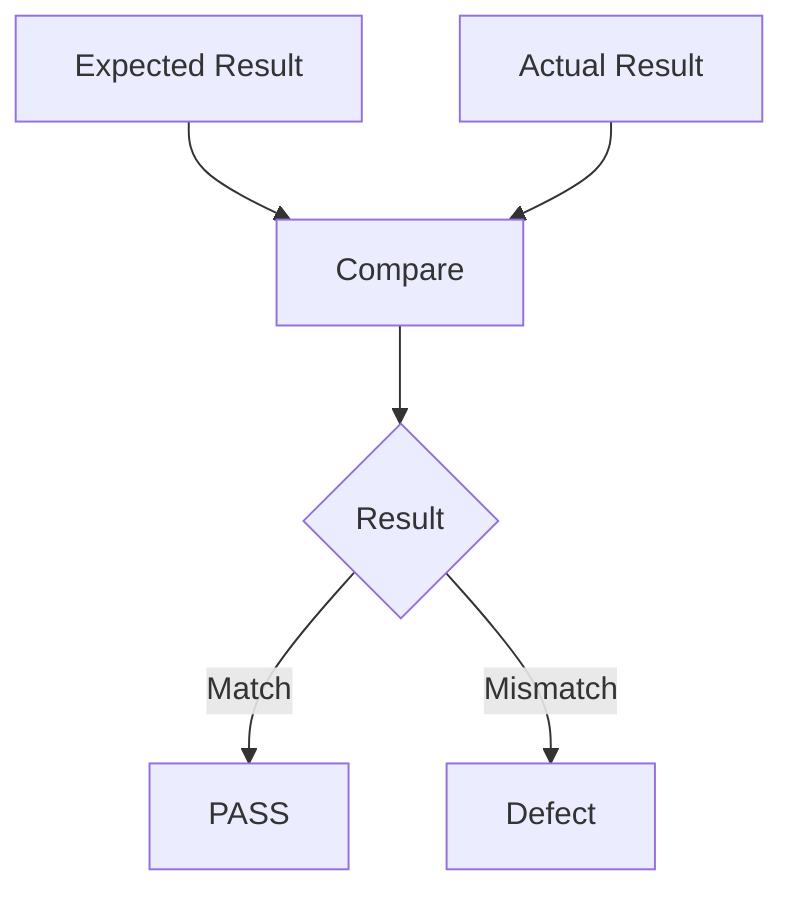
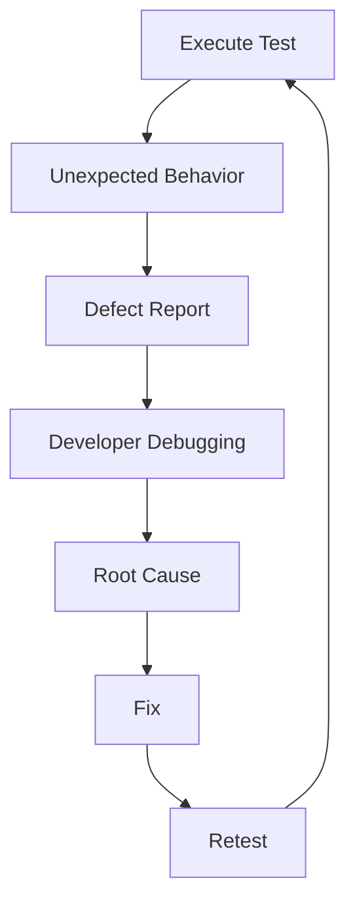
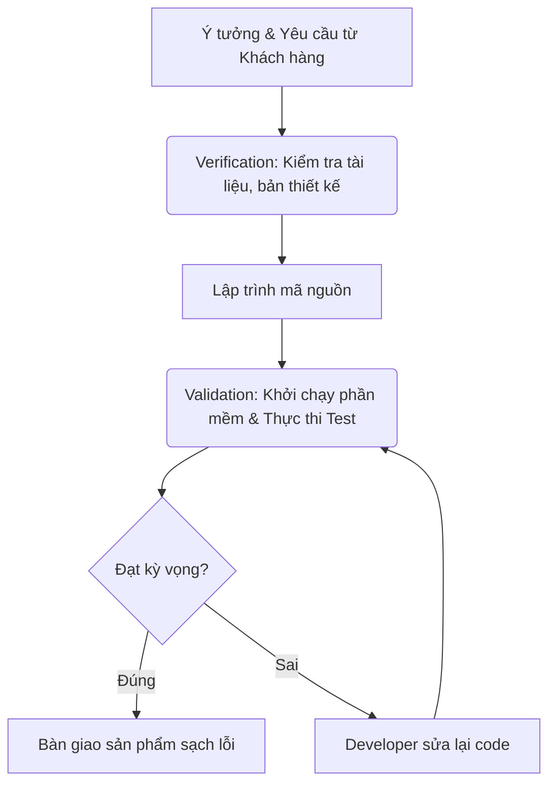
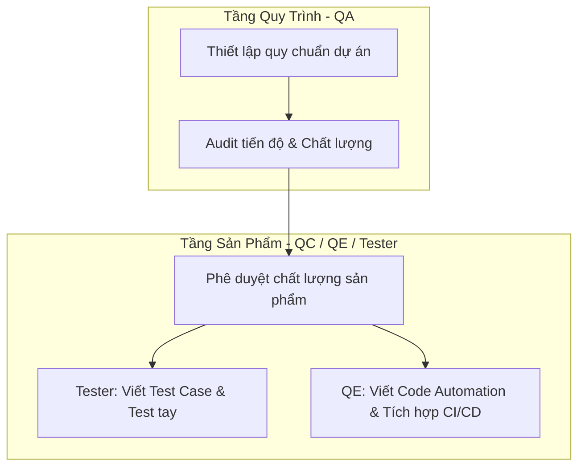
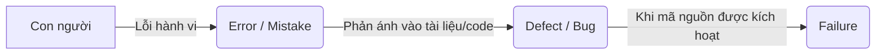
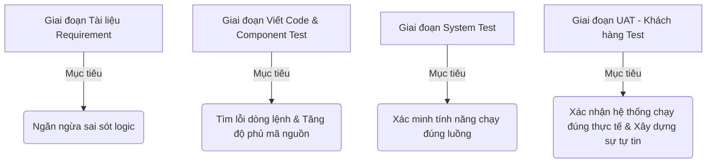
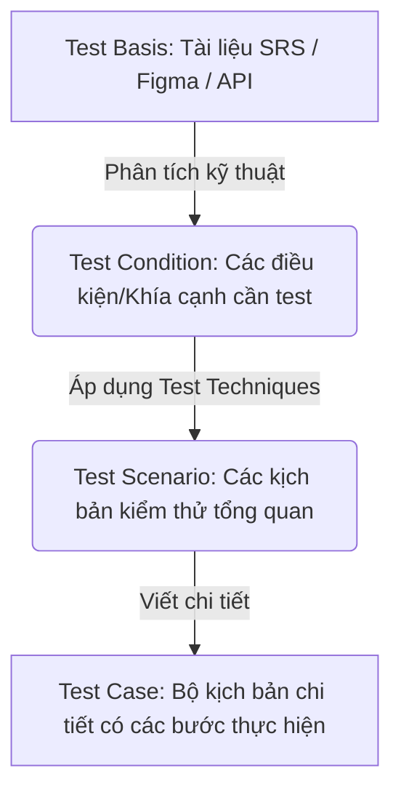
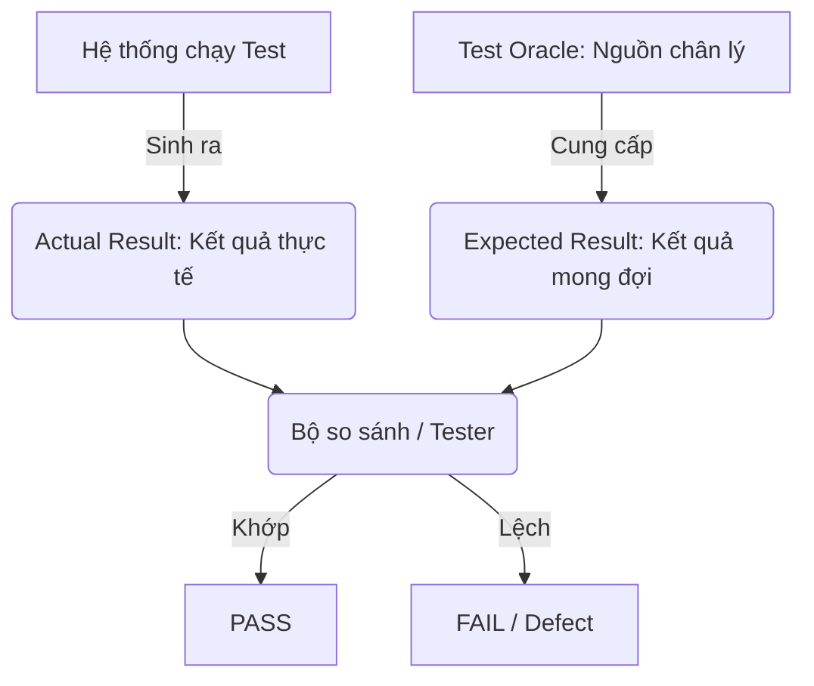
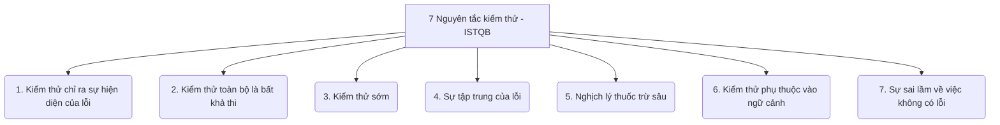

# 📁 01. Testing Fundamentals & QA Mindset (`01-testing-fundamentals/`)

*Mục tiêu: Hiểu Testing là gì, tại sao cần Testing và tư duy phản biện của một Tester chuyên nghiệp.*

- [ ] [**1.1. Core Software Testing**](./1_CoreTesting.md)
  - [] [1.1.1. What is Software Testing?](#111-what-is-software-testing)
  - [] [1.1.2. Verification vs Validation](#112-verification-vs-validation)
  - [ ] [1.1.3. QA vs QC vs Tester vs QE](#113-qa-vs-qc-vs-tester-vs-qe)
  - [ ] [1.1.4. Error vs Defect vs Failure](#114-error-vs-defect-vs-failure)
  - [ ] [1.1.5. Test Objective](#115-test-objective)
  - [ ] [1.1.6. Test Basis](#116-test-basis)
  - [ ] [1.1.7. Test Oracle](#117-test-oracle)
  - [ ] [1.1.8. 7 Testing Principles](#118-7-testing-principles)
- [ ] [**1.2. QA Mindset**](./2_QAMindset.md)

# 1.1.1. What is Software Testing?

Kiểm thử phần mềm không phải là một công đoạn độc lập ở cuối dự án, mà là **một chuỗi hoạt động kiểm tra, đánh giá xuyên suốt vòng đời phát triển phần mềm (SDLC)** nhằm xác định sự khác biệt giữa **Thực tế hệ thống (Actual Result)** và **Yêu cầu đề ra (Expected Result)**.

## ⚙️ Bản chất chuyên sâu (Theo tiêu chuẩn ISTQB)
Kiểm thử toàn diện luôn song hành hai hình thức:
* **Static Testing (Kiểm thử tĩnh):** Review tài liệu yêu cầu, kiểm tra thiết kế, soi mã nguồn (Code Review) mà **không cần chạy ứng dụng** để phòng ngừa lỗi từ sớm.
* **Dynamic Testing (Kiểm thử động):** Nhập dữ liệu, bấm nút, gọi API và kiểm tra phản hồi **khi ứng dụng đang vận hành** để xác thực tính năng thực tế.

## 📊 3 Trụ cột mục tiêu cốt lõi (Mô hình QRC)
1. **Quality (Chất lượng):** Đánh giá phần mềm nhằm xác minh tính năng đáp ứng yêu cầu (Requirement), chạy mượt mà, bảo mật cao và tối ưu trải nghiệm người dùng (UX).
2. **Risk Mitigation & Bug Hunting (Giảm thiểu rủi ro & Săn lỗi):** Chủ động săn tìm defect nhằm cung cấp thông tin đáng tin cậy về rủi ro cho các bên liên quan, hỗ trợ đưa ra quyết định phát hành sản phẩm.
3. **Cost Efficiency (Tối ưu chi phí):** Phát hiện lỗi càng sớm, chi phí sửa chữa càng rẻ. Nếu sửa lỗi ở giai đoạn tài liệu yêu cầu (Requirement) chỉ tốn \$1, thì khi phần mềm đã phát hành (Production), chi phí khắc phục hậu quả có thể lên tới \$100+.

## 🔄 Expected Result vs Actual Result
Bản chất của Testing là hoạt động so sánh liên tục giữa hai trạng thái kết quả:
* **Expected Result (Kết quả mong đợi):** Kết quả mà hệ thống được kỳ vọng phải tạo ra dựa trên tài liệu yêu cầu (Requirement) hoặc căn cứ kiểm thử (Test Basis).
* **Actual Result (Kết quả thực tế):** Kết quả thực tế nhận được khi chạy kịch bản kiểm thử trên hệ thống.

* **Happy Path (Kịch bản đúng):** Nhập mật khẩu 8 ký tự (Đúng yêu cầu) → Kết quả thực tế trùng khớp mong đợi → Hệ thống báo đăng ký thành công (**PASS**).
* **Unhappy Path (Kịch bản sai):** Nhập mật khẩu 5 ký tự (Sai yêu cầu) → Kết quả thực tế sai lệch mong đợi → Ghi nhận lỗi (**Defect**).

## 🛠️ Phân biệt Testing vs Debugging
Testing không đồng nghĩa với việc tìm và sửa bug. Đây là hai quy trình độc lập phối hợp với nhau:
* **Testing (Kiểm thử):** Do Tester thực hiện nhằm phát hiện bất thường, so sánh kỳ vọng với thực tế, thông báo khiếm khuyết và cung cấp dữ liệu về chất lượng.
* **Debugging (Gỡ lỗi):** Do Developer thực hiện nhằm điều tra nguyên nhân gốc rễ (Root cause) gây ra defect, sửa đổi mã nguồn và xác minh việc sửa lỗi.

## 🧠 Tư duy QA Mindset (Critical Thinking)
Tester không chỉ tìm bug hay hỏi *"Tính năng này có chạy được không?"*, mà phải luôn đặt ra chuỗi câu hỏi phản biện để tìm ra kịch bản biên (Edge-case):
* **What / Why:** Chức năng này phục vụ cho nhu cầu gì của người dùng?
* **What if / What if not:** 
  * *What if input is empty / invalid / too long?* (Nếu dữ liệu trống, sai định dạng, quá dài?)
  * *What if network is disconnected?* (Nếu mất mạng khi đang xử lý?)
  * *What if user clicks twice?* (Nếu người dùng cố tình nhấn nút 2 lần liên tục?)

> ⚠️ **Tư duy cốt lõi cần nhớ:** Kiểm thử chỉ có thể chứng minh phần mềm **đang tồn tại lỗi (Presence of defects)**, chứ không thể khẳng định phần mềm **hoàn toàn sạch lỗi (Absence of defects)**. Kể cả khi tất cả kịch bản đều PASS, những khu vực chưa được kiểm tra vẫn có thể chứa defect ẩn.

## 📚 References (Tài liệu tham khảo 1.1.1)
* [ISTQB® Certified Tester Foundation Level (CTFL) Syllabus v4.0](https://istqb.org) - Section 1.1: *What is Testing?* & Section 1.1.2: *Testing and Debugging*.
* [ISO/IEC/IEEE 29119-1:2022 Standard](https://iso.org) - *Software and systems engineering — Software testing — Part 1: General concepts*.

---

# 1.1.2. Verification vs Validation

Trong kiểm thử phần mềm, **Verification (Xác nhận)** và **Validation (Xác minh)** là hai hoạt động độc lập nhưng bổ trợ chặt chẽ cho nhau nhằm tạo nên một quy trình kiểm soát chất lượng toàn diện. 

Cách phân biệt nhanh nhất được đúc kết qua câu hỏi kinh điển của Giáo sư Barry Boehm:
* **Verification:** *"Are we building the product right?"* (Chúng ta có đang xây dựng sản phẩm đúng cách, đúng thiết kế không?)
* **Validation:** *"Are we building the right product?"* (Chúng ta có đang xây dựng đúng sản phẩm khách hàng thực sự cần không?)

## 📊 Bảng so sánh chi tiết (Chuẩn ISTQB)

| Đặc điểm | Verification (Xác nhận) | Validation (Xác minh) |
| :--- | :--- | :--- |
| **Câu hỏi cốt lõi** | Hệ thống có tuân thủ đúng các tài liệu thiết kế và đặc tả kỹ thuật không? | Hệ thống có đáp ứng đúng nhu cầu thực tế và mong đợi của người dùng cuối không? |
| **Hình thức áp dụng** | **Static Testing (Kiểm thử tĩnh)**: Không chạy mã nguồn. | **Dynamic Testing (Kiểm thử động)**: Chạy ứng dụng thực tế. |
| **Hoạt động chính** | Review tài liệu yêu cầu (Requirement), kiểm tra bản vẽ kiến trúc (Architecture), soi mã nguồn (Code Review). | Thực hiện chạy các kịch bản kiểm thử (Test Execution) trên hệ thống: Unit Test, System Test, UAT. |
| **Giai đoạn diễn ra** | Diễn ra rất sớm, ngay từ khâu ý tưởng và tài liệu. | Diễn ra ở giai đoạn sau, khi đã có sản phẩm chạy được (Build). |
| **Mục tiêu chính** | **Ngăn ngừa lỗi từ gốc (Error Prevention)** trước khi code. | **Phát hiện lỗi hệ thống (Bug Detection)** khi vận hành. |
| **Bên thực hiện** | Business Analyst (BA), Designer, Developer, QA/Tester (khâu review). | Tester/QA Engineer, Khách hàng hoặc Người dùng cuối (giai đoạn UAT). |

## 💡 Ví dụ thực tế liên hoàn (Hệ thống QR Code Ngân hàng)
Hãy tưởng tượng bạn được giao nhiệm vụ kiểm thử một ứng dụng ngân hàng với yêu cầu: *"Xây dựng tính năng chuyển tiền nhanh qua mã QR"*.

1. **Giai đoạn Verification (Kiểm thử tĩnh):**
   * Bạn ngồi review tài liệu đặc tả (Requirement Specs) của BA viết.
   * Bạn phát hiện ra: Tài liệu yêu cầu quét QR nhưng **quên không quy định giới hạn số tiền tối đa** cho mỗi giao dịch quét.
   * Bạn yêu cầu BA sửa lại tài liệu ngay từ lúc này → Đây là **Verification** (Đủ tiêu chuẩn thiết kế trước khi lập trình).

2. **Giai đoạn Validation (Kiểm thử động):**
   * Developer viết code xong và giao cho bạn một bản cài đặt thử nghiệm (Build).
   * Bạn mở ứng dụng trên điện thoại, đưa camera lên quét một mã QR thật, nhập số tiền 10 triệu đồng và bấm "Chuyển khoản".
   * Hệ thống báo chuyển khoản thành công, tài khoản đích nhận được tiền → Đây là **Validation** (Xác thực sản phẩm chạy thực tế giải quyết đúng nhu cầu).

> ⚠️ **Mối quan hệ nhân quả:** Một sản phẩm có thể **Vượt qua phần Verification** (lập trình chính xác 100% từng câu chữ theo tài liệu thiết kế) nhưng vẫn **Thất bại ở phần Validation** (Sản phẩm chạy rất mượt nhưng khi đưa cho khách hàng, khách hàng bảo: *"Giao diện này quá khó dùng, không đúng ý tôi muốn"*). Do đó, Tester bắt buộc phải thực hiện song song cả hai hoạt động.

## 📚 References (Tài liệu tham khảo 1.1.2)
* [ISTQB® Official Glossary](https://istqb.org) - Definitions of *Verification* and *Validation*.
* [IEEE Std 1012-2016 Standard](https://ieee.org) - *IEEE Standard for System, Software, and Hardware Verification and Validation*.
* **Barry Boehm (1981)** - *Software Engineering Economics*, Prentice-Hall.

---

# 1.1.3. QA vs QC vs Tester vs QE

Trong một dự án phát triển phần mềm, việc phân biệt các vai trò bảo đảm và kiểm soát chất lượng là cực kỳ quan trọng. Người mới thường gộp chung tất cả thành "Tester", nhưng thực tế đây là các vị trí có tư duy, công cụ và trách nhiệm hoàn toàn khác nhau.

## 📊 Ma trận phân cấp vai trò (Chuẩn ISTQB & Thực tế Doanh nghiệp)

| Tiêu chí | QA (Quality Assurance) | QC (Quality Control) | Tester | QE (Quality Engineer) |
| :--- | :--- | :--- | :--- | :--- |
| **Bản chất** | **Bảo đảm chất lượng**: Tập trung vào quy trình làm việc. | **Kiểm soát chất lượng**: Tập trung vào sản phẩm cuối cùng. | **Người thực thi**: Tập trung vào tìm lỗi trên sản phẩm. | **Kỹ sư chất lượng**: Tập trung vào kỹ thuật, tự động hóa và tối ưu. |
| **Định hướng** | **Phòng ngừa lỗi** (Proactive - Ngăn bug xảy ra). | **Phát hiện lỗi** (Reactive - Tìm bug khi đã có sản phẩm). | **Phát hiện lỗi** (Reactive - Chạy kịch bản tìm bug). | **Xây dựng hệ thống** (Proactive & Reactive thông qua Code). |
| **Đối tượng tác động** | Quy trình làm việc của con người (SDLC, STLC). | Sản phẩm phần mềm thực tế (Phần mềm, API, Database). | Các chức năng của hệ thống (Giao diện UI, Luồng đi). | Toàn bộ hạ tầng kiểm thử, Code kiểm thử tự động, CI/CD. |
| **Hoạt động chính** | Định nghĩa quy chuẩn, biểu mẫu, Audit quy trình làm việc của Dev/Tester. | Chạy các bài test, phê duyệt sản phẩm đạt hay không đạt chất lượng. | Viết Test Case, thực thi test thủ công (Manual Test), log Bug. | Viết code Automation, thiết lập Framework, tích hợp pipeline CI/CD. |

## 💡 Mô hình phối hợp nhân sự thực tế

Để dễ hình dung cách các vai trò này tương tác với nhau, hãy xem sơ đồ phân cấp dưới đây:

## 🧠 Phân tích chi tiết từng góc nhìn

### 1. QA (Quality Assurance) — Người xây luật
*   **Tư duy:** *"Làm sao để quy trình làm việc tốt hơn để lập trình viên ít tạo ra bug nhất?"*
*   QA không đi tìm bug trong phần mềm. Họ làm việc với con người và quy trình. Họ đưa ra các bộ quy tắc (Ví dụ: Dev trước khi giao code phải tự chạy Unit Test, Tester phải viết Test Case dựa trên SRS).

### 2. QC (Quality Control) — Người thực thi luật (Bao gồm Tester và QE)
*   **Tư duy:** *"Sản phẩm làm ra đã đúng chuẩn để giao cho khách hàng chưa?"*
*   QC là một ban bệ bao gồm cả Tester và QE. Nhiệm vụ của QC là nhảy vào kiểm tra trực tiếp sản phẩm (chạy phần mềm) để tìm xem có lỗi hay không.

### 3. Tester — Người tìm lỗi (Manual Tester)
*   **Tư duy:** *"Hệ thống này có thể hỏng ở những điểm nào? Người dùng sẽ thao tác sai ở đâu?"*
*   Tester tập trung sâu vào nghiệp vụ (Business Logic), đứng từ góc nhìn của người dùng cuối để thiết kế các kịch bản kiểm thử, chạy ứng dụng bằng tay để săn lùng các lỗi logic, lỗi hiển thị.

### 4. QE (Quality Engineer) — Kỹ sư tối ưu bằng công nghệ
*   **Tư duy:** *"Làm sao dùng code và công cụ để tự động hóa quy trình kiểm tra này nhằm tăng tốc độ dự án?"*
*   QE xuất hiện khi dự án cần lên Automation. Họ có tư duy của một lập trình viên, viết code để máy tự động chạy test, thiết lập các Docker container, cấu hình Jenkins/GitHub Actions để hệ thống tự động kiểm tra chất lượng phần mềm mỗi khi có code mới.

> 📊 **Thực tế thị trường:** Tại các công ty vừa và nhỏ ở Việt Nam, vị trí QC và Tester thường bị gộp làm một. Tuy nhiên, khi vào các tập đoàn lớn hoặc công ty làm sản phẩm toàn cầu (Product), các vai trò này sẽ được tách biệt cực kỳ rõ ràng để tối ưu hóa năng suất.

## 📚 References (Tài liệu tham khảo 1.1.3)
* [ISTQB® Certified Tester Foundation Level (CTFL) Syllabus v4.0](https://istqb.org) - Section 1.2.2: *Quality Assurance and Testing*.
* [CMMI (Capability Maturity Model Integration)](https://cmmiinstitute.com) - Mô hình chuẩn hóa năng lực và quy trình bảo đảm chất lượng doanh nghiệp.

# 1.1.4. Error vs Defect vs Failure

Trong ngành kiểm thử phần mềm, việc sử dụng chính xác thuật ngữ lỗi không chỉ giúp Tester giao tiếp chuyên nghiệp với Lập trình viên mà còn là câu hỏi bắt buộc trong mọi cuộc phỏng vấn. Theo tiêu chuẩn **ISTQB**, các khái niệm này nằm trong một chuỗi quan hệ nhân quả do con người tạo ra.

## 🔄 Chuỗi dịch chuyển lỗi (Quan hệ Nhân - Quả)

Lỗi không tự nhiên sinh ra, chúng dịch chuyển qua từng môi trường dựa trên hành vi của con người:

## 📊 Bảng phân biệt bộ tứ khái niệm cốt lõi

| Thuật ngữ | Định nghĩa bản chất (ISTQB) | Môi trường / Địa điểm xuất hiện | Ví dụ thực tế |
| :--- | :--- | :--- | :--- |
| **Error (Mistake)** | Hành vi sai sót, nhầm lẫn do con người (Lập trình viên, BA, Designer) vô tình tạo ra khi tư duy hoặc làm việc. | Nằm trong **tư duy hoặc hành động** của con người trước khi số hóa. | Developer hiểu nhầm yêu cầu, BA viết thiếu logic tính tiền trong tài liệu specs. |
| **Bug** | Tên gọi không chính thức (informal) của Defect, thường được dùng khi **Developer** tự chạy code, tìm thấy sai sót và sửa trong mã nguồn. | Nằm trong **Mã nguồn (Code)** của lập trình viên ở máy cá nhân (Local). | Developer chạy thử hàm tính tiền thấy kết quả bị sai số và tự sửa trực tiếp trong file java. |
| **Defect (Fault / Flaw)** | Tên gọi chính thức (formal) của lỗi khi **Tester** chạy kiểm thử, phát hiện sản phẩm chạy sai yêu cầu và ghi nhận vào hệ thống quản lý. | Nằm trên **Hệ thống Test** (Môi trường QA/Staging). | Tester nhập mật khẩu 5 ký tự (yêu cầu tối thiểu phải là 8) nhưng hệ thống vẫn cho đăng ký thành công. Tester tạo một **Defect Report**. |
| **Failure** | Sự cố hệ thống không thể thực hiện đúng chức năng của nó khi phân phối tới người dùng cuối. | Xuất hiện ở môi trường **Vận hành thực tế (Production)**. | Khách hàng đang thực hiện thanh toán đơn hàng thì ứng dụng bị sập hoàn toàn, văng ra màn hình chính (Crash). |

## 💡 Ví dụ liên hoàn để bạn dễ hình dung

1. **Error:** Lập trình viên thức đêm code dẫn đến buồn ngủ, vô tình viết sai điều kiện vòng lặp xử lý dữ liệu từ `for (i=0; i<=10; i++)` thành `i<10`.
2. **Defect / Bug:** Sai sót này nằm im trong file mã nguồn `ProcessData.java` tạo thành một khiếm khuyết trong phần mềm.
3. **Failure:** Phần mềm được đóng gói và phát hành tới người dùng. Khi khách hàng nhấn nút xử lý dữ liệu đến bản ghi thứ 11, do điều kiện vòng lặp viết thiếu ở trên, hệ thống không tìm thấy dữ liệu và ứng dụng bị đóng băng hoàn toàn. Hệ thống chính thức rơi vào trạng thái sụp đổ (**Failure**).

> ⚠️ **Lưu ý chuyên gia:** 
> * Mọi **Failure** đều bắt nguồn từ **Defect**, nhưng không phải **Defect** nào cũng gây ra **Failure**. Một defect nằm trong một nhánh code cũ không bao giờ được người dùng bấm tới thì sẽ mãi mãi nằm ẩn dưới dạng Defect và không bao giờ kích hoạt thành Failure.
> * Ngoài sai sót từ con người (Error), Defect và Failure có thể xảy ra do tác động từ môi trường bên ngoài như: Bức xạ, từ trường, ô nhiễm hoặc phần cứng máy chủ gặp sự cố vật lý.

## 📚 References (Tài liệu tham khảo 1.1.4)
* [ISTQB® Certified Tester Foundation Level (CTFL) Syllabus v4.0](https://istqb.org) - Section 1.2.3: *Errors, Defects, Defects, and Failures*.
* [ISTQB® Official Glossary](https://istqb.org) - Definitions of *Error*, *Bug*, *Defect*, and *Failure*.

# 1.1.5. Test Objective

**Test Objective (Mục tiêu kiểm thử)** là lý do, mục đích cốt lõi định hình cho toàn bộ hoạt động kiểm thử trong một dự án. Nhiều người mới bắt đầu thường lầm tưởng mục tiêu duy nhất của kiểm thử là "tìm bug", nhưng thực tế, tùy thuộc vào từng giai đoạn của dự án và ngữ cảnh của hệ thống, mục tiêu kiểm thử sẽ dịch chuyển một cách linh hoạt.

## 🎯 Hệ thống các mục tiêu kiểm thử cốt lõi (Theo ISTQB)

1. **Ngăn ngừa lỗi (Preventing defects):** Thực hiện review tài liệu yêu cầu, thiết kế hệ thống và mã nguồn từ sớm để phát hiện các mâu thuẫn logic trước khi lập trình viên bắt tay vào viết code.
2. **Xác thực yêu cầu (Evaluating work products):** Kiểm tra xem các sản phẩm trung gian (như tài liệu specs, bản thiết kế giao diện, mã nguồn) đã đáp ứng đúng và đầy đủ các yêu cầu đã thỏa thuận với khách hàng hay chưa.
3. **Xác minh tính năng (Verifying requirements):** Xác thực xem hệ thống phần mềm chạy thực tế có thực hiện đúng, đầy đủ tất cả các tính năng như tài liệu đặc tả mô tả hay không.
4. **Xác nhận mức độ hoàn thiện (Validating system behavior):** Đảm bảo hệ thống phần mềm hoạt động đúng như mong đợi của người dùng cuối trong môi trường vận hành thực tế (đáp ứng đúng bài toán nghiệp vụ của họ).
5. **Xây dựng sự tự tin (Building confidence):** Cung cấp các số liệu kiểm thử minh bạch (Ví dụ: 98% Test Cases đã PASS, không còn lỗi nghiêm trọng) để tạo sự an tâm cho ban quản lý dự án trước khi bấm nút phát hành sản phẩm.
6. **Cung cấp thông tin rủi ro (Providing information):** Báo cáo rõ ràng về các rủi ro còn tồn đọng trong phần mềm giúp các bên liên quan (Stakeholders) đưa ra quyết định kinh doanh chính xác (như có nên trì hoãn ngày ra mắt để sửa lỗi hay không).
7. **Tuân thủ tiêu chuẩn (Complying with standards):** Đảm bảo sản phẩm phần mềm tuân thủ đúng các quy định pháp lý, tiêu chuẩn của ngành (Ví dụ: Tiêu chuẩn bảo mật dữ liệu thẻ PCI-DSS đối với app ngân hàng).

## 📊 Sự dịch chuyển mục tiêu theo ngữ cảnh dự án

Mục tiêu kiểm thử không cố định mà thay đổi rõ rệt theo các cấp độ và giai đoạn kiểm thử:

*   **Trong giai đoạn đầu (Review tài liệu):** Mục tiêu tối cao là **Ngăn ngừa lỗi** (`Error Prevention`). Việc phát hiện ra một câu viết mơ hồ trong tài liệu specs sẽ cứu dự án khỏi hàng tuần code sai sau này.
*   **Trong giai đoạn kiểm thử hệ thống (System Testing):** Mục tiêu chính là **Tìm càng nhiều lỗi càng tốt** (`Bug Hunting`) để giảm thiểu tối đa rủi ro lỗi trôi ra môi trường thực tế.
*   **Trong giai đoạn kiểm thử nghiệm thu (UAT):** Mục tiêu không còn là tìm bug nữa, mà là **Xác nhận hệ thống đã sẵn sàng** (`Validation`) và **Xây dựng sự tự tin** cho khách hàng thấy phần mềm đã đủ điều kiện để đưa vào kinh doanh.
*   **Đối với hệ thống đang vận hành (Maintenance Testing):** Mục tiêu chính lại dịch chuyển sang kiểm tra xem các thay đổi mới hoặc bản cập nhật có vô tình làm hỏng các tính năng cũ đang chạy ổn định hay không (`Regression Testing`).

> ⚠️ **Tư duy chuyên gia cần nhớ:** 
> Mục tiêu tối hậu của một kỹ sư QA/Tester không phải là phá hủy phần mềm hay cố tình đối đầu với Developer để tìm ra nhiều lỗi nhất có thể. Mục tiêu lớn nhất là **cung cấp thông tin đáng tin cậy về chất lượng và mức độ rủi ro của sản phẩm** để hỗ trợ doanh nghiệp đưa ra các quyết định sáng suốt.

## 📚 References (Tài liệu tham khảo 1.1.5)
* [ISTQB® Certified Tester Foundation Level (CTFL) Syllabus v4.0](https://istqb.org) - Section 1.1.1: *Test Objectives*.
* [IEEE Std 829-2008](https://ieee.org) - *IEEE Standard for Software and System Test Documentation*.

# 1.1.6. Test Basis

**Test Basis (Căn cứ kiểm thử)** được định nghĩa là tất cả các nguồn kiến thức, tài liệu, thông tin được sử dụng làm cơ sở để phân tích, thiết kế và xây dựng kịch bản kiểm thử (Test Case). 

Nói một cách đơn giản: **Test Basis là "nguồn chân lý" giúp Tester biết hệ thống phải hoạt động như thế nào để viết ra bộ Test Case chuẩn xác.** Nếu không có Test Basis, Tester sẽ không có căn cứ để xác định kết quả mong đợi (Expected Result).

## 🗂️ Các loại tài liệu cấu thành Test Basis (Chuẩn ISTQB)

Tùy thuộc vào quy trình và mức độ chuyên nghiệp của dự án, Test Basis có thể tồn tại dưới nhiều dạng khác nhau:

1. **Tài liệu đặc tả yêu cầu (Requirement Specifications):**
   * **BRD (Business Requirement Document):** Tài liệu yêu cầu nghiệp vụ do khách hàng hoặc Product Owner viết.
   * **SRS (Software Requirement Specification):** Tài liệu đặc tả kỹ thuật chi tiết của hệ thống do Business Analyst (BA) viết.
2. **Tài liệu thiết kế (Design Specifications):**
   * Bản vẽ kiến trúc phần mềm (Software Architecture).
   * Bản thiết kế cơ sở dữ liệu (Database Diagrams / ERD).
   * Bản thiết kế giao diện người dùng (Mockup / Wireframe / Figma).
3. **Tài liệu tích hợp kỹ thuật:**
   * Tài liệu đặc tả API (API Documentation / Swagger).
   * Tài liệu mô tả cấu trúc dữ liệu trao đổi (JSON/XML Specs).
4. **Mã nguồn hệ thống (Mã code):** Được dùng làm căn cứ kiểm thử chính trong giai đoạn kiểm thử hộp trắng (White-box Testing / Unit Testing).
5. **Tiêu chuẩn và Quy chuẩn (Standards & Regulations):** Các bộ luật pháp lý của chính phủ (Ví dụ: Luật an toàn thông tin mạng) hoặc tiêu chuẩn ngành (Ví dụ: ISO 27001 về bảo mật).
6. **Kinh nghiệm và tri thức (Implicit Knowledge):** Trong các dự án thiếu hụt tài liệu (Agile/Scrum chạy quá nhanh), Test Basis có thể là kiến thức nghiệp vụ có sẵn của Tester hoặc hành vi của một ứng dụng cũ tương đương đang chạy trên thị trường.

## 🔄 Quy trình dịch chuyển từ Test Basis sang Test Case

Tester không viết Test Case một cách cảm tính mà tuân theo chuỗi phân rã thông tin từ vĩ mô đến vi mô:

## 📊 Ứng dụng: Ma trận truy xuất nguồn gốc (Requirements Traceability Matrix - RTM)

Trong quá trình phân tích Test Basis, Tester chuyên nghiệp sẽ lập một bảng ma trận gọi là **RTM** để liên kết chéo giữa **Yêu cầu tài liệu (Requirement ID)** và **Kịch bản kiểm thử (Test Case ID)**.

* **Mục đích:** 
  * Đảm bảo không có bất kỳ yêu cầu nào trong tài liệu bị bỏ sót (Không có tính năng nào bị quên không test).
  * Giúp quản lý phạm vi kiểm thử (Test Coverage): Khi một điều khoản trong tài liệu SRS thay đổi, Tester có thể tra cứu ngay bảng RTM để biết chính xác những Test Cases nào cần phải cập nhật, tránh việc sửa sót code hoặc kịch bản.

> ⚠️ **Tư duy chuyên gia cần nhớ:** 
> Khi bắt đầu một dự án, hành động đầu tiên của Tester là phải đi **Verify (Xác nhận) chất lượng của Test Basis**. Nếu tài liệu SRS của BA viết bị sai logic, mâu thuẫn hoặc mơ hồ, Tester phải đặt câu hỏi phản biện (`Requirement Questioning`) để làm sạch tài liệu ngay lập tức. Đây chính là bản chất của hoạt động **Static Testing (Kiểm thử tĩnh)** giúp ngăn ngừa lỗi từ trong trứng nước.

## 📚 References (Tài liệu tham khảo 1.1.6)
* [ISTQB® Certified Tester Foundation Level (CTFL) Syllabus v4.0](https://istqb.org) - Section 1.4.1: *Test Analysis (Evaluating the Test Basis)*.
* [ISO/IEC/IEEE 29119-2:2021 Standard](https://iso.org) - *Software and systems engineering — Software testing — Part 2: Test processes*.

# 1.1.7. Test Oracle

**Test Oracle (Nguồn chân lý kiểm thử)** là một cơ chế, một nguồn thông tin độc lập được sử dụng để xác định xem kết quả thực tế thu được từ phần mềm (`Actual Result`) là Đúng hay Sai khi đối chiếu với kết quả mong đợi (`Expected Result`).

Nói một cách đơn giản: **Test Oracle là trọng tài đưa ra câu trả lời cuối cùng cho câu hỏi: "Kết quả chạy phần mềm như thế này đã chuẩn chưa?".** Đối với Manual Tester, Oracle có thể là một tài liệu; đối với Automation Tester, Oracle là một đoạn code kiểm tra tính đúng đắn (`Assertion`).

## 👁️ Tại sao Tester lại cần Test Oracle?

Trong nhiều trường hợp thực tế, tài liệu đặc tả yêu cầu (`Test Basis`) không mô tả chi tiết tất cả các kịch bản hoặc hoàn toàn không tồn tại (Dự án làm gấp, tài liệu lỗi thời). Khi đó, Tester không thể tự đoán mò hệ thống chạy thế nào là đúng mà phải tìm kiếm các **Test Oracle** để làm chỗ dựa cho tư duy kiểm thử.

## 🗂️ Các loại Test Oracle phổ biến trong dự án

1. **Hệ thống cũ hoặc Sản phẩm của đối thủ (Existing System / Competitor Product):**
   * Khi kiểm thử một tính năng thông dụng (Ví dụ: Tính năng "Giỏ hàng" của một trang thương mại điện tử mới), bạn có thể lấy hành vi chuẩn của Amazon hoặc Shopee làm Test Oracle để đối chiếu xem logic tính tiền, hiển thị thuế của app mình đã hợp lý chưa.
2. **Tiêu chuẩn quốc tế và Quy chuẩn ngành (Standards & Regulations):**
   * Đối với ứng dụng thanh toán, các quy định định dạng thông điệp của tổ chức thẻ quốc tế (ISO 8583) hoặc tiêu chuẩn bảo mật PCI-DSS chính là Test Oracle tối cao.
3. **Ý kiến của Chuyên gia nghiệp vụ (Domain Expert / Product Owner):**
   * Khi tài liệu viết mơ hồ và tính năng quá đặc thù, câu trả lời trực tiếp từ khách hàng hoặc chuyên gia đầu ngành trong dự án (SME) sẽ đóng vai trò là Test Oracle để Tester viết Expected Result.
4. **Mô hình toán học độc lập (Independent Model / Spreadsheet):**
   * Nếu bạn test một tính năng tính toán lương phức tạp hoặc chấm công, Tester thường tự lập một file Excel độc lập, tự viết công thức toán học vào đó. Kết quả tính toán tự động từ file Excel của Tester chính là Test Oracle để so sánh với kết quả hiển thị trên phần mềm của Dev code.
5. **Trạng thái logic tự nhiên (Oracle bằng logic thực tế):**
   * Ví dụ: Khi người dùng nhấn nút "Xóa tài khoản", hệ thống không được phép cho người dùng đó đăng nhập lại nữa. Đây là logic hiển nhiên không cần tài liệu nào phải viết ra.

## ⚠️ Thách thức: Bài toán "Vô phương tìm Oracle" (The Oracle Problem)

Trong ngành kiểm thử, **The Oracle Problem** xảy ra khi Tester hoàn toàn không có cách nào (hoặc tốn chi phí quá lớn) để xác định xem kết quả phần mềm trả ra có chính xác hay không.

* **Ví dụ:** Bạn kiểm thử một thuật toán Trí tuệ nhân tạo (AI/LLM) dự đoán thời tiết hoặc sinh văn bản, hoặc một game đồ họa 3D giả lập vụ nổ vũ trụ. Do không có một kết quả mẫu chính xác tuyệt đối nào tồn tại trước đó để làm "chân lý", việc xác định tính đúng/sai của hệ thống trở nên cực kỳ khó khăn. Khi đó, Tester phải áp dụng các kỹ thuật nâng cao như **Metamorphic Testing** (Kiểm thử biến hình) để giải quyết.

> 🧠 **Tư duy chuyên gia cần nhớ:** 
> Một Tester giỏi không bao giờ thực hiện bài test khi chưa xác định được Test Oracle cho kịch bản đó. Việc chạy test bừa bãi mà không biết trước kết quả mong đợi thế nào là đúng sẽ dẫn đến tình trạng bỏ sót lỗi nghiêm trọng, vì bạn có thể nhìn thấy lỗi hiển thị ngay trước mắt nhưng lại nghĩ đó là tính năng đúng của hệ thống.

## 📚 References (Tài liệu tham khảo 1.1.7)
* [ISTQB® Certified Tester Foundation Level (CTFL) Syllabus v4.0](https://istqb.org) - Glossary: *Test Oracle*.
* **William E. Howden (1978)** - *Theoretical and Practical Foundations of Software Testing*, IEEE Transactions on Software Engineering (Bài nghiên cứu đặt nền móng cho khái niệm Test Oracle).

# 1.1.8. 7 Testing Principles

Trong ngành kiểm thử phần mềm, **7 Nguyên tắc kiểm thử (7 Testing Principles)** theo tiêu chuẩn ISTQB v4.0 là bộ quy tắc cốt lõi giúp Tester định hình tư duy chiến lược, tối ưu hóa nguồn lực và tránh những hiểu lầm nghiêm trọng về mặt kỹ thuật trong dự án.

## 🗺️ Sơ đồ tổng quan 7 Nguyên tắc kiểm thử

---

## 📊 Phân tích chi tiết từng nguyên tắc

### 1. Testing shows the presence of defects, not their absence (Kiểm thử chỉ ra sự hiện diện của lỗi, chứ không chứng minh được sự sạch lỗi)
*   **Bản chất:** Hoạt động kiểm thử chỉ có thể đưa ra bằng chứng cho thấy phần mềm **đang tồn tại lỗi**, chứ không thể đưa ra một lời khẳng định tuyệt đối rằng phần mềm **100% không còn lỗi**.
*   **Hệ quả cho Tester:** Kể cả khi bạn chạy một bộ kịch bản 1,000 Test Cases và tất cả đều `PASS`, bạn chỉ chứng minh được hệ thống chạy đúng trên 1,000 trường hợp đó. Những góc tối chưa được sờ tới hoặc các điều kiện vận hành thực tế khác vẫn có thể chứa lỗi ẩn.

### 2. Exhaustive testing is impossible (Kiểm thử toàn bộ/tất cả là bất khả thi)
*   **Bản chất:** Việc kiểm thử tất cả các tổ hợp dữ liệu đầu vào, tiền điều kiện và các luồng đi của hệ thống là điều không thể thực hiện được vì nó đòi hỏi một nguồn thời gian và chi phí vô hạn.
*   **Hệ quả cho Tester:** Thay vì cố gắng test mọi thứ vô ích, Tester phải áp dụng các kỹ thuật thiết kế kịch bản (`Test Design Techniques`) như phân vùng tương đương, phân tích giá trị biên và chiến lược **Kiểm thử dựa trên rủi ro (`Risk-based Testing`)** để tập trung nguồn lực vào những phần quan trọng nhất.

### 3. Early testing saves time and money (Kiểm thử càng sớm càng tiết kiệm thời gian và chi phí)
*   **Bản chất:** Hoạt động kiểm thử nên được bắt đầu ngay từ giai đoạn đầu tiên của vòng đời phát triển phần mềm (SDLC).
*   **Hệ quả cho Tester:** Áp dụng chiến lược **Kiểm thử tĩnh (`Static Testing`)** để review tài liệu yêu cầu (Requirements) và bản thiết kế. Nếu phát hiện một lỗi logic ngay trên file Word, chi phí sửa đổi gần như bằng $0. Nếu để lỗi đó trôi ra môi trường thực tế (Production), chi phí khắc phục hậu quả có thể tăng lên gấp hàng trăm lần.

### 4. Defects cluster together (Sự tập trung của lỗi / Nguyên lý Pareto)
*   **Bản chất:** Phần lớn các lỗi nghiêm trọng được phát hiện trong quá trình kiểm thử thường chỉ tập trung vào một số ít các mô-đun (Module) cốt lõi hoặc phức tạp của hệ thống. Đây chính là hiện tượng ứng dụng nguyên lý Pareto 80/20 vào kiểm thử: *80% lỗi nằm ở 20% lượng code*.
*   **Hệ quả cho Tester:** Tester chuyên nghiệp cần phân tích lịch sử log bug để nhận diện đâu là các module "nhạy cảm", từ đó tập trung thiết kế các kịch bản kiểm thử hồi quy (`Regression Test`) sâu hơn vào khu vực đó.

### 5. Beware of the pesticide paradox (Tránh nghịch lý thuốc trừ sâu)
*   **Bản chất:** Nếu một bộ kịch bản kiểm thử tự động hoặc thủ công cứ lặp đi lặp lại nhiều lần không thay đổi, hệ thống sẽ tự sinh ra cơ chế "kháng thuốc". Bộ Test Cases đó sẽ không thể giúp bạn tìm thêm bất kỳ lỗi mới nào nữa.
*   **Hệ quả cho Tester:** Tester cần liên tục rà soát, cập nhật và bổ sung các kịch bản kiểm thử mới. Cần đứng dưới nhiều góc nhìn khác nhau của người dùng để thay đổi bộ dữ liệu test (`Test Data`), nhằm phát hiện các bug tiềm ẩn ở các nhánh code mới sửa.

### 6. Testing is context dependent (Kiểm thử phụ thuộc hoàn toàn vào ngữ cảnh)
*   **Bản chất:** Không có một phương pháp hay quy trình kiểm thử nào có thể áp dụng giống hệt nhau cho mọi dự án. Mỗi loại phần mềm đòi hỏi một chiến lược tiếp cận hoàn toàn khác biệt.
*   **Ví dụ:** Kiểm thử một ứng dụng thương mại điện tử (E-commerce) sẽ tập trung vào luồng thanh toán và giao diện người dùng. Ngược lại, kiểm thử một phần mềm điều khiển thiết bị y tế hoặc ứng dụng ngân hàng (`Fintech`) sẽ đặt mục tiêu an toàn bảo mật, tính toán chính xác và độ chịu tải lên hàng đầu.

### 7. Absence-of-errors fallacy (Sự sai lầm về quan niệm không có lỗi)
*   **Bản chất:** Việc sửa hết 100% các lỗi mà Tester tìm thấy và xây dựng một phần mềm chạy mượt mà không lỗi vẫn hoàn toàn vô nghĩa nếu sản phẩm đó **không đáp ứng đúng nhu cầu thực tế của khách hàng** hoặc **quá khó sử dụng**.
*   **Hệ quả cho Tester:** Đừng chỉ chăm chăm đi tìm bug kỹ thuật. Hãy luôn giữ tư duy đặt câu hỏi phán đoán nghiệp vụ (`Validation Mindset`), đảm bảo rằng tính năng đang test thực sự giải quyết được bài toán kinh doanh của khách hàng và mang lại trải nghiệm tốt cho người dùng cuối.

---

## 📚 References (Tài liệu tham khảo 1.1.8)
* [ISTQB® Certified Tester Foundation Level (CTFL) Syllabus v4.0](https://istqb.org) - Section 1.3: *Principles of Testing*.
* **Cem Kaner (1997)** - *The Pesticide Paradox (Nghịch lý thuốc trừ sâu)*, Proceedings of the Southern California Quality Assurance Association.

