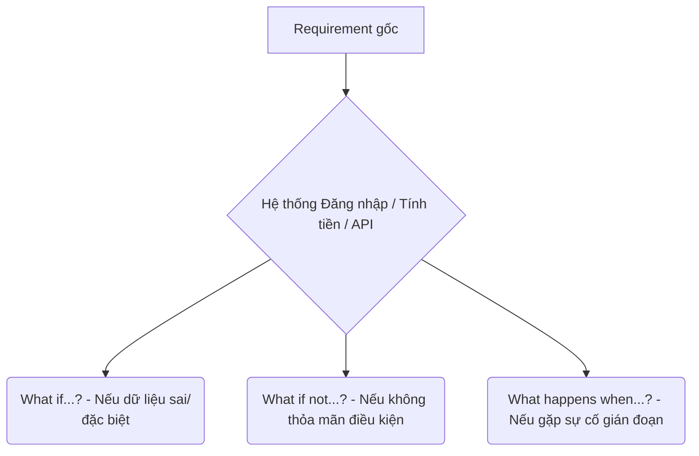
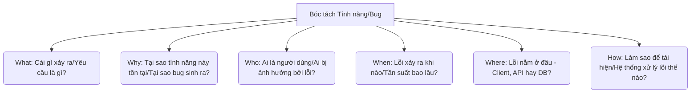
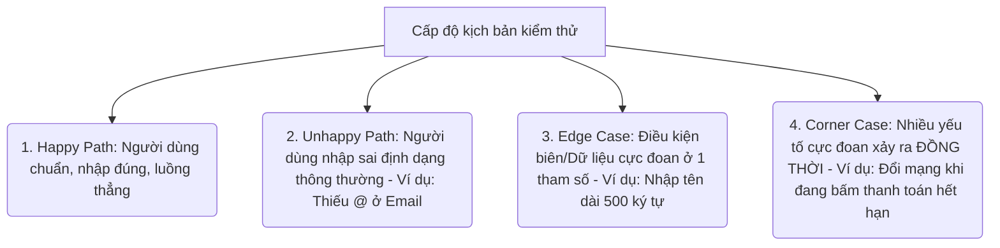
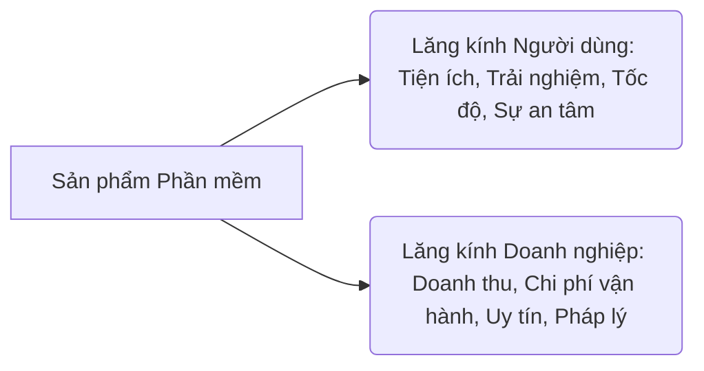
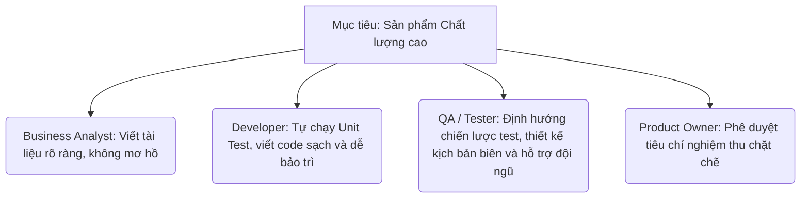

# 📁 01. Testing Fundamentals & QA Mindset (`01-testing-fundamentals/`)

*Mục tiêu: Hiểu Testing là gì, tại sao cần Testing và tư duy phản biện của một Tester chuyên nghiệp.*

- [ ] [**1.1. Core Software Testing**](1_CoreTesting.md)
- [ ] [**1.2. QA Mindset**](2_QAMindset.md)
  - [ ] [1.2.1. Requirement Questioning](#121-requirement-questioning)
  - [ ] [1.2.2. Critical Thinking](#122-critical-thinking)
  - [ ] [1.2.3. Edge-case Thinking](#123-edge-case-thinking)
  - [ ] [1.2.4. User & Business Perspective](#124-user--business-perspective)
  - [ ] [1.2.5. Quality Ownership](#125-quality-ownership)

# 1.2.1. Requirement Questioning

**Requirement Questioning (Kỹ thuật đặt câu hỏi phản biện yêu cầu)** là kỹ năng cốt lõi của một Tester khi thực hiện kiểm thử tĩnh (`Static Testing`). Thay vì chấp nhận tài liệu yêu cầu (SRS, User Story) một cách thụ động, Tester sẽ chủ động phân tích, tìm ra các điểm mâu thuẫn, mơ hồ hoặc thiếu sót, sau đó đặt câu hỏi cho Business Analyst (BA) hoặc Product Owner (PO) để làm rõ.

Hoạt động này hiện thực hóa nguyên lý số 3 của ISTQB: **Early testing saves time and money** (Kiểm thử càng sớm càng tiết kiệm).

## 🎯 4 Tiêu chí đánh giá một tài liệu Requirement đạt chuẩn

Khi đọc tài liệu yêu cầu, Tester cần soi chiếu qua 4 bộ lọc kỹ thuật sau để phát hiện lỗ hổng logic:

1. **Tính rõ ràng (Clarity/Ambiguity):** Yêu cầu có bị viết mơ hồ, đa nghĩa không? Lập trình viên khác nhau đọc có hiểu thành nhiều nghĩa khác nhau không?
2. **Tính đầy đủ (Completeness):** Yêu cầu đã bao phủ hết tất cả các trường hợp có thể xảy ra chưa? Có kịch bản nào bị bỏ quên không?
3. **Tính nhất quán (Consistency):** Logic ở trang này có bị xung đột, đá nhau với logic ở trang khác trong cùng một tài liệu không?
4. **Tính khả kiểm (Testability):** Yêu cầu này có thể đo lường và kiểm thử được không? Hay viết theo kiểu định tính mơ hồ?

---

## 🛠️ Ma trận đặt câu hỏi phản biện của Tester (The "What-If" Matrix)

Để tìm ra các kịch bản biên (`Edge-cases`), Tester chuyên nghiệp sử dụng kỹ thuật đặt câu hỏi xoay quanh mô hình hành vi hệ thống:

### 💡 Các mẫu câu hỏi kinh điển áp dụng vào dự án thực tế:

| Tình huống trong tài liệu | Lỗ hổng logic phát hiện | Câu hỏi phản biện của Tester |
| :--- | :--- | :--- |
| *"Hệ thống chạy mượt mà, tải trang nhanh chóng."* | **Thiếu tính khả kiểm (Non-testable):** Thế nào là mượt mà? Thế nào là nhanh chóng? | *"Thời gian tải trang cụ thể tối đa là bao nhiêu giây? Hệ thống cần chịu tải bao nhiêu người dùng đồng thời để đạt tốc độ này?"* |
| *"Người dùng nhập mật khẩu để đăng ký tài khoản."* | **Thiếu tính rõ ràng (Ambiguity):** Không quy định định dạng mật khẩu. | *"Độ dài tối thiểu và tối đa của mật khẩu là bao nhiêu? Có bắt buộc chứa chữ hoa, số hay ký tự đặc biệt không?"* |
| *"Khi người dùng nhấn nút Hủy, hệ thống sẽ xóa đơn hàng."* | **Thiếu tính đầy đủ (Incompleteness):** Không quy định trạng thái dòng tiền và thông báo xác nhận. | *"Hệ thống có hiển thị popup xác nhận trước khi xóa không? Nếu đơn hàng đã thanh toán thành công thì có được hủy không? Logic hoàn tiền sẽ xử lý như thế nào?"* |
| *"Nếu hệ thống mất kết nối mạng khi đang thanh toán..."* | **Thiếu xử lý kịch bản gián đoạn (Interrupts):** Dễ gây mất tiền của khách hàng. | *"Khi mạng bị đứt giữa chừng, hệ thống sẽ rollback giao dịch hay tự động thực hiện lại (Retry)? Trạng thái đơn hàng lúc đó hiển thị là gì?"* |

---

## 🧠 Quy trình 4 bước đặt câu hỏi chuyên nghiệp (Bug Negotiation)

Khi phát hiện ra lỗi trong tài liệu, cách Tester đặt câu hỏi sẽ quyết định sự hợp tác của BA/PO. Hãy tuân thủ quy trình giao tiếp kỹ thuật sau:

1. **Nghiên cứu kỹ (Analyze):** Đọc kỹ tài liệu, đối chiếu với các tính năng cũ hoặc tiêu chuẩn ngành để chắc chắn nghi ngờ của mình là có cơ sở.
2. **Chuẩn bị giải pháp (Propose):** Đừng chỉ ném ra câu hỏi và bắt BA tự nghĩ. Hãy đề xuất sẵn phương án xử lý dưới góc nhìn của người dùng cuối.
3. **Viết rõ ràng (Log Q&A):** Ghi nhận câu hỏi vào file tracking (Excel/Confluence) theo cấu trúc: *Vị trí tài liệu -> Vấn đề phát hiện -> Câu hỏi làm rõ -> Giải pháp đề xuất*.
4. **Thảo luận cởi mở (Discuss):** Trao đổi với BA/Dev với thái độ xây dựng, hướng tới mục tiêu chung là chất lượng sản phẩm (Quality Ownership), tránh đổ lỗi.

> ⚠️ **Tư duy chuyên gia cần nhớ:** 
> Một câu hỏi thông minh của Tester ở giai đoạn Requirement có giá trị bằng cả trăm Test Cases ở giai đoạn sau. Nếu bạn im lặng và để Dev code theo một tài liệu sai, bạn đang gián tiếp tạo ra hàng loạt Bug nghiêm trọng trên sản phẩm chạy thực tế.

## 📚 References (Tài liệu tham khảo 1.2.1)
* [ISTQB® Certified Tester Foundation Level (CTFL) Syllabus v4.0](https://istqb.org) - Section 1.5.1: *Psychology of Testing* & Section 3.1: *Static Testing Feedback*.
* **Karl Wiegers (2013)** - *Software Requirements (3rd Edition)*, Microsoft Press (Sách gối đầu giường về phân tích và phản biện yêu cầu phần mềm).

# 1.2.2. Critical Thinking

**Critical Thinking (Tư duy phản biện)** trong kiểm thử phần mềm là khả năng chủ động phân tích, đánh giá, lật ngược vấn đề một cách khách quan và có hệ thống dựa trên bằng chứng dữ liệu, thay vì chấp nhận các giả định hay thông tin bề nổi một cách cảm tính. 

Đối với một lập trình viên, họ sử dụng tư duy kiến tạo để xây dựng tính năng. Ngược lại, Tester sử dụng tư duy phản biện để thách thức tính bền vững của tính năng đó, tìm cách trả lời câu hỏi: *"Hệ thống này có thể hỏng hóc hoặc bị lạm dụng ở những điểm nào?"*.

## 📊 Phân biệt Tư duy thông thường và Tư duy phản biện của QA

| Khía cạnh | Tư duy thông thường (Naive Mindset) | Tư duy phản biện của QA (Critical Mindset) |
| :--- | :--- | :--- |
| **Khi đọc tài liệu** | Tin tưởng tuyệt đối: *"Tài liệu viết sao thì hệ thống sẽ chạy đúng như vậy, chỉ cần test theo tài liệu là đủ"*. | Đặt nghi vấn: *"Tài liệu có bỏ sót trường hợp nào không? Logic của tính năng này có mâu thuẫn với tính năng cũ không?"* |
| **Khi Dev bàn giao code** | Chủ quan: *"Developer kỳ cựu viết code module này nên chắc chắn sẽ không có lỗi vặt đâu"*. | Khách quan: *"Mọi dòng code đều có thể chứa bug. Mình phải kiểm tra kỹ cả luồng đúng lẫn luồng sai"*. |
| **Khi Test Case báo PASS** | Thỏa mãn: *"Hệ thống chạy đúng kịch bản rồi, chuyển trạng thái tính năng thành Done thôii"*. | Thận trọng: *"Hệ thống pass trên môi trường test sạch, nhưng dữ liệu lớn hoặc môi trường mạng yếu thì sao?"* |
| **Khi tìm thấy Bug** | Chỉ ghi nhận bề nổi: *"App bị crash khi bấm nút Submit"*. | Đào sâu nguyên nhân: *"App crash do lỗi hiển thị UI, do API trả về 500 hay do tràn dữ liệu bộ nhớ?"* |

---

## 🛠️ Khung tư duy phản biện cốt lõi (5W1H Framework)

Tester chuyên nghiệp không bóc tách hệ thống một cách mù quáng. Họ áp dụng mô hình câu hỏi phản biện 5W1H có hệ thống để cô lập rủi ro:

### 💡 Ứng dụng thực tế vào quy trình kiểm thử:
*   **Thách thức các Giả định (Challenging Assumptions):** Khi Developer nói: *"Cứ yên tâm, hệ thống tự động đồng bộ dữ liệu sau 5 giây rồi"*. Tư duy phản biện sẽ thúc đẩy Tester đặt câu hỏi: *"Điều gì xảy ra nếu mạng bị nghẽn đúng vào giây thứ 5? Dữ liệu có bị ghi đè hoặc mất mát không?"*
*   **Bóc tách Bản chất lỗi (Root Cause Thinking):** Khi phát hiện lỗi giao diện hiển thị sai số tiền thanh toán. Tester có tư duy phản biện không chỉ báo lỗi UI cho Frontend. Họ sẽ mở Chrome DevTools (F12) lên Network để xem API Backend trả về số mấy. Nếu API trả về số sai, lỗi thuộc về Backend; nếu API trả đúng nhưng màn hình hiển thị sai, lỗi thuộc về Frontend. Việc này giúp tiết kiệm thời gian điều tra lỗi của toàn đội dự án.

> ⚠️ **Tư duy chuyên gia cần nhớ:** 
> Tư duy phản biện (Critical Thinking) trong QA không đồng nghĩa với thái độ tiêu cực, hoài nghi vô cớ hay cố tình soi mói để "hạ bệ" Developer. Mục đích tối cao của nó là **độc lập khách quan để bảo vệ chất lượng sản phẩm**, giúp phát hiện ra các rủi ro tiềm ẩn trước khi chúng biến thành sự cố phá hủy trải nghiệm của khách hàng trên Production.

## 📚 References (Tài liệu tham khảo 1.2.2)
* [ISTQB® Certified Tester Foundation Level (CTFL) Syllabus v4.0](https://istqb.org) - Section 1.5.1: *Psychology of Testing (Independent Mindset)*.
* **Cem Kaner, James Bach, Brett Pettichord (2001)** - *Lessons Learned in Software Testing*, Wiley (Cuốn sách kinh điển định hình tư duy phản biện sắc bén cho Tester toàn cầu).

# 1.2.3. Edge-case Thinking

**Edge-case Thinking (Tư duy kịch bản biên)** là khả năng tư duy nhằm tìm ra các tình huống, điều kiện dữ liệu hoặc hành vi người dùng cực kỳ đặc biệt, dị biệt, nằm ngoài luồng vận hành thông thường (`Happy Path`) nhưng hoàn toàn có thể xảy ra trên thực tế.

Trong khi Lập trình viên thường tập trung viết code sao cho hệ thống chạy đúng khi người dùng thao tác đúng (`Happy Path` chiếm 80% thời gian code), thì nhiệm vụ của Tester là phải thắp sáng các "góc tối" (`Unhappy Path`, `Edge-case`, `Corner-case`) – nơi hệ thống dễ dàng bị sụp đổ do thiếu cơ chế phòng vệ.

## 📊 Phân cấp kịch bản: Happy Path vs Corner Case

Để không bị lạc lối khi thiết kế kịch bản, Tester cần phân biệt rõ 4 cấp độ kiểm thử dựa trên tần suất và mức độ dị biệt của dữ liệu:

---

## 🛠️ Bộ khung tư duy tìm Edge-case của Tester chuyên nghiệp

Để tìm ra các kịch bản biên có hệ thống, Tester không đoán mò mà áp dụng các kỹ thuật bóc tách tham số đầu vào và trạng thái môi trường:

### 1. Cực đoan hóa dữ liệu đầu vào (Data Extremes)
*   **Dữ liệu rỗng/Null:** Bỏ trống tất cả các trường thông tin bắt buộc hoặc gửi các giá trị rỗng (`null`, `undefined`) qua API.
*   **Vượt ngưỡng giới hạn:** Nếu ô nhập tuổi quy định từ 18-60, Edge-case sẽ là nhập `17`, `18`, `60`, `61`, `0`, `-1`, hoặc `999`.
*   **Tràn bộ đệm định dạng:** Nhập ký tự có dấu đặc biệt (Emoji, thẻ HTML `<script>`, ký tự tiếng Nhật/Arabic) vào ô tìm kiếm để kiểm tra lỗi bảo mật hoặc vỡ giao diện.

### 2. Cực đoan hóa hành vi người dùng (User Anomalies)
*   **Hành động liên tục (Spamming):** Người dùng cố tình nhấn nút "Thanh toán" hoặc "Đăng ký" 5 lần liên tục trong 1 giây (`Double Click / Race Conditions`). Hệ thống có bị trừ tiền nhiều lần không?
*   **Thao tác phi tuyến tính:** Đang ở trang thanh toán, người dùng nhấn nút `Back` (Quay lại) trên trình duyệt, hoặc tắt tab đột ngột, sau đó mở lại lịch sử để truy cập tiếp.

### 3. Cực đoan hóa môi trường vận hành (Environmental Stress)
*   **Gián đoạn kết nối (Interrupts):** Điện thoại bị ngắt mạng đột ngột (mất sóng, chuyển từ Wi-Fi sang 4G) đúng vào giây hệ thống đang gửi dữ liệu thanh toán qua ngân hàng.
*   **Xung đột tài nguyên:** Điện thoại hết dung lượng bộ nhớ (0MB trống) ngay khi ứng dụng đang tải tệp tin cấu hình về máy.

---

## 💡 Ví dụ thực tế: Tính năng "Áp mã giảm giá (Coupon)"

Khi kiểm thử tính năng nhập mã giảm giá cho đơn hàng, tư duy Edge-case sẽ bóc tách các trường hợp sau:

*   **Happy Path:** Nhập mã `GIAM20` -> Hệ thống giảm 20% tổng tiền -> Chọn thanh toán -> Thành công.
*   **Edge Case 1 (Dữ liệu giá trị không):** Đơn hàng có tổng trị giá 0 đồng (do được tặng quà) nhưng người dùng vẫn cố tình áp mã giảm giá bằng tiền mặt (Ví dụ: Mã giảm 50k cho đơn bất kỳ) -> Hệ thống có tính ra số tiền âm hay không?
*   **Edge Case 2 (Thời gian thực):** Người dùng áp mã giảm giá lúc 23:59:59 (Mã hết hạn vào lúc 00:00:00). Khi hệ thống xử lý đến bước bấm nút Thanh toán thì đã sang ngày mới -> Logic hệ thống sẽ chặn lại hay vẫn cho thanh toán giá cũ?
*   **Edge Case 3 (Xử lý đồng thời):** Hai tài khoản đăng nhập chung một ID, cùng nhấn nút áp một chiếc mã giảm giá duy nhất còn sót lại của hệ thống tại cùng một tích tắc thời gian (`Race Condition`).

> ⚠️ **Tư duy chuyên gia cần nhớ:** 
> Mục đích của Tư duy kịch bản biên (Edge-case Thinking) không phải là tạo ra hàng vạn Test Cases quái dị để làm khó Lập trình viên một cách vô lý. Bạn phải luôn đối chiếu Edge-case với **mức độ rủi ro (Risk)** và **tác động thực tế (Impact)** tới người dùng. Hãy ưu tiên test những kịch bản biên có khả năng xảy ra trên môi trường Production và gây thiệt hại lớn về tiền bạc hoặc bảo mật trước.

## 📚 References (Tài liệu tham khảo 1.2.3)
* [ISTQB® Certified Tester Foundation Level (CTFL) Syllabus v4.0](https://istqb.org) - Section 4.2.1: *Equivalence Partitioning* & Section 4.2.2: *Boundary Value Analysis*.
* **Boris Beizer (1990)** - *Software Testing Techniques (2nd Edition)*, Van Nostrand Reinhold (Cuốn sách kinh điển đặt nền móng toán học cho việc phân tích các điểm biên và lỗi logic hệ thống).

# 1.2.4. User & Business Perspective

**User & Business Perspective (Tư duy đứng từ góc nhìn Người dùng & Doanh nghiệp)** là năng lực giúp Tester thoát khỏi chiếc hộp kỹ thuật thuần túy để đánh giá phần mềm dưới hai lăng kính: Giá trị sử dụng thực tế của khách hàng (User) và Mục tiêu bài toán kinh doanh của tổ chức (Business). 

Năng lực này giúp Tester khắc phục hoàn toàn nguyên lý số 7 của ISTQB: **Absence-of-errors fallacy** (Sai lầm về việc nghĩ hệ thống sạch lỗi là thành công). Một phần mềm có thể vượt qua 100% các bài test kỹ thuật nhưng vẫn thất bại nếu nó quá khó dùng hoặc không tạo ra tiền cho doanh nghiệp.

## 📊 Phân biệt Tư duy Kỹ thuật thuần túy và Tư duy Nghiệp vụ của QA

| Khía cạnh | Tư duy kỹ thuật thuần túy (Technical QA) | Tư duy Người dùng & Doanh nghiệp (Business QA) |
| :--- | :--- | :--- |
| **Khi kiểm tra tính năng** | Chỉ quan tâm đến tính đúng đắn của logic: *"Bấm nút tính tiền, hệ thống gọi API thành công và trả ra số tiền đúng là được"*. | Quan tâm đến trải nghiệm (UX): *"Nút tính tiền nằm quá sâu, người dùng sẽ mất bao nhiêu thao tác để thanh toán? Giao diện hiển thị giá có rõ ràng không?"* |
| **Khi phân loại độ ưu tiên của Bug** | Đánh giá dựa trên mã code bị lỗi ở đâu: *"Lỗi vỡ font nhẹ ở màn hình chính là lỗi nhỏ (Minor), xếp hàng đợi sửa sau cùng"*. | Đánh giá dựa trên thiệt hại kinh doanh: *"Màn hình chính bị lỗi vỡ font ngay tại Banner chiến dịch Black Friday, làm giảm uy tín thương hiệu và tỷ lệ mua hàng. Phải nâng lên độ ưu tiên cao (High) để sửa ngay"*. |
| **Khi đọc tài liệu yêu cầu** | Đọc để hiểu kịch bản kiểm thử: *"Hệ thống yêu cầu trường Số điện thoại phải nhập đúng 10 số"*. | Đọc để hiểu hành vi người dùng: *"Người dùng nước ngoài có thể nhập mã vùng quốc tế (+84, +1) không? Nếu hệ thống chặn thì sẽ mất tập khách hàng quốc tế"*. |

---

## 🛠️ Bộ đôi lăng kính phân tích sản phẩm (The User-Business Framework)

Tester chuyên nghiệp luôn song hành hai góc nhìn này khi đánh giá bất kỳ một tính năng nào:

### 1. Lăng kính Người dùng (User Perspective)
*   **Persona-based Testing (Kiểm thử theo chân dung người dùng):** Người dùng hệ thống này là ai? Một người già dùng ứng dụng nhận lương hưu sẽ cần font chữ lớn, nút bấm to và luồng đi cực giản đơn. Một game thủ trẻ tuổi sẽ cần tốc độ phản hồi tính bằng mili-giây.
*   **User Journey Verification (Xác thực hành trình khách hàng):** Tester cần chạy thử toàn bộ vòng đời của một người dùng thực tế (Ví dụ: Từ lúc tìm hàng, thêm vào giỏ, áp mã, thanh toán, đến lúc nhận email hóa đơn) để đảm bảo không có bất kỳ "vật cản" nào làm đứt quãng trải nghiệm của họ.

### 2. Lăng kính Doanh nghiệp (Business Perspective)
*   **Business Logic In-depth (Am hiểu sâu sắc nghiệp vụ ngành):** Giá trị tối cao của Tester nằm ở đây. Bạn cần hiểu rõ dòng tiền và quy trình vận hành phía sau (Domain Knowledge). Nếu test ứng dụng Ngân hàng (Fintech), bạn phải hiểu quy trình đối soát tiền giữa các bên cuối ngày. Nếu test Logistic, bạn phải hiểu cách tính phí lưu kho bãi.
*   **Risk & Cost Balancing (Cân bằng giữa Rủi ro và Chi phí):** Tester hiểu doanh nghiệp sẽ biết rằng việc giữ lại một tính năng để test cho đến khi hoàn hảo 100% không bằng việc tung sản phẩm ra thị trường đúng thời điểm (`Time-to-market`) để chiếm thị phần, miễn là các rủi ro nghiêm trọng đã được kiểm soát.

## 💡 Ví dụ thực tế: Tính năng "Đăng ký thẻ tín dụng Online"

*   **Góc nhìn Kỹ thuật:** Tester kiểm tra xem nút Đăng ký có hoạt động không, dữ liệu có đẩy về Database không.
*   **Góc nhìn Người dùng (User):** Tester phát hiện luồng đăng ký bắt người dùng phải chụp ảnh căn cước công dân đến 3 lần ở các bước khác nhau, gây phiền toái lớn. QA đề xuất cải tiến gộp các bước chụp ảnh làm một để tăng tỷ lệ đăng ký thành công.
*   **Góc nhìn Doanh nghiệp (Business):** Tester phát hiện hệ thống cho phép người dùng mở thẻ mà không qua bước kiểm tra nợ xấu (CIC) tự động thông qua API của ngân hàng nhà nước. Đây là một lỗ hổng rủi ro cực lớn về mặt tài chính và pháp lý, có thể khiến doanh nghiệp chịu tổn thất hàng tỷ đồng nợ xấu. QA lập tức nâng cảnh báo lỗi này lên mức cao nhất.

> ⚠️ **Tư duy chuyên gia cần nhớ:** 
> Đừng bao giờ biến mình thành một con robot chỉ biết so sánh tài liệu và bấm nút `PASS/FAIL`. Một Kỹ sư QA thực thụ luôn trăn trở: *"Tính năng này có giúp người dùng hài lòng không? Tính năng này có mang lại giá trị kinh tế hay rủi ro gì cho công ty không?"*. Đó chính là tư duy tạo nên sự khác biệt giữa một Tester tầm trung và một Chuyên gia kiểm thử đầu ngành.

## 📚 References (Tài liệu tham khảo 1.2.4)
* [ISTQB® Certified Tester Foundation Level (CTFL) Syllabus v4.0](https://istqb.org) - Section 1.1.1: *Testing from Business and User Perspectives*.
* **Alan Cooper (1999)** - *The Inmates Are Running the Asylum*, Sams Publishing (Cuốn sách kinh điển định hình tư duy hướng người dùng trong phát triển công nghệ).

# 1.2.5. Quality Ownership

**Quality Ownership (Tư duy làm chủ chất lượng)** là nhận thức và cam kết rằng chất lượng của sản phẩm phần mềm là **trách nhiệm chung của toàn bộ đội ngũ dự án** (bao gồm BA, Dev, QA, PO), chứ không phải là nghĩa vụ độc quyền của riêng bộ phận Tester. 

Trong các mô hình phát triển phần mềm hiện đại như Agile hay DevOps, tư duy sai lầm kiểu *"Lập trình viên chỉ có nhiệm vụ viết code thật nhanh, còn việc tìm lỗi và chịu trách nhiệm về chất lượng là của Tester"* đã hoàn toàn bị xóa bỏ.

## 📊 Sự dịch chuyển tư duy về trách nhiệm chất lượng

| Khía cạnh | Mô hình truyền thống (Siloed Mindset) | Mô hình hiện đại (Whole-Team Approach) |
| :--- | :--- | :--- |
| **Trách nhiệm thuộc về ai?** | Chỉ mình QA/Tester phải chịu trách nhiệm nếu phần mềm lọt Bug ra Production. | Toàn đội (BA, Dev, QA) cùng chịu trách nhiệm và cùng tìm cách cải tiến quy trình. |
| **Vị trí của Tester** | Đóng vai trò là "Cảnh sát giao thông" chặn bắt lỗi ở cuối chặng đường. | Đóng vai trò là "Người đồng hành/Cố vấn chất lượng" cho cả BA và Developer từ đầu. |
| **Cách xử lý khi có Bug** | Đổ lỗi và chỉ trích chéo: Dev chê Tester bới lông tìm vết, Tester chê Dev code ẩu. | Tập trung tìm nguyên nhân gốc rễ (Root Cause) để sửa code và cải tiến bộ quy tắc làm việc. |
| **Định nghĩa về Done (Hoàn thành)** | Dev: *"Tôi viết xong code là việc của tôi đã Done"*. | Cả đội: *"Tính năng chỉ Done khi nó sạch lỗi, an toàn và mang lại giá trị cho người dùng"*. |

---

## 🛠️ Mô hình phối hợp Trách nhiệm toàn đội (The Whole-Team Quality Framework)

Khi áp dụng tư duy Quality Ownership, mọi thành viên trong dự án đều chủ động tham gia vào các hoạt động bảo đảm chất lượng theo mô hình vòng tròn khép kín:

### 💡 Các hành động cụ thể để hiện thực hóa Quality Ownership trong team:

1. **Xây dựng bộ Tiêu chuẩn Hoàn thành (Definition of Done - DoD):**
   * Quy định rõ ràng trong Team: Một tính năng của Lập trình viên không thể coi là hoàn thành nếu chưa vượt qua tối thiểu 80% độ phủ Unit Test và chưa có sự review chéo mã nguồn (`Code Review`) từ đồng nghiệp.
2. **Tester chuyển dịch sang vai trò Hướng dẫn (QA Coaching):**
   * Thay vì chỉ ngồi chờ Dev đưa code để test, Tester chủ động chia sẻ các kịch bản kiểm thử quan trọng (`Test Scenarios`) hoặc bộ dữ liệu biên (`Edge-case data`) cho Developer *trước khi* họ viết code. Việc này giúp Developer tự né tránh được các lỗi logic ngay trong quá trình lập trình.
3. **Phân tích lỗi không đổ lỗi (Blameless Root Cause Analysis):**
   * Khi một lỗi nghiêm trọng lọt ra môi trường Production, team không họp để tìm người chịu phạt. Cả đội sẽ ngồi lại bóc tách: Tại sao lỗ hổng này lại lọt qua được khâu review tài liệu? Tại sao Unit Test của Dev không bắt được? Tại sao kịch bản của Tester bị sót? Sau đó, đưa ra hành động khắc phục cụ thể cho chu kỳ sau.

> ⚠️ **Tư duy chuyên gia cần nhớ:** 
> Chất lượng sản phẩm giống như một chiếc lưới an toàn được dệt bằng nhiều lớp. Lớp đầu tiên là tài liệu chuẩn của BA, lớp thứ hai là code sạch của Dev, và lớp cuối cùng là kịch bản của Tester. Tester không phải là người duy nhất sở hữu chất lượng sản phẩm, bạn là người giúp cả đội vận hành chiếc lưới an toàn đó một cách hiệu quả nhất.

## 📚 References (Tài liệu tham khảo 1.2.5)
* [ISTQB® Certified Tester Foundation Level (CTFL) Syllabus v4.0](https://istqb.org) - Section 1.5.1: *Psychology of Testing* & Section 6.1: *Testing in the Context of Agile/Scrum*.
* **Lisa Crispin, Janet Gregory (2009)** - *Agile Testing: A Practical Guide for Testers and Agile Teams*, Addison-Wesley (Cuốn sách kinh điển đặt nền móng cho khái niệm "Whole-Team Approach to Quality").
