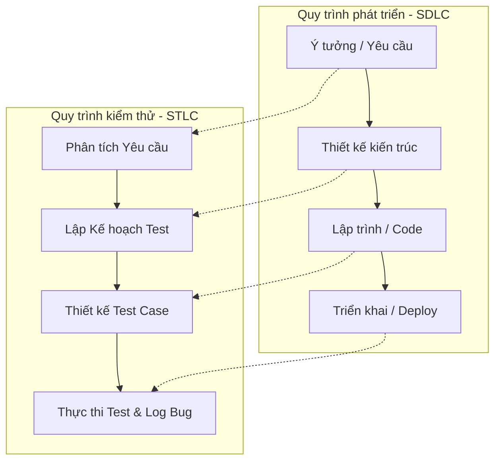
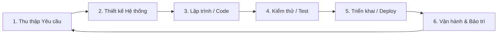
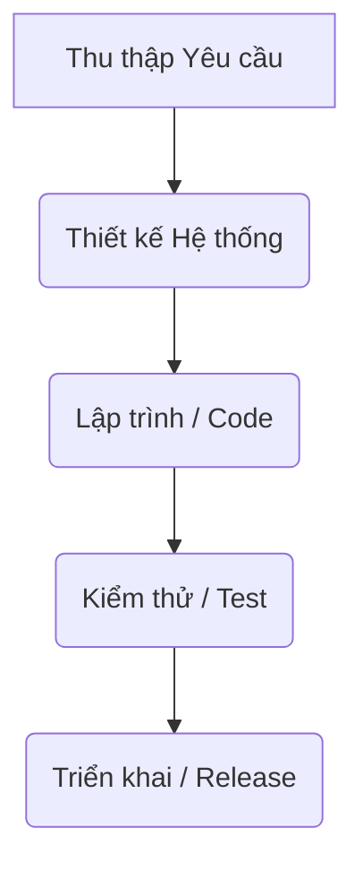
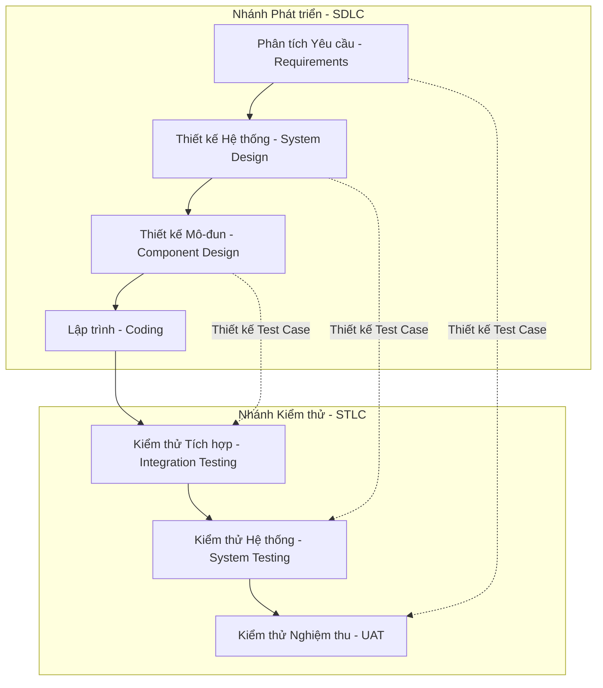
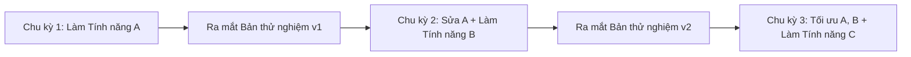
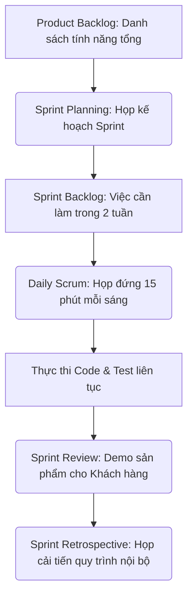
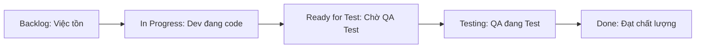
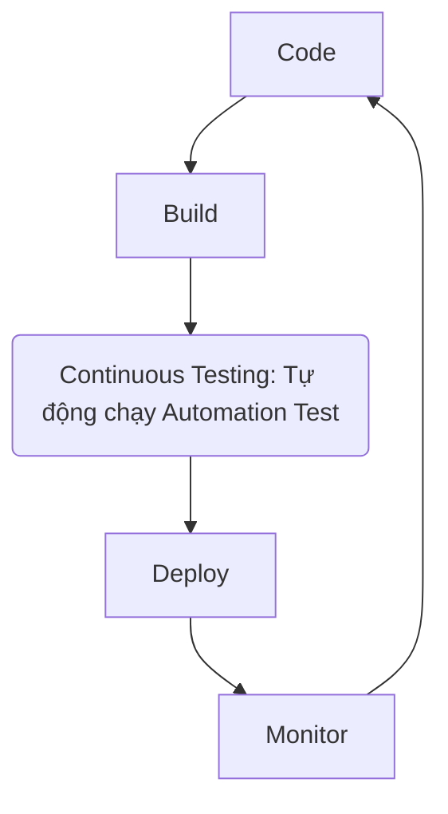

# 📁 02. SDLC, STLC & Mô hình Agile

*Mục tiêu: Hiểu cách phần mềm được hình thành từ ý tưởng đến thực tế, quy trình kiểm thử song hành và cách vận hành một đội ngũ Agile/Scrum.*

#  **2.1. SDLC (Software Development Life Cycle)**

## 📌 Mục lục nội bộ (Chặng 02)

- [ ] [**2.1. SDLC (Software Development Life Cycle)**](./1_SDLC.md)
  - [ ] [2.1.1. SDLC Overview](#211-sdlc-overview)
  - [ ] [2.1.2. Waterfall Model](#212-waterfall-model)
  - [ ] [2.1.3. V-Model](#213-v-model)
  - [ ] [2.1.4. Agile Methodology](#214-agile-methodology)
  - [ ] [2.1.5. Scrum Framework](#215-scrum-framework)
  - [ ] [2.1.6. Kanban Board](#216-kanban-board)
  - [ ] [2.1.7. DevOps & DevSecOps](#217-devops--devsecops)
- [ ] [**2.2. STLC (Software Testing Life Cycle)**](./2_STLC.md)
- [ ] [**2.3. Agile / Scrum In-Depth**](./3_AgileScrum.md)
- [ ] [**2.4. Testing Strategy**](./4_TestingStrategy.md)
---

## 🗺️ Bản đồ liên kết tổng quan Chặng 02

Trước khi đi vào chi tiết, bạn cần nắm được bức tranh tổng thể về mối quan hệ giữa quy trình phát triển sản phẩm (`SDLC`) và quy trình kiểm thử (`STLC`):

---

# 2.1.1. SDLC Overview

**SDLC (Software Development Life Cycle - Vòng đời phát triển phần mềm)** là một quy trình kỹ thuật chuẩn hóa bao gồm các giai đoạn nối tiếp nhau nhằm xây dựng, triển khai và bảo trì một sản phẩm phần mềm đạt chất lượng cao, tối ưu chi phí và đúng tiến độ bàn giao.

Hiểu rõ SDLC là điều kiện bắt buộc đối với một Tester để biết được **phần mềm được hình thành như thế nào, ai là người tạo ra dữ liệu và Tester cần nhảy vào can thiệp ở đâu** nhằm bảo đảm chất lượng từ gốc.

## 📊 6 Giai đoạn cốt lõi của một quy trình SDLC tiêu chuẩn

Một vòng đời SDLC cơ bản luôn trải qua 6 bước khép kín dưới đây:

---

## 🛠️ Chi tiết phân cấp hoạt động trong 6 giai đoạn

### 1. Requirement Gathering & Analysis (Thu thập và Phân tích Yêu cầu)
*   **Mục tiêu:** Xác định khách hàng thực sự cần gì, bài toán kinh doanh là gì và hệ thống phải có những chức năng nào.
*   **Nhân sự chính:** Khách hàng, Product Owner (PO), Business Analyst (BA).
*   **Sản phẩm đầu ra:** Tài liệu yêu cầu nghiệp vụ (`BRD`), Tài liệu đặc tả yêu cầu phần mềm (`SRS`), hoặc các bộ `User Stories`.
*   **Vai trò của QA:** Đọc hiểu, phân tích phản biện tài liệu (`Requirement Questioning`) để tìm ra lỗ hổng logic ngay từ khâu ý tưởng.

### 2. System Design (Thiết kế Hệ thống)
*   **Mục tiêu:** Biến các yêu cầu bằng chữ trong tài liệu thành bản thiết kế kỹ thuật kiến trúc phần mềm.
*   **Nhân sự chính:** Software Architect, UI/UX Designer, Lead Developer.
*   **Sản phẩm đầu ra:** Bản thiết kế giao diện (Figma/Mockup), Bản vẽ kiến trúc (High-Level Design), Sơ đồ cơ sở dữ liệu (Database Schema / ERD).
*   **Vai trò của QA:** Review bản thiết kế giao diện để chuẩn bị trước luồng trải nghiệm người dùng (`User Journey`) và chuẩn bị chiến lược kiểm thử dữ liệu (`Test Strategy`).

### 3. Coding / Development (Lập trình và Phát triển)
*   **Mục tiêu:** Lập trình viên viết mã nguồn để hiện thực hóa các bản thiết kế thành các tính năng chạy được.
*   **Nhân sự chính:** Developer (Frontend, Backend, Mobile).
*   **Sản phẩm đầu ra:** Mã nguồn (Source Code) được đẩy lên các kho lưu trữ (GitHub/GitLab) và các bản cài đặt sơ khai (`Build`).
*   **Vai trò của QA:** Giám sát tiến độ, hỗ trợ cung cấp các kịch bản biên (`Edge-cases`) trước cho Dev để họ tự né lỗi khi viết code.

### 4. Software Testing (Kiểm thử phần mềm)
*   **Mục tiêu:** Vận hành phần mềm trong môi trường độc lập để săn lùng lỗi, đối chiếu kết quả thực tế với yêu cầu tài liệu nhằm đảm bảo chất lượng trước khi phát hành.
*   **Nhân sự chính:** QA Engineer, QC Tester.
*   **Sản phẩm đầu ra:** Bộ kịch bản Test Case, Báo cáo lỗi (Bug Reports), Báo cáo tổng kết chất lượng (Test Summary Report).
*   **Vai trò của QA:** Đây là sân khấu chính. QA thực hiện chạy test (thủ công hoặc tự động), log bug, retest sau khi dev sửa lỗi và đánh giá mức độ rủi ro của sản phẩm.

### 5. Deployment / Release (Triển khai và Phát hành)
*   **Mục tiêu:** Đóng gói phiên bản phần mềm sạch lỗi và đưa lên môi trường thực tế (`Production`) để người dùng cuối bắt đầu sử dụng.
*   **Nhân sự chính:** DevOps Engineer, System Admin, Deployment Team.
*   **Sản phẩm đầu ra:** Ứng dụng chạy chính thức trên Web Live, chợ ứng dụng (App Store, Google Play).
*   **Vai trò của QA:** Thực hiện kiểm thử nhanh (`Smoke Test`) trực tiếp trên môi trường Production để đảm bảo quá trình cài đặt không làm hỏng tính năng cốt lõi.

### 6. Operations & Maintenance (Vận hành và Bảo trì)
*   **Mục tiêu:** Theo dõi hiệu năng hệ thống thực tế, tiếp nhận phản hồi từ người dùng để sửa các lỗi phát sinh ngoài dự kiến và nâng cấp tính năng định kỳ.
*   **Nhân sự chính:** Support Team, DevOps, Developer, QA.
*   **Sản phẩm đầu ra:** Các bản vá lỗi (`Hotfix`), các phiên bản cập nhật nhỏ (`Patch Version`).
*   **Vai trò của QA:** Kiểm thử hồi quy (`Regression Test`) để đảm bảo các bản vá lỗi mới không làm ảnh hưởng đến các vùng tính năng cũ đang chạy ổn định.

> ⚠️ **Tư duy chuyên gia cần nhớ:** 
> Trong mô hình phát triển phần mềm truyền thống (Waterfall), 6 bước này chạy tuần tự như một dòng thác, khiến Testing bị đẩy xuống cuối chặng và đối mặt với rủi ro thiếu thời gian. Trong mô hình hiện đại (Agile/Scrum), vòng đời SDLC này được lặp đi lặp lại liên tục trong mỗi chu kỳ ngắn từ 2-4 tuần, đòi hỏi QA phải linh hoạt phối hợp đồng thời nhiều giai đoạn cùng một lúc.

## 📚 References (Tài liệu tham khảo 2.1.1)
* [ISTQB® Certified Tester Foundation Level (CTFL) Syllabus v4.0](https://istqb.org) - Section 2.1: *Testing in the Context of a Software Development Lifecycle*.
* [ISO/IEC/IEEE 12207:2017 Standard](https://iso.org) - *Systems and software engineering — Software life cycle processes*.

# 2.1.2. Waterfall Model

**Waterfall Model (Mô hình thác nước)** là mô hình phát triển phần mềm tuần tự đầu tiên được định hình trong ngành công nghiệp phần mềm. Trong mô hình này, quy trình SDLC được chia thành các giai đoạn tách biệt rõ ràng và dòng chảy công việc chỉ di chuyển theo một hướng duy nhất từ trên xuống dưới như một dòng thác tự nhiên. 

Điều kiện tiên quyết của Waterfall là: **Giai đoạn trước phải hoàn thành 100% và được phê duyệt đóng gói thì giai đoạn sau mới được phép bắt đầu.** Không có sự quay đầu hay làm cuốn chiếu giữa các bước.

## 📊 Sơ đồ dòng chảy tuần tự của Mô hình Thác nước

---

## 🛠️ Phân tích Đặc điểm kỹ thuật dưới góc nhìn QA

### 1. Ưu điểm (Khi nào nên dùng?)
* **Dễ quản lý:** Mọi thứ được định rõ từ đầu, có kế hoạch, mốc thời gian (`Milestones`) và sản phẩm đầu ra rõ ràng cho từng chặng.
* **Tài liệu hoàn hảo:** Do bắt buộc phải hoàn thành khâu phân tích trước khi code nên hệ thống tài liệu đặc tả yêu cầu (`Test Basis`) như BRD, SRS cực kỳ chi tiết, dày dặn và ít khi bị thay đổi giữa chừng.
* **Phù hợp dự án ít biến động:** Phù hợp với các dự án có yêu cầu cực kỳ rõ ràng ngay từ đầu, công nghệ quen thuộc và tuyệt đối không thay đổi trong suốt quá trình phát triển (Ví dụ: Dự án xây dựng hệ thống phần mềm lõi cho hàng không, y tế hoặc chính phủ).

### 2. Nhược điểm và Rủi ro chí tử đối với QA/Tester
* **Hiệu ứng "Bóp nghẹt" thời gian Test (The QA Crunch Time):** Vì Testing nằm ở cuối chu kỳ phát triển, nếu giai đoạn Thiết kế hoặc Lập trình bị trễ hạn (điều xảy ra ở 90% dự án thực tế), ngày bàn giao cho khách hàng không đổi, phần thời gian bị thâm hụt sẽ bị ép trực tiếp vào giai đoạn Test. Tester từ có 4 tuần để test bị ép xuống còn 5 ngày, dẫn đến áp lực khủng khiếp và rủi ro lọt bug cực cao.
* **Phát hiện lỗi quá muộn:** Sản phẩm chạy thực tế chỉ xuất hiện ở cuối chu kỳ. Nếu Tester phát hiện ra một lỗi kiến trúc hệ thống nghiêm trọng ở giai đoạn này, chi phí để đập đi code lại từ đầu là vô cùng đắt đỏ (Theo biểu đồ *Cost of Quality*).
* **Khách hàng không thể thay đổi yêu cầu:** Nếu sau 6 tháng phát triển, khách hàng muốn đổi một nút bấm hoặc thay đổi logic tính thuế, dự án gần như phải đập đi và lập kế hoạch chạy lại một vòng đời Waterfall mới từ đầu.
* **Tâm lý tách biệt cô lập (`Siloed Mindset`):** Dev chỉ biết code, Tester chỉ biết test, hai bên ít giao tiếp với nhau cho đến khi code được ném qua phân ranh giới. Điều này vi phạm nghiêm trọng tư duy **Quality Ownership** (Làm chủ chất lượng toàn đội).

> ⚠️ **Tư duy chuyên gia cần nhớ:** 
> Làm Tester trong dự án Waterfall đòi hỏi bạn phải có khả năng đọc tài liệu cực tốt vì đó là "chân lý" duy nhất để bạn bám vào viết Test Case. Tuy nhiên, để sống sót và giảm thiểu rủi ro trễ hạn trong mô hình này, Tester không được ngồi im chờ Dev giao code. Bạn phải tận dụng thời gian Dev đang code để **viết sẵn bộ kịch bản Test Case thật chi tiết**, chuẩn bị sẵn **dữ liệu test (`Test Data`) sạch** và môi trường test sẵn sàng. Khi code vừa đổ xuống, bạn có thể lập tức thực thi mà không mất thêm một giây nào để chuẩn bị.

## 📚 References (Tài liệu tham khảo 2.1.2)
* [ISTQB® Certified Tester Foundation Level (CTFL) Syllabus v4.0](https://istqb.org) - Section 2.1.1: *Sequential Development Models*.
* **Winston W. Royce (1970)** - *Managing the Development of Large Software Systems*, Proceedings of IEEE WESCON (Bài luận văn gốc đặt nền móng định hình mô hình thác nước trong công nghệ phần mềm).

# 2.1.3. V-Model

**V-Model (Mô hình chữ V)** là bản nâng cấp và cải tiến trực tiếp từ Mô hình Thác nước (Waterfall). Bản chất của V-Model là **áp dụng triết lý kiểm thử sớm (Early Testing)** bằng cách thiết lập mối quan hệ ánh xạ song song 1-1 giữa mỗi giai đoạn phát triển phần mềm (`SDLC`) ở nhánh bên trái và một cấp độ kiểm thử tương ứng (`STLC`) ở nhánh bên phải.

Trong V-Model, hoạt động kiểm thử (ở dạng kiểm thử tĩnh - review tài liệu) được bắt đầu ngay từ khi dự án vừa khởi chạy chứ không đợi đến khi có code mới nhảy vào như Waterfall.

## 📊 Sơ đồ ánh xạ 1-1 của Mô hình chữ V

---

## 🛠️ Chi tiết ma trận ánh xạ giữa SDLC và STLC

Điểm đặc biệt của V-Model là **khi nhánh bên trái đang viết tài liệu thiết kế, thì Tester ở nhánh bên phải đã bắt đầu phân tích tài liệu đó để viết sẵn khung kịch bản Test Case tương ứng**:

1. **Requirement Analysis ↔ User Acceptance Testing (UAT):**
   * Khi BA làm việc với khách hàng để viết tài liệu yêu cầu nghiệp vụ, Tester sẽ dựa vào tài liệu này để thiết kế bộ kịch bản **Kiểm thử nghiệm thu (UAT Test Cases)** nhằm xác nhận hệ thống đáp ứng đúng nhu cầu người dùng.
2. **System Design ↔ System Testing:**
   * Khi kiến trúc sư thiết kế tổng thể hệ thống (luồng đi dữ liệu, giao diện tổng quan), Tester dựa vào đó để xây dựng kịch bản **Kiểm thử hệ thống (System Test Cases)** nhằm xác thực toàn bộ chức năng chạy đúng đặc tả kỹ thuật.
3. **Component Design ↔ Integration Testing:**
   * Khi thiết kế chi tiết cách các mô-đun nhỏ kết nối với nhau, Tester/Dev phối hợp thiết kế kịch bản **Kiểm thử tích hợp (Integration Test Cases)** để kiểm tra dữ liệu truyền qua lại giữa các cụm tính năng có bị lỗi không.
4. **Coding ↔ Component/Unit Testing:**
   * Lập trình viên viết code đến đâu sẽ tự viết kịch bản **Kiểm thử đơn vị (Unit Test Cases)** để quét và tối ưu độ phủ dòng lệnh (`Code Coverage`) đến đó.

---

## 📊 Phân tích Đặc điểm kỹ thuật dưới góc nhìn QA

### 1. Ưu điểm (Tại sao V-Model tốt hơn Waterfall?)
* **Hiện thực hóa Early Testing:** Tester bận rộn ngay từ ngày đầu tiên của dự án (review tài liệu, chuẩn bị kịch bản) chứ không ngồi chơi chờ code. Bug trong tài liệu được quét sạch từ sớm, tiết kiệm hàng nghìn USD cho doanh nghiệp.
* **Tính kiểm soát cao:** Mỗi giai đoạn phát triển đều có một cấp độ kiểm thử tương ứng làm "chốt chặn". Sản phẩm không thể chuyển sang bước tiếp theo nếu cấp độ test tương ứng chưa cán mốc `PASS`.
* **Rút ngắn thời gian thực thi:** Do toàn bộ bộ Test Cases đã được chuẩn bị sẵn sàng từ trước trong lúc Dev đang code, khi code vừa đổ xuống môi trường test, Tester chỉ việc bấm nút thực thi chạy kịch bản ngay lập tức.

### 2. Nhược điểm (Tại sao thế giới dịch chuyển sang Agile?)
* **Bản chất vẫn là tuyến tính (Rigid):** Dù cải tiến về khâu kiểm thử, V-Model vẫn là một mô hình cứng nhắc. Nếu có sự thay đổi lớn về yêu cầu ở giữa chặng đường, toàn bộ chuỗi ánh xạ chữ V sẽ bị gãy và việc làm lại tài liệu cực kỳ tốn công sức.
* **Sản phẩm chạy được xuất hiện muộn:** Giống như Waterfall, khách hàng chỉ thực sự nhìn thấy và sờ được vào phần mềm ở giai đoạn cuối cùng (khi chữ V đi lên nhánh phải). Rủi ro khách hàng không ưng ý về mặt giao diện/trải nghiệm thực tế vẫn rất cao.

> ⚠️ **Tư duy chuyên gia cần nhớ:** 
> V-Model là mô hình lý thuyết hoàn hảo nhất dạy cho bạn hiểu rõ bản chất của **Cấp độ kiểm thử (`Test Levels`)**. Dù dự án thực tế của bạn có làm theo Agile hay Scrum chạy nhanh đến đâu, tư duy ánh xạ của V-Model (mỗi tầng code/tài liệu sinh ra đều phải có một tầng test tương ứng che phủ) luôn luôn tồn tại dưới dạng ngầm định trong đầu của một Chuyên gia QA.

## 📚 References (Tài liệu tham khảo 2.1.3)
* [ISTQB® Certified Tester Foundation Level (CTFL) Syllabus v4.0](https://istqb.org) - Section 2.1.1: *V-model*.
* [IEEE Std 1012-2016 Standard](https://ieee.org) - *IEEE Standard for System, Software, and Hardware Verification and Validation*.
* **Paul Rook (1986)** - *Controlling Software Projects*, Software Engineering Journal.

# 2.1.4. Agile Methodology

**Agile Methodology (Phương pháp luận linh hoạt)** là một tư duy, một cách tiếp cận hiện đại trong phát triển phần mềm, tập trung vào việc **chia nhỏ sản phẩm thành các phần nhỏ để phát triển theo phương pháp cuốn chiếu** thông qua các chu kỳ ngắn lặp đi lặp lại (gọi là Iterations hoặc Sprints).

Triết lý tối cao của Agile được đúc kết qua **Tuyên ngôn Agile (Agile Manifesto - 2001)** với 4 giá trị cốt lõi:
1. **Con người và sự tương tác** quan trọng hơn quy trình và công cụ.
2. **Sản phẩm chạy tốt** quan trọng hơn tài liệu đầy đủ.
3. **Cộng tác với khách hàng** quan trọng hơn đàm phán hợp đồng.
4. **Phản hồi với sự thay đổi** quan trọng hơn việc tuân theo một kế hoạch cố định.

## 📊 Mô hình phát triển cuốn chiếu (Tuyến tính vs Tăng trưởng)

Thay vì mất 6 tháng làm một mớ tài liệu rồi mới code như Waterfall, Agile chia nhỏ dự án thành các chu kỳ từ 1-4 tuần. Cuối mỗi chu kỳ, team phải xuất bản một phiên bản phần mềm chạy được thực tế để khách hàng đánh giá trực tiếp.

---

## 🧠 Tác động của tư duy Agile đối với vai trò của QA

* **Phá vỡ rào cản thời gian:** QA không còn bị dồn vào đường cùng ở cuối dự án như Waterfall. Hoạt động test diễn ra liên tục song hành cùng khâu code trong từng chu kỳ ngắn.
* **Giao tiếp liên tục (Collaboration over Documentation):** Tài liệu trong dự án Agile thường rất ngắn gọn (dưới dạng User Story). Do đó, QA phải chủ động giao tiếp, thảo luận trực tiếp với Dev và BA hàng ngày để làm rõ yêu cầu thay vì chỉ ngồi đọc tài liệu.
* **Yêu cầu kiểm thử hồi quy cao (Regression Testing):** Vì code mới được đẻ ra liên tục sau mỗi 2 tuần, rủi ro code mới làm hỏng tính năng cũ là rất lớn. Tư duy Agile bắt buộc QA phải xây dựng bộ test suite cốt lõi để chạy đi chạy lại liên tục, đây là tiền đề thúc đẩy sự ra đời của **Automation Testing**.

> ⚠️ **Tư duy chuyên gia cần nhớ:** 
> Làm QA trong môi trường Agile nghĩa là bạn phải chuyển dịch từ tư duy "Người tìm lỗi ở cuối công đoạn" sang tư duy "Người đồng hành phòng ngừa lỗi từ đầu". Agile không coi trọng tài liệu dày cộp, Agile coi trọng tính hành động và sản phẩm thực tế chạy mượt mà.

## 📚 References (Tài liệu tham khảo 2.1.4)
* [The Agile Manifesto (2001) Official Resource](https://agilemanifesto.org) - Tuyên ngôn thế giới về phát triển phần mềm linh hoạt.
* [ISTQB® Certified Tester Foundation Level (CTFL) Syllabus v4.0](https://istqb.org) - Section 2.1.2: *Iterative and Incremental Development Models*.

# 2.1.5. Scrum Framework

**Scrum** là một khung làm việc (Framework) cụ thể và phổ biến nhất hiện nay cụ thể hóa các triết lý của Agile. Scrum định nghĩa ra các vai trò, các sự kiện và các sản phẩm trung gian rõ ràng để vận hành một đội ngũ phát triển phần mềm tự quản từ 3 đến 9 thành viên.

## 👥 3 Vai trò cốt lõi trong một đội ngũ Scrum (Scrum Team)

1. **Product Owner (PO):** Người định hướng sản phẩm, quản lý và sắp xếp độ ưu tiên của các tính năng cần làm theo giá trị kinh doanh của doanh nghiệp. PO đại diện cho tiếng nói của khách hàng.
2. **Scrum Master (SM):** Người bảo vệ quy trình, hỗ trợ dọn dẹp các rào cản cản trở tiến độ của team và đảm bảo cả đội vận hành đúng luật Scrum. SM không phải là sếp (Project Manager), họ là người phục vụ (Servant Leader).
3. **Developers (Đội ngũ phát triển):** Nhóm các chuyên gia tự tổ chức bao gồm cả Lập trình viên và QA/Tester để trực tiếp biến các yêu cầu của PO thành tính năng chạy được ở cuối mỗi chu kỳ (gọi là **Sprint**, thường kéo dài từ 2-4 tuần).

---

## 🔄 Quy trình vận hành một Sprint trong Scrum

Mọi hoạt động phát triển và kiểm thử trong Scrum đều diễn ra bên trong một Sprint khép kín:

---

## ⚠️ Thách thức kỹ thuật đối với QA trong dự án Scrum

* **Tốc độ chóng mặt (Fast-paced):** Sprint chỉ kéo dài 2 tuần. Dev code xong vào ngày thứ 8, QA chỉ có 2 ngày cuối để test sạch lỗi và phê duyệt đóng gói. Nếu QA chậm chân, toàn bộ Sprint sẽ bị trễ hạn (`Fail Sprint`).
* **Định nghĩa Hoàn thành (Definition of Done - DoD):** QA phải là người giữ chốt cho DoD. Một tính năng của Dev code xong không được tính là Hoàn thành nếu QA chưa thực thi test, chưa log bug và chưa xác nhận các bug nghiêm trọng đã được sửa đổi an toàn.

> ⚠️ **Tư duy chuyên gia cần nhớ:** 
> Trong Scrum, QA không đứng độc lập bên ngoài để "bắt lỗi" đội phát triển. Bạn là một thành viên thuộc nhóm `Developers` (theo định nghĩa của Scrum Guide). Do đó, sự thành công hay thất bại của một Sprint là trách nhiệm chung của toàn đội (`Quality Ownership`).

## 📚 References (Tài liệu tham khảo 2.1.5)
* [The Official Scrum Guide](https://scrumguides.org) - Tài liệu hướng dẫn Scrum chính thức của Ken Schwaber và Jeff Sutherland.
* [ISTQB® Certified Tester Foundation Level (CTFL) Syllabus v4.0](https://istqb.org) - Section 6.1: *Testing in Agile*.

# 2.1.6. Kanban Board

**Kanban** (tiếng Nhật nghĩa là "Bảng trực quan") là một phương pháp quản lý công việc theo thời gian thực (Real-time), tập trung vào việc **trực quan hóa luồng công việc** và **giới hạn lượng việc đang làm đồng thời** nhằm tối ưu hóa năng suất, tăng tốc độ bàn giao và giảm thiểu tối đa hiện tượng nghẽn cổ chai.

Khác với Scrum bắt buộc phải chạy theo chu kỳ cố định (Sprint từ 2-4 tuần), Kanban hoạt động theo cơ chế dòng chảy liên tục (Continuous Flow). Công việc mới từ hàng đợi sẽ được kéo vào làm ngay khi hệ thống có chỗ trống.

## 📊 Cấu trúc một bảng Kanban tiêu chuẩn cho QA

Bảng Kanban phân chia công việc thành các cột trạng thái luồng rõ ràng, cho phép toàn bộ đội ngũ nắm bắt tiến độ dự án chỉ trong một ánh nhìn:

---

## 🛠️ 2 Quy tắc vàng của Kanban giúp cứu nguy cho QA

### 1. Giới hạn công việc đang làm (WIP Limit - Work In Progress)
* **Vấn đề thực tế (Scrum/Waterfall):** Lập trình viên code quá nhanh, ném một lúc 20 tính năng sang cột Chờ Test, trong khi đội QA chỉ có 2 người. QA lập tức rơi vào trạng thái quá tải, kiệt sức và test ẩu dẫn đến lọt Bug nghiêm trọng.
* **Giải pháp Kanban:** Đặt chỉ số `WIP Limit = 3` tại cột `Testing`. Điều này có nghĩa nếu tại khu vực của QA đang có sẵn 3 tính năng đang test, Lập trình viên **không được phép** đẩy thêm bất kỳ tính năng nào sang nữa. Họ phải dừng việc code lại để hỗ trợ QA viết tài liệu, chuẩn bị dữ liệu test hoặc vào test chéo sản phẩm. Quy tắc này triệt tiêu hoàn toàn lỗi nghẽn cổ chai của dự án.

### 2. Quản lý Dòng chảy (Manage Flow)
* Bằng việc quan sát sự di chuyển của các thẻ công việc (Tasks) trên bảng, Quản lý dự án hoặc Scrum Master có thể phát hiện ngay thẻ nào đang bị "đóng băng" ở một cột quá lâu. Từ đó, team lập tức có hành động hỗ trợ liên phòng ban để giải phóng tắc nghẽn, đảm bảo tiến độ mượt mà.

> ⚠️ **Tư duy chuyên gia cần nhớ:** 
> Làm QA trong dự án Kanban đòi hỏi tính chủ động và linh hoạt cực kỳ cao. Bạn không kiểm thử theo một "gói" tính năng cố định nữa, mà kiểm thử theo dạng gối đầu liên tục. Việc làm chủ chỉ số WIP Limit chính là vũ khí giúp QA bảo vệ được thời gian test và chất lượng đầu ra của chính mình.

## 📚 References (Tài liệu tham khảo 2.1.6)
* **David J. Anderson (2010)** - *Kanban: Successful Evolutionary Change for Your Technology Business*, Blue Hole Press (Tác phẩm đặt nền móng đưa phương pháp Kanban từ nhà máy sản xuất ô tô Toyota vào ngành công nghiệp phần mềm).
* [Lean Enterprise Institute - Kanban Systems](https://lean.org) - Học thuyết tối ưu hóa dòng chảy sản xuất và loại bỏ lãng phí.

# 2.1.7. DevOps & DevSecOps

**DevOps** là sự kết hợp của **Development (Phát triển)** và **Operations (Vận hành)**. Đây là một văn hóa, một bộ quy trình kỹ thuật nhằm tự động hóa hoàn toàn chuỗi hành động từ khâu viết code, kiểm thử, đóng gói, đến khâu triển khai lên máy chủ thực tế nhằm rút ngắn chu kỳ phát hành sản phẩm từ vài tháng xuống còn vài phút.

**DevSecOps** là phiên bản nâng cấp của DevOps, bằng cách đưa thêm yếu tố **Security (Bảo mật)** song hành trực tiếp vào mọi mắt xích của quy trình tự động này, thay vì đợi đến cuối cùng mới quét bảo mật.

---

## ♾️ Vòng lặp vô cực DevOps và vị trí của Automation Test

Quy trình DevOps vận hành theo một vòng lặp vô cực khép kín (`Continuous Lifecycle`). Trong đó, mã nguồn kiểm thử tự động chính là bộ khung xương giúp vòng lặp này có thể chạy tự động:

---

## 🛠️ Chi tiết kỹ thuật vận hành cốt lõi

### 1. CI/CD Pipeline (Đường ống tự động) & Continuous Testing
* **Cơ chế vận hành:** Khi Lập trình viên đẩy code mới lên hệ thống quản lý mã nguồn (GitHub/GitLab), hệ thống sẽ tự động biên dịch (`Build`). Ngay lập tức, đường ống CI/CD sẽ tự động kích hoạt bộ mã code **Automation Test** do QA lập trình để quét toàn bộ hệ thống (`Continuous Testing`). 
* **Hành động rẽ nhánh:** Nếu bộ test báo `PASS`, code sẽ tự động được đẩy thẳng lên môi trường chạy thực tế (`Continuous Deployment`). Nếu bộ test báo `FAIL`, hệ thống sẽ chặn đứng code lỗi lại và gửi thông báo khẩn cấp về cho Dev sửa đổi. QA không cần phải bấm nút chạy test bằng tay.

### 2. Bản chất của DevSecOps — Dịch chuyển về bên trái (Shift-Left Security)
* Trong văn hóa DevSecOps, các công cụ quét mã độc tự động (SAST/DAST) được tích hợp trực tiếp ngay khi Dev vừa viết xong dòng code đầu tiên. Việc này giúp phát hiện ra các lỗ hổng bảo mật nghiêm trọng (như SQL Injection, lộ mật khẩu cấu hình) từ rất sớm, đảm bảo sản phẩm làm ra vừa chạy đúng tính năng, vừa có độ an toàn bảo mật cao.

> ⚠️ **Tư duy chuyên gia cần nhớ:** 
> Trong môi trường DevOps/DevSecOps, ranh giới giữa Dev và QA bị xóa nhòa. Một Kỹ sư Automation Test (QE) giỏi không chỉ biết viết code test chạy trên máy cá nhân, mà phải làm chủ kỹ thuật cấu hình tệp lệnh Pipeline (YAML) để hệ thống tự động hóa hoàn toàn quy trình kiểm thử liên tục.

## 📚 References (Tài liệu tham khảo 2.1.7)
* [DORA (DevOps Research and Assessment) Annual Reports](https://google.com) - Báo cáo toàn cầu của Google về các tiêu chuẩn và chỉ số đo lường hiệu năng vận hành DevOps/DevSecOps.
* [OWASP DevSecOps Guideline](https://owasp.org) - Quy chuẩn tích hợp bảo mật vào đường ống phát triển tự động của tổ chức bảo mật quốc tế OWASP.

# 2.1.7. DevOps & DevSecOps

**DevOps** là sự kết hợp của **Development (Phát triển)** và **Operations (Vận hành)**. Đây là một văn hóa, một bộ quy trình kỹ thuật nhằm tự động hóa hoàn toàn chuỗi hành động từ khâu viết code, kiểm thử, đóng gói, đến khâu triển khai lên máy chủ thực tế nhằm rút ngắn chu kỳ phát hành sản phẩm từ vài tháng xuống còn vài phút.

**DevSecOps** là phiên bản nâng cấp của DevOps, bằng cách đưa thêm yếu tố **Security (Bảo mật)** song hành trực tiếp vào mọi mắt xích của quy trình tự động này, thay vì đợi đến cuối cùng mới quét bảo mật.

---

## ♾️ Vòng lặp vô cực DevOps và vị trí của Automation Test

Quy trình DevOps vận hành theo một vòng lặp vô cực khép kín (`Continuous Lifecycle`). Trong đó, mã nguồn kiểm thử tự động chính là bộ khung xương giúp vòng lặp này có thể chạy tự động:

---

## 🛠️ Chi tiết kỹ thuật vận hành cốt lõi

### 1. CI/CD Pipeline (Đường ống tự động) & Continuous Testing
* **Cơ chế vận hành:** Khi Lập trình viên đẩy code mới lên hệ thống quản lý mã nguồn (GitHub/GitLab), hệ thống sẽ tự động biên dịch (`Build`). Ngay lập tức, đường ống CI/CD sẽ tự động kích hoạt bộ mã code **Automation Test** do QA lập trình để quét toàn bộ hệ thống (`Continuous Testing`). 
* **Hành động rẽ nhánh:** Nếu bộ test báo `PASS`, code sẽ tự động được đẩy thẳng lên môi trường chạy thực tế (`Continuous Deployment`). Nếu bộ test báo `FAIL`, hệ thống sẽ chặn đứng code lỗi lại và gửi thông báo khẩn cấp về cho Dev sửa đổi. QA không cần phải bấm nút chạy test bằng tay.

### 2. Bản chất của DevSecOps — Dịch chuyển về bên trái (Shift-Left Security)
* Trong văn hóa DevSecOps, các công cụ quét mã độc tự động (SAST/DAST) được tích hợp trực tiếp ngay khi Dev vừa viết xong dòng code đầu tiên. Việc này giúp phát hiện ra các lỗ hổng bảo mật nghiêm trọng (như SQL Injection, lộ mật khẩu cấu hình) từ rất sớm, đảm bảo sản phẩm làm ra vừa chạy đúng tính năng, vừa có độ an toàn bảo mật cao.

> ⚠️ **Tư duy chuyên gia cần nhớ:** 
> Trong môi trường DevOps/DevSecOps, ranh giới giữa Dev và QA bị xóa nhòa. Một Kỹ sư Automation Test (QE) giỏi không chỉ biết viết code test chạy trên máy cá nhân, mà phải làm chủ kỹ thuật cấu hình tệp lệnh Pipeline (YAML) để hệ thống tự động hóa hoàn toàn quy trình kiểm thử liên tục.

## 📚 References (Tài liệu tham khảo 2.1.7)
* [DORA (DevOps Research and Assessment) Annual Reports](https://google.com) - Báo cáo toàn cầu của Google về các tiêu chuẩn và chỉ số đo lường hiệu năng vận hành DevOps/DevSecOps.
* [OWASP DevSecOps Guideline](https://owasp.org) - Quy chuẩn tích hợp bảo mật vào đường ống phát triển tự động của tổ chức bảo mật quốc tế OWASP.
