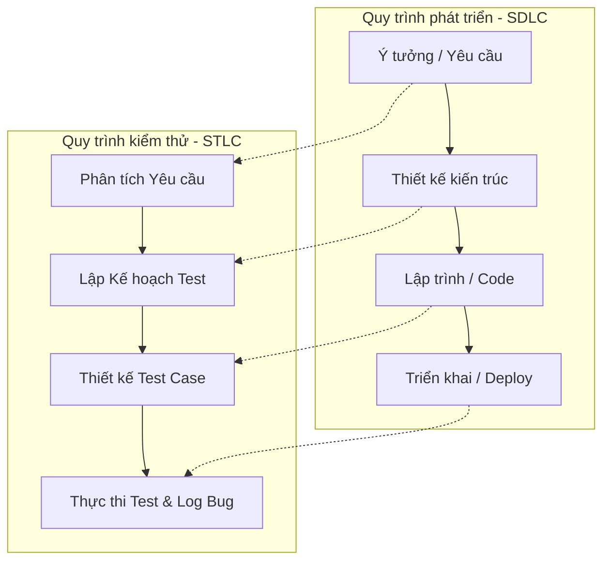
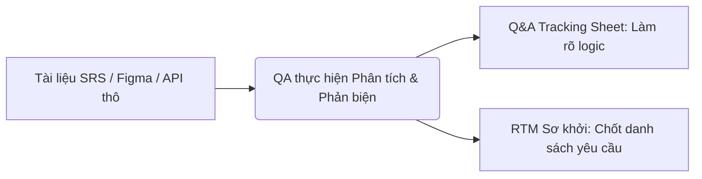
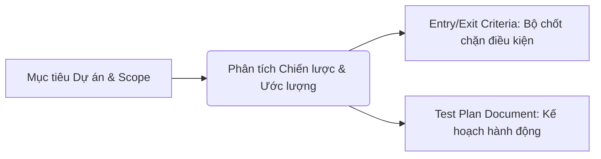
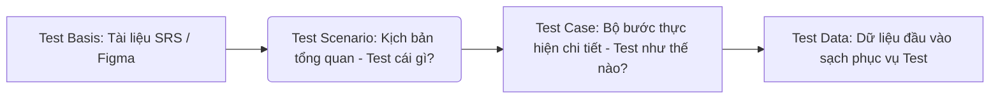
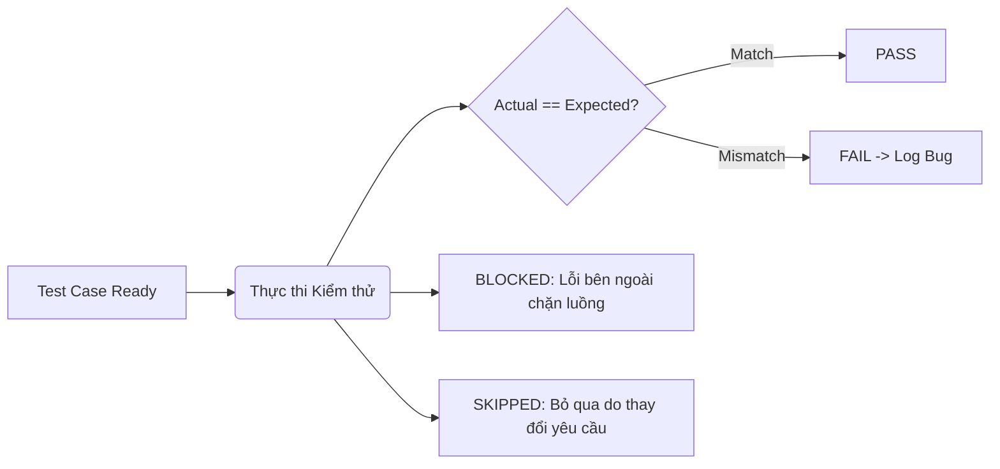
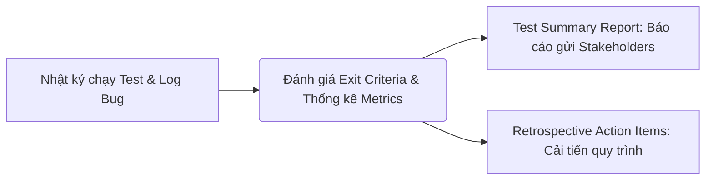

# 📁 02. SDLC, STLC & Mô hình Agile

*Mục tiêu: Hiểu cách phần mềm được hình thành từ ý tưởng đến thực tế, quy trình kiểm thử song hành và cách vận hành một đội ngũ Agile/Scrum.*

# **2.2. STLC (Software Testing Life Cycle)**

## 📌 Mục lục nội bộ (Chặng 02)

- [ ] [**2.1. SDLC (Software Development Life Cycle)**](./1_SDLC.md)
- [ ] [**2.2. STLC (Software Testing Life Cycle)**](./2_STLC.md)
  - [ ] [2.2.1. Requirement Analysis](221-requirement-analysis)
  - [ ] [2.2.2. Test Planning](222-test-planning)
  - [ ] [2.2.3. Test Case Development](223-test-case-development)
  - [ ] [2.2.4. Test Environment Setup](224-test-environment-setup)
  - [ ] [2.2.5. Test Execution](225-test-execution)
  - [ ] [2.2.6. Defect Reporting](226-defect-reporting)
  - [ ] [2.2.7. Test Cycle Closure](227-test-cycle-closure)
- [ ] [**2.3. Agile / Scrum In-Depth**](./3_AgileScrum.md)
- [ ] [**2.4. Testing Strategy**](./4_TestingStrategy.md)
---

## 🗺️ Bản đồ liên kết tổng quan Chặng 02

Trước khi đi vào chi tiết, bạn cần nắm được bức tranh tổng thể về mối quan hệ giữa quy trình phát triển sản phẩm (`SDLC`) và quy trình kiểm thử (`STLC`):



---

# 2.2.1. Requirement Analysis

**Requirement Analysis (Phân tích Yêu cầu)** là giai đoạn đầu tiên và đóng vai trò nền móng của Quy trình Kiểm thử Phần mềm (STLC). Hoạt động này hiện thực hóa triết lý kiểm thử tĩnh (`Static Testing`), nơi QA chủ động phối hợp cùng Business Analyst (BA), Product Owner (PO) và các bên liên quan để rà soát toàn bộ tài liệu đầu vào trước khi tiến hành viết kịch bản kiểm thử.

Thực hiện tốt giai đoạn này giúp hiện thực hóa nguyên lý số 3 của ISTQB: **Early testing saves time and money** (Kiểm thử càng sớm càng tiết kiệm).

## 📊 Ma trận Dòng chảy thông tin của giai đoạn Phân tích

Giai đoạn phân tích yêu cầu bóc tách tài liệu thô từ khách hàng để biến đổi thành các khía cạnh kỹ thuật rõ ràng:



---

## 🛠️ Chi tiết ma trận vận hành kỹ thuật

### 1. Mục tiêu cốt lõi của giai đoạn
* **Xác định Phạm vi kiểm thử (Test Scope):** Vạch rõ ranh giới những tính năng/mô-đun nào nằm trong phạm vi **CẦN** test (`In-Scope`) và những gì **KHÔNG CẦN** test (`Out-Of-Scope`) trong chu kỳ này.
* **Phát hiện lỗ hổng logic sớm:** Săn tìm các điểm viết mơ hồ, đa nghĩa, mâu thuẫn hoặc thiếu sót trường hợp nghiệp vụ ngay trên file tài liệu trước khi Lập trình viên viết code.
* **Định hình loại kiểm thử (Test Types):** Xác định xem tính năng này đòi hỏi những loại kiểm thử nào (Kiểm thử chức năng, Kiểm thử giao diện UI, Kiểm thử API, hay Kiểm thử hiệu năng/Bảo mật).

### 2. Các chỉ số Đầu vào (Inputs) & Đầu ra (Outputs) tiêu chuẩn
* **Inputs (Tài liệu thô):** Tài liệu đặc tả yêu cầu phần mềm (`SRS`), Tài liệu yêu cầu nghiệp vụ (`BRD`), các thẻ `User Stories`, bản thiết kế giao diện (Figma/Mockup), tài liệu đặc tả kỹ thuật API (Swagger).
* **Outputs (Sản phẩm của QA):** Bảng theo dõi câu hỏi làm rõ tài liệu (`Q&A Tracking Sheet`), Ma trận truy xuất nguồn gốc (`RTM`) phiên bản sơ khởi chốt danh sách ID yêu cầu, Tài liệu xác định phạm vi kiểm thử được các bên phê duyệt.

### 3. Hoạt động thực chiến của Kỹ sư QA
* Đánh giá tính khả kiểm (`Testability`) của từng yêu cầu. Nếu tài liệu viết theo dạng định tính mơ hồ (Ví dụ: *"Hệ thống phải chịu tải tốt"*), QA phải áp dụng kỹ thuật **Requirement Questioning** để ép BA/PO làm rõ thành số liệu định lượng đo lường được (Ví dụ: *"Hệ thống phải chịu tải tối thiểu 5,000 người dùng đồng thời"*).
* Bóc tách các tham số đầu vào để tìm kiếm các kịch bản biên (`Edge-cases`), luồng xử lý lỗi (`Unhappy Path`) hoặc kịch bản gián đoạn hệ thống.

> ⚠️ **Tư duy chuyên gia cần nhớ:** 
> Sai lầm lớn nhất của một Tester tập sự là nhận tài liệu xong cắm đầu vào viết Test Case ngay mà không đặt câu hỏi phản biện. Nếu bạn viết Test Case dựa trên một tài liệu sai logic, bạn đang lãng phí thời gian dệt một chiếc lưới an toàn bị rách. Hãy làm sạch tài liệu trước khi thiết kế kịch bản.

## 📚 References (Tài liệu tham khảo 2.2.1)
* [ISTQB® Certified Tester Foundation Level (CTFL) Syllabus v4.0](https://istqb.org) - Section 1.4.2: *Test Analysis (Evaluating the Test Basis)*.
* [ISO/IEC/IEEE 29119-2:2021 Standard](https://iso.org) - *Software and systems engineering — Software testing — Part 2: Test processes*.

# 2.2.2. Test Planning

**Test Planning (Lập Kế hoạch Kiểm thử)** là giai đoạn định hình chiến lược, phân bổ nguồn lực, ước lượng chi phí và thiết lập mốc thời gian (`Milestones`) cho toàn bộ hoạt động kiểm thử của dự án. Giai đoạn này thường do Test Lead hoặc QA Manager chủ trì, phối hợp với các Senior Tester để thực hiện nhằm đảm bảo mọi hoạt động kiểm thử đi đúng hướng và tối ưu hóa tài nguyên.

## 📊 Mô hình thiết lập Kế hoạch Kiểm thử

Quy trình lập kế hoạch chuyển hóa các mục tiêu chiến lược vĩ mô thành các hành động thực thi cụ thể:



---

## 🛠️ Chi tiết ma trận vận hành kỹ thuật

### 1. Mục tiêu cốt lõi của giai đoạn
* **Xác định Chiến lược kiểm thử (Test Strategy):** Định hình cách tiếp cận hệ thống (Ví dụ: Dự án này sẽ tập trung 70% vào API Automation Test và 30% Manual UI Test).
* **Ước lượng Kiểm thử (Test Estimation):** Tính toán xem cần bao nhiêu nhân sự (Tester), mất bao nhiêu thời gian (Days/Weeks) và cần những công cụ/thiết bị gì để hoàn thành việc test.
* **Quản lý Rủi ro (Risk Management):** Nhận diện các rủi ro có thể làm gãy tiến độ test (Ví dụ: Dev giao code trễ, thiếu thiết bị máy thật iOS) và lên phương án giảm thiểu thiệt hại.

### 2. Các chỉ số Đầu vào (Inputs) & Đầu ra (Outputs) tiêu chuẩn
* **Inputs:** Tài liệu yêu cầu đã được làm sạch ở bước 1, Kế hoạch tổng thể của dự án (Project Plan), Danh sách nhân sự tham gia đợt làm việc.
* **Outputs:** Kế hoạch kiểm thử tiêu chuẩn (**Test Plan Document** - Viết theo template chuẩn quốc tế IEEE 829 hoặc ISO 29119-3).

### 3. Hoạt động thực chiến của QA: Bộ chốt chặn Entry & Exit Criteria
Hoạt động quan trọng nhất của Test Plan là phải thống nhất được với Project Manager (PM) và Developer về 2 bộ tiêu chí chốt chặn nhằm bảo vệ thời gian và chất lượng của QA:

* **Entry Criteria (Tiêu chí đầu vào - Khi nào QA bắt đầu Test?):**
  * Tài liệu yêu cầu (SRS/User Story) đã được phê duyệt đóng gói.
  * Bộ kịch bản Test Case đã viết xong và được review chéo thành công.
  * Lập trình viên đã hoàn thành lập trình, tự chạy Unit Test đạt độ phủ dòng lệnh (`Code Coverage > 80%`) và không còn lỗi nghiêm trọng.
  * Môi trường kiểm thử (`Staging/QA Environment`) đã được cấu hình ổn định.
* **Exit Criteria (Tiêu chí đầu ra - Khi nào QA dừng Test để bàn giao?):**
  * 100% các Test Case có độ ưu tiên cao (`High/Critical`) đã được thực thi hoàn tất.
  * Tỷ lệ các kịch bản kiểm thử đạt trạng thái thành công (`Test Pass Rate`) đạt trên 95%.
  * Không còn tồn đọng bất kỳ lỗi nào ở mức độ chặn hệ thống (`Blocker`), nghiêm trọng (`Critical`) hoặc cao (`Major`) chưa được sửa.
  * Tất cả các lỗi đã phát hiện đều được ghi nhận trạng thái rõ ràng trên hệ thống quản lý (Jira).

> ⚠️ **Tư duy chuyên gia cần nhớ:** 
> Bản kế hoạch Test Plan không phải là một tài liệu "chết" viết xong để lưu kho. Nó là một tài liệu sống (`Living Document`). Trong môi trường Agile chạy rất nhanh, Test Lead phải liên tục cập nhật Test Plan dựa trên sự thay đổi về mặt nhân sự, tiến độ bàn giao code của Dev hoặc sự thay đổi yêu cầu đột ngột từ phía khách hàng.

## 📚 References (Tài liệu tham khảo 2.2.2)
* [ISTQB® Certified Tester Foundation Level (CTFL) Syllabus v4.0](https://istqb.org) - Section 5.1: *Test Planning* & Section 5.2: *Risk Management*.
* [ISO/IEC/IEEE 29119-3:2021 Standard](https://iso.org) - *Software and systems engineering — Software testing — Part 3: Test documentation (Test Plan Document)*.

# 2.2.3. Test Case Development

**Test Case Development (Thiết kế và Phát triển Kịch bản Kiểm thử)** là giai đoạn các Tester chuyển hóa các điều kiện kiểm thử vĩ mô (`Test Conditions`) đã phân tích ở bước 1 thành các bước thực hiện chi tiết, cụ thể bao gồm cả dữ liệu đầu vào (`Test Data`) và kết quả mong đợi (`Expected Result`).

Giai đoạn này đòi hỏi Tester phải áp dụng các kỹ thuật tư duy toán học và logic để đảm bảo kiểm thử bao phủ tối đa các yêu cầu của hệ thống (`Test Coverage`) với số lượng kịch bản tối ưu nhất.

## 📊 Mô hình Phân rã từ Tài liệu sang Kịch bản chi tiết

Quy trình thiết kế kịch bản tuân theo chuỗi phân rã thông tin từ vĩ mô đến vi mô để đảm bảo tính hệ thống:



---

## 🛠️ Chi tiết ma trận vận hành kỹ thuật

### 1. Mục tiêu cốt lõi của giai đoạn
* **Đảm bảo độ bao phủ kiểm thử (Test Coverage):** Thiết kế bộ kịch bản che phủ toàn bộ các tính năng, luồng nghiệp vụ đúng (`Happy Path`), luồng nghiệp vụ sai (`Unhappy Path`) và các trường hợp dị biệt (`Edge Cases`).
* **Chuẩn bị Dữ liệu kiểm thử (Test Data):** Khởi tạo sẵn các tệp tin, tài khoản test, số thẻ thử nghiệm, hoặc các chuỗi dữ liệu phục vụ cho việc nhập liệu ở giai đoạn thực thi.

### 2. Các chỉ số Đầu vào (Inputs) & Đầu ra (Outputs) tiêu chuẩn
* **Inputs:** Tài liệu phân tích yêu cầu đã làm sạch, Bản kế hoạch Test Plan, Bản thiết kế giao diện UI/UX (Figma/Mockup), Tài liệu kỹ thuật API.
* **Outputs:** Bộ kịch bản kiểm thử chi tiết (**Test Cases / Test Suites**), Bộ dữ liệu kiểm thử (**Test Data**), Ma trận truy xuất nguồn gốc (**RTM**) hoàn chỉnh.

### 3. Hoạt động thực chiến của Kỹ sư QA
* **Áp dụng kỹ thuật Thiết kế kịch bản (Test Design Techniques):** Áp dụng các kỹ thuật hộp đen (`Black-box Techniques`) chuẩn ISTQB như Phân vùng tương đương (`Equivalence Partitioning`), Phân tích giá trị biên (`Boundary Value Analysis`), Bảng quyết định (`Decision Table`) để gom nhóm dữ liệu, giúp giảm số lượng Test Case cần chạy nhưng vẫn tìm ra lỗi biên hiệu quả nhất.
* **Hoàn thiện Ma trận RTM (Requirements Traceability Matrix):** Tester liên kết chéo mã ID của từng dòng yêu cầu trong tài liệu SRS với mã ID của các Test Case tương ứng. Việc này giúp chứng minh với khách hàng rằng bộ Test Case đã che phủ 100% tính năng và giúp tra cứu nhanh Test Case cần sửa khi tài liệu thay đổi.
* **Review chéo bộ Kịch bản (Peer Review):** Các thành viên trong đội ngũ QA thực hiện đọc và kiểm tra chéo bộ Test Case của nhau để phát hiện các kịch bản viết thiếu, viết mơ hồ hoặc sai logic Expected Result trước khi đưa vào thực thi.

> ⚠️ **Tư duy chuyên gia cần nhớ:** 
> Một Test Case đạt chuẩn phải đảm bảo tính **Độc lập** (không phụ thuộc vào kết quả của Test Case trước), tính **Tái sử dụng** (Tester khác đọc vào cũng tự chạy được và ra kết quả y hệt) và tính **Rõ ràng** (Mỗi bước thực hiện chỉ dẫn đến một hành động duy nhất). Đừng bao giờ viết Expected Result theo kiểu chung chung như *"Hệ thống hoạt động bình thường"*, hãy viết chính xác *"Hệ thống hiển thị popup thông báo thành công và chuyển hướng về trang chủ"*.

## 📚 References (Tài liệu tham khảo 2.2.3)
* [ISTQB® Certified Tester Foundation Level (CTFL) Syllabus v4.0](https://istqb.org) - Section 1.4.3: *Test Design* & Section 1.4.4: *Test Implementation*.
* [ISO/IEC/IEEE 29119-3:2021 Standard](https://iso.org) - *Software and systems engineering — Software testing — Part 3: Test documentation (Test Case Template)*.

# 2.2.4. Test Environment Setup

**Test Environment Setup (Thiết lập Môi trường Kiểm thử)** là giai đoạn xây dựng, cấu hình hệ thống phần cứng, phần mềm, mạng và dữ liệu độc lập để Tester có thể thực thi các bài test mà không gây ảnh hưởng đến môi trường viết code của Developer (`Dev Environment`) hoặc môi trường đang vận hành thực tế của Khách hàng (`Production Environment`).

Môi trường kiểm thử kém ổn định hoặc không đồng bộ với thực tế là nguyên nhân hàng đầu dẫn đến tình trạng **Flaky Test** (Test lúc pass lúc fail) và lọt bug nghiêm trọng.

## 📊 Mô hình luồng dữ liệu cấu hình Môi trường Test

Quy trình thiết lập tách biệt mã nguồn code và dữ liệu nền để tạo ra một không gian kiểm thử sạch:

```markdown
[Mã nguồn gói cài đặt (Build)] ──┐
                                 ├─> [Cấu hình hệ thống hệ thống (QA/Staging)] ─> [Smoke Test chốt chặn]
[Cơ sở dữ liệu nền (DB Baseline)] ──┘
```

---

## 🛠️ Chi tiết ma trận vận hành kỹ thuật

### 1. Mục tiêu cốt lõi của giai đoạn
* **Đảm bảo tính tương đồng (Parity):** Đảm bảo cấu hình phần cứng (CPU, RAM), hệ điều hành, phiên bản phần mềm bổ trợ và cơ sở dữ liệu giả lập giống môi trường chạy thực tế (`Production`) nhất có thể để kết quả test phản ánh chính xác hành vi thực tế.
* **Đảm bảo tính Độc lập:** Cách ly hoàn toàn môi trường test để dữ liệu rác phát sinh trong quá trình kiểm thử không làm bẩn dữ liệu kinh doanh của doanh nghiệp.
* **Kiểm soát phiên bản (Version Control):** Xác định chính xác phiên bản phần mềm (`Build Version / Release Package`) nào đang được cài đặt trên môi trường test để phục vụ việc đối chiếu khi log bug.

### 2. Các chỉ số Đầu vào (Inputs) & Đầu ra (Outputs) tiêu chuẩn
* **Inputs:** Tài liệu kiến trúc hệ thống phần cứng/mạng, Bản kế hoạch Test Plan, Bản cài đặt ứng dụng thô từ Dev, Cơ sở dữ liệu mẫu (`Database Dump`).
* **Outputs:** Môi trường Test hoạt động ổn định (`QA / Staging Environment`), Biên bản bàn giao môi trường sạch lỗi khói (`Smoke Test Report Passed`).

### 3. Hoạt động thực chiến của Kỹ sư QA
* **Phối hợp cấu hình hạ tầng:** Làm việc chặt chẽ với đội ngũ DevOps hoặc Quản trị hệ thống (`System Admin`) để phân quyền tài khoản test, cấu hình kết nối đường truyền mạng (`Network/Firewall`), thiết lập kết nối giữa Client, Server và cổng API bên thứ ba.
* **Nạp dữ liệu nền (Test Data Populating):** Thực hiện import các bảng dữ liệu mẫu, dữ liệu baseline vào Database hệ thống để Tester có sẵn dữ liệu chạy các kịch bản test đặc thù.
* **Thực thi Kiểm thử khói (Smoke Testing / Sanity Testing):** Ngay sau khi nhận bàn giao môi trường mới, QA phải lập tức chạy một bộ test suite ngắn (khoảng 5-10 kịch bản cốt lõi) để kiểm tra xem các tính năng sinh tử của hệ thống (Ví dụ: Đăng nhập, Mở app) có bị sập (`Crash`) hay không. Nếu Smoke Test bị **FAIL**, QA có quyền từ chối nhận môi trường và trả về bắt Dev cấu hình lại, tránh lãng phí thời gian của đội ngũ kiểm thử.

> ⚠️ **Tư duy chuyên gia cần nhớ:** 
> Sự ra đời của công nghệ đóng gói **Docker** và hạ tầng dạng mã code (`Infrastructure as Code - IaC`) trong văn hóa DevOps hiện đại đã giúp tự động hóa hoàn toàn giai đoạn này. Một Chuyên gia QA hiện đại cần biết cách khởi tạo nhanh một container môi trường kiểm thử sạch chỉ bằng một câu lệnh dòng lệnh, giúp loại bỏ triệt để lỗi *"Code chạy trên máy Developer thì chạy được, nhưng lên máy Tester lại lỗi"*.

## 📚 References (Tài liệu tham khảo 2.2.4)
* [ISTQB® Certified Tester Foundation Level (CTFL) Syllabus v4.0](https://istqb.org) - Section 1.4.4: *Test Implementation (Setting up the Test Environment)*.
* [ISO/IEC/IEEE 29119-2:2021 Standard](https://iso.org) - *Software and systems engineering — Software testing — Part 2: Test processes (Test Environment Management)*.

# 2.2.5. Test Execution

**Test Execution (Thực thi Kiểm thử)** là giai đoạn Tester trực tiếp tương tác với sản phẩm phần mềm chạy thực tế, vận hành hệ thống theo các bước và dữ liệu đã được định nghĩa sẵn trong bộ kịch bản kiểm thử (`Test Cases`) nhằm thu thập kết quả, đối chiếu logic và săn tìm Bug.

Đây là giai đoạn hành động cốt lõi của Manual Tester (thực hiện bằng tay) hoặc Automation Tester (bấm nút kích hoạt tập lệnh chạy tự động) trong chuỗi vòng đời STLC.

## 📊 Mô hình Luồng trạng thái Thực thi Kiểm thử

Mỗi kịch bản kiểm thử sau khi chạy sẽ được phân loại vào một trạng thái duy nhất dựa trên kết quả đối chiếu:



---

## 🛠️ Chi tiết ma trận vận hành kỹ thuật

### 1. Mục tiêu cốt lõi của giai đoạn
* **Phát hiện sai lệch hệ thống:** Chủ động tìm kiếm và ghi nhận sự khác biệt giữa thực tế ứng dụng đang vận hành (`Actual Result`) và yêu cầu kịch bản đề ra (`Expected Result`).
* **Ghi nhật ký kiểm thử (Test Logging):** Lưu trữ bằng chứng thực thi, theo dõi tỷ lệ hoàn thành tiến độ kiểm thử để báo cáo cho Test Lead hoặc quản lý dự án.

### 2. Các chỉ số Đầu vào (Inputs) & Đầu ra (Outputs) tiêu chuẩn
* **Inputs:** Bộ kịch bản Test Case đã hoàn thiện và được phê duyệt, Môi trường test ổn định vượt qua khâu Smoke Test, Dữ liệu test sạch sẵn có.
* **Outputs:** Nhật ký thực thi kiểm thử (**Test Execution Log**), Danh sách các Test Case bị Fail gắn kèm mã ID của Bug Ticket trên hệ thống quản lý Jira.

### 3. Hoạt động thực chiến của Kỹ sư QA
* **Chạy kịch bản có hệ thống:** Tester tiến hành thực thi bộ test suite theo độ ưu tiên (`High -> Medium -> Low`) đã lập kế hoạch. Tuyệt đối không nhảy cóc luồng nghiệp vụ khi chưa có sự chỉ định của Test Lead.
* **Phân loại Trạng thái ca kiểm thử (Test Case Statuses):**
  * **PASS:** Kết quả thực tế khớp chính xác 100% với kết quả mong đợi.
  * **FAIL:** Kết quả thực tế sai lệch logic, vỡ giao diện hoặc lỗi hệ thống so với mong đợi. QA lập tức giữ lại bằng chứng (Chụp ảnh màn hình, quay video, cào dữ liệu log hệ thống) để chuẩn bị viết báo cáo lỗi.
  * **BLOCKED (Bị chặn):** Ca kiểm thử không thể thực hiện được vì một lỗi nghiêm trọng của tính năng trước đó chặn đứng lại (Ví dụ: Không thể test tính năng "Thanh toán giỏ hàng" vì tính năng "Thêm hàng vào giỏ" đang bị crash sập app).
  * **SKIPPED (Bỏ qua):** Ca kiểm thử bị tạm dừng không chạy do tính năng đó được PO thông báo hoãn hoặc thay đổi yêu cầu đột ngột ngay trong chu kỳ.

> ⚠️ **Tư duy chuyên gia cần nhớ:** 
> Khi một Test Case bị **FAIL**, tư duy phản biện (`Critical Thinking`) bắt buộc Tester không được vội vàng log bug ngay bề nổi giao diện. Hãy bật Chrome DevTools hoặc xem file Log máy chủ để xác định lỗi thuộc về tầng nào (Frontend hiển thị sai, API Backend trả về dữ liệu sai, hay Database lưu trữ thiếu trường). Việc phân loại và định vị lỗi chính xác ngay từ giai đoạn thực thi giúp giảm 50% thời gian tranh chấp và sửa đổi code giữa các phòng ban.

## 📚 References (Tài liệu tham khảo 2.2.5)
* [ISTQB® Certified Tester Foundation Level (CTFL) Syllabus v4.0](https://istqb.org) - Section 1.4.5: *Test Execution*.
* [ISO/IEC/IEEE 29119-2:2021 Standard](https://iso.org) - *Software and systems engineering — Software testing — Part 2: Test processes (Test Execution Process)*.

# 2.2.6. Defect Reporting

**Defect Reporting (Báo cáo Lỗi)** là hành động ghi nhận chính thức một khiếm khuyết phần mềm vào các công cụ quản lý dự án (Jira, Trello, Redmine) sau khi phát hiện sự sai lệch logic ở giai đoạn thực thi. Đây là tài liệu kỹ thuật tối quan trọng đóng vai trò làm cầu nối thông tin giữa Tester và Lập trình viên.

Một Bug Report tồi sẽ làm lãng phí thời gian điều tra của cả đội, gây hiểu lầm và tranh chấp. Ngược lại, một Bug Report chuyên nghiệp giúp Developer định vị chính xác vùng code lỗi và sửa đổi nhanh chóng.

## 📊 Mô hình Phân tách Chỉ số Đánh giá Bug

Mỗi Bug Ticket khi được khởi tạo bắt buộc phải phân tách rõ ràng hai thuộc tính định lượng:

```markdown
                ┌──> Severity (Độ nghiêm trọng kỹ thuật): Đánh giá tác động lên Hệ thống
[ Một Bug Ticket ]
                └──> Priority (Độ ưu tiên sửa đổi): Đánh giá tác động lên Kinh doanh/Tiến độ
```

---

## 🛠️ Chi tiết cấu trúc một Bug Report chuẩn quốc tế

Để đảm bảo bất kỳ thành viên nào trong dự án cũng có thể đọc, hiểu và tự tái hiện lại được lỗi, một Bug Report bắt buộc phải tuân thủ cấu trúc nghiêm ngặt gồm các trường thông tin sau:

1. **Defect ID / Title (Tiêu đề Bug):** Ngắn gọn, súc tích nhưng phải trả lời được 3 câu hỏi: *Cái gì bị lỗi? Ở đâu? Trong điều kiện nào?* (Ví dụ: `[Login] App bị crash văng màn hình khi người dùng nhập mật khẩu chứa ký tự Emoji`).
2. **Environment (Môi trường xảy ra lỗi):** Ghi rõ phiên bản ứng dụng (`Build v1.0.4`), hệ điều hành (`Android 13 / iOS 16`), trình duyệt sử dụng (`Chrome v114`) và loại thiết bị (`iPhone 14 Pro`).
3. **Pre-conditions (Tiền điều kiện):** Trạng thái bắt buộc của hệ thống hoặc tài khoản trước khi thực hiện test (Ví dụ: `Tài khoản test đã được xác thực OTP và chưa có số dư`).
4. **Steps to Reproduce (Các bước tái hiện lỗi):** Đánh số thứ tự tuần tự, gãy gọn từng hành động bấm nút hoặc nhập liệu của Tester. Tuyệt đối không viết thành một đoạn văn dài dòng.
5. **Actual Result (Kết quả thực tế):** Mô tả chính xác những gì phần mềm đang làm sai (Ví dụ: `Hệ thống đứng băng 5 giây rồi hiển thị thông báo lỗi hệ thống 500`).
6. **Expected Result (Kết quả mong đợi):** Trích dẫn logic đúng từ tài liệu đặc tả (Ví dụ: `Hệ thống phải hiển thị thông báo "Mật khẩu không hợp lệ" và giữ nguyên màn hình Đăng nhập`).
7. **Evidence / Attachments (Bằng chứng đính kèm):** Hình ảnh chụp vùng lỗi, video quay lại quá trình thao tác, tệp tin log hệ thống hoặc log API bắt được từ DevTools.

---

## 📊 Ma trận phân cấp kỹ thuật: Severity vs Priority

Tester chuyên nghiệp không phân loại độ ưu tiên của Bug theo cảm tính. Bạn cần phân tách rõ hai khái niệm rất dễ bị nhầm lẫn khi đi phỏng vấn này:

### 1. Severity (Độ nghiêm trọng) — Đứng từ lăng kính Kỹ thuật / Hệ thống
Do **Tester** quyết định dựa trên mức độ phá hủy của Bug đối với kiến trúc hệ thống và khả năng vận hành của phần mềm.
* **Blocker (Chặn hệ thống):** Lỗi làm sập nguồn, crash app, chết server, Tester không thể test tiếp các tính năng khác.
* **Critical (Nghiêm trọng):** Lỗi làm hỏng luồng nghiệp vụ chính của hệ thống mà không có cách nào né tránh (Ví dụ: Tính năng Thanh toán bị lỗi không bấm được).
* **Major (Cao):** Tính năng lớn chạy sai logic nhưng vẫn có một giải pháp tạm thời (`Workaround`) để đi tiếp.
* **Minor / Trivial (Thấp/Vặt):** Lỗi chính tả, lỗi vỡ font nhẹ, sai màu sắc hiển thị ở các nút bấm không ảnh hưởng luồng đi.

### 2. Priority (Độ ưu tiên) — Đứng từ lăng kính Kinh doanh / Tiến độ
Do **Project Manager (PM) hoặc Product Owner (PO)** quyết định (QA có quyền đề xuất) dựa trên mức độ khẩn cấp cần phải sửa lỗi để kịp ngày ra mắt sản phẩm hoặc phục vụ chiến dịch kinh doanh.
* **P1 - Immediate / High (Sửa ngay lập tức):** Bug bắt buộc phải sửa trong vòng vài giờ hoặc trong ngày, chặn đứng việc xuất bản phần mềm.
* **P2 - Medium (Sửa trong Sprint):** Bug cần được sửa đổi trước khi kết thúc chu kỳ phát triển hiện tại.
* **P3 - Low (Sửa khi có thời gian):** Bug có thể hoãn lại, xếp hàng đợi xử lý ở các phiên bản cập nhật sau.

> ⚠️ **Tư duy chuyên gia cần nhớ (Ví dụ kinh điển về sự sai lệch):**
> * **Severity Thấp nhưng Priority Cao:** Logo của công ty trên trang chủ bị hiển thị sai màu sắc hoặc viết sai chính tả tên thương hiệu. Về mặt kỹ thuật, hệ thống không hề hỏng hóc hay sập nguồn (Severity Minor). Nhưng về mặt kinh doanh, nó phá hủy uy tín hình ảnh công ty ngay khi khách hàng vào trang (Priority High -> Phải sửa ngay).
> * **Severity Cao nhưng Priority Thấp:** Ứng dụng bị sập hoàn toàn (Crash) nếu người dùng sử dụng hệ điều hành Windows XP bản cổ từ năm 2001 để truy cập. Về kỹ thuật, lỗi làm sập hệ thống (Severity Critical). Nhưng về kinh doanh, tệp khách hàng dùng hệ điều hành này chiếm chưa tới 0.01% tổng người dùng, doanh nghiệp không ưu tiên dồn lực sửa (Priority Low).

## 📚 References (Tài liệu tham khảo 2.2.6)
* [ISTQB® Certified Tester Foundation Level (CTFL) Syllabus v4.0](https://istqb.org) - Section 5.5: *Defect Management*.
* [ISO/IEC/IEEE 29119-3:2021 Standard](https://iso.org) - *Software and systems engineering — Software testing — Part 3: Test documentation (Defect Report Template)*.

# 2.2.7. Test Cycle Closure

**Test Cycle Closure (Đóng Chu kỳ Kiểm thử)** là giai đoạn cuối cùng của Quy trình Kiểm thử Phần mềm (STLC). Giai đoạn này diễn ra khi dự án đã cán đích các điều kiện dừng test (`Exit Criteria`) đã thống nhất trong Kế hoạch Kiểm thử. 

Tại thời điểm này, toàn bộ đội ngũ QA sẽ thực hiện tổng kết dữ liệu, hoàn thiện hồ sơ nghiệm thu và rút ra bài học cải tiến nhằm nâng cao năng suất cho các chu kỳ tiếp theo.

## 📊 Mô hình đúc kết dữ liệu cuối Chu kỳ Test

Quy trình đóng chu kỳ chuyển hóa toàn bộ nhật ký chạy test thô thành các báo cáo chất lượng và bài học cải tiến quy trình:



---

## 🛠️ Chi tiết ma trận vận hành kỹ thuật

### 1. Mục tiêu cốt lõi của giai đoạn
* **Đánh giá chất lượng sản phẩm:** Đưa ra kết luận khách quan về mức độ rủi ro và chất lượng của phần mềm trước khi xuất xưởng dựa trên các số liệu kiểm thử thực tế.
* **Đóng gói tài liệu (Archiving):** Lưu trữ kịch bản test, dữ liệu test và cấu hình môi trường vào kho dữ liệu chung để tái sử dụng cho các dự án sau (tránh lãng phí nguồn lực).
* **Cải tiến liên tục (Process Improvement):** Nhìn nhận lại những điểm nghẽn quy trình trong chu kỳ vừa qua để tối ưu hóa phối hợp nhân sự.

### 2. Các chỉ số Đầu vào (Inputs) & Đầu ra (Outputs) tiêu chuẩn
* **Inputs:** Nhật ký thực thi kiểm thử toàn chu kỳ, Bảng quản lý trạng thái Bug (Jira Board đảm bảo không còn lỗi nghiêm trọng nào mở), Bảng RTM đo lường độ bao phủ.
* **Outputs:** Báo cáo tổng kết kiểm thử (**Test Summary Report**), Biên bản đóng chu kỳ kiểm thử, Danh sách hành động cải tiến quy trình (`Retrospective Action Items`).

### 3. Hoạt động thực chiến của Kỹ sư QA
* **Thống kê Chỉ số đo lường Hiệu suất QA (QA Metrics):**
  * *Mật độ lỗi (Defect Density):* Số lượng bug phát hiện được trên một quy mô hệ thống (Ví dụ: Số bug/1000 dòng code hoặc số bug/User Story).
  * *Tỷ lệ Bug lọt lưới (Defect Leakage Rate):* Số lượng lỗi do khách hàng hoặc người dùng cuối tìm thấy trên môi trường Production so với tổng số lỗi phát hiện được trong toàn dự án. Chỉ số này phản ánh trực tiếp chất lượng của bộ kịch bản Test Case.
* **Xuất bản Báo cáo Tổng kết Kiểm thử (Test Summary Report):** Viết báo cáo ngắn gọn gửi cho Product Owner và Ban quản lý dự án bao gồm: Tổng số Test Case đã chạy, tỷ lệ phần trăm PASS/FAIL, số lượng Bug tồn đọng (chỉ chấp nhận Bug mức độ Low) kèm theo lời kiến nghị chuyên gia: *Sản phẩm đã đủ điều kiện Release hay chưa?*
* **Tham gia họp cải tiến quy trình (Retrospective):** Toàn đội ngồi lại bóc tách nguyên nhân gốc rễ của những sự cố xảy ra trong Sprint. Nếu có một lỗi nghiêm trọng lọt lưới (`Defect Escape`), QA không đổ lỗi cho cá nhân mà cùng Dev tìm cách bổ sung thêm chốt chặn (Ví dụ: Bổ sung thêm luồng Unit Test cho Dev hoặc review tài liệu kỹ hơn) nhằm hướng tới tư duy **Quality Ownership**.

> ⚠️ **Tư duy chuyên gia cần nhớ:** 
> Đóng chu kỳ test không phải là việc Tester kết thúc nhiệm vụ rồi ra về. Một Chuyên gia QA thực thụ coi đây là giai đoạn giá trị nhất để nâng cấp năng lực cho bản thân và đội ngũ. Những con số thống kê từ QA Metrics chính là bằng chứng thép giúp bạn chứng minh giá trị của bộ phận kiểm thử đối với doanh nghiệp, đồng thời là cơ sở dữ liệu để ước lượng chính xác hơn (`Test Estimation`) cho các dự án tương lai.

## 📚 References (Tài liệu tham khảo 2.2.7)
* [ISTQB® Certified Tester Foundation Level (CTFL) Syllabus v4.0](https://istqb.org) - Section 1.4.6: *Test Completion*.
* [ISO/IEC/IEEE 29119-3:2021 Standard](https://iso.org) - *Software and systems engineering — Software testing — Part 3: Test documentation (Test Summary Report Template)*.

