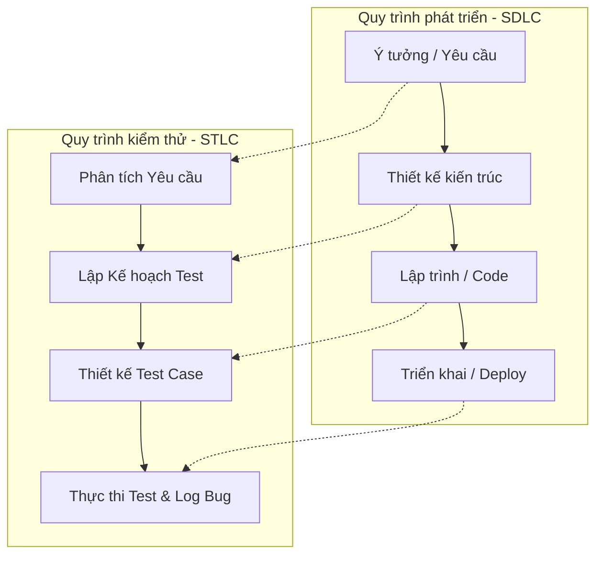
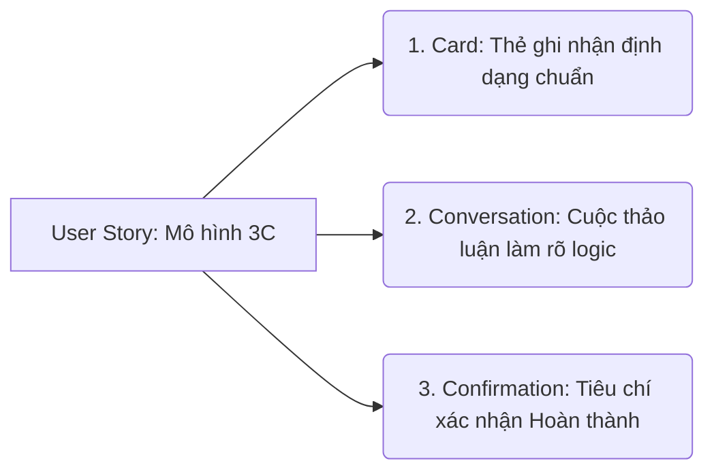
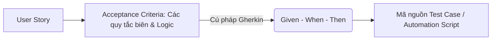
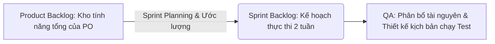
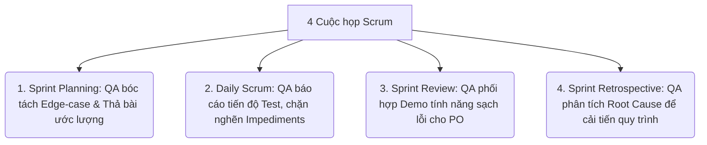
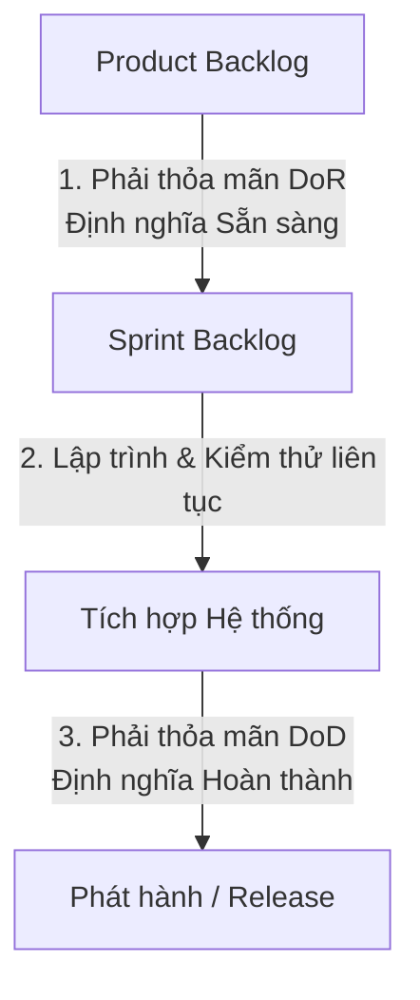
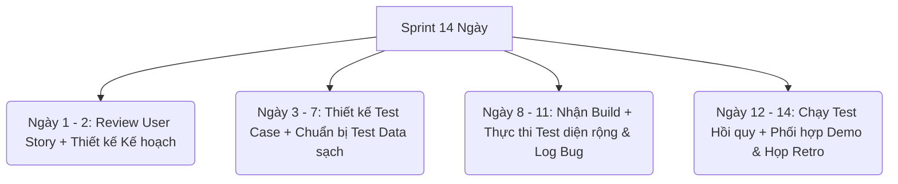

# 📁 02. SDLC, STLC & Mô hình Agile

*Mục tiêu: Hiểu cách phần mềm được hình thành từ ý tưởng đến thực tế, quy trình kiểm thử song hành và cách vận hành một đội ngũ Agile/Scrum.*

# **2.3. Agile / Scrum In-Depth**

## 📌 Mục lục nội bộ (Chặng 02)

- [ ] [**2.1. SDLC (Software Development Life Cycle)**](./1_SDLC.md)
- [ ] [**2.2. STLC (Software Testing Life Cycle)**](./2_STLC.md)
- [ ] [**2.3. Agile / Scrum In-Depth**]()
  - [ ] [2.3.1. User Story](#231-user-story)
  - [ ] [2.3.2. Acceptance Criteria (AC)](#232-acceptance-criteria-ac)
  - [ ] [2.3.3. Product Backlog & Sprint Backlog](#233-product-backlog--sprint-backlog)
  - [ ] [2.3.4. Scrum Meetings (Planning, Daily, Review, Retro)](#234-scrum-meetings)
  - [ ] [2.3.5. Definition of Ready (DoR) & Definition of Done (DoD)](#235-definition-of-ready-dor--definition-of-done-dod)
  - [ ] [2.3.6. QA Role in Agile Teams](#236-qa-role-in-agile-teams)
- [ ] [**2.4. Testing Strategy**](./4_TestingStrategy.md)
---

## 🗺️ Bản đồ liên kết tổng quan Chặng 02

Trước khi đi vào chi tiết, bạn cần nắm được bức tranh tổng thể về mối quan hệ giữa quy trình phát triển sản phẩm (`SDLC`) và quy trình kiểm thử (`STLC`):



---

# 2.3.1. User Story

**User Story (Câu chuyện người dùng)** là một công cụ trong mô hình Agile/Scrum được sử dụng để mô tả một tính năng phần mềm đứng từ **góc nhìn và ngôn ngữ tự nhiên của người dùng cuối**, thay vì viết bằng các thuật ngữ kỹ thuật khô khan. 

User Story đóng vai trò là Test Basis (Căn cứ kiểm thử) cốt lõi trong môi trường Agile. Nó không phải là một tài liệu đặc tả dày cộp cố định, mà là một **lời mời gọi thảo luận** liên tục giữa ba bên: Khách hàng/Business Analyst (BA), Lập trình viên (Developer) và Kỹ sư kiểm thử (QA/Tester).

## 📊 Bộ khung cấu trúc 3C của một User Story tiêu chuẩn

Một User Story hoàn chỉnh được cấu thành từ mô hình 3C bao gồm:



---

## 🛠️ Chi tiết ma trận vận hành kỹ thuật

### 1. Định dạng viết User Story chuẩn quốc tế
Mọi User Story bắt buộc phải được viết theo một cấu trúc ngữ pháp duy nhất để làm rõ: *Ai là người dùng? Họ muốn làm gì? và Giá trị nhận lại là gì?*

```text
As a <Loại người dùng / Persona>
I want to <Thực hiện hành động / Tính năng>
So that <Nhận được giá trị / Mục tiêu kinh doanh>
```

*   **Ví dụ thực tế:** 
    *   *As a* Khách mua hàng trực tuyến,
    *   *I want to* có thể thêm sản phẩm vào giỏ hàng mà không cần đăng nhập,
    *   *So that* tôi có thể chọn hàng nhanh chóng và không bị ngắt quãng trải nghiệm mua sắm.

### 2. Bộ lọc chất lượng: Tiêu chuẩn INVEST cho QA
Khi tham gia họp lên kế hoạch (`Sprint Planning`), QA cần sử dụng tư duy phản biện để kiểm tra xem User Story của BA/PO viết đã đạt chuẩn chất lượng chưa qua bộ lọc **INVEST**:

*   **I - Independent (Độc lập):** Story nên độc lập, ít phụ thuộc vào các Story khác để có thể lập kế hoạch và test riêng lẻ.
*   **N - Negotiable (Có thể thương lượng):** Story không phải là hợp đồng cứng nhắc, nó có thể được điều chỉnh thay đổi luồng đi sau các cuộc thảo luận của team.
*   **V - Valuable (Có giá trị):** Story phải mang lại giá trị thực tế cho người dùng hoặc doanh nghiệp (Vượt qua nguyên lý số 7 của ISTQB).
*   **E - Estimable (Có thể ước lượng):** Độ phức tạp của Story phải đủ rõ ràng để Dev ước lượng được thời gian code và QA ước lượng được thời gian test.
*   **S - Small (Đủ nhỏ):** Story phải đủ nhỏ để có thể hoàn thành trọn vẹn khâu code và test trong vòng một Sprint (2 tuần). Nếu quá lớn, nó là một Epic và cần phải chia nhỏ ra.
*   **T - Testable (Khả kiểm):** Story phải có các tiêu chí rõ ràng để QA có thể thiết kế được Test Case kiểm tra tính Đúng/Sai (Cần có **Acceptance Criteria**).

---

## 🧠 Vai trò và tư duy thực chiến của QA đối với User Story

*   **Bóc tách "Góc tối" nghiệp vụ:** Khi đọc User Story, lập trình viên sẽ nghĩ cách viết code sao cho luồng đúng chạy được. QA phải dùng tư duy kịch bản biên (`Edge-case Thinking`) để hỏi BA: *"Nếu giỏ hàng đã có 100 sản phẩm mà người dùng cố tình thêm tiếp thì sao?"*, *"Sản phẩm trong giỏ hàng lưu trữ tối đa trong bao lâu nếu người dùng tắt trình duyệt?"*.
*   **Định hình kịch bản kiểm thử sớm (Shift-Left Testing):** QA dựa vào câu chữ của phần `As a... I want to...` để xác định ngay chân dung người dùng (`Persona`) và môi trường tương thích để chuẩn bị trước chiến lược kiểm thử.

> ⚠️ **Tư duy chuyên gia cần nhớ:** 
> Trong dự án Agile, User Story là điểm bắt đầu của chất lượng. QA tuyệt đối không được im lặng trong buổi họp tinh chỉnh tính năng (`Backlog Refinement`). Hãy dùng tiêu chuẩn INVEST làm vũ khí phản biện để ép BA/PO phải viết một User Story rõ ràng, vì chất lượng của User Story quyết định trực tiếp đến chất lượng của bộ Test Case bạn viết sau này.

## 📚 References (Tài liệu tham khảo 2.3.1)
* [ISTQB® Certified Tester Foundation Level (CTFL) Syllabus v4.0](https://istqb.org) - Section 6.1: *Testing in Agile (User Stories and Acceptance Criteria)*.
* **Mike Cohn (2004)** - *User Stories Applied: For Agile Software Development*, Addison-Wesley (Tác phẩm kinh điển gối đầu giường định hình toàn bộ khái niệm và cách vận dụng User Story trong công nghệ phần mềm).
---

# 2.3.2. Acceptance Criteria (AC)

**Acceptance Criteria (Tiêu chí nghiệm thu - AC)** là tập hợp các điều kiện, quy tắc nghiệp vụ và ranh giới logic đi kèm với một User Story. AC quy định rõ ràng hệ thống bắt buộc phải hoạt động như thế nào để được Khách hàng hoặc Product Owner (PO) chấp nhận nghiệm thu tính năng đó là hoàn thành.

Nếu User Story là một mô tả tổng quan về nhu cầu, thì **Acceptance Criteria chính là "nguồn chân lý" (`Test Oracle`) tối cao** giúp QA bám vào để thiết kế bộ Test Case và chuyển đổi sang kịch bản kiểm thử tự động.

## 📊 Mô hình Chuyển đổi từ Tiêu chí Nghiệm thu sang Kịch bản Kiểm thử

Quy trình xử lý AC giúp định hình và tự động hóa các kịch bản kiểm thử từ rất sớm:



---

## 🛠️ Chi tiết ma trận vận hành kỹ thuật

### 1. Định dạng viết Acceptance Criteria chuẩn quốc tế (Scenario-Based / BDD)
Để tránh hiểu lầm giữa các phòng ban, AC hiện đại được viết theo cú pháp **Gherkin** (Ngôn ngữ tiếng Anh tự nhiên có cấu trúc hướng hành vi) để mô tả rõ ràng trạng thái hệ thống:

*   **Scenario:** Tên kịch bản/tình huống nghiệp vụ cụ thể.
*   **Given (Tiền điều kiện):** Trạng thái ban đầu hoặc ngữ cảnh nền của hệ thống trước khi hành động xảy ra.
*   **When (Hành động):** Tác động, thao tác trực tiếp của người dùng vào hệ thống.
*   **Then (Kết quả mong đợi):** Phản ứng, sự thay đổi trạng thái hoặc thông báo đầu ra của hệ thống.
*   **And / But (Bổ sung):** Kết hợp thêm các điều kiện hoặc kết quả đi kèm.

### 💡 Ví dụ thực tế: Tính năng "Rút tiền tại cây ATM"
*   **User Story:** *As an* Chủ thẻ ngân hàng, *I want to* rút tiền mặt tại cây ATM, *So that* tôi có thể tiêu dùng nhanh.
*   **Acceptance Criteria 1: Rút tiền thành công (Happy Path)**
    ```text
    Scenario: Rút số tiền hợp lệ trong hạn mức
      Given Tài khoản của tôi đang hoạt động hợp lệ
      And Số dư tài khoản của tôi đang có 5.000.000 VND
      When Tôi nhập số tiền cần rút là 2.000.000 VND
      Then Hệ thống ATM phải nhả ra 2.000.000 VND tiền mặt
      And Hệ thống phải trừ số dư tài khoản của tôi đi 2.000.000 VND
      And Hệ thống hiển thị thông báo giao dịch thành công
    ```
*   **Acceptance Criteria 2: Chặn rút tiền do vượt quá số dư (Unhappy Path / Edge Case)**
    ```text
    Scenario: Rút số tiền vượt quá số dư hiện tại
      Given Tài khoản của tôi đang hoạt động hợp lệ
      And Số dư tài khoản của tôi đang có 1.000.000 VND
      When Tôi nhập số tiền cần rút là 2.000.000 VND
      Then Hệ thống ATM phải chặn giao dịch và không nhả tiền mặt
      And Hệ thống hiển thị thông báo lỗi "Số dư tài khoản không đủ"
      And Số dư tài khoản của tôi vẫn giữ nguyên là 1.000.000 VND
    ```

---

## 🧠 Vai trò và tư duy thực chiến của QA đối với Acceptance Criteria

*   **Chốt chặn cho Định nghĩa hoàn thành (DoD):** QA dựa vào AC để bấm nút nghiệm thu. Nếu hệ thống chạy đúng tất cả các kịch bản viết trong AC, tính năng đó đạt chất lượng nghiệm thu kỹ thuật. Nếu thiếu dù chỉ một điều kiện trong AC, QA có quyền đánh trạng thái `FAIL` và trả về bắt Dev sửa đổi.
*   **Nền tảng cho Automation Testing (BDD/Cucumber/Playwright):** Cú pháp `Given-When-Then` của AC giúp Kỹ sư Automation Test có thể copy trực tiếp vào các Framework kiểm thử tự động hiện đại (như Cucumber, SpecFlow). Code tự động sẽ đọc hiểu các câu chữ này để ánh xạ trực tiếp thành các hàm click chuột, nhập liệu tự động mà không cần viết lại kịch bản từ đầu.

> ⚠️ **Tư duy chuyên gia cần nhớ:** 
> Biên soạn Acceptance Criteria là nhiệm vụ của BA hoặc PO, nhưng **QA phải là người phê duyệt (Sign-off) chất lượng của AC**. Trong buổi họp tinh chỉnh tính năng, nếu QA phát hiện AC viết thiếu các trường hợp lỗi (`Unhappy Path`) hoặc thiếu kịch bản biên, bạn phải lên tiếng yêu cầu bổ sung AC ngay lập tức. Làm sạch AC ở giai đoạn này giúp cả đội né được 80% rủi ro tranh cãi ở giai đoạn bàn giao code sau này.

## 📚 References (Tài liệu tham khảo 2.3.2)
* [ISTQB® Certified Tester Foundation Level (CTFL) Syllabus v4.0](https://istqb.org) - Section 6.1.1: *User Stories and Acceptance Criteria*.
* **Dan North (2006)** - *Introducing BDD (Behavior-Driven Development)*, Better Software Magazine (Tác giả đặt nền móng phát minh ra cú pháp Given-When-Then và triết lý phát triển hướng hành vi).
---

# 2.3.3. Product Backlog & Sprint Backlog

Trong khung làm việc Scrum, các yêu cầu phát triển phần mềm không được quản lý bằng các file tài liệu tĩnh mà được lưu trữ, vận hành linh hoạt dưới dạng hai danh sách công việc: **Product Backlog** và **Sprint Backlog**. 

Hiểu rõ cơ chế này giúp QA nắm bắt được dòng dịch chuyển của tính năng và chủ động lên kế hoạch phân bổ tài nguyên kiểm thử tương ứng.

## 📊 Mô hình Dịch chuyển Yêu cầu trong Scrum

Yêu cầu dịch chuyển từ kho lưu trữ tổng của dự án vào không gian thực thi ngắn hạn của từng chu kỳ Sprint:



---

## 🛠️ Chi tiết ma trận vận hành kỹ thuật

### 1. Product Backlog — Kho lưu trữ vĩ mô của Product Owner
* **Bản chất:** Là một danh sách tập trung chứa tất cả các tính năng, yêu cầu cải tiến, lỗi kỹ thuật cần sửa (`Bug Fixes`) và các công việc hạ tầng cần thực hiện trong tương lai của sản phẩm. 
* **Đặc điểm:** Danh sách này thuộc quyền sở hữu của **Product Owner (PO)**. PO liên tục cập nhật, sắp xếp thứ tự ưu tiên từ cao xuống thấp dựa trên giá trị kinh doanh. Các hạng mục ở trên cùng luôn rõ ràng, chi tiết (đạt tiêu chuẩn INVEST) để chuẩn bị thực hiện ngay, càng xuống dưới thì càng vĩ mô và mơ hồ.

### 2. Sprint Backlog — Kế hoạch thực thi vi mô của Toàn đội
* **Bản chất:** Là danh sách các User Stories và các Task kỹ thuật cụ thể mà Đội ngũ phát triển (`Scrum Team`) cam kết sẽ hoàn thành trọn vẹn (bao gồm cả Code và Test) trong vòng một Sprint (thường kéo dài từ 2-4 tuần).
* **Đặc điểm:** Sprint Backlog thuộc quyền sở hữu độc quyền của Đội ngũ phát triển. Sau khi cuộc họp Sprint Planning kết thúc, không ai (kể cả PO hay Giám đốc) có quyền tự ý nhét thêm việc vào Sprint Backlog để tránh làm vỡ tiến độ và quá tải nguồn lực của Lập trình viên và QA.

### 3. Hoạt động thực chiến của QA: Ước lượng Planning Poker (Story Points)
* Khi team họp để ước lượng độ phức tạp của một tính năng bằng điểm số (`Story Points`), QA bắt buộc phải tham gia thảo luận và thả bài ước lượng. Bạn không được ngồi im vì nghĩ "Dev code thì Dev tính điểm". 
* Độ phức tạp của một User Story bao gồm cả thời gian phân tích, thiết kế kịch bản (`Test Case`), chuẩn bị dữ liệu (`Test Data`) và thực thi chạy test. Nếu một tính năng code rất dễ nhưng logic test kịch bản biên cực kỳ loằng ngoằng, QA phải lên tiếng yêu cầu nâng điểm Story Points lên để bảo vệ quỹ thời gian test của mình, hướng tới tư duy **Quality Ownership**.

> ⚠️ **Tư duy chuyên gia cần nhớ:** 
> Sự khác biệt lớn nhất giữa một Tester truyền thống và một QA trong môi trường Agile/Scrum là khả năng kiểm soát phạm vi công việc. Bằng cách theo dõi chặt chẽ Sprint Backlog, QA có thể chủ động cảnh báo cho Scrum Master ngay lập tức nếu thấy khối lượng code đổ về giai đoạn cuối Sprint quá lớn, giúp ngăn ngừa lỗi nghẽn cổ chai phá hủy chất lượng sản phẩm.

## 📚 References (Tài liệu tham khảo 2.3.3)
* [The Official Scrum Guide](https://scrumguides.org) - Sections: *Product Backlog* & *Sprint Backlog*.
* [ISTQB® Certified Tester Foundation Level (CTFL) Syllabus v4.0](https://istqb.org) - Section 6.1.2: *Collaborative User Story Authorship* & Section 6.2: *Testing Practices in Agile Projects*.
---

# 2.3.4. Scrum Meetings (Planning, Daily, Review, Retro)

Một chu kỳ Sprint trong khung làm việc Scrum được vận hành thông qua **4 sự kiện/cuộc họp bắt buộc (Scrum Events)**. Kỹ sư QA/Tester không phải là người đứng ngoài quan sát, mà tại mỗi cuộc họp, bạn có một ma trận trách nhiệm hành động cụ thể để bảo vệ chất lượng sản phẩm từ gốc.

## 👥 Ma trận Trách nhiệm hành động của QA trong 4 cuộc họp



---

## 🛠️ Chi tiết hoạt động thực chiến của QA tại từng sự kiện

### 1. Sprint Planning (Họp Kế hoạch Sprint)
* **Mục tiêu chung:** Product Owner (PO) giải thích các User Stories ưu tiên cao, team thảo luận và quyết định sẽ mang bao nhiêu việc vào Sprint Backlog dựa trên năng suất thực tế.
* **Hành động của QA:** Áp dụng kỹ thuật đặt câu hỏi phản biện (`Requirement Questioning`) để tìm lỗ hổng yêu cầu, ép BA/PO làm rõ tiêu chí nghiệm thu AC. QA bắt buộc phải tham gia thả bài ước lượng độ phức tạp (`Story Points`), tính toán cả thời gian thiết kế kịch bản và chuẩn bị dữ liệu test.

### 2. Daily Scrum (Họp đứng 15 phút mỗi sáng)
* **Mục tiêu chung:** Đồng bộ công việc hàng ngày của toàn đội trong vòng 15 phút ngắn gọn để trả lời 3 câu hỏi: *Hôm qua làm gì? Hôm nay làm gì? Có gặp khó khăn gì không?*
* **Hành động của QA:** Báo cáo gãy gọn tiến độ test và trạng thái lỗi (Ví dụ: *"Hôm qua đã chạy xong 20 Test Cases cho module Đăng ký. Hôm nay sẽ test tiếp luồng API. Hiện tại đang gặp khó khăn (Impediment) do môi trường test bị mất kết nối Database, đề xuất Scrum Master hỗ trợ liên hệ đội Ops cấu hình lại"*).

### 3. Sprint Review (Họp Sơ kết Sprint / Demo)
* **Mục tiêu chung:** Diễn ra vào cuối Sprint, team trình diễn sản phẩm chạy thực tế đạt tiêu chuẩn Hoàn thành cho Khách hàng và PO xem để nhận phản hồi trực tiếp.
* **Hành động của QA:** QA phối hợp cùng Lập trình viên để chuẩn bị dữ liệu và điều phối luồng chạy Demo. Đảm bảo tính năng mang lên trình diễn phải là phiên bản sạch lỗi nghiêm trọng, chạy mượt mà đúng theo AC để xây dựng lòng tin (`Building confidence`) cho khách hàng.

### 4. Sprint Retrospective (Họp Cải tiến Sprint / Retro)
* **Mục tiêu chung:** Toàn đội nhìn nhận lại nội bộ sau một Sprint: *Cái gì làm tốt? Cái gì làm chưa tốt? Hành động cải tiến cụ thể cho Sprint sau là gì?*
* **Hành động của QA:** Áp dụng tư duy **Quality Ownership**. Nếu Sprint vừa qua có lỗi nghiêm trọng lọt lưới ra môi trường thực tế (`Defect Escape`), QA chủ trì buổi phân tích nguyên nhân gốc rễ (`Blameless RCA`) không đổ lỗi cá nhân, từ đó đưa ra hành động cải tiến quy trình (Ví dụ: Bổ sung thêm chốt chặn kiểm tra code cho Dev) để ép chèn thành một Task bắt buộc trong Sprint sau.

> ⚠️ **Tư duy chuyên gia cần nhớ:** 
> Đừng bao giờ biến các cuộc họp Scrum thành những buổi báo cáo thủ tục vô hồn. QA thực chiến coi đây là các chốt chặn kỹ thuật tối cao. Nếu bạn im lặng trong họp Planning, bạn sẽ chịu cảnh thiếu thời gian test. Nếu bạn im lặng trong họp Daily, lỗi nghẽn cổ chai sẽ giết chết chất lượng sản phẩm vào ngày cuối cùng của Sprint.

## 📚 References (Tài liệu tham khảo 2.3.4)
* [The Official Scrum Guide](https://scrumguides.org) - Section: *Scrum Events*.
* [ISTQB® Certified Tester Foundation Level (CTFL) Syllabus v4.0](https://istqb.org) - Section 6.2: *Testing Practices in Agile Projects*.


# 2.3.5. Definition of Ready (DoR) & Definition of Done (DoD)

Trong khung làm việc Scrum, để đảm bảo tốc độ phát triển nhanh nhưng không làm suy giảm chất lượng sản phẩm, toàn đội bắt buộc phải thiết lập và tuân thủ hai bộ tiêu chí chốt chặn sinh tử: **Definition of Ready (DoR - Định nghĩa Sẵn sàng)** và **Definition of Done (DoD - Định nghĩa Hoàn thành)**. 

Hai bộ chỉ số này đóng vai trò như những "bộ lọc hải quan kỹ thuật", bảo vệ nghiêm ngặt chất lượng đầu vào và chất lượng đầu ra của mỗi chu kỳ Sprint.

## 📊 Mô hình Chốt chặn Hai đầu của một Tính năng

Một hạng mục công việc (User Story) muốn được vận hành mượt mà bắt buộc phải vượt qua hai cánh cửa kiểm soát chất lượng:



---

## 🛠️ Chi tiết ma trận vận hành kỹ thuật của QA

### 1. Definition of Ready (DoR) — Chốt chặn Đầu vào
* **Bản chất:** Là một danh sách các điều kiện bắt buộc mà một User Story phải thỏa mãn **TRƯỚC KHI** được phép mang vào cuộc họp `Sprint Planning` để Dev và QA bắt tay vào code, test. DoR ngăn chặn rủi ro team nhận yêu cầu mơ hồ dẫn đến việc code sai hướng.
* **Bộ tiêu chí DoR tiêu chuẩn (QA tham gia giữ chốt):**
  * User Story được viết đúng định dạng cấu trúc chuẩn (`As a... I want to... So that...`).
  * Tiêu chí nghiệm thu **Acceptance Criteria (AC)** rõ ràng, bao phủ luồng đúng/luồng sai và đã được QA phê duyệt tính khả kiểm (`Testability`).
  * Bản thiết kế giao diện (Figma/Mockup) đã chốt phiên bản cuối cùng, không sửa đổi thêm.
  * Các phụ thuộc kỹ thuật (`Dependencies`) với các đội nhóm khác đã được giải quyết triệt để.
  * Độ phức tạp của tính năng đã được ước lượng thành công bằng điểm số (`Story Points`).

### 2. Definition of Done (DoD) — Chốt chặn Đầu ra
* **Bản chất:** Là một danh sách các tiêu chuẩn kỹ thuật bắt buộc mà một User Story phải đạt được **TRƯỚC KHI** được tuyên bố là Hoàn thành (`Done`) để mang đi trình diễn cho khách hàng (Demo) và tích hợp vào hệ thống chung. DoD ngăn chặn tình trạng Dev báo "Xong" nhưng thực tế vẫn còn đầy lỗi kỹ thuật hoặc chưa được kiểm tra bảo mật.
* **Bộ tiêu chí DoD tiêu chuẩn (QA là người trực tiếp chấm điểm):**
  * Lập trình viên đã hoàn thành mã nguồn, chạy review chéo code (`Code Review`) thành công.
  * Độ phủ dòng lệnh của Unit Test đạt tỷ lệ quy định của dự án (Ví dụ: `Code Coverage > 80%`).
  * Tính năng đã được triển khai thành công lên môi trường kiểm thử sạch (`QA/Staging Environment`).
  * **QA đã thực thi 100% các Test Case cốt lõi** và chốt độ bao phủ kiểm thử (`Test Coverage`).
  * Không còn tồn đọng bất kỳ lỗi nghiêm trọng nào mức độ `Blocker`, `Critical` hoặc `Major` chưa sửa. Các lỗi mức độ `Low` được ghi nhận rõ ràng mã vé trên Jira để dời sang chu kỳ sau.
  * Bộ mã kịch bản Automation Test hồi quy (`Regression Suite`) đã được cập nhật tính năng mới này và chạy thành công trên đường ống CI/CD.

> ⚠️ **Tư duy chuyên gia cần nhớ:** 
> DoR bảo vệ Team khỏi sự mập mờ của BA/PO; DoD bảo vệ Khách hàng khỏi sự cẩu thả của Dev/QA. Là một kỹ sư QA, bạn phải có tinh thần thép để bảo vệ hai chốt chặn này. Nếu một tính năng chưa thỏa mãn DoR, tuyệt đối không nhận vào làm trong Sprint. Nếu một tính năng còn lỗi Major chưa sửa, tuyệt đối không ký duyệt cho trạng thái sang `Done`.

## 📚 References (Tài liệu tham khảo 2.3.5)
* [The Official Scrum Guide](https://scrumguides.org) - Section: *Artifacts (Definition of Done)*.
* [ISTQB® Certified Tester Foundation Level (CTFL) Syllabus v4.0](https://istqb.org) - Section 5.1.3: *Entry Criteria and Exit Criteria (DoR and DoD)*.


---

# 2.3.6. QA Role in Agile Teams

Trong một đội ngũ phát triển phần mềm theo mô hình Agile/Scrum, vai trò của người kỹ sư QA/Tester đã dịch chuyển hoàn toàn từ một người "chỉ biết tìm lỗi ở cuối chặng" thành **một chuyên gia đồng hành kiểm soát chất lượng xuyên suốt mọi tích tắc của dự án** (`Whole-Team Approach to Quality`). 

Để hình dung công việc thực tế của một QA, chúng ta hãy bóc tách lịch trình hành động chi tiết của QA trong một chu kỳ Sprint tiêu chuẩn kéo dài **14 ngày (2 tuần)**.

## 📊 Ma trận Hành trình Công việc của QA trong một Sprint 14 ngày

Quy trình làm việc của QA được phân bổ khoa học, song hành trực tiếp cùng tốc độ viết code của Developer:



---

## 🛠️ Chi tiết hoạt động thực chiến theo từng chặng Sprint

### Chặng 1: Khởi động Sprint (Ngày 1 — Ngày 2)
* **Tham gia họp Sprint Planning:** Đóng vai trò phản biện, ép BA/PO làm rõ các tiêu chí nghiệm thu AC, kiểm tra xem User Story có đạt chuẩn DoR hay không.
* **Thả bài ước lượng (Planning Poker):** QA thảo luận và đưa ra điểm số độ phức tạp (`Story Points`) cho từng tính năng, tính toán dựa trên cả thời gian code và thời gian test thực tế.
* **Xác định Chiến lược kiểm thử sơ khởi:** Phân chia xem tính năng nào trong Sprint Backlog sẽ được test bằng tay (`Manual Test`), tính năng nào cần viết code tự động (`Automation Test`).

### Chặng 2: Thiết kế và Chuẩn bị (Ngày 3 — Ngày 7)
* **Thiết kế bộ kịch bản Test Case:** Áp dụng các kỹ thuật phân tích giá trị biên, phân vùng tương đương để viết bộ kịch bản chi tiết cho các User Stories.
* **Xây dựng dữ liệu test (`Test Data`):** Tạo sẵn các tài khoản test, chuẩn bị các tệp tin lỗi, hoặc cấu hình sẵn các tham số đầu vào trên hệ thống để sẵn sàng thực thi.
* **Chia sẻ kịch bản sớm:** QA chủ động gửi trước các kịch bản kiểm thử cốt lõi cho Developer xem trước khi họ viết code. Việc này giúp Developer hiểu rõ các trường hợp biên để tự né lỗi ngay trong lúc lập trình (`Bug Prevention`).

### Chặng 3: Thực thi và Săn lỗi (Ngày 8 — Ngày 11)
* **Kiểm tra môi trường (`Smoke Test`):** Khi Developer bàn giao bản cài đặt (`Build`), QA chạy ngay một bộ test suite ngắn để chốt chặn môi trường sạch lỗi khói.
* **Thực thi Test diện rộng:** Chạy toàn bộ các Test Case đã thiết kế, so sánh `Actual Result` và `Expected Result` để săn lùng Defect hệ thống.
* **Ghi nhận lỗi chuyên nghiệp:** Khởi tạo các Bug Tickets đạt chuẩn quốc tế lên Jira, phân cấp chính xác mức độ `Severity` để Dev tập trung sửa các lỗi nghiêm trọng trước.

### Chặng 4: Về đích và Nghiệm thu (Ngày 12 — Ngày 14)
* **Kiểm thử hồi quy (`Regression Testing`):** Chạy lại bộ test suite cốt lõi để đảm bảo việc Dev sửa Bug mới không vô tình làm hỏng các tính năng cũ đang chạy ổn định.
* **Nghiệm thu tính năng (DoD):** QA đã thực thi kịch bản kiểm thử, đối chiếu hệ thống với bộ Tiêu chuẩn Hoàn thành (`Definition of Done`), ký duyệt trạng thái chuyển các User Story sang `Done`.
* **Phối hợp Demo & Họp Retrospective:** Hỗ trợ trình diễn sản phẩm sạch lỗi cho Khách hàng xem trong buổi Sprint Review, và chủ trì buổi phân tích nguyên nhân gốc rễ lỗi (`RCA`) trong buổi họp Retro nội bộ để cải tiến quy trình cho Sprint sau.

> ⚠️ **Tư duy chuyên gia cần nhớ:** 
> QA trong môi trường Agile phải là người có kỹ năng quản lý thời gian cực kỳ xuất sắc. Bạn không được phép ngồi im thụ động trong 7 ngày đầu để chờ Dev giao code. Nếu bạn không chủ động chuẩn bị Test Case và Test Data từ trước, bạn sẽ lập tiếp bị bóp nghẹt thời gian ở những ngày cuối Sprint, dẫn đến áp lực kiệt sức và lọt Bug nghiêm trọng ra Production.

## 📚 References (Tài liệu tham khảo 2.3.6)
* [ISTQB® Certified Tester Foundation Level (CTFL) Syllabus v4.0](https://istqb.org) - Section 6.1.3: *The Whole-Team Approach* & Section 6.2.1: *Testing Practices in Agile*.
* **Lisa Crispin, Janet Gregory (2009)** - *Agile Testing: A Practical Guide for Testers and Agile Teams*, Addison-Wesley.
