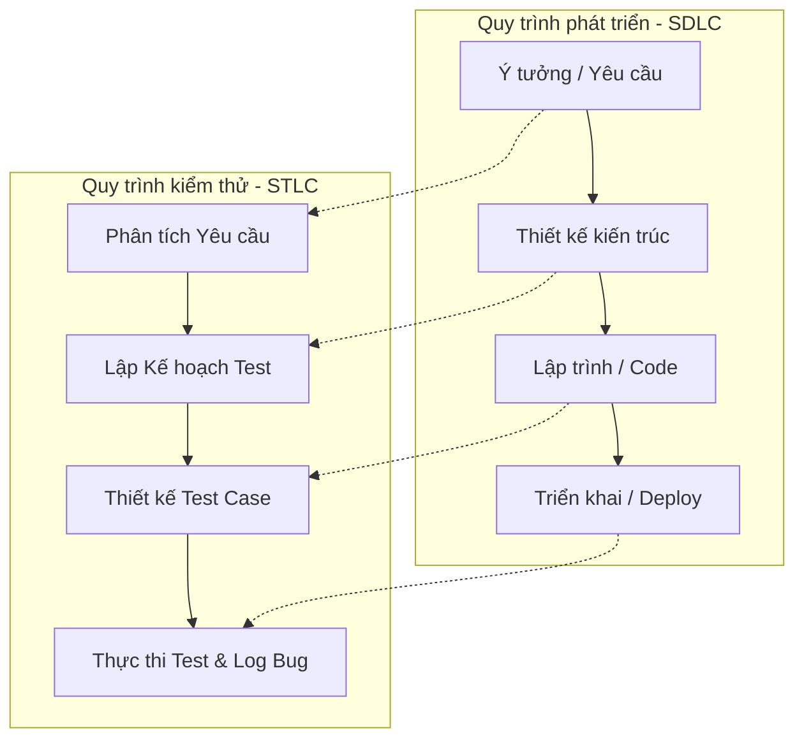
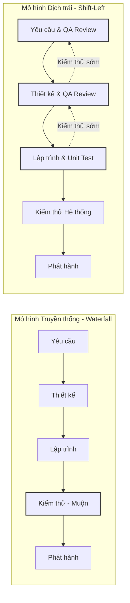
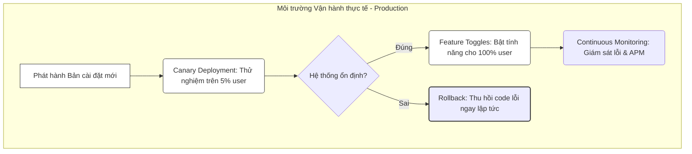

# 📁 02. SDLC, STLC & Mô hình Agile

*Mục tiêu: Hiểu cách phần mềm được hình thành từ ý tưởng đến thực tế, quy trình kiểm thử song hành và cách vận hành một đội ngũ Agile/Scrum.*

# **2.4. Testing Strategy**

## 📌 Mục lục nội bộ (Chặng 02)

- [ ] [**2.1. SDLC (Software Development Life Cycle)**](./1_SDLC.md)
- [ ] [**2.2. STLC (Software Testing Life Cycle)**](./2_STLC.md)
- [ ] [**2.3. Agile / Scrum In-Depth**](./3_AgileScrum.md)
- [ ] [**2.4. Testing Strategy**](./4_TestingStrategy.md)
  - [ ] [2.4.1. Shift-Left Testing](#241-shift-left-testing)
  - [ ] [2.4.2. Shift-Right Testing](#242-shift-right-testing)
  - [ ] [2.4.3. Risk-based Testing](#243-risk-based-testing)

---

## 🗺️ Bản đồ liên kết tổng quan Chặng 02

Trước khi đi vào chi tiết, bạn cần nắm được bức tranh tổng thể về mối quan hệ giữa quy trình phát triển sản phẩm (`SDLC`) và quy trình kiểm thử (`STLC`):

---
# 2.4.1. Shift-Left Testing

**Shift-Left Testing (Kiểm thử dịch trái)** là một chiến lược kiểm thử phần mềm hiện đại, tập trung vào việc **đẩy toàn bộ các hoạt động kiểm tra, đánh giá chất lượng về những giai đoạn sớm nhất có thể** trong vòng đời phát triển phần mềm (`SDLC`), thay vì đợi đến khi hệ thống có code hoặc ở cuối dự án mới thực hiện.

"Trái" (Left) ở đây đại diện cho các giai đoạn đầu tiên trên dòng thời gian của quy trình SDLC (khâu ý tưởng, tài liệu yêu cầu, thiết kế kiến trúc kỹ thuật).

## 📊 Mô hình Dịch chuyển Thời gian Phát hiện Lỗi

Chiến lược dịch trái thay đổi hoàn toàn tư duy tiếp cận từ "Tìm lỗi" (ở giai đoạn muộn) sang "Phòng ngừa lỗi" (ngay từ giai đoạn đầu):

---

## 🛠️ Chi tiết ma trận vận hành kỹ thuật của QA

### 1. Bản chất cốt lõi của Shift-Left Testing
* **Chuyển dịch từ Tìm bug sang Phòng ngừa bug (Bug Prevention):** Mục tiêu tối cao không phải là ngồi chờ Developer tạo ra lỗi rồi Tester đi bắt, mà là QA nhảy vào làm việc cùng BA và Dev để triệt tiêu các hiểu lầm về logic ngay từ khi viết tài liệu.
* **Tối ưu hóa Chi phí Chất lượng (Cost of Quality):** Nếu phát hiện và sửa một lỗi logic ở giai đoạn viết tài liệu yêu cầu chỉ tốn \$1, thì khi code đã đóng gói đưa ra Production, chi phí khắc phục hậu quả có thể vọt lên \$100+. Shift-Left giúp doanh nghiệp tiết kiệm tối đa ngân sách tài chính.

### 2. Các hành động cụ thể để thực hiện Shift-Left trong Team
* **Kiểm thử tĩnh (Static Testing):** QA chủ động tham gia vào các buổi review tài liệu nghiệp vụ (`SRS`, `User Story`), áp dụng kỹ thuật **Requirement Questioning** để bóc tách kịch bản biên và ép BA làm rõ các tiêu chí nghiệm thu mơ hồ.
* **Chia sẻ kịch bản kiểm thử sớm (Test Cases Sharing):** QA hoàn thiện bộ khung Test Case ngay khi tài liệu vừa chốt và gửi trực tiếp cho Lập trình viên xem trước khi họ bắt tay vào viết code. Dev sẽ nhìn vào bộ kịch bản này để biết hệ thống sẽ bị test ở những điểm nào, từ đó tự phòng ngự code sạch lỗi biên.
* **Thúc đẩy Unit Test và Code Review:** QA phối hợp cùng Test Lead/Tech Lead thiết lập quy định trong bộ Tiêu chuẩn Hoàn thành (`DoD`): Lập trình viên bắt buộc phải tự viết code kiểm thử đơn vị (`Unit Test`) đạt độ phủ dòng lệnh trên 80% thì mới được phép bàn giao bài cho QA.

> ⚠️ **Tư duy chuyên gia cần nhớ:** 
> Áp dụng Shift-Left Testing đòi hỏi kỹ sư QA phải có kỹ năng giao tiếp tốt và sự am hiểu nghiệp vụ (`Domain Knowledge`) sâu sắc. Bạn không thể "dịch trái" nếu bạn chỉ ngồi im một chỗ chờ giao việc. Hãy chủ động gõ cửa phòng BA, chủ động nói chuyện với Dev từ ngày đầu tiên của dự án. Nhớ rằng: *Mục tiêu của QA không phải là có một danh sách Bug thật dài trên Jira, mà là có một sản phẩm cuối cùng thật sạch lỗi.*

## 📚 References (Tài liệu tham khảo 2.4.1)
* [ISTQB® Certified Tester Foundation Level (CTFL) Syllabus v4.0](https://istqb.org) - Section 2.1.3: *Testing as a Driver for Software Development (Shift-Left Approach)*.
* **Arthur Hicken (2018)** - *The Shift-Left Testing Practice Guide*, IEEE Software Frameworks.

# 2.4.2. Shift-Right Testing

**Shift-Right Testing (Kiểm thử dịch phải)** là chiến lược kiểm thử phần mềm hiện đại, tập trung vào việc **thực hiện các hoạt động kiểm thừ, giám sát và thu thập phản hồi trực tiếp trên môi trường vận hành thực tế (Production Environment)** sau khi sản phẩm đã được phát hành tới người dùng cuối.

"Phải" (Right) ở đây đại diện cho các giai đoạn cuối cùng trên dòng thời gian của quy trình `SDLC` (khâu vận hành và bảo trì sản phẩm thực tế).

## 📊 Mô hình Phân bổ Không gian Kiểm thử trên Production

Chiến lược dịch phải giúp kiểm soát chất lượng dựa trên hành vi thực tế của người dùng và độ ổn định của hệ thống live:

---

## 🛠️ Chi tiết ma trận vận hành kỹ thuật của QA

### 1. Bản chất cốt lõi của Shift-Right Testing
* **Chấp nhận thực tế hệ thống phức tạp:** Trong kỷ nguyên microservices và hệ thống phân tán, việc giả lập một môi trường test (`Staging`) giống hệt 100% môi trường thực tế là bất khả thi về mặt chi phí và kỹ thuật. Shift-Right thừa nhận rằng: *Có những loại Bug chỉ xuất hiện khi có dữ liệu thật và lượng tải thật của hàng triệu người dùng*.
* **Cân bằng rủi ro và Tốc độ phát hành (Time-to-market):** Thay vì giữ code lại môi trường test hàng tháng trời để cố tìm những bug siêu nhỏ, doanh nghiệp tung sản phẩm ra sớm hơn nhưng áp dụng các chốt chặn kỹ thuật trên Production để nếu có lỗi xảy ra, thiệt hại sẽ bị cô lập ở mức nhỏ nhất.

### 2. Các hành động và Công cụ thực chiến của QA tại nhánh Dịch Phải
* **Canary Deployment (Triển khai chim yến phụng):** Kỹ thuật cấu hình hạ tầng để đẩy phiên bản code mới tới một nhóm nhỏ người dùng (Ví dụ: Chỉ 5% khách hàng tại TP.HCM nhận được giao diện mới). QA sẽ theo dõi trực tiếp chỉ số của 5% user này, nếu không phát sinh lỗi sập app, hệ thống mới mở rộng diện rộng cho 95% user còn lại.
* **Feature Toggles / Feature Flags (Công tắc tính năng):** Lập trình viên bao bọc tính năng mới trong một "chiếc công tắc" tắt/mở bằng cấu hình. Khi phát hành lên Production, tính năng này mặc định ở trạng thái TẮT. QA có thể chủ động lên Production, bật công tắc cho riêng tài khoản test của mình để kiểm thử nghiệm thu thực tế. Nếu phát hiện lỗi nghiêm trọng, QA chỉ cần bấm TẮT công tắc trên hệ thống quản lý, tính năng lỗi biến mất ngay lập tức mà không cần tốn thời gian build lại đường ống CI/CD để vá lỗi (`Rollback`).
* **A/B Testing (Kiểm thử so sánh luồng):** Phát hành đồng thời 2 phiên bản giao diện (Phiên bản A và Phiên bản B) cho 2 nhóm khách hàng khác nhau để QA và bộ phận sản phẩm đo lường xem phiên bản nào có tỷ lệ chuyển đổi đơn hàng hoặc trải nghiệm tốt hơn.
* **Continuous Monitoring (Giám sát liên tục):** Đọc các chỉ số hiệu năng ứng dụng thông qua các công cụ APM (Application Performance Monitoring) như Datadog, New Relic hoặc phân tích log lỗi tập trung qua phần mềm như Sentry để chủ động phát hiện lỗi crash app của người dùng trước khi họ kịp gọi điện lên tổng đài khiếu nại.

> ⚠️ **Tư duy chuyên gia cần nhớ:** 
> Shift-Right Testing không phải là cái cớ để lười biếng ở môi trường test rồi ném sản phẩm đầy lỗi cho khách hàng dùng thử (`Test on Production`). Bạn bắt buộc phải hoàn thành trọn vẹn khâu kiểm thử hệ thống cốt lõi ở khâu dịch trái (`Shift-Left`). Shift-Right là một tầng bảo vệ bổ sung nâng cao, giúp bạn kiểm soát những rủi ro cực đoan mà môi trường test không bao giờ giả lập được.

## 📚 References (Tài liệu tham khảo 2.4.2)
* [ISTQB® Certified Tester Foundation Level (CTFL) Syllabus v4.0](https://istqb.org) - Section 2.1.3: *Testing as a Driver for Software Development (Shift-Right Approach)*.
* **Charity Majors, Liz Fong-Jones (2022)** - *Observability Engineering: Achieving Production Excellence*, O'Reilly Media.
