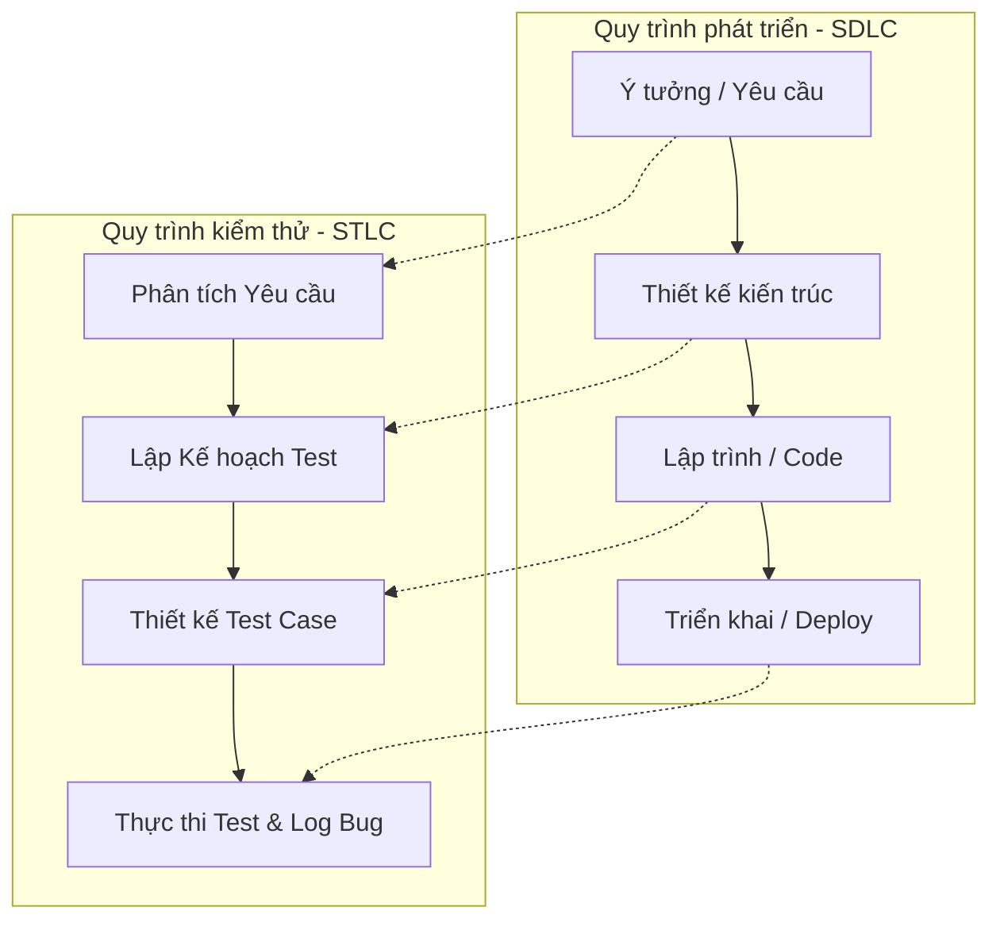

# 📁 02. SDLC, STLC & Mô hình Agile

*Mục tiêu: Hiểu cách phần mềm được hình thành từ ý tưởng đến thực tế, quy trình kiểm thử song hành và cách vận hành một đội ngũ Agile/Scrum.*

## 📌 Mục lục nội bộ (Chặng 02)

- [ ] [**2.1. SDLC (Software Development Life Cycle)**](./1_SDLC.md)
  - [ ] [2.1.1. SDLC Overview](./1_SDLC.md#211-sdlc-overview)
  - [ ] [2.1.2. Waterfall Model](./1_SDLC.md#212-waterfall-model)
  - [ ] [2.1.3. V-Model](./1_SDLC.md#213-v-model)
  - [ ] [2.1.4. Agile Methodology](./1_SDLC.md#214-agile-methodology)
  - [ ] [2.1.5. Scrum Framework](./1_SDLC.md#215-scrum-framework)
  - [ ] [2.1.6. Kanban Board](./1_SDLC.md#216-kanban-board)
  - [ ] [2.1.7. DevOps & DevSecOps](./1_SDLC.md#217-devops--devsecops)
- [ ] **2.2. STLC (Software Testing Life Cycle)**
  - [ ] [2.2.1. Requirement Analysis](./2_STLC.md#221-requirement-analysis)
  - [ ] [2.2.2. Test Planning](./2_STLC.md#222-test-planning)
  - [ ] [2.2.3. Test Case Development](./2_STLC.md#223-test-case-development)
  - [ ] [2.2.4. Test Environment Setup](./2_STLC.md#224-test-environment-setup)
  - [ ] [2.2.5. Test Execution](./2_STLC.md#225-test-execution)
  - [ ] [2.2.6. Defect Reporting](./2_STLC.md#226-defect-reporting)
  - [ ] [2.2.7. Test Cycle Closure](./2_STLC.md#227-test-cycle-closure)
- [ ] **2.3. Agile / Scrum In-Depth**
  - [ ] [2.3.1. User Story](./3_AgileScrum.md#231-user-story)
  - [ ] [2.3.2. Acceptance Criteria (AC)](./3_AgileScrum.md#232-acceptance-criteria-ac)
  - [ ] [2.3.3. Product Backlog & Sprint Backlog](./3_AgileScrum.md#233-product-backlog--sprint-backlog)
  - [ ] [2.3.4. Scrum Meetings (Planning, Daily, Review, Retro)](./3_AgileScrum.md#234-scrum-meetings)
  - [ ] [2.3.5. Definition of Ready (DoR) & Definition of Done (DoD)](./3_AgileScrum.md#235-definition-of-ready-dor--definition-of-done-dod)
  - [ ] [2.3.6. QA Role in Agile Teams](./3_AgileScrum.md#236-qa-role-in-agile-teams)
- [ ] **2.4. Testing Strategy**
  - [ ] [2.4.1. Shift-Left Testing](./4_TestingStrategy.md#241-shift-left-testing)
  - [ ] [2.4.2. Shift-Right Testing](./4_TestingStrategy.md#242-shift-right-testing)
  - [ ] [2.4.3. Risk-based Testing](./4_TestingStrategy.md#243-risk-based-testing)

---

## 🗺️ Bản đồ liên kết tổng quan Chặng 02

Trước khi đi vào chi tiết, bạn cần nắm được bức tranh tổng thể về mối quan hệ giữa quy trình phát triển sản phẩm (`SDLC`) và quy trình kiểm thử (`STLC`):

