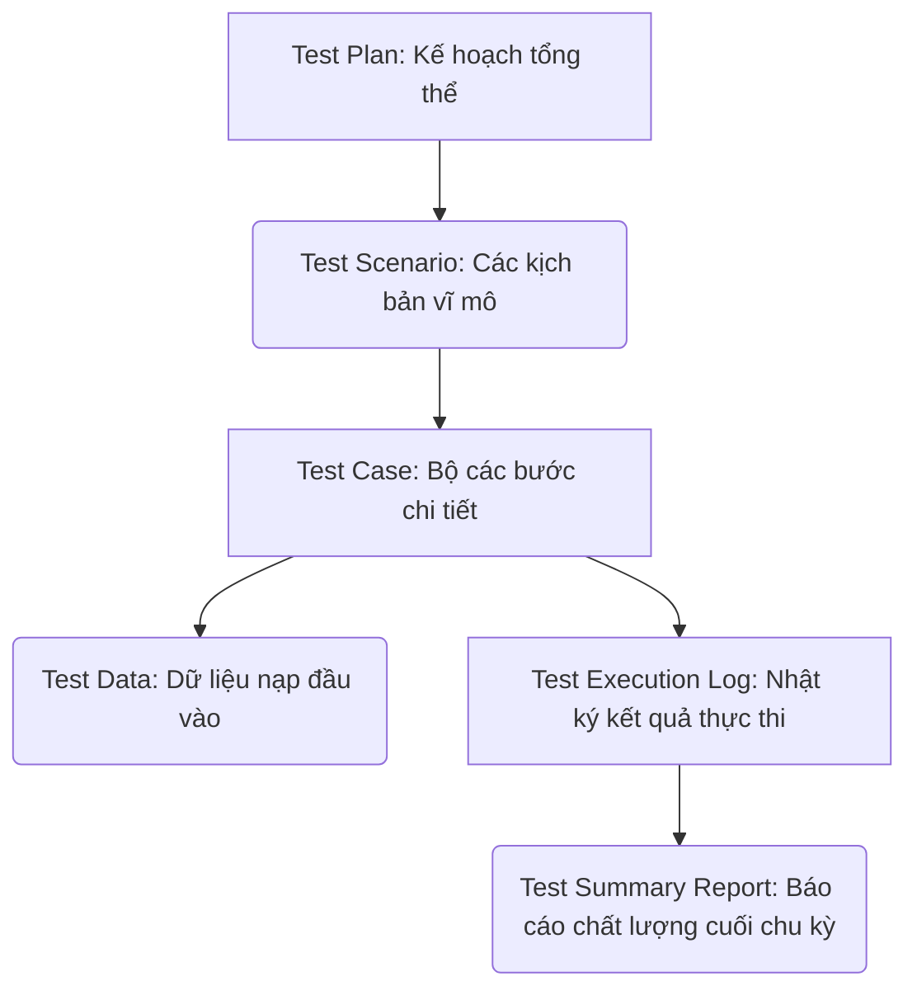
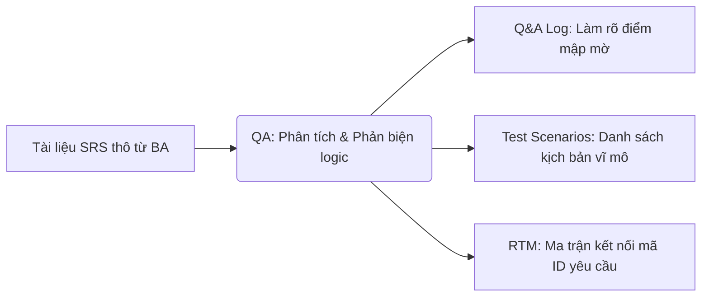
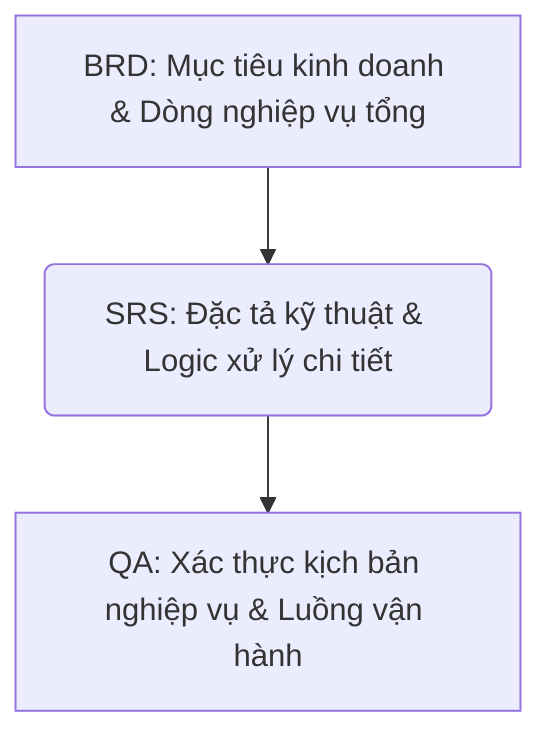
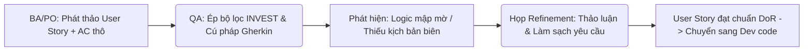
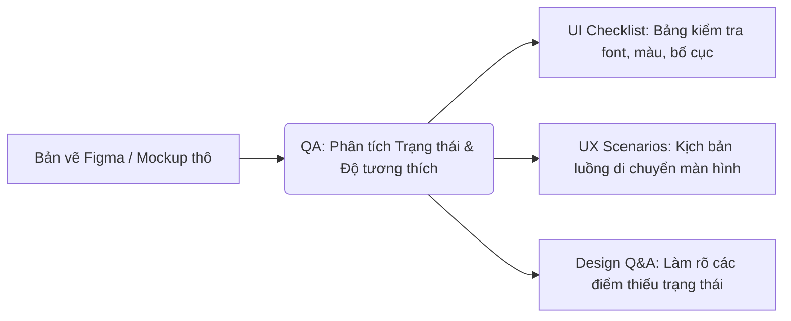
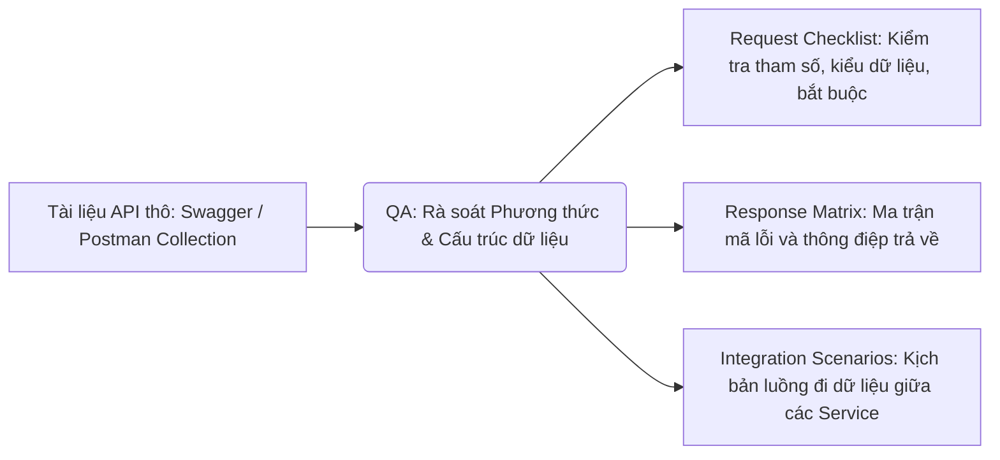

# 📁 03. Manual Testing
*Mục tiêu: Làm chủ quy trình, phân tích tài liệu đặc tả hệ thống chuyên sâu, thực thi kiểm thử thủ công và xây dựng hệ thống tài liệu (Artifacts) chuẩn chỉnh của một Manual Tester.*

# **3.1. Requirements Analysis**

## 📌 Mục lục nội bộ (Chặng 03)

- [ ] [**3.1. Requirements Analysis**](./1_Requirements.md)
  - [ ] [3.1.1. SRS (Software Requirement Specification)](#311-srs)
  - [ ] [3.1.2. BRD (Business Requirement Document)](#312-brd)
  - [ ] [3.1.3. User Story & AC Review](#313-user-story--ac-review)
  - [ ] [3.1.4. Mockup / Wireframe Analysis](#314-mockup--wireframe-analysis)
  - [ ] [3.1.5. API Documentation Review](#315-api-documentation-review)
- [ ] [**3.2. Test Artifacts**](./2_Artifacts.md)
- [ ] [**3.3. Functional Testing Levels & Types**](./3_FunctionalTesting.md)
- [ ] [**3.4. Non-functional Testing**](./4_NonFunctionalTesting.md)
---

## 🗺️ Bản đồ các Tạo tác Kiểm thử (Test Artifacts) của Manual Tester

Trước khi đi vào bóc tách tài liệu đầu vào, bạn cần có cái nhìn tổng quan về các sản phẩm/tài liệu trung gian (Artifacts) do chính tay Manual Tester phải sản sinh ra trong suốt STLC:

# 3.1.1. SRS (Software Requirement Specification)

**SRS (Software Requirement Specification - Tài liệu Đặc tả Yêu cầu Phần mềm)** là tài liệu kỹ thuật toàn diện mô tả chi tiết, đầy đủ về các chức năng (`Functional Requirements`), phi chức năng (`Non-functional Requirements`), các ràng buộc hệ thống và giao diện của một sản phẩm phần mềm trước khi đưa vào phát triển.

Trong dự án kiểm thử thủ công truyền thống hoặc mô hình Hybrid, SRS đóng vai trò là **Căn cứ kiểm thử (`Test Basis`) tối cao**. Tester dựa vào từng điều khoản, dòng chữ và luồng logic trong SRS để làm căn cứ xác định tính Đúng/Sai của hệ thống, từ đó thiết kế ra kết quả mong đợi (`Expected Result`) cho bộ Test Case.

## 📊 Vị trí và Luồng chuyển hóa thông tin từ SRS của QA

Tài liệu SRS thô từ Business Analyst (BA) được QA bóc tách để biến đổi thành các tạo tác kiểm thử có cấu trúc:

---

## 🛠️ Chi tiết cấu trúc một tài liệu SRS tiêu chuẩn

Một tài liệu SRS đạt chuẩn quốc tế (theo khung IEEE 830 / ISO 29148) thường bao gồm các phần cốt lõi mà Tester bắt buộc phải đọc kỹ:

1. **Tổng quan sản phẩm (Overall Description):** Mô tả ngữ cảnh hệ thống, chân dung người dùng (`User Personas`), các ràng buộc về phần cứng/phần mềm và các giả định liên quan.
2. **Yêu cầu chức năng (Functional Requirements):** Đây là trọng tâm của Tester. Phần này mô tả chi tiết từng tính năng hệ thống phải làm gì (Ví dụ: Luồng Đăng nhập, Luồng Thanh toán, Xử lý dữ liệu). Thường đi kèm sơ đồ thực thể (`ERD`), sơ đồ luồng dữ liệu (`Data Flow Diagram`) và kịch bản sử dụng (`Use Cases`).
3. **Yêu cầu phi chức năng (Non-functional Requirements):** Các tiêu chuẩn về hiệu năng (tốc độ tải trang, số lượng người dùng đồng thời), độ an toàn bảo mật, tính tương thích hệ điều hành/trình duyệt, và độ tin cậy của ứng dụng.
4. **Giao diện ngoại vi (External Interface Requirements):** Chi tiết cách hệ thống tương tác với người dùng (User Interface), tương tác với phần cứng (Hardware Interface), và tương tác với các hệ thống/API bên thứ ba (Software/API Interface).

---

## 🧠 Quy trình 4 bước bóc tách SRS thực chiến dành cho Manual Tester

Để không bị sót kịch bản kiểm thử, Tester không đọc tài liệu SRS như đọc truyện, bạn cần tuân thủ quy trình bóc tách thông tin có hệ thống sau:

### Bước 1: Trích xuất ID Yêu cầu (Requirement ID Extraction)
* Đọc kỹ từng câu chữ của phần Yêu cầu chức năng. Lọc và sao chép tất cả các mã ID yêu cầu (Ví dụ: `REQ_01_LOGIN_001`, `REQ_01_LOGIN_002`) vào cột đầu tiên của bảng **Ma trận RTM**. Điều này đảm bảo bạn kiểm soát được 100% phạm vi tính năng cần test.

### Bước 2: Ép bộ lọc 4 chỉ số chất lượng tài liệu
* Sử dụng tư duy phản biện (`Critical Thinking`) soi từng dòng chữ qua 4 bộ lọc: **Rõ ràng** (Có viết đa nghĩa không?), **Đầy đủ** (Có viết thiếu trường hợp lỗi không?), **Nhất quán** (Trang 5 có đá logic với trang 20 không?) và **Khả kiểm** (Tính năng này có thể đo lường để test được không?).

### Bước 3: Phát hiện lỗ hổng và Log Q&A
* Khi phát hiện lỗi tài liệu hoặc điểm viết mập mờ (Ví dụ: Tài liệu viết *"Hệ thống chặn khi người dùng nhập sai"* nhưng không nói rõ chặn như thế nào, hiển thị thông báo gì), Tester lập tức ghi nhận vào tệp **Q&A Tracking Sheet** để gửi BA giải đáp. Tuyệt đối không tự đoán mò logic để viết Test Case.

### Bước 4: Chuyển hóa sang kịch bản kiểm thử (Test Scenarios)
* Với mỗi dòng yêu cầu đã được làm sạch, Tester bóc tách để viết ra các **Test Scenarios** (Kịch bản kiểm thử vĩ mô) bao phủ cả luồng đúng (`Happy Path`), luồng sai (`Unhappy Path`) và kịch bản biên (`Edge Case`) trước khi hạ bút viết các bước Test Case chi tiết.

> ⚠️ **Tư duy chuyên gia cần nhớ:**
> SRS là "chân lý" nhưng BA viết tài liệu cũng là con người và hoàn toàn có thể phạm sai lầm (`Error`). Một Manual Tester chuyên nghiệp luôn biết cách biến quá trình đọc SRS thành hoạt động **Kiểm thử tĩnh (`Static Testing`)** đỉnh cao. Phát hiện và sửa đổi một dòng chữ sai logic trên SRS sẽ cứu cả đội dự án khỏi hàng tuần code lỗi và test lỗi sau này.

## 📚 References (Tài liệu tham khảo 3.1.1)
* [ISO/IEC/IEEE 29148:2018 Standard](https://iso.org) - *Systems and software engineering — Life cycle processes — Requirements engineering.*
* [ISTQB® Certified Tester Foundation Level (CTFL) Syllabus v4.0](https://istqb.org) - Section 1.4.2: *Test Analysis (Evaluating the Test Basis - SRS).*

# 3.1.2. BRD (Business Requirement Document)

**BRD (Business Requirement Document - Tài liệu Yêu cầu Nghiệp vụ)** là tài liệu cấp cao mô tả các mục tiêu kinh doanh, bài toán kinh tế, các quy trình nghiệp vụ tổng quan và mong muốn cốt lõi của Khách hàng hoặc Ban giám đốc đối với một sản phẩm phần mềm. 

Trong khi tài liệu SRS trả lời cho câu hỏi *"Hệ thống phải hoạt động như thế nào?"* (`Technical How`), thì tài liệu BRD trả lời cho câu hỏi *"Tại sao chúng ta phải xây dựng hệ thống này?"* và *"Nó mang lại giá trị kinh doanh gì?"* (`Business Why`).

## 📊 Vị trí và Luồng chuyển hóa thông tin từ BRD xuống Hệ thống

Tài liệu BRD đóng vai trò định hướng vĩ mô cho toàn bộ quy trình, làm cơ sở để phân rã ra các đặc tả kỹ thuật chi tiết:

---

## 🛠️ Ma trận Phân biệt BRD và SRS dưới lăng kính của Tester

Người mới bắt đầu thường nhầm lẫn giữa BRD và SRS. Để thiết kế kịch bản test chuẩn xác, Tester bắt buộc phải phân tách rõ bản chất của hai loại tài liệu này:

| Tiêu chí phân biệt | BRD (Business Requirement Document) | SRS (Software Requirement Specification) |
| :--- | :--- | :--- |
| **Đối tượng độc giả** | Khách hàng, Ban giám đốc, Nhà đầu tư, Business Analyst. | Đội ngũ Phát triển, Lập trình viên, Kỹ sư QA/Tester, Tech Lead. |
| **Ngôn ngữ sử dụng** | Ngôn ngữ kinh doanh, ngôn ngữ tài chính và thuật ngữ ngành (Fintech, Logistics). | Ngôn ngữ kỹ thuật, mô tả logic hệ thống, thuật ngữ công nghệ (API, Database). |
| **Trọng tâm nội dung** | *Mục tiêu kinh doanh, quy trình vận hành thủ công, dòng tiền, các quy định pháp lý của ngành.* | *Luồng đi của dữ liệu, định dạng các ô nhập liệu, thông báo lỗi hiển thị, cấu trúc API, giao diện UI.* |
| **Mục đích của Tester** | Sử dụng làm căn cứ cho **Kiểm thử nghiệm thu (`UAT`)** để xác nhận app giải quyết đúng bài toán kinh tế. | Sử dụng làm căn cứ cho **Kiểm thử hệ thống (`System Test`)** để viết từng bước kịch bản Test Case chi tiết. |

---

## 🧠 Giá trị thực chiến của BRD đối với Kỹ kỹ sư QA/Tester

Mặc dù Tester chủ yếu làm việc với tài liệu SRS để viết Test Case hàng ngày, việc đọc hiểu sâu sắc tài liệu BRD mang lại những giá trị thực chiến đỉnh cao:

### 1. Hiện thực hóa lăng kính Nghiệp vụ (`Business Perspective`)
* Đọc BRD giúp Tester hiểu rõ bản chất của dòng tiền, quy trình vận hành thực tế ngoài đời thực của doanh nghiệp. 
* *Ví dụ:* Nếu test một hệ thống kho bãi (`Logistics`), tài liệu BRD sẽ giải thích vì sao hàng hóa phải trải qua bước kiểm kho trước khi xuất bãi. Hiểu rõ lý do nghiệp vụ giúp Tester phát hiện ra những lỗi logic nghiêm trọng mà tài liệu SRS viết thiếu.

### 2. Định hình chính xác độ ưu tiên của Bug (`Priority`)
* Khi hệ thống xảy ra lỗi, Tester có tư duy BRD sẽ không phân loại mức độ sửa lỗi dựa trên cảm tính. Bạn sẽ đối chiếu trực tiếp với mục tiêu kinh doanh trong BRD để biết lỗi này có làm gián đoạn doanh thu của công ty hay không.
* *Ví dụ:* Một lỗi hiển thị sai công thức tính thuế xuất nhập khẩu trên BRD sẽ gây tổn thất hàng tỷ đồng và vi phạm pháp luật (Xếp ngay vào **Priority P1 - Khẩn cấp**), mặc dù về mặt code kỹ thuật nó chỉ là một dòng tính toán sai số nhỏ.

### 3. Thiết kế kịch bản chuỗi liên hoàn (`End-to-End Scenarios`)
* Tài liệu SRS thường chia nhỏ tính năng thành từng màn hình độc lập (Màn hình Thêm hàng, Màn hình Thanh toán). Tài liệu BRD lại mô tả một hành trình trọn vẹn của một doanh nghiệp. Tester dựa vào BRD để viết ra các kịch bản E2E kiểm tra toàn bộ luồng đi xuyên suốt của dữ liệu từ phòng ban này sang phòng ban khác mà không bị đứt gãy.

> ⚠️ **Tư duy chuyên gia cần nhớ:**
> Một Tester tầm trung chỉ đọc SRS và test đúng những gì hệ thống hiển thị trên màn hình. Một Chuyên gia QA thực thụ sẽ đọc cả BRD để hiểu rõ bài toán kinh doanh của khách hàng, từ đó thực hiện hoạt động **Xác nhận (`Validation`)** – đảm bảo phần mềm làm ra không chỉ chạy đúng dòng lệnh, mà phải thực sự tạo ra giá trị kinh tế và vận hành trơn chu cho doanh nghiệp.

## 📚 References (Tài liệu tham khảo 3.1.2)
* [IIBA® (International Institute of Business Analysis) - BABOK® Guide v3.0](https://iiba.org) - Khung chuẩn hóa quốc tế về quản lý và phân bóc tài liệu yêu cầu nghiệp vụ cấp cao.
* [ISTQB® Certified Tester Foundation Level (CTFL) Syllabus v4.0](https://istqb.org) - Section 1.1.1: *Testing from Business and User Perspectives.*

# 3.1.3. User Story & AC Review

Trong môi trường phát triển phần mềm linh hoạt (Agile), tài liệu đặc tả yêu cầu không còn tồn tại dưới dạng các file Word/PDF dày hàng trăm trang như SRS truyền thống. Thay vào đó, căn cứ kiểm thử (`Test Basis`) được thu nhỏ thành các **User Story** kèm theo bộ **Acceptance Criteria (AC - Tiêu chí nghiệm thu)** nằm trực tiếp trên các bảng quản lý công việc (như Jira Board).

Đối với một Manual Tester, hoạt động **User Story & AC Review** chính là chìa khóa để thực hiện chiến lược kiểm thử dịch trái (`Shift-Left Testing`). Tester không ngồi chờ tính năng được code xong, mà tham gia rà soát, mổ xẻ và tối ưu hóa câu chữ của User Story ngay trong buổi họp lọc luồng tính năng (`Backlog Refinement`) hoặc họp kế hoạch (`Sprint Planning`).

## 📊 Vòng lặp Kiểm soát Chất lượng Yêu cầu trong Agile

Quy trình rà soát giúp làm sạch logic yêu cầu thô trước khi chuyển trạng thái sang không gian lập trình:

---

## 🛠️ Ma trận Quy trình 3 bước Review thực chiến dành cho QA

Tester không đọc lướt qua User Story một cách cảm tính, bạn cần áp dụng bộ quy chuẩn định lượng có hệ thống dưới đây:

### Bước 1: Quét chất lượng User Story qua bộ lọc INVEST
QA đọc câu chữ của User Story (Dạng: *As a... I want to... So that...*) và dùng tư duy phản biện kiểm tra xem nó đã thỏa mãn 6 tiêu chí **INVEST** chưa. Trong đó, QA tập trung sâu vào 2 chữ cái cuối:
* **S - Small (Đủ nhỏ):** Tính năng này có bị quá lớn không? Nếu Dev phải code mất 8 ngày, QA chỉ còn 2 ngày để test thì Story này đang là một Epic (quá lớn), QA phải yêu cầu BA chia nhỏ ra để tránh rủi ro nghẽn cổ chai.
* **T - Testable (Khả kiểm):** Story này có thể đo lường để viết kịch bản Test Case kiểm tra Đúng/Sai được không? Nếu viết định tính kiểu *"Hệ thống phải thông minh hơn"*, QA lập tức đánh trạng thái `FAIL DoR` và yêu cầu sửa đổi.

### Bước 2: Bóc tách và Nâng cấp Acceptance Criteria (AC)
QA kiểm tra xem bộ tiêu chí nghiệm thu AC do BA viết đã che phủ hết các góc khuất của hệ thống chưa bằng cách đặt chuỗi câu hỏi phản biện **What-If**:
* **Kiểm tra cú pháp:** AC có được viết theo đúng cấu trúc hướng hành vi **Given-When-Then** không? Nếu viết dạng gạch đầu dòng lộn xộn, QA yêu cầu BA quy chuẩn lại theo cú pháp Gherkin để làm cơ sở chuyển đổi sang code Automation Test sau này.
* **Săn tìm kịch bản biên (Edge Case):** BA thường chỉ viết AC cho luồng đúng (`Happy Path`). QA phải là người chủ động bổ sung AC cho luồng sai (`Unhappy Path`) và luồng gián đoạn. 
* *Ví dụ thực tế:* User Story yêu cầu: *"Người dùng nhập mã OTP để xác nhận chuyển tiền"*. AC của BA chỉ viết: *"Nếu nhập đúng OTP thì chuyển tiền thành công"*. QA lập tức phản biện và ép BA phải bổ sinh thêm 3 AC mới: *"Nếu nhập sai OTP quá 3 lần thì sao?"*, *"Nếu mã OTP hết hạn sau 2 phút thì hệ thống xử lý thế nào?"*, *"Nếu người dùng bấm nút Gửi lại OTP liên tục 10 lần trong 1 phút thì có bị chặn spam không?"*.

### Bước 3: Đồng bộ trạng thái chốt chặn DoR (Definition of Ready)
* **Xác lập ranh giới làm việc:** Sau khi User Story và AC đã được thảo luận làm rõ, các câu hỏi nghiệp vụ đã được ghi nhận câu trả lời vào Jira, QA cùng toàn đội sẽ đánh giá xem hạng mục công việc này đã đạt tiêu chuẩn **Định nghĩa Sẵn sàng (`DoR`)** hay chưa. 
* **Hành động cụ thể:** Chỉ khi QA ký duyệt thông qua DoR, User Story mới được phép chuyển sang cột `In Progress` để Developer bắt tay vào viết code.

> ⚠️ **Tư duy chuyên gia cần nhớ:**
> Trong môi trường Agile, tài liệu thay đổi liên tục. Nếu QA không chủ động tham gia review User Story & AC ngay từ đầu, bạn sẽ phải đối mặt với thảm họa: Đến ngày thứ 8 của Sprint, bạn nhận code từ Dev và phát hiện ra Dev code theo một hiểu biết logic hoàn toàn khác với những gì bạn đang nghĩ trong đầu, dẫn đến việc cãi vã, trễ hạn và phá hủy hoàn toàn tiến độ của cả một Sprint.

## 📚 References (Tài liệu tham khảo 3.1.3)
* [ISTQB® Certified Tester Foundation Level (CTFL) Syllabus v4.0](https://istqb.org) - Section 6.1.2: *Collaborative User Story Authorship (Reviewing Requirements).*
* **Lisa Crispin, Janet Gregory (2009)** - *Agile Testing: A Practical Guide for Testers and Agile Teams*, Addison-Wesley.

# 3.1.4. Mockup / Wireframe Analysis

Trong kiểm thử thủ công, **Mockup / Wireframe (Bản vẽ Thiết kế Giao diện UI/UX)** không chỉ đơn thuần là những hình ảnh trực quan thể hiện màu sắc, font chữ hay bố cục nút bấm. Đối với một Manual Tester, bản thiết kế giao diện (thường nằm trên các nền tảng như Figma, Adobe XD hoặc Sketch) chính là một dạng **Căn cứ kiểm thử tĩnh (`Static Test Basis`)** trực quan cực kỳ quan trọng.

Hoạt động **Mockup / Wireframe Analysis (Phân tích thiết kế giao diện)** giúp Tester định hình trước luồng trải nghiệm của khách hàng (`User Journey`), thiết kế sẵn kịch bản kiểm thử giao diện (`UI/UX Test Cases`) và chủ động phát hiện các lỗi sai lệch logic hiển thị ngay từ khi lập trình viên chưa bắt tay vào viết code Frontend.

## 📊 Luồng phân tích và bóc tách Thiết kế UI/UX của QA

Quy trình bóc tách hình ảnh trực quan để chuyển đổi sang các điều kiện kỹ thuật khả kiểm:

---

## 🛠️ Ma trận Quy trình 3 bước Phân tích Thiết kế thực chiến dành cho QA

Để bóc tách một bản thiết kế UI/UX một cách toàn diện, Tester chuyên nghiệp áp dụng bộ lọc 3 tầng kỹ thuật sau:

### Bước 1: Quét độ bao phủ của các Trạng thái Phần tử (UI Element States)
Developer khi nhìn vào bản vẽ chỉ code giao diện ở trạng thái lý tưởng. QA phải dùng tư duy kịch bản biên (`Edge-case Thinking`) để soi xét xem thiết kế đã quy định đầy đủ các trạng thái của một phần tử đồ họa hay chưa:
* **Trạng thái nút bấm (Button States):** Bản vẽ có mô tả đầy đủ trạng thái nút khi ở dạng bình thường (`Normal`), khi người dùng rê chuột qua (`Hover`), khi đang nhấn giữ (`Pressed`), khi hệ thống đang xử lý quay vòng (`Loading`) và khi nút bị khóa xám không cho bấm (`Disabled`) hay không?
* **Trạng thái ô nhập liệu (Input Field States):** Ô nhập liệu thay đổi màu viền như thế nào khi người dùng click vào (`Focused`), khi nhập đúng (`Valid`) và khi nhập sai dữ liệu (`Invalid/Error States`)?
* **Trạng thái trang (Page States):** Thiết kế đã vẽ màn hình hiển thị khi không có dữ liệu trống (`Empty State`), khi tải dữ liệu bị lỗi mạng (`Error State`) hay chưa?

### Bước 2: Bóc tách Luồng tương tác UX (User Experience & Interaction Flow)
QA đóng vai là người dùng cuối (`User Perspective`) để thực hiện hành trình giả lập di chuyển qua lại giữa các màn hình (`Screen Transitions`) nhằm phát hiện lỗ hổng trải nghiệm:
* **Kiểm tra tính phi tuyến tính:** Người dùng đang ở màn hình điền thông tin thanh toán, nếu họ bấm nút quay lại (`Back`), hệ thống sẽ giữ nguyên dữ liệu đã nhập hay xóa sạch dữ liệu đó? Nếu họ lỡ tay tắt popup thì dữ liệu có tự động lưu vào nháp không?
* **Kiểm tra tính nhất quán:** Vị trí của nút "Xác nhận" ở trang A nằm bên phải, nhưng sang trang B lại bị đảo sang bên trái? Icon giỏ hàng ở trang chủ có đồng bộ hình ảnh với trang chi tiết sản phẩm không?

### Bước 3: Đánh giá độ tương thích đồ họa (Responsive & Accessibility Constraints)
* **Responsive Analysis (Độ phủ màn hình):** Designer thường chỉ vẽ giao diện trên màn hình iPhone 14 chuẩn. QA phải đặt câu hỏi phản biện (`Requirement Questioning`) cho đội thiết kế: *"Nếu ứng dụng này chạy trên máy Android màn hình gập, máy tính bảng iPad, hoặc điện thoại có 'tai thỏ / viên thuốc' (Dynamic Island) thì bố cục giao diện sẽ co giãn, co cụm như thế nào?"*
* **Tính khả dụng (Accessibility):** Độ tương phản giữa màu chữ và màu nền có đủ rõ ràng cho người thị lực kém đọc không? Font chữ có bị quá nhỏ khi hiển thị trên các dòng máy màn hình bé không?

---

## 💡 Ví dụ thực tế: Phân tích màn hình "Nhập mã OTP" trên Figma

* **Lỗ hổng thiết kế phát hiện:** Bản vẽ Figma chỉ hiển thị một màn hình duy nhất có 6 ô trống để nhập 6 số OTP và một nút "Xác thực".
* **Câu hỏi phản biện và kịch bản QA bổ sung:**
  1. *"Khi người dùng nhập sai mã OTP, thông báo lỗi sẽ hiển thị dạng chữ đỏ nằm dưới các ô nhập hay hiển thị dạng popup Toast ở giữa màn hình? Hãy bổ sung Mockup trạng thái Error."*
  2. *"Nút 'Gửi lại mã OTP' đâu? Nếu sau 60 giây người dùng không nhận được tin nhắn thì họ bấm vào đâu để nhận lại mã? Hãy bổ sung nút và logic đếm ngược (Countdown Timer)."*
  3. *"Khi người dùng vừa mở màn hình này lên, con trỏ chuột có tự động nhảy vào ô nhập số đầu tiên (Auto-focus) không? Bàn phím số (Numeric Keyboard) có tự động đẩy lên không hay người dùng phải tự click?"*

> ⚠️ **Tư duy chuyên gia cần nhớ:**
> Một kỹ sư QA giỏi không bao giờ đợi đến khi Lập trình viên lập trình xong giao diện Frontend rồi mới ngồi bấm lỗi vỡ font hay thiếu nút. Việc sửa một lỗi thiết kế trên Figma chỉ tốn 5 phút kéo thả của Designer. Nhưng nếu để code Frontend viết xong, tích hợp API xong mới phát hiện ra thiếu màn hình Empty State, cả đội sẽ phải đập code đi viết lại luồng xử lý dữ liệu, gây lãng phí nguồn lực cực lớn.

## 📚 References (Tài liệu tham khảo 3.1.4)
* [W3C - Web Content Accessibility Guidelines (WCAG) 2.2](https://w3.org) - Tiêu chuẩn quốc tế về độ tương thích, khả năng tiếp cận và thiết kế giao diện đồ họa đạt chuẩn khả dụng.
* [ISTQB® Certified Tester Foundation Level (CTFL) Syllabus v4.0](https://istqb.org) - Section 1.4.2: *Test Analysis (Evaluating the Test Basis - Mockups and Prototypes).*

# 3.1.5. API Documentation Review

Trong quy trình kiểm thử phần mềm hiện đại, Manual Tester không chỉ giới hạn công việc ở việc kiểm tra giao diện người dùng (`UI Testing`). Để phát hiện lỗi sớm và định vị chính xác nguyên nhân hỏng hóc của hệ thống, Tester cần thực hiện kiểm thử tầng tích hợp thông qua hoạt động **API Documentation Review (Rà soát tài liệu đặc tả API)**.

Tài liệu đặc tả API (thường được xuất bản dưới dạng giao diện trực quan như **Swagger / OpenAPI** hoặc file tài liệu của Developer) mô tả cách các thành phần phần mềm (Client và Server, hoặc các Microservices) giao tiếp, truyền tải dữ liệu qua lại với nhau. Review API đóng vai trò là một chốt chặn kiểm thử tĩnh (`Static Testing`) tối quan trọng trước khi Tester sử dụng các công cụ như Postman để thực thi kiểm thử động.

## 📊 Luồng bóc tách dữ liệu kỹ thuật từ API Documentation

Quy trình bóc tách tài liệu cấu trúc API thô để thiết kế các kịch bản kiểm thử tích hợp:

---

## 🛠️ Ma trận Quy trình 3 bước Phân tích Đặc tả API dành cho QA

Để rà soát tài liệu đặc tả API một cách hệ thống, Kỹ sư QA áp dụng bộ lọc qua 3 tầng kỹ thuật sau:

### Bước 1: Xác thực Phương thức (HTTP Methods) và Đường dẫn (Endpoints)
QA đối chiếu tài liệu API với tài liệu yêu cầu chức năng (`SRS/User Story`) để kiểm tra tính hợp lý của kiến trúc giao tiếp:
* **Tính chính xác của Method:** Tính năng tạo mới tài khoản có dùng đúng phương thức `POST` không? Tính năng cập nhật thông tin có dùng đúng `PUT` hoặc `PATCH` không? Tính năng xóa dữ liệu có dùng đúng `DELETE` không?
* **Tính nhất quán của Endpoint:** Đường dẫn URL có tuân thủ quy chuẩn đặt tên cấu trúc danh từ số nhiều của kiến trúc RESTful không? (Ví dụ: `/api/v1/users` thay vì `/api/v1/get-all-user-data`).

### Bước 2: Bóc tách Cấu trúc dữ liệu truyền đi (Request Anatomy)
QA mổ xẻ phần thân tin nhắn (`Request Body`) và các tham số truyền tải (`Parameters`) để lập bảng checklist dữ liệu đầu vào:
* **Kiểm tra ràng buộc trường dữ liệu:** Rà soát từng trường thông tin trong chuỗi JSON/XML: Trường nào là bắt buộc (`Required`), trường nào là tùy chọn (`Optional`)? Kiểu dữ liệu quy định là gì (`String`, `Integer`, `Boolean`, `Array`)?
* **Tìm lỗ hổng kịch bản biên:** Nếu tài liệu quy định trường số điện thoại là `String`, thiết kế đã quy định giới hạn độ dài ký tự tối thiểu và tối đa chưa? Trường ngày tháng có quy định định dạng chuẩn bắt buộc không (Ví dụ: `YYYY-MM-DD`)?

### Bước 3: Rà soát Ma trận Phản hồi hệ thống (Response Anatomy & Status Codes)
QA kiểm tra xem tài liệu đã định nghĩa đầy đủ tất cả các kịch bản phản hồi đầu ra từ máy chủ hay chưa:
* **Kịch bản thành công (2xx):** Khi gửi dữ liệu hợp lệ, cấu trúc JSON trả về (`Response Body`) có đầy đủ các trường thông tin hiển thị lên giao diện UI không? Mã trạng thái trả về có đúng chuẩn không (Ví dụ: Tạo mới thành công phải trả về `201 Created` thay vì `200 OK`)?
* **Kịch bản thất bại (4xx / 5xx):** Khi người dùng nhập sai dữ liệu, tài liệu API đã quy định rõ ràng mã lỗi và thông điệp trả về (`Error Message`) để Frontend hiển thị cho người dùng chưa? (Ví dụ: Nhập sai mật khẩu phải trả về `401 Unauthorized` kèm message `"Mật khẩu không chính xác"`, thay vì trả về lỗi chung chung `500 Internal Server Error`).

---

## 💡 Ví dụ thực tế: Phân tích API "Đổi thẻ quà tặng (Redeem Coupon)"

* **Tài liệu thô mô tả:** Endpoint `/api/redeem`, phương thức `POST`. Request truyền vào `coupon_code`. Response trả về `200 OK`.
* **QA phát hiện lỗ hổng và đặt câu hỏi phản biện kỹ thuật:**
  1. *"Tài liệu thiếu tham số định danh người dùng trong Request Header hoặc Body. Làm sao máy chủ biết tài khoản nào đang thực hiện áp mã giảm giá? Cần bổ sung trường `user_id` hoặc Token xác thực (`Authorization: Bearer Token`)."*
  2. *"Trường `coupon_code` quy định kiểu dữ liệu là gì? Độ dài bao nhiêu ký tự? Có phân biệt chữ hoa, chữ thường không?"*
  3. *"Tài liệu chưa định nghĩa cấu trúc Response khi gặp lỗi. Hệ thống sẽ trả về Mã trạng thái (Status Code) và Message gì nếu mã coupon đã hết hạn, đã được sử dụng trước đó, hoặc không tồn tại? Hãy bổ sung mã lỗi `400 Bad Request` hoặc `422 Unprocessable Entity` kèm cấu trúc chi tiết."*

> ⚠️ **Tư duy chuyên gia cần nhớ:**
> Rà soát tài liệu API Documentation chính là đỉnh cao của hoạt động **Phòng ngừa lỗi từ sớm**. Nếu tài liệu API bị thiết kế sai cấu trúc hoặc thiếu các trường thông tin cốt lõi, Developer Backend sẽ viết code sai, Developer Frontend cũng sẽ gọi API sai. Đợi đến khi hai bên tích hợp xong hệ thống, Tester mới dùng Postman để test thì việc đập đi sửa lại cấu trúc Database và logic code sẽ làm tê liệt hoàn toàn tiến độ dự án.

## 📚 References (Tài liệu tham khảo 3.1.5)
* [OpenAPI Specification Official Resource](https://openapis.org) - Tiêu chuẩn và quy chuẩn toàn cầu về mô tả, đặc tả kiến trúc giao tiếp giao diện lập trình ứng dụng RESTful API.
* [ISTQB® Certified Tester Foundation Level (CTFL) Syllabus v4.0](https://istqb.org) - Section 1.4.2: *Test Analysis (Evaluating the Test Basis - API Specifications).*
