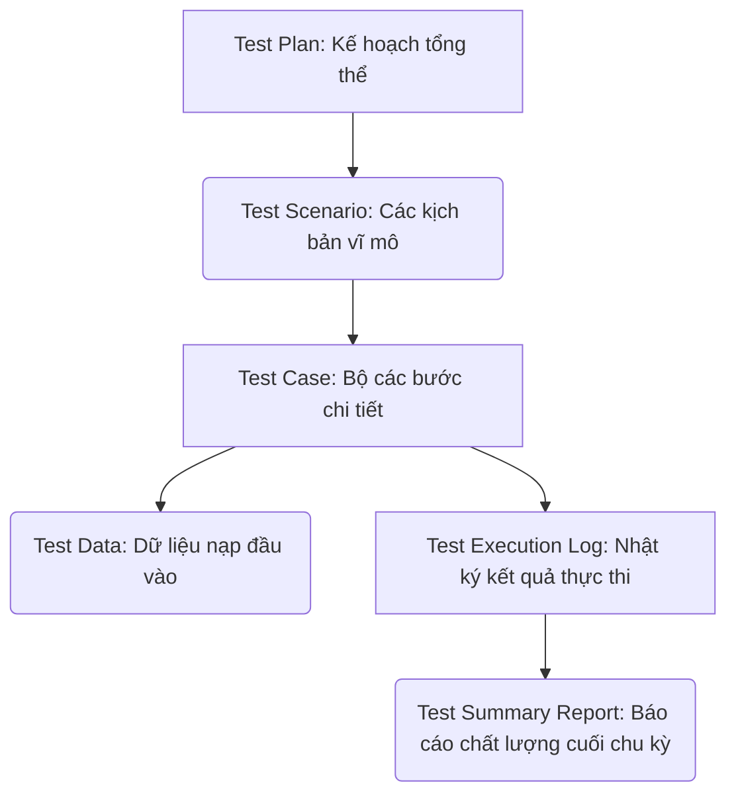
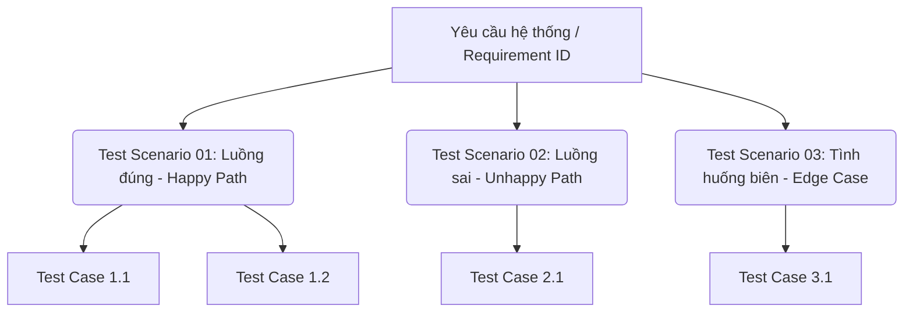
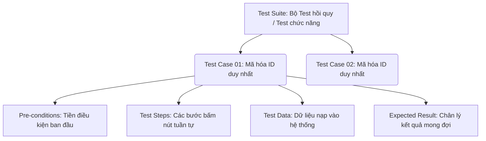
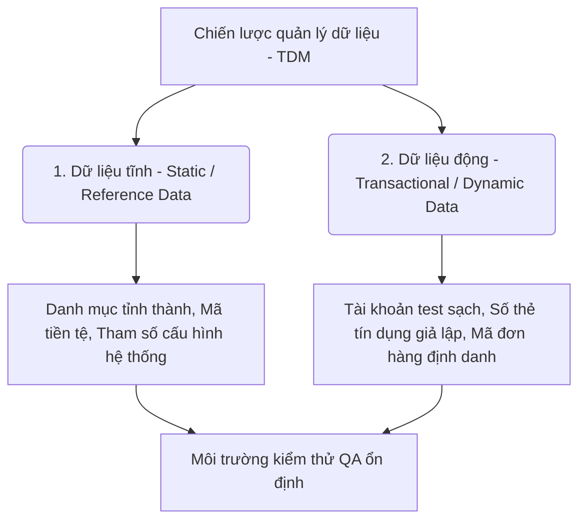
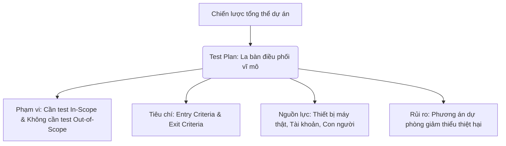
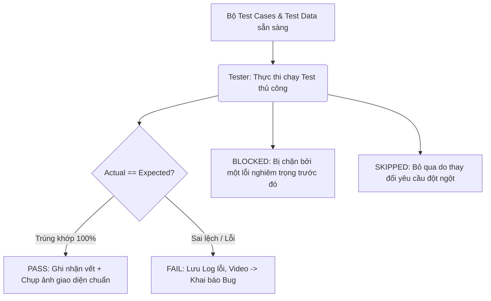
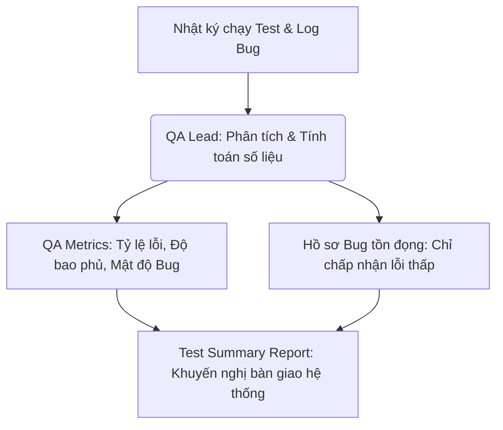
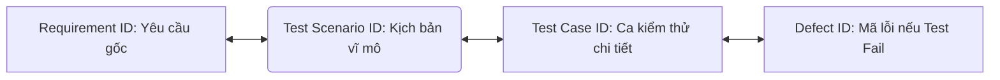

# 📁 03. Manual Testing

*Mục tiêu: Làm chủ quy trình, phân tích tài liệu đặc tả hệ thống chuyên sâu, thực thi kiểm thử thủ công và xây dựng hệ thống tài liệu (Artifacts) chuẩn chỉnh của một Manual Tester.*

# **3.2. Test Artifacts**

## 📌 Mục lục nội bộ (Chặng 03)

- [ ] [**3.1. Requirements Analysis**](./1_Requirements.md)
- [ ] [**3.2. Test Artifacts**](./2_Artifacts.md)
  - [ ] [3.2.1. Test Scenario](#321-test-scenario)
  - [ ] [3.2.2. Test Case & Test Suite](#322-test-case--test-suite)
  - [ ] [3.2.3. Test Data Management](#323-test-data-management)
  - [ ] [3.2.4. Test Plan Fundamentals](#324-test-plan-fundamentals)
  - [ ] [3.2.5. Test Execution & Result Logs](#325-test-execution--result-logs)
  - [ ] [3.2.6. Test Summary Report](#326-test-summary-report)
  - [ ] [3.2.7. RTM (Requirements Traceability Matrix)](#327-rtm)
- [ ] [**3.3. Functional Testing Levels & Types**](./3_FunctionalTesting.md)
- [ ] [**3.4. Non-functional Testing**](./4_NonFunctionalTesting.md)

---

## 🗺️ Bản đồ các Tạo tác Kiểm thử (Test Artifacts) của Manual Tester

Trước khi đi vào bóc tách tài liệu đầu vào, bạn cần có cái nhìn tổng quan về các sản phẩm/tài liệu trung gian (Artifacts) do chính tay Manual Tester phải sản sinh ra trong suốt STLC:

# 3.2.1. Test Scenario

**Test Scenario (Kịch bản kiểm thử vĩ mô)** là một mô tả cấp cao quy định về **một khía cạnh, một chức năng hoặc một tình huống nghiệp vụ cụ thể cần được kiểm thử** trên phần mềm. Nếu tài liệu yêu cầu (`Test Basis`) trả lời câu hỏi *"Hệ thống có những tính năng gì?"*, thì Test Scenario trả lời cho câu hỏi vĩ mô của Tester: *"Chúng ta cần kiểm tra những gì?"* (`What to test?`).

Test Scenario không chứa các bước thực hiện chi tiết hay dữ liệu nhập vào cụ thể. Một Test Scenario đóng vai trò là một "chiếc ô" lớn, là cơ sở để Tester tiếp tục phân rã, bóc tách ra hàng loạt các **Test Cases** chi tiết (`How to test?`) phía sau.

## 📊 Mô hình phân rã từ Yêu cầu sang Test Scenario và Test Case

Quy trình xử lý giúp định hình tư duy kiểm thử từ tổng quan đến chi tiết, tránh việc viết Test Case bị trùng lặp hoặc sót luồng:

---

## 🛠️ Chi tiết cấu trúc một bảng Quản lý Test Scenario đạt chuẩn

Trong thực tế dự án, Test Scenario thường được quản lý tập trung trên file Excel/Google Sheets hoặc Confluence dưới dạng một danh sách tinh gọn. Một bảng ma trận Test Scenario bắt buộc phải có các trường thông tin cốt lõi sau:

| Mã Scenario ID | Liên kết Requirement ID | Tên Kịch bản vĩ mô (Scenario Description) | Loại kiểm thử (Test Type) | Độ ưu tiên (Priority) |
| :--- | :--- | :--- | :--- | :--- |
| `TS_LOGIN_001` | `REQ_LOGIN_01` | Kiểm tra tính năng Đăng nhập thành công với tài khoản hợp lệ. | Functional / UI | High |
| `TS_LOGIN_002` | `REQ_LOGIN_01` | Kiểm tra hệ thống chặn đăng nhập khi nhập sai thông tin. | Functional | High |
| `TS_LOGIN_003` | `REQ_LOGIN_01` | Kiểm tra cơ chế khóa tài khoản khi spam sai mật khẩu. | Security / Functional | Medium |
| `TS_LOGIN_004` | `REQ_LOGIN_01` | Kiểm tra độ hiển thị tương thích giao diện màn hình Đăng nhập. | UI/UX | Low |

---

## 🧠 Quy trình 3 bước Thiết kế Test Scenario thực chiến dành cho QA

Để xây dựng một danh sách Test Scenario bao phủ toàn diện sản phẩm, Manual Tester tuân thủ quy trình bóc tách thông tin sau:

### Bước 1: Xác định đối tượng kiểm thử từ Test Basis
* Tester đọc tài liệu `SRS`, `User Story` hoặc bản vẽ `Figma` đã được làm sạch sau khâu review. 
* Xác định rõ ranh giới của module cần test. *Ví dụ:* Module "Thanh toán bằng ví điện tử".

### Bước 2: Áp dụng tư duy phân tách 3 luồng (Happy / Unhappy / Edge Case)
Tester đứng dưới lăng kính của người dùng cuối (`User Perspective`) để liệt kê tất cả các tình huống có thể xảy ra khi họ tương tác với module đó:
* **Luồng thẳng (Happy Path):** Hệ thống xử lý thế nào nếu người dùng làm đúng mọi bước? -> Sinh ra các Scenario tính năng chuẩn.
* **Luồng nghịch (Unhappy Path):** Hệ thống phòng vệ thế nào nếu người dùng nhập sai dữ liệu hoặc cố tình đi sai luồng? -> Sinh ra các Scenario chặn lỗi.
* **Luồng dị biệt (Edge / Corner Case):** Các tình huống cực đoan về môi trường, mạng, gián đoạn. -> Sinh ra các Scenario kiểm thử độ bền bỉ.

### Bước 3: Định danh mã hóa và Ánh xạ RTM
* Đặt mã ID duy nhất cho từng Scenario (`TS_Modulename_001`). 
* Điền chính xác mã `Requirement ID` tương ứng vào bảng quản lý. Hoạt động này giúp bạn hoàn thiện 50% chặng đường của ma trận truy xuất nguồn gốc **RTM**, chứng minh được việc thiết kế kịch bản bám sát tài liệu.

> ⚠️ **Tư duy chuyên gia cần nhớ:**
> Rất nhiều Tester tập sự bỏ qua bước lập Test Scenario mà lập tức nhảy vào viết các bước bấm nút chi tiết của Test Case ngay. Điều này dẫn đến hậu quả: Bạn sẽ bị lạc lối trong mớ dữ liệu nhập liệu chi tiết, viết các Test Case bị trùng lặp ý nghĩa của nhau, hoặc nghiêm trọng hơn là **bỏ sót hoàn toàn một luồng nghiệp vụ lớn** của hệ thống. Hãy lập danh sách Test Scenario trước để định hình bộ khung tư duy vững chắc.

## 📚 References (Tài liệu tham khảo 3.2.1)
* [ISTQB® Certified Tester Foundation Level (CTFL) Syllabus v4.0](https://istqb.org) - Section 1.4.3: *Test Design (Identifying Test Conditions and Test Scenarios).*
* [ISO/IEC/IEEE 29119-3:2021 Standard](https://iso.org) - *Software and systems engineering — Software testing — Part 3: Test documentation (Test Status and Scenario Reporting).*

# 3.2.2. Test Case & Test Suite

**Test Case (Ca kiểm thử chi tiết)** là một tập hợp các điều kiện đầu vào, tiền điều kiện, các bước thực hiện tuần tự và kết quả mong đợi được phát triển cho một mục tiêu kiểm thử cụ thể. Nếu `Test Scenario` trả lời câu hỏi *"Kiểm tra cái gì?"* (`What to test?`), thì Test Case trả lời chính xác cho câu hỏi: *"Kiểm tra như thế nào?"* (`How to test?`).

**Test Suite (Bộ ca kiểm thử)** là một tập hợp các Test Case được gom nhóm lại với nhau dựa trên một mục đích cụ thể (như theo tính năng, theo độ ưu tiên, hoặc theo mục đích kiểm thử như Smoke Test, Regression Test) để phục vụ cho việc quản lý và thực thi một cách khoa học.

## 📊 Mô hình Cấu trúc Phân cấp từ Bộ Test Suite đến từng Bước chạy

Quy trình gom nhóm và phân rã giúp tối ưu hóa việc quản lý hàng ngàn ca kiểm thử trong một dự án quy mô lớn:

---

## 🛠️ Chi tiết cấu trúc 8 trường thông tin bắt buộc của một Test Case đạt chuẩn

Để đảm bảo tính **Độc lập** (không phụ thuộc vào kết quả của ca test trước) và tính **Tái sử dụng** (bất kỳ ai đọc vào cũng tự chạy được và ra kết quả y hệt), một bản thiết kế Test Case chuyên nghiệp bắt buộc phải có đầy đủ 8 trường thông tin nghiêm ngặt sau:

1. **Test Case ID (Mã định danh):** Đặt tên mã hóa theo quy chuẩn không trùng lặp (Ví dụ: `TC_PAYMENT_005`).
2. **Linked Scenario / Requirement ID:** Mối liên kết dẫn nguồn về kịch bản vĩ mô hoặc mã dòng yêu cầu trong tài liệu đặc tả để phục vụ lập ma trận `RTM`.
3. **Test Title / Summary (Tiêu đề):** Câu mô tả ngắn gọn, rõ ràng về mục tiêu kiểm tra (Ví dụ: `Kiểm tra tính năng thanh toán thất bại khi số dư ví thấp hơn giá trị đơn hàng`).
4. **Pre-conditions (Tiền điều kiện):** Trạng thái bắt buộc của hệ thống hoặc tài khoản trước khi bắt đầu thực hiện bài test (Ví dụ: `Tài khoản đã đăng nhập, giỏ hàng có sẵn 1 sản phẩm trị giá 100.000 VND, số dư ví hiện tại là 50.000 VND`).
5. **Test Steps (Các bước thực hiện):** Đánh số thứ tự tuần tự, ghi rõ từng hành động tương tác đơn lẻ. Không viết chung chung (Ví dụ: *Bước 1: Vào trang giỏ hàng. Bước 2: Nhấn nút Thanh toán. Bước 3: Chọn phương thức Ví điện tử và bấm Xác nhận*).
6. **Test Data (Dữ liệu kiểm thử):** Ghi rõ các chuỗi ký tự, số tiền, tên tài khoản cụ thể dùng để nhập liệu trong các bước (Ví dụ: `Số tiền đơn hàng: 100.000 VND`).
7. **Expected Result (Kết quả mong đợi):** Mô tả chi tiết, chính xác phản ứng đúng chuẩn của hệ thống dựa trên `Test Oracle`. Tuyệt đối không viết *"Hệ thống chạy bình thường"*. Phải viết: `Hệ thống hiển thị popup cảnh báo chữ đỏ "Số dư tài khoản không đủ để thanh toán", nút Xác nhận bị khóa xám và không trừ tiền trong ví`.
8. **Post-conditions (Hậu điều kiện):** Trạng thái của hệ thống sau khi ca test kết thúc để trả môi trường về trạng thái sạch cho ca test sau (Ví dụ: `Đơn hàng giữ nguyên trạng thái Chờ thanh toán`).

---

## 🧠 Chiến lược thiết kế và Gom nhóm bộ Test Suite thực chiến

Khi số lượng Test Case vọt lên con số hàng ngàn, Tester không thể quản lý thủ công. Bạn cần biết cách gom nhóm thành các **Test Suite** chiến lược:

* **Smoke Test Suite:** Gom khoảng 5 - 10% số lượng Test Case cốt lõi nhất của toàn hệ thống (luồng sinh tử như Đăng nhập, Mua hàng). Bộ này dùng để chạy nhanh trong 15 phút ngay khi nhận Build mới nhằm chốt chặn môi trường sạch lỗi khói.
* **Sanity Test Suite:** Gom các Test Case kiểm tra sâu độc lập xung quanh một module vừa mới được sửa đổi code hoặc cập nhật tính năng nhằm xác thực nhanh logic của riêng vùng đó.
* **Regression Test Suite (Bộ Test hồi quy):** Gom toàn bộ các Test Case của các tính năng cũ đang chạy ổn định. Bộ test suite này sẽ được kích hoạt chạy lại toàn bộ vào cuối chu kỳ dự án để đảm bảo việc Dev sửa Bug mới không phá hủy các tính năng cũ.

> ⚠️ **Tư duy chuyên gia cần nhớ:**
> Điểm khác biệt lớn nhất giữa một bản ghi nháp và một tài liệu Test Case chuẩn quốc tế nằm ở trường **Expected Result**. Bạn phải định hình rõ kết quả mong đợi *trước khi* chạy test. Việc viết Expected Result mơ hồ, định tính sẽ làm mờ mắt Tester, khiến bạn nhìn thấy lỗi hiển thị sờ sờ ngay trước mặt trong giai đoạn thực thi nhưng vẫn lướt qua vì nghĩ đó là tính năng đúng của hệ thống.

## 📚 References (Tài liệu tham khảo 3.2.2)
* [ISTQB® Certified Tester Foundation Level (CTFL) Syllabus v4.0](https://istqb.org) - Section 1.4.4: *Test Implementation (Developing and Prioritizing Test Cases and Test Suites).*
* [ISO/IEC/IEEE 29119-3:2021 Standard](https://iso.org) - *Software and systems engineering — Software testing — Part 3: Test documentation (Detailed Test Case Specification Template).*

# 3.2.3. Test Data Management

**Test Data Management (TDM - Quản lý Dữ liệu Kiểm thử)** là quá trình lập kế hoạch, khởi tạo, lưu trữ, bảo vệ và cung cấp các giá trị dữ liệu đầu vào chuẩn xác để Tester nạp vào phần mềm trong giai đoạn thực thi kiểm thử. 

Dữ liệu kiểm thử (`Test Data`) chính là nhiên liệu để vận hành kịch bản kiểm thử. Nếu không có dữ liệu test sạch, phù hợp và đa dạng, bộ Test Case chi tiết nhất cũng trở nên vô nghĩa vì không thể kích hoạt được các luồng logic ẩn sâu dưới mã nguồn.

## 📊 Mô hình Phân tách và Nạp Dữ liệu Kiểm thử

Quy trình quản lý dữ liệu kiểm thử giúp phân tách rõ ràng dữ liệu nền hệ thống và dữ liệu nhập liệu linh hoạt:

---

## 🛠️ Ma trận Phân cấp các loại Dữ liệu Kiểm thử

Để quản lý dữ liệu test một cách khoa học, Manual Tester cần phân tách rõ hai trạng thái dữ liệu cốt lõi sau:

### 1. Static Data / Reference Data (Dữ liệu tĩnh / Dữ liệu tham chiếu)
* **Bản chất:** Là những dữ liệu nềntảng, danh mục có sẵn trong cơ sở dữ liệu để hệ thống hoạt động ổn định. Dữ liệu này ít khi thay đổi trong suốt chu kỳ test.
* **Ví dụ:** Danh sách các quốc gia, mã tiền tệ (`VND`, `USD`), danh mục tỉnh thành, cấu hình hạn mức giao dịch tối đa của ngân hàng.
* **Hành động của QA:** Phối hợp cùng Dev hoặc Đội vận hành hệ thống nạp sẵn dữ liệu này (`Database Baseline`) vào môi trường Staging/QA ngay ở giai đoạn thiết lập môi trường (`Step 4 - STLC`).

### 2. Dynamic Data / Transactional Data (Dữ liệu động / Dữ liệu giao dịch)
* **Bản chất:** Là những dữ liệu đầu vào linh hoạt do chính tay Tester nhập vào các ô Input hoặc truyền qua API để tạo ra một giao dịch, một hành động cụ thể trên phần mềm. Dữ liệu này liên tục thay đổi và biến mất/tiêu hao sau mỗi ca test.
* **Ví dụ:** Tên đăng nhập, mật khẩu, số tiền rút, mã coupon giảm giá, chuỗi ký tự dài 500 chữ để test lỗi tràn bộ đệm.
* **Hành động của QA:** Tester tự lên danh sách dữ liệu này dựa trên các kỹ thuật hộp đen (giá trị biên, phân vùng tương đương) và chuẩn bị sẵn trên file Excel/CSV trước khi bấm nút thực thi chạy test.

---

## 🧠 3 Chiến lược Khởi tạo Dữ liệu Kiểm thử thực chiến dành cho QA

Tùy thuộc vào quy môn dự án và tính bảo mật của doanh nghiệp, Tester sẽ lựa chọn 1 trong 3 chiến lược nạp dữ liệu sau:

### Chiến lược 1: Khởi tạo thủ công bằng tay (Manual Creation)
* Tester tự gõ tay vào giao diện hoặc dùng câu lệnh SQL chèn (`INSERT`) trực tiếp dữ liệu vào Database.
* *Đặc điểm:* Thích hợp cho dự án nhỏ, số lượng tài khoản test ít. Nhược điểm là tốn thời gian và dễ sai sót.

### Chiến lược 2: Cào dữ liệu từ môi trường thật (Data Masking from Production)
* Đội ngũ DevOps sao chép một bản sao của Cơ sở dữ liệu thật trên môi trường Production về môi trường QA.
* *Đặc điểm:* Cực kỳ chân thực, bao phủ hết mọi loại dữ liệu dị biệt của khách hàng thật. Tuy nhiên, để tuân thủ luật bảo mật thông tin, QA bắt buộc phải áp dụng kỹ thuật **Xóa mờ dữ liệu (`Data Masking / Anonymization`)** – tự động mã hóa hoặc đổi tên họ, số điện thoại, số dư tài khoản thật thành các giá trị ngẫu nhiên trước khi test để tránh lộ thông tin nhạy cảm.

### Chiến lược 3: Tạo dữ liệu tự động bằng mã lệnh (Automated Generation)
* Sử dụng các thư viện lập trình (như Faker) hoặc viết các tập lệnh ngắn để hệ thống tự động sinh ra hàng vạn tài khoản test sạch, hàng triệu mã đơn hàng giao dịch chỉ trong vài giây.
* *Đặc điểm:* Là tiêu chuẩn bắt buộc cho các dự án lớn, dự án cần chạy Automation Test hoặc Performance Test (Kiểm thử hiệu năng cần lượng dữ liệu khổng lồ phá hủy hệ thống).

> ⚠️ **Tư duy chuyên gia cần nhớ:**
> Một Tester giỏi luôn có tư duy bảo vệ môi trường test sạch sẽ. Hãy kiểm soát tốt **Hậu điều kiện (`Post-conditions`)** của Test Case. Nếu bạn chạy một ca test tạo mới tài khoản thành công, hãy đảm bảo cuối buổi test bạn có kịch bản xóa tài khoản đó hoặc nạp lại Database về trạng thái Baseline ban đầu. Việc để dữ liệu rác (tài khoản rác, đơn hàng rác) tồn đọng tràn ngập qua nhiều chu kỳ kiểm thử sẽ làm chậm tốc độ xử lý của máy chủ và gây ra các lỗi flaky test tai hại cho chính bạn sau này.

## 📚 References (Tài liệu tham khảo 3.2.3)
* [ISTQB® Certified Tester Foundation Level (CTFL) Syllabus v4.0](https://istqb.org) - Section 1.4.4: *Test Implementation (Preparing Test Data).*
* **SmarteSoft (2020)** - *Enterprise Test Data Management Standards and Best Practices*, Software Quality Press.

# 3.2.4. Test Plan Fundamentals

**Test Plan (Kế hoạch Kiểm thử)** là một tài liệu kỹ thuật mang tính chiến lược, mô tả chi tiết về phạm vi kiểm thử (`Test Scope`), cách tiếp cận (`Approach`), nguồn lực nhân sự, lịch trình thực hiện và quản lý rủi ro của toàn bộ hoạt động kiểm thử trong dự án. 

Nếu các tạo tác khác như `Test Case` hay `Test Scenario` trả lời cho câu hỏi kỹ thuật vi mô, thì Test Plan đóng vai trò là chiếc la bàn vĩ mô chỉ đường cho cả đội ngũ QA, trả lời cho chuỗi câu hỏi: *Chúng ta test cái gì? Ai sẽ test? Test khi nào? Cần bao lâu? và Khi nào thì dừng lại?*

## 📊 Mô hình Khung Quản lý và Điều phối của Test Plan

Bản kế hoạch kiểm thử điều phối mục tiêu dự án thành các hành động kỹ thuật thực chiến có kiểm soát:

---

## 🛠️ Chi tiết cấu trúc 6 thành phần bắt buộc của một bản Test Plan tiêu chuẩn

Theo quy chuẩn quốc tế (IEEE 829 / ISO 29119-3), một bản Test Plan thực chiến dành cho Manual Tester bắt buộc phải làm rõ 6 cấu phần nghiêm ngặt sau:

### 1. Phạm vi kiểm thử (Test Scope)
* **In-Scope (Nằm trong phạm vi):** Liệt kê chi tiết danh sách các module, tính năng, loại kiểm thử (Functional, UI, API) bắt buộc phải kiểm tra trong chu kỳ này.
* **Out-of-Scope (Nằm ngoài phạm vi):** Vạch rõ các phần **KHÔNG TEST** (Ví dụ: Tính năng thanh toán qua Visa không test do cổng thanh toán bên thứ ba chưa hoàn thiện, không test hiệu năng tải tải trọng ở Sprint này). Việc này giúp bảo vệ Tester không bị đổ lỗi vì không test những vùng chưa sẵn sàng.

### 2. Tiêu chí Đầu vào & Đầu ra (Entry & Exit Criteria)
* **Entry Criteria (Tiêu chí đầu vào):** Các điều kiện bắt buộc phải thỏa mãn để QA bắt đầu bấm nút chạy test (Ví dụ: Tài liệu SRS đã chốt, Code đã vượt qua vòng review chéo và tự chạy Unit Test đạt >80%, môi trường QA ổn định).
* **Exit Criteria (Tiêu chí đầu ra):** Các điều kiện bắt buộc phải cán đích để QA dừng test và đóng chu kỳ (Ví dụ: 100% Test Case High Priority đã chạy, tỷ lệ Pass Rate >95%, không còn tồn đọng Bug từ mức độ Blocker đến Major).

### 3. Phương pháp kiểm thử (Test Approach / Strategy)
* Mô tả cách thức Tester sẽ tiếp cận hệ thống: Áp dụng kỹ thuật thiết kế kịch bản nào? Module nào test bằng tay (Manual), module nào cần chạy tự động (Automation)? Quy trình báo cáo và quản lý vòng đời của Bug trên Jira vận hành như thế nào?

### 4. Cấu hình môi trường và Công cụ (Test Environment & Tools)
* Yêu cầu chi tiết về hạ tầng: Cần bao nhiêu thiết bị máy thật (Ví dụ: 2 máy iPhone chạy iOS 16 và iOS 17, 3 máy Android), thông tin mạng nội bộ (VPN), các công cụ bổ trợ kiểm thử (Chrome DevTools, Postman, Jira).

### 5. Lịch trình và Cột mốc tiến độ (Schedule & Milestones)
* Vạch rõ mốc thời gian cụ thể cho từng giai đoạn của STLC: Ngày hoàn thành viết Test Case, ngày nhận Bản cài đặt (`Build`) từ Dev, ngày kết thúc đợt thực thi thứ nhất (`Test Cycle 1`), ngày chạy test hồi quy (`Regression Test`) và ngày xuất bản báo cáo tổng kết.

### 6. Quản lý rủi ro kiểm thử (Test Risks & Contingency Plan)
* Chủ động nhận diện các sự cố có thể làm gãy tiến độ test và đưa ra giải pháp xử lý trước khi nó xảy ra. 
* *Ví dụ:* Rủi ro Dev bàn giao code trễ hạn 3 ngày -> Phương án dự phòng: QA sẽ kích hoạt chiến lược **Kiểm thử dựa trên rủi ro (`Risk-based Testing`)**, chỉ tập trung chạy bộ Test Case ở vùng rủi ro cao (`High Risk`) để kịp ngày phát hành của công ty.

> ⚠️ **Tư duy chuyên gia cần nhớ:**
> Test Plan không phải là một tập tài liệu "chết" viết ra một lần rồi lưu kho. Trong môi trường dự án thực tế (đặc biệt là Agile/Scrum), Test Plan là một tài liệu sống (`Living Document`). Khi khách hàng đột ngột thay đổi yêu cầu, hoặc lập trình viên bàn giao code không đúng tiến độ, Test Lead phải ngay lập tức cập nhật lại phạm vi, lịch trình và rủi ro trong Test Plan để điều phối nguồn lực Tester một cách tối ưu nhất.

## 📚 References (Tài liệu tham khảo 3.2.4)
* [ISO/IEC/IEEE 29119-3:2021 Standard](https://iso.org) - *Software and systems engineering — Software testing — Part 3: Test documentation (Test Plan Document Quy chuẩn cấu trúc Kế hoạch Kiểm thử).*
* [ISTQB® Certified Tester Foundation Level (CTFL) Syllabus v4.0](https://istqb.org) - Section 5.1: *Test Planning (Entry and Exit Criteria, Test Strategy).*

# 3.2.5. Test Execution & Result Logs

**Test Execution & Result Logs (Thực thi Kiểm thử & Nhật ký Kết quả)** là giai đoạn hành động cốt lõi của Manual Tester trong chuỗi vòng đời `STLC`. Đây là quá trình Tester trực tiếp tương tác với phần mềm chạy thực tế, vận hành ứng dụng theo từng bước của kịch bản kiểm thử (`Test Cases`), nạp dữ liệu (`Test Data`) và ghi lại toàn bộ kết quả, bằng chứng thực tế vào hệ thống lưu trữ.

Nhật ký kết quả kiểm thử (`Result Logs`) không chỉ đơn thuần là việc đánh trạng thái `PASS` hay `FAIL`. Nó là bằng chứng pháp lý kỹ thuật chứng minh tính ổn định của hệ thống, cung cấp dữ liệu minh bạch cho các bên liên quan và là cơ sở để Developer điều tra, sửa lỗi nhanh chóng.

## 📊 Mô hình Chu trình Xử lý Kết quả và Lưu trữ Bằng chứng

Mỗi kịch bản kiểm thử sau khi đưa vào luồng chạy sẽ được ghi nhận vết và phân loại trạng thái nghiêm ngặt:

---

## 🛠️ Ma trận Kỹ thuật Quản lý Nhật ký Thực thi Kiểm thử

Khi tiến hành thực thi kiểm thử thủ công, Tester chuyên nghiệp phải tuân thủ nghiêm ngặt ma trận ghi nhật ký kết quả sau:

### 1. 4 Trạng thái ghi nhận của một Ca kiểm thử (Test Statuses)
* **PASS (Đạt):** Kết quả thực tế (`Actual Result`) thu được từ hệ thống trùng khớp chính xác 100% với kết quả mong đợi (`Expected Result`) trong thiết kế. QA ghi nhận trạng thái và đính kèm ảnh chụp màn hình luồng chính thành công.
* **FAIL (Lỗi):** Kết quả thực tế xuất hiện sai lệch logic, lỗi hiển thị, hoặc crash sập hệ thống so với mong đợi. QA lập tức dừng lại, giữ nguyên hiện trường và thu thập bằng chứng lỗi.
* **BLOCKED (Bị chặn):** Ca kiểm thử không thể thực hiện được do một lỗi nghiêm trọng của tính năng trước đó chặn đứng luồng đi. (Ví dụ: Không thể thực thi ca test *"Kiểm tra lịch sử đơn hàng"* do tính năng *"Đăng nhập tài khoản"* đang bị sập nguồn không vào được). Ca test này phải chuyển trạng thái `BLOCKED` để hệ thống không tính vào tỷ lệ lỗi của Tester.
* **SKIPPED (Bỏ qua):** Ca kiểm thử bị hoãn, không chạy trong chu kỳ này theo yêu cầu chính thức từ Product Owner (PO) do tính năng bị dời ngày ra mắt.

### 2. Kỹ thuật Thu thập và Lưu trữ Bằng chứng (Test Evidence Collection)
Bằng chứng kiểm thử (`Test Evidence`) là vũ khí bảo vệ quan điểm của Tester. Khi log nhật ký chạy test, đặc biệt là các ca bị `FAIL`, Tester bắt buộc phải đính kèm đầy đủ các loại dữ liệu sau:
* **Ảnh chụp màn hình (Screenshots):** Chụp rõ vùng bị lỗi. Nên dùng công cụ vẽ thêm mũi tên đỏ hoặc khoanh tròn vào điểm sai lệch giao diện để Dev dễ nhìn.
* **Video ghi hình (Screen Recording):** Đối với các lỗi liên quan đến hoạt họa, giật lag, hoặc lỗi luồng nghiệp vụ phức tạp, Tester phải quay lại toàn bộ video từ bước đầu tiên đến lúc lỗi xuất hiện để Dev thấy rõ hành vi.
* **Nhật ký kỹ thuật (Technical Logs):** Điểm phân cấp trình độ QA nằm ở đây. Đừng chỉ chụp ảnh màn hình thô. Hãy mở Chrome DevTools (F12) lên tab **Network** để copy chuỗi dữ liệu JSON lỗi từ API, hoặc vào tab **Console** để chụp lại mã lỗi JavaScript đỏ. Nếu test app di động, hãy cào file log hệ thống (Logcat đối với Android, Crash Logs đối với iOS) để đính kèm vào nhật ký.

---

## 🧠 Quy tắc thực chiến dành cho Manual Tester khi Thực thi Test

* **Tuyệt đối tuân thủ Kịch bản:** Khi chạy test, hãy đi đúng theo từng bước (`Test Steps`) đã viết trong Test Case. Tuyệt đối không nhảy cóc, không tự ý thay đổi tiền điều kiện nếu chưa có sự chỉ định của Test Lead. Việc chạy test ngẫu hứng không theo kịch bản sẽ làm sai lệch bản chất của nhật ký kiểm thử.
* **Xử lý ca test bị FAIL liên hoàn:** Khi một Test Case bị Fail, các Test Case phụ thuộc phía sau nó thường sẽ bị ảnh hưởng. QA hãy tỉnh táo để phân biệt trường hợp nào cần chuyển sang trạng thái `FAIL` độc lập (do nhập liệu lỗi khác) và trường hợp nào bắt buộc phải đánh trạng thái `BLOCKED` để chờ sửa lỗi móng.

> ⚠️ **Tư duy chuyên gia cần nhớ:**
> Nhật ký thực thi kiểm thử chính là tấm gương phản chiếu năng lực và sự cẩn trọng của một Manual Tester. Một Tester tập sự chỉ bấm nút `PASS/FAIL` một cách vô hồn. Một Chuyên gia QA luôn ghi nhận nhật ký đi kèm mã phiên bản cài đặt (`Build Version`) rõ ràng, bằng chứng kỹ thuật (API/Console Log) sắc bén. Bộ nhật ký sạch sẽ, minh bạch này giúp rút ngắn 50% thời gian gỡ lỗi của Developer và là cơ sở để Test Lead tự tin ký duyệt biên bản phát hành sản phẩm.

## 📚 References (Tài liệu tham khảo 3.2.5)
* [ISTQB® Certified Tester Foundation Level (CTFL) Syllabus v4.0](https://istqb.org) - Section 1.4.5: *Test Execution (Recording the Results and Logging Test Evidence).*
* [ISO/IEC/IEEE 29119-3:2021 Standard](https://iso.org) - *Software and systems engineering — Software testing — Part 3: Test documentation (Test Execution Log Template).*

# 3.2.6. Test Summary Report

**Test Summary Report (Báo cáo Tổng kết Kiểm thử)** là một tạo tác kiểm thử quan trọng được xuất bản vào cuối mỗi chu kỳ kiểm thử (`Test Cycle Closure`). Tài liệu này tổng hợp toàn bộ số liệu thực thi, trạng thái lỗi và đưa ra đánh giá khách quan về chất lượng sản phẩm dựa trên các chỉ số đo lường định lượng cụ thể.

Báo cáo tổng kết đóng vai trò là căn cứ pháp lý kỹ thuật tối cao cung cấp dữ liệu cho Product Owner (PO), Ban giám đốc hoặc Khách hàng. Dựa vào kết luận chuyên gia của bộ phận QA trong tài liệu này, các bên liên quan sẽ đưa ra quyết định sinh tử: *Có đồng ý bấm nút phát hành (`Release`) phần mềm ra thị trường hay không?*

## 📊 Mô hình Đúc kết Dữ liệu từ Nhật ký chạy Test sang Báo cáo Tổng kết

Quy trình xử lý chuyển hóa hàng ngàn bản ghi thực thi thô thành các chỉ số chất lượng cô đọng:

---

## 🛠️ Chi tiết cấu trúc 5 thành phần bắt buộc của một bản Báo cáo Tổng kết đạt chuẩn

Theo quy chuẩn quốc tế (IEEE 829 / ISO 29119-3), một bản Báo cáo Tổng kết Kiểm thử thực chiến bắt buộc phải làm rõ 5 cấu phần nghiêm ngặt sau:

### 1. Informtion tổng quan (General Information)
* **Môi trường kiểm thử:** Ghi rõ hệ thống đã được nghiệm thu trên hạ tầng nào (`Staging / UAT Environment`).
* **Phiên bản kiểm thử:** Định danh chính xác mã số gói cài đặt ứng dụng (`Build Version / Release Package v1.2.0`) phục vụ việc đối chiếu lịch sử.

### 2. Độ bao phủ kiểm thử (Test Coverage Analysis)
* Đối chiếu trực tiếp với Ma trận truy xuất nguồn gốc `RTM` để chứng minh: Toàn bộ danh sách mã ID yêu cầu trong tài liệu đặc tả `SRS` đã được bao phủ bởi bộ kịch bản kịch thử. Nêu rõ tỷ lệ phần trăm yêu cầu đã được test (Ví dụ: `Requirement Coverage: 100%`).

### 3. Thống kê kết quả thực thi và Chỉ số đo lường hiệu suất (QA Metrics)
Sử dụng các số liệu định lượng cụ thể để chứng minh năng lực kiểm soát chất lượng của cả đội ngũ:
* **Tỷ lệ kịch bản chạy thành công (Test Pass Rate):** Tính toán bằng công cụ theo công thức: `(Số kịch bản PASS / Tổng số kịch bản đã chạy) x 100%`. Tiêu chuẩn phát hành thông thường bắt buộc chỉ số này phải đạt trên 95%.
* **Mật độ lỗi (Defect Density):** Số lượng bug phát hiện được trên một đơn vị quy mô hệ thống (Ví dụ: 3 bug/User Story).
* **Tỷ lệ Bug bị từ chối (Defect Rejection Rate):** Số lượng bug do Tester báo cáo nhưng bị Dev từ chối vì không phải lỗi hoặc không tái hiện được. Chỉ số này phản ánh trực tiếp chất lượng thiết kế kịch bản và năng lực điều tra lỗi của Tester.

### 4. Ma trận phân loại lỗi tồn đọng (Open Defects Status)
* Bảng thống kê chi tiết số lượng lỗi còn mở (`Open / In-Progress`) trên Jira phân cấp theo độ nghiêm trọng kỹ thuật `Severity`. 
* *Quy tắc sinh tử:* Tuyệt đối không được phép tồn đọng bất kỳ lỗi nào ở mức độ `Blocker`, `Critical` hoặc `Major`. Báo cáo phải liệt kê rõ mã vé (Ticket ID) của các lỗi mức độ `Low / Minor` còn sót lại và lý do vì sao PO chấp nhận cho phép dời việc sửa đổi sang chu kỳ sau.

### 5. Kết luận chuyên gia và Khuyến nghị (Conclusion & Recommendations)
* Đây là phần giá trị nhất do Test Lead viết. Đưa ra câu khẳng định đanh thép: *Sản phẩm phần mềm đã đáp ứng đầy đủ Tiêu chuẩn Hoàn thành (Exit Criteria) hay chưa? Hệ thống có đủ độ ổn định, an toàn bảo mật để phát hành rộng rãi tới người dùng cuối hay không?*

> ⚠️ **Tư duy chuyên gia cần nhớ:**
> Báo cáo Tổng kết Kiểm thử không phải là một bài văn kể khổ về việc Tester đã làm việc vất vả ra sao hay tìm được bao nhiêu lỗi. Hãy viết báo cáo bằng **ngôn ngữ của số liệu định lượng và rủi ro kinh doanh**. Ban giám đốc không quan tâm bạn chạy bao nhiêu bước, họ quan tâm đến việc: *Nếu bấm nút Release hôm nay, rủi ro sập hệ thống hay mất tiền của khách hàng là bao nhiêu phần chạm?* Số liệu trong Test Summary Report chính là bằng chứng bảo vệ uy tín của bộ phận QA trước công ty.

## 📚 References (Tài liệu tham khảo 3.2.6)
* [ISO/IEC/IEEE 29119-3:2021 Standard](https://iso.org) - *Software and systems engineering — Software testing — Part 3: Test documentation (Test Summary Report Quy chuẩn cấu trúc Báo cáo Tổng kết).*
* [ISTQB® Certified Tester Foundation Level (CTFL) Syllabus v4.0](https://istqb.org) - Section 1.4.6: *Test Completion (Publishing the Test Summary Report).*

# 3.2.7. RTM (Requirements Traceability Matrix)

**RTM (Requirements Traceability Matrix - Ma trận Truy xuất Nguồn gốc Yêu cầu)** là một bảng ma trận kỹ thuật được sử dụng để liên kết chéo hai chiều (Bi-directional Tracing) giữa các yêu cầu nghiệp vụ gốc và toàn bộ các tạo tác kiểm thử được sinh ra trong suốt vòng đời dự án. 

RTM đóng vai trò là "sợi chỉ đỏ" kết nối mọi mắt xích thông tin. Nó giúp Tester theo dõi sát sao dòng dịch chuyển của một tính năng: Từ một dòng chữ thô trong tài liệu yêu cầu, phân rã sang kịch bản vĩ mô, cụ thể hóa thành ca kiểm thử chi tiết, và ghi nhận vết lỗi nếu có hỏng hóc xảy ra.

## 📊 Mô hình Bản đồ Liên kết 2 Chiều của Ma trận RTM

Quy trình thiết lập RTM giúp Tester kiểm soát chặt chẽ phạm vi dự án, đảm bảo không một tính năng nào bị bỏ sót:

---

## 🛠️ Chi tiết cấu trúc một bảng Ma trận RTM thực chiến

Trong thực tế dự án, ma trận RTM được thiết lập trên file Excel/Google Sheets hoặc tích hợp tự động thông qua hệ thống quản lý Jira (sử dụng plugin như Xray/Zephyr). Một bảng RTM tiêu chuẩn bắt buộc phải có cấu trúc các trường thông tin sau:

| Mã Requirement ID | Tên Yêu cầu Đặc tả (SRS Definition) | Mã Test Scenario ID | Mã Test Case ID | Trạng thái Chạy Test (Status) | Mã Lỗi Tồn Đọng (Defect ID) |
| :--- | :--- | :--- | :--- | :--- | :--- |
| `REQ_PAY_001` | Người dùng thanh toán bằng Ví điện tử thành công. | `TS_PAY_01` | `TC_PAY_001` `TC_PAY_002` | PASS PASS | *N/A* *N/A* |
| `REQ_PAY_002` | Hệ thống chặn giao dịch khi ví không đủ số dư. | `TS_PAY_02` | `TC_PAY_003` | FAIL | `BUG_JIRA_405` |
| `REQ_PAY_003` | Khóa tạm thời luồng thanh toán nếu spam nút 5 lần. | `TS_PAY_03` | `TC_PAY_004` | BLOCKED | *N/A (Chờ sửa lỗi móng)* |

---

## 🧠 3 Giá trị sống còn của Ma trận RTM đối với khâu Quản trị Chất lượng

### 1. Đảm bảo độ bao phủ tuyệt đối (Forward Traceability)
* **Mục tiêu:** Kiểm tra từ đầu đến cuối (Từ Yêu cầu -> Test Case) xem có tính năng nào bị bỏ sót do Tester viết thiếu kịch bản hay không. 
* **Hành động của QA:** Nếu nhìn vào bảng RTM thấy dòng `REQ_PAY_004` hoàn toàn trống rỗng, không gắn kèm bất kỳ mã `Test Case ID` nào ở các cột sau, QA lập tức phát hiện ra lỗ hổng bộc lộ và bổ sung kịch bản kiểm thử ngay để phủ kín phạm vi, tránh lọt lưới tính năng khi bàn giao.

### 2. Phân tích tác động khi Yêu cầu Thay đổi (Backward Traceability)
* **Mục tiêu:** Kiểm tra ngược từ dưới lên (Từ Test Case -> Yêu cầu). Trong môi trường dự án thực tế, việc Khách hàng hoặc BA thay đổi, chỉnh sửa logic tài liệu yêu cầu diễn ra rất thường xuyên.
* **Hành động của QA:** Khi BA thông báo: *"Logic chặn số dư ở mục `REQ_PAY_002` vừa được sửa đổi"*, Tester không cần phải hoang mang đọc lại toàn bộ bộ kịch bản hàng ngàn ca. Bạn chỉ cần tra cứu bảng RTM tại dòng `REQ_PAY_002`, hệ thống sẽ chỉ thẳng mặt ca test bị ảnh hưởng là `TC_PAY_003`. Bạn lập tức vào đúng ca test đó để cập nhật lại `Expected Result`, tiết kiệm 90% thời gian rà soát.

### 3. Minh bạch hóa Báo cáo Nghiệm thu trước Khách hàng
* Khi xuất bản báo cáo tổng kết cuối chu kỳ (`Test Summary Report`), bảng RTM chính là bằng chứng thép đập tan mọi nghi ngờ của Khách hàng hoặc Ban giám đốc về chất lượng làm việc của đội QA. Bảng ma trận chứng minh rõ ràng: Mọi tính năng khách hàng yêu cầu đều đã được QA thiết kế kịch bản che phủ và có trạng thái kết quả thực thi (`PASS/FAIL`) minh bạch đi kèm vết lỗi định danh cụ thể.

> ⚠️ **Tư duy chuyên gia cần nhớ:**
> Lập ma trận RTM không phải là một công việc thủ tục hành chính làm cho có. Nó là tư duy sống còn của một Quản lý Chất lượng chuyên nghiệp. Thiết lập RTM ngay từ giai đoạn phân tích yêu cầu (`Step 1 - STLC`) chính là cách bạn làm chủ hoàn toàn phạm vi dự án, tự tin làm chủ tiến độ và không bao giờ rơi vào trạng thái hoảng loạn vì thiếu kịch bản hay sửa sót kịch bản khi dự án biến động.

## 📚 References (Tài liệu tham khảo 3.2.7)
* [ISTQB® Certified Tester Foundation Level (CTFL) Syllabus v4.0](https://istqb.org) - Section 1.4.1: *Test Analysis (Traceability between the Test Basis and Test Cases).*
* [ISO/IEC/IEEE 29119-3:2021 Standard](https://iso.org) - *Software and systems engineering — Software testing — Part 3: Test documentation (Requirements Traceability Matrix Framework Quy chuẩn Ma trận Truy xuất).*
