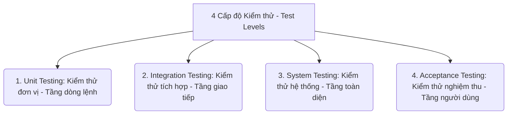
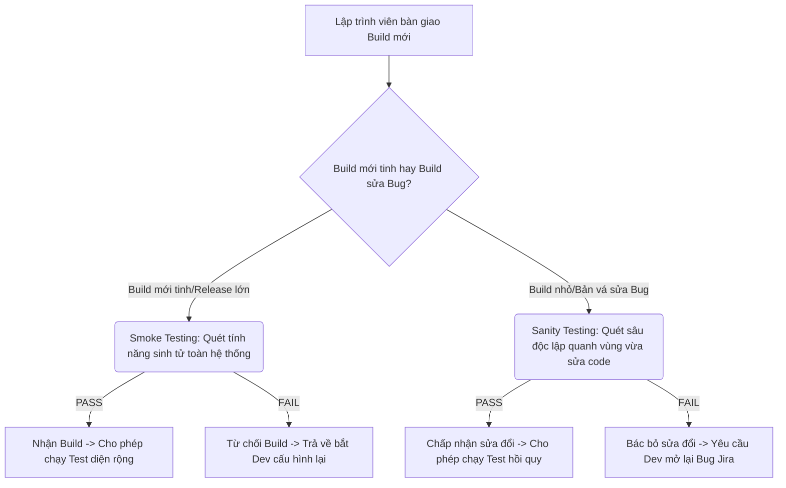
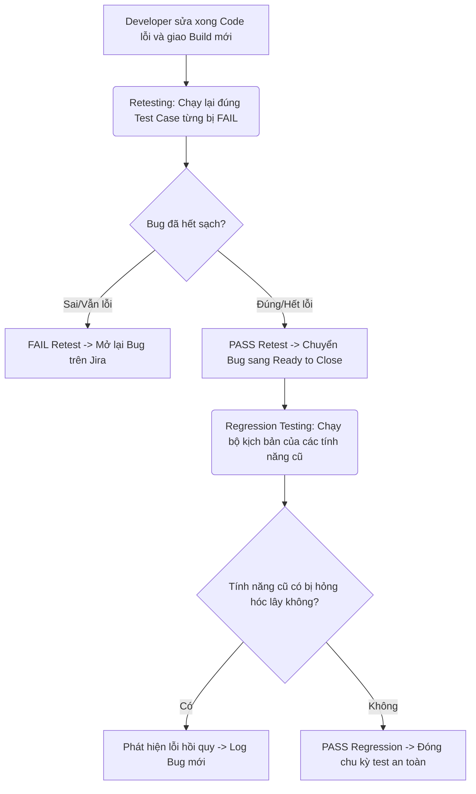
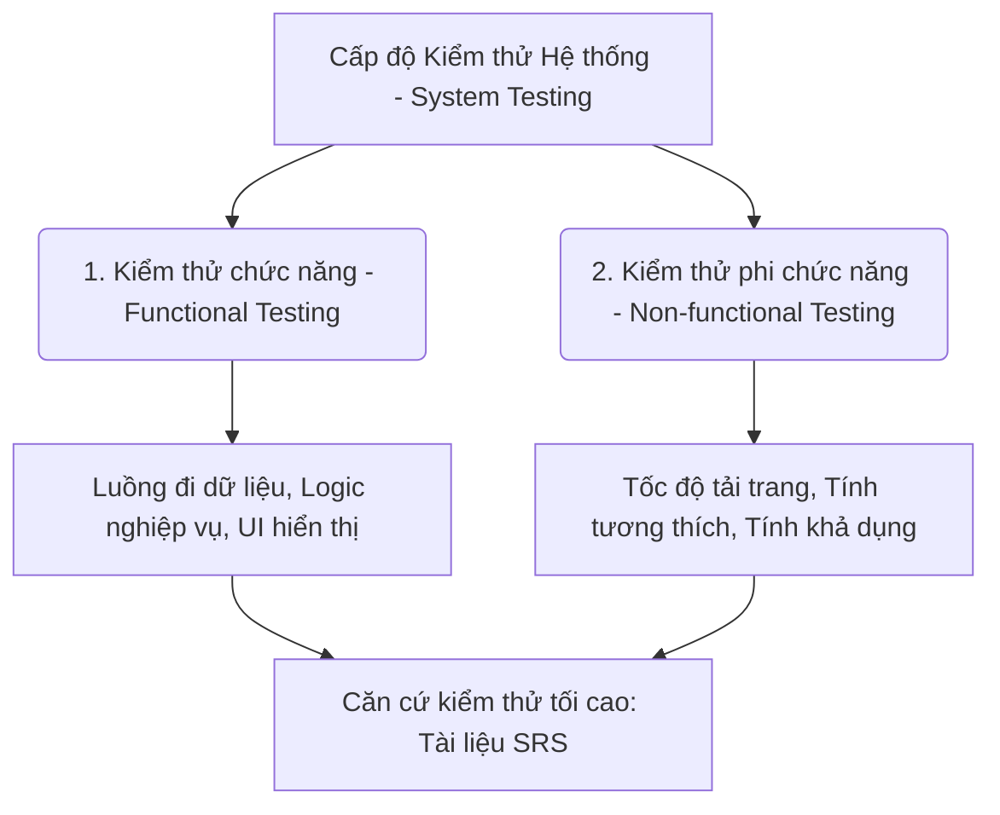
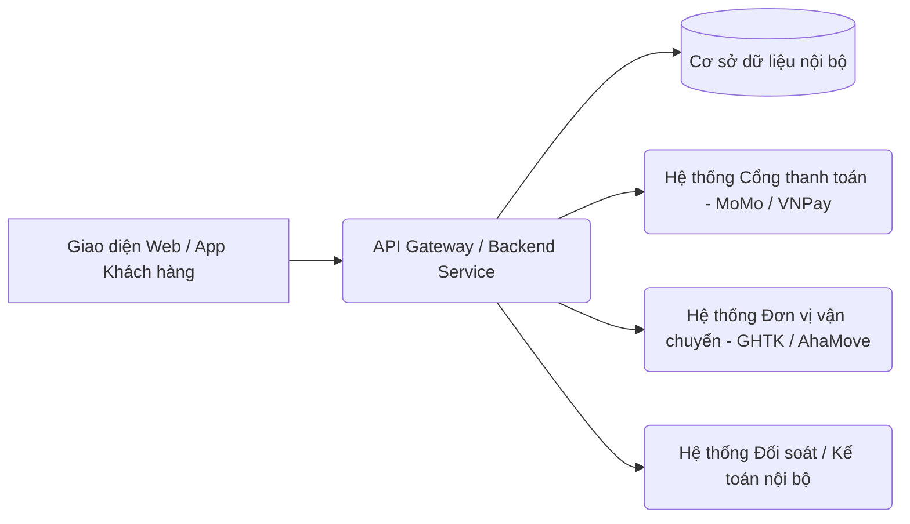
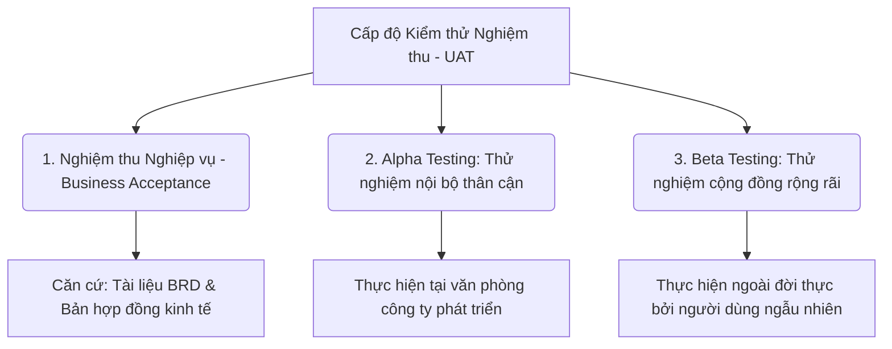

# 📁 03. Manual Testing

*Mục tiêu: Làm chủ quy trình, phân tích tài liệu đặc tả hệ thống chuyên sâu, thực thi kiểm thử thủ công và xây dựng hệ thống tài liệu (Artifacts) chuẩn chỉnh của một Manual Tester.*

# **3.3. Functional Testing Levels & Types**

## 📌 Mục lục nội bộ (Chặng 03)

- [ ] [**3.1. Requirements Analysis**](./1_Requirements.md)
- [ ] [**3.2. Test Artifacts**](./2_Artifacts.md)
- [ ] [**3.3. Functional Testing Levels & Types**](./3_FunctionalTesting.md)
  - [ ] [3.3.1. Functional Testing Overview](#331-functional-testing-overview)
  - [ ] [3.3.2. Smoke Testing vs Sanity Testing](#332-smoke-testing-vs-sanity-testing)
  - [ ] [3.3.3. Retesting vs Regression Testing](#333-retesting-vs-regression-testing)
  - [ ] [3.3.4. System Testing](#334-system-testing)
  - [ ] [3.3.5. End-to-End (E2E) Testing](#335-end-to-end-e2e-testing)
  - [ ] [3.3.6. UAT (User Acceptance Testing)](#336-uat)
- [ ] [**3.4. Non-functional Testing**](./4_NonFunctionalTesting.md)

---

# 3.3.1. Functional Testing Overview

**Functional Testing (Kiểm thử chức năng)** là một hình thức kiểm thử hộp đen (`Black-box Testing`) tập trung vào việc xác thực xem hệ thống phần mềm có thực hiện đúng và đầy đủ các chức năng theo đúng tài liệu đặc tả yêu cầu nghiệp vụ (`Test Basis` như SRS, BRD, User Story) hay không. Nói một cách đơn giản, kiểm thử chức năng trả lời cho câu hỏi: *"Phần mềm có làm đúng những gì nó bắt buộc phải làm hay không?"* (`What the system does`).

Kiểm thử chức năng không quan tâm đến cấu trúc mã nguồn bên trong ứng dụng. Tester đóng vai trò là người dùng cuối, truyền dữ liệu vào hệ thống (`Input`), kích hoạt hành động và đối chiếu kết quả trả ra (`Actual Result`) với quy chuẩn đặc tả (`Expected Result`).

## 📊 Mô hình Phân cấp 4 Cấp độ Kiểm thử Chức năng (Test Levels)

Hoạt động kiểm thử chức năng được chia nhỏ và thực thi tuần tiến qua 4 chốt chặn kỹ thuật từ vi mô đến vĩ mô:

---

## 🛠️ Ma trận Phân bóc Kỹ thuật 4 Cấp độ Kiểm thử Chức năng

Manual Tester bắt buộc phải phân tách rõ ranh giới làm việc, đối tượng kiểm tra và trách nhiệm nhân sự tại từng cấp độ để phối hợp nhịp nhàng trong dự án:

### 1. Unit Testing (Kiểm thử đơn vị / Thành phần)
* **Đối tượng kiểm tra:** Các hàm, phương thức, class hoặc mô-đun mã nguồn nhỏ lẻ độc lập.
* **Mục tiêu:** Đảm bảo từng dòng lệnh logic xử lý toán học của từng hàm chạy đúng cấu trúc.
* **Bên thực hiện chính:** Lập trình viên (Developer) tự viết mã code test trên máy cá nhân (Local) trước khi giao bài.

### 2. Integration Testing (Kiểm thử tích hợp)
* **Đối tượng kiểm tra:** Giao diện tương tác, luồng truyền tải dữ liệu giữa các mô-đun đã được ghép nối, hoặc kết nối giữa Client và API Server.
* **Mục tiêu:** Phát hiện các lỗi sai lệch định dạng cấu trúc dữ liệu khi các thành phần độc lập bắt tay giao tiếp với nhau.
* **Bên thực hiện chính:** Developer phối hợp cùng Kỹ sư QA/Tester thực hiện qua các công cụ như Postman.

### 3. System Testing (Kiểm thử hệ thống)
* **Đối tượng kiểm tra:** Toàn bộ hệ thống phần mềm hoàn chỉnh đã được đóng gói (`Build`) và cài đặt trên môi trường kiểm thử độc lập (`QA/Staging Environment`).
* **Mục tiêu:** Kiểm tra toàn diện tất cả các luồng nghiệp vụ đúng/sai, giao diện đồ họa đồ đồng bộ, đảm bảo hệ thống vận hành đúng 100% tài liệu đặc tả kỹ thuật `SRS`.
* **Bên thực hiện chính:** Đội ngũ **Manual Tester / QA Engineer**. Đây là sân khấu chính chiếm 80% thời gian làm việc của bạn.

### 4. Acceptance Testing (Kiểm thử nghiệm thu - UAT)
* **Đối tượng kiểm tra:** Sản phẩm phần mềm hoàn chỉnh chạy trực tiếp trên môi trường giả lập thực tế (`UAT Environment`) với dữ liệu nền sạch.
* **Mục tiêu:** Xác nhận hệ thống đáp ứng đúng bài toán kinh tế trong tài liệu `BRD` và xây dựng sự tự tin (`Building confidence`) cho khách hàng trước khi bấm nút phát hành.
* **Bên thực hiện chính:** Khách hàng, Người dùng cuối (`End Users`) hoặc Product Owner (PO), dưới sự hỗ trợ điều phối kịch bản của Tester.

> ⚠️ **Tư duy chuyên gia cần nhớ:**
> Một sai lầm phổ biến là Tester chỉ tập trung vào kiểm thử chức năng trên giao diện (`UI Functional Test`) mà bỏ qua logic nghiệp vụ chạy ngầm. Hãy luôn áp dụng tư duy bóc tách tham số đầu vào. Kiểm thử chức năng toàn diện bắt buộc phải che phủ đủ 3 luồng: Luồng thẳng (`Happy Path`), Luồng chặn lỗi nhập sai (`Unhappy Path`) và Luồng xử lý dữ liệu cực đoan (`Edge Case`).

## 📚 References (Tài liệu tham khảo 3.3.1)
* [ISTQB® Certified Tester Foundation Level (CTFL) Syllabus v4.0](https://istqb.org) - Section 2.2: *Test Levels (Component, Integration, System, and Acceptance Testing)* & Section 2.3.1: *Functional Testing.*
* [ISO/IEC/IEEE 29119-1:2022 Standard](https://iso.org) - *Software and systems engineering — Software testing — Part 1: General concepts (Functional Testing Framework Quy chuẩn Kiểm thử Chức năng).*

# 3.3.2. Smoke Testing vs Sanity Testing

Trong kiểm thử thủ công, **Smoke Testing (Kiểm thử khói)** và **Sanity Testing (Kiểm thử tỉnh táo)** là hai hình thức kiểm thử nhanh cực kỳ quan trọng, đóng vai trò là những chốt chặn bộ lọc thời gian cho Tester. Tuy nhiên, đây cũng là cặp khái niệm kinh điển hay bị nhầm lẫn nhất trong mọi cuộc phỏng vấn tuyển dụng QA/Tester.

Cả hai đều là các bài kiểm tra ngắn gọn, tốn ít thời gian thực thi, nhưng chúng được áp dụng ở các thời điểm hoàn toàn khác nhau với các mục tiêu kỹ thuật riêng biệt để bảo vệ quỹ thời gian của đội ngũ QA.

## 📊 Mô hình Bản đồ Vị trí của Smoke và Sanity Test trong Luồng Nhận Build

Quy trình chốt chặn giúp phân tách rõ ràng thời điểm thực thi của từng bài test:

---

## 🛠️ Ma trận Phân biệt Chuyên sâu: Smoke Test vs Sanity Test

Để phối hợp nhịp nhàng trong dự án thực tế, Tester chuyên nghiệp sử dụng ma trận đối chiếu 5 tiêu chí kỹ thuật nghiêm ngặt sau:

| Tiêu chí | Smoke Testing (Kiểm thử khói) | Sanity Testing (Kiểm thử tỉnh táo) |
| :--- | :--- | :--- |
| **Bản chất kỹ thuật** | Kiểm tra **Độ ổn định nền tảng** của toàn bộ hệ thống (`Build Verification`). | Kiểm tra **Độ hợp lý / Tính tỉnh táo** của logic vừa được sửa đổi (`Rationality Test`). |
| **Thời điểm kích hoạt** | Thực hiện ngay khi nhận được một bản cài đặt mới tinh (`Initial Build`) hoặc một đợt phát hành lớn. | Thực hiện khi nhận được một bản build phụ chứa các bản vá lỗi (`Bug Fixes`) hoặc cập nhật tính năng nhỏ. |
| **Phạm vi bao phủ** | **Rộng và Nông**: Quét qua 100% các module cốt lõi nhưng không đi sâu vào kịch bản biên. | **Hẹp và Sâu**: Chỉ tập trung cô lập xung quanh module vừa sửa code nhưng test kỹ các kịch bản liên quan. |
| **Mục tiêu của QA** | Xác nhận hệ thống có bị sập (`Crash`) không, để quyết định có đáng bỏ thời gian ra test diện rộng không. | Xác nhận xem Developer viết code sửa lỗi có thực sự làm cho tính năng chạy đúng logic thông thường không. |
| **Cấu trúc bộ kịch bản** | Là một bộ Test Suite cố định (chiếm 5-10% tổng Test Case), thường được cấu hình chạy tự động bằng code Automation. | Không cố định, Tester tự nhặt nhanh các Test Case liên đới xung quanh module lỗi để tạo thành một bộ test nhanh. |

---

## 💡 Ví dụ thực tế liên hoàn (Hệ thống Thương mại Điện tử E-commerce)

Hãy tưởng tượng bạn đang kiểm thử một ứng dụng mua sắm trực tuyến, việc áp dụng hai bài test này sẽ diễn ra như sau:

### Tình huống 1: Thực thi Smoke Test
* **Ngữ cảnh:** Sáng thứ Hai, Developer bàn giao một bản Build v1.0 hoàn chỉnh của app.
* **Hành động của QA:** Bạn không mở danh sách 500 Test Cases ra test từng nút bấm. Bạn chỉ lấy bộ kịch bản Smoke Test gồm 5 kịch bản sinh tử chuyên biệt để chạy: *1. Mở app có lên không? -> 2. Đăng nhập được không? -> 3. Tìm sản phẩm được không? -> 4. Thêm được vào giỏ hàng không? -> 5. Bấm nút Thanh toán có ra màn hình nhập thẻ không?*
* **Kết quả:** Nếu bước 2 bấm Đăng nhập app bị văng lập tức (`Crash`), bộ Smoke Test bị **FAIL**. Bạn dừng test ngay lập tức, trả bản Build về cho Dev. Việc này giúp bạn không lãng phí 3 ngày viết Test Case vô ích trên một môi trường lỗi móng.

### Tình huống 2: Thực thi Sanity Test
* **Ngữ cảnh:** Chiều thứ Ba, Dev báo đã sửa xong lỗi đăng nhập của ngày hôm qua và giao bản Build patch v1.1.
* **Hành động của QA:** Lúc này hệ thống nền đã ổn định, bạn cần thực hiện Sanity Test để kiểm tra riêng vùng lỗi. Bạn nhặt nhanh 10 Test Cases liên quan trực tiếp đến module tài khoản: *Nhập đúng pass, nhập sai pass, bấm quên mật khẩu, kiểm tra token phiên đăng nhập*. Bạn không cần chạy lại các Test Case của module Giỏ hàng hay Tìm kiếm.
* **Kết quả:** Nếu nút Đăng nhập đã chạy mượt mà, đúng logic thông thường, bài Sanity Test **PASS**. Bạn chấp nhận bản sửa lỗi này và cho phép chuyển trạng thái Bug thành `Resolved` để chuẩn bị chạy test hồi quy.

> ⚠️ **Tư duy chuyên gia cần nhớ:**
> Smoke Testing là để kiểm tra xem hệ thống đã **Đủ sức khỏe** để tiếp nhận kiểm thử hay chưa, còn Sanity Testing là để xác minh xem hệ thống có **Đủ tỉnh táo** sau khi trải qua một cuộc phẫu thuật sửa đổi mã nguồn hay không. Làm chủ được hai chốt chặn này chính là cách Manual Tester tối ưu hóa 50% thời gian thực thi hiệu quả, bảo vệ bản thân khỏi cái bẫy quá tải nguồn lực trong các chu kỳ Sprint chạy nhanh.

## 📚 References (Tài liệu tham khảo 3.3.2)
* [ISTQB® Certified Tester Foundation Level (CTFL) Syllabus v4.0](https://istqb.org) - Section 2.3.1: *Functional Testing* & Official Glossary Definitions of *Smoke Testing* and *Sanity Testing*.
* **Cem Kaner, James Bach (2001)** - *Lessons Learned in Software Testing*, Wiley.

# 3.3.3. Retesting vs Regression Testing

Trong giai đoạn thực thi kiểm thử (`Test Execution`), sau khi Tester phát hiện ra lỗi, lập báo cáo Bug report lên Jira và Developer tiến hành sửa code, hệ thống sẽ trả về một bản Build mới để QA xác nghiệm. Tại thời điểm này, Tester bắt buộc phải thực hiện song hành hai hoạt động: **Retesting (Kiểm thử lại)** và **Regression Testing (Kiểm thử hồi quy)**.

Đây là hai khái niệm cốt lõi vận hành khâu quản lý lỗi, có bản chất và mục tiêu kỹ thuật hoàn toàn khác biệt nhưng bắt buộc phải phối hợp nhịp nhàng để đảm bảo tính toàn vẹn của sản phẩm trước khi xuất xưởng.

## 📊 Mô hình Luồng Xử lý Mã nguồn và Vị trí của Retest & Regression Test

Quy trình chốt chặn lỗi giúp Tester định vị chính xác chuỗi hành động sau khi Developer sửa code:

---

## 🛠️ Ma trận Phân biệt Chuyên sâu: Retesting vs Regression Testing

Để vận hành quy trình quản lý chất lượng một cách chuyên nghiệp, Tester cần phân tách rõ ma trận đối chiếu 5 tiêu chí kỹ thuật nghiêm ngặt sau:

| Tiêu chí phân biệt | Retesting (Kiểm thử lại) | Regression Testing (Kiểm thử hồi quy) |
| :--- | :--- | :--- |
| **Bản chất kỹ thuật** | Kiểm tra **Tính đúng đắn trực tiếp** của bản sửa lỗi (`Confirmation Testing`). | Kiểm tra **Tính an toàn / Không bị ảnh hưởng lây** của toàn hệ thống cũ. |
| **Thời điểm kích hoạt** | Thực hiện ngay lập tức khi nhận được thông báo Developer đã sửa xong Bug trên Jira. | Thực hiện sau khi bài test Retesting đã vượt qua (`PASS`) và vào cuối mỗi chu kỳ dự án. |
| **Phạm vi bao phủ** | **Cực hẹp**: Chỉ chạy lại đúng 1 hoặc một vài Test Case cụ thể từng bị đánh trạng thái `FAIL`. | **Rộng**: Quét qua 100% các tính năng cũ đang chạy ổn định của hệ thống. |
| **Mục tiêu của QA** | Xác nhận xem Developer đã sửa hết lỗi của cái Bug cụ thể đó hay chưa. | Đảm bảo việc sửa Bug mới hoặc chèn code mới không vô tình làm hỏng các tính năng cũ. |
| **Khả năng tự động hóa** | **Thấp**: Thường được Tester thực hiện bằng tay (`Manual`) do lỗi phát sinh rất đa dạng và đặc thù. | **Cực cao**: Là đối tượng tối cao để viết mã **Automation Test** nhằm chạy đi chạy lại liên tục trên pipeline CI/CD. |

---

## 💡 Ví dụ thực tế liên hoàn (Tính năng Giỏ hàng - Mua sắm Online)

Hãy tưởng tượng bạn đang kiểm thử một ứng dụng mua sắm trực tuyến, chuỗi hành động phối hợp giữa Retest và Regression sẽ diễn ra như sau:

1. **Phát hiện lỗi gốc:** Ở chu kỳ trước, bạn tìm thấy một lỗi nghiêm trọng: *"Khi người dùng tăng số lượng sản phẩm lên 10 chiếc trong giỏ hàng, hệ thống tính sai tổng số tiền"*. Bạn log Bug lên Jira.
2. **Thực thi Retesting:** Hôm sau, Dev báo đã sửa xong code tính tiền. Bạn nhận Build mới, vào lại đúng giỏ hàng, nạp đúng dữ liệu 10 sản phẩm và bấm nút tính tiền. Hệ thống hiển thị số tiền chính xác 100%. Bài Retesting của bạn **PASS**. Bạn tự tin đóng cái Bug đó lại.
3. **Thực thi Regression Testing:** Ngay sau đó, tư duy phản biện (`Critical Thinking`) cảnh báo bạn: *Để sửa cái hàm tính tiền này, Dev đã chạm vào mã nguồn dùng chung của toàn bộ module Giỏ hàng*. Bạn lập tức mở bộ kịch bản Test hồi quy (`Regression Suite`) ra để quét lại các tính năng cũ lân cận: *Xóa sản phẩm khỏi giỏ, áp mã coupon giảm giá, đổi địa chỉ nhận hàng*. 
4. **Phát hiện lỗi hồi quy:** Kinh ngạc thay, khi bạn bấm nút xóa sản phẩm, app bị sập nguồn (`Crash`). Lỗi xóa sản phẩm này hôm qua chạy rất tốt, nhưng hôm nay bị hỏng do Dev sửa hàm tính tiền chạm nhầm code. Bạn đã phát hiện ra một **Lỗi hồi quy (Regression Bug)** nghiêm trọng và lập tức tạo một Bug Ticket hoàn toàn mới trên Jira.

> ⚠️ **Tư duy chuyên gia cần nhớ:**
> Retesting là hoạt động hướng về **Quá khứ** (để chốt lại những cái sai đã biết), còn Regression Testing là hoạt động hướng về **Tương lai** (để bảo vệ sự an toàn của những cái đang đúng). Sai lầm lớn nhất của một Tester tập sự là chỉ làm Retesting thấy hết lỗi là vội vàng báo cáo Done việc. Code phần mềm là một mạng lưới chằng chỉnh, chạm một sợi dây có thể làm rung động cả hệ thống. Hãy luôn chạy Test hồi quy để bảo vệ chiếc lưới an toàn chất lượng của bạn.

## 📚 References (Tài liệu tham khảo 3.3.3)
* [ISTQB® Certified Tester Foundation Level (CTFL) Syllabus v4.0](https://istqb.org) - Section 2.3.3: *Retesting and Regression Testing.*
* [ISO/IEC/IEEE 29119-2:2021 Standard](https://iso.org) - *Software and systems engineering — Software testing — Part 2: Test processes (Regression Testing Control Quy chuẩn Kiểm thử Hồi quy).*

# 3.3.4. System Testing

**System Testing (Kiểm thử hệ thống)** là một cấp độ kiểm thử toàn diện (`Test Level`), nơi phần mềm được đóng gói hoàn chỉnh (`Complete & Integrated Product`) và cài đặt trên một môi trường độc lập (`QA/Staging Environment`) nhằm xác thực xem toàn bộ hệ thống có hoạt động đúng theo tài liệu đặc tả kỹ thuật `SRS` hay không.

Đây là cấp độ kiểm thử hộp đen (`Black-box Testing`) trọng tâm và chiếm phần lớn thời gian thực thi của một Manual Tester. Điểm khác biệt cốt lõi là hệ thống không còn được kiểm tra theo từng mảnh code nhỏ lẻ (như Unit Test) hay từng cụm giao tiếp (như Integration Test), mà được đánh giá dưới góc độ **vận hành hợp nhất toàn vẹn cả về Chức năng lẫn Phi chức năng**.

## 📊 Mô hình Khung Phủ Kịch bản của Kiểm thử Hệ thống

Kiểm thử hệ thống quét toàn diện cả hai khía cạnh chức năng và đặc tính phi chức năng của sản phẩm:

---

## 🛠️ Ma trận Kỹ thuật Thực chiến trong System Testing

Để thực hiện kiểm thử hệ thống một cách khoa học, Kỹ sư QA bắt buộc phải che phủ đủ 4 nhóm nội dung cốt lõi sau:

### 1. Verification bám sát Căn cứ kiểm thử (`SRS Basis`)
* Tester vận hành hệ thống để đối chiếu trực tiếp với từng điều khoản quy chuẩn kỹ thuật. Đảm bảo mọi tính năng được thiết kế (Ví dụ: Thống kê báo cáo tài chính, xuất file PDF, phân quyền tài khoản Admin/User) đều hoạt động chính xác không sai lệch 1 pixel hay 1 dòng logic.

### 2. Bao phủ Ma trận kịch bản 3 luồng dữ liệu
* **Happy Path (Luồng đúng):** Người dùng thực hiện thao tác hoàn hảo, nhập đúng định dạng dữ liệu chuẩn.
* **Unhappy Path (Luồng chặn lỗi):** Người dùng cố tình điền sai thông tin, truyền ký tự đặc biệt, để trống ô bắt buộc. Hệ thống phải kích hoạt cơ chế phòng vệ chặn lỗi và hiển thị thông điệp cảnh báo rõ ràng.
* **Edge Case (Kịch bản biên):** Nhập dữ liệu tại các ngưỡng cực đoan (Ví dụ: Đổi mật khẩu chứa tối đa 100 ký tự) để kiểm tra độ bền của code.

### 3. Kiểm thử luồng tích hợp nội bộ (End-to-End Flow)
* Kiểm tra dòng dịch chuyển xuyên suốt của dữ liệu chạy qua tất cả các mô-đun trong phần mềm. 
* *Ví dụ:* Luồng mua hàng: Người dùng tìm sản phẩm -> Thêm vào giỏ -> Áp mã -> Bấm thanh toán. Hệ thống phải tự động trừ số lượng hàng trong kho, gửi Email hóa đơn về cho khách hàng, và đẩy dữ liệu đơn hàng về trang quản trị của Admin.

### 4. Đánh giá Đặc tính phi chức năng cấp hệ thống (Non-functional Aspects)
* Kiểm tra nhanh các lỗi liên quan đến trải nghiệm hiển thị đồ họa trên các kích thước trình duyệt (`Compatibility`), kiểm tra tốc độ phản hồi phản ứng của trang khi thực hiện thao tác nặng (`Performance Baseline`) và tính dễ sử dụng (`Usability`).

---

## 🧠 Quy tắc chốt chặn Entry & Exit Criteria của System Testing

Tester không chạy System Test một cách vô tổ chức, bạn phải tuân thủ nghiêm ngặt điều kiện chốt chặn của Test Plan:

* **Entry Criteria (Khi nào bắt đầu?):** Chỉ bắt đầu System Test khi bản cài đặt (`Build`) đã vượt qua khâu kiểm thử khói **Smoke Testing** thành công; Lập trình viên đã hoàn thành viết code sửa lỗi và nạp dữ liệu nền Database Baseline ổn định.
* **Exit Criteria (Khi nào dừng?):** Đợt System Test chỉ được nghiệm thu đóng chu kỳ khi 100% Test Case High Priority đã thực thi; Không còn tồn đọng bất kỳ lỗi Major/Critical nào chưa sửa; và Ma trận `RTM` chứng minh đã phủ kín 100% yêu cầu tài liệu.

> ⚠️ **Tư duy chuyên gia cần nhớ:**
> Điểm phân cấp trình độ QA trong System Testing nằm ở khả năng kiểm soát **Môi trường độc lập**. Bạn phải bảo vệ môi trường QA/Staging của mình khỏi sự can thiệp của Developer. Tuyệt đối không cho phép Developer tự ý nhảy vào thay đổi cấu hình, chèn dữ liệu rác, hoặc đẩy code vá lỗi lung tung khi bạn đang chạy System Test. Môi trường bị biến động sẽ phá hủy hoàn toàn tính chính xác của Nhật ký thực thi kiểm thử (`Test Logs`).

## 📚 References (Tài liệu tham khảo 3.3.4)
* [ISTQB® Certified Tester Foundation Level (CTFL) Syllabus v4.0](https://istqb.org) - Section 2.2.3: *System Testing.*
* [ISO/IEC/IEEE 29119-2:2021 Standard](https://iso.org) - *Software and systems engineering — Software testing — Part 2: Test processes (System Testing Level Quy chuẩn Cấp độ Hệ thống).*

# 3.3.5. End-to-End (E2E) Testing

**End-to-End (E2E) Testing (Kiểm thử chuỗi liên hoàn toàn diện)** là một phương pháp kiểm thử hộp đen nâng cao nhằm xác thực luồng vận hành của phần mềm xuyên suốt từ điểm bắt đầu đến điểm kết thúc của một hành trình trải nghiệm người dùng thực tế. 

Khác với `System Testing` chủ yếu tập trung kiểm tra các chức năng cô lập bên trong nội bộ ứng dụng, E2E Testing mở rộng phạm vi ra toàn bộ hệ sinh thái kỹ thuật. Nó kiểm tra sự toàn vẹn của luồng đi dữ liệu khi phần mềm phải tương tác liên thông với cơ sở dữ liệu (`Database`), hạ tầng phần cứng, mạng và đặc biệt là hệ thống của các đối tác hoặc **Dịch vụ bên thứ ba (Third-party Services)** như cổng thanh toán, đơn vị vận chuyển, SMS Gateway.

## 📊 Mô hình Bản đồ Dòng dữ liệu Xuyên biên giới của kịch bản E2E

Một kịch bản kiểm thử E2E mô phỏng chính xác hành trình dịch chuyển dữ liệu đi qua nhiều hệ thống độc lập:

---

## 🛠️ Chi tiết ma trận vận hành kỹ thuật của QA

### 1. Giả lập Chân dung Người dùng Thực tế (User Persona Simulation)
* Tester rũ bỏ hoàn toàn tư duy kỹ thuật để đóng vai là một khách hàng thực sự ngoài đời thực, thực hiện trọn vẹn một vòng đời giao dịch (Ví dụ: Từ lúc đăng ký tài khoản -> Tìm hàng -> Điền thông tin -> Quét mã thanh toán -> Nhận hàng -> Đổi trả hoàn tiền). Mọi bước đi phải tuân thủ đúng thói quen tự nhiên của con người.

### 2. Kiểm soát Luồng truyền dữ liệu giữa các Tầng Kiến trúc (Data Integrity)
* QA thực hiện kiểm tra chéo tính chính xác của dữ liệu tại mọi điểm chạm. 
* *Ví dụ:* Khi khách hàng mua một món hàng giá 500.000 VND và áp mã giảm giá 50.000 VND: QA phải check xem màn hình UI hiển thị đúng số tiền cần trả là 450.000 VND không; API truyền đi đúng tham số không; Tài khoản ngân hàng có bị trừ đúng 450.000 VND không; và Database của hệ thống có cập nhật đúng trạng thái đơn hàng là "Đã thanh toán" không. Một điểm lệch dữ liệu nghĩa là ca E2E bị **FAIL**.

### 3. Xử lý Chốt chặn Tích hợp Hệ thống bên thứ ba (Third-party Integration)
* Đây là thách thức lớn nhất của E2E Testing. QA phải làm việc với các đối tác để xin tài khoản thử nghiệm (`Sandbox Accounts / Test Environments`) của họ để thực hiện giao dịch giả lập. 
* Nếu cổng thanh toán của đối tác bị lỗi hoặc môi trường sandbox của họ bị bảo trì, ca test E2E của Tester sẽ bị đóng băng. QA phải có năng lực đọc hiểu cấu trúc file log để phân định rõ ràng: Hệ thống bị lỗi do code của công ty mình hay do lỗi sập mạng từ phía đối tác.

---

## 💡 Ví dụ thực tế: Kịch bản E2E Luồng "Đặt đồ ăn Online trên Siêu ứng dụng"

Để thấy rõ sự khác biệt của E2E, hãy xem một kịch bản chuỗi liên hoàn bao phủ 5 hệ thống độc lập dưới đây:

1. **Hệ thống 1 (Khách hàng):** User mở App di động -> Chọn món ăn -> Bấm nút đặt hàng -> App điều hướng sang cổng thanh toán.
2. **Hệ thống 2 (Cổng thanh toán bên thứ ba - MoMo):** User nhập mã PIN Ví điện tử -> Bấm xác nhận trừ tiền thành công -> MoMo gửi tín hiệu webhook trả về cho App.
3. **Hệ thống 3 (Quản lý Nhà hàng):** App tiếp nhận tín hiệu thành công -> Đẩy thông báo đơn hàng mới sang máy tính bảng của chủ cửa hàng kinh doanh -> Chủ quán bấm nút "Chấp nhận & Chuẩn bị món".
4. **Hệ thống 4 (Đơn vị vận chuyển - AhaMove):** Hệ thống tự động phát tín hiệu gọi tài xế gần nhất qua API -> Tài xế AhaMove nhận đơn trên App của họ -> Đến quán lấy đồ ăn và đi giao.
5. **Hệ thống 5 (Khách hàng & Kế toán):** Tài xế bấm nút "Đã giao hàng" trên app tài xế -> Khách hàng nhận được thông báo đơn hoàn thành -> Hệ thống kế toán nội bộ của công ty tự động cộng doanh thu và tính toán tỷ lệ chia sẻ phần trăm chiết khấu cho nhà hàng.

> ⚠️ **Tư duy chuyên gia cần nhớ:**
> Do tính chất bao phủ quá rộng và phụ thuộc vào nhiều hệ thống bên ngoài, E2E Testing có chi phí thực thi rất đắt đỏ, tốn thời gian và hệ thống rất dễ gặp trạng thái **Flaky** (Bài test bị Fail do mạng chập chờn chứ không phải do code lỗi). Vì vậy, Tester không viết kịch bản E2E cho tất cả các tính năng vặt vãnh. Bạn chỉ áp dụng E2E Testing cho các **Luồng hành trình sinh tử cốt lõi (`Critical Core Workflows`)** - nơi nếu đứt gãy giao tiếp dữ liệu sẽ lập tức làm tê liệt hoàn toàn nguồn doanh thu của doanh nghiệp.

## 📚 References (Tài liệu tham khảo 3.3.5)
* [ISTQB® Certified Tester Foundation Level (CTFL) Syllabus v4.0](https://istqb.org) - Section 2.2.3: *System Testing (End-to-End Test Scenarios).*
* **Martin Fowler (2018)** - *The Practical Test Pyramid*, martinfowler.com.

# 3.3.6. UAT (User Acceptance Testing)

**UAT (User Acceptance Testing - Kiểm thử Nghiệm thu Người dùng)** là cấp độ kiểm thử cuối cùng trong chuỗi vòng đời phát triển phần mềm (`SDLC`) trước khi sản phẩm chính thức được bàn giao và phát hành rộng rãi ra thị trường. 

Mục tiêu tối cao của UAT không còn là đi săn lùng các lỗi cú pháp hay lỗi hiển thị giao diện nhỏ lẻ. UAT tập trung vào hoạt động **Xác nhận (`Validation`)**, trả lời cho câu hỏi cốt lõi của doanh nghiệp: *"Chúng ta có xây dựng đúng sản phẩm mà khách hàng thực sự cần để giải quyết bài toán kinh doanh hay không?"* (`Are we building the right product?`). 

## 📊 Mô hình Phân nhánh Chiến lược Kiểm thử Nghiệm thu

Hoạt động UAT được triển khai phân cấp thành các giai đoạn độc lập nhằm thu thập phản hồi từ các nhóm đối tượng người dùng khác nhau:

---

## 🛠️ Ma trận Chi tiết 3 Hình thức UAT Thực chiến

Để phối hợp điều phối quy trình nghiệm thu một cách chuẩn xác, Kỹ sư QA bắt buộc phải nắm rõ bản chất kỹ thuật của 3 hình thức UAT sau:

### 1. Business / Contract Acceptance Testing (Nghiệm thu Nghiệp vụ & Hợp đồng)
* **Bản chất:** Đối chiếu phần mềm thực tế với các điều khoản pháp lý trong hợp đồng và quy trình dòng tiền trong tài liệu **BRD**.
* **Người thực thi:** Đại diện ban quản lý dự án phía khách hàng, Product Owner (PO) hoặc Chuyên gia nghiệp vụ ngành (`Subject Matter Experts - SME`).
* **Vai trò của QA:** Cung cấp tài liệu ma trận `RTM` để chứng minh tính bao phủ của dự án và làm trọng tài kỹ thuật giải thích luồng đi dữ liệu cho khách hàng.

### 2. Alpha Testing (Kiểm thử Alpha)
* **Bản chất:** Giai đoạn thử nghiệm sớm nhất của sản phẩm hoàn chỉnh, được thực hiện trong môi trường giả lập giả định.
* **Người thực thi:** Người dùng nội bộ bên trong công ty, nhân viên phòng ban khác không tham gia viết code, hoặc một nhóm nhỏ khách hàng thân thiết được mời đến.
* **Địa điểm:** Diễn ra ngay tại văn phòng của công ty phát triển phần mềm (`At developer's site`). Lập trình viên và QA ngồi ngay bên cạnh để ghi nhận phản hồi trực tiếp.

### 3. Beta Testing (Kiểm thử Beta / Field Testing)
* **Bản chất:** Giai đoạn thử nghiệm thực tế trên diện rộng trước khi mở bán chính thức. Sản phẩm được tung ra dưới dạng phiên bản thử nghiệm giới hạn (`Beta Version`).
* **Người thực thi:** Cộng đồng người dùng cuối ngẫu nhiên ngoài thị trường tự đăng ký trải nghiệm.
* **Địa điểm:** Diễn ra hoàn toàn ngoài đời thực (`At user's site`) trên thiết bị và mạng thật của khách hàng. Nhà phát triển thu thập lỗi từ xa thông qua hệ thống báo cáo tự động tích hợp trong app.

---

## 🧠 Vai trò Kỹ thuật Thực tế của Manual Tester trong giai đoạn UAT

Nhiều Tester lầm tưởng giai đoạn UAT là việc của khách hàng nên QA có thể ngồi nghỉ ngơi. Thực tế, QA đóng vai trò là **Người điều phối và Bảo vệ chất lượng cuối cùng**:

* **Xây dựng bộ check-list nghiệm thu (UAT Test Scenarios):** Khách hàng không biết kỹ thuật để test. QA phải hỗ trợ chuyển hóa tài liệu BRD vĩ mô thành các kịch bản hành trình khách hàng (`User Journeys`) ngắn gọn để hướng dẫn khách hàng cách bấm nút xác nghiệm hệ thống.
* **Bộ lọc thông tin lỗi (Bug Triaging):** Khách hàng khi dùng app thấy không đúng ý sẽ lập tức báo lỗi. QA phải là người đứng ra hứng chịu các phản hồi này, phân bóc rõ ràng: Đâu là lỗi kỹ thuật thực sự (Dev code sai -> QA chuyển thành Bug Jira bắt Dev sửa gấp), và đâu chỉ là yêu cầu đổi ý của khách hàng (`Change Request` - Tính năng chạy đúng thiết kế cũ nhưng khách hàng muốn đổi logic mới -> QA chuyển sang cho BA quản lý).

> ⚠️ **Tư duy chuyên gia cần nhớ:**
> Đạt tỷ lệ `PASS` 100% ở giai đoạn System Test của QA vẫn hoàn toàn vô nghĩa nếu sản phẩm bị đánh trạng thái `FAIL` ở giai đoạn UAT của Khách hàng. Hãy luôn giữ tư duy hướng người dùng (`User Perspective`). Mục tiêu tối hậu của UAT là **Xây dựng sự tự tin (`Building confidence`)** cho khách hàng thấy phần mềm đã sẵn sàng vận hành ổn định ngoài đời thực để mang lại dòng tiền cho doanh nghiệp.

## 📚 References (Tài liệu tham khảo 3.3.6)
* [ISTQB® Certified Tester Foundation Level (CTFL) Syllabus v4.0](https://istqb.org) - Section 2.2.4: *Acceptance Testing (User Acceptance, Alpha, and Beta Testing).*
* [ISO/IEC/IEEE 29119-2:2021 Standard](https://iso.org) - *Software and systems engineering — Software testing — Part 2: Test processes (Acceptance Testing Process).*
