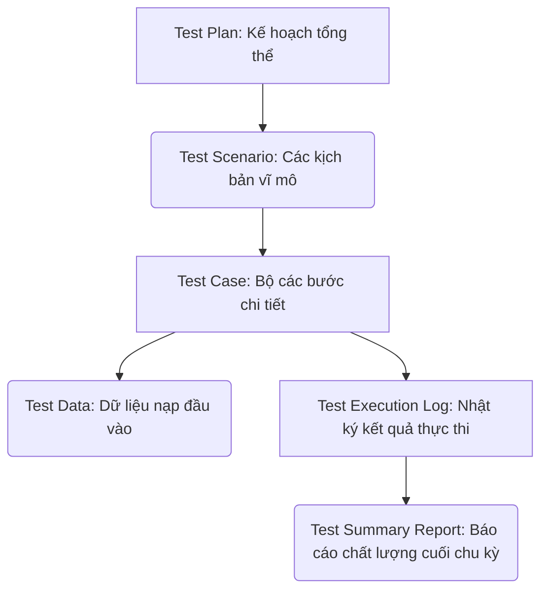
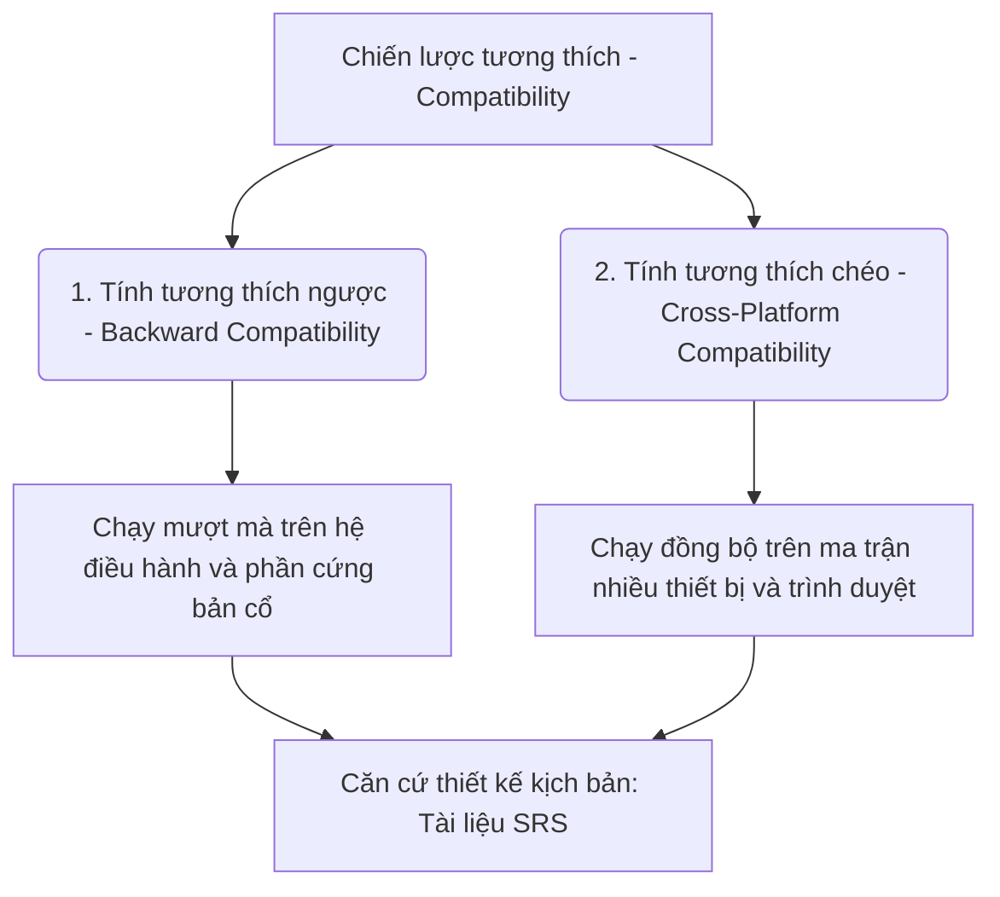
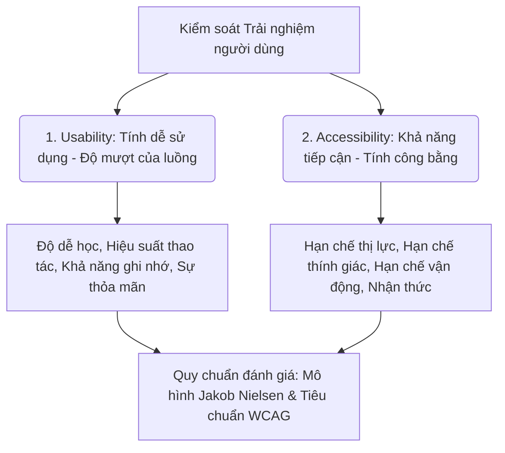
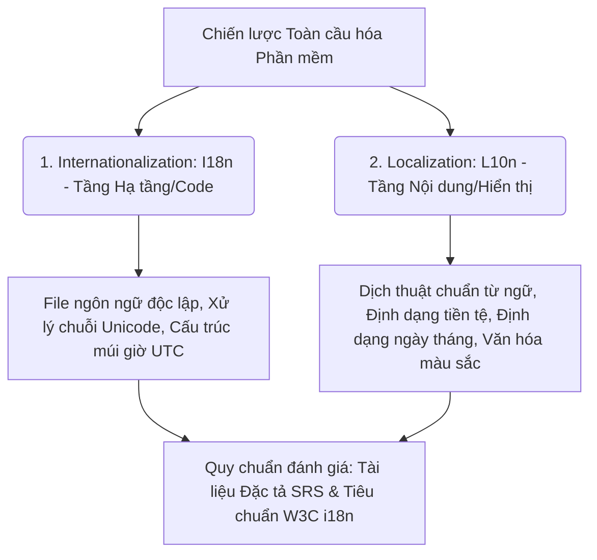

# 📁 03. Manual Testing

*Mục tiêu: Làm chủ quy trình, phân tích tài liệu đặc tả hệ thống chuyên sâu, thực thi kiểm thử thủ công và xây dựng hệ thống tài liệu (Artifacts) chuẩn chỉnh của một Manual Tester.*

# **3.4. Non-functional Testing**

## 📌 Mục lục nội bộ (Chặng 03)

- [ ] [**3.1. Requirements Analysis**](./1_Requirements.md)
- [ ] [**3.2. Test Artifacts**](./2_Artifacts.md)
- [ ] [**3.3. Functional Testing Levels & Types**](./3_FunctionalTesting.md)
- [ ] [**3.4. Non-functional Testing**](./4_NonFunctionalTesting.md)
  - [ ] [3.4.1. Compatibility Testing](#341-compatibility-testing)
  - [ ] [3.4.2. Usability & Accessibility Testing](#342-usability--accessibility-testing)
  - [ ] [3.4.3. Localization & Internationalization (L10n/I18n)](#343-localization--internationalization)

---

## 🗺️ Bản đồ các Tạo tác Kiểm thử (Test Artifacts) của Manual Tester

Trước khi đi vào bóc tách tài liệu đầu vào, bạn cần có cái nhìn tổng quan về các sản phẩm/tài liệu trung gian (Artifacts) do chính tay Manual Tester phải sản sinh ra trong suốt STLC:

# 3.4.1. Compatibility Testing

**Compatibility Testing (Kiểm thử Khả năng tương thích)** là một hình thức kiểm thử phi chức năng (`Non-functional Testing`) nhằm xác thực xem một ứng dụng phần mềm có khả năng vận hành ổn định, hiển thị chính xác đồ họa và chạy đúng logic nghiệp vụ trên nhiều môi trường phần cứng, phần mềm, cấu hình mạng hoặc thiết bị khác nhau hay không.

Đối với một Manual Tester, kiểm thử khả năng tương thích giúp loại bỏ triệt để lỗi kinh điển: *"Sản phẩm chạy rất tốt trên máy tính của Developer và Tester, nhưng khi khách hàng tải về điện thoại cá nhân của họ thì giao diện bị vỡ nát hoặc tính năng bị đóng băng"*.

## 📊 Mô hình Ma trận Phân nhánh Môi trường Tương thích

Quy trình kiểm thử đòi hỏi Tester phải bao phủ cấu trúc ứng dụng trên hai nhánh môi trường cốt lõi:

---

## 🛠️ Ma trận Kỹ thuật Thực chiến trong Compatibility Testing

Để thực hiện kiểm thử khả năng tương thích một cách hệ thống, Kỹ sư QA bắt buộc phải che phủ đủ 3 nhóm nội dung cốt lõi sau:

### 1. Cross-Browser Testing (Kiểm thử tương thích chéo Trình duyệt)
* **Đối tượng:** Các ứng dụng chạy trên nền tảng Web (`Web Applications`).
* **Hành động của QA:** Tester sử dụng các công cụ bổ trợ hoặc chạy thủ công để mở trang web trên các nhân trình duyệt khác nhau: **Blink** (Chrome, Edge, Opera), **Gecko** (Firefox), và **WebKit** (Safari trên macOS/iOS).
* **Yếu tố kiểm tra:** Kiểm tra xem các thuộc tính CSS, mã JavaScript có bị lỗi font, lệch dòng, vỡ khung hiển thị đồ họa hoặc liệt nút bấm ở trình duyệt này so với trình duyệt khác hay không.

### 2. Cross-Platform / Cross-Device Testing (Kiểm thử chéo Thiết bị và Hệ điều hành)
* **Đối tượng:** Các ứng dụng di động (`Mobile Apps`) hoặc Web đa nền tảng.
* **Hành động của QA:** Thiết lập ma trận thiết bị (`Device Matrix`) dựa trên số liệu phân tích tệp khách hàng của dự án. 
* **Yếu tố kiểm tra:** 
  * *Hệ điều hành:* Test đồng thời trên **Android** (Samsung, Xiaomi, Oppo với các phiên bản Android 12, 13, 14) và **iOS** (các phiên bản iOS 16, 17, 18).
  * *Kích thước màn hình (Responsive):* Kiểm tra độ co giãn giao diện trên màn hình nhỏ (iPhone SE), màn hình lớn (Pro Max), màn hình có "tai thỏ / viên thuốc" (`Dynamic Island`), và máy tính bảng (`Tablet/iPad`).

### 3. Backward Compatibility Testing (Kiểm thử tương thích ngược)
* **Bản chất:** Xác thực xem phiên bản phần mềm mới vừa phát hành có khả năng đọc, xử lý mượt mà dữ liệu, tệp tin được tạo ra từ các phiên bản cũ trước đó hay không; hoặc ứng dụng mới có chạy được trên các hệ điều hành đời cũ không.
* *Ví dụ:* Bản cập nhật app v2.0 phải mở và xem lại được lịch sử giao dịch mà người dùng đã thực hiện từ năm ngoái khi họ còn ở bản v1.0.

---

## 🧠 Giải pháp Kỹ thuật cho QA khi thiếu hụt Thiết bị Máy thật

Trong thực tế dự án, doanh nghiệp không thể mua hàng trăm chiếc điện thoại đủ các đời để giao cho Tester. Để giải quyết bài toán này, QA áp dụng linh hoạt 3 giải pháp hạ tầng sau:

1. **Emulators / Simulators (Trình giả lập):** Sử dụng các phần mềm giả lập phần cứng trên máy tính (như Android Studio Emulator, Xcode Simulator). Giải pháp này miễn phí, thực hiện nhanh nhưng độ chính xác về hiệu năng và thao tác vuốt chạm vuốt cảm ứng không thể bằng máy thật.
2. **Cloud-based Device Labs (Kho thiết bị điện toán đám mây):** Sử dụng các dịch vụ trả phí cao cấp như BrowserStack, Saucelabs, Lambdatest. Các nền tảng này cung cấp cho Tester quyền điều khiển từ xa (`Remote Control`) hàng ngàn chiếc điện thoại máy thật cắm trong các trung tâm dữ liệu toàn cầu thông qua giao diện Web. Đây là tiêu chuẩn vàng của các dự án Product quy mô lớn.
3. **Real Devices (Máy thật cốt lõi):** Giữ lại tối thiểu 2-3 chiếc điện thoại máy thật đại diện cho hai thái cực: 1 máy cấu hình cao nhất, màn hình mới nhất và 1 máy cấu hình yếu nhất, hệ điều hành cổ nhất nằm trong phạm vi tài liệu `DoR` cho phép để thực hiện chạy các bài test sinh tử cốt lõi.

> ⚠️ **Tư duy chuyên gia cần nhớ:**
> Đừng cố gắng test ứng dụng trên tất cả các loại thiết bị tồn tại trên thế giới, điều đó vi phạm nguyên lý số 2 của ISTQB: *Exhaustive testing is impossible*. Hãy áp dụng tư duy **Kiểm thử dựa trên rủi ro (`Risk-based Testing`)**. Hãy yêu cầu bộ phận sản phẩm trích xuất dữ liệu Google Analytics của ứng dụng để biết chính xác 80% tập khách hàng của công ty đang dùng dòng điện thoại gì, trình duyệt nào để dồn lực test sâu vào khu vực đó trước.

## 📚 References (Tài liệu tham khảo 3.4.1)
* [ISTQB® Certified Tester Foundation Level (CTFL) Syllabus v4.0](https://istqb.org) - Section 2.3.2: *Non-functional Testing (Compatibility Testing).*
* [ISO/IEC 25010:2011 Standard](https://iso.org) - *Systems and software engineering — Systems and software Quality Requirements and Evaluation (SQuaRE) — System and software quality models.*

# 3.4.2. Usability & Accessibility Testing

Trong kiểm thử phi chức năng (`Non-functional Testing`), **Usability Testing (Kiểm thử tính dễ sử dụng)** và **Accessibility Testing (Kiểm thử khả năng tiếp cận)** là bộ đôi chốt chặn bảo vệ trải nghiệm của người dùng cuối. Hoạt động này giúp đảm bảo phần mềm không chỉ chạy đúng dòng lệnh, mà còn phải dễ học, dễ dùng, mang lại sự hài lòng tối đa và có thể tiếp cận được bởi tất cả mọi người, bao gồm cả những người dùng khuyết tật hoặc gặp hạn chế về mặt thể chất.

Thực hiện tốt bộ đôi kiểm thử này giúp Tester khắc phục hoàn toàn sai lầm mang tính nguyên lý số 7 của ISTQB: **Absence-of-errors fallacy** (Hệ thống sạch lỗi kỹ thuật nhưng vẫn thất bại nếu nó quá đánh đố hành vi con người).

## 📊 Mô hình Phân nhánh Cấu trúc Trải nghiệm và Khả năng Tiếp cận

Quy trình đánh giá bóc tách tính thân thiện và tính công bằng của sản phẩm đối với tập khách hàng:

---

## 🛠️ Ma trận Kỹ thuật Thực chiến của QA

Để thực hiện kiểm thử tính dễ sử dụng và khả năng tiếp cận một cách khoa học, Manual Tester áp dụng bộ quy chuẩn định lượng có hệ thống dưới đây:

### 1. Usability Testing — Đánh giá qua mô hình 4 chỉ số chất lượng (Nielsen Framework)
Tester đóng vai là người dùng cuối (`User Perspective`), thực hiện các luồng nghiệp vụ cốt lõi để chấm điểm các khía cạnh:
* **Learnability (Độ dễ học):** Một người dùng mới mở app lên lần đầu tiên có thể tự mò mẫm ra cách thực hiện các thao tác cơ bản (Ví dụ: Thêm hàng vào giỏ) mà không cần đọc hướng dẫn sử dụng hay không? Bố cục thiết kế biểu tượng (`Icons`) có mang tính trực quan phổ thông không?
* **Efficiency (Hiệu suất thao tác):** Một khi đã quen thuộc với giao diện, người dùng mất bao nhiêu bước bấm nút để hoàn thành một giao dịch? QA cần rà soát để cắt giảm tối đa các popup, các bước nhập liệu rườm rà không cần thiết để tăng tốc độ trải nghiệm.
* **Memorability (Khả năng ghi nhớ):** Nếu người dùng không mở app trong vòng 3 tháng, khi quay lại, họ có nhớ ngay được cấu trúc thanh menu và luồng đi để sử dụng tiếp không, hay phải học lại từ đầu?
* **Error Prevention & Recovery (Phòng ngừa và Phục hồi lỗi):** Khi người dùng thao tác sai (Ví dụ: Nhập thiếu số điện thoại), hệ thống hiển thị thông báo lỗi có rõ ràng, mang tính chỉ dẫn không? Có cơ chế nút `Undo` (Hoàn tác) để cứu nguy cho họ khi lỡ tay xóa nhầm dữ liệu không?

### 2. Accessibility Testing — Kiểm tra theo tiêu chuẩn quốc tế WCAG 2.2
Xác thực phần mềm có thân thiện với người khuyết tật, người già hoặc người gặp chấn thương tạm thời hay không dựa trên 4 nguyên tắc cốt lõi:
* **Perceivable (Có thể cảm nhận):** Hệ thống có hỗ trợ người khiếm thị hay không? QA kiểm tra bằng cách bật trình đọc màn hình (`Screen Reader` như TalkBack trên Android, VoiceOver trên iOS) để xem máy có đọc lên thành tiếng nội dung của từng nút bấm hay không? Toàn bộ ảnh trên giao diện bắt buộc phải có thuộc tính mô tả chữ (`Alt-text`). Độ tương phản màu sắc giữa chữ và nền có đạt chuẩn không để người mắt kém dễ đọc.
* **Operable (Có thể vận hành):** Một người bị hỏng chuột hoặc bị run tay không thể dùng chuột, họ có thể dùng phím `Tab` trên bàn phím để di chuyển tuần tự và bấm `Enter` kích hoạt mọi tính năng trên trang Web được không?
* **Understandable (Có thể hiểu):** Ngôn ngữ viết trên giao diện phải đơn giản, rõ ràng, không dùng các thuật ngữ kỹ thuật đánh đố người dùng. Luồng đi của trang phải nhất quán.
* **Robust (Tính bền vững):** Mã nguồn HTML/CSS phải chuẩn hóa để các thiết bị hỗ trợ người khuyết tật (như bàn phím chữ nổi Braille chuyên dụng) có thể đọc hiểu cấu trúc ứng dụng một cách ổn định.

---

## 💡 Ví dụ thực tế: Thảm họa Usability và Lỗ hổng Accessibility

### Tình huống 1: Lỗi Usability (Tính dễ sử dụng)
* *Hành vi hệ thống:* Khi người dùng điền sai định dạng mã bưu điện ở cuối một biểu mẫu đăng ký dài 20 trường thông tin, hệ thống tự động tải lại toàn bộ trang (`Page Refresh`), xóa sạch sành sanh dữ liệu ở 19 trường còn lại và ép người dùng phải gõ lại từ đầu.
* *Đánh giá của QA:* Đây là một thảm họa về Usability gây ức chế cực độ cho người dùng. QA lập tức tạo một Bug nghiêm trọng, yêu cầu Dev giữ lại dữ liệu cũ và chỉ báo đỏ độc lập tại vị trí ô nhập sai.

### Tình huống 2: Lỗi Accessibility (Khả năng tiếp cận)
* *Hành vi hệ thống:* Nút "Xác nhận đặt hàng" chỉ hiển thị dưới dạng một tấm ảnh phẳng, hoàn toàn không có thuộc tính chữ Alt-text hay mã thẻ HTML `aria-label`.
* *Đánh giá của QA:* Một người mù sử dụng phần mềm đọc màn hình khi vuốt đến nút này, máy điện thoại sẽ chỉ đọc lên một từ vô nghĩa: *"Button"* hoặc *"Image_01"*. Khách hàng không thể biết đây là nút gì để bấm và buộc phải thoát ứng dụng. QA nâng cảnh báo lỗi bảo vệ tính công bằng, bắt Frontend bổ sung cấu trúc nhãn chữ cho phần tử.

> ⚠️ **Tư duy chuyên gia cần nhớ:**
> Thiết kế một sản phẩm đẹp không phải là việc của Tester, nhưng **bảo vệ trải nghiệm tiện ích và tính nhân văn của sản phẩm** là trách nhiệm tối cao của một kỹ sư QA. Hãy luôn giữ tư duy làm chủ chất lượng toàn diện (`Quality Ownership`). Việc bạn lên tiếng cải tiến một luồng đi rườm rà hay ép Dev bổ sung nhãn đọc cho người khiếm thị chính là cách bạn gia tăng giá trị kinh doanh cho doanh nghiệp và giữ chân hàng triệu khách hàng trung thành ở lại với sản phẩm.

## 📚 References (Tài liệu tham khảo 3.4.2)
* [W3C - Web Content Accessibility Guidelines (WCAG) 2.2 Official Specification](https://w3.org) - Tiêu chuẩn thế giới về kỹ thuật kiểm thử khả năng tiếp cận.
* **Jakob Nielsen (1993)** - *Usability Engineering*, Morgan Kaufmann.
* [ISTQB® Certified Tester Foundation Level (CTFL) Syllabus v4.0](https://istqb.org) - Section 2.3.2: *Non-functional Testing (Usability and Accessibility Testing).*

# 3.4.3. Localization & Internationalization (L10n/I18n)

Trong kiểm thử phi chức năng (`Non-functional Testing`), **Internationalization (I18n - Quốc tế hóa)** và **Localization (L10n - Bản địa hóa)** là bộ đôi chiến lược kỹ thuật bắt buộc phải kiểm tra đối với các sản phẩm phần mềm có định hướng phục vụ đa quốc gia hoặc mở rộng quy mô kinh doanh ra thị trường toàn cầu.

Người mới bắt đầu thường gộp chung hai khái niệm này, nhưng dưới lăng kính của QA, chúng nằm ở hai tầng xử lý hoàn toàn khác biệt:
* **Internationalization (I18n):** Khâu thiết kế kiến trúc kỹ thuật ngầm phía dưới giúp phần mềm **có khả năng** thích ứng với nhiều ngôn ngữ và nền văn hóa khác nhau mà không cần phải đập đi sửa code lại từ đầu.
* **Localization (L10n):** Khâu dịch thuật, tùy biến nội dung và định dạng thực tế cho **một thị trường quốc gia cụ thể** (đưa ngôn ngữ, tiền tệ, múi giờ thật của vùng đó vào giao diện).

## 📊 Mô hình Phân tách Kiến trúc Kỹ thuật I18n và Trải nghiệm Thực tế L10n

Quy trình kiểm thử đòi hỏi Tester phải kiểm soát song hành cả hạ tầng mã nguồn lẫn tính chính xác của dữ liệu hiển thị theo vùng miền:

---

## 🛠️ Ma trận Kỹ thuật Thực chiến của QA trong Kiểm thử L10n & I18n

Để thực hiện kiểm thử đa ngôn ngữ và đa vùng miền một cách khoa học, Manual Tester bắt buộc phải che phủ đủ 4 nhóm nội dung cốt lõi sau:

### 1. Kiểm thử văn bản và Tràn vỡ Giao diện (UI Text & Layout Check)
Đây là lỗi phổ biến nhất trong các dự án làm đa ngôn ngữ. 
* **Lỗi độ dài chuỗi ký tự (Text Expansion Error):** Tiếng Anh thường rất ngắn, nhưng khi dịch sang tiếng Đức, tiếng Pháp hoặc tiếng Việt, độ dài câu chữ sẽ tăng lên từ 30% đến 100%. *Ví dụ:* Từ "Save" (4 chữ) đổi sang tiếng Việt là "Lưu thay đổi" (11 chữ). QA phải kiểm tra xem khi chuyển đổi ngôn ngữ, các chuỗi chữ dài này có làm tràn khung (`Text Overflow`), che khuất các phần tử khác hoặc làm méo mó, vỡ nát bố cục thiết kế giao diện (`UI Layout`) hay không.
* **Xử lý chuỗi ký tự đặc biệt:** Đảm bảo hệ thống hỗ trợ tốt bảng mã **UTF-8 / Unicode**. Nhập thử tên có dấu tiếng Việt, chữ tượng hình tiếng Trung/Nhật/Hàn vào hệ thống để kiểm tra xem Database có bị lỗi hiển thị thành các ô vuông vô nghĩa hay dấu hỏi chấm (`???`) hay không.

### 2. Kiểm thử định dạng Dữ liệu đặc thù (Data Formatting Testing)
Mỗi quốc gia có một quy ước viết số và biểu diễn thời gian riêng biệt. QA phải bắt lỗi nếu hệ thống không đồng bộ:
* **Định dạng Ngày/Giờ (Date & Time Format):** Thị trường Mỹ dùng `MM/DD/YYYY`, thị trường Việt Nam dùng `DD/MM/YYYY`, thị trường Nhật dùng `YYYY/MM/DD`. Hệ thống phải tự động đảo cấu trúc hiển thị tương ứng khi người dùng đổi vùng miền.
* **Định dạng Số và Tiền tệ (Currency & Number Format):** Mỹ dùng dấu phẩy làm chốt ngăn cách hàng ngàn, dấu chấm cho thập phân (`$1,250.50`). Việt Nam ngược lại (`1.250,50 đ`). QA kiểm tra xem logic tính toán và hiển thị hóa đơn có bị nhảy loạn hoặc hiểu sai giá trị số hay không.

### 3. Kiểm thử tính thích ứng Múi giờ (Timezone & Localization Logic)
* **Bản chất:** Kiểm tra tính đồng bộ thời gian của hệ thống khi người dùng ở các quốc gia khác nhau cùng tương tác.
* *Kịch bản test thực chiến:* Một ứng dụng đặt vé máy bay. Máy chủ đặt tại Singapore (múi giờ UTC+8), khách hàng ở Việt Nam (múi giờ UTC+7) bấm đặt vé lúc 23:30 đêm ngày 01/09. QA phải kiểm tra xem trong Database và email xác nhận gửi về cho khách hàng hiển thị đúng giờ Việt Nam (23:30 ngày 01/09) hay bị nhảy sang ngày hôm sau của giờ Singapore (00:30 ngày 02/09), gây hoang mang cho người dùng.

### 4. Kiểm thử tính Phù hợp Văn hóa (Cultural & Regulatory Appropriateness)
* **Từ ngữ địa phương:** Kiểm tra xem bản dịch có bị thô cứng, ngô nghê do dùng Google Dịch hay không. Từ ngữ phải phù hợp với văn hóa giao tiếp bản địa.
* **Quy định pháp lý địa phương:** Đảm bảo hệ thống tuân thủ luật bảo mật dữ liệu của từng vùng (Ví dụ: Nếu app phát hành tại Châu Âu, bắt buộc phải có popup xin quyền thu thập dữ liệu theo chuẩn luật GDPR. Nếu phát hành app tại Việt Nam, phải tuân thủ Luật An ninh mạng).

---

## 💡 Ví dụ thực tế: Thảm họa I18n/L10n làm Tê liệt Hệ thống

* **Bối cảnh lỗi:** Một ứng dụng tài chính của Việt Nam mở rộng sang thị trường các nước Ả Rập (vùng Trung Đông).
* **QA phát hiện chuỗi lỗi chí tử:**
  1. *Lỗi hướng viết chữ (Right-to-Left - RTL):* Tiếng Ả Rập viết từ phải sang trái, ngược hoàn toàn với tiếng Việt/tiếng Anh (Left-to-Right - LTR). Do kiến trúc hạ tầng thiết kế I18n ban đầu quá kém, khi đổi ngôn ngữ sang tiếng Ả Rập, toàn bộ bố cục thanh menu, nút bấm, và dấu mũi tên của app bị đứng im bên trái, chữ bị đảo lộn ngược ngạo không thể đọc được.
  2. *Lỗi hiển thị số:* Người dùng Ả Rập nhập số theo bộ ký tự riêng của họ (`٠, ١, ٢, ٣...`). Hệ thống Backend không hiểu bảng mã này, dẫn đến việc API báo lỗi `400 Bad Request` liên tục và làm sập luồng tính toán thanh toán tiền tệ của ứng dụng.

> ⚠️ **Tư duy chuyên gia cần nhớ:**
> Kiểm thử L10n & I18n không phải là việc Tester ngồi kiểm tra lỗi chính tả của phiên dịch viên. Đây là bài kiểm tra về **năng lực thích ứng toàn cầu của sản phẩm**. Một Chuyên gia QA thực thụ luôn yêu cầu đội ngũ thiết kế hạ tầng I18n phải tách biệt hoàn toàn mã code xử lý tính năng ra khỏi các file chứa chuỗi chữ ngôn ngữ (Sử dụng các file cấu hình độc lập như `.json`, `.properties`). Việc làm sạch hạ tầng i18n từ sớm chính là tấm khiên vững chắc giúp doanh nghiệp dễ dàng mở rộng thị trường sang bất kỳ quốc gia nào chỉ trong vòng vài ngày mà không sợ rủi ro hỏng hóc mã nguồn.

## 📚 References (Tài liệu tham khảo 3.4.3)
* [W3C - Internationalization (i18n) Standards and Activity](https://w3.org) - Quy chuẩn và tiêu chuẩn quốc tế về xây dựng phần mềm thích ứng đa quốc gia của tổ chức thế giới W3C.
* [ISO/IEC 25010:2011 Standard](https://iso.org) - *Systems and software engineering — SQuaRE — Product quality model (Đặc tính phi chức năng về tính Thích ứng văn hóa và Bản địa hóa).*
* [ISTQB® Certified Tester Foundation Level (CTFL) Syllabus v4.0](https://istqb.org) - Section 2.3.2: *Non-functional Testing (Localization Testing).*
