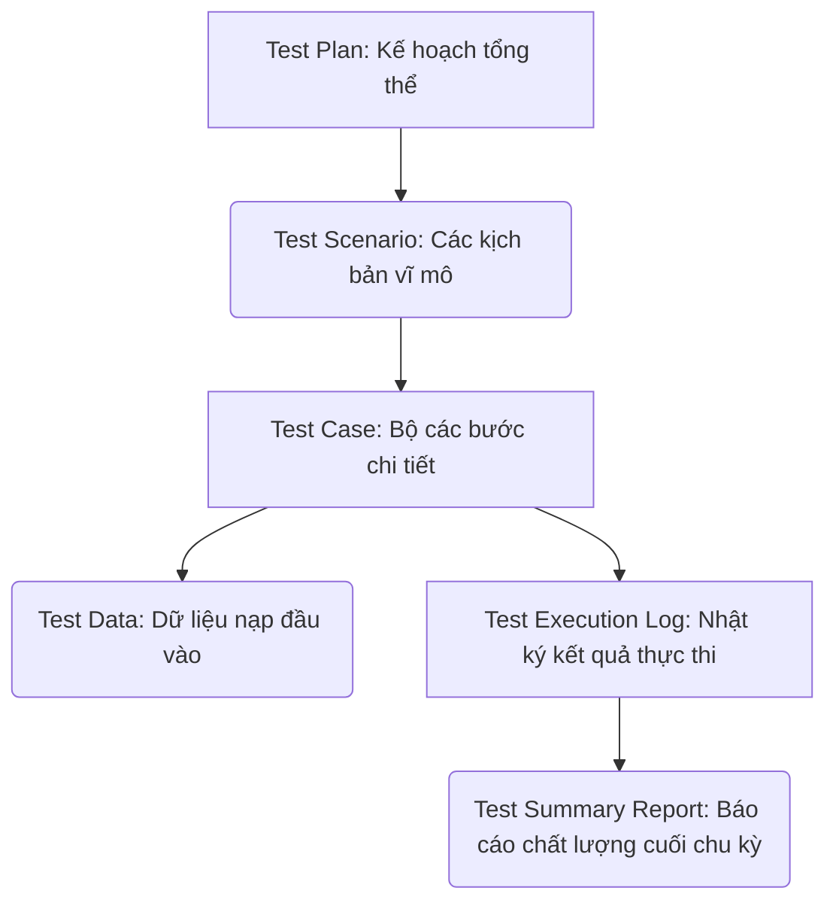

# 📁 03. Manual Testing

*Mục tiêu: Làm chủ quy trình, phân tích tài liệu đặc tả hệ thống chuyên sâu, thực thi kiểm thử thủ công và xây dựng hệ thống tài liệu (Artifacts) chuẩn chỉnh của một Manual Tester.*

## 📌 Mục lục nội bộ (Chặng 03)

- [ ] [**3.1. Requirements Analysis**](./1_Requirements.md)
  - [ ] [3.1.1. SRS (Software Requirement Specification)](./1_Requirements.md#311-srs)
  - [ ] [3.1.2. BRD (Business Requirement Document)](./1_Requirements.md#312-brd)
  - [ ] [3.1.3. User Story & AC Review](./1_Requirements.md#313-user-story--ac-review)
  - [ ] [3.1.4. Mockup / Wireframe Analysis](./1_Requirements.md#314-mockup--wireframe-analysis)
  - [ ] [3.1.5. API Documentation Review](./1_Requirements.md#315-api-documentation-review)
- [ ] [**3.2. Test Artifacts**](./2_Artifacts.md)
  - [ ] [3.2.1. Test Scenario](./2_Artifacts.md#321-test-scenario)
  - [ ] [3.2.2. Test Case & Test Suite](./2_Artifacts.md#322-test-case--test-suite)
  - [ ] [3.2.3. Test Data Management](./2_Artifacts.md#323-test-data-management)
  - [ ] [3.2.4. Test Plan Fundamentals](./2_Artifacts.md#324-test-plan-fundamentals)
  - [ ] [3.2.5. Test Execution & Result Logs](./2_Artifacts.md#325-test-execution--result-logs)
  - [ ] [3.2.6. Test Summary Report](./2_Artifacts.md#326-test-summary-report)
  - [ ] [3.2.7. RTM (Requirements Traceability Matrix)](./2_Artifacts.md#327-rtm)
- [ ] [**3.3. Functional Testing Levels & Types**](./3_FunctionalTesting.md)
  - [ ] [3.3.1. Functional Testing Overview](./3_FunctionalTesting.md#331-functional-testing-overview)
  - [ ] [3.3.2. Smoke Testing vs Sanity Testing](./3_FunctionalTesting.md#332-smoke-testing-vs-sanity-testing)
  - [ ] [3.3.3. Retesting vs Regression Testing](./3_FunctionalTesting.md#333-retesting-vs-regression-testing)
  - [ ] [3.3.4. System Testing](./3_FunctionalTesting.md#334-system-testing)
  - [ ] [3.3.5. End-to-End (E2E) Testing](./3_FunctionalTesting.md#335-end-to-end-e2e-testing)
  - [ ] [3.3.6. UAT (User Acceptance Testing)](./3_FunctionalTesting.md#336-uat)
- [ ] [**3.4. Non-functional Testing**](./4_NonFunctionalTesting.md)
  - [ ] [3.4.1. Compatibility Testing](./4_NonFunctionalTesting.md#341-compatibility-testing)
  - [ ] [3.4.2. Usability & Accessibility Testing](./4_NonFunctionalTesting.md#342-usability--accessibility-testing)
  - [ ] [3.4.3. Localization & Internationalization (L10n/I18n)](./4_NonFunctionalTesting.md#343-localization--internationalization)

---

## 🗺️ Bản đồ các Tạo tác Kiểm thử (Test Artifacts) của Manual Tester

Trước khi đi vào bóc tách tài liệu đầu vào, bạn cần có cái nhìn tổng quan về các sản phẩm/tài liệu trung gian (Artifacts) do chính tay Manual Tester phải sản sinh ra trong suốt STLC:

