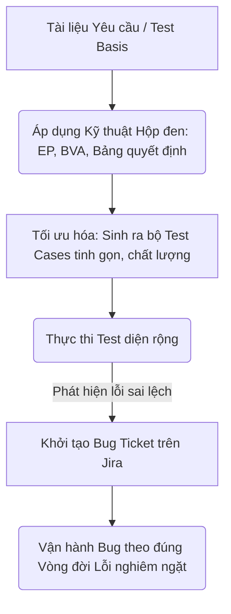
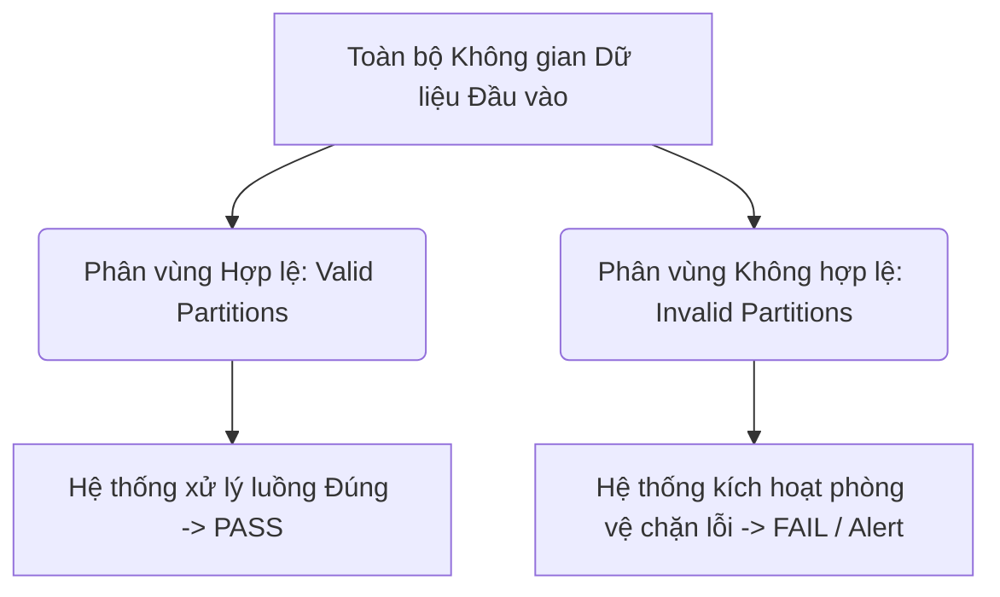
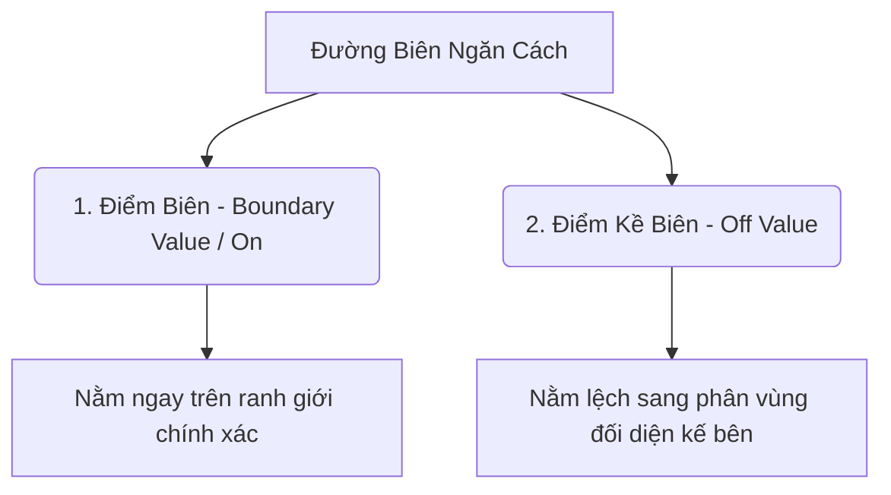
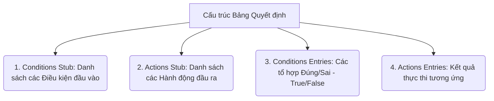
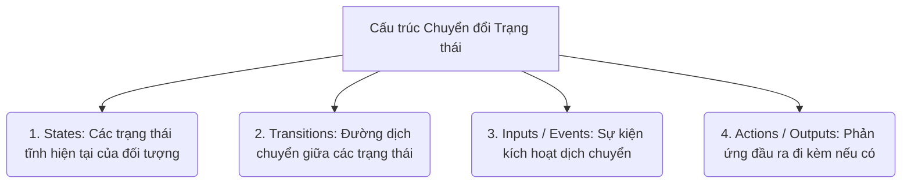
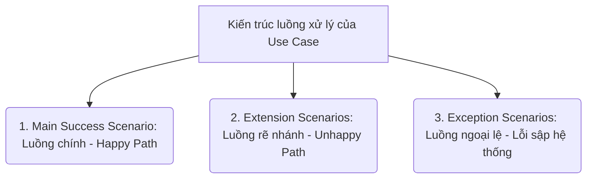
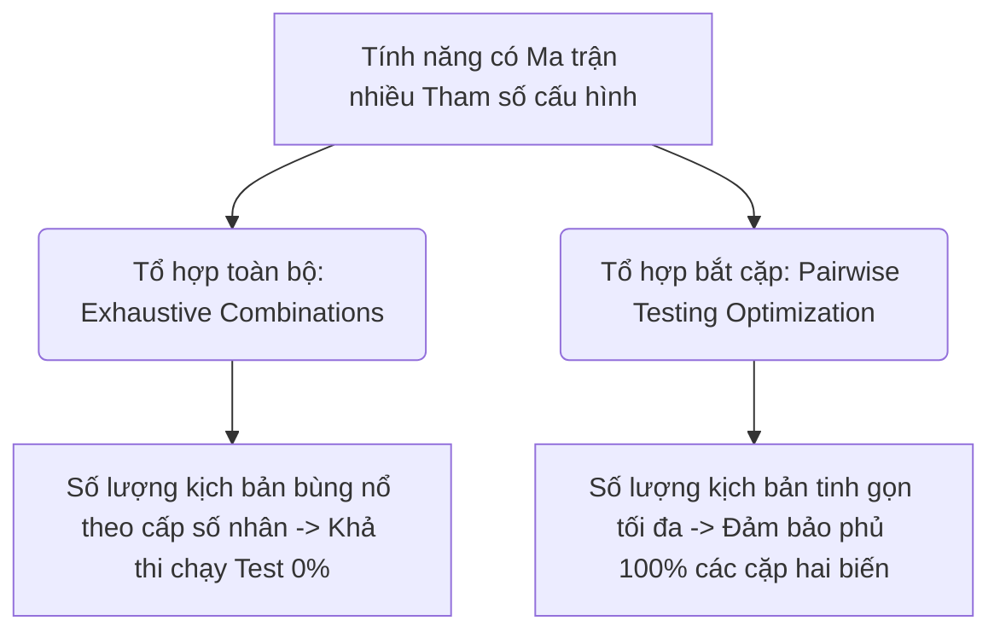

# 📁 04. Test Design & Bug Management

*Mục tiêu: Áp dụng các kỹ thuật tư duy toán học và logic để tối ưu hóa số lượng kịch bản kiểm thử, đồng thời làm chủ vòng đời của lỗi và quy trình quản lý Bug chuyên nghiệp.*

# **4.1. Black-box Test Design Techniques**

## 📌 Mục lục nội bộ (Chặng 04)

- [ ] [**4.1. Black-box Test Design Techniques**](./1_DesignTechniques.md)
  - [ ] [4.1.1. Equivalence Partitioning (EP)](#411-equivalence-partitioning-ep)
  - [ ] [4.1.2. Boundary Value Analysis (BVA)](#412-boundary-value-analysis-bva)
  - [ ] [4.1.3. Decision Table Testing](#413-decision-table-testing)
  - [ ] [4.1.4. State Transition Testing](#414-state-transition-testing)
  - [ ] [4.1.5. Use Case Testing](#415-use-case-testing)
  - [ ] [4.1.6. Pairwise / Orthogonal Array Testing](#416-pairwise-testing)
- [ ] [**4.2. Experience-based Test Techniques**](./2_ExperienceTechniques.md)
- [ ] [**4.3. White-box Concepts**](./3_WhiteBoxConcepts.md)
- [ ] [**4.4. Bug Management & Lifecycle**](./4_BugManagement.md)

---

## 🗺️ Bản đồ Tiến trình Từ Kỹ thuật Toán học đến Quản lý Lỗi

Sơ đồ dưới đây mô tả cách Tester áp dụng các kỹ thuật logic để bóp nghẹt số lượng ca test nhưng vẫn săn lùng Bug và quản lý chúng một cách có hệ thống:



---

# 4.1.1. Equivalence Partitioning (EP)

**Equivalence Partitioning (EP - Phân vùng tương đương)** là một kỹ thuật thiết kế kịch bản kiểm thử hộp đen (`Black-box Test Design Technique`) dựa trên tư duy toán học. Kỹ thuật này hoạt động bằng cách **chia nhỏ toàn bộ không gian dữ liệu đầu vào của một tính năng thành các phân vùng (nhóm) dữ liệu tương đương nhau**.

Nguyên lý cốt lõi của EP quy định: **Tất cả các giá trị dữ liệu nằm trong cùng một phân vùng sẽ khiến hệ thống xử lý theo một logic và trả ra kết quả y hệt nhau**. Do đó, thay vì test mù quáng hàng vạn giá trị gây lãng phí nguồn lực, Tester chỉ cần đại diện chọn lấy **duy nhất một giá trị** trong mỗi phân vùng để đại diện chạy bài test. Nếu giá trị đại diện đó `PASS`, toàn bộ các giá trị khác trong nhóm được coi là `PASS`. Nếu giá trị đó `FAIL`, toàn bộ vùng đó bị coi là lỗi.

Kỹ thuật này hiện thực hóa trực tiếp nguyên lý số 2 của ISTQB: **Exhaustive testing is impossible** (Kiểm thử toàn bộ là bất khả thi).

## 📊 Mô hình Phân rã Không gian Dữ liệu của Phân vùng Tương đương

Toàn bộ dữ liệu đầu vào bắt buộc phải được bóc tách thành các phân vùng hợp lệ và không hợp lệ tách biệt:



---

## 🛠️ Ma trận Khái niệm: Valid Partitions vs Invalid Partitions

Để thiết kế kịch bản chuẩn xác, Tester bắt buộc phải phân tách rõ hai trạng thái phân vùng toán học sau:

### 1. Phân vùng Hợp lệ (Valid Partitions)
* **Bản chất:** Chứa các giá trị dữ liệu đúng quy chuẩn, được hệ thống chấp nhận xử lý theo luồng nghiệp vụ thông thường (`Happy Path`).
* **Hành động của QA:** Chọn 1 giá trị nằm giữa phân vùng này. Kết quả mong đợi bắt buộc phải là hệ thống thực hiện chức năng thành công.

### 2. Phân vùng Không hợp lệ (Invalid Partitions)
* **Bản chất:** Chứa các giá trị dữ liệu sai định dạng, nằm ngoài ranh giới quy định, bị hệ thống từ chối xử lý (`Unhappy Path`).
* **Hành động của QA:** Thiết lập các phân vùng cho dữ liệu quá nhỏ, dữ liệu quá lớn, sai kiểu dữ liệu (gõ chữ vào ô số, nhập ký tự đặc biệt). Chọn 1 giá trị đại diện cho mỗi nhóm không hợp lệ này. Kết quả mong đợi bắt buộc phải là hệ thống kích hoạt cơ chế phòng vệ, chặn đứng hành động và hiển thị thông báo lỗi chỉ dẫn tương ứng.

---

## 💡 Ví dụ thực chiến bóc tách kịch bản: Ô nhập số tuổi để đăng ký lái xe

* **Yêu cầu tài liệu (Test Basis):** *"Ô nhập tuổi chỉ chấp nhận số nguyên, người dùng phải từ 18 tuổi đến 60 tuổi mới được phép đăng ký"*.
* **QA tiến hành bóc tách phân vùng tương đương bằng toán học:**

| Loại phân vùng | Phạm vi toán học | Giá trị đại diện chọn Test | Kết quả mong đợi (Expected Result) |
| :--- | :--- | :--- | :--- |
| **Phân vùng Không hợp lệ 1** | Tuổi nhỏ hơn 18 (`tuổi < 18`) | `12` | Hệ thống chặn lại, báo lỗi: *"Tuổi chưa đủ điều kiện"* |
| **Phân vùng Hợp lệ 2** | Tuổi từ 18 đến 60 (`18 <= tuổi <= 60`) | `35` | Hệ thống chấp nhận, chuyển sang bước tiếp theo |
| **Phân vùng Không hợp lệ 3** | Tuổi lớn hơn 60 (`tuổi > 60`) | `72` | Hệ thống chặn lại, báo lỗi: *"Vượt quá độ tuổi quy định"* |
| **Phân vùng Không hợp lệ 4** | Sai kiểu dữ liệu (Ký tự chữ) | `abc` | Hệ thống chặn không cho gõ hoặc báo lỗi sai định dạng số |
| **Phân vùng Không hợp lệ 5** | Giá trị rỗng (Bỏ trống) | *Để trống* | Hệ thống báo lỗi trường bắt buộc không được để trống |

### 📊 Phân tích hiệu suất tối ưu hóa của EP:
* Nếu test thủ công từng số từ 1 đến 100 và các ký tự đặc biệt, Tester mất hàng trăm ca test vô ích.
* Áp dụng kỹ thuật EP, Tester chỉ cần viết chính xác **5 Test Cases** tương ứng với 5 giá trị đại diện ở bảng trên mà vẫn đảm bảo phủ kín 100% logic xử lý của mã nguồn.

> ⚠️ **Tư duy chuyên gia cần nhớ:**
> Phân vùng tương đương (EP) là kỹ thuật áp dụng cho **tất cả các loại dữ liệu đầu vào**, từ ô nhập số, chuỗi văn bản, hộp chọn Dropdown, cho đến các dữ liệu truyền ngầm qua API Request Body. Một lỗi phổ biến của Tester tập sự là chỉ viết kịch bản cho một phân vùng không hợp lệ rồi dừng lại. Nếu hệ thống có nhiều cách để nhập sai dữ liệu (nhập số quá lớn, nhập chữ, nhập ký tự đặc biệt), bạn bắt buộc phải tạo ra **các phân vùng không hợp lệ độc lập riêng biệt** cho từng loại sai sót đó, vì mã nguồn Backend xử lý các lỗi này ở các nhánh câu lệnh `if-else` hoàn toàn khác nhau.

## 📚 References (Tài liệu tham khảo 4.1.1)
* [ISTQB® Certified Tester Foundation Level (CTFL) Syllabus v4.0](https://istqb.org) - Section 4.2.1: *Equivalence Partitioning.*
* [ISO/IEC/IEEE 29119-4:2021 Standard](https://iso.org) - *Software and systems engineering — Software testing — Part 4: Test techniques.*

# 4.1.2. Boundary Value Analysis (BVA)

**Boundary Value Analysis (BVA - Phân tích giá trị biên)** là một kỹ thuật thiết kế kịch bản kiểm thử hộp đen (`Black-box Test Design Technique`) bổ trợ và đi liền với Phân vùng tương đương (EP). Thay vì chọn một giá trị bất kỳ nằm giữa phân vùng, BVA tập trung dồn toàn bộ lực lượng kiểm thử vào các **điểm chạm ranh giới, vùng biên nhạy cảm** ngăn cách giữa các phân vùng dữ liệu.

Cơ sở khoa học của BVA dựa trên thực tế vận hành: **Lập trình viên khi viết các câu lệnh điều kiện logic (`if-else`, `while`) thường có xác suất phạm sai sót cao nhất tại các dấu so sánh toán học** (Ví dụ: Viết nhầm dấu lớn hơn `>` thành lớn hơn hoặc bằng `>=`, viết thiếu dấu bằng `=`). Săn lùng các lỗi biên chính là cách nhanh nhất để Tester phá hủy hệ thống và lùng ra các Bug logic ẩn sâu dưới mã nguồn.

## 📊 Mô hình Phân tách Điểm Biên Toán học (2-Point Boundary)

Mỗi đường biên ngăn cách giữa hai phân vùng sẽ sinh ra chính xác 2 điểm kiểm thử nằm sát vách nhau:



---

## 🛠️ Ma trận Kỹ thuật: 2-Point Boundary vs 3-Point Boundary

Tùy thuộc vào độ phức tạp của hệ thống và yêu cầu của Test Plan, Tester chuyên nghiệp sẽ áp dụng một trong hai kỹ thuật bóc tách điểm biên sau theo tiêu chuẩn ISTQB:

### 1. Kỹ thuật Biên 2 điểm (2-Point Boundary v4.0 Standard)
* **Bản chất:** Với mỗi đường biên, Tester chỉ lấy đúng 2 điểm chạm: Điểm nằm **Ngay trên biên (`On`)** và Điểm nằm **Kề sát biên thuộc phân vùng đối diện (`Off`)**.
* **Ưu điểm:** Tối ưu hóa tối đa số lượng Test Case, giảm thời gian thực thi nhưng vẫn quét sạch các lỗi viết nhầm dấu so sánh của Dev.

### 2. Kỹ thuật Biên 3 điểm (3-Point Boundary)
* **Bản chất:** Với mỗi đường biên, Tester lấy đủ 3 điểm chạm liên hoàn: Điểm nằm **Kề trước biên (`In`)**, Điểm nằm **Ngay trên biên (`On`)**, và Điểm nằm **Kề sau biên (`Out`)**.
* **Áp dụng:** Sử dụng cho các hệ thống sinh tử cần độ chính xác toán học tuyệt đối (như app Ngân hàng, Y tế, Điều khiển tên lửa) hoặc khi tài liệu đặc tả viết quá mơ hồ.

---

## 💡 Ví dụ thực chiến liên hoàn: Ô nhập số lượng sản phẩm mua tối đa

* **Yêu cầu tài liệu (Test Basis):** *"Hệ thống cho phép mua số lượng từ 1 đến 5 sản phẩm cho mỗi đơn hàng"*.
* **QA bóc tách ma trận biên áp dụng kỹ thuật 2-Point Boundary (Tiêu chuẩn ISTQB v4.0):**
  * Hệ thống có hai đường biên sinh tử là: Biên **1** và Biên **5**.

```markdown
Phân vùng Invalid 1 (Nhỏ)   │        Phân vùng Valid 2 (Chuẩn)       │   Phân vùng Invalid 3 (Lớn)
  ... -1, 0                 │               1, 2, 3, 4, 5            │     6, 7, 8 ...
────────────────────────────┼────────────────────────────────────────┼─────────────────────────────
                       [0]  │  [1]                              [5]  │  [6]
                       Off  │   On                              On   │  Off
```

### Bảng Ma trận Kịch bản Biên (2-Point BVA Matrix):

| Điểm chạm | Giá trị số cụ thể | Phân loại phân vùng | Kết quả mong đợi (Expected Result) |
| :--- | :--- | :--- | :--- |
| **Biên dưới - On** | `1` | Valid Partition | Hệ thống chấp nhận, chuyển sang bước thanh toán. |
| **Biên dưới - Off** | `0` | Invalid Partition 1 | Hệ thống chặn, báo lỗi: *"Số lượng tối thiểu là 1"*. |
| **Biên trên - On** | `5` | Valid Partition | Hệ thống chấp nhận, chuyển sang bước thanh toán. |
| **Biên trên - Off** | `6` | Invalid Partition 3 | Hệ thống chặn, báo lỗi: *"Số lượng tối đa là 5"*. |

> ⚠️ **Tư duy chuyên gia cần nhớ:**
> Boundary Value Analysis không chỉ áp dụng cho dữ liệu kiểu số (Numeric), mà còn áp dụng cực kỳ mạnh mẽ cho **Dữ liệu kiểu chuỗi ký tự (String Length)**. 
> *Ví dụ:* Nếu ô nhập mật khẩu quy định từ 8-16 ký tự, Tester bắt buộc phải chạy kịch bản biên cho độ dài chuỗi: Nhập chuỗi dài đúng 8 ký tự (On - Pass), nhập chuỗi dài đúng 7 ký tự (Off - Chặn lỗi), nhập chuỗi dài đúng 16 ký tự (On - Pass), và nhập chuỗi dài đúng 17 ký tự (Off - Chặn lỗi). Việc bỏ quên kiểm tra biên chuỗi ký tự là nguyên nhân hàng đầu dẫn đến tình trạng vỡ giao diện UI hoặc lỗi tràn bộ đệm hệ thống.

## 📚 References (Tài liệu tham khảo 4.1.2)
* [ISTQB® Certified Tester Foundation Level (CTFL) Syllabus v4.0](https://istqb.org) - Section 4.2.2: *Boundary Value Analysis.*
* [ISO/IEC/IEEE 29119-4:2021 Standard](https://iso.org) - *Software and systems engineering — Software testing — Part 4: Test techniques.*

# 4.1.3. Decision Table Testing

**Decision Table Testing (Kiểm thử Bảng quyết định)** là một kỹ thuật thiết kế kịch bản kiểm thử hộp đen (`Black-box Test Design Technique`) dựa trên tư duy logic toán học. Kỹ thuật này hoạt động bằng cách lập ra một ma trận bảng biểu để **biểu diễn tất cả các tổ hợp điều kiện đầu vào và các hành động đầu ra tương ứng của hệ thống**.

Nếu kỹ thuật `EP` và `BVA` chủ yếu áp dụng cho các tham số dữ liệu độc lập đơn lẻ, thì Decision Table Testing là vũ khí tối cao được áp dụng khi **hệ thống có nhiều điều kiện logic phức tạp lồng chéo, phụ thuộc và tác động qua lại lẫn nhau để quyết định kết quả đầu ra**.

## 📊 Mô hình Cấu trúc 4 Phân vùng của một Bảng Quyết định

Một bảng quyết định tiêu chuẩn được chia tách nghiêm ngặt thành 4 góc phần tư logic:



---

## 🛠️ Ma trận Quy trình 4 bước Thiết lập Bảng Quyết định thực chiến

Để không bỏ sót kịch bản logic trong các hệ thống chằng chịt nhánh câu lệnh `if-else` lồng nhau, Tester tuân thủ quy trình thiết lập sau:

### Bước 1: Liệt kê các Điều kiện (Conditions) và Hành động (Actions)
* **Conditions (C):** Liệt kê tất cả các biến số, yếu tố đầu vào hoặc tiền điều kiện tác động đến logic hệ thống.
* **Actions (A):** Liệt kê tất cả các phản ứng, thông báo hoặc sự thay đổi trạng thái đầu ra có thể xảy ra của hệ thống.

### Bước 2: Tính toán Tổng số lượng Quy tắc Logic (Rules)
* Áp dụng công cụ toán học tổ hợp: Nếu mỗi điều kiện đầu vào chỉ có 2 trạng thái là Đúng (`True - T`) hoặc Sai (`False - F`), tổng số quy tắc logic (cột kịch bản) bắt buộc phải kiểm tra là: **$2^n$** (với $n$ là số lượng điều kiện).
* *Ví dụ:* Hệ thống có 3 điều kiện lồng nhau, tổng số lượng kịch bản tối thiểu cần kiểm tra là $2^3 = 8$ Rules.

### Bước 3: Điền ma trận True/False và Xác định Kết quả mong đợi
* Điền đầy đủ các tổ hợp `T/F` vào bảng để không bỏ sót bất kỳ một khả năng kết hợp nào ngoài đời thực.
* Đối chiếu trực tiếp với tài liệu đặc tả nghiệp vụ (`Test Basis`) để tích dấu (`X`) vào hành động đầu ra chính xác tương ứng cho từng cột Rule.

### Bước 4: Tối ưu hóa bảng và Chuyển hóa sang Test Case
* Áp dụng tư duy gộp phân vùng: Nếu một điều kiện nào đó chuyển đổi trạng thái từ `T` sang `F` nhưng **không làm thay đổi kết quả hành động đầu ra**, QA có quyền gộp hai cột đó lại và đánh dấu gạch ngang (`-`) – nghĩa là trường đó không cần quan tâm (`Don't Care`), giúp rút gọn số lượng ca test cần chạy.
* Mỗi cột Quy tắc (`Rule`) còn lại sau khi tối ưu hóa sẽ được chuyển đổi trực tiếp thành **1 Test Case chi tiết**.

---

## 💡 Ví dụ thực chiến: Logic "Duyệt hồ sơ Vay tiền tự động của app Bank"

* **Yêu cầu tài liệu (Test Basis):** *"Hệ thống duyệt vay tự động nếu khách hàng thỏa mãn: Có điểm tín dụng tốt, ĐỒNG THỜI phải có thu nhập ổn định HOẶC có tài sản thế chấp đạt chuẩn"*.
* **QA thiết lập Bảng Quyết định (đã áp dụng kỹ thuật rút gọn Don't Care):**

| Cấu trúc bảng | Thành phần logic | R1 | R2 | R3 | R4 |
| :--- | :--- | :---: | :---: | :---: | :---: |
| **Conditions (Điều kiện)** | **C1:** Điểm tín dụng tốt? | T | T | T | F |
| | **C2:** Thu nhập ổn định? | T | F | F | — |
| | **C3:** Có tài sản thế chấp? | — | T | F | — |
| **Actions (Hành động)** | **A1:** Phê duyệt cho Vay thành công (PASS) | **X** | **X** | | |
| | **A2:** Từ chối và Báo lỗi hệ thống (FAIL) | | | **X** | **X** |

### 📊 Phân tích luồng chuyển hóa từ Rule sang Test Case chi tiết:
* **Test Case 1 (Từ R1):** Người dùng có điểm tín dụng tốt (`T`), có thu nhập ổn định (`T`), không quan tâm tài sản -> Kết quả: **Duyệt vay thành công**.
* **Test Case 2 (Từ R2):** Người dùng có điểm tín dụng tốt (`T`), thu nhập không ổn định (`F`) nhưng có tài sản thế chấp (`T`) -> Kết quả: **Duyệt vay thành công**.
* **Test Case 3 (Từ R3):** Người dùng có điểm tín dụng tốt (`T`) nhưng thu nhập không ổn định (`F`) và không có tài sản (`F`) -> Kết quả: **Từ chối vay**.
* **Test Case 4 (Từ R4):** Người dùng có điểm tín dụng xấu (`F`), không quan tâm các yếu tố khác -> Kết quả: **Từ chối vay ngay lập tức**.

> ⚠️ **Tư duy chuyên gia cần nhớ:**
> Lập Bảng Quyết định chính là đỉnh cao của hoạt động **Phát hiện lỗi tài liệu yêu cầu từ sớm**. Khi bạn ngồi vẽ ma trận `T/F` cho 8 trường hợp, bạn sẽ thường xuyên phát hiện ra: Có những cột tổ hợp dữ liệu hoàn toàn có thể xảy ra ngoài đời thực nhưng tài liệu SRS của BA hoàn toàn bỏ trống, quên không quy định hệ thống phải xử lý ra sao. Hãy lập tức mang bảng này đi họp làm rõ (`Requirement Clarification`) để làm sạch logic trước khi lập trình viên viết sai mã nguồn câu lệnh.

## 📚 References (Tài liệu tham khảo 4.1.3)
* [ISTQB® Certified Tester Foundation Level (CTFL) Syllabus v4.0](https://istqb.org) - Section 4.2.3: *Decision Table Testing.*
* [ISO/IEC/IEEE 29119-4:2021 Standard](https://iso.org) - *Software and systems engineering — Software testing — Part 4: Test techniques.*

# 4.1.4. State Transition Testing

**State Transition Testing (Kiểm thử Chuyển đổi trạng thái)** là một kỹ thuật thiết kế kịch bản kiểm thử hộp đen (`Black-box Test Design Technique`) tập trung vào việc xác thực cách **hệ thống thay đổi từ trạng thái này sang trạng thái khác dựa trên các sự kiện hoặc tác động đầu vào cụ thể**.

Kỹ thuật này là vũ khí chuyên biệt được áp dụng khi phần mềm vận hành như một máy trạng thái hữu hạn (`Finite State Machine`), nơi hành vi của hệ thống không chỉ phụ thuộc vào dữ liệu nhập vào hiện tại, mà còn bị chi phối bởi **lịch sử trạng thái trong quá khứ**. 

## 📊 4 Thành phần Cốt lõi của một Máy Trạng thái

Mỗi kịch bản chuyển đổi trạng thái được cấu thành từ chuỗi quan hệ nhân quả nghiêm ngặt:



---

## 🛠️ Ma trận Quy trình 3 bước Thiết kế Kịch bản Chuyển đổi Trạng thái

Để kiểm soát toàn diện và không bỏ sót các nhánh rẽ trạng thái, Tester tuân thủ quy trình bóc tách thông tin sau:

### Bước 1: Vẽ Sơ đồ Chuyển đổi Trạng thái (State Transition Diagram)
* Tester đọc tài liệu đặc tả (`Test Basis`) để liệt kê tất cả các trạng thái có thể có của đối tượng. 
* Vẽ các vòng tròn biểu diễn trạng thái và các mũi tên biểu diễn đường đi, ghi rõ tên sự kiện kích hoạt trên mỗi mũi tên.

### Bước 2: Xây dựng Ma trận Chuyển đổi Trạng thái (State Transition Table)
* Lập một bảng ma trận hai chiều: Hàng dọc là danh sách trạng thái hiện tại (`Current State`), Hàng ngang là danh sách các Sự kiện đầu vào (`Events`).
* Điền vào các ô giao nhau tên của Trạng thái tiếp theo (`Next State`). Nếu một sự kiện xảy ra ở một trạng thái mà tài liệu quy định là không hợp lệ (Ví dụ: Thẻ đang bị khóa mà người dùng vẫn bấm rút tiền), ô đó sẽ ghi nhận kết quả chặn lỗi.

### Bước 3: Xác định Độ bao phủ và Chuyển hóa sang Test Case
Tùy thuộc vào chiến lược kiểm thử, Tester lựa chọn mức độ che phủ để viết Test Case chi tiết:
* **All-States Coverage (Bao phủ trạng thái):** Bộ Test Case đảm bảo đi qua mỗi trạng thái ít nhất 1 lần. Đây là mức kiểm tra nông nhất.
* **1-Switch Coverage (Bao phủ cặp chuyển đổi):** Bộ Test Case đảm bảo kiểm tra mọi chuỗi chuyển đổi liên tiếp gồm 2 bước (Trạng thái A -> Trạng thái B -> Trạng thái C). Đây là tiêu chuẩn vàng của Tester thực chiến.
* **Invalid Transitions Testing (Kiểm thử đường đi không hợp lệ):** Tester cố tình kích hoạt các sự kiện sai trái tại một trạng thái để kiểm tra xem hệ thống có phòng vệ chặn lại đúng cách không.

---

## 💡 Ví dụ thực chiến: Logic "Khóa thẻ ATM khi nhập sai mã PIN"

* **Yêu cầu tài liệu (Test Basis):** *"Thẻ ATM mặc định ở trạng thái Chờ nhập PIN. Nếu nhập đúng PIN, hệ thống chuyển sang trạng thái Đăng nhập thành công. Nếu nhập sai PIN, hệ thống giữ nguyên trạng thái chờ và tăng bộ đếm lỗi. Nếu nhập sai PIN liên tiếp 3 lần, thẻ lập tức chuyển sang trạng thái Bị khóa"*.
* **QA thiết lập Ma trận Chuyển đổi Trạng thái:**

| Trạng thái hiện tại | Sự kiện: Nhập ĐÚNG PIN | Sự kiện: Nhập SAI PIN (Lần 1 hoặc 2) | Sự kiện: Nhập SAI PIN (Lần 3) |
| :--- | :--- | :--- | :--- |
| **S1: Chờ nhập PIN** | Chuyển sang `S2: Đăng nhập thành công` | Giữ nguyên `S1: Chờ nhập PIN` | Chuyển sang `S3: Thẻ bị khóa` |
| **S2: Đăng nhập thành công**| Không khả thi (Chặn giao diện) | Không khả thi (Chặn giao diện) | Không khả thi (Chặn giao diện) |
| **S3: Thẻ bị khóa** | **Bị chặn:** Báo lỗi thẻ đã khóa | **Bị chặn:** Báo lỗi thẻ đã khóa | **Bị chặn:** Báo lỗi thẻ đã khóa |

### 📊 Phân tích luồng chuyển hóa sang Test Case chi tiết:
* **Test Case 1 (Luồng đúng):** Đang ở trạng thái Chờ nhập PIN -> Nhập đúng PIN -> Kết quả: Đăng nhập thành công.
* **Test Case 2 (Luồng sai lũy tiến):** Đang chờ nhập PIN -> Nhập sai PIN lần 1 -> Kết quả: Giữ nguyên trạng thái chờ, bộ đếm lỗi = 1.
* **Test Case 3 (Luồng cực đoan kích hoạt biên trạng thái):** Đang chờ nhập PIN (bộ đếm = 2) -> Nhập sai PIN lần thứ 3 -> Kết quả: Thẻ bị khóa hoàn toàn, nuốt thẻ, báo lỗi trên màn hình.
* **Test Case 4 (Kiểm thử đường đi không hợp lệ):** Thẻ đang bị khóa (`S3`) -> Cố tình gửi API nhập đúng PIN -> Kết quả mong đợi: Máy chủ từ chối, báo lỗi thẻ không hợp lệ.

> ⚠️ **Tư duy chuyên gia cần nhớ:**
> Lỗi nghiêm trọng nhất trong kiểm thử trạng thái là **Lỗi rò rỉ trạng thái (State Leakage)**. Điều này xảy ra khi hệ thống thay đổi trạng thái trên giao diện UI (Ví dụ: Đơn hàng hiển thị là Đã hủy) nhưng dưới Cơ sở dữ liệu Database hoặc trong API Backend, trạng thái của đối tượng vẫn giữ nguyên là "Chờ xử lý", dẫn đến việc hệ thống ngầm vẫn tiếp tục đóng gói và giao hàng đi, gây tổn thất kinh tế cho doanh nghiệp. Khi test State Transition, Tester luôn phải kiểm tra chéo trạng thái của Data dưới DB.

## 📚 References (Tài liệu tham khảo 4.1.4)
* [ISTQB® Certified Tester Foundation Level (CTFL) Syllabus v4.0](https://istqb.org) - Section 4.2.4: *State Transition Testing.*
* [ISO/IEC/IEEE 29119-4:2021 Standard](https://iso.org) - *Software and systems engineering — Software testing — Part 4: Test techniques.*

# 4.1.5. Use Case Testing

**Use Case Testing (Kiểm thử Kịch bản sử dụng)** là một kỹ thuật thiết kế kịch bản kiểm thử hộp đen (`Black-box Test Design Technique`) tập trung vào việc xác thực luồng tương tác giữa **Tác nhân bên ngoài (Actors - người dùng hoặc hệ thống khác)** và **Hệ thống phần mềm** nhằm đạt được một mục tiêu nghiệp vụ cụ thể.

Kỹ thuật này giúp chuyển hóa tài liệu đặc tả ca sử dụng (`Use Cases`) từ Business Analyst thành bộ kịch bản kiểm thử thực chiến. Khác với các kỹ thuật bóc tách tham số dữ liệu như `EP` hay `BVA`, Use Case Testing tập trung vào việc kiểm tra **tính liên tục, mạch lạc của luồng quy trình nghiệp vụ** và cấu trúc hành vi của hệ thống dưới góc nhìn của người vận hành thực tế.

## 📊 3 Thành phần Logic Cấu thành một Ca Sử dụng (Use Case)

Mỗi tài liệu Use Case thô quy định nghiêm ngặt ba luồng rẽ nhánh tương tác chính:



---

## 🛠️ Ma trận Quy trình 3 bước Thiết kế Kịch bản từ Use Case dành cho QA

Để thực hiện kiểm thử bao phủ toàn bộ các kịch bản sử dụng một cách có hệ thống, Tester áp dụng quy trình bóc tách sau:

### Bước 1: Phân tích Căn cứ kiểm thử (Identify Actors & Pre-conditions)
* Tester đọc tài liệu đặc tả Use Case để xác định rõ: Ai là người thực hiện hành động (`Actor`)? Tiền điều kiện bắt buộc để luồng này bắt đầu là gì (`Pre-conditions`)? Hậu điều kiện của hệ thống sau khi kết thúc là gì (`Post-conditions`)?

### Bước 2: Bóc tách Luồng chính và Luồng rẽ nhánh (Path Mapping)
* **Luồng chính (Main Flow):** Ghi nhận chuỗi hành động tương tác lý tưởng nhất khi không gặp bất kỳ lỗi nào. Trạng thái này dẫn thẳng đến việc đạt mục tiêu nghiệp vụ thành công.
* **Luồng rẽ nhánh / Ngoại lệ (Extensions / Alternative Flows):** Săn lùng tất cả các nhánh rẽ trong tài liệu nơi người dùng đi sai luồng, hệ thống kiểm tra dữ liệu thất bại, hoặc gặp sự cố kỹ thuật.

### Bước 3: Áp dụng Tiêu chuẩn Bao phủ và Thiết lập Test Case
Tùy thuộc vào chiến lược kiểm thử, Tester lựa chọn mức độ che phủ để viết Test Case chi tiết:
* **Tiêu chuẩn tối thiểu:** Thiết kế tối thiểu **1 Test Case** cho Luồng chính (`Main Flow`).
* **Tiêu chuẩn bao phủ (All-Paths Coverage):** Thiết kế thêm các Test Case độc lập cho từng Luồng rẽ nhánh (`Extension Flow`). Mỗi điều kiện rẽ nhánh phải được kích hoạt riêng lẻ để đảm bảo định vị chính xác nhánh code xử lý lỗi.

---

## 💡 Ví dụ thực tế: Thiết kế Test từ Use Case "Rút tiền tại cây ATM"

* **Actor:** Chủ thẻ ngân hàng.
* **Pre-conditions (Tiền điều kiện):** Thẻ ATM hoạt động hợp lệ, hệ thống ATM có đủ tiền mặt, máy chủ Ngân hàng đang Online kết nối ổn định.

### Bảng Ma trận Phân rã Luồng xử lý sang Test Case chi tiết:

| Mã Test Case ID | Mục tiêu Kiểm thử (Path Description) | Các bước vận hành giả lập (Test Steps Mapping) | Kết quả mong đợi (Expected Result) |
| :--- | :--- | :--- | :--- |
| `TC_UC_ATM_001` | **Luồng chính (Main Flow):** Rút tiền mặt thành công. | 1. Đút thẻ -> 2. Nhập đúng PIN -> 3. Chọn số tiền hợp lệ -> 4. Bấm Xác nhận. | ATM nhả tiền mặt, trừ đúng số dư trong DB, trả lại thẻ cho khách. |
| `TC_UC_ATM_002` | **Luồng rẽ nhánh 1 (Extension 3a):** Nhập sai mã PIN. | 1. Đút thẻ -> 2. Nhập sai PIN lần 1. | Hệ thống chặn, báo lỗi PIN sai, giữ nguyên màn hình chờ nhập lại PIN. |
| `TC_UC_ATM_003` | **Luồng rẽ nhánh 2 (Extension 3b):** Vượt quá số dư. | 1. Đút thẻ -> 2. Nhập đúng PIN -> 3. Chọn số tiền lớn hơn số dư hiện có. | Hệ thống chặn, báo lỗi số dư không đủ, không nhả tiền mặt. |
| `TC_UC_ATM_004` | **Luồng ngoại lệ (Exception 4c):** Máy mất điện giữa chừng. | 1. Đút thẻ -> 2. Nhập đúng PIN -> 3. Bấm xác nhận tiền -> 4. Cắt nguồn điện ATM. | Cây ATM tự động rollback giao dịch, không trừ tiền trong DB của khách. |

> ⚠️ **Tư duy chuyên gia cần nhớ:**
> Use Case Testing là kỹ thuật hoàn hảo để thiết kế bộ kịch bản kiểm thử hệ thống tổng thể (`System Testing`) và kiểm thử nghiệm thu (`UAT`). Tuy nhiên, nhược điểm của Use Case là tài liệu thường bỏ qua chi tiết giao diện người dùng. Do đó, Tester bắt buộc phải kết hợp Use Case Testing cùng kỹ thuật **Phân tích giá trị biên (`BVA`)** tại các ô nhập số tiền để bộ Test Case vừa bao phủ toàn diện luồng nghiệp vụ lớn, vừa quét sạch các lỗi dòng lệnh kỹ thuật vi mô.

## 📚 References (Tài liệu tham khảo 4.1.5)
* [ISTQB® Certified Tester Foundation Level (CTFL) Syllabus v4.0](https://istqb.org) - Section 4.2.5: *Use Case Testing.*
* [ISO/IEC/IEEE 29119-4:2021 Standard](https://iso.org) - *Software and systems engineering — Software testing — Part 4: Test techniques.*

# 4.1.6. Pairwise / Orthogonal Array Testing

**Pairwise Testing (Kiểm thử bắt cặp)** hay còn gọi là **All-Pairs Testing** là một kỹ thuật thiết kế kịch bản kiểm thử hộp đen (`Black-box Test Design Technique`) dựa trên tư duy toán học tổ hợp. Kỹ thuật này hoạt động dựa trên một quy luật thực nghiệm ngành phần mềm: **Hầu hết các lỗi hệ thống (Bug) đều được kích hoạt bởi một tham số đơn lẻ hoặc do sự tương tác qua lại giữa một CẶP HAI THAM SỐ (Pairwise) bất kỳ với nhau.**

Khi một tính năng có quá nhiều ô nhập liệu hoặc hộp chọn (`Dropdown/Checkbox`), số lượng kịch bản kết hợp toàn bộ (`Exhaustive Combinatorial Testing`) sẽ vọt lên theo hàm mũ, gây ra thảm họa bùng nổ tổ hợp kịch bản. Áp dụng Pairwise Testing giúp Tester tối ưu hóa, bóp nghẹt số lượng Test Case xuống mức thấp nhất nhưng vẫn **đảm bảo kiểm tra đầy đủ 100% tất cả các cặp kết hợp hai biến số có thể xảy ra ngoài đời thực**.

## 📊 Mô hình Giảm tải Tổ hợp Dữ liệu của Kỹ thuật Bắt cặp

Sơ đồ so sánh hiệu suất cắt giảm số lượng ca kiểm thử khi áp dụng kỹ thuật bắt cặp tổ hợp:



---

## 🛠️ Ma trận Kỹ thuật: Orthogonal Array vs Phần mềm Công cụ (AllPairs)

Để thiết lập một ma trận bắt cặp, Tester thực chiến có thể áp dụng một trong hai phương pháp sau:

### 1. Orthogonal Array (Mảng vuông góc)
* **Bản chất:** Sử dụng các bảng ma trận toán học có sẵn được các nhà toán học định hình từ trước (Ký hiệu dạng: $L_N(S^K)$ - trong đó $N$ là số ca test, $K$ là số tham số, $S$ là số giá trị của mỗi tham số).
* **Đặc điểm:** Thích hợp khi tất cả các tham số đầu vào có số lượng tùy chọn (giá trị) bằng nhau.

### 2. Sử dụng phần mềm công cụ (AllPairs Tool / PICT)
* **Bản chất:** Trong thực tế dự án thực tế, các tham số luôn có số lượng giá trị lệch nhau. Tester sẽ nạp danh sách biến số vào các công cụ miễn phí (như tệp lệnh `AllPairs.exe` hoặc công cụ `PICT` của Microsoft). Công cụ sẽ áp dụng thuật toán tham lam (`Greedy Algorithm`) để tự động xuất ra bảng ma trận Test Case tối ưu nhất trong vòng 1 giây.

---

## 💡 Ví dụ thực chiến: Cấu hình ma trận Test luồng "Đặt mua xe ô tô Online"

* **Yêu cầu tài liệu (Test Basis):** Người dùng được phép chọn 3 cấu phần khi đặt xe bao gồm:
  * **Tham số 1: Hộp số (Gearbox)** -> Có 2 giá trị: *Tự động (AT), Số sàn (MT)*.
  * **Tham số 2: Động cơ (Engine)** -> Có 2 giá trị: *Xăng (Petrol), Điện (EV)*.
  * **Tham số 3: Màu sắc (Color)** -> Có 2 giá trị: *Đen (Black), Trắng (White)*.

### 1. Nếu áp dụng Tổ hợp Toàn bộ (Exhaustive Testing):
* Tổng số Test Case cần chạy bằng tích các giá trị: $2 \times 2 \times 2 = 8$ Test Cases.

### 2. Nếu áp dụng Tối ưu hóa bắt cặp (Pairwise Testing Matrix):
* Áp dụng toán học bắt cặp, chúng ta chỉ cần chạy chính xác **4 Test Cases** mà vẫn đảm bảo bất kỳ cặp biến số nào (Ví dụ: Cặp `AT + Petrol`, Cặp `AT + EV`, Cặp `MT + White`, Cặp `EV + Black`) đều xuất hiện ít nhất một lần trong ma trận:

| Mã Test Case ID | Tham số 1: Hộp số (Gearbox) | Tham số 2: Động cơ (Engine) | Tham số 3: Màu sắc (Color) | Trạng thái Bao phủ cặp (Pairwise Verification) |
| :--- | :--- | :--- | :--- | :--- |
| `TC_PAIR_001` | **AT** | **Petrol** | **Black** | Chứa cặp (AT, Petrol), (AT, Black), (Petrol, Black) |
| `TC_PAIR_002` | **AT** | **EV** | **White** | Chứa cặp (AT, EV), (AT, White), (EV, White) |
| `TC_PAIR_003` | **MT** | **Petrol** | **White** | Chứa cặp (MT, Petrol), (MT, White), (Petrol, White) |
| `TC_PAIR_004` | **MT** | **EV** | **Black** | Chứa cặp (MT, EV), (MT, Black), (EV, Black) |

### 📊 Phân tích hiệu suất tối ưu hóa:
* Với 3 tham số có 2 giá trị, tỷ lệ giảm tải là từ 8 xuống 4 ca test (Tiết kiệm 50% nguồn lực).
* Nếu hệ thống phình to lên có 10 tham số, mỗi tham số có 3 giá trị: Cách test thô thông thường cần $3^{10} = 59.049$ Test Cases (Bất khả thi). Áp dụng Pairwise Testing, công cụ AllPairs sẽ bóp nghẹt số lượng xuống chỉ còn khoảng **15 đến 20 Test Cases** duy nhất mà vẫn quét sạch các lỗi tương tác cặp biến số.

> ⚠️ **Tư duy chuyên gia cần nhớ:**
> Pairwise Testing là vị cứu tinh của Tester khi đối mặt với các tính năng có giao diện dạng bộ lọc (`Search Filters`), màn hình thiết lập cấu hình, hoặc luồng ma trận đăng ký gói cước viễn thông/bảo hiểm. Hãy nhớ rằng: Kỹ thuật này **chỉ đảm bảo phát hiện các lỗi do sự tương tác của 2 tham số lồng nhau (2-way interactions)**. Nếu hệ thống có những lỗi quái dị bắt buộc phải có sự kết hợp đồng thời của cả 3 hoặc 4 tham số cùng một lúc mới kích hoạt được Bug (3-way/4-way interactions), bạn bắt buộc phải bổ sung thêm các Test Case độc lập dựa trên kỹ thuật **Đoán lỗi (`Error Guessing`)** để chốt chặn rủi ro.

## 📚 References (Tài liệu tham khảo 4.1.6)
* [ISTQB® Certified Tester Foundation Level (CTFL) Syllabus v4.0](https://istqb.org) - Section 4.2.1: *Black-box Test Techniques (Combinatorial Test Techniques).*
* [ISO/IEC/IEEE 29119-4:2021 Standard](https://iso.org) - *Software and systems engineering — Software testing — Part 4: Test techniques (Combinatorial Test Design Techniques Framework).*
* **D. Richard Kuhn (2004)** - *Software Fault Interactions and Implications for Combinatorial Testing*, IEEE Transactions on Software Engineering.
