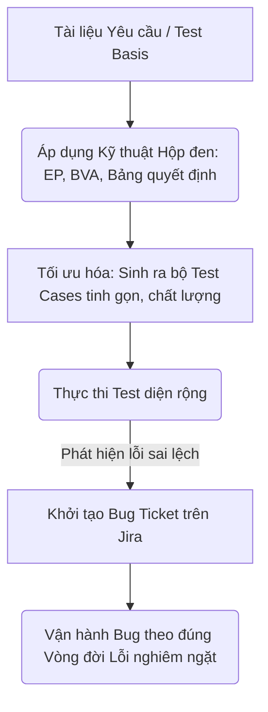
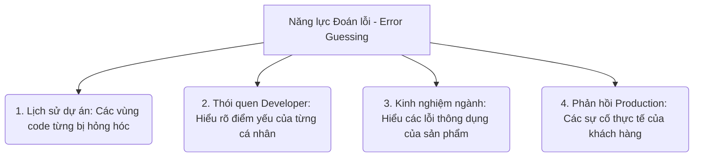
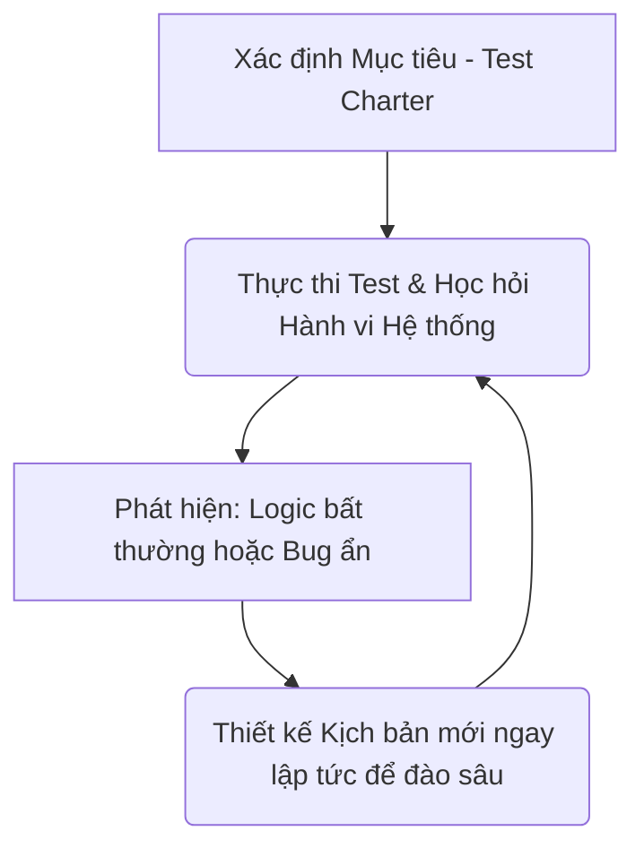
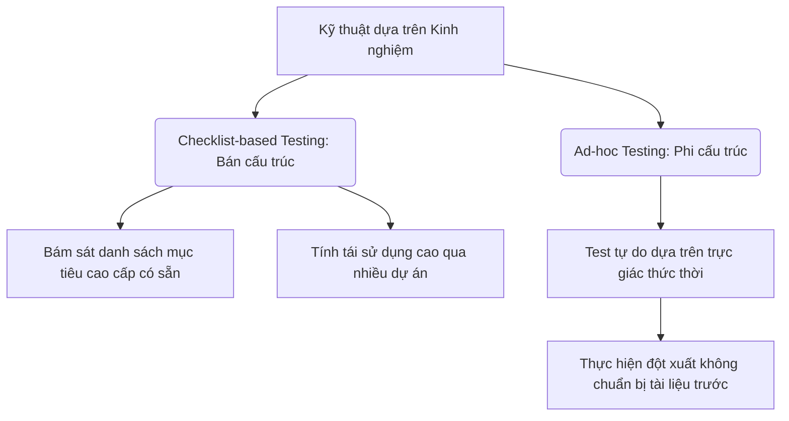

# 📁 04. Test Design & Bug Management

*Mục tiêu: Áp dụng các kỹ thuật tư duy toán học và logic để tối ưu hóa số lượng kịch bản kiểm thử, đồng thời làm chủ vòng đời của lỗi và quy trình quản lý Bug chuyên nghiệp.*

# **4.2. Experience-based Test Techniques**

## 📌 Mục lục nội bộ (Chặng 04)

- [ ] [**4.1. Black-box Test Design Techniques**](./1_DesignTechniques.md)
- [ ] [**4.2. Experience-based Test Techniques**](./2_ExperienceTechniques.md)
  - [ ] [4.2.1. Error Guessing](#421-error-guessing)
  - [ ] [4.2.2. Exploratory Testing](#422-exploratory-testing)
  - [ ] [4.2.3. Checklist-based & Ad-hoc Testing](#423-checklist-based--ad-hoc-testing)
- [ ] [**4.3. White-box Concepts**](./3_WhiteBoxConcepts.md)
- [ ] [**4.4. Bug Management & Lifecycle**](./4_BugManagement.md)
---

## 🗺️ Bản đồ Tiến trình Từ Kỹ thuật Toán học đến Quản lý Lỗi

Sơ đồ dưới đây mô tả cách Tester áp dụng các kỹ thuật logic để bóp nghẹt số lượng ca test nhưng vẫn săn lùng Bug và quản lý chúng một cách có hệ thống:

---

# 4.2.1. Error Guessing

**Error Guessing (Kỹ thuật Đoán lỗi)** là một kỹ thuật thiết kế kịch bản kiểm thử dựa trên kinh nghiệm (`Experience-based Test Technique`). Kỹ thuật này hoạt động bằng cách **chủ động dự đoán trước các sai sót (Mistakes), lỗi nguồn (Errors) và khiếm khuyết (Defects) có khả năng cao sẽ xuất hiện trong phần mềm**, dựa trên tri thức thực chiến và trải nghiệm quá khứ của người kỹ sư QA.

Khác với các kỹ thuật hộp đen mang tính toán học khô khan (như `EP`, `BVA`), Error Guessing không tuân theo một quy tắc phân rã tham số cố định nào. Bản chất của kỹ thuật này là **sự nhạy cảm kỹ thuật của Tester** – khả năng "ngửi thấy mùi của Bug" tại những khu vực code nhạy cảm mà Developer thường vô tình bỏ quên cơ chế phòng ngự.

## 📊 Mô hình Các Nguồn Tri thức Cấu thành nên Năng lực Đoán lỗi

Năng lực đoán lỗi của một chuyên gia QA được tổng hợp từ 4 nguồn dữ liệu tri thức thực chiến:

---

## 🛠️ Ma trận 5 Nhóm Góc tối Hệ thống Thường xuyên bị Tester "Bắt bài"

Để áp dụng Error Guessing một cách hệ thống thay vì đoán mò vô căn cứ, Tester dày dặn kinh nghiệm thường lập sẵn một danh sách các vùng nhạy cảm (`Checklist / Bug Patterns`) dựa trên hành vi của mã nguồn và người dùng:

### 1. Góc tối xử lý Giá trị đặc biệt (Input Field Anomalies)
* **Dự đoán của QA:** Dev thường quên cấu hình chặn ký tự đặc biệt hoặc xử lý chuỗi rỗng.
* **Hành động test nhanh:** Nhập dấu cách (`Space`), nhập chuỗi toàn dấu cách, nhập các thẻ mã độc HTML (``), nhập ký tự Emoji vào các ô nhập liệu quan trọng để xem app có bị crash văng màn hình hoặc dính lỗi bảo mật XSS không.

### 2. Góc tối xử lý Logic Toán học ngầm (Calculation Boundaries)
* **Dự đoán của QA:** Dev dễ viết sai công thức tính toán khi gặp số âm hoặc số 0.
* **Hành động test nhanh:** Test tính năng tính tiền đơn hàng, áp mã giảm giá với các giá trị cực đoan: Đơn hàng trị giá `0 VND`, đơn hàng có số tiền âm, áp mã giảm giá vượt quá 100% giá trị đơn hàng để xem hệ thống có tính ra số tiền âm hay không.

### 3. Góc tối xử lý Hành vi phi tuyến tính của Người dùng (User Interrupts)
* **Dự đoán của QA:** Dev chỉ code cho luồng người dùng thao tác tuần tự mượt mà, thiếu cơ chế khóa trạng thái khi gặp hành động phá hoại ngẫu hứng.
* **Hành động test nhanh:** Bấm liên tục 5 lần vào nút Submit Thanh toán trong 1 giây (`Double Click / Spamming`). Đang tải dữ liệu (Loading) thì đột ngột tắt mạng, hoặc bấm nút Quay lại (`Back`) của trình duyệt để kiểm tra lỗi trừ tiền trùng lặp (`Race Conditions`).

### 4. Góc tối xử lý Giới hạn Dung lượng hệ thống (Resource Limits)
* **Dự đoán của QA:** Ứng dụng chạy rất tốt với file nhỏ nhưng sẽ bị nghẽn mạch, tràn bộ nhớ khi gặp tệp tin lớn.
* **Hành động test nhanh:** Cố tình tải lên một file ảnh đại diện nặng `5GB`, hoặc tải lên một file trống không có dữ liệu (`0 KB`), tệp tin sai định dạng phần mở rộng (Đổi đuôi file `.exe` thành `.png`) để kiểm tra bộ lọc an toàn của máy chủ.

### 5. Góc tối hiển thị Tương thích Văn bản (Text UI Flaws)
* **Dự đoán của QA:** Dev không tính toán đến độ dài tối đa của ngôn ngữ bản địa.
* **Hành động test nhanh:** Nhập một chuỗi ký tự liền nhau không có dấu cách dài 1000 chữ (Ví dụ: `aaaaa...aaaa`) vào ô Tên hiển thị để xem giao diện UI có bị vỡ nát, mất nút bấm do dòng chữ không tự động xuống hàng hay không.

---

## ⚠️ Cảnh báo Chuyên gia: Ranh giới giữa "Đoán lỗi" và "Đoán mò vô căn cứ"

* **Đoán mò vô căn cứ (Guessing blindly):** Là hành động chạy test ngẫu hứng không ghi chép, không dựa trên logic hệ thống, bấm loạn màn hình với hy vọng may mắn tìm thấy lỗi. Cách làm này vi phạm tính hệ thống của `STLC` và không thể tái sử dụng kịch bản.
* **Error Guessing Chuẩn mực:** Tester sử dụng kinh nghiệm để thiết kế thêm các Test Case độc lập bổ sung cho bộ Test Case hộp đen sẵn có. Các ca test này bắt buộc phải có mã định danh `Test Case ID`, ghi rõ các bước thực hiện tuần tự và có kết quả mong đợi (`Expected Result`) dựa trên tư duy logic hệ thống.

> ⚠️ **Tư duy chuyên gia cần nhớ:**
> Error Guessing là một kỹ thuật tuyệt vời giúp Manual Tester gia tăng năng suất săn Bug, đặc biệt là các lỗi logic quái dị mà tài liệu SRS không bao giờ viết ra. Tuy nhiên, kỹ thuật này **không được phép sử dụng độc lập** làm phương pháp duy nhất trong dự án. Bạn bắt buộc phải dồn 80% lực lượng hoàn thành việc thiết kế kịch bản theo các kỹ thuật hộp đen chuẩn mực (`EP`, `BVA`, `Decision Table`) trước để dựng lên khung lưới bảo vệ chất lượng. Sau đó, mới dùng Error Guessing như một mũi dao sắc bén để đâm sâu vào các góc khuất, quét sạch các Bug ẩn giấu cuối cùng.

## 📚 References (Tài liệu tham khảo 4.2.1)
* [ISTQB® Certified Tester Foundation Level (CTFL) Syllabus v4.0](https://istqb.org) - Section 4.3.1: *Error Guessing.*
* **Cem Kaner (1997)** - *Black Box Software Testing Techniques (Experience-based Methods)*, Software Quality Management Lectures.

# 4.2.2. Exploratory Testing

**Exploratory Testing (Kiểm thử khám phá)** là một phương pháp kiểm thử dựa trên kinh nghiệm (`Experience-based Test Technique`), nơi hoạt động thiết kế kịch bản (`Test Design`) và hoạt động thực thi kiểm thử (`Test Execution`) được diễn ra **đồng thời, song hành và tương tác liên tục với nhau trong suốt quá trình chạy test**.

Khác với kiểm thử thủ công truyền thống bắt buộc phải viết xong Test Case chi tiết rồi mới bấm nút chạy, Exploratory Testing cho phép Tester dùng tư duy tự do để vừa học hỏi cơ chế vận hành của hệ thống thực tế, vừa tự thiết kế và chạy kịch bản ngay trong đầu. Tuy nhiên, đây không phải là hoạt động test ngẫu hứng tự do vô tổ chức; Exploratory Testing thực chiến tuân thủ nghiêm ngặt quy trình quản lý thời gian và mục tiêu thông qua bộ khung **Session-Based Test Management (SBTM)**.

## 📊 Vòng lặp Học hỏi và Khai phá liên hoàn của Exploratory Testing

Quy trình vận hành khép kín giúp Tester liên tục mở rộng phạm vi săn lùng lỗi dựa trên phản hồi thực tế của ứng dụng:

---

## 🛠️ Ma trận Kỹ thuật Vận hành: Session-Based Test Management (SBTM)

Để biến kiểm thám hiểm thành một phương pháp quản lý chất lượng có số liệu định lượng minh bạch, Tester chuyên nghiệp áp dụng bộ khung 3 chốt chặn kỹ thuật sau:

### 1. Thiết lập Phiếu định hướng mục tiêu (Test Charter)
* Tester không mở app lên bấm loạn màn hình. Trước khi test, bạn bắt buộc phải viết một phiếu **Test Charter** ngắn gọn vạch rõ ranh giới làm việc nhằm trả lời cho 3 câu hỏi: *Chúng ta test khu vực nào? Dùng vũ khí/công cụ gì? và Tập trung tìm loại lỗi nào?*
* *Ví dụ cấu trúc Charter chuẩn:* "Khám phá luồng thanh toán Ví điện tử, sử dụng công cụ ngắt kết nối mạng Fiddler để săn lùng lỗi rò rỉ trạng thái dữ liệu (State Leakage)".

### 2. Giới hạn Khung thời gian nghiêm ngặt (Time-Boxed Sessions)
* Hoạt động khám phá được cô lập bên trong các chu kỳ thời gian đóng hộp (`Sessions`) kéo dài từ **60 phút đến tối đa 120 phút**. 
* Trong suốt Session này, Tester tập trung 100% tinh thần để thám hiểm hệ thống theo đúng định hướng của Charter, tuyệt đối không bị phân tâm bởi việc check email, họp hành hay log bug chi tiết làm đứt gãy mạch tư duy sáng tạo.

### 3. Xuất bản Nhật ký đóng hộp (Session Report)
Cuối buổi thám hiểm, Tester viết một báo cáo tổng kết ngắn gọn (Session Log) để số hóa năng suất làm việc gửi cho Test Lead, bao gồm:
* **Thời gian phân bổ (Time Breakdown):** Bao nhiêu % thời gian dùng để thám hiểm cấu trúc (`Design & Execution`), bao nhiêu % thời gian dùng để điều tra lỗi, và bao nhiêu % thời gian bị lãng phí do lỗi môi trường sập.
* **Danh sách phát hiện (Discoveries):** Ghi nhanh danh sách các điểm bất hợp lý trong trải nghiệm người dùng (`UX Flaws`), các ghi chú về kiến trúc hệ thống ngầm, và danh sách các mã ID Bug vừa được phát hiện.

---

## 🧠 Khi nào Dự án cần kích hoạt Chiến lược Kiểm thử Khám phá?

Exploratory Testing không thay thế hoàn toàn cho Test Case truyền thống, nó được kích hoạt làm mũi nhọn tấn công trong các ngữ cảnh đặc thù sau:
* **Dự án thiếu hụt tài liệu yêu cầu:** Khi làm dự án gấp, tài liệu SRS không tồn tại hoặc đã quá lỗi thời, Tester buộc phải dùng Exploratory Testing để vừa test vừa tự học cơ chế phần mềm.
* **Áp lực thời gian về đích quá nhanh:** Khi Dev giao code trễ, ngày phát hành không đổi, Tester dùng phương pháp này để quét nhanh các luồng nghiệp vụ lớn nhằm dò tìm các lỗi nghiêm trọng trong thời gian ngắn nhất.
* **Bổ trợ cho bộ Test Case có sẵn:** Sau khi bộ Test Case hộp đen truyền thống đã chạy xong và báo `PASS` 100%, Tester dành ra 2-3 Sessions Exploratory để thắp sáng các góc tối dị biệt, săn lùng nốt các hạt sạn lỗi ngầm cuối cùng.

> ⚠️ **Tư duy chuyên gia cần nhớ:**
> Điểm phân cấp trình độ QA nằm ở kỹ năng viết **Test Charter**. Đừng bao giờ thám hiểm hệ thống mà không có mục tiêu định hướng. Việc chạy test ngẫu hứng vô tổ chức (`Ad-hoc Testing`) không ghi lại nhật ký bằng chứng sẽ khiến bạn không thể tái hiện lại được lỗi (`Non-reproducible Bug`) khi Developer yêu cầu, làm suy giảm uy tín chuyên môn của bộ phận QA trước đội ngũ dự án.

## 📚 References (Tài liệu tham khảo 4.2.2)
* [ISTQB® Certified Tester Foundation Level (CTFL) Syllabus v4.0](https://istqb.org) - Section 4.3.2: *Exploratory Testing.*
* **James Bach (2000)** - *Session-Based Test Management*, Software Testing and Quality Engineering Magazine.

# 4.2.3. Checklist-based & Ad-hoc Testing

Trong nhóm các kỹ thuật kiểm thử dựa trên kinh nghiệm (`Experience-based Test Techniques`), **Checklist-based Testing (Kiểm thử dựa trên danh sách kiểm tra)** và **Ad-hoc Testing (Kiểm thử ngẫu hứng)** là hai hình thức kiểm thử linh hoạt, hướng hành động cao, thường được áp dụng song hành để tối ưu hóa thời gian và lấp đầy các khoảng trống kịch bản mà kỹ thuật hộp đen truyền thống bỏ sót.

Mặc dù đều phụ thuộc vào năng lực và trải nghiệm thực chiến của người kỹ sư QA, hai kỹ thuật này nằm ở hai thái cực khác nhau về tính cấu trúc: Checklist-based mang tính định hướng bán cấu trúc, trong khi Ad-hoc hoàn toàn là sự tự do phi cấu trúc.

## 📊 Mô hình Phân nhánh Cấu trúc giữa Kiểm thử dựa trên Checklist và Ngẫu hứng

Sơ đồ phân tách ranh giới vận hành giữa tính kỷ luật của danh sách kiểm tra và sự tự do của tư duy phá hoại hệ thống:

---

## 🛠️ Chi tiết Kỹ thuật Vận hành Thực chiến của QA

### 1. Checklist-based Testing (Kiểm thử dựa trên Danh sách kiểm tra)
* **Bản chất:** Tester sử dụng một danh sách các điểm kiểm tra cao cấp (**Checklist**) làm kim chỉ nam. Danh sách này không ghi rõ từng bước bấm nút tuần tự (nhu Test Case), mà chỉ cung cấp **các dòng mục tiêu kiểm tra cô đọng**, cho phép Tester tự linh hoạt vận hành các bước đi trên giao diện miễn là đạt được mục đích xác thực của dòng checklist đó.
* **Nguồn gốc dữ liệu:** Được đúc kết từ lịch sử các lỗi thường gặp trong quá khứ (`Bug Patterns`), tiêu chuẩn thiết kế UI/UX toàn cầu, hoặc các quy chuẩn nghiệp vụ đặc thù của ngành.
* *Ví dụ một dòng Checklist thực chiến:* `[CL_API_004] Kiểm tra hệ thống tự động cắt bỏ khoảng trắng thừa (Trim Space) ở đầu/cuối chuỗi chữ khi lưu vào Database`.

### 2. Ad-hoc Testing (Kiểm thử ngẫu hứng / Tự phát)
* **Bản chất:** Là hình thức kiểm thử hoàn toàn không có sự chuẩn bị từ trước, không sử dụng tài liệu yêu cầu (`Test Basis`), không viết kịch bản và không tuân theo bất kỳ một phương pháp thiết kế khoa học nào. 
* **Cơ chế vận hành:** Tester mở ứng dụng lên và thực hiện các hành động "phá hoại", tương tác ngẫu nhiên với hệ thống dựa trên trực giác thức thời. 
* **Mục tiêu tối cao:** Tìm kiếm các lỗi nghiêm trọng độc dị (`Wild Bugs`) nằm ở những luồng đi quái gở nhất của người dùng – những kịch bản mà không một BA hay Tester nào có thể nghĩ ra trong điều kiện làm việc bình thường.

---

## 📊 Ma trận So sánh Đối chiếu: Checklist-based vs Ad-hoc Testing

Để áp dụng đúng chốt chặn, Tester chuyên nghiệp cần phân tách rõ ma trận đối chiếu sau:

| Tiêu chí phân biệt | Checklist-based Testing | Ad-hoc Testing |
| :--- | :--- | :--- |
| **Tính cấu trúc** | **Bán cấu trúc**: Có tài liệu định hướng tổng quan từ trước. | **Phi cấu trúc**: Hoàn toàn tự do, ngẫu hứng, không tài liệu. |
| **Tính tái sử dụng** | **Cực cao**: Một bộ checklist UI/UX có thể dùng lại cho 10 dự án. | **Bằng 0**: Hoạt động một lần, kịch bản biến mất sau khi kết thúc đợt test. |
| **Độ phụ thuộc nhân sự**| **Trung bình**: Tester mới vào nghề nhìn vào checklist vẫn có thể test được. | **Cực cao**: Chỉ có Chuyên gia QA am hiểu sâu hệ thống mới đạt hiệu suất cao. |
| **Thời điểm kích hoạt** | Thường dùng chạy nhanh cho bộ **Smoke Test** hoặc **Sanity Test**. | Kích hoạt đột xuất khi hệ thống vừa sửa đổi lớn hoặc sau khi bộ Test Case chính đã chạy xong. |

---

## ⚠️ Cạm bẫy kỹ thuật: Ranh giới giữa "Ad-hoc" và "Test bừa bãi"

Sai lầm lớn nhất của một Tester tập sự là lười viết Test Case rồi ngụy biện rằng mình đang làm Ad-hoc Testing. Ad-hoc Testing chuẩn mực của một chuyên gia bắt buộc phải thỏa mãn:
* **Năng lực tái hiện lỗi (`Bug Reproducibility`):** Dù bạn bấm nút ngẫu hứng không theo kịch bản, nhưng ngay khi màn hình xuất hiện lỗi, tư duy phản biện bắt buộc bạn phải nhớ ngược lại chính xác chuỗi hành động mình vừa đi để viết thành các bước `Steps to Reproduce` mạch lạc trên Jira. Nếu log một cái Bug mà chính bạn không biết cách làm sao cho nó xuất hiện lại, chiếc Bug đó sẽ bị Dev treo trạng thái `REJECTED` và làm giảm uy tín của bộ phận QA.

> ⚠️ **Tư duy chuyên gia cần nhớ:**
> Hãy coi Checklist là chiếc lưới an toàn giúp bạn không bị sót các lỗi nền móng cơ bản, và coi Ad-hoc Testing là một buổi "tấn công du kích" tự do để săn lùng các lỗi rủi ro cực đoan. Cả hai kỹ thuật này là công cụ tuyệt vời để tăng tốc độ bàn giao trong môi trường **Agile/Scrum** chạy rất nhanh. Tuy nhiên, tuyệt đối không dùng chúng làm tài liệu nghiệm thu duy nhất cho các tính năng logic tài chính tiền tệ phức tạp – nơi một sai số nhỏ cũng có thể làm gãy hoàn toàn dòng tiền của doanh nghiệp.

## 📚 References (Tài liệu tham khảo 4.2.3)
* [ISTQB® Certified Tester Foundation Level (CTFL) Syllabus v4.0](https://istqb.org) - Section 4.3.3: *Checklist-based Testing* & Official Glossary Definition of *Ad-hoc Testing*.
* **Cem Kaner, James Bach (2001)** - *Lessons Learned in Software Testing*, Wiley.
