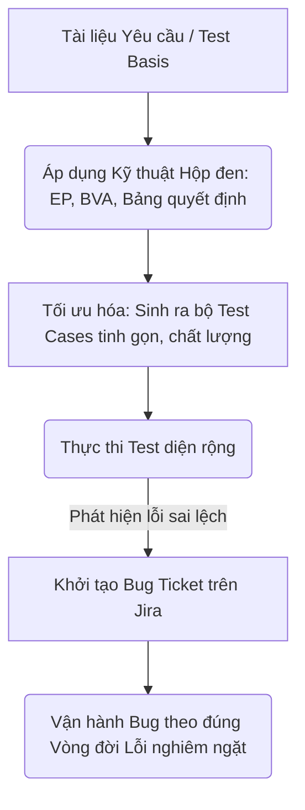
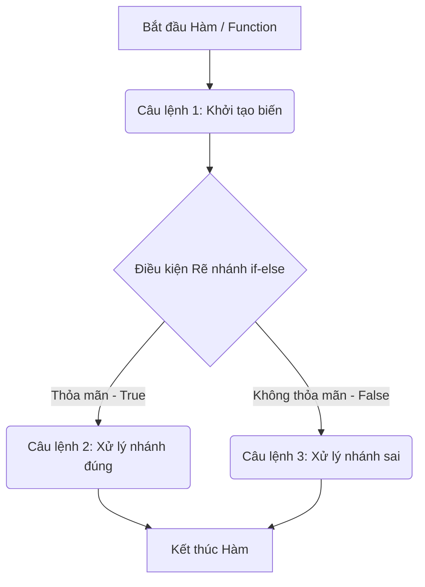
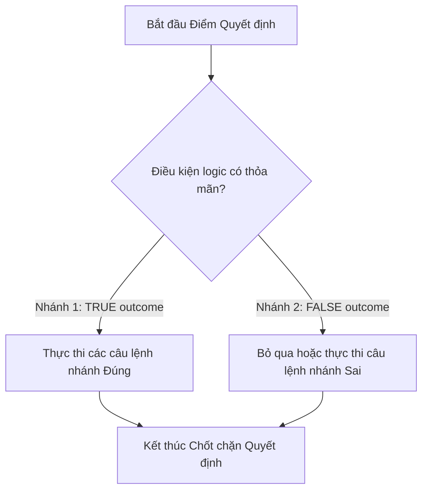
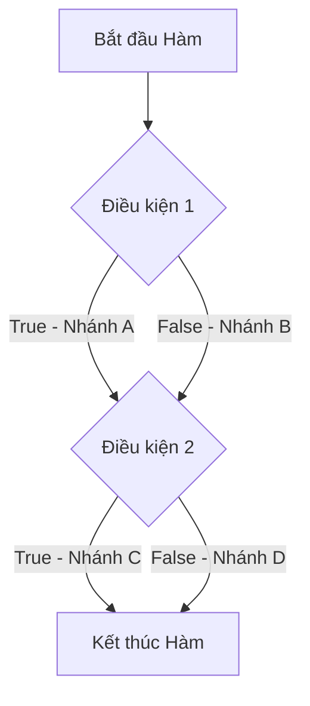

# 📁 04. Test Design & Bug Management

*Mục tiêu: Áp dụng các kỹ thuật tư duy toán học và logic để tối ưu hóa số lượng kịch bản kiểm thử, đồng thời làm chủ vòng đời của lỗi và quy trình quản lý Bug chuyên nghiệp.*

# **4.3. White-box Concepts**

## 📌 Mục lục nội bộ (Chặng 04)

- [ ] [**4.1. Black-box Test Design Techniques**](./1_DesignTechniques.md)
- [ ] [**4.2. Experience-based Test Techniques**](./2_ExperienceTechniques.md)
- [ ] [**4.3. White-box Concepts**](./3_WhiteBoxConcepts.md)
  - [ ] [4.3.1. Statement Coverage](#431-statement-coverage)
  - [ ] [4.3.2. Branch / Decision Coverage](#432-branch--decision-coverage)
  - [ ] [4.3.3. Path Coverage](#433-path-coverage)
- [ ] [**4.4. Bug Management & Lifecycle**](./4_BugManagement.md)

---

## 🗺️ Bản đồ Tiến trình Từ Kỹ thuật Toán học đến Quản lý Lỗi

Sơ đồ dưới đây mô tả cách Tester áp dụng các kỹ thuật logic để bóp nghẹt số lượng ca test nhưng vẫn săn lùng Bug và quản lý chúng một cách có hệ thống:



---

# 4.3.1. Statement Coverage

**Statement Coverage (Kiểm thử độ phủ câu lệnh)** là một kỹ thuật thiết kế kịch bản kiểm thử cấu trúc thuộc nhóm **Kiểm thử hộp trắng (`White-box Testing`)**. Kỹ thuật này tập trung vào việc đo lường tỷ lệ phần trăm các câu lệnh thực thi độc lập (`Executable Statements`) trong mã nguồn phần mềm đã được quét qua bởi bộ kịch bản kiểm thử.

Khác với các kỹ thuật hộp đen chỉ đứng ở ngoài giao diện truyền dữ liệu, Statement Coverage đòi hỏi Tester (hoặc Developer khi chạy Unit Test) phải nhìn thấu vào cấu trúc mã nguồn bên trong ứng dụng. Mục tiêu tối cao của kỹ thuật này là dựng lên các ca kiểm thử sao cho **mọi dòng code viết ra đều phải được chạy qua ít nhất một lần**, từ đó phát hiện các dòng code "chết" (`Dead Code`), lỗi cú pháp hoặc các nhánh logic bị xử lý sai sót.

## 📊 Mô hình Luồng Đo lường của Statement Coverage trong Mã nguồn

Sơ đồ khối dưới đây mô tả cách các câu lệnh tuần tự trong code được quét qua bởi một ca kiểm thử:



---

## 🛠️ Công thức Toán học Định lượng Độ phủ Câu lệnh

Để báo cáo chỉ số chất lượng lên hệ thống đường ống tự động CI/CD hoặc Test Summary Report, độ phủ câu lệnh được tính toán nghiêm ngặt theo công thức sau:

$$\text{Statement Coverage (\%)} = \left( \frac{\text{Số lượng câu lệnh được thực thi thực tế}}{\text{Tổng số lượng câu lệnh khả thực thi trong mã nguồn}} \right) \times 100\%$$

* **Tiêu chuẩn chất lượng ngành:** Một bộ Unit Test đạt chuẩn an toàn thông thường bắt buộc phải đạt chỉ số **Statement Coverage $\ge$ 80%**. Đối với các hệ thống tài chính hoặc y tế sinh tử, chỉ số này bắt buộc phải cấu hình chốt chặn là 100%.

---

## 💡 Ví dụ thực chiến tính toán: Hàm tính toán "Áp mã Giảm giá (Coupon)"

Hãy phân tích đoạn mã nguồn ngắn dưới đây (viết bằng ngôn ngữ giả lập) lồng cấu trúc câu lệnh điều kiện `if`:

```javascript
1:  function calculateDiscount(totalAmount, isVip) {
2:      let discount = 0;
3:      if (isVip === true) {
4:          discount = totalAmount * 0.1;
5:          print("Chúc mừng khách hàng VIP được giảm 10%");
6:      }
7:      let finalAmount = totalAmount - discount;
8:      return finalAmount;
9:  }
```

### 📊 Phân tích Thiết kế Ca kiểm thử để Đạt Độ phủ:

* **Tổng số câu lệnh khả thực thi (Executable Statements):** Hệ thống có tổng cộng **7 dòng lệnh thực thi** (Dòng 2, 3, 4, 5, 7, 8; dòng 1 và 6 là khai báo khung không tính).

#### Tình huống 1: Tester chỉ thiết kế duy nhất 1 Ca kiểm thử với Khách hàng THƯỜNG
* **Dữ liệu nạp vào:** `totalAmount = 100, isVip = false`
* **Luồng chạy của code:** Dòng 2 chạy $\rightarrow$ Dòng 3 kiểm tra thấy Sai (`False`) $\rightarrow$ Code nhảy cóc bỏ qua dòng 4 và dòng 5 $\rightarrow$ Chạy tiếp dòng 7 $\rightarrow$ Dòng 8.
* **Số câu lệnh thực thi thực tế:** 5 dòng (Dòng 2, 3, 7, 8).
* **Kết quả định lượng:** $\text{Statement Coverage} = \frac{5}{7} \times 100\% = \mathbf{71.4\%}$. Bộ test này **Không đạt chuẩn**.

#### Tình huống 2: Tester tối ưu hóa thiết kế duy nhất 1 Ca kiểm thử với Khách hàng VIP
* **Dữ liệu nạp vào:** `totalAmount = 100, isVip = true`
* **Luồng chạy của code:** Dòng 2 chạy $\rightarrow$ Dòng 3 kiểm tra thấy Đúng (`True`) $\rightarrow$ Kích hoạt chạy dòng 4 $\rightarrow$ Chạy dòng 5 $\rightarrow$ Chạy dòng 7 $\rightarrow$ Dòng 8.
* **Số câu lệnh thực thi thực tế:** 7 dòng (Toàn bộ mã nguồn được quét sạch).
* **Kết quả định lượng:** $\text{Statement Coverage} = \frac{7}{7} \times 100\% = \mathbf{100\%}$. Bộ test đạt chuẩn tuyệt đối.

---

## ⚠️ Điểm mù Chí tử của Statement Coverage (Cạm bẫy cần tránh)

Mặc dù đạt chỉ số độ phủ câu lệnh 100% nghe rất hoàn hảo, kỹ thuật này có một **điểm mù cực kỳ tai hại**. Nó có thể che phủ hết mọi dòng chữ trong code nhưng lại **bỏ sót hoàn toàn các nhánh logic trống**.

* *Minh chứng từ ví dụ trên:* Nhìn vào Tình huống 2, chỉ với 1 ca test khách hàng VIP, chúng ta đã đạt `Statement Coverage = 100%`. Tuy nhiên, nếu đoạn code trên dính một lỗi nghiêm trọng: *"Nếu là khách hàng THƯỜNG (isVip = false) thì hệ thống bị sập nguồn đứng app"*, ca test duy nhất kia sẽ **hoàn toàn không phát hiện ra**. Luồng đi của khách hàng thường (`false`) hoàn toàn chưa từng được chạy thực tế.

> ⚠️ **Tư duy chuyên gia cần nhớ:**
> Statement Coverage là thước đo nền móng, là bước sơ khởi thấp nhất của kiểm thử hộp trắng. Nó giúp bạn đảm bảo không có dòng code nào bị viết thừa hoặc viết lỗi cú pháp không thể chạm tới. Để phá vỡ điểm mù chí tử của kỹ thuật này, bạn tuyệt đối không được dừng lại ở đây. Bạn bắt buộc phải nâng cấp lên cấp độ kiểm thử tiếp theo là **Branch / Decision Coverage (Độ phủ nhánh)** để chốt chặn toàn diện mọi ngả rẽ Đúng/Sai của hệ thống.

## 📚 References (Tài liệu tham khảo 4.3.1)
* [ISTQB® Certified Tester Foundation Level (CTFL) Syllabus v4.0](https://istqb.org) - Section 4.4.1: *White-box Test Techniques (Statement Testing and Statement Coverage).*
* [ISO/IEC/IEEE 29119-4:2021 Standard](https://iso.org) - *Software and systems engineering — Software testing — Part 4: Test techniques (Statement Coverage Measurement Specification).*

# 4.3.2. Branch / Decision Coverage

**Branch Coverage (Kiểm thử độ phủ nhánh)** hay còn gọi as **Decision Coverage** là một kỹ thuật thiết kế kịch bản kiểm thử cấu trúc nâng cao thuộc nhóm **Kiểm thử hộp trắng (`White-box Testing`)**. Kỹ thuật này tập trung vào việc đo lường tỷ lệ phần trăm các nhánh quyết định rẽ nhánh (`Decision Outcomes / Branches`) trong mã nguồn phần mềm đã được quét qua bởi bộ kịch bản kiểm thử.

Mỗi câu lệnh điều kiện trong code (như `if-else`, `switch-case`, các vòng lặp `while`, `for`) đều tạo ra các ngả rẽ logic độc lập. Nếu kỹ thuật `Statement Coverage` ở bước trước chỉ quan tâm đến việc chạy qua các dòng chữ, thì Branch Coverage nâng cấp chốt chặn kỹ thuật bằng cách **ép buộc bộ kịch bản phải kích hoạt và đi qua toàn bộ các kết quả đầu ra có thể xảy ra (nhánh Đúng và nhánh Sai) của mọi điểm quyết định**.

## 📊 Mô hình Khắc phục Điểm mù của Câu lệnh bằng Độ phủ Nhánh

Sơ đồ khối mô tả cách kiểm thử độ phủ nhánh bắt buộc phải chiếm lĩnh cả hai con đường logic độc lập:



---

## 🛠️ Công thức Toán học Định lượng Độ phủ Nhánh

Để đo lường hiệu suất bao phủ logic trong các đợt Unit Test tự động trên đường ống CI/CD, độ phủ nhánh được định lượng như sau:

$$\text{Branch Coverage (\%)} = \left( \frac{\text{Số lượng kết quả nhánh quyết định đã được thực thi thực tế}}{\text{Tổng số lượng kết quả nhánh quyết định khả thi trong mã nguồn}} \right) \times 100\%$$

* **Định luật quan hệ ISTQB:** Nếu một bộ Test Cases đạt độ phủ nhánh 100% (`100% Branch Coverage`), nó sẽ **tự động đạt độ phủ câu lệnh 100%** (`100% Statement Coverage`). Tuy nhiên, chiều ngược lại hoàn toàn không đúng.

---

## 💡 Ví dụ thực chiến tính toán liên hoàn từ mục trước

Để thấy rõ sức mạnh phá vỡ điểm mù của Branch Coverage, hãy tái phân tích đoạn code tính toán mã giảm giá Coupon ở mục 4.3.1:

```javascript
1:  function calculateDiscount(totalAmount, isVip) {
2:      let discount = 0;
3:      if (isVip === true) {
4:          discount = totalAmount * 0.1;
5:          print("Chúc mừng khách hàng VIP được giảm 10%");
6:      }
7:      let finalAmount = totalAmount - discount;
8:      return finalAmount;
9:  }
```

### 📊 Phân tích Thiết kế Ca kiểm thử đứng dưới lăng kính Độ phủ Nhánh:

* **Tổng số kết quả nhánh quyết định (Decision Outcomes):** Dòng số 3 chứa câu lệnh điều kiện `if`. Điểm này sinh ra chính xác **2 nhánh kết quả bắt buộc phải kiểm tra**: Nhánh Đúng (`isVip === true`) và Nhánh Sai (`isVip === false`).

#### Tình huống 1: Tester chỉ dùng lại 1 Ca kiểm thử khách hàng VIP (Từ mục trước)
* **Dữ liệu nạp vào:** `totalAmount = 100, isVip = true`
* **Kết quả quét code:** Kích hoạt chạy qua nhánh Đúng (`True`). Nhánh Sai (`False`) bị bỏ trống hoàn toàn.
* **Kết quả định lượng:** $\text{Branch Coverage} = \frac{1}{2} \times 100\% = \mathbf{50\%}$. 
* *Đánh giá chuyên gia:* Dù ca test này giúp đạt độ phủ câu lệnh `Statement Coverage = 100%`, nhưng độ phủ nhánh chỉ đạt `50%`. Bộ test **Không đạt chuẩn an toàn** và bị điểm mù che khuất luồng khách hàng thường.

#### Tình huống 2: Tester tối ưu hóa, thiết kế bổ sung đầy đủ bộ 2 Ca kiểm thử
* **Ca kiểm thử 2.1 (Nhánh True):** `totalAmount = 100, isVip = true` $\rightarrow$ Quét sạch nhánh Đúng.
* **Ca kiểm thử 2.2 (Nhánh False):** `totalAmount = 100, isVip = false` $\rightarrow$ Ép hệ thống đi qua nhánh Sai trống (dòng số 6 nhảy thẳng xuống dòng số 7).
* **Kết quả định lượng:** $\text{Branch Coverage} = \frac{2}{2} \times 100\% = \mathbf{100\%}$. Toàn bộ ma trận ngả rẽ logic được làm sạch lỗi lọt lưới.

---

## ⚠️ Giới hạn kỹ thuật của Branch Coverage và Cầu nối nâng cấp

Mặc dù Branch Coverage đã dọn sạch điểm mù của Statement Coverage, kỹ thuật này vẫn chịu một giới hạn kỹ thuật ở các biểu thức điều kiện phức tạp chứa nhiều toán tử logic (như `AND - &&`, `OR - ||`).

* *Ví dụ rủi ro bộc lộ:* Nếu điều kiện dòng 3 sửa thành `if (isVip === true && totalAmount > 500)`. Nhánh Đúng chỉ kích hoạt khi cả hai vế cùng đúng. Nếu Tester chỉ chạy 2 ca test thông thường để lấy kết quả chung cuộc của cả nhánh là `True/False`, bạn sẽ bỏ sót việc kiểm tra độc lập từng điều kiện đơn lẻ bên trong dấu ngoặc đơn, dẫn đến rủi ro lập trình viên viết sai toán tử logic ngầm.

> ⚠️ **Tư duy chuyên gia cần nhớ:**
> Branch Coverage là tiêu chuẩn vàng bắt buộc tối thiểu đối với các hoạt động kiểm thử hộp trắng tầng Unit Test. Làm chủ độ phủ nhánh giúp bạn tự tin tuyên bố hệ thống phòng vệ an toàn trước mọi trường hợp rẽ nhánh dữ liệu. Để đạt đến cảnh giới kiểm soát chất lượng tối cao không tì vết cho các biểu thức điều kiện đan cài chằng chịt, chuyên gia QA sẽ tiếp tục nâng cấp bộ kịch bản lên chốt chặn cuối cùng của hộp trắng: **Path Coverage (Độ phủ đường đi liên hoàn)**.

## 📚 References (Tài liệu tham khảo 4.3.2)
* [ISTQB® Certified Tester Foundation Level (CTFL) Syllabus v4.0](https://istqb.org) - Section 4.4.2: *White-box Test Techniques (Branch Testing and Branch Coverage).*
* [ISO/IEC/IEEE 29119-4:2021 Standard](https://iso.org) - *Software and systems engineering — Software testing — Part 4: Test techniques (Decision and Branch Coverage Assessment).*

# 4.3.3. Path Coverage

**Path Coverage (Kiểm thử độ phủ đường đi)** là kỹ thuật thiết kế kịch bản cấu trúc mạnh mẽ và khắt khe nhất thuộc nhóm **Kiểm thử hộp trắng (`White-box Testing`)**. Kỹ thuật này tập trung vào việc xác định, đo lường và thực thi 100% tất cả các hành trình độc lập (`Linearly Independent Paths`) chạy xuyên suốt từ điểm bắt đầu đến điểm kết thúc của một hàm mã nguồn.

Trong khi `Statement Coverage` chỉ quét qua các dòng chữ, và `Branch Coverage` chỉ kiểm tra các nhánh rẽ đơn lẻ tại từng chốt chặn điều kiện độc lập; Path Coverage nâng cấp chốt chặn kỹ thuật lên mức tối cao bằng cách **ép buộc bộ kịch bản phải che phủ tất cả các tổ hợp liên hoàn của các nhánh rẽ kết hợp lại với nhau**. 

## 📊 Mô hình Phân rã Ma trận Đường đi Liên hoàn trong Mã nguồn

Sơ đồ khối dưới đây mô tả cấu trúc một đoạn mã nguồn có hai câu lệnh điều kiện tuần tự tạo ra nhiều lối đi độc lập:



---

## 🛠️ Công cụ Toán học: McCabe Cyclomatic Complexity (Độ phức tạp vòng mạch)

Để xác định chính xác số lượng Test Cases tối thiểu cần phải thiết kế nhằm đạt độ phủ đường đi 100% không tì vết, Tester chuyên nghiệp sử dụng công thức toán học đồ thị **Độ phức tạp Cyclomatic (M)** của Thomas J. McCabe:

$$M = E - N + 2P$$

* **E (Edges):** Số lượng cạnh (đường mũi tên nối) trong sơ đồ luồng điều khiển của code.
* **N (Nodes):** Số lượng nút (khối câu lệnh xử lý hoặc điểm quyết định).
* **P (Connected Components):** Số lượng cấu phần độc lập (thường mặc định $P = 1$ đối với một hàm đơn lẻ).

---

## 💡 Ví dụ thực chiến tính toán: Hàm xử lý "Tình trạng Tài khoản & Giao dịch"

Hãy phân tích đoạn mã nguồn ngắn dưới đây chứa hai cấu trúc điều kiện `if` tuần tự độc lập:

```javascript
1:  function processTransaction(hasToken, amount) {
2:      let isAllowed = false;
3:      // Điểm quyết định 1
4:      if (hasToken === true) {
5:          isAllowed = true;
6:      }
7:      // Điểm quyết định 2
8:      if (amount > 1000) {
9:          print("Giao dịch giá trị lớn");
10:     }
11:     return isAllowed;
12: }
```

### 📊 Phân tích Bản đồ 4 Con đường đi sinh tử của Mã nguồn:
Hệ thống này có 2 điểm quyết định (`if`), mỗi điểm có 2 nhánh kết quả (`True/False`). Khi kết hợp liên hoàn lại với nhau, hệ thống sinh ra chính xác **4 con đường đi độc lập** bắt buộc phải thiết kế bộ kịch bản chạy qua:

* **Con đường 1 (Path 1):** Dòng 4 nhận `True` $\rightarrow$ Dòng 8 nhận `True`. Code quét qua: d4 $\rightarrow$ d5 $\rightarrow$ d8 $\rightarrow$ d9 $\rightarrow$ d11.
* **Con đường 2 (Path 2):** Dòng 4 nhận `True` $\rightarrow$ Dòng 8 nhận `False`. Code quét qua: d4 $\rightarrow$ d5 $\rightarrow$ d8 $\rightarrow$ d11 (Nhảy cóc dòng 9).
* **Con đường 3 (Path 3):** Dòng 4 nhận `False` $\rightarrow$ Dòng 8 nhận `True`. Code quét qua: d4 $\rightarrow$ d8 $\rightarrow$ d9 $\rightarrow$ d11 (Nhảy cóc dòng 5).
* **Con đường 4 (Path 4):** Dòng 4 nhận `False` $\rightarrow$ Dòng 8 nhận `False`. Code quét qua: d4 $\rightarrow$ d8 $\rightarrow$ d11 (Nhảy cóc cả dòng 5 và dòng 9).

### 📊 So sánh hiệu suất bao phủ logic giữa 3 kỹ thuật Hộp trắng:

| Tiêu chí so sánh | Statement Coverage (Câu lệnh) | Branch Coverage (Nhánh) | Path Coverage (Đường đi) |
| :--- | :---: | :---: | :---: |
| **Số lượng Test Case tối thiểu** | **1 Ca test** (Chạy Path 1) | **2 Ca test** (Chạy Path 1 + Path 4) | **4 Ca test** (Chạy đủ cả 4 Paths) |
| **Chỉ số bao phủ đạt được** | **100%** | **100%** | **100%** |
| **Mức độ an toàn hệ thống** | Thấp (Bỏ sót 3 luồng) | Trung bình (Bỏ sót Path 2 và Path 3) | **Tuyệt đối (Dọn sạch lỗi kết hợp)** |

---

## ⚠️ Giới hạn thực tế của Path Coverage và Tư duy Chuyên gia

Mặc dù Path Coverage là đỉnh cao của kiểm thử cấu trúc, kỹ thuật này gặp một rào cản chí tử ngoài đời thực: **Sự bùng nổ đường đi đối với các hàm chứa vòng lặp**. Nếu một hàm chứa vòng lặp `while` chạy từ 1 đến 20 lần kết hợp với 5 câu lệnh điều kiện lồng nhau, số lượng đường đi thực tế có thể vọt lên hàng triệu Paths. Việc thiết kế hàng triệu Test Case cho một hàm là bất khả thi về mặt chi phí kinh tế.

> ⚠️ **Tư duy chuyên gia cần nhớ:**
> Trong thực tế quản lý chất lượng, đạt `100% Path Coverage` cho toàn bộ hệ thống là một mục tiêu không tưởng. Vì vậy, chuyên gia QA không áp dụng Path Coverage đại trà. Bạn chỉ kích hoạt kỹ thuật này bằng phương pháp **Kiểm thử dựa trên rủi ro (`Risk-based Testing`)**: Cô lập và dồn lực lượng tính toán Path Coverage cho riêng những **Hàm logic cực kỳ phức tạp và mang tính sinh tử của doanh nghiệp** (Ví dụ: Hàm tính toán lãi suất lũy tiến ngân hàng, hàm mã hóa bảo mật Token dữ liệu). Các vùng tính năng thông thường khác chỉ cần duy trì chốt chặn nghiêm ngặt ở mức `100% Branch Coverage` là đã đủ an toàn bảo vệ sản phẩm.

## 📚 References (Tài liệu tham khảo 4.3.3)
* [ISTQB® Certified Tester Foundation Level (CTFL) Syllabus v4.0](https://istqb.org) - Section 4.4: *White-box Test Techniques (Context of Paths and Cyclomatic Complexity).*
* **Thomas J. McCabe (1976)** - *A Complexity Measure*, IEEE Transactions on Software Engineering.
* [ISO/IEC/IEEE 29119-4:2021 Standard](https://iso.org) - *Software and systems engineering — Software testing — Part 4: Test techniques.*

