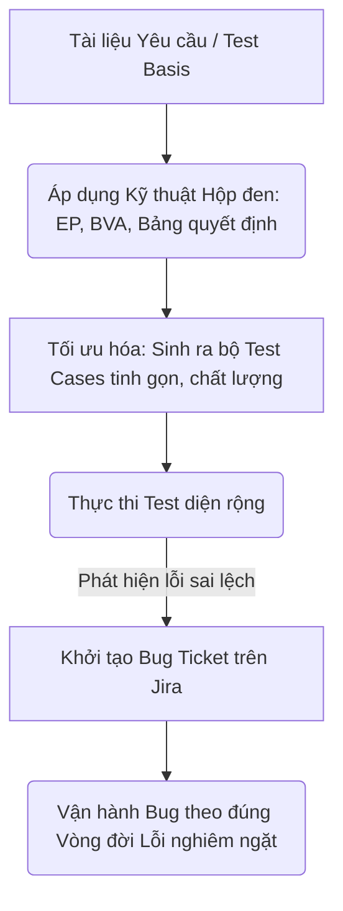
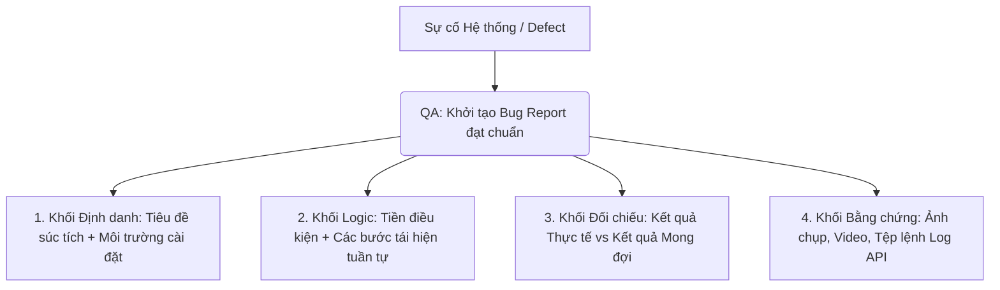
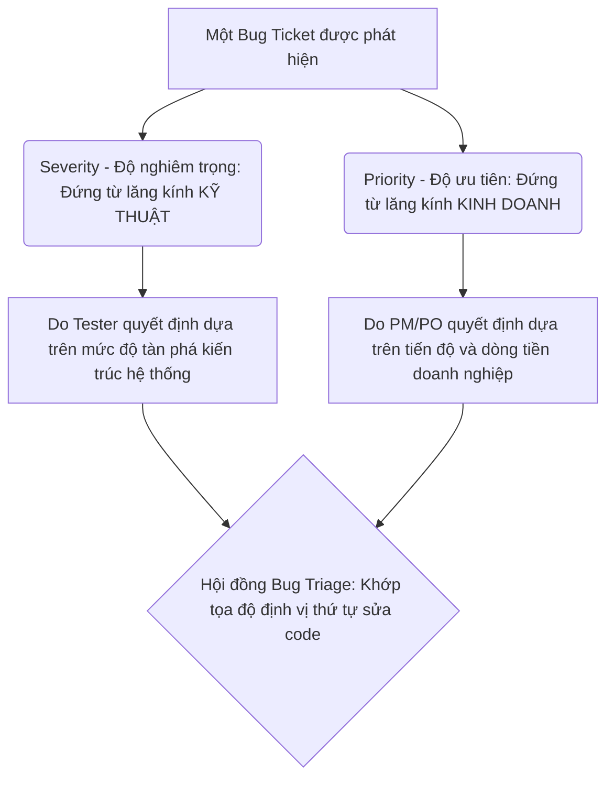
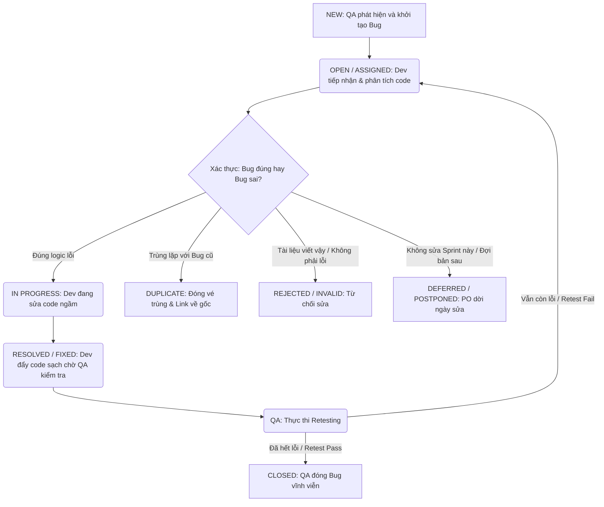
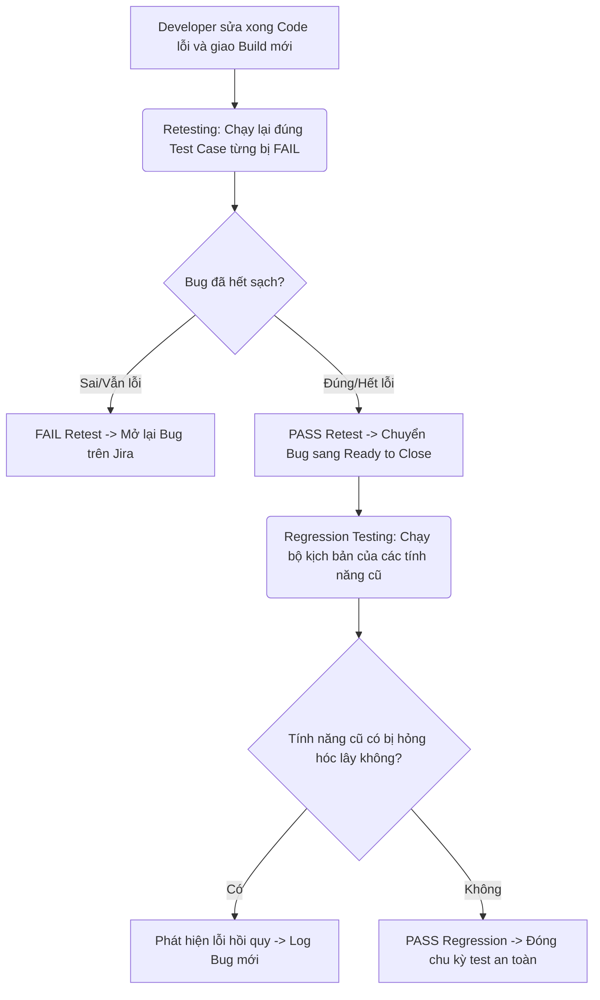
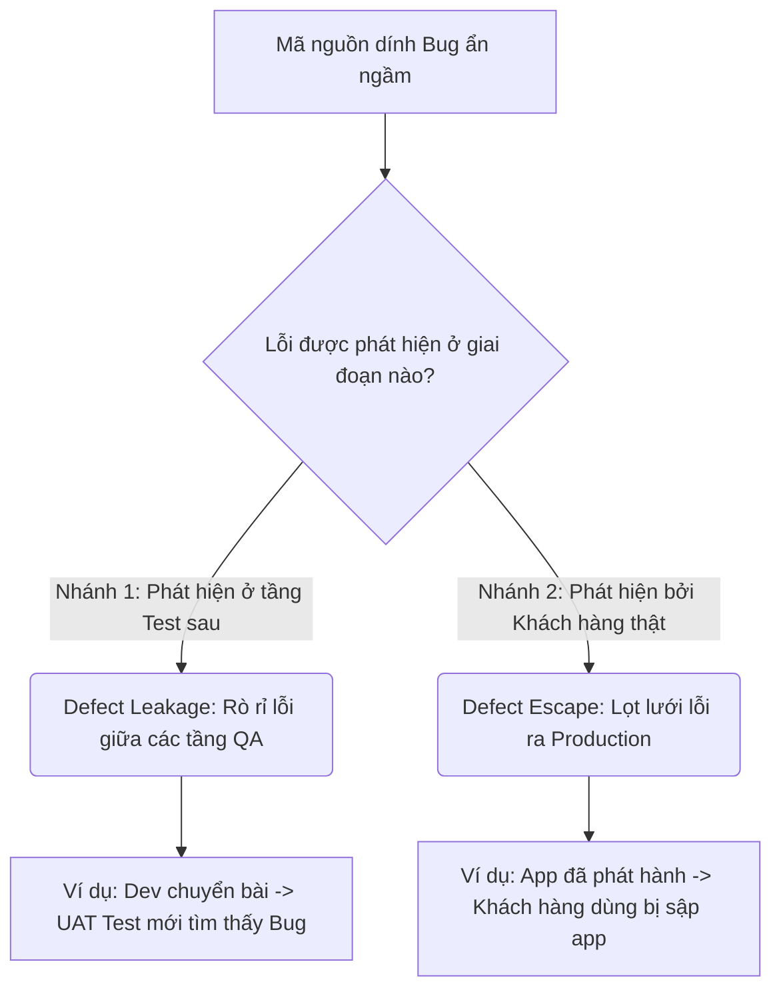
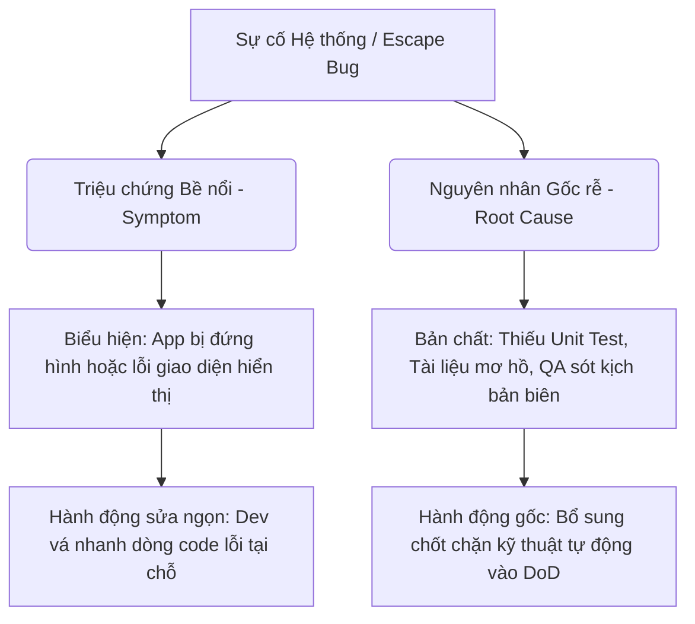

# 📁 04. Test Design & Bug Management

*Mục tiêu: Áp dụng các kỹ thuật tư duy toán học và logic để tối ưu hóa số lượng kịch bản kiểm thử, đồng thời làm chủ vòng đời của lỗi và quy trình quản lý Bug chuyên nghiệp.*

# **4.4. Bug Management & Lifecycle**

## 📌 Mục lục nội bộ (Chặng 04)

- [ ] [**4.1. Black-box Test Design Techniques**](./1_DesignTechniques.md)
- [ ] [**4.2. Experience-based Test Techniques**](./2_ExperienceTechniques.md)
- [ ] [**4.3. White-box Concepts**](./3_WhiteBoxConcepts.md)
- [ ] [**4.4. Bug Management & Lifecycle**](./4_BugManagement.md)
  - [ ] [4.4.1. How to Write a Professional Bug Report](#441-bug-report)
  - [ ] [4.4.2. Severity vs Priority (Độ nghiêm trọng vs Độ ưu tiên)](#442-severity-vs-priority)
  - [ ] [4.4.3. Bug Lifecycle (Vòng đời của Bug)](#443-bug-lifecycle)
  - [ ] [4.4.4. Retest & Regression Testing after Fix](#444-retest-after-fix)
  - [ ] [4.4.5. Defect Leakage vs Defect Escape](#445-defect-leakage-vs-defect-escape)
  - [ ] [4.4.6. Root Cause Analysis (RCA)](#446-root-cause-analysis)

---

## 🗺️ Bản đồ Tiến trình Từ Kỹ thuật Toán học đến Quản lý Lỗi

Sơ đồ dưới đây mô tả cách Tester áp dụng các kỹ thuật logic để bóp nghẹt số lượng ca test nhưng vẫn săn lùng Bug và quản lý chúng một cách có hệ thống:



---

# 4.4.1. How to Write a Professional Bug Report

**Bug Report (Báo cáo lỗi)** là một tài liệu kỹ thuật cốt lõi do Kỹ sư QA khởi tạo nhằm mục đích đặc tả chi tiết và chính xác về một khiếm khuyết phần mềm (`Defect`) được phát hiện trong quá trình thực thi kiểm thử. Đây không đơn thuần là một biểu mẫu ghi chép thủ tục, mà là **phương tiện giao tiếp kỹ thuật tối cao** đóng vai trò làm cầu nối thông tin trực tiếp giữa bộ phận Kiểm thử và bộ phận Phát triển (Developer).

Một bản báo cáo lỗi thiếu chuyên nghiệp, viết mơ hồ hoặc thiếu bằng chứng sẽ lập tức làm lãng phí thời gian điều tra của toàn đội, gây ra tranh chấp, hiểu lầm liên phòng ban và khiến lỗi bị treo trạng thái đóng băng. Ngược lại, một Bug Report chuyên nghiệp chuẩn quốc tế sẽ giúp Lập trình viên định vị chính xác vùng code lỗi, rút ngắn 50% thời gian sửa đổi (`Time-to-fix`) và đẩy nhanh tốc độ bàn giao sản phẩm.

## 📊 Luồng dịch chuyển Thông tin và Cấu trúc của một Bug Report đạt chuẩn

Mỗi phiếu báo lỗi khi đẩy lên hệ thống quản lý (Jira) cần phân bóc rõ ràng các khối thông tin cấu thành:



---

## 🛠️ Ma trận 8 Trường thông tin Bắt buộc của một Bug Report Chuyên nghiệp

Để đảm bảo bất kỳ lập trình viên nào đọc vào cũng có thể **Tự tái hiện lại được lỗi trên máy cá nhân của họ mà không cần phải gọi điện hỏi lại Tester**, một Bug Report thực chiến bắt buộc phải tuân thủ cấu trúc 8 trường thông tin nghiêm ngặt sau:

### 1. Defect Title (Tiêu đề Bug súc tích)
* **Quy chuẩn đặt tên:** Tiêu đề bắt buộc phải tuân theo công thức cấu trúc vàng: **`[Tên Module] Cái gì bị lỗi - Ở đâu - Trong điều kiện nào?`**
* *Ví dụ lỗi tồi:* `Nút thanh toán bị lỗi không bấm được.` (Dev sẽ không biết lỗi ở trang nào, dùng ví gì).
* *Ví dụ chuẩn chuyên gia:* `[Payment] App bị crash văng màn hình khi chọn phương thức thanh toán MoMo với đơn hàng trị giá 0 VND.`

### 2. Environment (Môi trường xảy ra lỗi)
* Đặc tả chi tiết hạ tầng hạ tầng nơi lỗi xuất hiện: Phiên bản ứng dụng (`Build v1.4.2`), loại thiết bị (`iPhone 14 Pro / Samsung Galaxy S23`), hệ điều hành (`iOS 17.2 / Android 14`), và tên trình duyệt sử dụng kèm phiên bản (`Chrome v122`).

### 3. Pre-conditions (Tiền điều kiện bắt buộc)
* Trạng thái nền bắt buộc của hệ thống hoặc tài khoản trước khi thực hiện bước 1.
* *Ví dụ:* `Tài khoản test đã được xác thực mã OTP, số dư ví hiện tại đang có 50.000 VND và giỏ hàng có sẵn 1 sản phẩm`.

### 4. Steps to Reproduce (Các bước tái hiện lỗi tuần tự)
* Đánh số thứ tự tuần tự gãy gọn từng hành động click chuột hoặc nhập liệu. Không viết thành một đoạn văn dài dòng.
* *Ví dụ:*
  1. Vào trang chi tiết sản phẩm A.
  2. Bấm nút "Thêm vào giỏ hàng".
  3. Đi tới màn hình Giỏ hàng và bấm nút "Thanh toán".
  4. Chọn phương thức thanh toán "Ví MoMo" và bấm nút "Xác nhận".

### 5. Actual Result (Kết quả thực tế ứng dụng đang làm sai)
* Mô tả chính xác hành vi hỏng hóc hiện tại của phần mềm.
* *Ví dụ:* `Ứng dụng đứng băng 5 giây, tự động tắt app (Crash) văng ra màn hình chủ của điện thoại`.

### 6. Expected Result (Kết quả mong đợi đúng chuẩn hải quan kỹ thuật)
* Trích dẫn chính xác logic đúng từ tài liệu đặc tả `SRS` hoặc `Acceptance Criteria (AC)`.
* *Ví dụ:* `Hệ thống hiển thị popup thông báo lỗi "Số dư tài khoản không đủ để thanh toán", nút Xác nhận bị khóa xám và giữ nguyên màn hình chọn phương thức`.

### 7. Evidence / Attachments (Khối bằng chứng thép)
* QA bắt buộc phải đính kèm đầy đủ: Ảnh chụp màn hình lỗi giao diện, Video ghi hình lại toàn bộ chuỗi hành động tái hiện từ bước 1, và tệp tin log kỹ thuật (Copy chuỗi JSON lỗi trả về từ tab **Network API** hoặc chụp mã lỗi đỏ ở tab **Console DevTools**).

### 8. Severity & Priority (Độ nghiêm trọng & Độ ưu tiên sơ khởi)
* Gán điểm số rủi ro ban đầu dựa trên ma trận rủi ro hệ thống để phân loại thứ tự sửa đổi.

---

## 🧠 Nguyên tắc Vàng thực chiến: "3 Điều Không" khi viết Bug Report cho QA

* **KHÔNG log Bug bằng cảm xúc cá nhân:** Tuyệt đối không dùng các từ ngữ mang tính chỉ trích, đổ lỗi trong Bug Report (Ví dụ: *"Dev viết code ẩu làm nút này bị hỏng"*). Hãy giữ thái độ trung lập, viết báo cáo bằng ngôn ngữ khách quan của số liệu và sự kiện kỹ thuật thực tế (Ví dụ: *"Hệ thống trả về mã lỗi 500"*).
* **KHÔNG gộp nhiều lỗi vào cùng một mã vé:** Quy tắc nghiêm ngặt: **Một Bug Ticket chỉ mô tả duy nhất một lỗi (`One Bug per Ticket`)**. Nếu bạn phát hiện màn hình Đăng nhập vừa bị viết sai chính tả, vừa bị crash app khi bấm nút, hãy tách chúng thành 2 vé độc lập, vì 2 lỗi này thuộc về 2 vùng code và có độ ưu tiên sửa đổi hoàn toàn khác nhau.
* **KHÔNG quên bước kiểm tra chéo trùng lặp:** Trước khi bấm nút Submit gửi vé, hãy tra cứu nhanh kho dữ liệu trên Jira xem có đồng nghiệp nào phát hiện và log cái lỗi này lên từ trước chưa, nhằm triệt tiêu hoàn toàn rủi ro phát sinh Bug rác trùng lặp (`Duplicate Bug`).

> ⚠️ **Tư duy chuyên gia cần nhớ:**
> Viết Bug Report chính là thương hiệu chuyên môn của một Manual Tester. Một Tester tập sự chỉ gửi lên một tấm ảnh chụp lỗi mờ nhạt và câu mô tả trống rỗng *"App lỗi rồi"*. Một Chuyên gia QA luôn dâng lên cho Developer một tập hồ sơ lỗi hoàn hảo, nơi có bước đi mạch lạc, có căn cứ đặc tả dẫn nguồn, và có sẵn tệp lệnh Log API chỉ thẳng mặt vùng hỏng hóc. Bản báo cáo lỗi sắc bén này sẽ khiến Developer nể phục, tự giác nhận vé về sửa code và không bao giờ có thể bấm nút từ chối (`Reject`) Bug của bạn.

## 📚 References (Tài liệu tham khảo 4.4.1)
* [ISTQB® Certified Tester Foundation Level (CTFL) Syllabus v4.0](https://istqb.org) - Section 5.5.1: *Defect Management (Defect Report Structure and Content).*
* [ISO/IEC/IEEE 29119-3:2021 Standard](https://iso.org) - *Software and systems engineering — Software testing — Part 3: Test documentation (Defect Report Template Standard).*

# 4.4.2. Severity vs Priority (Độ nghiêm trọng vs Độ ưu tiên)

Trong quy trình quản lý chất lượng phần mềm, **Severity (Độ nghiêm trọng)** và **Priority (Độ ưu tiên)** là hai thuộc tính định lượng cốt lõi bắt buộc phải gán cho mỗi vé Bug khi khởi tạo. Người mới bắt đầu thường nhầm lẫn hoặc gộp chung hai khái niệm này, dẫn đến việc đánh giá sai lệch rủi ro và gây nhiễu thông tin hệ thống.

Để vận hành kho lỗi (`Bug Backlog`) hiệu quả, đặc biệt trong các buổi họp **Bug Triage (Sàng lọc lỗi)** giữa PO, PM, Dev Lead và QA Lead, việc phân tách rõ ràng hai lăng kính: *Lăng kính Kỹ thuật (Severity)* và *Lăng kính Kinh doanh (Priority)* là quy chuẩn bắt buộc để tối ưu hóa tài nguyên thời gian của dự án.

## 📊 Mô hình Hai lăng kính Định lượng Giá trị của một Bug Ticket

Hội đồng Bug Triage sử dụng hai chỉ số này làm tọa độ để quyết định số phận và thứ tự sửa code của một lỗi:



---

## 🛠️ Ma trận Phân cấp Tiêu chuẩn: Severity vs Priority

### 1. Phân cấp Severity (Độ nghiêm trọng kỹ thuật) — Quyền quyết định của QA
* **Blocker (Chặn hệ thống):** Lỗi làm sập nguồn, chết server, văng ứng dụng (`Crash`) ngay khi mở. Tester bị chặn đứng hoàn toàn, không thể test tiếp các tính năng khác.
* **Critical (Nghiêm trọng):** Lỗi làm hỏng hoàn toàn luồng nghiệp vụ chính của tính năng mà không có cách nào né tránh (Ví dụ: Tính năng Thanh toán lỗi không bấm được).
* **Major (Cao):** Tính năng lớn chạy sai logic nhưng vẫn có một giải pháp tạm thời (`Workaround`) để đi tiếp.
* **Minor / Trivial (Thấp/Vặt):** Lỗi chính tả, lỗi vỡ font nhẹ, sai màu sắc nút bấm không ảnh hưởng luồng đi của dữ liệu.

### 2. Phân cấp Priority (Độ ưu tiên tiến độ) — Quyền quyết định của PM/PO
* **P1 - Immediate / High (Sửa ngay lập tức):** Bug bắt buộc phải vá lỗi trong vòng vài giờ hoặc trong ngày, chặn đứng việc xuất bản phần mềm.
* **P2 - Medium (Sửa trong Sprint):** Bug cần được sửa đổi và nghiệm thu trước khi kết thúc chu kỳ Sprint hiện tại.
* **P3 - Low (Sửa khi có thời gian):** Bug có thể hoãn lại (`Deferred`), xếp hàng chờ xử lý ở các phiên bản cập nhật xa hơn tương lai.

---

## 💡 Ma trận 4 Tình huống Sai lệch Chéo (Cross-Matrix Examples)

Tester chuyên nghiệp không bao giờ mặc định *Severity Cao thì Priority phải Cao*. Bạn cần làm chủ 4 vùng tọa độ chéo kinh đoán sau:

```markdown
                     Severity CAO                      Severity THẤP
          ┌─────────────────────────────────┬─────────────────────────────────┐
          │ [Tình huống 1]                  │ [Tình huống 2]                  │
          │ Severity CAO / Priority CAO     │ Severity THẤP / Priority CAO    │
Priority  │ - Sập app khi bấm Thanh toán    │ - Sai chính tả tên Thương hiệu  │
  CAO     │ - Mất tiền của khách hàng       │ - Sai màu sắc Logo trang chủ    │
          ├─────────────────────────────────┼─────────────────────────────────┤
          │ [Tình huống 3]                  │ [Tình huống 4]                  │
          │ Severity CAO / Priority THẤP    │ Severity THẤP / Priority THẤP   │
Priority  │ - Sập app trên Windows XP (2001)│ - Lỗi vỡ font nhẹ ở trang       │
 THẤP     │ - Lỗi ở tính năng hiếm ai vào  │   "Điều khoản sử dụng" sâu bên  │
          └─────────────────────────────────┴─────────────────────────────────┘
```

* **Tình huống 2 (Severity THẤP nhưng Priority CAO):** Tên thương hiệu công ty trên trang chủ bị viết sai chính tả (Ví dụ: Ngân hàng *Vietcombank* viết nhầm thành *Vietconbank*). V về kỹ thuật, hệ thống không sập, khách hàng vẫn chuyển tiền bình thường (Severity Minor). Nhưng về kinh doanh, nó phá hủy uy tín hình ảnh công ty ngay lập tức (Priority High -> Bắt buộc Dev phải sửa ngay trong vài phút).
* **Tình huống 3 (Severity CAO nhưng Priority THẤP):** Ứng dụng bị sập hoàn toàn (`Crash`) nếu người dùng sử dụng hệ điều hành Windows XP bản cổ từ năm 2001 để truy cập. Về kỹ thuật, lỗi làm chết app (Severity Critical). Nhưng về kinh doanh, tệp khách hàng dùng hệ điều hành này chiếm chưa tới 0.01% tổng user, doanh nghiệp không dồn lực sửa (Priority Low -> Treo hoãn xử lý sau).

---

## 🧠 Kỹ thuật xử lý Xung đột và Tranh chấp tại buổi Bug Triage

Trận chiến lớn nhất tại buổi họp sàng lọc luôn xoay quanh việc Developer muốn hạ thấp độ nghiêm trọng của Bug để giảm chỉ số lỗi cá nhân, còn QA muốn nâng cao lên để ép sửa đổi. Chuyên gia QA áp dụng ma trận 2 nguyên tắc thép sau để làm chủ cuộc họp:

* **Nói chuyện bằng ngôn ngữ Bằng chứng và Dữ liệu kỹ thuật:** Tuyệt đối không tranh cãi cảm tính kiểu *"Tôi cảm thấy cái này lỗi nặng lắm"*. Hãy chìa ra file log API lỗi `500 Internal Server Error`, mã lỗi JavaScript đỏ rực ở tab Console DevTools, hoặc video quay lại cảnh app đơ 10 giây. Bằng chứng kỹ thuật sắc bén là thứ không thể bác bỏ.
* **Đổi góc nhìn sang Rủi ro Kinh doanh (Business Impact):** Nếu Dev từ chối sửa vì cho rằng *"Lỗi này hiếm gặp, user không ai rảnh thao tác dị biệt như vậy đâu"*, QA hãy quay sang thuyết phục Product Owner (PO) bằng lăng kính dòng tiền: *"Nếu 1% khách hàng VIP dính phải lỗi này đúng vào ngày mở bán Black Friday, doanh nghiệp sẽ tổn thất bao nhiêu doanh thu?"*. Khi PO lên tiếng bảo vệ trải nghiệm user để giữ dòng tiền, Dev bắt buộc phải nhận vé về sửa code.

## 📚 References (Tài liệu tham khảo 4.4.2)
* [ISTQB® Certified Tester Foundation Level (CTFL) Syllabus v4.0](https://istqb.org) - Section 5.5.2: *Defect Management (Defect Triage and Severity/Priority Classification).*
* **Gerardus Blakker (2019)** - *The Art of Bug Triaging in Agile Teams*, Software Quality Management Insights.

# 4.4.3. Bug Lifecycle

**Bug Lifecycle (Vòng đời của Bug / Khiếm khuyết)** là một quy trình kỹ thuật chuẩn hóa quy định về **tập hợp tất cả các trạng thái thay đổi liên tục của một lỗi phần mềm**, tính từ thời điểm Bug được Kỹ sư QA phát hiện và khai báo lên hệ thống quản lý (như Jira, Redmine) cho đến khi lỗi được sửa đổi, nghiệm thu và đóng lại hoàn toàn.

Vòng đời của Bug hoạt động như một máy trạng thái nghiêm ngặt (`State Machine`). Nó định vị chính xác ranh giới làm việc, vai trò và trách nhiệm hành động của từng nhân sự (Tester, Developer, Project Manager) tại mỗi tích tắc thời gian, đảm bảo không một lỗi nào bị bỏ quên hoặc xử lý sai quy trình kỹ thuật.

## 📊 Sơ đồ Dòng trạng thái Chuẩn hóa của Vòng đời Bug

Sơ đồ Mermaid dưới đây mô tả chính xác luồng di chuyển và các nhánh rẽ ranh giới của một Bug Ticket đạt chuẩn dự án:



---

## 🛠️ Ma trận Chi tiết Ý nghĩa Kỹ thuật của từng Trạng thái Bug

Để phối hợp nhịp nhàng liên phòng ban, toàn bộ đội ngũ dự án bắt buộc phải tuân thủ nghiêm ngặt định nghĩa của các trạng thái sau:

### 1. NEW (Khởi tạo mới)
* **Bản chất:** Trạng thái đầu tiên khi Tester phát hiện sự sai lệch logic hệ thống và viết phiếu báo lỗi (`Bug Report`) lên Jira. Bug lúc này ở dạng thô, chưa có người chịu trách nhiệm sửa.

### 2. OPEN / ASSIGNED (Tiếp nhận & Chỉ định)
* **Bản chất:** Test Lead hoặc Project Manager (PM) duyệt qua lỗi, xác nhận Bug hợp lệ và chỉ định (`Assign`) đích danh Developer chịu trách nhiệm vùng code đó vào xử lý. Developer mở vé lên để bắt đầu nghiên cứu các bước tái hiện (`Steps to Reproduce`).

### 3. IN PROGRESS (Đang xử lý)
* **Bản chất:** Developer chính thức bắt tay vào viết mã nguồn ngầm trên máy cá nhân (`Local`) để sửa đổi hàm logic hoặc vá lỗ hổng kỹ thuật của Bug.

### 4. RESOLVED / FIXED (Đã sửa đổi / Sẵn sàng chờ Test)
* **Bản chất:** Developer đã sửa xong code, tự chạy Unit Test xác nghiệm an toàn và triển khai (`Deploy`) phiên bản vá lỗi này lên môi trường kiểm thử sạch (`QA/Staging Environment`). Vé Bug được ném ngược lại cho Tester để yêu cầu kiểm tra lại.

### 5. DEFERRED / POSTPONED (Hoãn lại)
* **Bản chất:** Product Owner (PO) hoặc PM xác nhận đây là lỗi thực tế (thường là lỗi mức độ Low/Minor), nhưng do dự án sắp đến ngày phát hành cốt lõi, nguồn lực không đủ, lỗi này được phép hoãn lại để xếp hàng xử lý ở các Sprint tiếp theo.

### 6. CLOSED (Đóng vĩnh viễn)
* **Bản chất:** **Trạng thái thuộc quyền sở hữu độc quyền của Tester**. Sau khi nhận trạng thái Resolved, Tester tiến hành chạy **Kiểm thử lại (`Retesting`)**. Nếu hệ thống chạy đúng 100% kết quả mong đợi, Tester tự tay bấm nút chuyển Bug sang `CLOSED` để kết thúc vòng đời lỗi an toàn. Nếu Retest bị **FAIL**, Tester bấm nút **RE-OPEN** để đẩy ngược vé về trạng thái `OPEN` bắt Dev sửa lại từ đầu.

---

## 🛠️ Chiến lược Thực chiến Xử lý Bug rác và Bug trùng chéo trên Jira

Trong thực tế thực thi, kho lưu trữ lỗi (`Bug Backlog`) cần được duy trì ở trạng thái sạch sẽ để tránh bóp méo các chỉ số đo lường hiệu suất (`QA Metrics`). QA thực hiện hai quy trình đóng khép kín sau đối với các trạng thái đặc biệt:

### 1. Quy trình xử lý REJECTED / INVALID Bugs (Bug sai / Không hợp lệ)
Lỗi này xuất hiện do Tester đọc sai tài liệu đặc tả, test trên môi trường chưa được cập nhật code mới, nạp sai dữ liệu tiền điều kiện, hoặc do lỗi mạng chập chờn từ máy cá nhân của Tester chứ hệ thống không hề hỏng.
* **Quy tắc văn minh ứng xử:** Khi Developer bấm từ chối vé Bug với lý do *"Không phải lỗi"*, Tester tuyệt đối không tự ái hay tranh cãi gay gắt. Hãy mở lại tài liệu đặc tả mới nhất để kiểm tra chéo chốt chặn.
* **Hành động của QA (Tester thực sự hiểu sai):** QA viết một lời bình luận (`Comment`) văn minh chuyên nghiệp trực tiếp vào vé: *"Cảm ơn Dev đã kiểm tra. Mình đã rà soát lại tài liệu mục REQ_02 bản mới nhất và xác nhận hệ thống đang chạy đúng thiết kế. Mình xin phép đóng vé này"*. Sau đó tự tay bấm chuyển trạng thái vé sang `REJECTED / INVALID` để dọn sạch kho lỗi.
* **Hành động của QA (Tài liệu viết mơ hồ):** Nếu logic này chưa từng được quy định trong tài liệu, QA giữ nguyên trạng thái vé và gắn thẻ (`Tag`) Product Owner vào cuộc hội thoại để PO đưa ra quyết định chốt luồng nghiệp vụ.

### 2. Quy trình xử lý DUPLICATE Bugs (Bug trùng lặp)
Lỗi này xảy ra khi nhiều Tester cùng test chung một hệ thống và vô tình khai báo cùng một lỗi; hoặc một Bug gốc ngầm tạo ra nhiều hệ quả lỗi hiển thị khác nhau ở các màn hình khác nhau khiến Tester lầm tưởng là các lỗi độc lập.
* **Bước 1 - Định vị vé gốc:** Tra cứu kho dữ liệu bằng các từ khóa cốt lõi để tìm ra tấm vé Bug đầu tiên được khởi tạo cho lỗi này (`Original Ticket`).
* **Bước 2 - Liên kết liên thông (`Issue Linking`):** Trên giao diện Jira của chiếc vé trùng lặp mới, bấm vào nút **Link Issue**, chọn mối quan hệ là `is duplicate of` và điền mã ID của chiếc vé gốc vào.
* **Bước 3 - Di chuyển bằng chứng kỹ thuật:** Nếu chiếc vé trùng lặp mới có chứa video quay màn hình sắc nét hơn, hoặc có bắt được file log API chi tiết hơn, QA tiến hành copy toàn bộ bằng chứng giá trị đó đem ném vào phần bình luận của vé gốc để hỗ trợ Dev sửa code nhanh hơn.
* **Bước 4 - Đóng vé:** Bấm chuyển trạng thái chiếc vé trùng lặp sang `DONE` với lý do đóng vé (`Resolution`) chọn đích danh là **Duplicate**.

> ⚠️ **Tư duy chuyên gia cần nhớ:**
> Ranh giới sinh tử và tranh chấp lớn nhất trong dự án thường diễn ra giữa trạng thái `RESOLVED` và `CLOSED`. Developer rất muốn đóng Bug nhanh để đạt chỉ số KPIs công việc, họ thường thúc ép Tester đóng Bug. Tuy nhiên, tư duy phản biện (`Critical Thinking`) bắt buộc Tester tuyệt đối không đóng Bug bằng miệng hoặc qua chat. Bạn chỉ được phép bấm nút chuyển trạng thái sang `CLOSED` khi và chỉ khi: **Bạn đã thực thi Retesting thành công trên môi trường test sạch và đính kèm đầy đủ bằng chứng hình ảnh/log hệ thống chứng minh lỗi đã hết sạch vĩnh viễn**.

## 📚 References (Tài liệu tham khảo 4.3.3)
* [ISTQB® Certified Tester Foundation Level (CTFL) Syllabus v4.0](https://istqb.org) - Section 5.5.1: *Defect Management (Defect Lifecycle states & Defect Rejection).*
* [ISO/IEC/IEEE 29119-3:2021 Standard](https://iso.org) - *Software and systems engineering — Software testing — Part 3: Test documentation (Defect Report Status Transition Guideline).*
* **Atlassian Jira Guide (2024)** - *Best Practices for Managing and Linking Duplicate Issues in Enterprise Projects*, Atlassian Knowledge Base.

# 4.4.4. Retest & Regression Testing after Fix

Trong giai đoạn thực thi kiểm thử (`Test Execution`), sau khi Tester phát hiện ra lỗi, lập báo cáo Bug report lên Jira và Developer tiến hành sửa code, hệ thống sẽ trả về một bản Build mới để QA xác nghiệm. Tại thời điểm này, Tester bắt buộc phải thực hiện song hành hai hoạt động: **Retesting (Kiểm thử lại)** và **Regression Testing (Kiểm thử hồi quy)**.

Đây là hai khái niệm cốt lõi vận hành khâu quản lý lỗi, có bản chất và mục tiêu kỹ thuật hoàn toàn khác biệt nhưng bắt buộc phải phối hợp nhịp nhàng để đảm bảo tính toàn vẹn của sản phẩm trước khi xuất xưởng.

## 📊 Mô hình Luồng Xử lý Mã nguồn và Vị trí của Retest & Regression Test

Quy trình chốt chặn lỗi giúp Tester định vị chính xác chuỗi hành động sau khi Developer sửa code:



---

## 🛠️ Ma trận Phân biệt Chuyên sâu: Retesting vs Regression Testing

Để vận hành quy trình quản lý chất lượng một cách chuyên nghiệp, Tester cần phân tách rõ ma trận đối chiếu 5 tiêu chí kỹ thuật nghiêm ngặt sau:

| Tiêu chí phân biệt | Retesting (Kiểm thử lại) | Regression Testing (Kiểm thử hồi quy) |
| :--- | :--- | :--- |
| **Bản chất kỹ thuật** | Kiểm tra **Tính đúng đắn trực tiếp** của bản sửa lỗi (`Confirmation Testing`). | Kiểm tra **Tính an toàn / Không bị ảnh hưởng lây** của toàn bộ hệ thống cũ. |
| **Thời điểm kích hoạt** | Thực hiện ngay lập tức khi nhận được thông báo Developer đã sửa xong Bug trên Jira. | Thực hiện sau khi bài test Retesting đã vượt qua (`PASS`) và vào cuối mỗi chu kỳ dự án. |
| **Phạm vi bao phủ** | **Cực hẹp**: Chỉ chạy lại đúng 1 hoặc một vài Test Case cụ thể từng bị đánh trạng thái `FAIL`. | **Rộng**: Quét qua 100% các tính năng cũ đang chạy ổn định của hệ thống. |
| **Mục tiêu của QA** | Xác nhận xem Developer đã sửa hết lỗi của cái Bug cụ thể đó hay chưa. | Đảm bảo việc sửa Bug mới hoặc chèn code mới không vô tình làm hỏng các tính năng cũ. |
| **Khả năng tự động hóa**| **Thấp**: Thường được Tester thực hiện bằng tay (`Manual`) do lỗi phát sinh rất đa dạng và đặc thù. | **Cực cao**: Là đối tượng tối cao để viết mã **Automation Test** nhằm chạy đi chạy lại liên tục trên pipeline CI/CD. |

---

## 💡 Ví dụ thực tế liên hoàn (Tính năng Giỏ hàng - Mua sắm Online)

Hãy tưởng tượng bạn đang kiểm thử một ứng dụng mua sắm trực tuyến, chuỗi hành động phối hợp giữa Retest và Regression sẽ diễn ra như sau:

1. **Phát hiện lỗi gốc:** Ở chu kỳ trước, bạn tìm thấy một lỗi nghiêm trọng: *"Khi người dùng tăng số lượng sản phẩm lên 10 chiếc trong giỏ hàng, hệ thống tính sai tổng số tiền"*. Bạn log Bug lên Jira.
2. **Thực thi Retesting:** Hôm sau, Dev báo đã sửa xong code tính tiền. Bạn nhận Build mới, vào lại đúng giỏ hàng, nạp đúng dữ liệu 10 sản phẩm và bấm nút tính tiền. Hệ thống hiển thị số tiền chính xác 100%. Bài Retesting của bạn **PASS**. Bạn tự tin đóng cái Bug đó lại.
3. **Thực thi Regression Testing:** Ngay sau đó, tư duy phản biện (`Critical Thinking`) cảnh báo bạn: *Để sửa cái hàm tính tiền này, Dev đã chạm vào mã nguồn dùng chung của toàn bộ module Giỏ hàng*. Bạn lập tức mở bộ kịch bản Test hồi quy (`Regression Suite`) ra để quét lại các tính năng cũ lân cận: *Xóa sản phẩm khỏi giỏ, áp mã coupon giảm giá, đổi địa chỉ nhận hàng*. 
4. **Phát hiện lỗi hồi quy:** Kinh ngạc thay, khi bạn bấm nút xóa sản phẩm, app bị sập nguồn (`Crash`). Lỗi xóa sản phẩm này hôm qua chạy rất tốt, nhưng hôm nay bị hỏng do Dev sửa hàm tính tiền chạm nhầm code. Bạn đã phát hiện ra một **Lỗi hồi quy (Regression Bug)** nghiêm trọng và lập tức tạo một Bug Ticket hoàn toàn mới trên Jira.

> ⚠️ **Tư duy chuyên gia cần nhớ:**
> Retesting là hoạt động hướng về **Quá khứ** (để chốt lại những cái sai đã biết), còn Regression Testing là hoạt động hướng về **Tương lai** (để bảo vệ sự an toàn của những cái đang đúng). Sai lầm lớn nhất của một Tester tập sự là chỉ làm Retesting thấy hết lỗi là vội vàng báo cáo Done việc. Code phần mềm là một mạng lưới chằng chịt, chạm một sợi dây có thể làm rung động cả hệ thống. Hãy luôn chạy Test hồi quy để bảo vệ chiếc lưới an toàn chất lượng của bạn.

## 📚 References (Tài liệu tham khảo 4.4.4)
* [ISTQB® Certified Tester Foundation Level (CTFL) Syllabus v4.0](https://istqb.org) - Section 2.3.3: *Retesting and Regression Testing.*
* [ISO/IEC/IEEE 29119-2:2021 Standard](https://iso.org) - *Software and systems engineering — Software testing — Part 2: Test processes (Regression Testing Control Quy chuẩn Kiểm thử Hồi quy).*

# 4.4.5. Defect Leakage vs Defect Escape

Trong khâu quản lý và đo lường chỉ số chất lượng kiểm thử (`QA Metrics`), **Defect Leakage (Rò rỉ lỗi)** và **Defect Escape (Lọt lưới lỗi)** là cặp chỉ số đo lường hiệu suất sinh tử phản ánh trực tiếp năng lực thiết kế kịch bản, độ bao phủ kiểm thử và mức độ cẩn trọng của đội ngũ QA/Tester trước khi xuất xưởng sản phẩm. 

Cả hai chỉ số này đều dùng để định lượng về **những chiếc Bug bị Tester bỏ sót**, nhưng chúng được phân tách nghiêm ngặt dựa trên ranh giới môi trường cài đặt và đối tượng phát hiện ra lỗi.

## 📊 Mô hình Ranh giới Phân loại của Lỗi Rò rỉ và Lỗi Lọt lưới

Sơ đồ khối mô tả vị trí đánh giá sai sót của Tester dựa trên các chốt chặn môi trường hệ thống:



---

## 🛠️ Ma trận Kỹ thuật và Công thức Toán học Định lượng

### 1. Defect Leakage (Tỷ lệ rò rỉ lỗi giữa các tầng kiểm thử)
* **Bản chất kỹ thuật:** Là hiện tượng một lỗi đáng lẽ phải được chặn đứng và phát hiện ở tầng kiểm thử trước, nhưng Tester lại bỏ sót và để nó "rò rỉ" sang tầng kiểm thử sau hoặc đợt kiểm thử của một đội nhóm khác.
* *Ví dụ:* Lỗi vỡ font màn hình Đăng nhập đáng lẽ phải được dọn sạch ở tầng `System Testing` do đội QA nội bộ chạy. Nhưng QA bỏ sót, đến khi đẩy app sang môi trường khách hàng chạy thử `UAT Testing`, người dùng của đối tác mới bắt bài ra cái lỗi này.
* **Công thức tính toán:**
  $$\text{Defect Leakage Rate (\%)} = \left( \frac{\text{Tổng số Bug được tìm thấy ở tầng sau}}{\text{Tổng số Bug của toàn bộ dự án}} \right) \times 100\%$$

### 2. Defect Escape (Tỷ lệ lọt lưới lỗi ra môi trường thực tế)
* **Bản chất kỹ thuật:** Là thảm họa chất lượng khi toàn bộ hệ thống phòng ngự của QA (Smoke, Sanity, System, Regression, UAT) đều bị bất lực, khiến Bug vượt biên thành công đi thẳng ra **Môi trường vận hành thực tế (Production Environment)** và bị bóc phốt bởi chính khách hàng thật đang xài app.
* *Ví dụ:* Ứng dụng ví điện tử cập nhật phiên bản mới, khách hàng mở lên bấm nút chuyển tiền thì ứng dụng bị văng lập tức (`Crash`). Đây là một Escape Bug chí tử phá hủy trực tiếp doanh thu của công ty.
* **Công thức tính toán:**
  $$\text{Defect Escape Rate (\%)} = \left( \frac{\text{Tổng số Bug do Khách hàng/User báo từ Production}}{\text{Tổng số Bug (QA tìm được + Khách hàng tìm được)}} \right) \times 100\%$$

---

## 🧠 Ý nghĩa Vàng của Bộ chỉ số đối với khâu Tối ưu hóa Quy trình

Một đội ngũ QA chuyên nghiệp không bao giờ giấu giếm chỉ số Lỗi rò rỉ và Lọt lưới. Bạn cần sử dụng hai con số này để làm bàn đạp cải tiến năng suất liên tục:

* **Nếu chỉ số Defect Leakage cao:** Báo động đỏ cho thấy sự phối hợp giữa các tầng kiểm thử đang bị gãy luồng. QA Lead cần mở lại bộ kịch bản của tầng trước để kiểm tra: *Vì sao ca test đó không được thiết kế? Do Tester lười chạy hay do tài liệu yêu cầu viết thiếu?* Từ đó tiến hành vá lỗ hổng kịch bản ngay lập tức.
* **Nếu chỉ số Defect Escape cao:** Đây là thước đo trực tiếp chứng minh **Sự thất bại của bộ máy chốt chặn chất lượng**. Ban giám đốc có quyền quy trách nhiệm năng lực cho Test Lead. Khi một Escape Bug xuất hiện, QA Lead bắt buộc phải lập tức kích hoạt quy trình **Phân tích nguyên nhân gốc rễ (Root Cause Analysis - RCA)** để tìm ra chốt chặn an toàn cho các chu kỳ sau.

> ⚠️ **Tư duy chuyên gia cần nhớ:**
> Đạt chỉ số Bug tìm được trong văn phòng bằng 0 không có nghĩa là bạn giỏi, nếu chỉ số Defect Escape ngoài Production của bạn vọt lên cấp số nhân. Một Chuyên gia QA thực thụ coi Defect Escape Rate là **Chỉ số sinh tử**. Mục tiêu tối hậu của hoạt động kiểm thử không phải là triệt tiêu 100% mọi loại lỗi vặt vãnh, mà là thiết lập ma trận chốt chặn rủi ro (`Risk-based Testing`) sao cho chỉ số Defect Escape của các lỗi mức độ Blocker/Critical bắt buộc phải giữ vững ở mức **0%** để bảo vệ dòng tiền an toàn cho doanh nghiệp.

## 📚 References (Tài liệu tham khảo 4.4.5)
* [ISTQB® Certified Tester Foundation Level (CTFL) Syllabus v4.0](https://istqb.org) - Section 5.5.3: *Defect Management (Quality Metrics and Defect Tracking Indicators).*
* **John Watkins (2010)** - *Testing IT: An Off-the-Shelf Software Testing Process*, Cambridge University Press.

# 4.4.6. Root Cause Analysis (RCA)

**Root Cause Analysis (RCA - Phân tích Nguyên nhân Gốc rễ)** là một quy trình kỹ thuật mang tính phản biện cao, được kích hoạt ngay khi hệ thống phát sinh các sự cố chất lượng nghiêm trọng hoặc khi xuất hiện lỗi lọt lưới ra môi trường thực tế (`Defect Escape`). 

Mục tiêu tối cao của RCA không phải là tìm một cá nhân để đổ lỗi hay chỉ sửa phần ngọn bề nổi của lỗi. RCA là hoạt động **đào sâu xuống các tầng kiến trúc ngầm để tìm ra nguyên nhân gốc rễ sinh ra sai sót trong quy trình**, từ đó thiết lập các chốt chặn kỹ thuật và hành động cải tiến (`Action Items`) nhằm triệt tiêu hoàn toàn khả năng tái phát của lỗi đó trong tương lai.

## 📊 Mô hình Phân tách Giữa Triệu chứng Bề nổi và Nguyên nhân Gốc rễ

Quy trình phân tích giúp toàn đội nhìn xuyên qua hiện tượng bề nổi để định vị chính xác lỗ hổng quy trình:



---

## 🛠️ Ma trận 2 Vũ khí Tư duy Phân tích RCA Thực chiến

Để bóc tách một sự cố mà không bị lạc luồng vào các tranh cãi cảm tính, Hội đồng Triage áp dụng hai kỹ thuật định lượng tiêu chuẩn quốc tế sau:

### 1. Kỹ thuật 5 Whys (Năm câu hỏi "Tại sao")
* **Cơ chế vận hành:** Liên tục đặt câu hỏi "Tại sao" liên tiếp ít nhất 5 lần đối với sự cố hiện tại. Câu trả lời của chữ "Tại sao" trước sẽ là gốc rễ để phát sinh câu hỏi "Tại sao" tiếp theo, tạo thành một chuỗi nhân quả tuyến tính dẫn thẳng đến lỗ hổng quy trình.
* *Ví dụ thực tế chuỗi 5 Whys:*
  * *Why 1:* Tại sao hệ thống tính sai số tiền thuế trên Production? -> *Vì hàm tính toán code sai.*
  * *Why 2:* Tại sao hàm tính toán code sai mà Dev không biết? -> *Vì Dev viết thiếu Unit Test cho luồng tính thuế.*
  * *Why 3:* Tại sao Dev lại viết thiếu Unit Test? -> *Vì dự án bị ép tiến độ và Unit Test không phải là Task bắt buộc.*
  * *Why 4:* Tại sao QA cũng không phát hiện ra lỗi này ở Staging? -> *Vì bộ kịch bản Test Case của QA chỉ test số nguyên, bỏ sót kịch bản số thập phân.*
  * *Why 5 (Root Cause):* Tại sao tài liệu không ghi rõ phải xử lý số thập phân? -> *Vì BA viết tài liệu yêu cầu nghiệp vụ mơ hồ và team không họp review tài liệu từ đầu (Thiếu Shift-Left).*

### 2. Sơ đồ Xương cá Ishikawa (Fishbone Diagram)
* **Cơ chế vận hành:** Khi sự cố quá phức tạp và do nhiều yếu tố đan cài, QA Lead vẽ sơ đồ xương cá để phân loại nguyên nhân thành 4 nhánh chính: **Con người** (Manpower - thiếu kỹ năng, hiểu nhầm logic), **Quy trình** (Process - thiếu chốt chặn DoR/DoD), **Công cụ/Môi trường** (Machine/Tools - data test bị nhiễm bẩn, lỗi mạng lag), và **Tài liệu** (Material - tài liệu SRS lỗi thời).

---

## 🛠️ Kỹ thuật Đóng hộp Hành động Cải tiến (Action Items Template)

Một buổi họp RCA sẽ hoàn toàn vô nghĩa nếu kết thúc bằng những câu hứa suông. QA Lead bắt buộc phải số hóa các giải pháp thành các **Action Items đạt chuẩn SMART** (Rõ ràng, đo lường được, có người chịu trách nhiệm và có hạn chót) chèn thẳng vào Jira như một Task bắt buộc:

| Mã Task ID | Hành động Cải tiến Quy trình (Action Item Description) | Người thực hiện (Assignee) | Chốt chặn áp dụng (Process Gate) | Hạn chót (Deadline) |
| :--- | :--- | :---: | :--- | :---: |
| `ACT_QA_402` | Bổ sung thêm 5 kịch bản biên giá trị thập phân vào bộ kịch bản **Regression Test Suite** của module Thuế. | Tester Nguyễn Văn A | STLC - Giai đoạn Thiết kế | 05/09/2026 |
| `ACT_DEV_512` | Viết bổ sung mã kiểm thử tự động (`Unit Test`) cho hàm `calculateTax()`, cấu hình tỷ lệ phủ code > 85%. | Developer Trần Văn B | SDLC - Định nghĩa Hoàn thành (`DoD`) | 08/09/2026 |
| `ACT_BA_105` | Cập nhật lại mục số 4.2 của tài liệu đặc tả `SRS` để làm rõ cơ chế làm tròn số tiền của các quốc gia. | BA Lê Thị C | SDLC - Định nghĩa Sẵn sàng (`DoR`) | 04/09/2026 |

> ⚠️ **Tư duy chuyên gia cần nhớ:**
> Trong thực tế quản lý chất lượng, cuộc họp RCA bắt buộc phải vận hành theo tinh thần **Blameless RCA (Phân tích không đổ lỗi)**. Nếu hệ thống lọt lưới Bug ra ngoài, đó là lỗi của cả một hệ thống chốt chặn chất lượng hoạt động lỏng lẻo, chứ không phải do một cá nhân Lập trình viên hay Tester cẩu thả. Việc tạo dựng bầu không khí an toàn, minh bạch, tập trung vào việc **vá lỗ hổng quy trình** thay vì chỉ trích con người là chìa khóa vàng để toàn đội tự giác nâng cấp năng lực kỹ thuật và hướng tới tư duy **Quality Ownership**.

## 📚 References (Tài liệu tham khảo 4.4.6)
* [ISTQB® Certified Tester Foundation Level (CTFL) Syllabus v4.0](https://istqb.org) - Section 1.2.1: *The Context of Defects, Root Causes, and Effects* & Section 5.5: *Defect Management (Root Cause Analysis).*
* **Thomas J. McCabe (1976)** - *A Complexity Measure*, IEEE Transactions on Software Engineering.
* [ISO/IEC/IEEE 29119-2:2021 Standard](https://iso.org) - *Software and systems engineering — Software testing — Part 2: Test processes (Defect Correction and Process Improvement Framework Quy chuẩn Khắc phục và Cải tiến Quy trình).*

