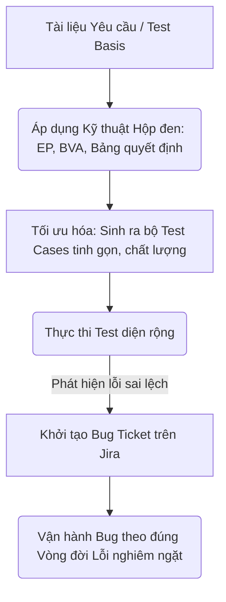

# 📁 04. Test Design & Bug Management

*Mục tiêu: Áp dụng các kỹ thuật tư duy toán học và logic để tối ưu hóa số lượng kịch bản kiểm thử, đồng thời làm chủ vòng đời của lỗi và quy trình quản lý Bug chuyên nghiệp.*

## 📌 Mục lục nội bộ (Chặng 04)

- [ ] [**4.1. Black-box Test Design Techniques**](./1_DesignTechniques.md)
  - [ ] [4.1.1. Equivalence Partitioning (EP)](./1_DesignTechniques.md#411-equivalence-partitioning-ep)
  - [ ] [4.1.2. Boundary Value Analysis (BVA)](./1_DesignTechniques.md#412-boundary-value-analysis-bva)
  - [ ] [4.1.3. Decision Table Testing](./1_DesignTechniques.md#413-decision-table-testing)
  - [ ] [4.1.4. State Transition Testing](./1_DesignTechniques.md#414-state-transition-testing)
  - [ ] [4.1.5. Use Case Testing](./1_DesignTechniques.md#415-use-case-testing)
  - [ ] [4.1.6. Pairwise / Orthogonal Array Testing](./1_DesignTechniques.md#416-pairwise-testing)
- [ ] [**4.2. Experience-based Test Techniques**](./2_ExperienceTechniques.md)
  - [ ] [4.2.1. Error Guessing](./2_ExperienceTechniques.md#421-error-guessing)
  - [ ] [4.2.2. Exploratory Testing](./2_ExperienceTechniques.md#422-exploratory-testing)
  - [ ] [4.2.3. Checklist-based & Ad-hoc Testing](./2_ExperienceDesign.md#423-checklist-based--ad-hoc-testing)
- [ ] [**4.3. White-box Concepts**](./3_WhiteBoxConcepts.md)
  - [ ] [4.3.1. Statement Coverage](./3_WhiteBoxConcepts.md#431-statement-coverage)
  - [ ] [4.3.2. Branch / Decision Coverage](./3_WhiteBoxConcepts.md#432-branch--decision-coverage)
  - [ ] [4.3.3. Path Coverage](./3_WhiteBoxConcepts.md#433-path-coverage)
- [ ] [**4.4. Bug Management & Lifecycle**](./4_BugManagement.md)
  - [ ] [4.4.1. How to Write a Professional Bug Report](./4_BugManagement.md#441-bug-report)
  - [ ] [4.4.2. Severity vs Priority (Độ nghiêm trọng vs Độ ưu tiên)](./4_BugManagement.md#442-severity-vs-priority)
  - [ ] [4.4.3. Bug Lifecycle (Vòng đời của Bug)](./4_BugManagement.md#443-bug-lifecycle)
  - [ ] [4.4.4. Retest & Regression Testing after Fix](./4_BugManagement.md#444-retest-after-fix)
  - [ ] [4.4.5. Defect Leakage vs Defect Escape](./4_BugManagement.md#445-defect-leakage-vs-defect-escape)
  - [ ] [4.4.6. Root Cause Analysis (RCA)](./4_BugManagement.md#446-root-cause-analysis)

---

## 🗺️ Bản đồ Tiến trình Từ Kỹ thuật Toán học đến Quản lý Lỗi

Sơ đồ dưới đây mô tả cách Tester áp dụng các kỹ thuật logic để bóp nghẹt số lượng ca test nhưng vẫn săn lùng Bug và quản lý chúng một cách có hệ thống:

---