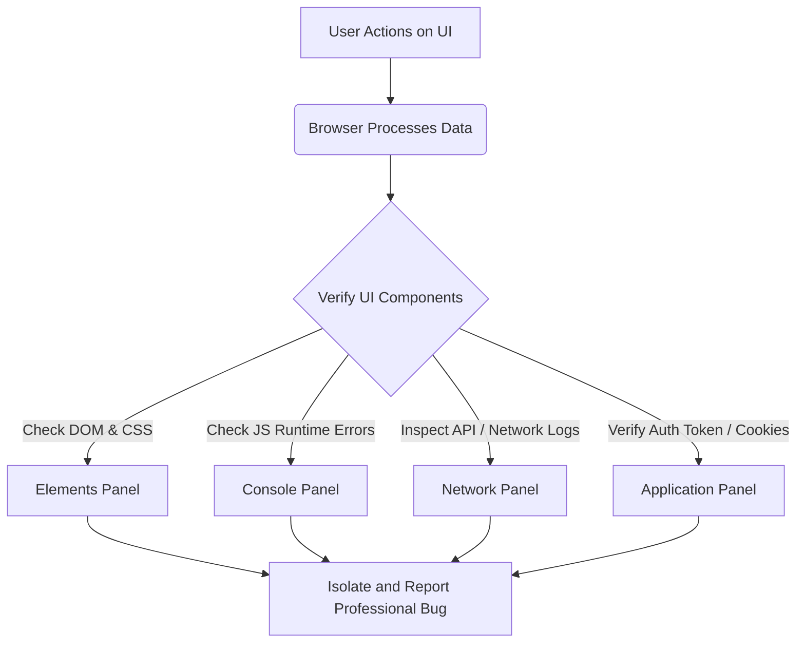
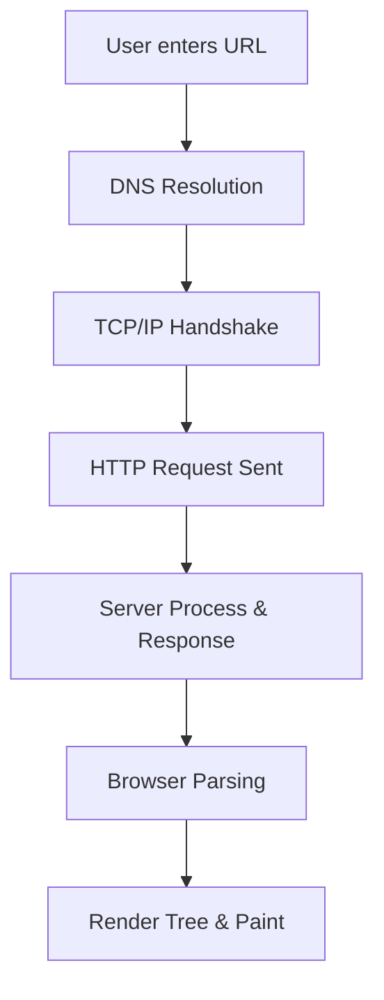
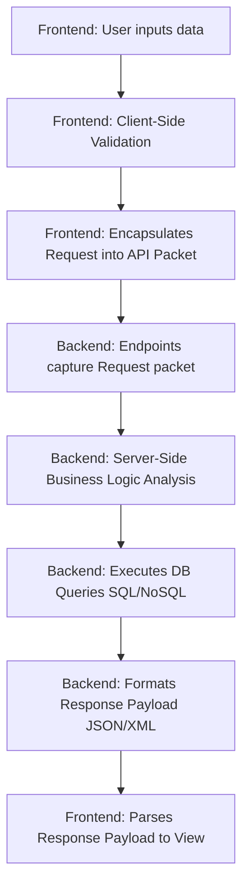
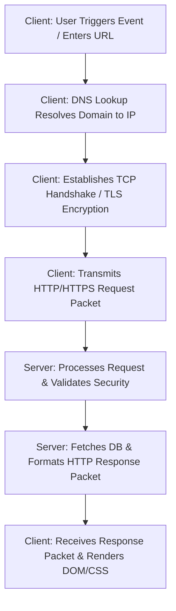

# 📁 05. Web Testing & Chrome DevTools

*Mục tiêu: Hiểu rõ kiến trúc Web Application và sử dụng thành thạo Chrome DevTools dưới góc nhìn của một QA thực chiến để cô lập lỗi, bắt gói tin API, phân tích mã phản hồi HTTP và kiểm tra bộ nhớ đệm phái Client nhằm tối ưu hóa tiến trình tìm và quản lý Bug.*

# **5.1. Web Application Fundamentals**

## 📌 Mục lục nội bộ (Chặng 05)

- [ ] [**5.1. Web Application Fundamentals**](./1_WebFundamentals.md)
  - [x] [5.1.1. How Browsers Work](#511-how-browsers-work)
  - [ ] [5.1.2. Frontend vs Backend System](#512-frontend-vs-backend-system)
  - [ ] [5.1.3. Client-Server Architecture & Request-Response Lifecycle](#513-client-server-architecture--request-response-lifecycle)
- [ ] [**5.2. Mastering Chrome DevTools for Testers**](./2_DevTools.md)

---

## 🗺️ Bản đồ Tiến trình Từ Kiến trúc Web Đến Khai Thác Chrome DevTools

Sơ đồ dưới đây mô tả cách một Tester phân tích lỗi từ tầng giao diện, đi sâu vào cấu trúc mã nguồn thông qua bộ công cụ DevTools để xác định chính xác nguyên nhân gây lỗi thuộc về phía Client hay Server:

---

📚 **References**
* *ISTQB® Certified Tester Foundation Level (CTFL) Syllabus v4.0* - Tiêu chuẩn kiểm thử các tầng hệ thống.
* *Google Chrome DevTools Documentation* - Tài liệu kỹ thuật vận hành và khai thác các bảng chức năng kiểm thử trên trình duyệt.

---

# 5.1.1. How Browsers Work

Hiểu rõ cách trình duyệt xử lý một trang web giúp Tester cô lập lỗi chính xác giữa Client-side (Frontend) và Server-side (Backend). Khi người dùng nhập một URL, trình duyệt thực hiện một chuỗi các bước kỹ thuật tuần tự để hiển thị giao diện.

### 🔄 Luồng Vận Hành Tổng Quan Của Trình Duyệt

---

## 📊 Bảng Đối Chiếu Góc Nhìn QA Qua Các Bước Vận Hành

Dưới đây là bảng phân tích chi tiết đối chiếu từng hành vi cốt lõi của trình duyệt với các loại Bug thực chiến tương ứng và giải pháp khoanh vùng lỗi bằng công cụ Chrome DevTools:

| Bước Vận Hành | Bản Chất Kỹ Thuật | Loại Bug Thường Gặp | Thao Tác Kiểm Tra Trên DevTools |
| :--- | :--- | :--- | :--- |
| **1. DNS Resolution** | Dịch Domain (URL) thành địa chỉ IP để xác vị trí đích của máy chủ hệ thống. | Lỗi `ERR_NAME_NOT_RESOLVED`, sai lệch cấu hình trỏ CDN, hoặc sập cụm máy chủ DNS. | **Network tab:** Yêu cầu bị chặn đứng ngay từ đầu, cột Status hiển thị trạng thái (failed). |
| **2. TCP Handshake** | Thiết lập kết nối tin cậy giữa client và máy chủ thông qua giao thức bảo mật TLS/SSL. | Lỗi `ERR_SSL_PROTOCOL_ERROR`, chứng chỉ bảo mật HTTPS hết hạn hoặc không hợp lệ. | **Security tab:** Kiểm tra độ hợp lệ của Certificate và thông số mã hóa kết nối bảo mật. |
| **3. Request Sent** | Trình duyệt đóng gói Headers, Cookies và Body Payload để đẩy HTTP Request đi. | Gói tin gửi đi bị thiếu trường bắt buộc, sai định dạng Token hoặc truyền thiếu tham số. | **Network tab -> Payload / Headers:** Kiểm tra cấu trúc tham số gửi đi so với API Specs. |
| **4. Server Response** | Máy chủ Backend tính toán logic, truy vấn cơ sở dữ liệu và trả dữ liệu về Client. | Lỗi logic Backend tính toán sai số, sập Database tạo ra lỗi hệ thống chung. | **Network tab -> Response:** Kiểm tra mã trạng thái HTTP (4xx, 5xx) và cấu trúc JSON phản hồi. |
| **5. Browser Parsing** | Trình duyệt đọc dữ liệu thô nhận về để dựng song song cấu trúc cây DOM và cây CSSOM. | Lỗi cú pháp JavaScript (Syntax Error) chặn đứng tiến trình kết xuất nội dung giao diện. | **Console tab:** Tìm các dòng thông báo lỗi runtime màu đỏ (Uncaught TypeError/ReferenceError). |
| **6. Layout & Paint** | Ghép thành Render Tree, tính toán tọa độ hình học các khối nội dung và tiến hành vẽ pixel. | Lỗi vỡ bố cục giao diện (UI Layout), không đáp ứng Responsive, chồng chéo văn bản. | **Elements tab:** Di chuột chọn phần tử DOM, thay đổi trực tiếp thuộc tính CSS để test UI. |

---

📚 **References**
* [ISTQB® Certified Tester Foundation Level (CTFL) Syllabus v4.0](https://istqb.org) - Phần Kỹ thuật kiểm thử hệ thống Web.
* [W3C Standards](https://w3.org) - Quy chuẩn cấu trúc vận hành trình duyệt và mô hình DOM toàn cầu.
* [Google Web Dev - How Browsers Work](https://web.dev) - Cơ chế phân tích cú pháp kết xuất đồ họa phái Client.

# 5.1.2. Frontend vs Backend System

Kiểm thử phần mềm hiện đại đòi hỏi một chuyên gia QA phải bóc tách hệ thống thành các lớp cấu trúc riêng biệt. Việc phân định ranh giới giữa **Frontend (Hệ thống giao diện)** và **Backend (Hệ thống xử lý ngầm)** giúp Tester xác định chính xác vị trí phát sinh lỗi (Failure Surface), tối ưu hóa chiến lược kiểm thử và cô lập vùng ảnh hưởng khi xảy ra sự cố.

---

## 📊 So sánh Giao diện hệ thống (Frontend) và Xử lý ngầm (Backend) dưới lăng kính QA

Dưới đây là bảng phân tích kỹ thuật giúp định hình tư duy kiểm thử đồng bộ cho cả hai tầng kiến trúc:

| Tiêu chí phân tích | Frontend System (Client-Side) | Backend System (Server-Side) |
| :--- | :--- | :--- |
| **Bản chất kỹ thuật** | Tầng hiển thị, tương tác trực tiếp với người dùng cuối thông qua trình duyệt hoặc thiết bị di động. | Tầng chứa bộ não logic, xử lý các nghiệp vụ phức tạp, tính toán và quản trị dữ liệu. |
| **Thành phần cốt lõi** | HTML5, CSS3, JavaScript, Webpack, các Single-Page Application Frameworks (React, Vue, Angular). | Máy chủ ứng dụng (Web Server), Tầng tích hợp (APIs), Cơ sở dữ liệu (SQL/NoSQL DB). |
| **Mục tiêu kiểm thử** | Thử nghiệm tính đúng đắn của luồng hiển thị, trải nghiệm UI/UX, độ phản hồi và tính tương thích thiết bị. | Thử nghiệm tính toàn vẹn của dữ liệu, thuật toán logic, khả năng chịu tải và bảo mật hệ thống. |
| **Tốc độ thực thi Test** | Chậm (Vài giây đến vài phút/test case) do phải khởi động trình duyệt và render các thành phần đồ họa. | Cực nhanh (Tính bằng mili-giây) khi thực hiện gọi trực tiếp qua các cấu trúc lệnh hoặc endpoint dữ liệu. |
| **Mối nguy cơ lớn nhất** | Lỗi hiển thị (UI Broken), xung đột phiên bản trình duyệt, xử lý sự kiện client không đồng bộ. | Sai lệch dữ liệu (Data Loss), nghẽn mạng (Deadlock), rò rỉ quyền truy cập dữ liệu (Privilege Escalation). |

---

## 🛠️ Quy trình tương tác dữ liệu liên tầng (Cross-Layer Data Flow)

Sơ đồ đơn sắc dưới đây mô tả chuỗi hành vi xử lý dữ liệu khép kín từ khi Client kích hoạt hành động cho đến khi Server lưu trữ thông tin ổn định:

---

## 🧠 Tư duy QA Thực chiến: Chiến lược bắt lỗi liên tầng (Defect Isolation Strategy)

Khi một tính năng bị lỗi (Ví dụ: Bấm nút "Đặt hàng" nhưng hệ thống báo lỗi), một Tester thực chiến không bao giờ log Bug chung chung. Bạn cần áp dụng tư duy cô lập lỗi bằng cách mở ngay **Chrome DevTools -> Network Panel** để phân tích trạng thái giao tiếp:

1. **Kịch bản Lỗi do Frontend:**
   * *Biểu hiện:* Bấm nút hệ thống không có phản hồi, hoặc hiển thị lỗi ngay lập tức mà không có bất kỳ dòng dữ liệu nào được gửi đi trong Network Panel.
   * *Nguyên nhân kỹ thuật:* Lỗi cú pháp JavaScript, lỗi bắt sự kiện (Event Listener Broken), hoặc hàm kiểm tra định dạng dữ liệu ở Client (Client-Side Validation) chặn sai quy trình.
2. **Kịch bản Lỗi do Backend:**
   * *Biểu hiện:* Giao diện gửi đi một yêu cầu HTTP thành công, nhưng gói tin phản hồi trả về các mã trạng thái như `500 Internal Server Error`, `502 Bad Gateway`, hoặc dữ liệu JSON phản hồi chứa nội dung báo lỗi hệ thống.
   * *Nguyên nhân kỹ thuật:* Server xử lý logic bị lỗi Null Pointer Exception, truy vấn SQL bị tràn hoặc sai cấu trúc, cơ sở dữ liệu bị ngắt kết nối đột ngột.
3. **Kịch bản Lỗi do Lệch chuẩn Hợp đồng (Contract Drift):**
   * *Biểu hiện:* Backend xử lý đúng, Frontend hiển thị đúng, nhưng tính năng vẫn hỏng. 
   * *Nguyên nhân kỹ thuật:* Giao thức truyền dữ liệu bị thay đổi mà không có sự đồng bộ giữa 2 đội ngũ phát triển. Backend trả về trường dữ liệu định dạng rắn `user_id` nhưng Frontend vẫn tìm kiếm cấu trúc cũ `userId`.

---

## 📚 References
* [ISTQB® Certified Tester Foundation Level (CTFL) Syllabus v4.0](https://istqb.org) - Section 2.2: Testing Levels and Architecture Boundaries.
* [ISO/IEC/IEEE 29119-1:2022 Standard](https://iso.org) - Software Testing Concepts in Multi-Tier Distributed Architectures.

# 5.1.3. Client-Server Architecture & Request-Response Lifecycle

Trong kiểm thử Web Application, việc hiểu rõ kiến trúc Client-Server và vòng đời của một cặp Request-Response là điều kiện tiên quyết để Tester chuyển dịch từ tư duy kiểm thử bề mặt (Black-box UI) sang tư duy kiểm thử hộp xám (Gray-box Testing). Mọi hành động của người dùng trên trình duyệt đều được chuyển hóa thành các luồng dữ liệu chạy qua mạng, chịu sự chi phối nghiêm ngặt của kiến trúc này.

---

## 📊 Phân tích Bản chất Kỹ thuật của mô hình Client-Server

Kiểm thử hệ thống phân tán đòi hỏi QA phân biệt rõ vai trò, phạm vi và các kịch bản kiểm thử đặc thù cho cả hai thực thể Client và Server:

| Tiêu chí phân tích | Client-Side (Phía Máy khách) | Server-Side (Phía Máy chủ) |
| :--- | :--- | :--- |
| **Định nghĩa & Vai trò** | Thực thể đưa ra yêu cầu (Requestor), chịu trách nhiệm kích hoạt luồng nghiệp vụ và hiển thị kết quả cho người dùng. | Thực thể tiếp nhận, xử lý yêu cầu (Provider), tính toán logic và phản hồi dữ liệu (Response) về cho Client. |
| **Phạm vi kiểm thử cốt lõi** | Kiểm tra giao diện (UI), tính tương thích của trình duyệt, hiệu năng render trang và xử lý logic cục bộ (Validation). | Kiểm tra tính đúng đắn của hàm nghiệp vụ, cấu trúc dữ liệu, hiệu năng chịu tải hệ thống và các lớp bảo mật API. |
| **Môi trường vận hành** | Trình duyệt Web (Chrome, Safari, Firefox) hoặc ứng dụng di động chạy trên thiết bị của người dùng cuối. | Máy chủ vật lý hoặc máy chủ đám mây (AWS, Azure) chạy các dịch vụ Web Server như Nginx, Apache. |
| **Tác động an ninh (Security)** | Dễ bị can thiệp, sửa đổi mã nguồn trực tiếp bằng công cụ Client (DevTools) nên không được tin tưởng tuyệt đối. | Vùng an toàn, kiểm soát toàn bộ cơ chế phân quyền, mã hóa dữ liệu và xác thực danh tính người dùng. |

---

## 🛠️ Vòng đời của một chu kỳ Request-Response (Request-Response Lifecycle)

Sơ đồ đơn sắc dưới đây mô tả chính xác 7 bước vận hành kỹ thuật từ khi người dùng nhập một địa chỉ URL (hoặc click một tính năng) cho đến khi trang web được hiển thị hoàn chỉnh:

---

## 🧠 Tư duy QA Thực chiến: Thiết kế kịch bản Test liên tầng dựa trên Vòng đời dữ liệu

Khi kiểm thử một tính năng, dựa vào kiến trúc Client-Server, một Tester chuyên nghiệp sẽ thiết kế các kịch bản kiểm thử nhằm bao phủ mọi điểm rủi ro trên đường đi của dữ liệu:

1. **Kiểm thử tại Giai đoạn Client-Side (Bước 1 & Bước 4):**
   * *Kịch bản kiểm thử định dạng (Validation Test):* Nhập sai định dạng Email ở ô đăng ký, Client phải chặn lại ngay lập tức bằng mã JavaScript cục bộ mà không được phép gửi Request lên Server để tiết kiệm băng thông.
   * *Kiểm thử rò rỉ dữ liệu (Client Security Test):* Thử nghiệm thay đổi trạng thái của các nút bị khóa (Disabled Button) bằng cách can thiệp vào mã HTML trong Elements Panel của DevTools để xem Client có gửi Request đi một cách bất hợp pháp hay không.
2. **Kiểm thử trên Đường truyền mạng (Network Layer - Bước 2 & Bước 3):**
   * *Kiểm thử mất kết nối giữa chừng (Network Interruption):* Kích hoạt một Request gửi file dung lượng lớn, sau đó giả lập ngắt mạng đột ngột (hoặc chuyển sang chế độ Offline trong DevTools) để kiểm tra xem hệ thống Client có cơ chế hiển thị thông báo lỗi thân thiện (Retry Mechanism) hay bị sập ứng dụng (Crash).
3. **Kiểm thử tại Giai đoạn Server-Side (Bước 5 & Bước 6):**
   * *Kiểm thử phá vỡ ràng buộc Client (Bypass Client-Side Test):* Sử dụng công cụ như Postman để gửi trực tiếp một Request có dữ liệu độc hại (Ví dụ: Số lượng mua hàng là `-1`) lên Server, bỏ qua lớp kiểm tra của Client. Nếu Server vẫn xử lý và trả về Response thành công (`200 OK`), hệ thống đã dính lỗi logicBackend nghiêm trọng.
   * *Kiểm thử xử lý tải đồng thời (Concurrency Server Test):* Giả lập 10,000 Client cùng gửi Request vào một Endpoint duy nhất tại cùng một thời điểm để kiểm tra xem Server xử lý xếp hàng (Queue) tốt hay trả về mã lỗi `503 Service Unavailable`.

---

## 📚 References
* [ISTQB® Certified Tester Foundation Level (CTFL) Syllabus v4.0](https://istqb.org) - Section 2.2.1: Component Integration Testing and Client-Server Communication.
* [ISO/IEC/IEEE 29119-4:2021 Standard](https://iso.org) - Test Techniques for Distributed System Architectures and Network Protocols.
