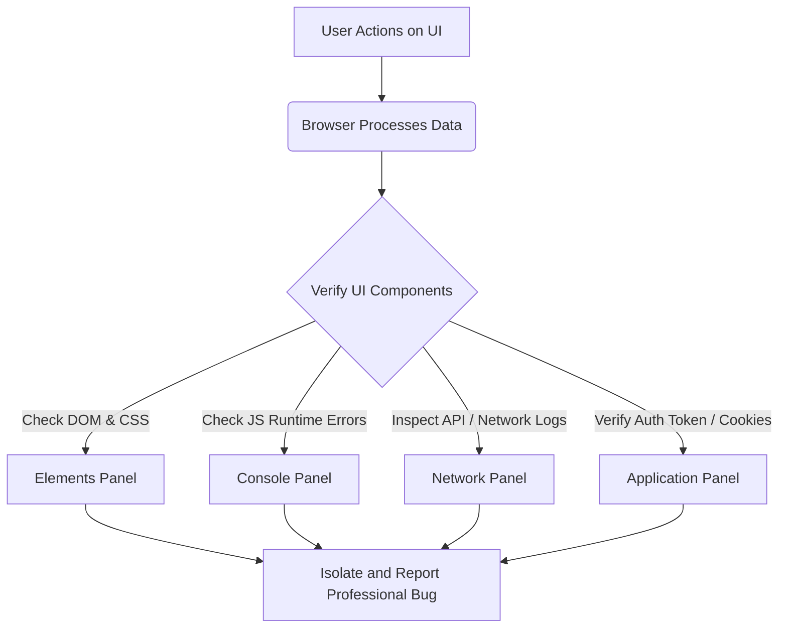
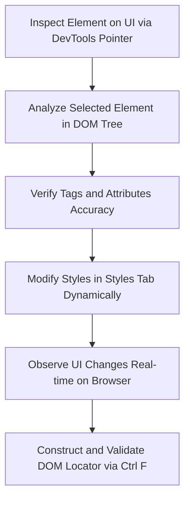
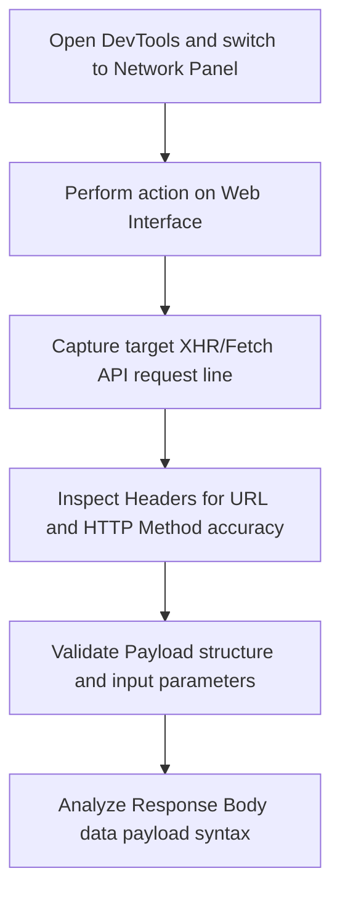
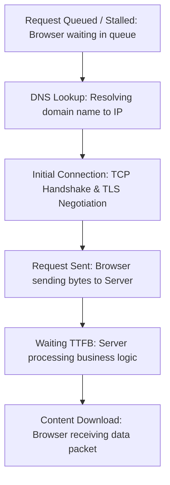

# 📁 05. Web Testing & Chrome DevTools

*Mục tiêu: Hiểu rõ kiến trúc Web Application và sử dụng thành thạo Chrome DevTools dưới góc nhìn của một QA thực chiến để cô lập lỗi, bắt gói tin API, phân tích mã phản hồi HTTP và kiểm tra bộ nhớ đệm phái Client nhằm tối ưu hóa tiến trình tìm và quản lý Bug.*

# **5.2. Mastering Chrome DevTools for Testers**

## 📌 Mục lục nội bộ (Chặng 05)

- [ ] [**5.1. Web Application Fundamentals**](./1_WebFundamentals.md)
- [ ] [**5.2. Mastering Chrome DevTools for Testers**](./2_DevTools.md)
  - [ ] [5.2.1. Elements Panel & DOM/CSS Inspection](#521-elements-panel--domcss-inspection)
  - [ ] [5.2.2. Console Panel & JavaScript Error Tracking](#522-console-panel--javascript-error-tracking)
  - [ ] [5.2.3. Network Panel: Capturing Headers, Payloads, Responses](#523-network-panel-capturing-headers-payloads-responses)
  - [ ] [5.2.4. HTTP Status Codes, Response Time & Waterfall Analysis](#524-http-status-codes-response-time--waterfall-analysis)
  - [ ] [5.2.5. Application Panel: Cookies, Local/Session Storage & Cache](#525-application-panel-cookies-localsession-storage--cache)

---

## 🗺️ Bản đồ Tiến trình Từ Kiến trúc Web Đến Khai Thác Chrome DevTools

Sơ đồ dưới đây mô tả cách một Tester phân tích lỗi từ tầng giao diện, đi sâu vào cấu trúc mã nguồn thông qua bộ công cụ DevTools để xác định chính xác nguyên nhân gây lỗi thuộc về phía Client hay Server:

---

📚 **References**
* *ISTQB® Certified Tester Foundation Level (CTFL) Syllabus v4.0* - Tiêu chuẩn kiểm thử các tầng hệ thống.
* *Google Chrome DevTools Documentation* - Tài liệu kỹ thuật vận hành và khai thác các bảng chức năng kiểm thử trên trình duyệt.

---

# 5.2.1. Elements Panel & DOM/CSS Inspection

Đối với một Tester chuyên nghiệp, **Elements Panel** trong Chrome DevTools không chỉ đơn thuần là công cụ xem mã nguồn, mà là một kính hiểm vi kỹ thuật để thực hiện kiểm thử hộp xám (Gray-box Testing). Thành thạo kỹ thuật phân tích cây phân rã tài liệu (DOM - Document Object Model) và các thuộc tính phong cách (CSS) giúp Tester cô lập nhanh lỗi giao diện, xác thực dữ liệu đầu ra và chuẩn bị các cấu trúc định vị (Locators) cho kiểm thử tự động.

---

## 📊 Phân tích Kỹ thuật DOM và CSS dưới góc nhìn Kiểm thử

Bảng dưới đây hệ thống hóa các thành phần giao diện cốt lõi mà một QA cần phân tích và kiểm thử trên Elements Panel:

| Thành phần kỹ thuật | Khái niệm đối với QA | Kịch bản kiểm thử & Phát hiện Defect |
| :--- | :--- | :--- |
| **DOM Tree (Cây cấu trúc)** | Cấu trúc phân cấp lồng nhau của các thẻ HTML biểu diễn toàn bộ đối tượng hiển thị trên màn hình. | Phát hiện thẻ viết sai cú pháp, thiếu thẻ đóng, hoặc cấu trúc lồng nhau sai quy chuẩn làm sập layout. |
| **Attributes (Thuộc tính)** | Các thông tin bổ sung nằm trong thẻ HTML như `id`, `class`, `type`, `disabled`, `data-*`. | Kiểm tra trạng thái thuộc tính (Ví dụ: Nút bấm phải có thuộc tính `disabled` khi người dùng chưa điền đủ form). |
| **CSS Computed Styles** | Các thông tin tính toán cuối cùng về kích thước, màu sắc, font chữ được trình duyệt render thực tế. | Phát hiện lỗi lệch mã màu thương hiệu, sai font chữ hệ thống hoặc kích thước phần tử không đạt chuẩn Accessibility. |
| **Box Model (Mô hình khối)** | Cấu trúc 4 lớp bao quanh một phần tử bao gồm: `Element` (Lõi) $\rightarrow$ `Padding` $\rightarrow$ `Border` $\rightarrow$ `Margin`. | Xác định chính xác nguyên nhân hai phần tử đè lên nhau hoặc khoảng cách hiển thị bị thưa/dính quá mức. |

---

## 🛠️ Luồng Xử lý Kiểm thử Giao diện và Định vị Phần tử trên Elements Panel

Sơ đồ đơn sắc dưới đây mô tả quy trình thực chiến để QA kiểm tra và cô lập lỗi hiển thị hoặc xây dựng bộ định vị bằng Elements Panel:

---

## 🧠 Tư duy QA Thực chiến: Kỹ thuật khai thác Elements Panel để cô lập Defect

Khi kiểm thử giao diện và luồng front-end, Tester cần áp dụng linh hoạt 3 kỹ thuật thực chiến sau trực tiếp trên Elements Panel:

1. **Kỹ thuật Giả lập Trạng thái Động (Force Element State):**
   * *Hành vi:* Click chuột phải vào thẻ HTML $\rightarrow$ Chọn `Force state` $\rightarrow$ Kích hoạt trạng thái `:hover`, `:active`, hoặc `:focus`.
   * *Mục đích QA:* Kiểm tra xem nút bấm có đổi màu khi di chuột qua không, hoặc ô nhập liệu có hiển thị viền đậm khi focus vào không mà không cần phải giữ chuột liên tục trên màn hình thực tế.
2. **Kỹ thuật Chỉnh sửa DOM/CSS Trực tiếp (Live Editing Test):**
   * *Hành vi:* Nháy đúp vào một đoạn text trong DOM để sửa nội dung, hoặc thay đổi thuộc tính `type="password"` thành `type="text"`. Thay đổi các thông số `color`, `display: none` trong tab Styles.
   * *Mục đích QA:* Kiểm tra khả năng chống tràn chữ (Text Overflow) bằng cách nhập một chuỗi ký tự siêu dài (Edge-case), hoặc kiểm tra xem nút ẩn có thực sự bị chặn xử lý ở backend hay chỉ bị ẩn thô sơ bằng thuộc tính CSS `display: none`.
3. **Kỹ thuật Thẩm định Bộ định vị (Locator Validation):**
   * *Hành vi:* Nhấn tổ hợp phím `Ctrl + F` (hoặc `Cmd + F` trên Mac) ngay tại bảng Elements Panel.
   * *Mục đích QA:* Nhập chuỗi CSS Selector hoặc XPath tự viết để kiểm tra tính duy nhất (Unique) của phần tử. Nếu kết quả trả về `1 of 1`, bộ định vị đó đủ điều kiện an toàn để đưa vào kịch bản Automation Test (Chặng 9), tránh lỗi Flaky Test do định vị nhầm phần tử trùng tên.

---

## 📚 References
* [ISTQB® Certified Tester Foundation Level (CTFL) Syllabus v4.0](https://istqb.org) - Section 4.2.1: Equivalence Partitioning and Boundary Values on UI Elements.
* [W3C Web Architecture Standards](https://w3c.org) - Document Object Model (DOM) and Cascading Style Sheets (CSS) Execution Specifications.

# 5.2.3. Network Panel: Capturing Headers, Payloads, Responses

Trong kiểm thử Web Application, **Network Panel** là trung tâm phân tích giao thức truyền thông liên tầng. Thành thạo Network Panel giúp một Tester chuyển dịch hoàn toàn từ kiểm thử giao diện bề mặt (Black-box UI) sang kiểm thử tích hợp (Gray-box Integration Testing), cho phép bóc tách cấu trúc từng gói tin dữ liệu luân chuyển giữa Trình duyệt (Client) và Máy chủ (Server) để cô lập lỗi chính xác.

---

## 📊 Phân tích các thành phần cấu trúc của một gói tin HTTP trên Network Panel

Khi click vào một dòng request trong Network Panel, Tester cần phân tích 3 tab dữ liệu cốt lõi sau để thẩm định tính toàn vẹn của hệ thống:

| Thành phần dữ liệu | Khái niệm kỹ thuật dưới góc nhìn QA | Mục tiêu kiểm thử & Phát hiện Defect |
| :--- | :--- | :--- |
| **Headers (Đầu gói tin)** | Chứa thông tin cấu hình như URL đích (Request URL), Phương thức (Method), Mã trạng thái (Status Code) và các thông số xác thực (Authorization Token). | Kiểm tra xem Request có gửi đúng Endpoint quy định không, Token bảo mật có bị đính kèm sai hoặc lộ trên URL hay không. |
| **Payload (Dữ liệu gửi đi)** | Phần thân chứa toàn bộ thông tin do người dùng nhập vào dưới dạng Query Parameters (trên URL) hoặc Request Body (định dạng JSON/Form-data). | Xác thực xem Frontend có gửi đúng tên trường (Field Name), đúng kiểu dữ liệu (Data Type) và đầy đủ các tham số bắt buộc lên Server hay không. |
| **Response (Dữ liệu trả về)** | Kết quả phản hồi nguyên bản từ Server trả về sau khi xử lý logic nghiệp vụ, thường có cấu trúc định dạng JSON hoặc XML. | Đối chiếu dữ liệu thô (Raw Data) từ Server với giao diện hiển thị nhằm phát hiện lỗi làm tròn số, lỗi font chữ hoặc hiển thị thiếu thông tin. |

---

## 🛠️ Luồng phân tích và kiểm tra gói tin qua Network Panel (API Packet Analysis Workflow)

Sơ đồ đơn sắc dưới đây mô tả chu trình thực chiến để QA bắt và phân tích một gói tin nghiệp vụ (Ví dụ: Thao tác bấm nút "Thêm vào giỏ hàng"):

---

## 🧠 Tư duy QA Thực chiến: Kỹ thuật khai thác Network Panel để truy vết Bug tích hợp

Để nâng cao mật độ tri thức và hiệu suất bắt lỗi liên tầng, Tester cần áp dụng 3 kỹ thuật thực chiến sau trên Network Panel:

1. **Bộ lọc chuyên sâu (Filtetring XHR/Fetch):**
   * *Hành vi:* Bật thanh công cụ lọc và click chọn mục `Fetch/XHR`.
   * *Ý nghĩa QA:* Trình duyệt tải rất nhiều tài nguyên như hình ảnh (Img), font chữ, file CSS, JS làm nhiễu màn hình theo dõi. Lọc `Fetch/XHR` giúp Tester chỉ tập trung vào các luồng gọi API nghiệp vụ để cô lập lỗi logic nhanh chóng.
2. **Xác thực dữ liệu ngầm (Payload vs Response Alignment):**
   * *Hành vi:* Đối chiếu trực tiếp cấu trúc của tab Payload và tab Response. 
   * *Ý nghĩa QA:* Nếu Payload gửi đi số lượng sản phẩm là `2` nhưng Response trả về tổng tiền của `1` sản phẩm, lỗi xử lý thuật toán thuộc về Backend. Ngược lại, nếu Response trả về đúng tổng tiền nhưng Giao diện (UI) hiển thị sai số, lỗi render thuộc về Frontend.
3. **Kỹ thuật Chặn và Sửa gói tin (Network Request Interception/Overrides):**
   * *Hành vi:* Click chuột phải vào gói tin API $\rightarrow$ Chọn `Block request URL` để giả lập lỗi sập server kết nối, hoặc sử dụng tính năng `Overrides` để sửa dữ liệu Response thô trực tiếp trên trình duyệt.
   * *Ý nghĩa QA:* Giúp Tester thực hiện các ca kiểm thử biên (Edge-case) và kiểm thử độ bền của Frontend. Ví dụ: Sửa Response từ Server thành một chuỗi JSON trống xem giao diện có bị sập màn hình trắng (Crash) hay hiển thị thông báo lỗi an toàn cho người dùng.

---

## 📚 References
* [ISTQB® Certified Tester Foundation Level (CTFL) Syllabus v4.0](https://istqb.org) - Section 4.3.2: Tools for Testing Component Integration and Network Traffic API Verification.
* [W3C Hypertext Transfer Protocol (HTTP/1.1 & HTTP/2) Standards](https://w3c.org) - Packet Structure, Headers and Message Body Passing Specifications.

# 5.2.3. Network Panel: Capturing Headers, Payloads, Responses

Trong kiểm thử Web Application, **Network Panel** là trung tâm phân tích giao thức truyền thông liên tầng. Thành thạo Network Panel giúp một Tester chuyển dịch hoàn toàn từ kiểm thử giao diện bề mặt (Black-box UI) sang kiểm thử tích hợp (Gray-box Integration Testing), cho phép bóc tách cấu trúc từng gói tin dữ liệu luân chuyển giữa Trình duyệt (Client) và Máy chủ (Server) để cô lập lỗi chính xác.

---

## 📊 Phân tích các thành phần cấu trúc của một gói tin HTTP trên Network Panel

Khi click vào một dòng request trong Network Panel, Tester cần phân tích 3 tab dữ liệu cốt lõi sau để thẩm định tính toàn vẹn của hệ thống:

| Thành phần dữ liệu | Khái niệm kỹ thuật dưới góc nhìn QA | Mục tiêu kiểm thử & Phát hiện Defect |
| :--- | :--- | :--- |
| **Headers (Đầu gói tin)** | Chứa thông tin cấu hình như URL đích (Request URL), Phương thức (Method), Mã trạng thái (Status Code) và các thông số xác thực (Authorization Token). | Kiểm tra xem Request có gửi đúng Endpoint quy định không, Token bảo mật có bị đính kèm sai hoặc lộ trên URL hay không. |
| **Payload (Dữ liệu gửi đi)** | Phần thân chứa toàn bộ thông tin do người dùng nhập vào dưới dạng Query Parameters (trên URL) hoặc Request Body (định dạng JSON/Form-data). | Xác thực xem Frontend có gửi đúng tên trường (Field Name), đúng kiểu dữ liệu (Data Type) và đầy đủ các tham số bắt buộc lên Server hay không. |
| **Response (Dữ liệu trả về)** | Kết quả phản hồi nguyên bản từ Server trả về sau khi xử lý logic nghiệp vụ, thường có cấu trúc định dạng JSON hoặc XML. | Đối chiếu dữ liệu thô (Raw Data) từ Server với giao diện hiển thị nhằm phát hiện lỗi làm tròn số, lỗi font chữ hoặc hiển thị thiếu thông tin. |

---

## 🛠️ Luồng phân tích và kiểm tra gói tin qua Network Panel (API Packet Analysis Workflow)

Sơ đồ đơn sắc dưới đây mô tả chu trình thực chiến để QA bắt và phân tích một gói tin nghiệp vụ (Ví dụ: Thao tác bấm nút "Thêm vào giỏ hàng"):

---

## 🧠 Tư duy QA Thực chiến: Kỹ thuật khai thác Network Panel để truy vết Bug tích hợp

Để nâng cao mật độ tri thức và hiệu suất bắt lỗi liên tầng, Tester cần áp dụng 3 kỹ thuật thực chiến sau trên Network Panel:

| Kỹ thuật thực chiến | Hành vi thao tác trên DevTools | Cơ chế vận hành ngầm | Ý nghĩa nghiệp vụ QA & Mục tiêu bắt lỗi |
| :--- | :--- | :--- | :--- |
| **1. Bộ lọc chuyên sâu (Filtering XHR/Fetch)** | Bật thanh công cụ lọc và click chọn mục `Fetch/XHR`. | Loại bỏ các tài nguyên tĩnh như hình ảnh (Img), font chữ, file CSS, JS gây nhiễu màn hình theo dõi. | Chỉ tập trung vào các luồng gọi API nghiệp vụ để cô lập lỗi logic liên hệ giữa Client và Server nhanh chóng. |
| **2. Xác thực dữ liệu ngầm (Data Alignment)** | Đối chiếu trực tiếp cấu trúc của tab Payload và tab Response. | Kiểm tra tính đồng bộ của dữ liệu đầu vào (gửi đi) và dữ liệu đầu ra (trả về) của một phiên giao dịch. | Nếu Payload gửi `2` sản phẩm nhưng Response trả về tổng tiền của `1`, lỗi thuộc Backend. Nếu Response đúng nhưng UI hiển thị sai, lỗi thuộc Frontend. |
| **3. Chặn/Sửa gói tin (Interception/Overrides)** | Click chuột phải vào gói tin API chọn `Block request URL` hoặc kích hoạt tính năng `Overrides`. | Giả lập lỗi sập kết nối của một API cụ thể hoặc ghi đè dữ liệu Response thô trực tiếp trên trình duyệt. | Thực hiện các ca kiểm thử biên (Edge-case) và kiểm thử độ bền. Ví dụ: Sửa Response thành chuỗi JSON trống xem UI có crash hay hiển thị thông báo lỗi an toàn. |

---

## 📚 References
* [ISTQB® Certified Tester Foundation Level (CTFL) Syllabus v4.0](https://istqb.org) - Section 4.3.2: Tools for Testing Component Integration and Network Traffic API Verification.
* [W3C Hypertext Transfer Protocol (HTTP/1.1 & HTTP/2) Standards](https://w3c.org) - Packet Structure, Headers and Message Body Passing Specifications.

# 5.2.4. HTTP Status Codes, Response Time & Waterfall Analysis

Trong hoạt động kiểm thử Web chuyên sâu, **HTTP Status Codes (Mã trạng thái phản hồi)**, **Response Time (Thời gian phản hồi)** và **Waterfall Chart (Biểu đồ thác nước)** trên Network Panel tạo thành bộ ba thông số kỹ thuật cốt lõi. Khai thác sâu các thông số này giúp Tester phân định rõ trách nhiệm hệ thống (SLA Verification), đánh giá hiệu năng Client-side và định danh chính xác điểm nghẽn (Performance Bottleneck) gây chậm trễ hệ thống.

---

## 📊 Phân tích Bản chất Kỹ thuật của Mã trạng thái HTTP (HTTP Status Codes)

Bảng quy chuẩn dưới đây tóm tắt ý nghĩa nghiệp vụ và hướng hành động xử lý Defect của QA đối với từng nhóm mã phản hồi từ Server:

| Nhóm mã trạng thái | Ý nghĩa kỹ thuật | Kịch bản kiểm thử điển hình & Hướng xử lý lỗi |
| :--- | :--- | :--- |
| **2xx (Success)** | Yêu cầu đã được tiếp nhận và xử lý thành công trên Server (Ví dụ: `200 OK`, `201 Created`). | Kiểm tra xem cấu trúc dữ liệu hiển thị trên UI có đồng bộ chính xác với nội dung Payload trả về hay không. |
| **3xx (Redirection)** | Client cần thực hiện hành động bổ sung để hoàn thành Request (Ví dụ: `301 Moved Permanently`). | Xác thực xem trình duyệt có tự động chuyển hướng trang một cách an toàn và giữ nguyên trạng thái phiên làm việc không. |
| **4xx (Client Error)** | Lỗi xuất phát từ phía Máy khách do gửi sai dữ liệu hoặc sai quyền (Ví dụ: `400 Bad Request`, `401 Unauthorized`, `403 Forbidden`, `404 Not Found`). | **Lỗi Frontend/Data:** Kiểm tra lại định dạng Payload gửi đi. Nếu Payload đúng theo tài liệu API nhưng nhận mã 4xx, cần log lỗi Backend chặn sai điều kiện. |
| **5xx (Server Error)** | Server gặp lỗi logic nội bộ không thể xử lý Request (Ví dụ: `500 Internal Server Error`, `502 Bad Gateway`, `503 Service Unavailable`). | **Lỗi Backend:** Hệ thống xử lý ngầm bị crash, lỗi logic code (Null Pointer), hoặc mất kết nối DB. Cần bốc log Server đính kèm Bug Report. |

---

## 🛠️ Vòng đời thời gian của một Tài nguyên mạng (Waterfall Chart Lifecycle)

Sơ đồ đơn sắc dưới đây mô tả cấu trúc chu kỳ thời gian luân chuyển của một tài nguyên mạng trên trình duyệt mà QA cần phân tích:

---

## 📊 Bảng phân tích kỹ thuật bóc tách Waterfall định vị điểm nghẽn (Tư duy QA Thực chiến)

| Chỉ số thời gian | Hiện tượng nhận biết trên UI/Waterfall | Bản chất kỹ thuật | Kết luận của QA & Nguyên nhân gốc (Root Cause) |
| :--- | :--- | :--- | :--- |
| **1. Chỉ số TTFB (Time to First Byte) kéo dài** | Khối màu biểu diễn `Waiting (TTFB)` trong biểu đồ Waterfall chiếm tỷ trọng lớn nhất (Ví dụ: > 2 giây). | Trình duyệt mất quá nhiều thời gian để chờ đợi byte dữ liệu phản hồi đầu tiên từ phía máy chủ. | **Nghẽn tại Backend System:** Câu lệnh truy vấn SQL không được tối ưu index, Server xử lý thuật toán phức tạp (vòng lặp vô hạn), hoặc Server bị quá tải tài nguyên (CPU/RAM chạm ngưỡng 100%). |
| **2. Chỉ số Content Download kéo dài** | Khối màu biểu diễn `Content Download` kéo dài bất thường trên biểu đồ thác nước. | Server phản hồi byte đầu tiên rất nhanh nhưng thời gian truyền tải toàn bộ dung lượng gói dữ liệu về trình duyệt lại quá lâu. | **Nghẽn tại Network hoặc Frontend Asset:** Kích thước tệp tin quá lớn (Ảnh gốc chưa nén > 10MB, file JS chưa được minify), hoặc do băng thông đường truyền mạng giữa Client và Server bị bóp nghẹt. |

---

## 📚 References
* [ISTQB® Certified Tester Foundation Level (CTFL) Syllabus v4.0](https://istqb.org) - Section 5.2.2: Performance Metrics and Client-Side Browser Analysis.
* [RFC 9110: HTTP Semantics and Status Codes Standards](https://rfc-editor.org) - IETF Official Specifications for Hypertext Transfer Protocol Response Enums.

