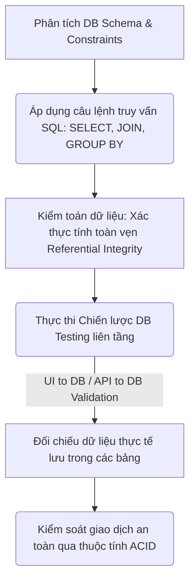
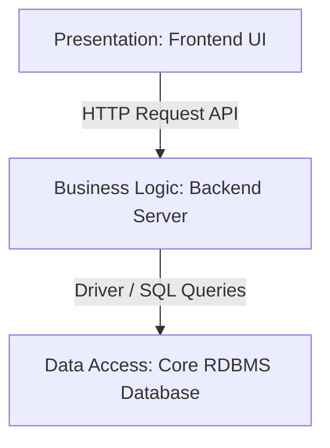
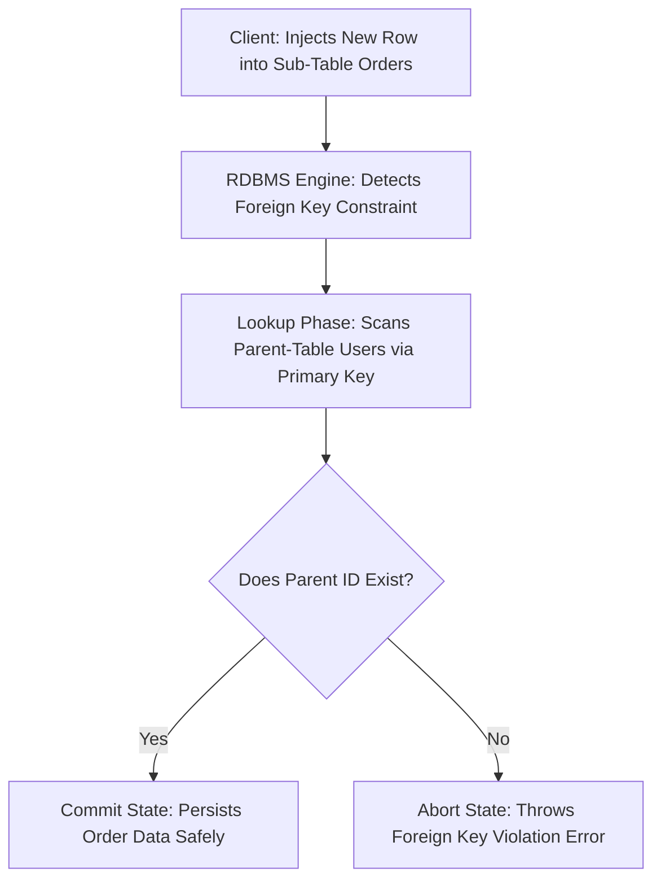
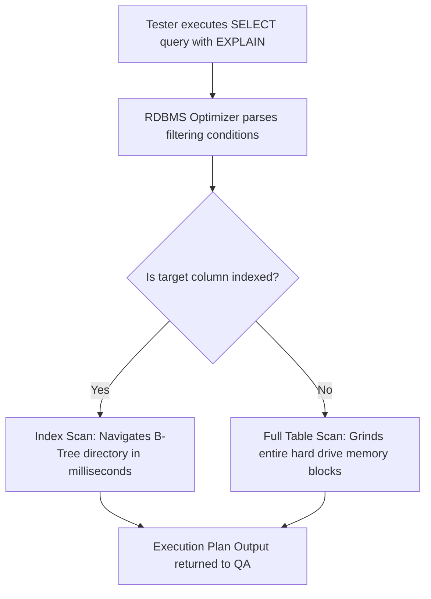

# 📁 06. Database & SQL Testing

*Mục tiêu: Thẩm định và kiểm toán dữ liệu nằm ẩn dưới hệ thống thông qua việc làm chủ các khái niệm cơ sở dữ liệu cốt lõi, vận hành thành thạo các câu lệnh truy vấn SQL từ cơ bản đến nâng cao và thực thi chiến lược kiểm thử toàn vẹn dữ liệu.*

# **6.1. Database Fundamentals**

## 📌 Mục lục nội bộ (Chặng 06)

- [ ] [**6.1. Database Fundamentals**](./1_DBFundamentals.md)
  - [ ] [6.1.1. Relational Database (RDBMS) Concepts](#611-relational-database-rdbms-concepts)
  - [ ] [6.1.2. Table, Row, Column, Keys (Primary, Foreign, Unique)](#612-table-row-column-keys-primary-foreign-unique)
  - [ ] [6.1.3. Database Constraints & Indexes](#613-database-constraints--indexes)
- [ ] [**6.2. SQL Fundamentals for Testers**](./2_SQLFundamentals.md)
- [ ] [**6.3. Advanced Database Concepts**](./3_DBConcepts.md)
- [ ] [**6.4. Database Testing Strategies**](./4_DBTesting.md)
- [ ] [**6.5. NoSQL Overview**](./5_NoSQLOverview.md)

---

## 🗺️ Bản đồ Tiến trình Từ Nền tảng Dữ liệu đến Chiến lược Kiểm thử Kho lưu trữ

Sơ đồ dưới đây mô tả cách Tester dịch chuyển từ tư duy phân tích cấu trúc sang việc áp dụng các câu lệnh truy vấn nhằm kiểm toán tính toàn vẹn và an toàn của dữ liệu ngầm:

---

# 6.1.1. Relational Database (RDBMS) Concepts

Kiểm thử RDBMS (Database Testing) dịch chuyển hoàn toàn tư duy của một Tester: Bạn không còn kiểm tra xem ứng dụng hiển thị cái gì, mà là đang kiểm toán xem **bản chất sự thật của dữ liệu** lưu dưới đĩa cứng có chính xác tuyệt đối hay không. 

> ⚠️ **Nguyên lý bất biến của Tester:** Giao diện hiển thị (UI) có thể lừa dối bạn bằng các dòng trạng thái giả lập hoặc thông báo ảo, nhưng dữ liệu nằm trong hệ cơ sở dữ liệu quan hệ (RDBMS) luôn phản ánh sự thật duy nhất của toàn bộ hệ thống.

---

## 🎨 Vị trí của RDBMS trong Kiến trúc 3 Tầng (3-Tier Architecture)

Dữ liệu là dòng máu luân chuyển liên tục qua ba lớp cấu trúc độc lập của một phần mềm:

*   **Presentation Layer (Frontend UI):** Tiếp nhận hành vi người dùng, hiển thị nút bấm và form nhập liệu (Trọng tâm của Chặng 5).
*   **Business Logic Layer (Backend Server):** Chứa mã nguồn tính toán, xử lý thuật toán và ép buộc luật kinh doanh trước khi quyết định ghi nhận thông tin.
*   **Data Access Layer (Core RDBMS):** Trái tim của hệ thống (MySQL, PostgreSQL, Oracle). Nơi tiếp nhận các câu lệnh truy vấn, chốt chặn bảo mật dữ liệu đầu vào và lưu giữ thông tin an toàn vào các khối đĩa vật lý.

---

## 📊 Ma trận Phân rã Vi mô 4 Thực thể RDBMS (Tư duy QA Mindset)

Dưới đây là bảng hệ thống hóa 4 thực thể cốt lõi của RDBMS được bóc tách theo đúng cấu trúc tiêu chuẩn để phục vụ việc săn tìm Bug tầng sâu:

| Thực thể RDBMS | Khái niệm kỹ thuật lõi | Trọng tâm kiểm thử (QA Focus) | Kịch bản lỗi điển hình thực chiến (Defect) |
| :--- | :--- | :--- | :--- |
| **1. Relational Table** | Ma trận dữ liệu gồm các hàng (*Tuple*) và cột (*Attribute*) biểu diễn một đối tượng kinh doanh ngoài đời thực. | Thẩm định xem cấu trúc vật lý thực tế của bảng có khớp hoàn toàn với tài liệu đặc tả thiết kế (DB Schema) về tên trường và kiểu dữ liệu. | Lỗi tràn dữ liệu (*Data Overflow*) xảy ra khi Frontend không giới hạn ký tự nhập liệu, khiến dữ liệu nạp xuống DB vượt quá kích thước cột quy định và gây sập luồng xử lý ngầm. |
| **2. Relational Schema** | Bản thiết kế tổng thể định nghĩa các mối quan hệ logic (1-1, 1-n, n-n) để kết nối dòng chảy dữ liệu giữa các bảng. | Sử dụng lược đồ như một bản đồ dẫn đường để thiết kế các kịch bản kiểm thử tích hợp liên bảng (*Join Tables*). | Xuất hiện dữ liệu mồ côi (*Orphaned Rows*) khi tài khoản khách hàng bị xóa nhưng lịch sử đơn hàng của họ vẫn tồn tại vô định hướng do thiết lập sai sợi dây liên kết, làm sập báo cáo. |
| **3. DB Constraints** | Bộ quy tắc toán học và luật nghiệp vụ được cấu hình trực tiếp tại lõi cứng DB (`NOT NULL`, `CHECK`) để ép buộc tính đúng đắn của dữ liệu. | Dùng Postman gửi gói tin lỗi nhằm bypass lớp bảo vệ Frontend, nạp thẳng dữ liệu rác vào DB để thử nghiệm độ bền của chốt chặn. | DB âm thầm chấp nhận lưu một tài khoản có số tuổi là `-5` hoặc ngày tạo ở mốc thời gian tương lai do hệ thống DB bị bỏ quên ràng buộc `CHECK`. |
| **4. Database Index** | Cấu trúc dữ liệu phụ (thường là cây B-Tree) giúp tăng tốc độ tìm kiếm bản ghi mà không cần quét toàn bộ bảng (*Full Table Scan*). | Nhìn nhận Index như một con dao hai lurỡi: Thiết kế các ca test tải dữ liệu lớn (*Bulk Insert*) để đánh giá xem hệ thống ghi dữ liệu có bị nghẽn hay không. | Tính năng tìm kiếm lịch sử chạy rất nhanh ở môi trường Staging nhưng gây treo ứng dụng trên Production khi dữ liệu đạt ngưỡng triệu dòng vì lập trình viên quên đánh chỉ mục trường điều kiện. |

---

## 🧠 3 Mũi nhọn Chiến lược Kiểm thử RDBMS Thực chiến

*   **Kiểm thử Cấu trúc (Structural DB Testing):** Truy vấn hệ thống Metadata (`INFORMATION_SCHEMA`) để phát hiện lỗi cấu hình sai kiểu dữ liệu. Ví dụ điển hình là việc dùng kiểu số thực `FLOAT` thay vì số thập phân chính xác `DECIMAL` để lưu tiền tệ, dẫn đến lỗi làm tròn tự động và gây thất thoát tiền mặt trong tài khoản khách hàng.
*   **Kiểm thử Chức năng (Functional Data Testing):** Xác thực tính toàn vẹn dữ liệu xuyên suốt vòng đời luân chuyển. Bạn thực hiện hành vi mua hàng trên giao diện UI báo "Thành công", nhưng khi chui vào DB bảng `orders`, trạng thái đơn hàng (`status`) không chuyển sang `PAID` mà vẫn bị kẹt lại ở `PENDING` do lỗi logic của lập trình viên.
*   **Kiểm thử Phi chức năng (Non-Functional DB Testing):** Thử nghiệm độ bền, khả năng chịu tải và bảo mật an ninh của động cơ RDBMS. Bạn có thể chèn các đoạn mã độc `SQL Injection` vào UI để xem hệ thống có bị lộ dữ liệu mật không, hoặc giả lập hàng nghìn yêu cầu đọc/ghi đồng thời để đo lường xem DB có bị rơi vào trạng thái khóa chết dữ liệu (*Deadlock*) gây treo ứng dụng hay không.

---

## 📚 References
* [ISTQB® Certified Tester Foundation Level (CTFL) Syllabus v4.0](https://istqb.org) - Section 4.2.3: Specification-Based and Structural Testing of Data Repositories.
* [ISO/IEC/IEEE 29119-4:2021 Standard](https://iso.org) - Software Testing: Test Techniques for Data Integrity, Constraints Enforcement and Multi-Tier Database State Specifications.

# 6.1.2. Table, Row, Column, Keys (Primary, Foreign, Unique)

Khi đi sâu vào kiểm thử hộp xám tầng cơ sở dữ liệu, Tester không chỉ nhìn bảng dữ liệu như các dòng chữ vô hồn, mà phải xem chúng là một tập hợp các ràng buộc cấu trúc vi mô. Thành thạo việc phân tích và kiểm thử các thực thể vi mô kết hợp hệ thống liên kết khóa (`Keys`) giúp QA làm chủ kỹ thuật thẩm định tính toàn vẹn dữ liệu (Data Integrity Validation), bóp nghẹt các lỗi logic phát sinh từ hậu trường hệ thống.

> ⚠️ **Nguyên lý kiểm định liên kết (Referential Integrity Constraint):** Một hệ thống backend an toàn bắt buộc phải thiết lập các "sợi dây xích" (Khóa ngoại) kết nối chặt chẽ với "mã định danh" (Khóa chính). Việc thiếu hụt các sợi xích này tại tầng DB sẽ khiến kho lưu trữ dữ liệu bị rơi vào trạng thái rác hoặc sai lệch thông tin mà Frontend không bao giờ phát hiện được.

---

## 🎨 Mô hình Phân rã Luồng Kiểm tra Hợp đồng Liên kết Giữa Các Bảng

Sơ đồ đơn sắc dưới đây mô tả cách thức hệ thống RDBMS tự động đối chiếu dữ liệu và thực thi các quy chuẩn kiểm tra khi có hành động ghi dữ liệu liên bảng từ Client gửi về:

---

## 📊 Ma trận Phân rã Vi mô Cấu trúc Bảng và Hệ thống Khóa (QA Mindset)

Dưới đây là ma trận bóc tách chi tiết các thành phần vi mô cấu thành nên cơ sở dữ liệu quan hệ, được phân cấp từ lớp vỏ vật lý đến các cơ chế liên kết logic:

| Thực thể vi mô | Bản chất kỹ thuật lõi | Trọng tâm kiểm thử (QA Focus) | Kịch bản lỗi điển hình thực chiến (Defect) |
| :--- | :--- | :--- | :--- |
| **1. Table (Bảng)** | Tập hợp các thuộc tính biểu diễn một đối tượng kinh doanh cụ thể. | Kiểm tra tính nhất quán của tên bảng theo đúng tài liệu thiết kế hệ thống. | Tên bảng viết sai kiểu (Ví dụ: Trộn lẫn giữa `tbl_user`, `Users`, `order_details`) gây lỗi gọi hàm ngầm hoặc lỗi sập hệ thống khi chuyển đổi môi trường (Hệ điều hành Linux phân biệt chữ hoa-chữ thường). |
| **2. Row (Hàng/Record)** | Một thực thể dữ liệu duy nhất và cụ thể (Tuple) nằm trong bảng. | Thẩm định tính toàn vẹn, không trùng lặp dữ liệu khi thực hiện các luồng nghiệp vụ. | Hiện tượng nhân đôi bản ghi (Duplicate Row) do lỗi logic vòng lặp xử lý của Backend khi Client bị lag mạng và người dùng bấm nút gửi dữ liệu 2 lần liên tục. |
| **3. Column (Cột/Field)** | Định nghĩa thuộc tính, giới hạn độ dài và kiểu dữ liệu của trường thông tin. | Thử nghiệm giá trị biên về độ dài (Length) và tính hợp lệ của kiểu dữ liệu truyền vào. | Cột lưu tiền tệ thiết lập kiểu số thực `FLOAT` làm mất phần thập phân (Sai lệch số tiền), hoặc cột số điện thoại `phone` bị cấu hình độ dài quá ngắn khiến số của khách bị cắt cụt. |
| **4. Primary Key (Khóa chính)** | Mã định danh duy nhất của mỗi hàng, bắt buộc phải có giá trị và tuyệt đối không được trống (`NOT NULL`). | Sử dụng SQL hoặc Postman cố tình nhét 2 bản ghi có cùng một mã `id` vào hệ thống. | Hệ thống Backend cho phép tạo hai đơn hàng trùng khít mã `id`. Điều này khiến tính năng hiển thị chi tiết đơn hàng hoặc luồng cập nhật trạng thái giao hàng về sau bị sai lệch hoàn toàn. |
| **5. Foreign Key (Khóa ngoại)** | Sợi dây xích liên kết một cột của bảng con trỏ trực tiếp đến Khóa chính của bảng cha. | Thiết kế ca test xóa dữ liệu ở bảng cha để kiểm tra xem hệ thống xử lý các bản ghi ở bảng con thế nào (`ON DELETE CASCADE` hay `RESTRICT`). | Lập trình viên cho phép xóa 1 tài khoản khách hàng khi họ đang có 5 đơn hàng. DB chấp nhận lệnh và biến 5 đơn hàng đó thành dữ liệu mồ côi (`Orphaned Records`), phá hủy hoàn toàn tính chính xác của báo cáo doanh thu. |
| **6. Unique Key (Khóa duy nhất)** | Đảm bảo dữ liệu trong cột không được phép trùng lặp, nhưng chấp nhận giá trị trống (`NULL`). | Đăng ký 2 tài khoản khác nhau nhưng cố tình nhập trùng một số điện thoại hoặc mã số định danh doanh nghiệp. | DB chấp nhận cho 2 tài khoản khách hàng dùng chung một số điện thoại hoặc email do bảng dữ liệu thiếu ràng buộc `UNIQUE`, dẫn đến lỗ hổng bảo mật đăng nhập nhầm tài khoản. |

---

## 📚 References
* [ISTQB® Certified Tester Foundation Level (CTFL) Syllabus v4.0](https://istqb.org) - Section 4.2.3: Specification-Based and Structural Testing of Data Repositories.
* [ISO/IEC/IEEE 29119-4:2021 Standard](https://iso.org) - Part 4: Test Techniques for Data Integrity, Referential Integrity and Database State Specifications.

# 6.1.3. Database Constraints & Indexes

Khi bước qua hai bài học nền tảng về cấu trúc ma trận và hệ thống khóa, một Tester chuyên nghiệp cần chuyển dịch trọng tâm sang việc kiểm toán các cơ chế bảo vệ tự động và tối ưu hiệu năng của hệ quản trị cơ sở dữ liệu quan hệ (RDBMS). **Constraints (Ràng buộc toàn vẹn)** and **Indexes (Chỉ mục dữ liệu)** chính là hai thành phần kỹ thuật lõi quyết định một hệ thống Database có đạt chuẩn về độ sạch dữ liệu (Data Cleanliness) và tốc độ vận hành thực tế hay không.

> ⚠️ **Nguyên lý phòng thủ tầng dữ liệu (Data-Layer Defense Principle):** Mọi chốt chặn kiểm tra dữ liệu trên giao diện (Frontend Validation) đều có thể bị bẻ gãy hoặc bypass qua API. Hệ thống RDBMS bắt buộc phải thiết lập các ràng buộc cứng (`Constraints`) tại lõi vật lý để làm lớp phòng thủ tối hậu, chặn đứng dòng dữ liệu độc hại nạp vào đĩa cứng.

---

## 🎨 Luồng Xử lý Kiểm toán Hiệu năng và Ăn Chỉ mục (Index Scan Lifecycle)

Sơ đồ đơn sắc dưới đây mô tả cách thức DB Engine phân tích câu lệnh truy vấn để quyết định đi đường tắt qua cây chỉ mục nhằm tối ưu tốc độ đọc tệp tin:

---

## 📊 Ma trận Kiểm toán Ràng buộc và Chỉ mục Dữ liệu (QA Mindset)

Dưới đây là ma trận phân rã chi tiết các chốt chặn toàn vẹn nâng cao và cơ chế tối ưu chỉ mục, phục vụ cho việc thiết kế kịch bản test tầng sâu:

| Thành phần kỹ thuật | Bản chất vận hành ngầm | Trọng tâm kiểm thử (QA Focus) | Kịch bản lỗi điển hình thực chiến (Defect) |
| :--- | :--- | :--- | :--- |
| **1. Ràng buộc NOT NULL** | Ép buộc một cột dữ liệu bắt buộc phải chứa giá trị hợp lệ, tuyệt đối không chấp nhận trạng thái trống (`NULL`). | Dùng Postman gửi gói tin khuyết thiếu trường bắt buộc để bypass Frontend UI, nạp thẳng dữ liệu trống vào DB. | Hệ thống DB không ném lỗi vi phạm ràng buộc (`NOT NULL Violation`) mà âm thầm lưu một hàng rác, gây sập luồng xử lý báo cáo ở tương lai. |
| **2. Ràng buộc DEFAULT** | Tự động điền một giá trị chuẩn mực được thiết lập sẵn vào cột nếu luồng dữ liệu nạp vào từ API không đề cập đến trường đó. | Thực hiện ca test rút gọn dữ liệu đầu vào (Ví dụ: Đăng ký tài khoản không truyền trạng thái) xem DB có tự điền giá trị chuẩn. | Trường trạng thái tài khoản bị bỏ trống vô định hướng (`NULL`) thay vì tự động nhận giá trị `'ACTIVE'`, khiến khách hàng không thể đăng nhập. |
| **3. Ràng buộc CHECK** | Bộ lọc luật kinh doanh trực tiếp trong lõi DB, quy định giá trị nạp vào cột phải thỏa mãn một biểu thức logic cụ thể. | Áp dụng kỹ thuật phân tích giá trị biên (BVA). Cố tình chèn dữ liệu vi phạm (Ví dụ: `age = -1`, `discount = 101%`) xem DB có chặn. | DB âm thầm lưu trữ đơn hàng có tỷ lệ giảm giá vượt ngưỡng cho phép, tạo điều kiện cho các lỗ hổng gian lận tài chính phát sinh trong hệ thống. |
| **4. Database Index (Mặt đọc)** | Cấu trúc dữ liệu phụ (Cây B-Tree) giúp hệ thống tìm kiếm bản ghi với tốc độ mili-giây mà không cần cày nát ổ cứng để quét toàn bảng. | Đứng trước câu lệnh SELECT, chèn từ khóa `EXPLAIN` hoặc `EXPLAIN ANALYZE` để kiểm tra câu lệnh có đang ăn chỉ mục (`Index Scan`) không. | Tính năng tìm kiếm lịch sử chạy rất nhanh ở môi trường Staging nhưng gây treo cứng toàn bộ hệ thống trên môi trường thật (Production) khi dữ liệu đạt ngưỡng triệu dòng vì lập trình viên quên đánh chỉ mục cho trường điều kiện lọc. |
| **5. Database Index (Mặt ghi)** | Mỗi khi có dữ liệu mới (`INSERT/UPDATE`), DB phải tốn tài nguyên tính toán để cập nhật và sắp xếp lại toàn bộ cây thư mục Index phụ thuộc. | Thiết kế các ca test tải dữ liệu số lượng lớn (*Bulk Insert Test*) trên các bảng bị đánh chỉ mục bừa bãi để đo lường thời gian trễ. | Tốc độ ghi nhận đơn hàng hoặc tạo tài khoản mới bị kéo sụt nghiêm trọng, hệ thống ném ra lỗi nghẽn hàng đợi (Timeout) do bảng bị lập trình viên cấu hình quá nhiều Index thừa. |

---

## 📚 References
* [ISTQB® Certified Tester Foundation Level (CTFL) Syllabus v4.0](https://istqb.org) - Section 4.2.3: Specification-Based and Structural Testing of Data Repositories.
* [ISO/IEC/IEEE 29119-4:2021 Standard](https://iso.org) - Software Testing: Test Techniques for Data Integrity, Constraints Enforcement and Database Performance Indexing.
