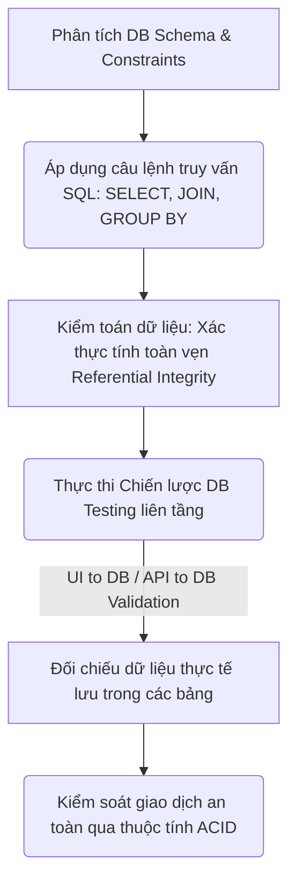
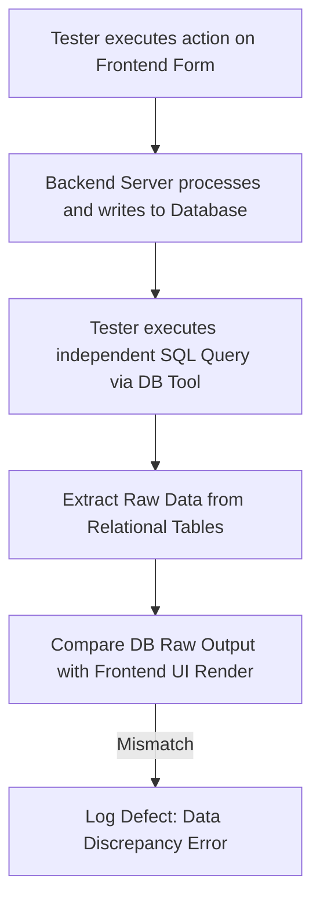
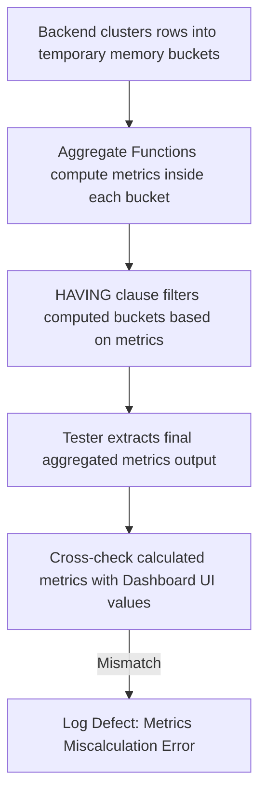
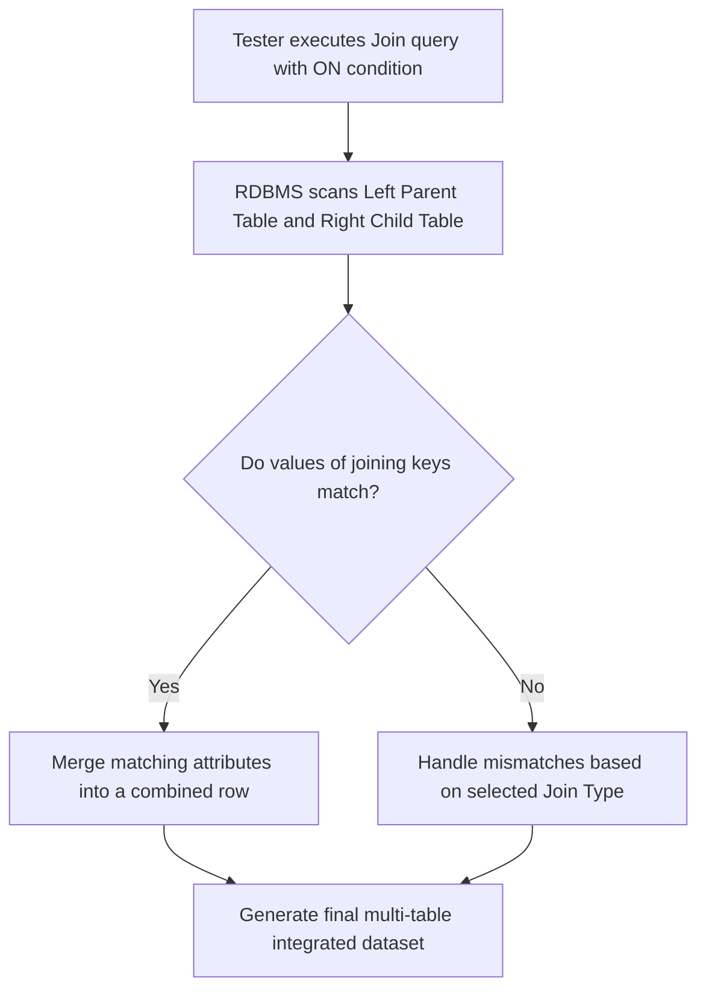
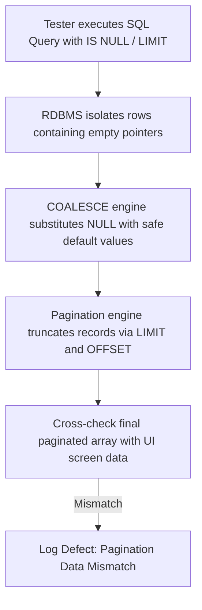

# 📁 06. Database & SQL Testing

*Mục tiêu: Thẩm định và kiểm toán dữ liệu nằm ẩn dưới hệ thống thông qua việc làm chủ các khái niệm cơ sở dữ liệu cốt lõi, vận hành thành thạo các câu lệnh truy vấn SQL từ cơ bản đến nâng cao và thực thi chiến lược kiểm thử toàn vẹn dữ liệu.*

# **6.2. SQL Fundamentals for Testers**

## 📌 Mục lục nội bộ (Chặng 06)

- [ ] [**6.1. Database Fundamentals**](./1_DBFundamentals.md)
- [ ] [**6.2. SQL Fundamentals for Testers**](./2_SQLFundamentals.md)
  - [ ] [6.2.1. Data Query: SELECT, WHERE, ORDER BY, DISTINCT](#621-data-query-select-where-order-by-distinct)
  - [ ] [6.2.2. Data Aggregation: GROUP BY, HAVING, Aggregate Functions](#622-data-aggregation-group-by-having-aggregate-functions)
  - [ ] [6.2.3. Table Joins: INNER, LEFT, RIGHT, FULL JOIN](#623-table-joins-inner-left-right-full-join)
  - [ ] [6.2.4. Handling NULL Values & Limits](#624-handling-null-values--limits)
- [ ] [**6.3. Advanced Database Concepts**](./3_DBConcepts.md)
- [ ] [**6.4. Database Testing Strategies**](./4_DBTesting.md)
- [ ] [**6.5. NoSQL Overview**](./5_NoSQLOverview.md)

---

## 🗺️ Bản đồ Tiến trình Từ Nền tảng Dữ liệu đến Chiến lược Kiểm thử Kho lưu trữ

Sơ đồ dưới đây mô tả cách Tester dịch chuyển từ tư duy phân tích cấu trúc sang việc áp dụng các câu lệnh truy vấn nhằm kiểm toán tính toàn vẹn và an toàn của dữ liệu ngầm:



---

# 6.2.1. Data Query: SELECT, WHERE, ORDER BY, DISTINCT

Kiểm thử RDBMS (Database Testing) dịch chuyển hoàn toàn tư duy của một Tester: Bạn không còn kiểm tra xem ứng dụng hiển thị cái gì, mà là đang kiểm toán xem **bản chất sự thật của dữ liệu** lưu dưới đĩa cứng có chính xác tuyệt đối hay không. Giao diện hiển thị (UI) có thể lừa dối bằng các dòng trạng thái giả lập hoặc thông báo ảo, nhưng dữ liệu nằm trong hệ cơ sở dữ liệu quan hệ (RDBMS) luôn phản ánh sự thật duy nhất của toàn bộ hệ thống.

> ⚠️ **Nguyên lý đối chiếu bất đồng bộ (UI-DB Asynchronous Principle):** Những gì hiển thị trên màn hình giao diện (UI) chưa chắc là những gì đang được lưu dưới đĩa cứng. QA bắt buộc phải dùng câu lệnh truy vấn SQL độc lập để đối chiếu chéo (Cross-check), lật tẩy các lỗi render sai lệch của Frontend hoặc lỗi xử lý logic ngầm của Backend.

---

## 🛠️ Luồng Xử lý Kiểm toán Chi tiết và Đối chiếu Dữ liệu Liên tầng

Sơ đồ đơn sắc dưới đây mô tả chu trình thực chiến khi QA thực thi một hành động trên giao diện, sau đó dùng câu lệnh truy vấn SQL để kiểm toán tính chính xác của kho dữ liệu:



---

## 📊 Ma trận Khai thác Câu lệnh Truy vấn nền tảng (QA Mindset)

Dưới đây là ma trận phân rã chi tiết 4 cú pháp truy vấn nền tảng, bóc tách theo đúng quy chuẩn vi mô để phục vụ việc thiết kế kịch bản kiểm toán dữ liệu:

| Câu lệnh SQL | Khái niệm kỹ thuật lõi | Trọng tâm kiểm thử (QA Focus) | Kịch bản lỗi điển hình thực chiến (Defect) |
| :--- | :--- | :--- | :--- |
| **1. SELECT** | Cú pháp chỉ định các cột dữ liệu cụ thể cần trích xuất và hiển thị từ một bảng. | **Cấm dùng lười biếng (`SELECT *`)**. Chỉ gọi chính xác các trường cần đối chiếu chéo với API Response hoặc giao diện UI hiển thị để tối ưu hóa hiệu năng. | Lập trình viên gọi dư thừa hàng trăm cột không cần thiết lên Frontend gây lỗi nghẽn băng thông mạng hoặc che giấu các trường thông tin nhạy cảm. |
| **2. WHERE** | Bộ lọc điều kiện logic dùng để trích xuất các bản ghi thỏa mãn một tiêu chí cụ thể. | Áp dụng tư duy phân vùng tương đương (*Equivalence Partitioning*). Tạo các điều kiện biên để tìm kiếm dữ liệu bất thường (`WHERE balance < 0`, `WHERE input IS NULL`). | **Lỗi phân trang/Lọc:** Trên UI bộ lọc báo có 10 đơn hàng "Đã hủy", nhưng câu lệnh `WHERE status = 'CANCELLED'` trong DB trả về 12 dòng thô. |
| **3. DISTINCT** | Cú pháp loại bỏ tất cả các dòng trùng lặp hoàn toàn để trả về một tập hợp các giá trị duy nhất. | So sánh tổng số dòng (`COUNT`) thông thường với số dòng chứa `DISTINCT` để săn tìm các lỗi nhân đôi bản ghi. | Người dùng bị lag mạng, bấm nút Đăng ký 2 lần liên tục khiến DB lưu trùng 2 dòng email giống hệt nhau do Backend thiếu chốt chặn kiểm tra trùng lặp. |
| **4. ORDER BY** | Cú pháp sắp xếp tập dữ liệu trả về theo thứ tự tăng dần (`ASC`) hoặc giảm dần (`DESC`). | Mô phỏng chính xác thuật toán sắp xếp của nghiệp vụ trên DB thô để đối chiếu chéo thứ tự render hiển thị trên màn hình UI. | Tính năng "Sắp xếp sản phẩm theo giá giảm dần" trên Web hiển thị sai vị trí (Ví dụ: Sản phẩm ít tiền hơn nhảy lên đầu) do Frontend render lỗi. |

---

## 🧠 Chiến lược Áp dụng Truy vấn phối hợp trong Thực chiến QA

Khi kiểm thử các tính năng phức tạp (Ví dụ: Màn hình lịch sử giao dịch của ví điện tử), một Tester thực chiến không bao giờ chạy các câu lệnh đơn lẻ. Bạn cần biết cách phối hợp toàn bộ bộ tứ quyền lực này thành một kịch bản kiểm toán hoàn chỉnh:

```sql
SELECT DISTINCT transaction_id, amount, status 
FROM wallet_transactions 
WHERE user_id = 9988 AND status = 'SUCCESS' 
ORDER BY created_at DESC;
```
Câu lệnh trên cho phép bạn cô lập hoàn toàn vùng dữ liệu của một khách hàng cụ thể, loại bỏ các mã giao dịch trùng lặp do lỗi hệ thống, lọc đúng trạng thái thành công và sắp xếp theo thời gian mới nhất. Đầu ra của câu lệnh này chính là **Expected Result thô tuyệt đối**. Hãy cầm kết quả này và đối chiếu trực tiếp với màn hình lịch sử trên ứng dụng di động để thẩm định chất lượng sản phẩm.

---

## 📚 References
* [ISTQB® Certified Tester Foundation Level (CTFL) Syllabus v4.0](https://istqb.org) - Section 4.2.3: Specification-Based and Structural Testing of Data Repositories.
* [ISO/IEC/IEEE 29119-4:2021 Standard](https://iso.org) - Software Testing: Test Techniques for Data Integrity and Query-Based Verification.

# 6.2.2. Data Aggregation: GROUP BY, HAVING, Aggregate Functions

Trong hoạt động kiểm thử các màn hình thống kê, báo cáo tổng hợp (Dashboard, Financial Report), Tester không thể đối chiếu dữ liệu bằng các câu lệnh truy vấn thô thông thường. Bạn bắt buộc phải làm chủ **Aggregate Functions (Hàm gom cụm)** kết hợp mệnh đề **GROUP BY** và **HAVING** để tự xây dựng bộ khung kiểm toán số liệu độc lập, lật tẩy các lỗi tính toán sai lệch của Backend trước khi dữ liệu được render lên UI.

> ⚠️ **Nguyên lý kiểm toán số liệu tổng hợp (Aggregation Audit Principle):** Dữ liệu thống kê hiển thị trên Dashboard rất dễ bị sai lệch do Backend tính toán sai thuật toán gom cụm hoặc lọc sai điều kiện. QA bắt buộc phải tự viết các câu lệnh Aggregation SQL để tính toán độc lập và đối chiếu chéo số liệu thô giữa DB với UI.

---

## 🛠️ Luồng Xử lý Kiểm toán Báo cáo Tổng hợp tầng Dữ liệu (Metrics Validation Lifecycle)

Sơ đồ đơn sắc dưới đây mô tả chu trình thực chiến khi QA thực hiện gom nhóm và tính toán dữ liệu thô trong DB để đối chiếu với các chỉ số hiển thị trên Dashboard:



---

## 📊 Ma trận Khai thác Câu lệnh Gom nhóm và Tính toán Thống kê (QA Mindset)

Dưới đây là ma trận phân rã chi tiết các cú pháp gom cụm nâng cao, bóc tách theo đúng quy chuẩn vi mô để phục vụ thiết kế kịch bản kiểm thử báo cáo:

| Câu lệnh SQL | Khái niệm kỹ thuật lõi | Trọng tâm kiểm thử (QA Focus) | Kịch bản lỗi điển hình thực chiến (Defect) |
| :--- | :--- | :--- | :--- |
| **1. Aggregate Functions** | Các hàm toán học gom cụm giá trị của nhiều hàng thành một chỉ số duy nhất (`COUNT`, `SUM`, `AVG`, `MIN`, `MAX`). | Xác thực tính toán biên. Thử nghiệm hàm với tập dữ liệu chứa giá trị `NULL` hoặc giá trị âm xem hàm xử lý chính xác không. | **Lỗi xử lý NULL:** Hàm `AVG` tính sai giá trị trung bình do lập trình viên đếm nhầm cả các dòng có giá trị `NULL` thay vì loại bỏ chúng. |
| **2. GROUP BY** | Mệnh đề phân loại và gom các bản ghi có cùng giá trị ở các cột chỉ định vào từng nhóm độc lập. | Kiểm tra xem Backend có gom nhóm thiếu trường thông tin hoặc gom sai thuộc tính phân loại theo yêu cầu nghiệp vụ không. | Màn hình "Doanh thu theo từng danh mục sản phẩm" hiển thị sai lệch số tiền do Backend đặt nhầm trường gom nhóm trong mã nguồn. |
| **3. HAVING** | Bộ lọc điều kiện logic áp dụng trực tiếp lên các chỉ số đã được tính toán xong sau mệnh đề `GROUP BY`. | **Phân biệt rõ `WHERE` và `HAVING`**. Dùng `HAVING` để kiểm thử các kịch bản lọc biên dựa trên tổng số lượng hoặc tổng giá trị (Ví dụ: `HAVING SUM(amount) > 1000000`). | Bộ lọc "Danh sách đại lý có doanh số trên 1 tỷ" hiển thị sót dữ liệu do lập trình viên dùng sai mệnh đề lọc hoặc tính sai mốc biên. |

---

## 🧠 Chiến lược Áp dụng Kiểm toán Báo cáo Doanh thu Thực chiến

Hãy tưởng tượng bạn đang kiểm thử một màn hình Dashboard hiển thị: *"Tổng doanh thu và số lượng đơn hàng thành công của từng khách hàng trong tháng này, chỉ lấy những khách hàng có tổng chi tiêu trên 5 triệu đồng"*. 

Để tạo ra bộ dữ liệu đối chứng (Expected Result), bạn cần thực thi câu lệnh SQL tích hợp sau trực tiếp trong Database:

```sql
SELECT user_id, COUNT(id) AS total_orders, SUM(total_amount) AS total_revenue
FROM orders
WHERE status = 'SUCCESS' AND created_at >= '2026-09-01'
GROUP BY user_id
HAVING SUM(total_amount) > 5000000;
```

Tư duy phản biện của một Tester sắc bén khi phân tích kết quả câu lệnh này bao gồm:
1.  **Đối chiếu chéo (Cross-check):** Lấy giá trị `total_revenue` and `total_orders` của một `user_id` bất kỳ trong bảng kết quả, đối chiếu trực tiếp với thông tin hiển thị của khách hàng đó trên giao diện Dashboard.
2.  **Săn lỗi biên (Boundary Bug Hunting):** Kiểm tra xem những khách hàng có tổng chi tiêu đúng bằng `5,000,000` hoặc `5,000,001` có bị hiển thị sai lệch hoặc bị lọc mất khỏi danh sách do Backend dùng sai dấu so sánh (Dùng `>` thay vì `>=`) hay không.

---

## 📚 References
* [ISTQB® Certified Tester Foundation Level (CTFL) Syllabus v4.0](https://istqb.org) - Section 4.2.3: Specification-Based and Structural Testing of Data Repositories.
* [ISO/IEC/IEEE 29119-4:2021 Standard](https://iso.org) - Software Testing: Test Techniques for Data Quality and Aggregated Metrics Verification.

# 6.2.3. Table Joins: INNER, LEFT, RIGHT, FULL JOIN

Trong kiểm thử tích hợp (Integration Testing) tầng cơ sở dữ liệu, Tester không bao giờ làm việc trên một bảng đơn lẻ. Dòng chảy nghiệp vụ của một phần mềm hiện đại luôn phân rã thông tin ra nhiều thực thể độc lập để tối ưu hóa lưu trữ. Thành thạo kỹ thuật liên kết bảng **Table Joins** là điều kiện bắt buộc để QA thực hiện kiểm toán mối liên hệ logic giữa các thực thể, bóc tách dữ liệu và lật tẩy các lỗi logic ghép nối ngầm của Backend.

> ⚠️ **Nguyên lý kiểm toán tích hợp dữ liệu (Data Integration Audit Principle):** Các lỗi nghiêm trọng nhất của hệ thống thường phát sinh tại ranh giới kết nối giữa các bảng (Join Boundaries). Việc Backend sử dụng sai kiểu Join sẽ trực tiếp làm biến mất dữ liệu hợp pháp hoặc tạo ra các hàng dữ liệu ma (Ghost Rows) render lên UI của người dùng.

---

## 🛠️ Luồng Xử lý Kiểm toán Liên kết Bảng liên tầng (Join Logical Lifecycle)

Sơ đồ đơn sắc dưới đây mô tả cách thức động cơ RDBMS đối chiếu các điều kiện khóa để ghép nối các hàng dữ liệu từ hai thực thể độc lập trước khi xuất kết quả cho QA:



---

## 📊 Ma trận Khai thác Các Phương thức Liên kết Bảng (QA Mindset)

Dưới đây là ma trận phân rã chi tiết 4 kỹ thuật Join cốt lõi, bóc tách theo quy chuẩn vi mô để cấu trúc hóa kịch bản tìm kiếm Bug tích hợp:

| Loại câu lệnh JOIN | Bản chất vận hành ngầm | Trọng tâm kiểm thử (QA Focus) | Kịch bản lỗi điển hình thực chiến (Defect) |
| :--- | :--- | :--- | :--- |
| **1. INNER JOIN** | Chỉ trích xuất và kết hợp các hàng khi giá trị khóa ở cả hai bảng khớp nhau hoàn toàn. | Kiểm tra tính bắt buộc của mối quan hệ. Xác thực xem các bản ghi có đầy đủ ràng buộc ở cả 2 đầu thực thể không. | **Lỗi nuốt bản ghi:** Màn hình lịch sử đơn hàng bị trống trơn do lập trình viên dùng `INNER JOIN` làm mất toàn bộ đơn hàng của các khách hàng mới chưa cập nhật thông tin profile. |
| **2. LEFT JOIN** | Lấy toàn bộ các hàng từ bảng bên trái (Left), kèm theo các hàng trùng khớp từ bảng bên phải (Right). Nếu không khớp, điền `NULL` vào các cột bảng phải. | Kiểm tra tính toàn vẹn dữ liệu gốc. Đảm bảo thực thể chính bên trái không bị mất dòng nào bất kể trạng thái liên kết ở bảng phải. | **Lỗi sập giao diện (NPE):** Khách hàng chưa mua đơn nào (Cột bảng phải trả về `NULL`). Giao diện Frontend bị crash trắng màn hình do Backend ném lỗi Null Pointer Exception. |
| **3. RIGHT JOIN** | Lấy toàn bộ các hàng từ bảng bên phải, kèm các hàng trùng khớp từ bảng bên trái. Nếu không khớp, điền `NULL` vào các cột bảng trái. | **Tư duy lật ngược thế trận.** Sử dụng để săn lùng các bản ghi mồ côi (*Orphaned Records*) ở bảng con mà không có thực thể cha tương ứng. | Phát hiện dữ liệu ma: Hệ thống xuất hiện các đơn hàng thành công vô chủ (Có mã đơn nhưng `user_id` không tồn tại trong hệ thống người dùng). |
| **4. FULL JOIN** | Trích xuất tất cả các bản ghi khi có sự trùng khớp ở một trong hai bảng trái hoặc phải. Điền `NULL` cho các phần không có sự trùng khớp. | Kiểm thử các kịch bản đối soát dữ liệu diện rộng (Data Reconciliation) giữa 2 hệ thống độc lập tích hợp vào nhau (Ví dụ: Cổng thanh toán vs DB Nội bộ). | Phát hiện các lỗ hổng lệch pha dòng tiền hoặc mất đồng bộ dữ liệu giữa hệ thống cốt lõi và hệ thống bên thứ ba tích hợp. |

---

## 🧠 Chiến lược Thực chiến QA: Kiểm toán Luồng Tích hợp Đơn hàng

Hãy tưởng tượng bạn đang kiểm thử tính năng "Chiết xuất dữ liệu lịch sử mua sắm" trên hệ thống Admin Dashboard. Hệ thống yêu cầu hiển thị: *Tên khách hàng, Email, Mã đơn hàng, và Tổng tiền, bao gồm cả những khách hàng vừa đăng ký tài khoản và chưa mua bất kỳ đơn hàng nào*.

Để tạo ra bộ dữ liệu đối chứng (Expected Result), bạn phải thực thi câu lệnh SQL tích hợp liên bảng sau:

```sql
SELECT u.customer_name, u.email, o.order_id, o.total_amount
FROM users u
LEFT JOIN orders o ON u.id = o.user_id
ORDER BY o.total_amount DESC;
```

Tư duy phản biện của một Tester sắc bén khi phân tích dữ liệu trả về từ câu lệnh này:
1.  **Thẩm định số lượng bản ghi (Row Count Verification):** Đếm tổng số dòng trả về từ câu lệnh `LEFT JOIN`. Số dòng này bắt buộc phải lớn hơn hoặc bằng tổng số dòng của bảng `users`. Nếu nhỏ hơn, chứng tỏ lập trình viên đã dùng nhầm `INNER JOIN`, làm biến mất dữ liệu của những người dùng chưa mua hàng.
2.  **Kiểm tra biên giá trị trống (Null-Value Edge Testing):** Tìm đến các dòng có `order_id IS NULL` (Khách hàng chưa mua hàng). Đối chiếu với Admin Dashboard xem giao diện hiển thị các ô thông tin đơn hàng là khoảng trống an toàn hay hiển thị chữ `null` thô mộc, hoặc tệ hơn là tính toán sai tổng chi tiêu thành một con số rác.

---

## 📚 References
* [ISTQB® Certified Tester Foundation Level (CTFL) Syllabus v4.0](https://istqb.org) - Section 2.2.1: Component Integration Testing and Multi-Table Boundary Discrepancies.
* [ISO/IEC/IEEE 29119-4:2021 Standard](https://iso.org) - Software Testing: Test Techniques for Data Integration and Referential Integrity Verification.

# 6.2.4. Handling NULL Values & Limits

Trong kiểm thử phần mềm thực chiến, các lỗi nghiêm trọng nhất thường không nằm ở luồng chạy bình thường (Happy Path), mà ẩn nấp tại các vùng dữ liệu rỗng hoặc các điểm phân tách trang. Thành thạo kỹ thuật xử lý **NULL Values (Giá trị trống rỗng)** và kiểm soát các mệnh đề **LIMIT / OFFSET (Phân trang dữ liệu)** giúp Tester làm chủ kỹ thuật tìm kiếm lỗi biên tầng sâu, chặn đứng nguy cơ sập giao diện hiển thị hoặc nghẽn hàng đợi máy chủ.

> ⚠️ **Nguyên lý cạm bẫy dữ liệu rỗng và phân trang (Null & Pagination Trap Principle):** Giá trị `NULL` không phải là số 0, cũng không phải là một chuỗi trống. Việc Backend tính toán sai lệch trên các ô dữ liệu `NULL` hoặc Frontend xử lý lỗi luồng phân trang `LIMIT` là nguyên nhân hàng đầu gây ra lỗi Null Pointer Exception (Sập hệ thống) hoặc rò rỉ bộ nhớ khi tải dữ liệu số lượng lớn.

---

## 🛠️ Luồng Xử lý Kiểm toán và Tính toán Giá trị Biên Dữ liệu (Null & Limit Lifecycle)

Sơ đồ đơn sắc dưới đây mô tả cách thức hệ thống RDBMS cô lập các giá trị trống rỗng thông qua hàm điều kiện và bóc tách tập dữ liệu theo từng phân đoạn trang trước khi render lên UI:



---

## 📊 Ma trận Khai thác Kỹ thuật Xử lý Dữ liệu Biên và Phân trang (QA Mindset)

Dưới đây là ma trận phân rã chi tiết các cú pháp xử lý dữ liệu đặc thù, bóc tách theo đúng quy chuẩn vi mô để cấu trúc hóa kịch bản săn lùng Bug:

| Cú pháp SQL | Bản chất vận hành ngầm | Trọng tâm kiểm thử (QA Focus) | Kịch bản lỗi điển hình thực chiến (Defect) |
| :--- | :--- | :--- | :--- |
| **1. IS NULL /<br>IS NOT NULL** | Bộ lọc logic dùng để định vị chính xác các ô dữ liệu chưa được khởi tạo giá trị (Con trỏ rỗng). | Săn tìm dữ liệu khuyết thiếu. Thiết kế các kịch bản kiểm tra xem DB có chứa các dòng bị rò rỉ dữ liệu bắt buộc không. | **Lỗi sập chức năng:** Người dùng chưa cập nhật ảnh đại diện (Cột lưu link ảnh bị `NULL`). Khi họ đăng nhập, ứng dụng bị crash lập tức do mã nguồn không xử lý điều kiện `IS NULL`. |
| **2. COALESCE /<br>IFNULL** | Hàm điều kiện giúp kiểm tra từ trái sang phải và trả về giá trị đầu tiên khác `NULL`. Nếu trống, điền giá trị mặc định an toàn. | Kiểm toán luồng tính toán tài chính. Thử nghiệm xem hệ thống có cơ chế bù đắp dữ liệu an toàn khi gặp giá trị rỗng không. | **Lỗi hiển thị rác:** Trên UI màn hình ví điện tử hiển thị số tiền là `null VND` hoặc lỗi trắng màn hình do lập trình viên không dùng hàm `COALESCE(balance, 0)` để xử lý. |
| **3. LIMIT /<br>OFFSET** | `LIMIT` quy định số lượng dòng tối đa được trích xuất. `OFFSET` quy định số lượng dòng bị bỏ qua từ trên đầu tập dữ liệu xuống. | **Kiểm thử tính năng Phân trang (Pagination Testing)**. Đối chiếu số lượng bản ghi hiển thị trên một trang Web với thông số cấu hình của câu lệnh `LIMIT`. | **Lỗi trùng lặp/Sót bản ghi:** Khi người dùng chuyển từ Trang 1 sang Trang 2, họ thấy các bản ghi cũ bị lặp lại hoặc bị mất dòng do Backend tính toán sai công thức `OFFSET = (Page - 1) * LIMIT`. |

---

## 🧠 Chiến lược Thực chiến QA: Kiểm toán Luồng Phân trang và Bù đắp Dữ liệu

Hãy tưởng tượng bạn đang kiểm thử màn hình "Bảng xếp hạng đại lý có doanh số cao nhất" trên hệ thống Web nội bộ. Hệ thống yêu cầu: *Mỗi trang chỉ hiển thị tối đa 5 đại lý (Phân trang), xếp hạng theo doanh thu giảm dần, những đại lý mới chưa có doanh thu phải tự động hiển thị số 0 thay vì để trống*.

Để tạo bộ dữ liệu đối chứng tuyệt đối (Expected Result) cho **Trang số 2** của hệ thống, bạn cần thực thi câu lệnh SQL phối hợp sau:

```sql
SELECT agency_name, COALESCE(total_sales, 0) AS sales_amount
FROM agencies
ORDER BY total_sales DESC
LIMIT 5 OFFSET 5;
```

Tư duy phản biện của một Tester sắc bén khi phân tích dữ liệu trả về từ câu lệnh này:
1.  **Xác thực ranh giới phân trang (Pagination Boundary Test):** Bản ghi số 1 của Trang 2 trong DB bắt buộc phải là bản ghi thứ 6 trong danh sách tổng thể. Nếu trên giao diện UI hiển thị bản ghi đầu tiên của Trang 2 trùng lặp với bản ghi cuối cùng của Trang 1, bạn đã bắt được lỗi tính toán sai chỉ số `OFFSET` ở máy chủ Backend.
2.  **Kiểm tra tính an toàn dữ liệu rỗng (Null Integrity Check):** Tìm đến các đại lý mới thành lập (Cột `total_sales` gốc trong DB là `NULL`). Xác thực xem câu lệnh `COALESCE` có chuyển đổi mượt mà thành số `0` trên màn hình hay không. Nếu UI hiển thị chữ `NaN` hoặc `null`, lập tức log lỗi render giao diện.

---

## 📚 References
* [ISTQB® Certified Tester Foundation Level (CTFL) Syllabus v4.0](https://istqb.org) - Section 4.2.3: Specification-Based and Structural Testing of Data Repositories (Boundary Value Analysis on Datasets).
* [ISO/IEC/IEEE 29119-4:2021 Standard](https://iso.org) - Software Testing: Test Techniques for Data Integrity, Exception Handling and Pagination Limits Validation.

