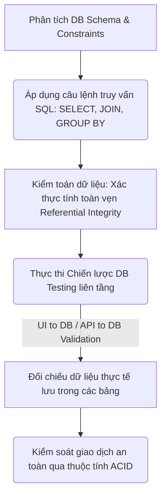
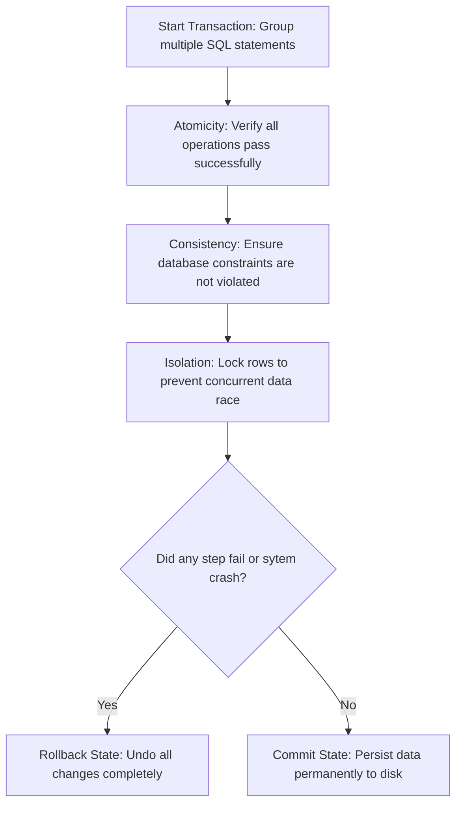
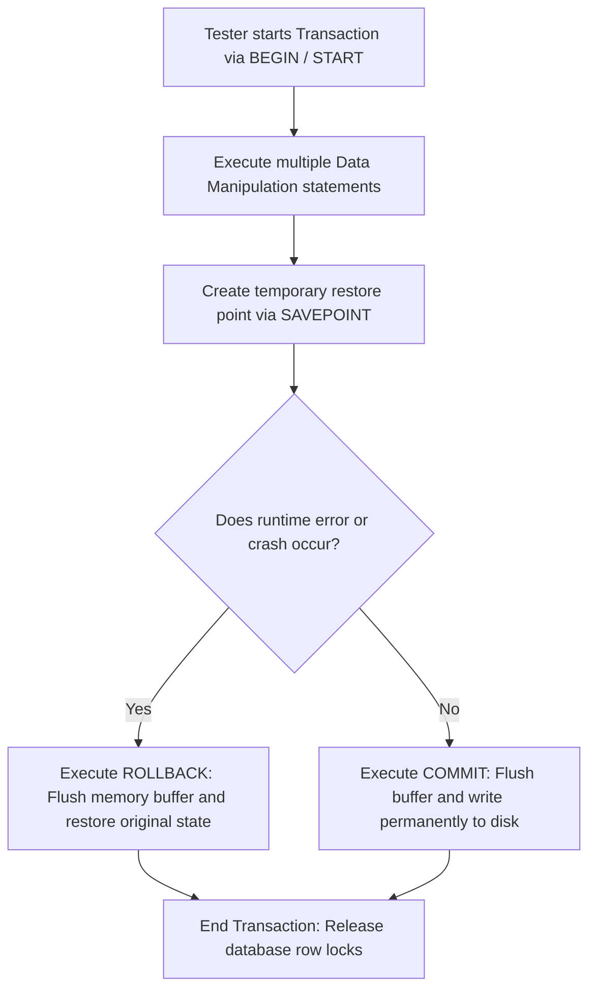
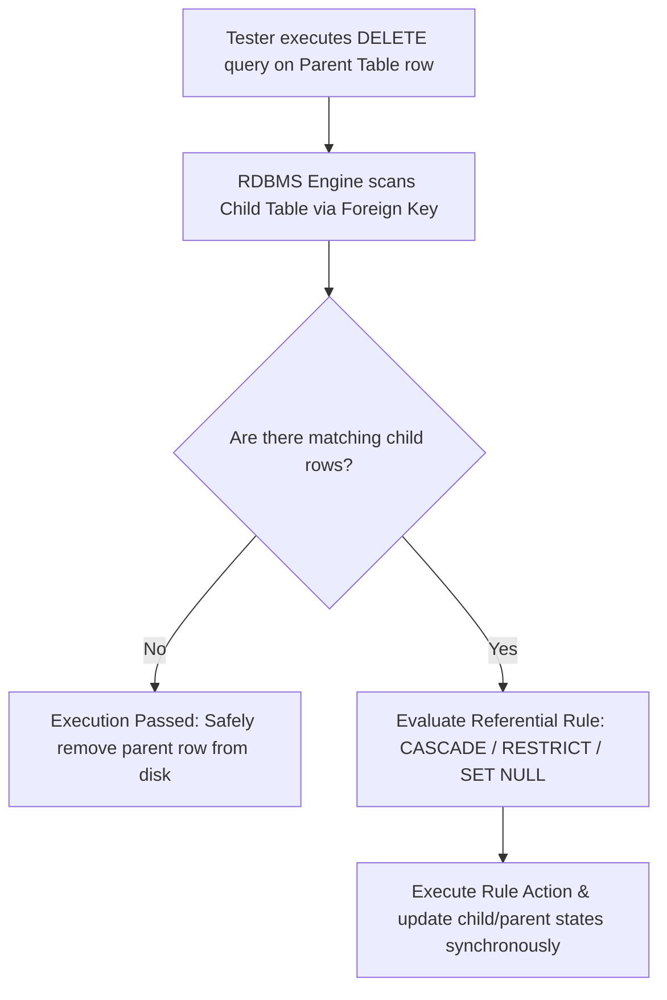

# 📁 06. Database & SQL Testing

*Mục tiêu: Thẩm định và kiểm toán dữ liệu nằm ẩn dưới hệ thống thông qua việc làm chủ các khái niệm cơ sở dữ liệu cốt lõi, vận hành thành thạo các câu lệnh truy vấn SQL từ cơ bản đến nâng cao và thực thi chiến lược kiểm thử toàn vẹn dữ liệu.*

# **6.3. Advanced Database Concepts**

## 📌 Mục lục nội bộ (Chặng 06)

- [ ] [**6.1. Database Fundamentals**](./1_DBFundamentals.md)
- [ ] [**6.2. SQL Fundamentals for Testers**](./2_SQLFundamentals.md)
- [ ] [**6.3. Advanced Database Concepts**](./3_DBConcepts.md)
  - [ ] [6.3.1. ACID Properties & Transactions](#631-acid-properties--transactions)
  - [ ] [6.3.2. Transaction Control: COMMIT & ROLLBACK](#632-transaction-control-commit--rollback)
  - [ ] [6.3.3. Referential Integrity](#633-referential-integrity)
- [ ] [**6.4. Database Testing Strategies**](./4_DBTesting.md)
- [ ] [**6.5. NoSQL Overview**](./5_NoSQLOverview.md)

---

## 🗺️ Bản đồ Tiến trình Từ Nền tảng Dữ liệu đến Chiến lược Kiểm thử Kho lưu trữ

Sơ đồ dưới đây mô tả cách Tester dịch chuyển từ tư duy phân tích cấu trúc sang việc áp dụng các câu lệnh truy vấn nhằm kiểm toán tính toàn vẹn và an toàn của dữ liệu ngầm:



---

# 6.3.1. ACID Properties & Transactions

Trong kiểm thử các hệ thống tài chính, ngân hàng, hoặc thương mại điện tử, Tester không thể chỉ kiểm tra dữ liệu ở trạng thái tĩnh. Bạn phải làm chủ khái niệm **Transaction (Giao dịch dữ liệu)** và bộ bốn thuộc tính vàng **ACID (Atomicity, Consistency, Isolation, Durability)**. Đây là những quy chuẩn tối cao bắt buộc phải có để bảo vệ an toàn tuyệt đối cho kho dữ liệu khi có hàng nghìn luồng xử lý đồng thời hoặc khi xảy ra sự cố phần cứng đột ngột.

> ⚠️ **Nguyên lý toàn vẹn giao dịch liên tầng (Transactional Integrity Principle):** Một hành động của người dùng trên UI (Ví dụ: Bấm nút Chuyển tiền) thường kích hoạt một chuỗi nhiều câu lệnh ghi dữ liệu ngầm vào DB. Nếu hệ thống DB không tuân thủ nghiêm ngặt bộ thuộc tính ACID, một lỗi sập mạng giữa chừng sẽ làm rách nát kho dữ liệu, tạo ra các lỗi nghiêm trọng như tài khoản gửi đã trừ tiền nhưng tài khoản nhận chưa nhận được.

---

## 🛠️ Luồng Vận hành và Chốt chặn của một Giao dịch Dữ liệu (Transaction Lifecycle)

Sơ đồ đơn sắc dưới đây mô tả chu trình kiểm soát dữ liệu nghiêm ngặt từ khi một giao dịch được khởi tạo, đi qua các bộ lọc thuộc tính ACID cho đến khi được ghi nhận vĩnh viễn hoặc hủy bỏ:



---

## 📊 Ma trận Phân tích Thuộc tính ACID dưới lăng kính Kiểm thử (QA Mindset)

Dưới đây là ma trận bóc tách chi tiết 4 thuộc tính ACID, được phân rã theo quy chuẩn vi mô để phục vụ thiết kế các kịch bản test độ bền và bảo mật tầng sâu:

| Thuộc tính ACID | Bản chất vận hành ngầm | Trọng tâm kiểm thử (QA Focus) | Kịch bản lỗi điển hình thực chiến (Defect) |
| :--- | :--- | :--- | :--- |
| **1. Atomicity<br>(Tính nguyên tử)** | Quy tắc "Tất cả hoặc không có gì" (All or Nothing). Toàn bộ các câu lệnh trong giao dịch phải thành công, nếu một câu lệnh lỗi, cả giao dịch bị hủy bỏ. | **Kiểm thử gián đoạn nghiệp vụ (Interruption Test).** Cố tình ngắt mạng, tắt nguồn ứng dụng đúng vào khoảnh khắc hệ thống đang ghi dữ liệu giữa chừng. | **Lỗi lệch pha tài chính:** Hệ thống trừ tiền tài khoản A thành công, nhưng máy chủ sập trước khi cộng tiền cho tài khoản B. DB không tự động hủy lệnh cũ, làm biến mất số tiền của khách. |
| **2. Consistency<br>(Tính nhất quán)** | Đảm bảo dữ liệu phải chuyển đổi từ trạng thái hợp lệ này sang trạng thái hợp lệ khác, tuân thủ đúng mọi ràng buộc định sẵn. | Kiểm toán tổng số liệu trước và sau giao dịch. Xác thực xem các luật kinh doanh có bị phá vỡ sau khi giao dịch kết thúc không. | Tổng số tiền trong hệ thống ngân hàng bị tăng hoặc giảm vô căn cứ sau khi thực hiện luồng chuyển khoản nội bộ do DB tính toán sai số dư. |
| **3. Isolation<br>(Tính cô lập)** | Đảm bảo các giao dịch chạy đồng thời không được can thiệp hoặc nhìn thấy dữ liệu tạm thời của nhau cho đến khi được Commit. | **Kiểm thử đồng thời (Concurrency Testing).** Giả lập 2 kịch bản cùng tác động vào 1 bản ghi tại cùng một thời điểm (Ví dụ: Thao tác đặt mua chiếc áo cuối cùng). | **Lỗi tranh chấp dữ liệu (Race Condition):** Hệ thống chỉ còn 1 sản phẩm tồn kho, nhưng cho phép 2 khách hàng khác nhau cùng đặt mua thành công do DB thiếu cơ chế khóa dòng dữ liệu (*Row Locking*). |
| **4. Durability<br>(Tính bền vững)** | Đảm bảo một khi giao dịch đã thành công (Commit), dữ liệu phải được lưu vĩnh viễn vào đĩa cứng, không bị mất ngay cả khi sập nguồn. | **Kiểm thử phục hồi sau thảm họa (Disaster Recovery).** Giả lập tình huống sập nguồn điện của máy chủ Database ngay sau khi ứng dụng báo "Giao dịch thành công". | Ứng dụng báo chuyển tiền thành công, nhưng khi ngân hàng sập nguồn và khởi động lại, dữ liệu giao dịch biến mất hoàn toàn do DB chỉ lưu trên bộ nhớ tạm RAM. |

---

## 🧠 Chiến lược Thực chiến QA: Thiết kế Ca kiểm thử Đồng thời (Race Condition)

Hãy tưởng tượng bạn được giao nhiệm vụ kiểm thử tính năng "Mua vé xem phim trực tuyến". Kịch bản kiểm thử biên cực hạn (Edge-case) là: *Hai người dùng tài khoản A và B cùng nhấn nút đặt mua một chiếc ghế duy nhất còn sót lại ở cùng một phần tư giây*.

Tư duy phản biện của một Tester sắc bén để thẩm định thuộc tính **Isolation (Tính cô lập)** của RDBMS trong kịch bản này:
1.  **Thiết kế ca test tải đồng thời:** Sử dụng công cụ (như JMeter) để gửi 2 request API đặt vé cho cùng một `seat_id` tại cùng một thời điểm.
2.  **Kỳ vọng kết quả ngầm trong DB (Expected Result):** Hệ thống DB bắt buộc phải kích hoạt cơ chế cô lập. Giao diện của người dùng A vào trước (dù chỉ chênh lệch vài mili-giây) sẽ khóa chặt dòng dữ liệu đó (`SELECT ... FOR UPDATE`). Giao diện của người dùng B phải bị xếp hàng chờ hoặc trả về mã lỗi vi phạm đặc quyền (`409 Conflict`). Nếu cả hai người đều mua được vé cho cùng 1 chiếc ghế, hệ thống đã dính lỗi nghiêm trọng về tính cô lập dữ liệu.

---

## 📚 References
* [ISTQB® Certified Tester Foundation Level (CTFL) Syllabus v4.0](https://istqb.org) - Section 2.2.1: Component Integration Testing and Multi-Transaction Concurrency Defects.
* [ISO/IEC/IEEE 29119-4:2021 Standard](https://iso.org) - Software Testing: Test Techniques for Data Integrity, ACID Compliance and Transactional Recovery Verification.

# 6.3.2. Transaction Control: COMMIT & ROLLBACK

Trong kiểm thử hộp xám tầng cơ sở dữ liệu, việc thẩm định cơ chế kiểm soát giao dịch (TCL - Transaction Control Language) là chốt chặn bắt buộc để xác thực tính toàn vẹn dữ liệu. Bộ đôi lệnh **COMMIT (Xác nhận ghi nhận)** và **ROLLBACK (Hủy bỏ và khôi phục)** chính là công cụ hiện thực hóa thuộc tính Atomicity (Tính nguyên tử) của hệ thống. Thành thạo việc kiểm thử luồng hoạt động của hai lệnh này giúp Tester đảm bảo hệ thống luôn có khả năng tự dọn dẹp và đưa dữ liệu về trạng thái an toàn khi xảy ra sự cố đột ngột.

> ⚠️ **Nguyên lý điểm phục hồi dữ liệu (Transaction Boundary Principle):** Mọi thay đổi dữ liệu (`INSERT`, `UPDATE`, `DELETE`) bên trong một giao dịch chỉ mang tính chất tạm thời và được cô lập trong bộ nhớ đệm. Dữ liệu chỉ trở thành "sự thật vĩnh viễn" sau khi lệnh `COMMIT` được thực thi, và phải được xóa sạch không dấu vết nếu lệnh `ROLLBACK` được kích hoạt.

---

## 🛠️ Luồng Điều khiển Giao dịch và Đảo ngược Dữ liệu (TCL Workflow Lifecycle)

Sơ đồ đơn sắc dưới đây mô tả cách thức DB Engine phân tích các điểm lưu trữ và quyết định ghi nhớ hoặc hoàn tác toàn bộ dữ liệu:



---

## 📊 Ma trận Kiểm toán Câu lệnh Điều khiển Giao dịch (QA Mindset)

Dưới đây là ma trận phân rã chi tiết các cú pháp điều khiển giao dịch, bóc tách theo quy chuẩn vi mô để phục vụ thiết kế các kịch bản test luồng gián đoạn (Interruption Testing):

| Câu lệnh TCL | Bản chất vận hành ngầm | Trọng tâm kiểm thử (QA Focus) | Kịch bản lỗi điển hình thực chiến (Defect) |
| :--- | :--- | :--- | :--- |
| **1. COMMIT** | Ghi dữ liệu từ bộ nhớ đệm (Buffer RAM) xuống đĩa cứng vật lý và kết thúc giao dịch một cách an toàn. | **Kiểm thử tính bền vững.** Xác thực xem ngay sau khi hệ thống báo `COMMIT` thành công, nếu sập nguồn, dữ liệu có bị biến mất không. | Ứng dụng thông báo "Giao dịch thành công", tiền đã trừ trên giao diện hiển thị nhưng trong DB không tìm thấy bản ghi do Backend quên gọi lệnh `COMMIT` ở cuối hàm xử lý. |
| **2. ROLLBACK** | Hủy bỏ toàn bộ các thay đổi chưa được lưu, xóa bộ nhớ đệm và đưa dữ liệu về trạng thái trước khi giao dịch bắt đầu. | **Kiểm thử hoàn tác sự cố.** Chủ động tiêm lỗi (Inject Error) vào câu lệnh cuối cùng của chuỗi giao dịch để ép hệ thống phải kích hoạt lệnh `ROLLBACK`. | **Lỗi rò rỉ dữ liệu tạm:** Hệ thống gặp lỗi ở bước 3 (Không cộng được tiền) nhưng không thực thi lệnh `ROLLBACK`, dẫn đến việc tài khoản gửi vẫn bị trừ tiền ở bước 1 (Dữ liệu bị lệch pha). |
| **3. SAVEPOINT** | Tạo một điểm đánh dấu trung gian bên trong giao dịch, cho phép lệnh `ROLLBACK TO` chỉ hoàn tác một phần dữ liệu đến điểm đó. | **Kiểm thử phân đoạn nghiệp vụ.** Thử nghiệm các luồng giao dịch phức tạp có nhiều bước phụ độc lập (Ví dụ: Luồng đặt vé máy bay kết hợp đặt phòng khách sạn). | Hệ thống đặt phòng khách sạn bị lỗi làm hủy luôn cả vé máy bay đã đặt thành công trước đó do lập trình viên cấu hình sai điểm neo `SAVEPOINT`. |

---

## 🧠 Chiến lược Thực chiến QA: Kiểm toán Luồng Hoàn tác khi Hủy thanh toán

Hãy tưởng tượng bạn đang kiểm thử luồng "Hủy quy trình thanh toán giỏ hàng" ở bước cuối cùng trên một trang thương mại điện tử. Chuỗi giao dịch ngầm bao gồm 3 bước: (1) Sụt giảm số lượng tồn kho sản phẩm $\rightarrow$ (2) Trừ tiền ví điện tử của khách $\rightarrow$ (3) Tạo hóa đơn. Ở bước 3, người dùng chủ động tắt trình duyệt hoặc bấm nút "Hủy".

Tư duy phản biện của một Tester sắc bén để thiết kế ca kiểm thử hộp xám kiểm toán lệnh **ROLLBACK** trong kịch bản này:
1.  **Hành động QA:** Sử dụng công cụ chặn gói tin hoặc tạo điều kiện lỗi giả lập tại bước 3 (Ví dụ: Cấu hình bảng hóa đơn rơi vào trạng thái khóa để ép lỗi).
2.  **Truy vấn Database đối chứng (Expected Result):** Ngay sau khi hệ thống ném ra lỗi tại bước 3, bạn phải viết các câu lệnh `SELECT` độc lập để kiểm tra bảng sản phẩm (`products`) và bảng ví (`wallets`). Số lượng tồn kho và số dư ví của khách **bắt buộc phải quay về nguyên trạng** như trước khi bấm nút. Nếu số dư ví vẫn bị trừ hoặc tồn kho bị sụt giảm, lập tức log lỗi: Hệ thống thiếu cơ chế `ROLLBACK` khi xảy ra gián đoạn giao dịch.

---

## 📚 References
* [ISTQB® Certified Tester Foundation Level (CTFL) Syllabus v4.0](https://istqb.org) - Section 4.2.3: Specification-Based and Structural Testing of Data Repositories (State Transition on Transactions).
* [ISO/IEC/IEEE 29119-4:2021 Standard](https://iso.org) - Software Testing: Test Techniques for Transaction Control, Rollback Recovery and Exceptional Flow Validation.

# 6.3.3. Referential Integrity

Trong kiểm soát chất lượng cơ sở dữ liệu quan hệ, **Referential Integrity (Tính toàn vẹn tham chiếu)** là quy chuẩn tối cao duy trì tính đồng bộ của dữ liệu phân tán. Ràng buộc này đảm bảo mối quan hệ liên kết giữa bảng cha (Parent Table) và bảng con (Child Table) thông qua cặp Khóa chính - Khóa ngoại luôn ở trạng thái hợp lệ. Thành thạo việc kiểm thử tính toàn vẹn tham chiếu giúp Tester chặn đứng các lỗi rò rỉ dữ liệu hoặc hiện tượng phát sinh dữ liệu rác từ gốc rễ của hệ thống.

> ⚠️ **Nguyên lý nhất quán tham chiếu (Referential Consistency Principle):** Database tuyệt đối không được phép tồn tại một bản ghi ở bảng con trỏ đến một bản ghi không tồn tại ở bảng cha. Khi một thực thể cha bị can thiệp (Xóa hoặc Sửa), hệ thống DB bắt buộc phải kích hoạt các hành vi dọn dẹp hoặc chặn lại tự động theo đúng thiết kế quy chuẩn để bảo vệ kho dữ liệu sạch.

---

## 🛠️ Luồng Thực thi Quy tắc Toàn vẹn Tham chiếu tại lõi Động cơ RDBMS

Sơ đồ đơn sắc dưới đây mô tả cách thức hệ thống RDBMS tự động đối chiếu các quy tắc ràng buộc ngoại vi khi Tester hoặc lập trình viên thực hiện hành động xóa một bản ghi ở bảng cha:



---

## 📊 Ma trận Kiểm toán Quy tắc Toàn vẹn Tham chiếu (QA Mindset)

Dưới đây là ma trận phân rã chi tiết 3 quy tắc điều hướng hành vi tham chiếu nâng cao, bóc tách theo đúng cấu trúc vi mô để phục vụ việc thiết kế các kịch bản test phá hủy dữ liệu (Destructive Testing):

| Quy tắc Tham chiếu | Bản chất vận hành ngầm | Trọng tâm kiểm thử (QA Focus) | Kịch bản lỗi điển hình thực chiến (Defect) |
| :--- | :--- | :--- | :--- |
| **1. RESTRICT /<br>NO ACTION** | Chặn đứng hành động xóa/sửa ở bảng cha nếu như đang có ít nhất một bản ghi con trỏ trực tiếp vào nó. | **Kiểm thử chốt chặn an toàn.** Cố tình xóa một tài khoản người dùng khi tài khoản đó đang có đơn hàng đang chạy để xem DB có ném lỗi không. | Hệ thống cho phép xóa tài khoản của Admin khi Admin đó đang quản lý 10 cửa hàng, làm 10 cửa hàng đó rơi vào trạng thái vô chủ. |
| **2. CASCADE** | Tự động thực hiện hành động dây chuyền. Nếu xóa/sửa bản ghi ở bảng cha, toàn bộ bản ghi con liên kết sẽ tự động bị xóa/sửa theo. | **Kiểm thử xóa dây chuyền.** Thực hiện ca test xóa một danh mục sản phẩm xem toàn bộ các sản phẩm thuộc danh mục đó có tự động biến mất không. | **Lỗi rách dữ liệu:** Hệ thống tự động xóa sạch toàn bộ lịch sử hóa đơn tài chính của khách hàng khi Admin bấm nút xóa tài khoản (Gây mất mát dữ liệu kiểm toán). |
| **3. SET NULL** | Khi xóa bản ghi ở bảng cha, hệ thống giữ lại bản ghi con nhưng tự động chuyển giá trị của cột Khóa ngoại thành `NULL`. | **Kiểm thử giữ lại thực thể con.** Xóa một gói dịch vụ thành viên xem tài khoản của các khách hàng đang dùng gói đó có tự động chuyển về trống không. | Cột khóa ngoại ở bảng con bị biến thành giá trị rác hoặc lỗi hệ thống do cột đó bị cấu hình ràng buộc `NOT NULL` kết hợp với `SET NULL`. |

---

## 🧠 Chiến lược Thực chiến QA: Săn lùng Bug Dữ liệu Mồ côi (Orphaned Records)

Lỗi nghiêm trọng nhất của việc thiết lập sai tính toàn vẹn tham chiếu là tạo ra các bản ghi mồ côi (*Orphaned Records*) – những dòng dữ liệu con vẫn tồn tại thô bạo trong DB nhưng không có thực thể cha quản lý.

Tư duy phản biện của một Tester sắc bén để thiết kế ca kiểm thử hộp xám săn lùng lỗi dữ liệu mồ côi:
1.  **Hành động QA:** Chui vào môi trường DB thực tế, sử dụng câu lệnh `RIGHT JOIN` trỏ từ bảng cha `users` sang bảng con `orders` để tìm kiếm điểm lệch pha:
    ```sql
    SELECT o.order_id, o.user_id 
    FROM users u 
    RIGHT JOIN orders o ON u.id = o.user_id 
    WHERE u.id IS NULL;
    ```
2.  **Phân tích kết quả:** Nếu câu lệnh trên trả về bất kỳ dòng dữ liệu nào, điều đó khẳng định hệ thống đang dính lỗi dữ liệu mồ côi nghiêm trọng (Có đơn hàng nhưng `user_id` của chủ đơn không tồn tại). Hãy lập tức log Bug kèm câu lệnh SQL này để ép đội ngũ phát triển phải cấu hình lại ràng buộc ngoại vi (`FOREIGN KEY ... ON DELETE RESTRICT/CASCADE`) tại lõi cứng Database.

---

## 📚 References
* [ISTQB® Certified Tester Foundation Level (CTFL) Syllabus v4.0](https://istqb.org) - Section 4.2.3: Specification-Based and Structural Testing of Data Repositories (Referential Integrity Testing).
* [ISO/IEC/IEEE 29119-4:2021 Standard](https://iso.org) - Software Testing: Test Techniques for Referential Integrity, Cascading Operations and Relational Data Quality.
