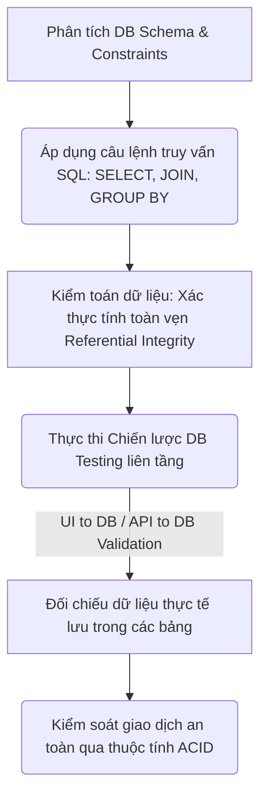
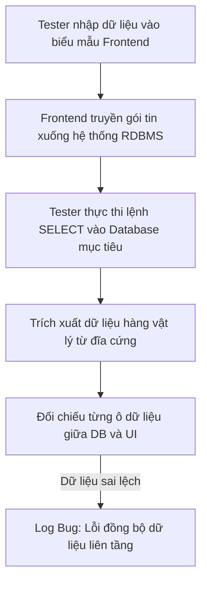
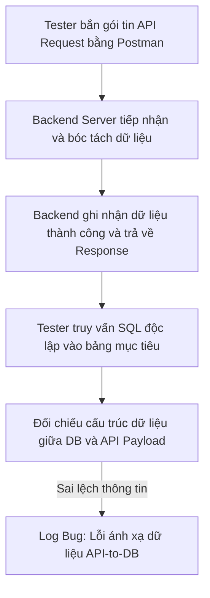
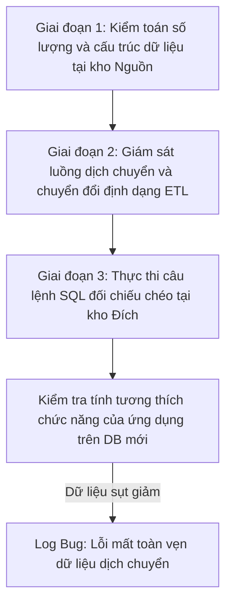

# 📁 06. Database & SQL Testing

*Mục tiêu: Thẩm định và kiểm toán dữ liệu nằm ẩn dưới hệ thống thông qua việc làm chủ các khái niệm cơ sở dữ liệu cốt lõi, vận hành thành thạo các câu lệnh truy vấn SQL từ cơ bản đến nâng cao và thực thi chiến lược kiểm thử toàn vẹn dữ liệu.*

# **6.4. Database Testing Strategies**

## 📌 Mục lục nội bộ (Chặng 06)

- [ ] [**6.1. Database Fundamentals**](./1_DBFundamentals.md)
- [ ] [**6.2. SQL Fundamentals for Testers**](./2_SQLFundamentals.md)
- [ ] [**6.3. Advanced Database Concepts**](./3_DBConcepts.md)
- [ ] [**6.4. Database Testing Strategies**](./4_DBTesting.md)
  - [ ] [6.4.1. UI to Database Validation](#641-ui-to-database-validation)
  - [ ] [6.4.2. API to Database Validation](#642-api-to-database-validation)
  - [ ] [6.4.3. Data Integrity & Data Migration Testing](#643-data-integrity--data-migration-testing)
- [ ] [**6.5. NoSQL Overview**](./5_NoSQLOverview.md)

---

## 🗺️ Bản đồ Tiến trình Từ Nền tảng Dữ liệu đến Chiến lược Kiểm thử Kho lưu trữ

Sơ đồ dưới đây mô tả cách Tester dịch chuyển từ tư duy phân tích cấu trúc sang việc áp dụng các câu lệnh truy vấn nhằm kiểm toán tính toàn vẹn và an toàn của dữ liệu ngầm:



---

# 6.4.1. UI to Database Validation

Kiểm thử đối chiếu từ giao diện xuống cơ sở dữ liệu (**UI to Database Validation**) là chiến lược kiểm thử hộp xám (Gray-box Testing) kinh điển nhằm bẻ gãy mọi sự "lừa dối" của tầng hiển thị. Phương pháp này ép buộc Tester phải theo dõi hành vi nhập liệu của người dùng cuối trên màn hình (Frontend UI), đi xuyên qua lớp xử lý của máy chủ (Backend Server) và dùng câu lệnh SQL truy vấn trực tiếp vào lõi cứng DB để thẩm định tính toàn vẹn của dữ liệu tại điểm lưu trữ cuối cùng.

> ⚠️ **Nguyên lý mặt hồ dữ liệu (Data Reflection Principle):** Giao diện UI chỉ là tấm gương phản chiếu dữ liệu. Hiện tượng UI báo "Đăng ký thành công" hoặc "Cập nhật hoàn tất" nhưng Database thực tế bị lưu thiếu trường, sai định dạng, hoặc hoàn toàn trống rỗng là những khiếm khuyết logic cực kỳ phổ biến và nguy hiểm.

---

## 🛠️ Chu trình Thực chiến Kiểm toán Dữ liệu Liên tầng (Quy trình Đối chiếu UI-to-DB)

Sơ đồ đơn sắc dưới đây đã được đồng bộ Tiếng Việt hoàn toàn, mô tả chính xác 5 bước hành động để một QA thực hiện ca test đối chiếu dữ liệu từ màn hình biểu mẫu xuống kho lưu trữ:



---

## 📊 Ma trận Quy trình và Điểm bẻ gãy Logic khi Test UI-to-DB (QA Mindset)

Dưới đây là ma trận phân rã chi tiết 3 kịch bản thực chiến khi thực hiện đối chiếu dữ liệu liên tầng, bóc tách theo quy chuẩn vi mô để phục vụ việc săn lùng Defect ngầm:

| Giai đoạn đối chiếu | Hành vi thao tác / Ca kiểm thử | Trọng tâm kiểm thử (QA Focus) | Kịch bản lỗi điển hình thực chiến (Defect) |
| :--- | :--- | :--- | :--- |
| **1. Luồng Ghi dữ liệu<br>(Data Insertion Check)** | Điền thông tin vào Form Đăng ký tài khoản trên Web $\rightarrow$ Bấm gửi $\rightarrow$ Chui vào DB viết lệnh `SELECT` kiểm tra hàng dữ liệu mới sinh. | **Đối chiếu ô-với-ô (Cell-by-cell comparison).** Xác thực toàn bộ các trường thông tin nhạy cảm (Họ tên, Ngày sinh, Giới tính) được lưu chính xác, không bị cắt cụt hay mã hóa sai font. | UI thông báo "Đăng ký thành công", nhưng trong bảng `users` cột ngày sinh `dob` bị lưu thành `NULL` hoặc cột họ tên bị lỗi font hiển thị thành các ký tự rác `???`. |
| **2. Luồng Sửa dữ liệu<br>(Data Mutation Check)** | Vào màn hình "Cập nhật hồ sơ" $\rightarrow$ Thay đổi số điện thoại $\rightarrow$ Bấm lưu $\rightarrow$ Vào DB kiểm tra câu lệnh `UPDATE` ngầm. | **Kiểm tra tính đè dữ liệu và giữ nguyên vết.** Xác thực cột dữ liệu cũ bị thay thế chính xác bằng giá trị mới, và các cột không sửa (Ví dụ: Ngày tạo `created_at`) phải được giữ nguyên. | Hệ thống cập nhật số điện thoại mới thành công nhưng vô tình làm reset trường ngày tạo tài khoản của khách hàng về mốc thời gian hiện tại do lập trình viên viết sai câu lệnh ghi đè. |
| **3. Luồng Xóa dữ liệu<br>(Data Deletion Check)** | Bấm nút "Xóa bài viết" trên màn hình Admin $\rightarrow$ Vào DB dùng câu lệnh truy vấn kiểm tra trạng thái dòng dữ liệu. | **Phân biệt Xóa cứng (Hard Delete) và Xóa mềm (Soft Delete).** Nếu tài liệu quy chuẩn yêu cầu Xóa mềm, QA phải xác thực dòng đó vẫn tồn tại trong DB nhưng trường `is_deleted` chuyển từ `0` sang `1`. | Admin bấm xóa bài viết khỏi giao diện, bài viết biến mất trên UI nhưng trong DB dòng đó bị xóa sạch hoàn toàn (Vi phạm quy chuẩn Hard Delete làm mất dữ liệu lịch sử để kiểm toán). |

---

## 🧠 Chiến lược Thực chiến QA: Kiểm toán Luồng Đăng ký Biểu mẫu

Hãy tưởng tượng bạn đang kiểm thử form "Đăng ký thông tin doanh nghiệp" trên ứng dụng Web với 3 trường thông tin: *Tên doanh nghiệp, Mã số thuế, và Doanh thu dự kiến*. 

Sau khi điền dữ liệu: `('QA Global', '0102030405', 15000000)` và bấm nút gửi thành công, tư duy phản biện của một Tester sắc bén để bóc tách Expected Result và bắt lỗi ngầm bao gồm:

1.  **Viết câu lệnh SQL đối chứng:**
    ```sql
    SELECT company_name, tax_code, COALESCE(estimated_revenue, 0) AS revenue 
    FROM enterprises 
    WHERE tax_code = '0102030405';
    ```
2.  **Săn lỗi lệch pha kiểu dữ liệu (Data Discrepancy Bug):** Kiểm tra xem mã số thuế trong DB có bị rớt mất số `0` ở đầu (Biến thành `'102030405'`) do lập trình viên cấu hình nhầm kiểu dữ liệu cột là kiểu số `INT` thay vì chuỗi `VARCHAR` hay không. Đồng thời đối chiếu trường doanh thu xem số tiền lưu có bị làm tròn sai lệch cấu trúc hay không.

---

## 📚 References
* [ISTQB® Certified Tester Foundation Level (CTFL) Syllabus v4.0](https://istqb.org) - Section 4.2.3: Specification-Based and Structural Testing of Data Repositories (Data Integrity Validation).
* [ISO/IEC/IEEE 29119-4:2021 Standard](https://iso.org) - Software Testing: Test Techniques for Multi-Tier UI to Database Synchronization and Functional Data Verification.


# 6.4.2. API to Database Validation

Kiểm thử đối chiếu từ tầng tích hợp xuống cơ sở dữ liệu (**API to Database Validation**) là chiến lược kiểm thử hộp xám (Gray-box Testing) tối thượng để kiểm toán tính toàn vẹn của dữ liệu không qua giao diện. Phương pháp này yêu cầu Tester sử dụng các công cụ như Postman hoặc cURL để bắn các gói tin HTTP Request trực tiếp vào các Endpoint của Backend Server, sau đó dùng câu lệnh SQL truy vấn vào RDBMS để đối chiếu chéo cấu trúc dữ liệu truyền tải với dữ liệu lưu trữ vật lý.

> ⚠️ **Nguyên lý bất đối xứng gói tin (Payload-to-Storage Asymmetry Principle):** Cấu trúc dữ liệu trong gói tin API JSON/XML và cấu trúc bảng trong Database hầu như không bao giờ giống nhau. Việc Backend map sai trường thông tin, làm rơi rụng các cặp Key-Value hoặc không đồng bộ cờ trạng thái khi API báo `200 OK` là những kịch bản lỗi ngầm vô cùng phổ biến.

---

## 🛠️ Chu trình Thực chiến Kiểm toán Giao tiếp API và Kho lưu trữ (API-to-DB Verification Flow)

Sơ đồ đơn sắc dưới đây mô tả chính xác luồng hành động của một QA khi thực hiện bắn API nghiệp vụ và chui vào DB dùng câu lệnh truy vấn để hậu kiểm:



---

## 📊 Ma trận Kịch bản Thực chiến và Điểm bẻ gãy Khi Test API-to-DB (QA Mindset)

Dưới đây là ma trận phân rã chi tiết 3 kịch bản thực chiến khi thực hiện đối chiếu dữ liệu giữa tầng API và Database để phục vụ việc săn lùng Defect nghiệp vụ:

| Kịch bản kiểm toán | Hành vi thao tác / Ca kiểm thử | Trọng tâm kiểm thử (QA Focus) | Kịch bản lỗi điển hình thực chiến (Defect) |
| :--- | :--- | :--- | :--- |
| **1. API Ghi dữ liệu<br>(POST Request)** | Gọi API `POST /api/v1/tickets` tạo vé hỗ trợ với payload JSON $\rightarrow$ Chui vào DB dùng `SELECT` kiểm tra dòng mới. | **Kiểm tra tính ánh xạ trường (Field Mapping).** Xác thực toàn bộ các cặp Key-Value trong JSON được map đúng vào các cột tương ứng trong DB. | API Response trả về mã `201 Created` thành công, nhưng trong DB trường `description` bị trống do Backend map sai tên biến môi trường. |
| **2. API Sửa dữ liệu<br>(PUT / PATCH)** | Gọi API `PATCH /api/v1/items/10` để cập nhật một vài trường thông tin $\rightarrow$ Vào DB viết lệnh kiểm tra hàng dữ liệu. | **Phân biệt ghi đè toàn bộ (PUT) và ghi đè một phần (PATCH).** Kiểm tra xem các trường không truyền trong PATCH có bị biến thành `NULL` không. | Gọi API PATCH để sửa giá sản phẩm, giá cập nhật đúng nhưng trường tên sản phẩm bất ngờ bị Backend xóa sạch về `NULL` do viết sai hàm logic. |
| **3. API Xóa dữ liệu<br>(DELETE Request)** | Gọi API `DELETE /api/v1/users/5` $\rightarrow$ Vào DB dùng câu lệnh truy vấn kiểm tra trạng thái dòng dữ liệu vật lý. | **Xác thực mã phản hồi và trạng thái cứng/mềm.** Nếu API trả về `204 No Content` hoặc `200 OK`, phải check DB xem dòng đó đã thay đổi đúng trạng thái chưa. | API thông báo đã xóa người dùng thành công, nhưng chui vào DB dòng dữ liệu vẫn nguyên vẹn và trường `is_deleted` vẫn bằng `0` (Lỗi mất kết nối DB). |

---

## 🧠 Chiến lược Thực chiến QA: Kiểm toán Gói tin API Tạo Đơn hàng

Hãy tưởng tượng bạn đang kiểm thử API tạo đơn hàng `POST /api/v1/orders`. Bạn bắn một gói tin JSON Payload có cấu trúc phức tạp chứa mảng sản phẩm lồng nhau (Nested Array) như sau:
```json
{
  "customer_id": 456,
  "items": [
    {"product_id": 101, "quantity": 2},
    {"product_id": 102, "quantity": 1}
  ]
}
```
Sau khi nhận được API Response báo thành công `200 OK`, tư duy phản biện của một Tester sắc bén để bóc tách và kiểm toán kho dữ liệu bao gồm:

1.  **Kiểm tra tính phân rã bảng (Data Normalization Test):** Luồng API này bắt buộc phải ghi dữ liệu vào 2 bảng khác nhau theo mối quan hệ cha-con. Bạn phải viết câu lệnh `INNER JOIN` để truy vết:
    ```sql
    SELECT o.id AS order_id, d.product_id, d.quantity 
    FROM orders o 
    INNER JOIN order_details d ON o.id = d.order_id 
    WHERE o.customer_id = 456;
    ```
2.  **Săn lỗi sụt giảm tồn kho (Inventory Leakage Bug):** Lấy kết quả `product_id` và `quantity` vừa trích xuất được, chui tiếp sang bảng `products` để kiểm tra xem số lượng tồn kho (`stock_quantity`) của sản phẩm 101 có bị trừ đi đúng 2 đơn vị, và sản phẩm 102 bị trừ đi đúng 1 đơn vị hay không. Nếu API báo thành công mà tồn kho giữ nguyên, hệ thống dính lỗi logic vận hành nghiêm trọng.

---

## 📚 References
* [ISTQB® Certified Tester Foundation Level (CTFL) Syllabus v4.0](https://istqb.org) - Section 2.2.1: Component Integration Testing (API and Backend Database Integration).
* [ISO/IEC/IEEE 29119-4:2021 Standard](https://iso.org) - Software Testing: Test Techniques for API Payload Schema Validation and Database Relational Integrity.

# 6.4.3. Data Integrity & Data Migration Testing

Trong vòng đời của một hệ thống phần mềm, việc thay đổi cấu trúc cơ sở dữ liệu (Database Refactoring) hoặc dịch chuyển toàn bộ kho dữ liệu sang một nền tảng máy chủ mới (**Data Migration**) là một chiến dịch kỹ thuật vô cùng rủi ro. Thành thạo chiến lược kiểm thử dịch chuyển dữ liệu giúp Tester đảm bảo **Tính toàn vẹn dữ liệu (Data Integrity)** được bảo toàn tuyệt đối, chặn đứng nguy cơ mất mát, sai lệch hoặc biến đổi cấu trúc dữ liệu của doanh nghiệp sau khi nâng cấp hệ thống.

> ⚠️ **Nguyên lý bảo toàn năng lượng dữ liệu (Data Conservation Principle):** Quá trình dịch chuyển dữ liệu từ hệ thống cũ (Source) sang hệ thống mới (Target) có thể làm biến đổi định dạng tệp tin nhưng tuyệt đối không được làm thay đổi bản chất ý nghĩa nghiệp vụ của dữ liệu. Một lỗi cấu hình sai quy tắc chuyển đổi (Mapping Rules) sẽ trực tiếp tàn phá kho dữ liệu lịch sử, gây ra các lỗi nghiêm trọng cho luồng vận hành hiện tại.

---

## 🛠️ Chu trình Thực chiến Kiểm toán Dịch chuyển Dữ liệu Diện rộng (Migration Testing Lifecycle)

Sơ đồ đơn sắc dưới đây mô tả chính xác 3 giai đoạn hành động (Trước - Trong - Sau) để một QA thực hiện chiến dịch kiểm toán toàn vẹn dữ liệu khi di cư kho lưu trữ:



---

## 📊 Ma trận Chiến lược Kiểm thử Dịch chuyển và Toàn vẹn Dữ liệu (QA Mindset)

Dưới đây là ma trận phân rã chi tiết 3 mũi nhọn chiến lược khi thực hiện kiểm toán dịch chuyển dữ liệu diện rộng, bóc tách theo đúng cấu trúc vi mô thực chiến:

| Chiến lược kiểm toán | Hành vi thao tác / Kỹ thuật áp dụng | Trọng tâm kiểm thử (QA Focus) | Kịch bản lỗi điển hình thực chiến (Defect) |
| :--- | :--- | :--- | :--- |
| **1. Kiểm toán Số lượng<br>(Volume Verification)** | Thực thi các câu lệnh đếm tổng số dòng (`COUNT`) trên tất cả các bảng ở cả 2 đầu hệ thống Nguồn (Source) và Đích (Target). | **Xác thực số lượng tuyệt đối.** Đảm bảo không có bất kỳ hàng dữ liệu nào bị rơi rụng hoặc bị nhân đôi trong quá trình quét và dịch chuyển. | Hệ thống cũ có 1,000,000 khách hàng nhưng sau khi dịch chuyển sang DB mới chỉ còn 999,950 dòng do công cụ sao chép bị nghẽn (Mất 50 khách hàng). |
| **2. Kiểm toán Chất lượng<br>(Data Quality Sanity)** | Viết các câu lệnh `SELECT` kiểm tra các giá trị biên, kiểm tra trường `NULL` và định dạng chuỗi sau khi nạp vào DB mới. | **Đối chiếu giá trị biên và kiểu dữ liệu.** Xác thực các trường đặc thù (Ngày tháng, Số thập phân, Ký tự có dấu) không bị biến đổi định dạng. | Toàn bộ các ký tự Tiếng Việt có dấu của khách hàng bị biến thành chuỗi rác `nà mù hình` sau khi di cư do DB mới thiết lập sai bảng mã `UTF-8`. |
| **3. Kiểm thử Tương thích<br>(Schema Drift Testing)** | Chạy thử toàn bộ các tính năng cốt lõi của ứng dụng (Đăng nhập, Đặt hàng) dựa trên nền tảng Database mới vừa được đồng bộ. | **Kiểm thử chức năng hộp xám.** Đảm bảo mã nguồn Backend tương thích hoàn hảo với cấu trúc Schema mới, không bị lỗi truy vấn. | Ứng dụng bị sập hàng loạt tính năng (Lỗi `500 Internal Error`) do cấu trúc bảng mới đã thay đổi tên trường nhưng mã nguồn Backend chưa cập nhật theo. |

---

## 🧠 Chiến lược Thực chiến QA: Kiểm toán Đối soát Dữ liệu Tài chính sau Di cư

Hãy tưởng tượng doanh nghiệp của bạn vừa chuyển đổi hệ thống lưu trữ từ MySQL sang PostgreSQL. Bạn được giao nhiệm vụ kiểm toán tính toàn vẹn của bảng dữ liệu tài chính `wallet_balances`.

Tư duy phản biện của một Tester sắc bén để thiết kế kịch bản đối soát dữ liệu diện rộng (Data Reconciliation) không tì vết:
1.  **Thiết kế câu lệnh đối soát tổng (Checksum):** Bạn thực thi đồng thời câu lệnh tính tổng doanh số ở cả 2 cơ sở dữ liệu cũ và mới để đối chiếu chéo chỉ số:
    ```sql
    SELECT COUNT(id) AS total_users, SUM(balance) AS total_system_money FROM wallet_balances;
    ```
2.  **Săn lỗi lệch pha dòng tiền (Financial Discrepancy Bug):** Nếu chỉ số `total_system_money` ở DB mới bị lệch dù chỉ 1 đồng so với DB cũ, lập tức phong toàn luồng deploy. Tiến hành viết câu lệnh `MINUS` hoặc `EXCEPT` giữa 2 kho dữ liệu để tìm ra chính xác ID của khách hàng bị sai lệch số dư, ép đội ngũ kỹ sư hạ tầng phải rà soát lại script chuyển đổi dữ liệu (ETL Script).

---

## 📚 References
* [ISTQB® Certified Tester Foundation Level (CTFL) Syllabus v4.0](https://istqb.org) - Section 4.2.3: Structural Testing and Data Integrity Verification during System Migration.
* [ISO/IEC/IEEE 29119-4:2021 Standard](https://iso.org) - Software Testing: Test Techniques for Data Conversion, Data Migration and Relational Integrity Audit.
