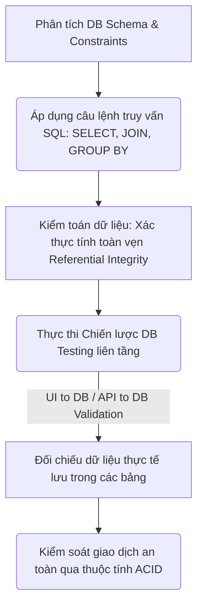
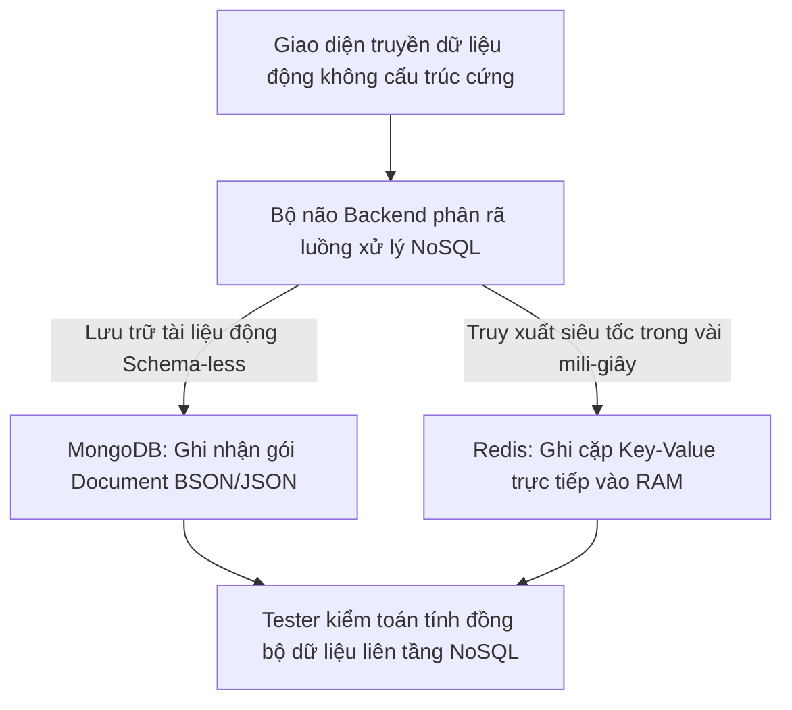

# 📁 06. Database & SQL Testing

*Mục tiêu: Thẩm định và kiểm toán dữ liệu nằm ẩn dưới hệ thống thông qua việc làm chủ các khái niệm cơ sở dữ liệu cốt lõi, vận hành thành thạo các câu lệnh truy vấn SQL từ cơ bản đến nâng cao và thực thi chiến lược kiểm thử toàn vẹn dữ liệu.*

# **6.5. NoSQL Overview**

## 📌 Mục lục nội bộ (Chặng 06)

- [ ] [**6.1. Database Fundamentals**](./1_DBFundamentals.md)
- [ ] [**6.2. SQL Fundamentals for Testers**](./2_SQLFundamentals.md)
- [ ] [**6.3. Advanced Database Concepts**](./3_DBConcepts.md)
- [ ] [**6.4. Database Testing Strategies**](./4_DBTesting.md)
- [ ] [**6.5. NoSQL Overview**](./5_NoSQLOverview.md)
  - [ ] [6.5.1. NoSQL Concepts: Document (MongoDB) vs Key-Value (Redis)](#651-nosql-concepts-document-mongodb-vs-key-value-redis)

---

## 🗺️ Bản đồ Tiến trình Từ Nền tảng Dữ liệu đến Chiến lược Kiểm thử Kho lưu trữ

Sơ đồ dưới đây mô tả cách Tester dịch chuyển từ tư duy phân tích cấu trúc sang việc áp dụng các câu lệnh truy vấn nhằm kiểm toán tính toàn vẹn và an toàn của dữ liệu ngầm:

---

# 6.5.1. NoSQL Concepts: Document (MongoDB) vs Key-Value (Redis)

Để hoàn thiện tư duy của một chuyên gia kiểm thử tầng dữ liệu, bạn không thể chỉ giới hạn tầm nhìn ở các bảng quan hệ thô cứng. Sự bùng nổ của các hệ thống dữ liệu lớn (Big Data) đòi hỏi Tester phải làm chủ khái niệm **NoSQL (Not Only SQL)**. Việc bóc tách bản chất kỹ thuật của hai mô hình NoSQL phổ biến nhất là **Document (MongoDB)** và **Key-Value (Redis)** giúp QA định hình chiến lược kiểm thử cấu trúc dữ liệu linh hoạt (Schema-less) và thẩm định hiệu năng hệ thống bộ nhớ đệm (Caching).

> ⚠️ **Nguyên lý phi quan hệ linh hoạt (Schema-less Flexibility Principle):** Hệ thống NoSQL cho phép lưu trữ dữ liệu không cần tuân theo cấu trúc bảng nghiêm ngặt, nhưng điều này tạo ra rủi ro cực lớn về tính đồng nhất dữ liệu. Việc thiếu chốt chặn ràng buộc cứng tại tầng NoSQL DB buộc Backend phải tự xử lý logic kiểm tra, và đó là nơi QA phải tập trung bẻ gãy hệ thống.

---

## 🛠️ Luồng Xử lý Kiểm toán và Phân phối Dữ liệu Không cấu trúc (NoSQL Lifecycle)

Sơ đồ đơn sắc dưới đây mô tả cách thức ứng dụng phân tách luồng dữ liệu nghiệp vụ: Đọc/Ghi tài liệu động dạng JSON vào MongoDB và lưu trữ tạm thời các phiên làm việc tốc độ cao vào bộ nhớ đệm Redis:

---

## 📊 Ma trận Phân rã Hệ thống Cơ sở dữ liệu NoSQL (QA Mindset)

Dưới đây là ma trận bóc tách chi tiết 2 trường phái NoSQL điển hình, được phân rã theo quy chuẩn vi mô phục vụ việc thiết kế kịch bản test Gray-box tầng sâu:

| Kiến trúc NoSQL | Bản chất vận hành ngầm | Trọng tâm kiểm thử (QA Focus) | Kịch bản lỗi điển hình thực chiến (Defect) |
| :--- | :--- | :--- | :--- |
| **1. Document (Mô hình MongoDB)** | Lưu trữ dữ liệu dưới dạng các cặp tài liệu tự do (*Document*) lồng nhau, đóng gói theo định dạng giống JSON (BSON), nằm trong các nhóm tập hợp (*Collection*). | **Kiểm thử bất đối xứng cấu trúc.** Thử nghiệm nạp các Document có số lượng trường thông tin lệch nhau hoặc sai kiểu dữ liệu (Data Type) để xem Backend xử lý thế nào. | **Lỗi rách cấu trúc:** Khách hàng A có trường `phone`, khách hàng B bị Backend map nhầm thành `telephone`. Khi UI gọi hàm render danh sách, ứng dụng bị sập lập tức do lỗi trống dữ liệu. |
| **2. Key-Value (Mô hình Redis)** | Lưu trữ dữ liệu tối giản dạng cặp Khóa - Giá trị (`Key-Value`) trực tiếp trên bộ nhớ đệm RAM, hỗ trợ thiết lập thời gian tự động xóa hủy dữ liệu (*TTL - Time To Live*). | **Kiểm thử vòng đời bộ nhớ đệm (Cache Lifecycle).** Xác thực tính đúng đắn của thời gian hết hạn TTL (Ví dụ: Mã OTP phải tự hủy sau 3 phút). | **Lỗi rò rỉ mã bảo mật:** Mã OTP hoặc Token đăng nhập nhạy cảm của khách hàng tồn tại vĩnh viễn trong Redis do lập trình viên cấu hình sai cờ TTL thành vô hạn, tạo lỗ hổng bảo mật. |

---

## 🧠 Chiến lược Thực chiến QA: Kiểm toán Luồng Cache và Đồng bộ Dữ liệu

Lỗi nguy hiểm nhất khi ứng dụng sử dụng kiến trúc NoSQL (đặc biệt là Redis làm Cache đứng trước RDBMS) là lỗi **Lệch pha bộ nhớ đệm (Cache Invalidation Bug)** – dữ liệu trong Cache đã bị cũ nhưng không được cập nhật khi dữ liệu gốc trong DB thay đổi.

Tư duy phản biện của một Tester sắc bén để thiết kế ca kiểm thử hộp xám săn lùng lỗi lệch pha Cache:
1.  **Hành động QA:** Vào màn hình Web cập nhật giá sản phẩm từ `100k` thành `150k` $\rightarrow$ UI báo thành công $\rightarrow$ Kiểm tra DB gốc thấy giá đã đổi đúng `150k`.
2.  **Truy vết kho NoSQL Cache:** Mở công cụ kết nối Redis, truy vấn trực tiếp Key của sản phẩm đó. Nếu giá trong Redis vẫn lưu `100k`, điều đó khẳng định hệ thống đang dính lỗi Cache Invalidation nghiêm trọng. Người dùng tiếp theo vào mua hàng sẽ vẫn nhìn thấy giá cũ `100k` do Backend ưu tiên đọc từ Cache trước, gây tổn thất tài chính cho doanh nghiệp.

---

## 📚 References
* [ISTQB® Certified Tester Foundation Level (CTFL) Syllabus v4.0](https://istqb.org) - Section 4.2.3: Specification-Based and Structural Testing of Non-Relational Data Repositories (NoSQL Integrity).
* [ISO/IEC/IEEE 29119-4:2021 Standard](https://iso.org) - Software Testing: Test Techniques for Schema-less Datasets, Document Stores and Cache Lifecycle Verification.
