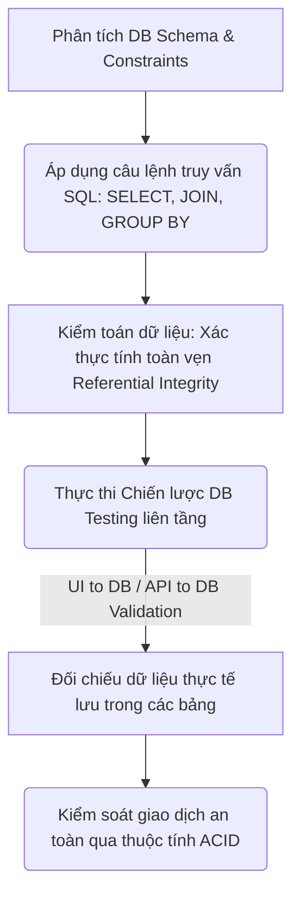

# 📁 06. Database & SQL Testing

*Mục tiêu: Thẩm định và kiểm toán dữ liệu nằm ẩn dưới hệ thống thông qua việc làm chủ các khái niệm cơ sở dữ liệu cốt lõi, vận hành thành thạo các câu lệnh truy vấn SQL từ cơ bản đến nâng cao và thực thi chiến lược kiểm thử toàn vẹn dữ liệu.*

## 📌 Mục lục nội bộ (Chặng 06)

- [ ] [**6.1. Database Fundamentals**](./1_DBFundamentals.md)
  - [ ] [6.1.1. Relational Database (RDBMS) Concepts](./1_DBFundamentals.md#611-relational-database-rdbms-concepts)
  - [ ] [6.1.2. Table, Row, Column, Keys (Primary, Foreign, Unique)](./1_DBFundamentals.md#612-table-row-column-keys-primary-foreign-unique)
  - [ ] [6.1.3. Database Constraints & Indexes](./1_DBFundamentals.md#613-database-constraints--indexes)
- [ ] [**6.2. SQL Fundamentals for Testers**](./2_SQLFundamentals.md)
  - [ ] [6.2.1. Data Query: SELECT, WHERE, ORDER BY, DISTINCT](./2_SQLFundamentals.md#621-data-query-select-where-order-by-distinct)
  - [ ] [6.2.2. Data Aggregation: GROUP BY, HAVING, Aggregate Functions](./2_SQLFundamentals.md#622-data-aggregation-group-by-having-aggregate-functions)
  - [ ] [6.2.3. Table Joins: INNER, LEFT, RIGHT, FULL JOIN](./2_SQLFundamentals.md#623-table-joins-inner-left-right-full-join)
  - [ ] [6.2.4. Handling NULL Values & Limits](./2_SQLFundamentals.md#624-handling-null-values--limits)
- [ ] [**6.3. Advanced Database Concepts**](./3_DBConcepts.md)
  - [ ] [6.3.1. ACID Properties & Transactions](./3_DBConcepts.md#631-acid-properties--transactions)
  - [ ] [6.3.2. Transaction Control: COMMIT & ROLLBACK](./3_DBConcepts.md#632-transaction-control-commit--rollback)
  - [ ] [6.3.3. Referential Integrity](./3_DBConcepts.md#633-referential-integrity)
- [ ] [**6.4. Database Testing Strategies**](./4_DBTesting.md)
  - [ ] [6.4.1. UI to Database Validation](./4_DBTesting.md#641-ui-to-database-validation)
  - [ ] [6.4.2. API to Database Validation](./4_DBTesting.md#642-api-to-database-validation)
  - [ ] [6.4.3. Data Integrity & Data Migration Testing](./4_DBTesting.md#643-data-integrity--data-migration-testing)
- [ ] [**6.5. NoSQL Overview**](./5_NoSQLOverview.md)
  - [ ] [6.5.1. NoSQL Concepts: Document (MongoDB) vs Key-Value (Redis)](./5_NoSQLOverview.md#651-nosql-concepts-document-mongodb-vs-key-value-redis)

---

## 🗺️ Bản đồ Tiến trình Từ Nền tảng Dữ liệu đến Chiến lược Kiểm thử Kho lưu trữ

Sơ đồ dưới đây mô tả cách Tester dịch chuyển từ tư duy phân tích cấu trúc sang việc áp dụng các câu lệnh truy vấn nhằm kiểm toán tính toàn vẹn và an toàn của dữ liệu ngầm:

---

## 📚 References
* [ISTQB® Certified Tester Foundation Level (CTFL) Syllabus v4.0](https://istqb.org) - Section 4.2.3: Structural Verification and Dataset Constraint Testing.
* [ISO/IEC/IEEE 29119-4:2021 Standard](https://iso.org) - Part 4: Data Integrity and Multi-Tier Database State Specifications.
