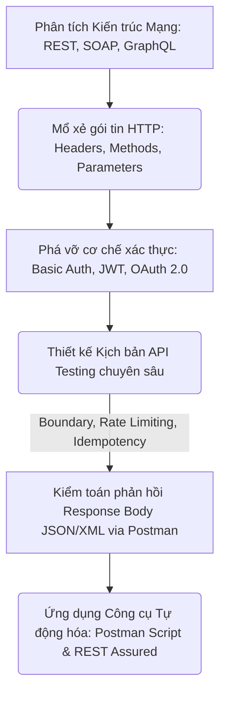
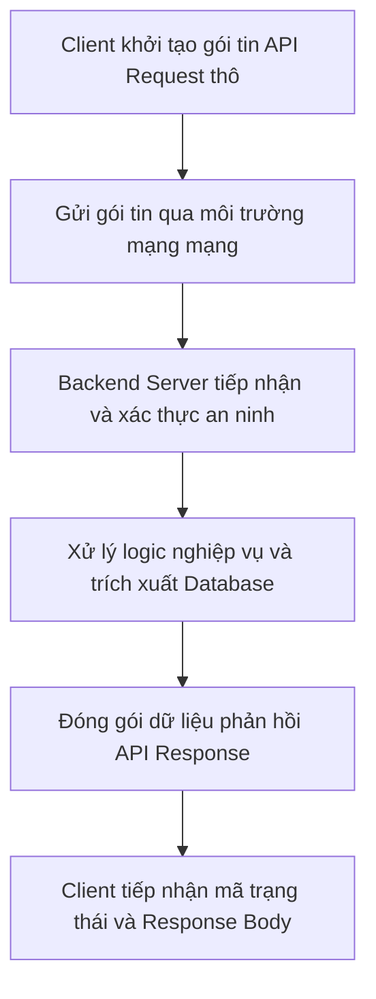
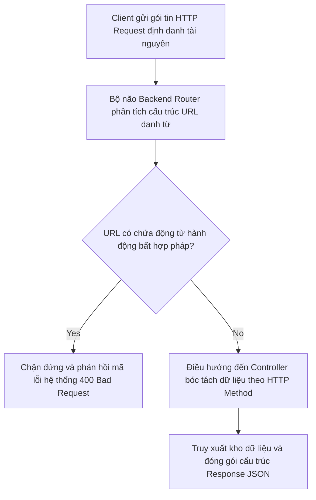

# 📁 07. API Testing

*Mục tiêu: Làm chủ quy trình kiểm thử tầng tích hợp hệ thống, xử lý thuần thục các giao thức truyền thông HTTP, giải mã cấu trúc Request/Response, bẻ gãy các cơ chế xác thực bảo mật và thiết kế kịch bản kiểm toán API chuyên sâu.*

# **7.1. API Fundamentals**

## 📌 Mục lục nội bộ (Chặng 07)

- [ ] [**7.1. API Fundamentals**](./1_APIFundamentals.md)
  - [ ] [7.1.1. What is an API? Architectural Styles: REST, SOAP, GraphQL](./1_APIFundamentals.md#711-what-is-an-api-architectural-styles-rest-soap-graphql)
  - [ ] [7.1.2. RESTful Architecture Principles, Endpoints & Resources](./1_APIFundamentals.md#712-restful-architecture-principles-endpoints--resources)
- [ ] [**7.2. HTTP Protocol in API**](./2_HTTPProtocol.md)
- [ ] [**7.3. Request & Response Anatomy**](./3_RequestResponse.md)
- [ ] [**7.4. API Authentication Mechanisms**](./4_Authentication.md)
- [ ] [**7.5. API Test Scenarios Designing**](./5_APITestingStrategy.md)
- [ ] [**7.6. API Testing Tooling**](./6_Tools.md)

---

## 🗺️ Bản đồ Tiến trình Từ Nền tảng Giao tiếp đến Kiểm toán Tích hợp API

Sơ đồ đơn sắc dưới đây mô tả cách thức Tester bóc tách các trường phái kiến trúc mạng, mổ xẻ cấu trúc gói tin HTTP và áp dụng các kịch bản kiểm thử biên để bẻ gãy lớp bảo mật/logic của tầng trung gian:

---

# 7.1.1. What is an API? Architectural Styles: REST, SOAP, GraphQL

Bước sang Chặng 7, vị thế của Tester dịch chuyển hoàn toàn từ việc kiểm thử bề mặt (Black-box UI) sang việc làm chủ hệ thống giao tiếp ngầm của phần mềm. **API (Application Programming Interface - Giao diện lập trình ứng dụng)** là một tập hợp các quy tắc, giao thức và định nghĩa kỹ thuật đóng vai trò làm cầu nối, cho phép các phần mềm hoặc các thành phần kiến trúc độc lập có thể trực tiếp giao tiếp, trao đổi dữ liệu với nhau. Kiểm thử API giúp QA bẻ gãy và phát hiện lỗi logic nghiệp vụ sớm hơn gấp nhiều lần so với kiểm thử giao diện thông thường.

> ⚠️ **Nguyên lý kiểm thử dịch dịch chuyển về bên trái (Shift-Left Testing Principle):** Giao diện người dùng có thể chưa được thiết kế xong, nhưng hệ thống API ngầm bắt buộc phải được hoàn thiện trước. Kiểm thử API cho phép QA can thiệp và bắt lỗi logic hệ thống ngay từ giai đoạn tích hợp thành phần, giúp doanh nghiệp tiết kiệm tối đa chi phí khắc phục khiếm khuyết phần mềm.

---

## 🛠️ Luồng Khởi tạo và Phân phối Gói tin liên tầng API (API Request-Response Lifecycle)

Sơ đồ đơn sắc dưới đây mô tả chính xác con đường luân chuyển của một gói tin API thô từ khi Client kích hoạt cho đến khi Backend Server bóc tách và phản hồi dữ liệu:

---

## 📊 Ma trận Phân rã Kỹ thuật 3 Trường phái Kiến trúc API (QA Mindset)

Dưới đây là bảng ma trận hệ thống hóa và so sánh bản chất vận hành của ba trường phái kiến trúc mạng cốt lõi, giúp Tester định hình chiến lược kiểm thử đặc thù cho từng loại:

| Tiêu chí kỹ thuật | REST (Representational State Transfer) | SOAP (Simple Object Access Protocol) | GraphQL (Graph Query Language) |
| :--- | :--- | :--- | :--- |
| **Bản chất vận hành** | Kiến trúc dựa trên tài nguyên (*Resource-based*), sử dụng các phương thức HTTP tiêu chuẩn để thao tác. | Giao thức nghiêm ngặt dựa trên định dạng hàm (*Action-based*), chịu sự chi phối của bộ quy chuẩn WSDL. | Ngôn ngữ truy vấn dữ liệu động, cho phép Client tự định nghĩa cấu trúc dữ liệu muốn lấy qua một Endpoint duy nhất. |
| **Định dạng dữ liệu** | Linh hoạt: Chủ yếu là **JSON**, ngoài ra chấp nhận XML, Plain Text, HTML. | Cực kỳ thô cứng: **Bắt buộc 100% phải là XML** đóng gói trong cấu trúc Envelope. | Chỉ chấp nhận cấu trúc dữ liệu đầu ra định dạng **JSON**. |
| **Băng thông mạng** | Trung bình. Phụ thuộc vào kích thước dữ liệu cứng do Backend Server cấu hình trả về. | Rất nặng do cấu trúc thẻ đóng/mở của XML chiếm dụng nhiều dung lượng đường truyền. | Cực nhẹ. Client lấy gì truyền nấy, loại bỏ hoàn toàn hiện tượng thừa dữ liệu (*Over-fetching*). |
| **Trọng tâm kiểm thử (QA Focus)** | Kiểm tra tính đúng đắn của các Endpoint, HTTP Methods, mã trạng thái và cấu trúc Payload JSON. | Kiểm toán tính hợp lệ của tệp cấu hình WSDL, các thẻ Envelope bảo mật và cấu trúc XML Schema phức tạp. | Thử nghiệm các ca test biên bằng cách thay đổi linh hoạt cấu trúc Query/Mutation gửi lên để bẻ gãy Server. |
| **Kịch bản lỗi điển hình (Defect)** | Backend trả về mã trạng thái sai lệch quy chuẩn (Ví dụ: Lỗi sập hệ thống nhưng trả về `200 OK`). | Gói tin XML Schema bị rách cấu trúc hoặc sai kiểu dữ liệu khiến hệ thống ném lỗi `SOAP Fault` thô cứng. | Lỗi sụt giảm hiệu năng nặng nề ở Backend do Client viết câu lệnh Query lồng nhau quá sâu (Vòng lặp vô hạn). |

---

## 🧠 Chiến lược Thực chiến QA: Nhận diện và Xử lý Lỗi Đặc thù Từng Kiến trúc

Dưới góc nhìn của một chuyên gia kiểm toán chất lượng API, bạn cần linh hoạt thay đổi tư duy bắt lỗi dựa vào bản chất của từng trường phái kiến trúc mạng:

*   **Săn lỗi "Nuốt dữ liệu" trên REST API:** Lập trình viên thiết kế Endpoint lấy thông tin chi tiết khách hàng `GET /api/users/1`. Backend Server luôn trả về nguyên một cục JSON khổng lồ chứa cả mật khẩu băm, mã PIN và lịch sử đăng nhập. Nhiệm vụ của QA là phải log Bug bảo mật (Data Exposure): API đang rò rỉ dữ liệu nhạy cảm ra ngoài môi trường Client.
*   **Săn lỗi "Lệch hợp đồng" trên SOAP API:** Hệ thống SOAP kiểm soát dữ liệu bằng một khế ước phần mềm nghiêm ngặt gọi là file WSDL. Nếu lập trình viên Backend tự ý thay đổi kiểu dữ liệu của một trường từ số `INT` sang chuỗi `STRING` mà không cập nhật lại file WSDL, toàn bộ các hệ thống tài chính tích hợp phía đối tác sẽ bị crash lập tức. QA cần dùng công cụ kiểm tra tính tương thích của Schema trước khi cho phép tích hợp.
*   **Săn lỗi "Bào mòn tài nguyên" trên GraphQL API:** GraphQL cho phép người dùng tự viết câu lệnh lấy dữ liệu. Hãy giả lập một ca test độc hại bằng cách gửi một Query lồng nhau vòng tròn (Ví dụ: Lấy thông tin bài viết $\rightarrow$ lấy thông tin tác giả $\rightarrow$ lấy danh sách bài viết của tác giả $\rightarrow$ lấy lại thông tin tác giả). Nếu Backend Server thiếu cơ chế chốt chặn độ sâu truy vấn (`Query Depth Limiting`), câu lệnh này sẽ cày nát tài nguyên CPU/RAM của máy chủ, gây treo toàn hệ thống (Lỗi DoS hiệu năng).

---

## 📚 References
* [ISTQB® Certified Tester Foundation Level (CTFL) Syllabus v4.0](https://istqb.org) - Section 2.2.1: Component Integration Testing (Integration and API Protocols).
* [ISO/IEC/IEEE 29119-4:2021 Standard](https://iso.org) - Software Testing: Test Techniques for Web Services, Architectural Styles and Interface Communication Verification.

# 7.1.2. RESTful Architecture Principles, Endpoints & Resources

Để kiểm thử một hệ thống API theo chuẩn công nghiệp, Tester không thể chỉ bắn các gói tin một cách ngẫu nhiên. Bạn phải thấu hiểu các nguyên lý thiết kế của kiến trúc **RESTful API**, cách thức định danh hệ thống qua **Endpoints (Điểm cuối)** và cách quản trị **Resources (Tài nguyên)**. Việc nắm vững các quy chuẩn này giúp QA xây dựng tư duy kiểm thử hộp xám sắc bén, dễ dàng phát hiện ra các lỗi sai cấu trúc hệ thống hoặc rò rỉ dữ liệu ngay tại ranh giới thiết kế của Backend Server.

> ⚠️ **Nguyên lý phi trạng thái và định danh tài nguyên (Stateless & Resource Identity Principle):** Hệ thống RESTful bắt buộc phải vận hành theo cơ chế phi trạng thái (Stateless) – mỗi Request gửi lên phải chứa cô lập, đầy đủ thông tin xác thực mà không phụ thuộc vào bộ nhớ tạm của Server. Đồng thời, mọi tài nguyên hệ thống phải được định danh bằng danh từ số nhiều duy nhất, không được lồng ghép động từ hành động vào URL.

---

## 🛠️ Luồng Định tuyến và Xử lý Tài nguyên RESTful (Routing & Resource Lifecycle)

Sơ đồ đơn sắc dưới đây mô tả chính xác chu trình tiếp nhận gói tin, phân tích Endpoint dựa trên danh từ định danh và điều hướng xử lý logic tài nguyên tại lõi Backend Server:

---

## 📊 Ma trận Phân rã Nguyên lý Kiến trúc RESTful (QA Mindset)

Dưới đây là ma trận hệ thống hóa các nguyên lý nền tảng cấu thành nên một hệ thống RESTful chuẩn mực, bóc tách theo góc nhìn phân tích lỗi của một chuyên gia QA:

| Nguyên lý RESTful | Khái niệm kỹ thuật lõi | Trọng tâm kiểm thử (QA Focus) | Kịch bản lỗi điển hình thực chiến (Defect) |
| :--- | :--- | :--- | :--- |
| **1. Stateless (Phi trạng thái)** | Server không lưu trữ bất kỳ ngữ cảnh nào của Client. Mỗi Request là hoàn toàn độc lập và phải tự mang theo Token xác thực. | **Kiểm thử chuỗi Request liên hoàn.** Thực hiện bắn Request số 2 mà cố tình không truyền Token xác thực xem Server có chặn lại an toàn không. | **Lỗi rò rỉ phiên:** Server âm thầm cho phép thực thi Request số 2 mà không cần Token vì trước đó Request 1 đã đăng nhập thành công (Vi phạm nghiêm trọng tính Stateless). |
| **2. Uniform Interface (Giao diện đồng nhất)** | Tài nguyên phải được định danh duy nhất qua URL bằng **Danh từ số nhiều**. Thao tác qua tài nguyên được định nghĩa bằng HTTP Methods (`GET`, `POST`...). | Kiểm toán cấu trúc thiết kế URL hệ thống. Săn tìm các Endpoint thiết kế vô chuẩn, trộn lẫn động từ hành động vào đường dẫn. | **Lỗi sai kiến trúc (Bad Smell):** Lập trình viên thiết kế API xóa người dùng dạng `POST /api/users/deleteUser?id=5` thay vì viết đúng chuẩn `DELETE /api/users/5`. |
| **3. Client-Server Separation** | Frontend (Client) và Backend (Server) hoạt động độc lập tuyệt đối, chỉ giao tiếp với nhau thông qua giao thức API. | Kiểm thử tính cô lập. Đảm bảo khi sập tầng giao diện hoặc thay đổi công nghệ Frontend, hệ thống API Backend vẫn vận hành ổn định. | Logic tính toán số tiền hoặc kiểm tra cờ bảo mật bị đặt nhầm ở Client, dẫn đến việc hacker bypass UI là có thể thay đổi dữ liệu DB. |
| **4. Resource & Id** | Mỗi tài nguyên (Bài viết, Hóa đơn) được đại diện bằng một danh từ, và mỗi bản ghi cụ thể được định danh bằng một khóa ID duy nhất. | **Kiểm thử giá trị biên của thực thể.** Thay đổi mã ID trên URL thành số âm, chuỗi ký tự lạ, hoặc ID không tồn tại để kiểm tra độ bền của API. | Gọi API `GET /api/orders/-99` khiến hệ thống Backend bị sập và ném ra lỗi mã `500 Internal Error` thô mộc thay vì trả về mã `404 Not Found`. |

---

## 🧠 Chiến lược Thực chiến QA: Kiểm toán Hệ thống Endpoint Hệ thống

Hãy tưởng tượng bạn đang kiểm thử một phân hệ quản lý thư viện sách. Tài liệu thiết kế quy định hệ thống Endpoint chuẩn RESTful phải tuân thủ nghiêm ngặt mô hình phân cấp tài nguyên danh từ.

Tư duy phản biện của một Tester thực chiến để vạch lá tìm sâu khi rà soát danh sách API (API Specification Audit):

1.  **Phát hiện lỗi lồng ghép sai cấu trúc (Deep Nesting Defect):** Lập trình viên thiết kế Endpoint lấy danh sách chương của một cuốn sách dạng: `GET /api/libraries/1/rooms/2/books/100/chapters`. Việc lồng ghép quá 3 cấp danh từ là một lỗi thiết kế nghiêm trọng, gây giảm hiệu năng truy vấn của máy chủ Backend. QA cần yêu cầu cô lập tài nguyên và rút gọn Endpoint về dạng tinh gọn: `GET /api/books/100/chapters`.
2.  **Săn lỗi rò rỉ định danh (Insecure Direct Object Reference - IDOR):** Khi gọi API lấy thông tin hóa đơn cá nhân `GET /api/v1/invoices/1005`, bạn nhận được dữ liệu thành công. Thử nghiệm thay đổi ID trên URL thành `1006` (Hóa đơn của một khách hàng khác). Nếu Server vẫn trả về thông tin hóa đơn của người lạ mà không chặn quyền, bạn đã bắt được một lỗi bảo mật IDOR cực kỳ nguy hiểm của kiến trúc RESTful do Backend thiếu logic kiểm tra quyền sở hữu đối tượng tài nguyên.

---

## 📚 References
* [ISTQB® Certified Tester Foundation Level (CTFL) Syllabus v4.0](https://istqb.org) - Section 2.2.1: Component Integration Testing (RESTful Architecture and Specification-Based Integration).
* [ISO/IEC/IEEE 29119-4:2021 Standard](https://iso.org) - Software Testing: Test Techniques for Interface Constraints, Resource Identification and Endpoint Integrity.
