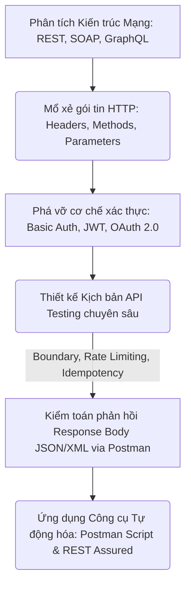
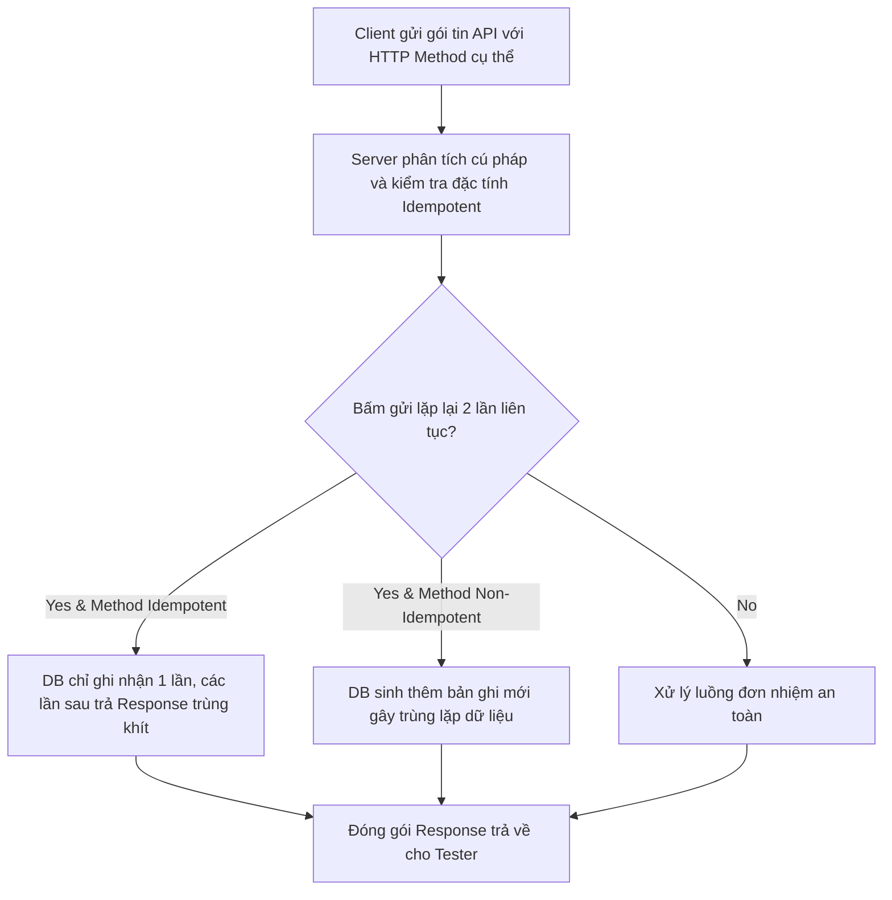
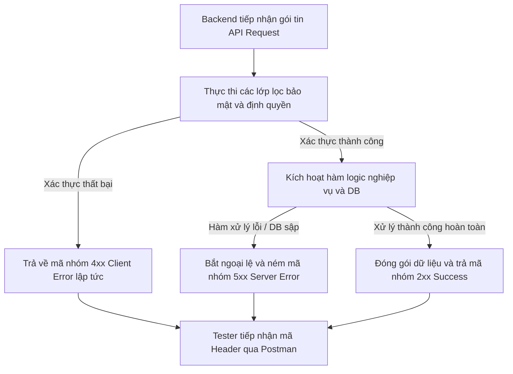

# 📁 07. API Testing

*Mục tiêu: Làm chủ quy trình kiểm thử tầng tích hợp hệ thống, xử lý thuần thục các giao thức truyền thông HTTP, giải mã cấu trúc Request/Response, bẻ gãy các cơ chế xác thực bảo mật và thiết kế kịch bản kiểm toán API chuyên sâu.*

# **7.2. HTTP Protocol in API**

## 📌 Mục lục nội bộ (Chặng 07)

- [ ] [**7.1. API Fundamentals**](./1_APIFundamentals.md)
- [ ] [**7.2. HTTP Protocol in API**](./2_HTTPProtocol.md)
  - [ ] [7.2.1. HTTP Methods: GET, POST, PUT, PATCH, DELETE, OPTIONS](./2_HTTPProtocol.md#721-http-methods-get-post-put-patch-delete-options)
  - [ ] [7.2.2. HTTP Status Codes Classification (2xx, 3xx, 4xx, 5xx)](./2_HTTPProtocol.md#722-http-status-codes-classification-2xx-3xx-4xx-5xx)
- [ ] [**7.3. Request & Response Anatomy**](./3_RequestResponse.md)
- [ ] [**7.4. API Authentication Mechanisms**](./4_Authentication.md)
- [ ] [**7.5. API Test Scenarios Designing**](./5_APITestingStrategy.md)
- [ ] [**7.6. API Testing Tooling**](./6_Tools.md)

---

## 🗺️ Bản đồ Tiến trình Từ Nền tảng Giao tiếp đến Kiểm toán Tích hợp API

Sơ đồ đơn sắc dưới đây mô tả cách thức Tester bóc tách các trường phái kiến trúc mạng, mổ xẻ cấu trúc gói tin HTTP và áp dụng các kịch bản kiểm thử biên để bẻ gãy lớp bảo mật/logic của tầng trung gian:

---

# 7.2.1. HTTP Methods: GET, POST, PUT, PATCH, DELETE, OPTIONS

Trong hoạt động kiểm thử API chuyên sâu, **HTTP Methods (Phương thức HTTP)** không đơn thuần là các nhãn lệnh truyền tải, mà chúng định nghĩa bản chất hành vi và giao ước vận hành của gói tin trên máy chủ. Thành thạo việc phân tích ngữ nghĩa kỹ thuật cùng hai thuộc tính cốt lõi **Safe (Tính an toàn)** và **Idempotent (Tính lặp lại đồng nhất)** giúp Tester thiết kế chính xác các ca kiểm thử biên tầng sâu, lật tẩy các lỗi thiết kế logic hoặc lỗ hổng bảo mật nghiêm trọng của Backend Server.

> ⚠️ **Nguyên lý giao ước phương thức mạng (HTTP Semantics Principle):** Việc Backend sử dụng sai phương thức hoặc không cấu hình cờ bảo mật cho từng loại hành vi là nguyên nhân hàng đầu gây ra lỗi phá hủy kho dữ liệu hoặc lỗi rò rỉ trạng thái giao dịch. QA bắt buộc phải thẩm định tính Idempotent để chặn đứng lỗi trùng lặp bản ghi khi mạng bị lag.

---

## 🛠️ Luồng Kiểm toán Thuộc tính Giao dịch và Tính chất Giao thức API (HTTP Semantics Lifecycle)

Sơ đồ đơn sắc dưới đây mô tả cách thức Backend Server tiếp nhận phương thức HTTP, bóc tách thuộc tính để phân phối luồng xử lý và ép buộc tính Idempotent trước khi tác động xuống DB:

---

## 📊 Ma trận Phân rã Ngữ nghĩa Kỹ thuật các Phương thức HTTP (QA Mindset)

Dưới đây là ma trận phân rã chi tiết 6 phương thức HTTP cốt lõi, bóc tách theo quy chuẩn vi mô để cấu trúc hóa kịch bản tìm kiếm Defect hệ thống:

| Phương thức HTTP | Đặc tính kỹ thuật | Trọng tâm kiểm thử (QA Focus) | Kịch bản lỗi điển hình thực chiến (Defect) |
| :--- | :--- | :--- | :--- |
| **1. GET** | **Safe: YES** **Idempotent: YES** Chỉ dùng để truy vấn, đọc dữ liệu thô, không được làm thay đổi trạng thái Database. | **Kiểm thử rò rỉ chuỗi (Data Leak).** Cấm dùng `GET` để truyền thông tin nhạy cảm. Xác thực dữ liệu không bị lộ trên thanh URL (Query Parameters). | Lập trình viên dùng `GET /api/login?user=qa&pass=123` để đăng nhập, khiến mật khẩu bị lưu thô vào lịch sử trình duyệt và hệ thống log mạng. |
| **2. POST** | **Safe: NO** **Idempotent: NO** Dùng để tạo mới hoàn toàn một thực thể tài nguyên trong kho dữ liệu DB. | **Kiểm thử gửi tải trùng lặp.** Nhấn nút gửi Form 2 lần liên tục để kiểm tra xem hệ thống Backend có cơ chế chặn trùng bản ghi hay không. | Hệ thống lưu trùng 2 đơn hàng giống hệt nhau, trừ tiền khách 2 lần do Backend thiếu Token chống lặp lệnh (*Idempotency Key*). |
| **3. PUT** | **Safe: NO** **Idempotent: YES** Dùng để ghi đè thay thế toàn bộ thực thể. Nếu không có sẵn, sẽ tạo mới phần tử đó. | **Kiểm thử khuyết thiếu trường.** Gửi Payload PUT nhưng cố tình bỏ trống một vài trường không sửa xem DB có bị xóa dữ liệu cũ về `NULL` không. | Gọi API PUT để sửa giá sản phẩm, giá cập nhật đúng nhưng tên và mô tả sản phẩm bị biến thành `NULL` do lập trình viên ghi đè thô bạo. |
| **4. PATCH** | **Safe: NO** **Idempotent: NO** Dùng để cập nhật cục bộ (Sửa đổi một vài trường thông tin nhỏ lẻ của thực thể tài nguyên). | **Kiểm thử tính cô lập biến.** Chỉ truyền duy nhất trường cần sửa, xác thực các trường xung quanh giữ nguyên trạng thái cũ tuyệt đối. | Gọi API PATCH sửa số điện thoại thành công nhưng vô tình làm reset cờ trạng thái tài khoản `status` của khách về mặc định `INACTIVE`. |
| **5. DELETE** | **Safe: NO** **Idempotent: YES** Dùng để hủy bỏ, gỡ bỏ một thực thể tài nguyên cụ thể ra khỏi hệ thống. | **Kiểm thử lệnh lặp lại.** Gọi API DELETE lần 1 trả về `200/214`. Gọi tiếp lần 2, 3 bắt buộc phải trả về mã `404 Not Found` (Xác thực tính Idempotent). | Gọi API DELETE lần thứ 2 cho cùng 1 ID, hệ thống Backend bị crash và ném lỗi `500 Internal Error` do code không xử lý ngoại lệ bản ghi trống. |
| **6. OPTIONS** | **Safe: YES** **Idempotent: YES** Dùng để truy vấn các phương thức truyền thông được Server hỗ trợ trên Endpoint (Kiểm tra CORS). | **Kiểm thử an ninh cấu hình.** Bắn lệnh `OPTIONS` để rà soát xem các Method nguy hiểm (`DELETE`, `PUT`) có bị mở bừa bãi cho Client lạ không. | Server mở toang cấu hình `Access-Control-Allow-Methods: *`, tạo điều kiện cho hacker gửi lệnh xóa dữ liệu bất hợp pháp từ domain lạ. |

---

## 🧠 Chiến lược Thực chiến QA: Vạch lá tìm sâu dựa trên thuộc tính Idempotent

Hiểu sâu về **Idempotent (Tính lặp lại đồng nhất)** giúp bạn bắt được những lỗi cực kỳ tinh vi liên quan đến mạng kết nối. Khi Client gửi một Request lên Server, nhưng đường truyền mạng bị ngắt đúng vào khoảnh khắc Server vừa xử lý xong dữ liệu và đang chuẩn bị trả Response về. Lúc này, Client không nhận được phản hồi nên sẽ tự động kích hoạt cơ chế gửi lại lệnh lần thứ 2 (Retry Mechanism).

Tư duy phản biện của một Tester sắc bén để thiết kế ca test phá hủy hệ thống dựa vào cơ chế này:
1.  **Thiết kế ca test biên cực hạn:** Giả lập luồng thanh toán hóa đơn bằng API `POST /api/v1/payments`. Vì `POST` có đặc tính **Non-Idempotent**, mỗi lần gửi là một lần hành động sinh mới. Bạn thực hiện ép lỗi mạng bằng cách bắn 2 Request trùng khít thông số dữ liệu lên máy chủ trong cùng 1 giây.
2.  **Đối chiếu chéo tầng dữ liệu (Expected Result):** Hệ thống RDBMS bắt buộc phải có cơ chế khóa hàng hoặc Backend phải triển khai bộ lọc Idempotency Key để nhận diện đây là lệnh trùng. Server phải chặn Request thứ 2 lại và trả về lỗi, chỉ trừ tiền của khách đúng 1 lần duy nhất. Nếu tài khoản khách bị trừ tiền 2 lần, bạn đã bắt được Bug logic tài chính mức độ nghiêm trọng (Critical).

---

## 📚 References
* [ISTQB® Certified Tester Foundation Level (CTFL) Syllabus v4.0](https://istqb.org) - Section 4.2.3: Specification-Based and Structural Testing of Data Repositories (HTTP Request Boundary Semantics).
* [RFC 9110: HTTP Semantics - Section 9: HTTP Methods Standard](https://rfc-editor.org) - Official Global Technical Specifications for Safe and Idempotent Methods.

# 7.2.2. HTTP Status Codes Classification (2xx, 3xx, 4xx, 5xx)

Trong kiểm thử phần mềm nâng cao, **HTTP Status Codes (Mã trạng thái phản hồi)** là ngôn ngữ định danh chuẩn mực để tầng trung gian máy chủ báo cáo trạng thái xử lý về cho máy khách. Thành thạo việc phân loại và thấu hiểu ngữ nghĩa của các nhóm mã lỗi giúp Tester ngay lập tức cô lập vùng ảnh hưởng (Defect Isolation), phân định rạch ròi trách nhiệm hệ thống giữa lỗi hiển thị (Frontend), lỗi xử lý ngầm (Backend) hoặc lỗi hạ tầng mạng.

> ⚠️ **Nguyên lý mặt nạ trạng thái (Status Masking Principle):** Mã trạng thái trả về trong Header phải đồng bộ tuyệt đối với nội dung thông điệp trong Response Body. Hiện tượng hệ thống bị lỗi sập logic nội bộ nhưng Backend vẫn trả về mã thành công `200 OK` (kèm body chứa chữ "Error") là một lỗi thiết kế nghiêm trọng, bẻ gãy mọi bộ lọc tự động của Client.

---

## 🛠️ Luồng Định tuyến và Trích xuất Mã Trạng thái của Máy chủ (Status Code Generation Lifecycle)

Sơ đồ đơn sắc dưới đây mô tả chính xác chu trình tiếp nhận, xử lý logic, bắt ngoại lệ (Exception Handling) và đóng gói mã trạng thái tương ứng tại máy chủ trước khi truyền tải về cho QA:

---

## 📊 Ma trận Phân loại Mã Trạng thái HTTP dưới lăng kính Kiểm toán Lỗi (QA Lens)

Dưới đây là ma trận hệ thống hóa chi tiết các mã trạng thái HTTP cốt lõi, bóc tách theo quy chuẩn vi mô để phục vụ việc thiết kế kịch bản đối chiếu chéo (Cross-check):

| Mã trạng thái | Ý nghĩa kỹ thuật lõi | Trọng tâm kiểm thử (QA Focus) | Kịch bản lỗi điển hình thực chiến (Defect) |
| :--- | :--- | :--- | :--- |
| **1. 200 OK** | Yêu cầu đọc hoặc cập nhật dữ liệu thành công. | Đối chiếu dữ liệu thực tế trả về có khớp khít với giao diện hiển thị không. | API trả về `200 OK` nhưng phần thân dữ liệu trống rỗng hoặc render thiếu trường. |
| **2. 201 Created** | Yêu cầu tạo mới tài nguyên (POST) thành công và thực thể đã được lưu vào DB. | Xác thực xem ID của tài nguyên mới sinh có được trả về trong Response Body không. | Tạo tài khoản thành công nhưng Backend lười biếng trả về `200 OK` thay vì `201`. |
| **3. 204 No Content** | Xử lý thành công hoàn toàn nhưng không cần trả về dữ liệu (Thường dùng cho luồng DELETE). | Kiểm tra xem DB thô đã được cập nhật/xóa chưa dù phần thân Response trống rỗng. | API trả về `204` nhưng thực tế dòng dữ liệu trong DB vẫn nguyên vẹn không bị tác động. |
| **4. 400 Bad Request** | Server không hiểu Request do sai cú pháp, sai định dạng dữ liệu Payload. | Đối chiếu cấu trúc Payload JSON gửi đi với tài liệu đặc tả Swagger/OpenAPI. | Frontend truyền sai định dạng chuỗi ngày tháng gây lỗi phân tích cú pháp ở Server. |
| **5. 401 Unauthorized** | Request thiếu thông tin xác thực danh tính (Chưa đăng nhập hoặc Token hết hạn). | Kiểm tra tính bảo mật: Thử gọi API mà không truyền Header `Authorization`. | Hệ thống cho phép lấy dữ liệu ví điện tử mà không cần truyền mã Token bảo mật. |
| **6. 403 Forbidden** | Client đã đăng nhập nhưng không có đặc quyền để truy cập vào tài nguyên này. | **Kiểm thử phân quyền.** Dùng tài khoản `Customer` gọi API nội bộ của tài khoản `Admin`. | Hệ thống dính lỗ hổng phân quyền, cho phép tài khoản thường tự ý duyệt đơn hàng. |
| **7. 404 Not Found** | Server không tìm thấy tài nguyên dựa trên đường dẫn URL hoặc ID truyền lên. | Kiểm tra xem ID truyền vào có thực sự tồn tại trong DB vật lý hay không. | Truy vấn một ID không tồn tại nhưng Server trả về `500` thay vì báo `404`. |
| **8. 500 Internal Error** | Server gặp sự cố logic nội bộ, crash mã nguồn hoặc dính ngoại lệ con trỏ rỗng. | Lập tức bốc log lỗi của máy chủ đính kèm vào Bug Ticket để lập trình viên gỡ lỗi. | Lỗi logic code ngầm dính ngoại lệ `NullPointerException` khiến API ném lỗi `500`, phơi bày toàn bộ cấu trúc thư mục code thô lên màn hình Client. |
| **9. 502 Bad Gateway** | Máy chủ trung gian (Gateway/Nginx) nhận phản hồi vô hiệu từ máy chủ ứng dụng phía sau. | Kiểm tra xem dịch vụ Backend ứng dụng (Core App) có bị tắt hoặc sập ngầm không. | Hệ thống sập hoàn toàn do máy chủ ứng dụng bị quá tải bộ nhớ và tự động ngắt kết nối. |
| **10. 503 Service Unavail** | Máy chủ tạm thời không thể xử lý do quá tải hệ thống hoặc đang bảo trì định kỳ. | Giả lập kiểm thử tải lớn đồng thời để đo lường ngưỡng chịu đựng chốt chặn của Server. | Hệ thống bị sập ngay lập tức khi có chiến dịch Flash Sale do DB bị khóa chết hàng đợi. |
| **11. 504 Gateway Timeout** | Máy chủ trung gian không nhận được phản hồi kịp thời từ máy chủ ứng dụng (Hết hạn chờ). | Kiểm tra luồng xử lý của các câu lệnh SQL lồng nhau phức tạp chiếm dụng thời gian. | Tính năng xuất báo cáo tài chính chạy quá 30 giây gây ngắt kết nối Timeout giữa chừng. |

---

## 🧠 Chiến lược Thực chiến QA: Định vị nhanh nguyên nhân gốc (Root Cause Isolation)

Một Tester sắc bén sử dụng mã trạng thái HTTP làm kim chỉ nam để cô lập lỗi ngay lập tức trong vòng vài giây, giảm thiểu tối đa thời gian tranh cãi (Bug Negotiation) với đội ngũ lập trình:

*   **Bối cảnh lỗi 4xx (Client/Frontend):** Khi bạn bấm nút thanh toán và nhận về mã `401 Unauthorized` hoặc `403 Forbidden`, hãy mở ngay tab **Headers** của Network Panel. Nếu thấy Token đính kèm bị khuyết thiếu, lỗi thuộc về **Frontend** quên đính cờ xác thực. Nếu Token truyền đầy đủ nhưng vẫn nhận `403`, lỗi thuộc về **Backend** phân quyền sai cấu trúc thuộc tính người dùng trong Database.
*   **Bối cảnh lỗi 5xx (Server/Infrastructure):** Khi bạn thực hiện kịch bản kiểm thử tải lớn hoặc xuất tệp file Excel dung lượng nặng và hệ thống ném ra mã `504 Gateway Timeout`. Hãy lập tức khu trú nguyên nhân: Câu lệnh truy vấn SQL ngầm Backend đang bị dính lỗi `Table Scan` (thiếu Index) hoặc Server đang xử lý vòng lặp đồng thời quá nặng. QA cần log lỗi hiệu năng Backend để tối ưu câu lệnh điều kiện.

---

## 📚 References
* [ISTQB® Certified Tester Foundation Level (CTFL) Syllabus v4.0](https://istqb.org) - Section 4.3: Defect Isolation and Interface Boundary Testing.
* [RFC 9110: HTTP Semantics - Section 15: Status Codes Standard](https://rfc-editor.org) - Official Global Technical Specifications for Hypertext Transfer Protocol Response Enums.
