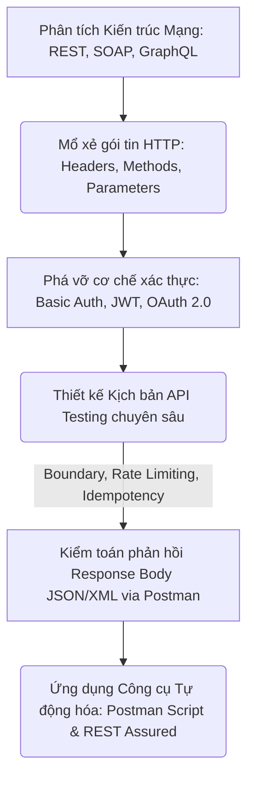
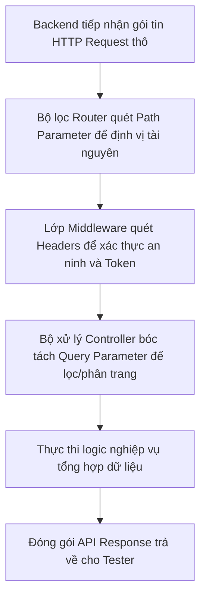
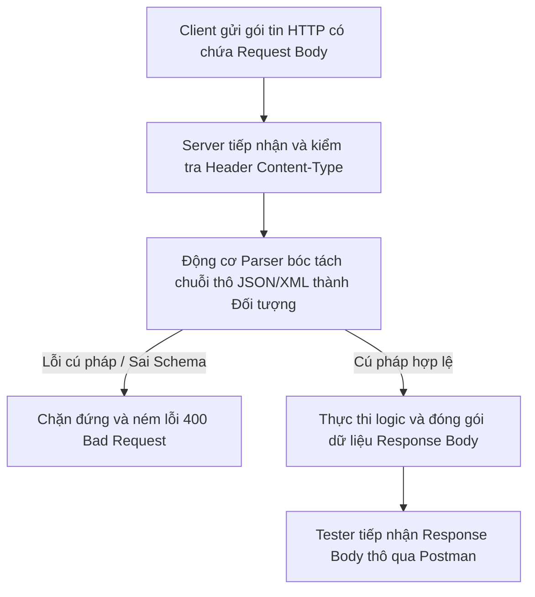
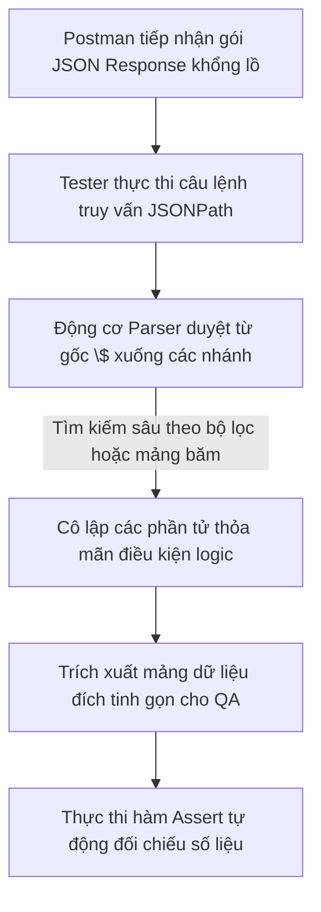

# 📁 07. API Testing

*Mục tiêu: Làm chủ quy trình kiểm thử tầng tích hợp hệ thống, xử lý thuần thục các giao thức truyền thông HTTP, giải mã cấu trúc Request/Response, bẻ gãy các cơ chế xác thực bảo mật và thiết kế kịch bản kiểm toán API chuyên sâu.*

# **7.3. Request & Response Anatomy**

## 📌 Mục lục nội bộ (Chặng 07)

- [ ] [**7.1. API Fundamentals**](./1_APIFundamentals.md)
- [ ] [**7.2. HTTP Protocol in API**](./2_HTTPProtocol.md)
- [ ] [**7.3. Request & Response Anatomy**](./3_RequestResponse.md)
  - [ ] [7.3.1. Headers, Query Parameters, Path Parameters](./3_RequestResponse.md#731-headers-query-parameters-path-parameters)
  - [ ] [7.3.2. Request Body & Response Body parsing (JSON / XML)](./3_RequestResponse.md#732-request-body--response-body-parsing-json--xml)
  - [ ] [7.3.3. Advanced Data Extraction: JSONPath Syntax](./3_RequestResponse.md#733-advanced-data-extraction-jsonpath-syntax)
- [ ] [**7.4. API Authentication Mechanisms**](./4_Authentication.md)
- [ ] [**7.5. API Test Scenarios Designing**](./5_APITestingStrategy.md)
- [ ] [**7.6. API Testing Tooling**](./6_Tools.md)

---

## 🗺️ Bản đồ Tiến trình Từ Nền tảng Giao tiếp đến Kiểm toán Tích hợp API

Sơ đồ đơn sắc dưới đây mô tả cách thức Tester bóc tách các trường phái kiến trúc mạng, mổ xẻ cấu trúc gói tin HTTP và áp dụng các kịch bản kiểm thử biên để bẻ gãy lớp bảo mật/logic của tầng trung gian:



---

# 7.3.1. Headers, Query Parameters, Path Parameters

Trong kiểm thử tầng tích hợp, việc truyền tải dữ liệu giữa Máy khách và Máy chủ được phân cấp nghiêm ngặt qua các vùng chứa tham số khác nhau của giao thức HTTP. Thành thạo việc phân tích vị trí, ngữ nghĩa và phạm vi tác động của **Headers**, **Query Parameters**, và **Path Parameters** giúp Tester bóc tách chính xác cấu trúc gói tin, thiết kế các kịch bản phá hủy biên (Boundary Testing) và cô lập lỗi bảo mật tầng trung gian một cách chuyên nghiệp.

> ⚠️ **Nguyên lý phân cấp tham số mạng (Parameter Scope Principle):** Mỗi loại tham số HTTP giữ một vai trò kỹ thuật độc lập và không thể thay thế tuỳ tiện cho nhau. Việc đặt sai vị trí tham số (Ví dụ: Truyền Token bảo mật qua Query Parameter thay vì Header) sẽ trực tiếp tạo ra các lỗ hổng rò rỉ dữ liệu nghiêm trọng trên hệ thống Proxy và máy chủ Log.

---

## 🛠️ Luồng Bóc tách và Điều hướng Tham số API tại Máy chủ (Parameter Parsing Lifecycle)

Sơ đồ đơn sắc dưới đây mô tả chính xác chu trình bóc tách từng lớp dữ liệu của gói tin HTTP Request khi đi qua bộ lọc Router và Controller của Backend Server:



---

## 📊 Ma trận Phân rã Kỹ thuật các Loại Tham số HTTP API (QA Mindset)

Dưới đây là ma trận phân rã chi tiết 3 loại tham số truyền tin cốt lõi, bóc tách theo quy chuẩn vi mô để phục vụ việc cấu trúc hóa kịch bản săn tìm Defect ngầm:

| Loại tham số | Vị trí kỹ thuật trong gói tin | Trọng tâm kiểm thử (QA Focus) | Kịch bản lỗi điển hình thực chiến (Defect) |
| :--- | :--- | :--- | :--- |
| **1. Headers** | Nằm ở phần đầu gói tin (HTTP Header Blocks). Chứa Metadata cấu hình như `Content-Type`, `User-Agent`, `Authorization`. | **Kiểm thử an ninh và định dạng.** Cố tinh xóa, sửa đổi các trường bảo mật hoặc gửi sai định dạng Header (Ví dụ: Truyền `Content-Type: text/plain` nhưng gửi Body JSON). | **Lỗi sập logic (415/500):** Server bị crash trắng do lập trình viên quên viết hàm bắt ngoại lệ khi Client gửi sai định dạng định danh Header. |
| **2. Path Parameters** | Nằm trực tiếp trên thanh đường dẫn URL, đóng vai trò là một phần của Endpoint (Ví dụ: `/api/users/{id}`). | **Kiểm thử giá trị biên thực thể cứng.** Thay thế ID bằng số âm, chuỗi ký tự đặc biệt, mã SQL Injection, hoặc ID vượt ngưỡng quy định (`MAX_INT`). | Gọi API `GET /api/photos/abc` khiến Backend ném lỗi `500 Internal Error` thô mộc do code không chặn lỗi ép kiểu dữ liệu từ Chuỗi sang Số. |
| **3. Query Parameters** | Nằm ở cuối URL, bắt đầu sau dấu chấm hỏi `?` và nối với nhau bằng dấu `&` (Ví dụ: `?page=2&sort=desc`). | **Kiểm thử bộ lọc và phân trang (Filter/Sort/Page).** Thử nghiệm các giá trị biên của trang (`page=0`, `page=-1`) hoặc chuỗi tìm kiếm rác để phá vỡ thuật toán. | Bộ lọc tìm kiếm sản phẩm trả về sai lệch toàn bộ danh sách dữ liệu do Backend bóc tách và xử lý sai logic chuỗi nối của Query Parameter. |

---

## 🧠 Chiến lược Thực chiến QA: Săn lỗi Bảo mật và Hiệu năng qua Tham số

Một Tester thực chiến sử dụng tư duy bóc tách tham số để thiết kế các ca test nâng cao, hạ gục hệ thống Backend tại các điểm mù lập trình:

*   **Săn lỗ hổng rò rỉ dữ liệu qua Query Parameter:** Hãy tưởng tượng bạn đang kiểm thử một API lấy thông tin sao kê tài khoản `GET /api/v1/statements?token=eyasdasd...`. Lập trình viên đã lười biếng truyền mã xác thực qua Query Parameter. Tư duy phản biện của QA: URL của phương thức `GET` sẽ bị lưu lại 100% dưới dạng văn bản thô (Plain Text) tại hệ thống Log của Web Server (Nginx/Apache) hoặc lịch sử trình duyệt. Hacker chiếm được Log sẽ chiếm được Token. **Giải pháp:** Bắt buộc phải log Bug Critical, yêu cầu chuyển Token vào Header `Authorization: Bearer <token>`.
*   **Săn lỗi tràn bộ nhớ (Out of Memory) qua Limit Parameter:** Khi kiểm thử một API lấy danh sách bài viết sử dụng Query Parameter để phân trang: `GET /api/v1/posts?limit=10`. Bạn hãy giả lập một ca test biên cực hạn: Thay đổi tham số thành `limit=1000000000` (Mười tỷ bản ghi). Nếu Backend Server lỏng lẻo, nó sẽ cố chấp thực thi lệnh, ép Database quét hàng tỷ dòng nạp vào RAM. Hậu quả là máy chủ Backend sẽ bị cạn kiệt bộ nhớ và chết đứng lập tức (Lỗi Out of Memory - DoS). QA cần log lỗi yêu cầu Backend cấu hình ngưỡng Hard Limit tối đa cho tham số `limit` (Ví dụ: Không cho phép vượt quá 100 bản ghi/request).

---

## 📚 References
* [ISTQB® Certified Tester Foundation Level (CTFL) Syllabus v4.0](https://istqb.org) - Section 2.2.1: Component Integration Testing (Interface Parameter and Metadata Verification).
* [RFC 9112: HTTP/1.1 Message Syntax and Routing](https://rfc-editor.org) - Section 3.2: Request URI and Header Parameter Field Parsing Specifications.

# 7.3.2. Request Body & Response Body parsing (JSON / XML)

Trong kiểm thử phần mềm nâng cao, việc làm chủ cấu trúc phần thân dữ liệu (**Body**) luân chuyển giữa Máy khách và Máy chủ là kỹ năng cốt lõi của một Tester hộp xám. **Request Body** chứa tải trọng thông tin đầu vào từ Client truyền lên, trong khi **Response Body** chứa kết quả xử lý nghiệp vụ thô từ Server phản hồi về. Thành thạo kỹ thuật phân tích cú pháp (*Parsing*) định dạng **JSON** và **XML** giúp QA trực tiếp thẩm định độ chính xác dữ liệu liên tầng, bẻ gãy logic ánh xạ hệ thống.

> ⚠️ **Nguyên lý toàn vẹn cấu trúc tải trọng (Payload Structural Integrity Principle):** Mọi gói tin truyền tải qua phần thân HTTP Body bắt buộc phải tuân thủ nghiêm ngặt quy chuẩn cú pháp (Schema). Việc Backend Server không bắt lỗi cú pháp thô (Syntax Error) từ Client hoặc ánh xạ sai kiểu dữ liệu trường thông tin trong Response Body là nguyên nhân trực tiếp gây sập ứng dụng (Crash).

---

## 🛠️ Luồng Xử lý Bóc tách và Khởi tạo Thân gói tin API (Payload Parsing Lifecycle)

Sơ đồ đơn sắc dưới đây mô tả chính xác chu trình Backend Server tiếp nhận, ép kiểu, phân tích cú pháp JSON/XML từ Request Body trước khi tương tác với DB và đóng gói dữ liệu phản hồi:



---

## 📊 Ma trận Phân rã Kỹ thuật Thân gói tin JSON và XML (QA Mindset)

Dưới đây là ma trận phân rã chi tiết hai định dạng thân gói tin cốt lõi, bóc tách theo quy chuẩn vi mô giúp Tester cấu trúc hóa kịch bản săn tìm Bug tích hợp:

| Định dạng Thân gói tin | Bản chất kỹ thuật ngầm | Trọng tâm kiểm thử (QA Focus) | Kịch bản lỗi điển hình thực chiến (Defect) |
| :--- | :--- | :--- | :--- |
| **1. JSON<br>(JavaScript Object Notation)** | Cấu trúc dữ liệu mượt mà, lưu dưới dạng cặp `Key-Value` và mảng dữ liệu lồng nhau (`[]`, `{}`). Cực kỳ tối ưu băng thông. | **Kiểm thử ép kiểu dữ liệu biên.** Gửi sai kiểu trường thông tin (Ví dụ: Truyền chuỗi `"abc"` vào trường số `INT` xem Server xử lý thế nào). | **Lỗi sập logic (500):** Server bị crash do lập trình viên quên bọc khối lệnh try-catch khi phân tích cú pháp đối tượng JSON bị khuyết thuộc tính. |
| **2. XML<br>(Extensible Markup Language)** | Cấu trúc dữ liệu thô cứng dựa trên các cặp thẻ đóng-mở lồng cấp (`<tag>...</tag>`), kiểm soát nghiêm ngặt bằng tệp cấu hình XSD Schema. | **Kiểm thử phá hủy cấu trúc.** Cố tình xóa thẻ đóng, gửi sai thứ tự phân cấp, hoặc nhét ký tự đặc biệt không được mã hóa vào giữa các thẻ. | **Lỗi rò rỉ bảo mật (XXE):** Hệ thống dính lỗ hổng XML External Entity, cho phép hacker chèn lệnh độc hại đọc trộm file mật trên Server qua thẻ XML. |

---

## 🧠 Chiến lược Thực chiến QA: Săn lỗi Ánh xạ và Phân tích Cú pháp Thô

Một Tester thực chiến sử dụng tư duy Gray-box để thiết kế các ca test biên cực hạn đánh gục bộ xử lý Parser của Backend Server tại các điểm mù lập trình:

*   **Săn lỗi sập hệ thống do sai định dạng (Content-Type Mismatch Bug):** Khi kiểm thử một API cập nhật thông tin ví điện tử `PUT /api/v1/wallets`. Bạn thiết lập Header `Content-Type: application/xml` nhưng phần thân Body bạn lại cố tình gửi một chuỗi văn bản JSON `{"amount": 50000}`. Tư duy phản biện của QA: Nếu lập trình viên Backend lỏng lẻo, động cơ Parser phía sau sẽ cố chấp dùng bộ phân tích XML để đọc chuỗi JSON. Hệ thống sẽ ném ra lỗi mã `500 Internal Server Error` phơi bày lỗi thô của hệ thống thay vì trả về mã chuẩn `415 Unsupported Media Type`.
*   **Săn lỗi lệch pha kiểu dữ liệu giữa DB và Response JSON (Type Distortion):** Hãy tưởng tượng bạn đang test API lấy thông tin số dư tài khoản. Trong cơ sở dữ liệu RDBMS (MySQL/PostgreSQL), số dư của khách đang lưu chính xác tuyệt đối ở kiểu `DECIMAL` là `15000000.55` (Có phần thập phân tiền tệ). Tuy nhiên, khi Backend đóng gói dữ liệu vào Response Body JSON, lập trình viên đã bất cẩn ép kiểu trường này thành kiểu số nguyên `INT`. Response trả về: `{"balance": 15000000}`. QA bắt buộc phải viết câu lệnh SQL đối chiếu chéo để bắt lỗi lệch pha dữ liệu này, ngăn chặn nguy cơ làm mất tiền mặt của khách hàng hiển thị trên UI.

---

## 📚 References
* [ISTQB® Certified Tester Foundation Level (CTFL) Syllabus v4.0](https://istqb.org) - Section 2.2.1: Component Integration Testing (Data Schema and Payload Structural Verification).
* [W3C XML & ECMA-404 JSON Data Interchange Format Standards](https://ecma-international.org) - Official Technical Specifications for Structured Message Text Parsing.

# 7.3.3. Advanced Data Extraction: JSONPath Syntax

Trong kiểm thử tự động hóa API (API Automation Testing), việc đọc và xác thực thủ công từng trường thông tin trong một gói JSON Response khổng lồ là điều bất khả thi. **JSONPath** chính là ngôn ngữ truy vấn và bóc tách dữ liệu tối thượng giúp Tester định vị, trích xuất chính xác các phần tử hoặc mảng dữ liệu lồng cấp phức tạp. Làm chủ cú pháp JSONPath là vũ khí cốt lõi để viết các đoạn mã khẳng định (Assert Scripts) tự động không tì vết trong Postman hoặc các Framework kiểm thử chuyên sâu.

> ⚠️ **Nguyên lý cô lập phần tử đích (Element Isolation Principle):** Cấu trúc JSON Response có thể thay đổi thứ tự phân cấp khi Backend cập nhật mã nguồn. Việc viết script test neo giữ dữ liệu bằng các chỉ số mảng cố định (Ví dụ: `data[0].id`) sẽ trực tiếp gây ra lỗi Flaky Test (Test chạy lúc pass lúc fail). QA bắt buộc phải dùng cú pháp truy vấn động của JSONPath để định vị phần tử theo thuộc tính logic duy nhất.

---

## 🛠️ Luồng Trích xuất và Thẩm định Dữ liệu Động bằng JSONPath (JSONPath Parsing Lifecycle)

Sơ đồ đơn sắc dưới đây mô tả chính xác chu trình động cơ Parser quét qua cấu trúc cây JSON Response để lọc và cô lập dữ liệu theo bộ quy tắc cú pháp của Tester:



---

## 📊 Ma trận Phân rã Cú pháp JSONPath Thực chiến dành cho QA (QA Mindset)

Dưới đây là ma trận hệ thống hóa các ký tự cú pháp lõi của JSONPath, bóc tách theo quy chuẩn vi mô kèm theo ví dụ ứng dụng thực tế để săn lỗi dữ liệu:

| Ký tự cú pháp | Ý nghĩa kỹ thuật lõi | Cú pháp mẫu thực chiến | Ý nghĩa nghiệp vụ QA & Mục tiêu bắt lỗi |
| :--- | :--- | :--- | :--- |
| **1. `$`** | Định vị phần tử gốc (Root object) của toàn bộ cây cấu trúc JSON. | `$` | Điểm khởi đầu bắt buộc của mọi chuỗi truy vấn để Parser định hình phạm vi quét. |
| **2. `.` hoặc `[]`** | Định vị thuộc tính con (Child operator) nằm trực tiếp ở phân cấp phía dưới. | `$.store.book` hoặc `$['store']['book']` | Truy cập theo từng bậc phân cấp chuẩn mực để bóc tách các khối dữ liệu lớn. |
| **3. `..`** | Tìm kiếm sâu xuống tất cả các cấp (Deep scan operator), bỏ qua mọi phân cấp trung gian. | `$..author` | Tìm kiếm tất cả các thuộc tính `author` nằm rải rác ở mọi ngóc ngách của file JSON. |
| **4. `*`** | Ký tự đại diện (Wildcard), lấy tất cả các phần tử nằm trong phân cấp hiện tại. | `$.store.book[*].price` | Trích xuất toàn bộ giá tiền của tất cả các cuốn sách thành một mảng số thô để đối chiếu chéo. |
| **5. `?()`** | Bộ lọc điều kiện logic (Filter expression), lọc ra các phần tử thỏa mãn biểu thức. | `$..book[?(@.price < 50)]` | **Kiểm thử phân vùng biên.** Lọc toàn bộ sách có giá dưới 50 để đối chiếu với tính năng filter trên UI. |
| **6. `@`** | Đại diện cho phần tử hiện tại (Current node) đang được xét bên trong bộ lọc `?()`. | `$..[?(@.status == 'PENDING')]` | Định vị trực tiếp các thực thể đang dính lỗi kẹt trạng thái ngầm ở tầng sâu của mảng dữ liệu. |

---

## 🧠 Chiến lược Thực chiến QA: Viết Script Khẳng định Tự động trong Postman

Hãy tưởng tượng bạn đang kiểm thử API lấy danh sách giỏ hàng `GET /api/v1/carts`. Hệ thống trả về một cấu trúc JSON phức tạp chứa mảng các sản phẩm lồng nhau:

```json
{
  "cart_id": 999,
  "items": [
    {"id": 1, "name": "Màn hình Dell", "price": 5000, "available": true},
    {"id": 2, "name": "Chuột Logi", "price": 300, "available": false},
    {"id": 3, "name": "Bàn phím Cơ", "price": 1200, "available": true}
  ]
}
```

Tư duy phản biện của một Tester sắc bén để viết mã khẳng định tự động (Automation Assertions) bằng JSONPath để lật tẩy lỗi ngầm:

1.  **Trích xuất mảng giá tiền:** Bạn viết cú pháp `$.items[*].price` để thu về mảng số thô `[5000, 300, 1200]`. Viết tiếp script test tự động dùng vòng lặp để kiểm tra: Nếu có bất kỳ sản phẩm nào có giá nhỏ hơn hoặc bằng 0, lập tức ném lỗi hệ thống dữ liệu rác.
2.  **Săn lỗi logic hiển thị (Business Logic Bug):** Hãy sử dụng bộ lọc điều kiện để cô lập các sản phẩm đã hết hàng nhưng hệ thống vẫn cho phép mua: `$.items[?(@.available == false)].id`. Kết quả trả về ID `2`. Cầm ID này bắn tiếp sang API tạo đơn hàng, nếu API tạo đơn vẫn báo thành công `200 OK` cho sản phẩm hết hàng, bạn đã bẻ gãy hoàn toàn logic backend và bắt được một Bug nghiêm trọng.

---

## 📚 References
* [ISTQB® Certified Tester Foundation Level (CTFL) Syllabus v4.0](https://istqb.org) - Section 4.2.3: Structural Testing and Automated Data Extraction for Integration Repositories.
* [Stefan Goessner JSONPath Specification Standards](https://goessner.net) - The Definitive Technical Specifications for JSON Path Expressions.
