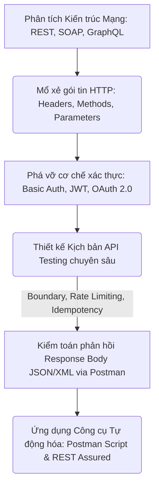
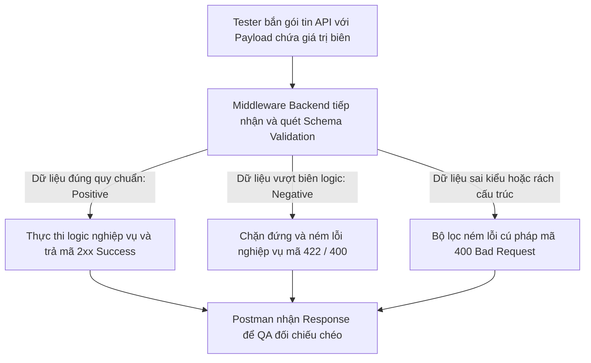
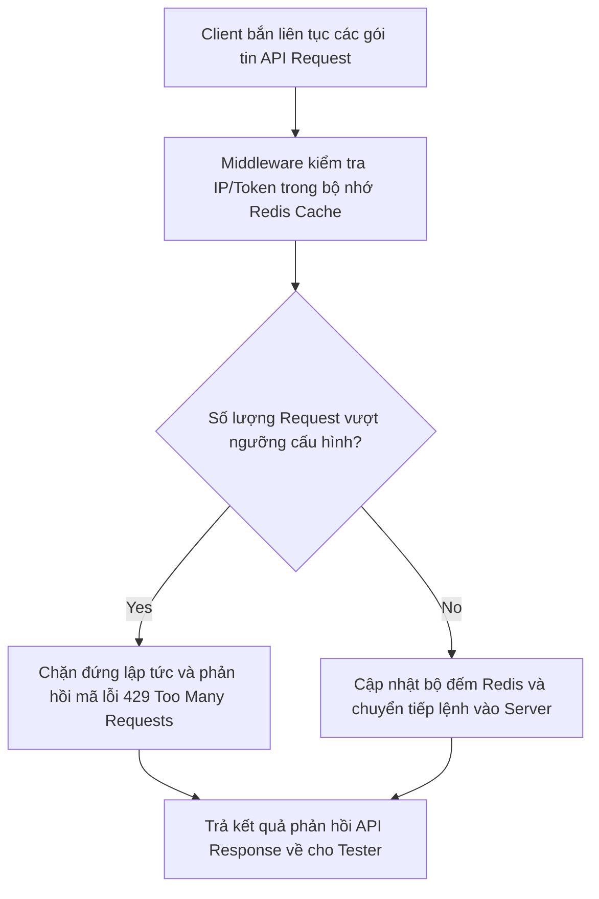
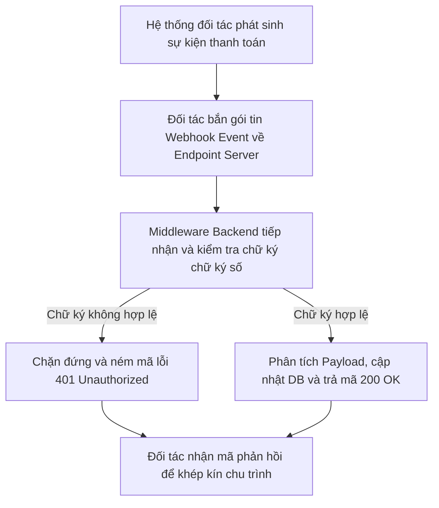

# 📁 07. API Testing

*Mục tiêu: Làm chủ quy trình kiểm thử tầng tích hợp hệ thống, xử lý thuần thục các giao thức truyền thông HTTP, giải mã cấu trúc Request/Response, bẻ gãy các cơ chế xác thực bảo mật và thiết kế kịch bản kiểm toán API chuyên sâu.*

# **7.5. API Test Scenarios Designing**

## 📌 Mục lục nội bộ (Chặng 07)

- [ ] [**7.1. API Fundamentals**](./1_APIFundamentals.md)
- [ ] [**7.2. HTTP Protocol in API**](./2_HTTPProtocol.md)
- [ ] [**7.3. Request & Response Anatomy**](./3_RequestResponse.md)
- [ ] [**7.4. API Authentication Mechanisms**](./4_Authentication.md)
- [ ] [**7.5. API Test Scenarios Designing**](./5_APITestingStrategy.md)
  - [ ] [7.5.1. Positive & Negative Testing, Boundary Testing](./5_APITestingStrategy.md#751-positive--negative-testing-boundary-testing)
  - [ ] [7.5.2. Pagination, Rate Limiting & Idempotency Testing](./5_APITestingStrategy.md#752-pagination-rate-limiting--idempotency-testing)
  - [ ] [7.5.3. Webhooks & Mocking APIs](./5_APITestingStrategy.md#753-webhooks--mocking-apis)
- [ ] [**7.6. API Testing Tooling**](./6_Tools.md)

---

## 🗺️ Bản đồ Tiến trình Từ Nền tảng Giao tiếp đến Kiểm toán Tích hợp API

Sơ đồ đơn sắc dưới đây mô tả cách thức Tester bóc tách các trường phái kiến trúc mạng, mổ xẻ cấu trúc gói tin HTTP và áp dụng các kịch bản kiểm thử biên để bẻ gãy lớp bảo mật/logic của tầng trung gian:

---

# 7.5.1. Positive & Negative Testing, Boundary Testing

Trong kiểm thử API chuyên sâu, việc thiết kế kịch bản không thể dựa trên trực giác mà phải vận hành theo các phương pháp toán học và logic học nghiêm ngặt. Phối hợp bộ ba kỹ thuật **Positive Testing (Kiểm thử khẳng định)**, **Negative Testing (Kiểm thử phủ định)**, và **Boundary Testing (Kiểm thử giá trị biên)** giúp Tester thiết lập một lưới quét lỗi (Bug Net) toàn diện, bóp nghẹt mọi kịch bản xử lý thiếu sót của Backend Server tại các vùng biên dữ liệu.

> ⚠️ **Nguyên lý bẫy lỗi biên và lớp lọc logic (Boundary Trap & Exception Principle):** Hệ thống Backend rất dễ bị crash hoặc tính toán sai lệch khi đối mặt với dữ liệu nằm sát ngưỡng giới hạn hoặc dữ liệu có định dạng bất thường. QA bắt buộc phải chủ động thiết kế kịch bản để phá vỡ cấu trúc Payload, ép Server phải kích hoạt hàm bắt ngoại lệ (Exception Handling) thay vì ném lỗi hệ thống thô.

---

## 🛠️ Luồng Thẩm định và Đánh giá Giá trị Biên của Gói tin API (Validation Lifecycle)

Sơ đồ đơn sắc dưới đây mô tả chính xác cách thức bộ xử lý Validation của Backend đánh chặn, phân loại và phản hồi đối với từng loại dữ liệu đầu vào (Hợp lệ, Vượt biên, Sai định dạng):

---

## 📊 Ma trận Thiết kế Kịch bản Kiểm thử Biên và Phủ định Payload (QA Mindset)

Dưới đây là ma trận phân rã chi tiết 3 kỹ thuật thiết kế ca test cốt lõi, bóc tách theo quy chuẩn vi mô thực chiến giúp Tester định hình bộ Test Cases tinh gọn, chất lượng cao:

| Kỹ thuật Test | Khái niệm kỹ thuật lõi | Cách thức hành động trên Payload (QA Action) | Kịch bản lỗi điển hình thực chiến (Defect) |
| :--- | :--- | :--- | :--- |
| **1. Positive Testing** | Xác thực hệ thống vận hành đúng đặc tả khi nhận dữ liệu chuẩn mực (Kịch bản đường hạnh phúc - *Happy Path*). | Truyền gói tin Payload chứa đầy đủ các trường thông tin bắt buộc và tự chọn với định dạng, giá trị hoàn hảo theo tài liệu Swagger. | API báo lỗi `400` hoặc ghi thiếu trường thông tin vào DB mặc dù Client truyền dữ liệu hoàn toàn hợp lệ (Lỗi lập trình sai logic ánh xạ). |
| **2. Negative Testing** | Xác thực hệ thống có khả năng từ chối an toàn và ném lỗi tường minh khi nhận dữ liệu sai trái hoặc bất hợp lý. | Cố tình xóa bỏ trường bắt buộc, gửi sai định dạng chuỗi, hoặc truyền payload trống rỗng để ép máy chủ kích hoạt hàm chặn lỗi. | Server chấp nhận thực thi và ném mã `200 OK` cho một gói tin API khuyết thiếu hoàn toàn thông tin định danh, gây rác kho dữ liệu. |
| **3. Boundary Testing** | Thử nghiệm các giá trị nằm ngay tại ranh giới tối thiểu và tối đa của trường dữ liệu theo tài liệu đặc tả nghiệp vụ. | Sử dụng các mốc biên kỹ thuật: Giá trị biên dưới ($Min, Min+1, Min-1$), Giá trị biên trên ($Max, Max+1, Max-1$). Nhét chuỗi dài quá giới hạn. | **Lỗi sập Server (500):** Khi truyền giá trị nạp tiền vượt ngưỡng ($Max+1$), hệ thống bị crash do code dính lỗi tràn số (*Integer Overflow*). |

---

## 🧠 Chiến lược Thực chiến QA: Thiết kế Ca test Biên cho API Đặt hàng

Hãy tưởng tượng bạn đang kiểm thử API đặt mua sản phẩm số lượng lớn: `POST /api/v1/orders`. Tài liệu đặc tả quy định trường số lượng mua `quantity` bắt buộc phải là số nguyên, mức tối thiểu cho một lần đặt là `1` sản phẩm, và tối đa là `100` sản phẩm cho mỗi đơn hàng.

Tư duy phản biện của một Tester sắc bén để bóc tách bộ kịch bản kiểm thử biên cực hạn bẻ gãy hệ thống Backend (Boundary & Negative Test Cases Design):

1.  **Thiết kế ca test giá trị biên hợp lệ (Positive Boundaries):** Bạn bắn 2 request riêng biệt với `quantity: 1` và `quantity: 100`. Kỳ vọng hệ thống xử lý mượt mà, ghi nhận chính xác dữ liệu vào Database và trả về mã trạng thái `201 Created`.
2.  **Thiết kế ca test phá hủy biên dưới (Negative Minimum Boundary):** Bạn bắn request với `quantity: 0` (Giá trị \$Min-1\$) hoặc số âm `quantity: -5`. Bộ não Backend bắt buộc phải đánh chặn ngay lập tức tại lớp lọc logic, từ chối thực thi câu lệnh SQL ngầm và phản hồi mã lỗi `400 Bad Request` hoặc `422 Unprocessable Entity` kèm thông điệp rõ ràng: `"Số lượng sản phẩm không hợp lệ"`. Nếu Server chấp nhận tạo đơn với số lượng bằng 0 hoặc số âm, bạn đã bắt được Bug tài chính cực kỳ nghiêm trọng.
3.  **Thiết kế ca test phá hủy biên trên (Negative Maximum Boundary):** Bạn bắn request với `quantity: 101` (Giá trị \$Max+1\$). Nếu Server lỏng lẻo, cho phép tạo đơn thành công, hệ thống đã vi phạm luật kinh doanh của doanh nghiệp, tạo lỗ hổng cho các hành vi đầu cơ tích trữ hàng hóa.

---

## 📚 References
* [ISTQB® Certified Tester Foundation Level (CTFL) Syllabus v4.0](https://istqb.org) - Section 4.2.1: Equivalence Partitioning & Section 4.2.2: Boundary Value Analysis (Applied to Interface Message Specification).
* [ISO/IEC/IEEE 29119-4:2021 Standard](https://iso.org) - Software Testing: Test Techniques for Boundary Value Testing on Multi-Tier Payload Schemas.

# 7.5.2. Pagination, Rate Limiting & Idempotency Testing

Trong kiểm thử chất lượng API cấp công nghiệp, Tester phải đối mặt với các bài toán kiểm toán luồng dữ liệu lớn và chặn đứng các hành vi lạm dụng phá hoại hệ thống. Làm chủ bộ ba kỹ thuật **Pagination (Phân trang dữ liệu)**, **Rate Limiting (Giới hạn tần suất)**, và **Idempotency (Tính lặp lại đồng nhất)** giúp QA thiết lập chốt chặn an toàn tuyệt đối cho Backend Server, bảo vệ tài nguyên máy chủ và kho lưu trữ Database khỏi các sự cố tràn bộ nhớ hoặc trùng lặp giao dịch.

> ⚠️ **Nguyên lý bền vững tài nguyên và giao dịch (Resource & Transaction Sustainability Principle):** Hệ thống API nếu thiếu bộ lọc giới hạn tần suất sẽ dễ dàng bị đánh sập bởi các cuộc tấn công từ chối dịch vụ (DoS). Đồng thời, việc thiếu cơ chế kiểm soát Idempotency cho các API thay đổi trạng thái sẽ trực tiếp phá hủy tính toàn vẹn tài chính của kho dữ liệu khi Client bị lag mạng.

---

## 🛠️ Luồng Đánh chặn và Xử lý Giới hạn Tần suất Thuật toán (Rate Limiting Lifecycle)

Sơ đồ đơn sắc dưới đây mô tả chính xác cách thức bộ lọc Token Bucket / Leaky Bucket của Middleware đánh chặn gói tin HTTP Request để kiểm soát số lượng yêu cầu trong một khung giờ cố định:

---

## 📊 Ma trận Kiểm toán Phân trang, Giới hạn Tần suất và Khóa Trùng lặp (QA Mindset)

Dưới đây là ma trận phân rã chi tiết 3 kỹ thuật kiểm thử phi chức năng then chốt, bóc tách theo quy chuẩn vi mô thực chiến giúp Tester định vị chính xác điểm nghẽn hệ thống:

| Kỹ thuật thực chiến | Bản chất vận hành ngầm của Server | Trọng tâm kiểm thử (QA Focus) | Kịch bản lỗi điển hình thực chiến (Defect) |
| :--- | :--- | :--- | :--- |
| **1. Pagination Testing** | Sử dụng tham số `page` và `limit` để Backend trích xuất phân đoạn đĩa cứng tương ứng qua mệnh đề `LIMIT / OFFSET` của SQL. | **Kiểm thử biên ranh giới trang.** Xác thực tổng số bản ghi (*Total Elements*) và số trang (*Total Pages*) trả về trong Meta JSON có khớp khít UI. | **Lỗi rò rỉ dữ liệu:** Bản ghi cuối cùng của Trang 1 bị lặp lại ở đầu Trang 2, hoặc dữ liệu bị sót dòng do Backend tính sai công thức `OFFSET`. |
| **2. Rate Limiting Test** | Middleware sử dụng bộ nhớ đệm RAM siêu tốc (Redis) để đếm và khóa các request vượt ngưỡng cấu hình trong 1 khung giờ. | **Kiểm thử phá hủy tần suất (Spamming).** Sử dụng Postman Runner hoặc JMeter bắn hàng loạt request liên tục để ép Server ném lỗi. | **Lỗi sập tài nguyên:** Server bị treo cứng hoặc ném lỗi `500` thay vì trả về đúng mã chuẩn `429 Too Many Requests` kèm Header `Retry-After`. |
| **3. Idempotency Testing** | Backend bắt buộc Client truyền một mã khóa độc bản `Idempotency-Key` trong Header để nhận diện các yêu cầu bị gửi lặp lại. | **Kiểm thử lặp lệnh do lag mạng.** Bắn 2 request chứa cùng 1 mã Khóa khóa trùng khít thông số trong cùng 1 giây để kiểm tra chốt chặn. | **Lỗi nhân đôi giao dịch:** Hệ thống duyệt chi và tạo ra 2 hóa đơn chuyển tiền giống hệt nhau cho cùng 1 yêu cầu do Backend thiếu cơ chế khóa dòng. |

---

## 🧠 Chiến lược Thực chiến QA: Thiết kế Ca test Khóa trùng lặp Giao dịch tài chính

Hãy tưởng tượng bạn đang kiểm thử API thanh toán hóa đơn điện nước: `POST /api/v1/bills/pay`. Quy chuẩn an toàn yêu cầu API này bắt buộc phải có tính chất **Idempotent** để bảo vệ tiền mặt của khách hàng khi họ lỡ tay bấm nút thanh toán nhiều lần do mạng chậm.

Tư duy phản biện của một Tester sắc bén để thiết kế ca kiểm thử hộp xám kiểm toán tính Idempotency (Idempotency Test Cases Design):

1.  **Thiết kế ca test tạo mã Khóa độc bản:** Bạn mở công cụ Postman, cấu hình phần Header truyền tải một chuỗi khóa ngẫu nhiên dạng UUID: `Idempotency-Key: pay-9988-7766`. Chạy request lần 1. Kỳ vọng hệ thống DB lưu dữ liệu thành công, trả về mã `200 OK` hoặc `201 Created` kèm thông tin hóa đơn.
2.  **Thiết kế ca test lặp lệnh cực hạn:** Giữ nguyên chuỗi Header `Idempotency-Key: pay-9988-7766` đó, bấm nút gửi request lần 2, 3 liên tục trong vòng vài phần tư giây. 
3.  **Hậu kiểm tầng dữ liệu và Response:** Bộ não Backend bắt buộc phải nhận diện được mã khóa này đã tồn tại trong hàng đợi xử lý. Server phải lập tức từ chối ghi nhận vào DB vật lý, không được trừ thêm tiền của khách, nhưng phải trả về **cấu trúc Response giống hệt như lần 1** để đảm bảo tính Idempotent chuẩn mực của giao thức HTTP. Nếu hệ thống báo lỗi `500 SQL Exception` hoặc trừ tiền khách lần 2, lập tức log Bug Block hệ thống.

---

## 📚 References
* [ISTQB® Certified Tester Foundation Level (CTFL) Syllabus v4.0](https://istqb.org) - Section 4.2.3: Specification-Based and Structural Testing of Data Repositories (Non-Functional Interface Limits).
* [OWASP API Security Top 10 Standards](https://owasp.org) - API4:2023 Unrestricted Resource Consumption & API8:2023 Security Misconfiguration.

# 7.5.3. Webhooks & Mocking APIs

Trong kiểm thử phần mềm thực chiến, các hệ thống ứng dụng luôn phải giao tiếp với các nền tảng bên thứ ba (Cổng thanh toán, Đơn vị vận chuyển). Thành thạo kỹ thuật kiểm thử **Webhooks (Kiến trúc đảo ngược sự kiện)** kết hợp nghệ thuật **Mocking APIs (Giả lập dịch vụ)** giúp Tester chủ động cô lập môi trường kiểm thử, giả lập các kịch bản lỗi phản hồi cực hạn và kiểm toán toàn vẹn dữ liệu một cách độc lập mà không phụ thuộc vào trạng thái của đối tác.

> ⚠️ **Nguyên lý đảo ngược luồng và cô lập môi trường (Inverted Flow & Mocking Isolation Principle):** Khác với API thông thường (Client chủ động gọi), Webhook vận hành theo cơ chế đảo ngược: Máy chủ đối tác sẽ tự động bắn gói tin Event Notification về cho hệ thống của bạn khi có sự kiện phát sinh. QA bắt buộc phải sử dụng kỹ thuật Mocking để giả lập các gói tin phản hồi độc hại hoặc mã lỗi mạng từ đối tác nhằm thẩm định độ bền bỉ của lớp xử lý Backend.

---

## 🛠️ Luồng Xử lý Kiểm toán Sự kiện Đảo ngược qua cơ chế Webhook (Webhook Lifecycle)

Sơ đồ đơn sắc dưới đây mô tả chính xác chu trình hệ thống đối tác bắn gói tin Webhook thông báo sự kiện về Endpoint của Backend Server, đi qua bộ xử lý kiểm toán để cập nhật Database:

---

## 📊 Ma trận Khai thác Kỹ thuật Kiểm thử Webhook và Giả lập API (QA Mindset)

Dưới đây là ma trận phân rã chi tiết 3 giải pháp công nghệ then chốt, bóc tách theo quy chuẩn vi mô thực chiến giúp Tester định cấu hình kịch bản hạ gục hệ thống ngầm:

| Thành phần kỹ thuật | Bản chất vận hành ngầm của hệ thống | Trọng tâm kiểm thử (QA Focus) | Kịch bản lỗi điển hình thực chiến (Defect) |
| :--- | :--- | :--- | :--- |
| **1. Webhook Endpoint** | Lập trình viên mở một cổng API công khai (Ví dụ: `/api/v1/webhooks/stripe`) để lắng nghe gói tin Event đổ về. | **Kiểm thử an ninh và giả mạo.** Thử dùng Postman tự chế một gói tin giả mạo bắn vào Endpoint xem Server có cơ chế check chữ ký số (`X-Signature`) không. | **Lỗi bypass bảo mật:** Hệ thống âm thầm duyệt trạng thái đơn hàng thành "Đã thanh toán" khi QA cố tình bắn Payload giả mạo mà không truyền mã chữ ký số. |
| **2. API Mocking (Giả lập luồng nhận)** | Sử dụng công cụ (Mockoon, WireMock, Postman Mock Server) để thay thế hoàn toàn cho máy chủ đối tác chưa hoàn thiện. | **Kiểm thử kịch bản lỗi cực hạn.** Cấu hình Mock Server cố tình trả về các mã lỗi `500`, `502` hoặc Payload rách cấu trúc để test khả năng chịu tải. | Hệ thống Backend bị treo cứng hoặc nuốt mất dữ liệu lịch sử của khách hàng khi API của đối tác gặp sự cố ném ra lỗi Timeout mạng. |
| **3. Idempotency on Webhook** | Cơ chế đối tác tự động bắn lại gói tin Webhook nhiều lần (Retry) nếu đường truyền bị trễ cho đến khi nhận được mã `200 OK`. | **Kiểm thử xử lý trùng lặp sự kiện.** Cố tình cấu hình gửi liên tiếp 3 gói tin Webhook thông báo cùng 1 mã giao dịch thành công trong 1 giây. | **Lỗi nhân đôi tiền:** Tài khoản của khách hàng bị cộng tiền 2-3 lần liên tiếp do Backend thiếu cơ chế khóa dòng dữ liệu khi nhận Webhook lặp. |

---

## 🧠 Chiến lược Thực chiến QA: Thiết kế Ca test Giả lập lỗi Cổng thanh toán

Hãy tưởng tượng bạn đang kiểm thử tính năng "Thanh toán qua cổng ngân hàng bên thứ ba". Quy trình chuẩn: Khách quét mã QR trên UI $\rightarrow$ Ngân hàng trừ tiền khách thành công $\rightarrow$ Ngân hàng tự động bắn một gói tin Webhook chứa thông tin `{"transaction_id": "TX-7788", "status": "PAID"}` về cho Server của bạn để kích hoạt gói dịch vụ.

Tư duy phản biện của một Tester sắc bén để thiết kế ca kiểm thử hộp xám áp dụng kỹ thuật Mocking và Webhook (Integration Boundary Test Cases Design):

1.  **Cấu hình công cụ Mocking:** Sử dụng Postman Mock Server hoặc WireMock để giả lập API của Ngân hàng. Cấu hình Mock Server trả về mã lỗi `502 Bad Gateway` hoặc cố tình cấu hình độ trễ phản hồi (Delay) lên tới 15 giây để giả lập nghẽn mạng.
2.  **Thực thi kiểm toán độ bền Backend:** Kích hoạt luồng thanh toán trên ứng dụng. Thẩm định xem máy chủ Backend của bạn có cơ chế tự động ghi nhận trạng thái giao dịch vào bảng tạm, hay ngay lập tức crash mã nguồn và ném lỗi `500` lên màn hình UI của khách hàng.
3.  **Kiểm toán luồng nhận Webhook:** Tự đóng vai máy chủ Ngân hàng, sử dụng Postman bắn một gói tin Webhook thô vào Endpoint của Server. Thực hiện kịch bản test gửi lặp lại 2 lần gói tin `TX-7788`. Chui vào cơ sở dữ liệu RDBMS, kiểm tra bảng `user_services`: Thời hạn kích hoạt dịch vụ của khách **bắt buộc chỉ được tăng đúng 1 lần**. Nếu hệ thống cộng dồn thời hạn lên gấp đôi, lập tức log lỗi logic xử lý trùng lặp Webhook.

---

## 📚 References
* [ISTQB® Certified Tester Foundation Level (CTFL) Syllabus v4.0](https://istqb.org) - Section 2.2.1: Component Integration Testing (Stubs, Mocks and Third-Party Interface Drivers Deployment).
* [OWASP API Security Top 10 Standards](https://owasp.org) - API6:2023 Unsafe Consumption of APIs & API10:2023 Insufficient Log & Monitoring.
