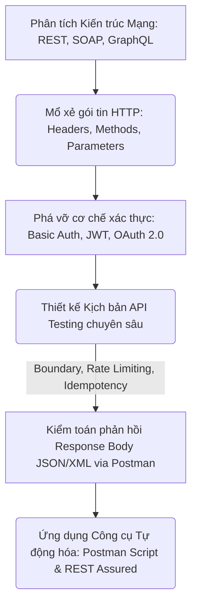
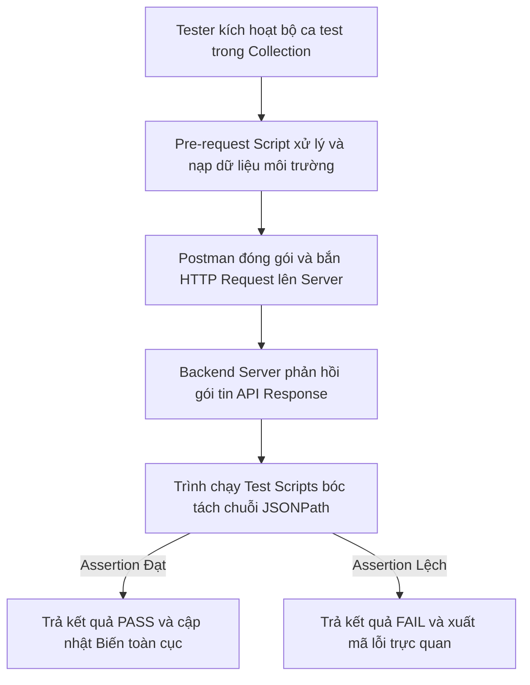
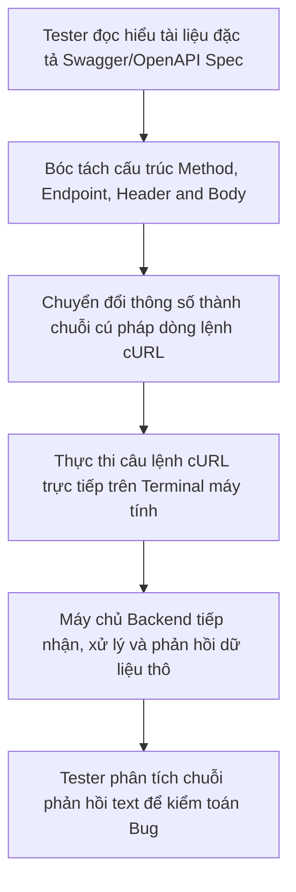
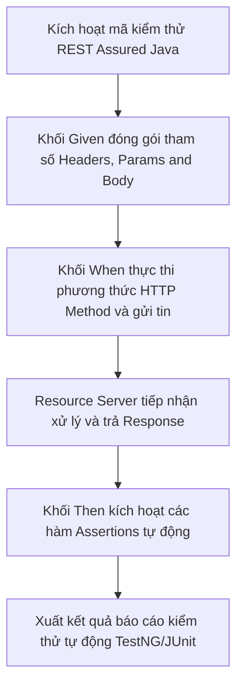

# 📁 07. API Testing

*Mục tiêu: Làm chủ quy trình kiểm thử tầng tích hợp hệ thống, xử lý thuần thục các giao thức truyền thông HTTP, giải mã cấu trúc Request/Response, bẻ gãy các cơ chế xác thực bảo mật và thiết kế kịch bản kiểm toán API chuyên sâu.*

# **7.6. API Testing Tooling**

## 📌 Mục lục nội bộ (Chặng 07)

- [ ] [**7.1. API Fundamentals**](./1_APIFundamentals.md)
- [ ] [**7.2. HTTP Protocol in API**](./2_HTTPProtocol.md)
- [ ] [**7.3. Request & Response Anatomy**](./3_RequestResponse.md)
- [ ] [**7.4. API Authentication Mechanisms**](./4_Authentication.md)
- [ ] [**7.5. API Test Scenarios Designing**](./5_APITestingStrategy.md)
- [ ] [**7.6. API Testing Tooling**](./6_Tools.md)
  - [ ] [7.6.1. Postman: Collections, Environments, Test Scripts](./6_Tools.md#761-postman-collections-environments-test-scripts)
  - [ ] [7.6.2. Swagger / OpenAPI Documentation & Curl Command line](./6_Tools.md#762-swagger--openapi-documentation--curl-command-line)
  - [ ] [7.6.3. REST Assured Framework Overview](./6_Tools.md#763-rest-assured-framework-overview)

---

## 🗺️ Bản đồ Tiến trình Từ Nền tảng Giao tiếp đến Kiểm toán Tích hợp API

Sơ đồ đơn sắc dưới đây mô tả cách thức Tester bóc tách các trường phái kiến trúc mạng, mổ xẻ cấu trúc gói tin HTTP và áp dụng các kịch bản kiểm thử biên để bẻ gãy lớp bảo mật/logic của tầng trung gian:



---

# 7.6.1. Postman: Collections, Environments, Test Scripts

Trong kiểm thử phần mềm chuyên nghiệp, việc bắn lẻ tẻ từng request thủ công là một hành vi kém hiệu quả và không có tính kế thừa. **Postman** không chỉ là một công cụ Client gửi gói tin đơn thuần, mà là một hệ sinh thái mạnh mẽ hỗ trợ Tester tự động hóa quy trình kiểm thử. Làm chủ bộ ba kỹ thuật **Collections (Bộ sưu tập)**, **Environments (Môi trường động)**, và **Test Scripts (Kịch bản khẳng định tự động)** giúp QA đóng gói bộ ca test, luân chuyển tham số thông minh và kích hoạt lưới quét lỗi tự động với độ chính xác tuyệt đối.

> ⚠️ **Nguyên lý đóng gói và động hóa tham số (Test Suite Automation Principle):** Tuyệt đối cấm gõ cứng các chuỗi dữ liệu nhạy cảm (như mật khẩu, token, hoặc domain máy chủ) vào bên trong đường dẫn Request. Việc bỏ quên cơ chế động hóa môi trường sẽ khiến bộ ca test bị vô hiệu hóa hoàn toàn khi dự án chuyển đổi ranh giới môi trường từ Dev, Staging sang Production.

---

## 🛠️ Luồng Thực thi Khẳng định và Luân chuyển Tham số tự động trong Postman (Postman Execution Lifecycle)

Sơ đồ đơn sắc dưới đây mô tả chính xác chu trình Postman kích hoạt gói tin, chạy mã tiền xử lý, nạp biến môi trường và kích hoạt trình phân tích JavaScript để chấm điểm ca test tự động:



---

## 📊 Ma trận Khai thác Hệ sinh thái Postman phục vụ Tự động hóa (QA Mindset)

Dưới đây là ma trận phân rã chi tiết 3 thành phần cốt lõi của công cụ Postman, bóc tách theo quy chuẩn vi mô thực chiến giúp Tester thiết lập khung tự động hóa tinh gọn:

| Thành phần Postman | Bản chất vận hành ngầm | Trọng tâm kiểm thử (QA Focus) | Kịch bản lỗi điển hình thực chiến (Defect) |
| :--- | :--- | :--- | :--- |
| **1. Collections** | Thư mục cây lưu trữ logic toàn bộ các Request, cho phép thiết lập cấu hình chung (Auth, Headers) và kích hoạt chạy dây chuyền (*Collection Runner*). | **Đóng gói bộ ca test (Test Suite).** Sắp xếp thứ tự các request theo đúng luồng đi của nghiệp vụ (Ví dụ: Đăng nhập $\rightarrow$ Đặt hàng $\rightarrow$ Hủy đơn). | Thứ tự chạy request bị đảo lộn khiến luồng test tự động bị crash liên tục do request sau gọi dữ liệu khi request trước chưa sinh mã ID. |
| **2. Environments** | Kho lưu trữ các cặp khóa giá trị (`Key-Value`) đại diện cho các biến cấu hình động, phân chia rạch ròi theo từng môi trường vật lý. | **Động hóa ranh giới dữ liệu.** Sử dụng cú pháp biến dạng `{{variable_name}}` để cô lập mã Domain, Token. Cấm rò rỉ biến bảo mật ra ngoài. | Tester cấu hình nhầm giá trị biến Token của môi trường thử nghiệm (Staging) đè lên đĩa cứng của môi trường thật (Production) gây sai lệch dữ liệu. |
| **3. Test Scripts** | Khối mã lập trình JavaScript chạy ngay sau khi nhận được Response, sử dụng thư viện `pm.test` và `pm.expect` để thẩm định kết quả. | **Viết mã khẳng định tự động (Assertions).** Tự động bóc tách mã trạng thái HTTP, thời gian phản hồi (*Response Time*) và cấu trúc thân gói tin JSON. | Ca test tự động báo xanh giả lập (False Positive) do Tester viết mã khẳng định quá nông cạn, chỉ check mã `200 OK` mà bỏ quên check lỗi rỗng ruột dữ liệu. |

---

## 🧠 Chiến lược Thực chiến QA: Viết Script trích xuất và Khẳng định chuỗi tự động

Hãy tưởng tượng bạn đang kiểm thử một luồng nghiệp vụ gồm 2 bước liên hoàn: Bước 1 gọi API Đăng nhập để nhận về mã Token bảo mật $\rightarrow$ Bước 2 dùng Token đó để truy cập API lấy số dư ví điện tử.

Tư duy phản biện của một Tester sắc bén để viết mã JavaScript tự động hóa luân chuyển dữ liệu trong tab **Tests** của Postman (Chặn đứng thao tác thủ công Copy-Paste):

1.  **Viết mã bóc tách và nạp biến tự động tại API Đăng nhập (Bước 1):**
    ```javascript
    // Kiểm tra mã trạng thái bắt buộc phải là 200 OK
    pm.test("Xác thực Header: Trả về mã 200 thành công", function () {
        pm.response.to.have.status(200);
    });

    // Bóc tách JSON Response để lấy chuỗi Token và nạp vào môi trường động
    var responseData = pm.response.json();
    if (responseData.access_token) {
        pm.environment.set("current_token", responseData.access_token);
        console.log("Hệ thống đã tự động khóa và luân chuyển Token");
    }
    ```
2.  **Khai thác biến tại API lấy số dư (Bước 2):** Tại tab Authorization của request số 2, bạn chọn kiểu *Bearer Token* và chỉ định biến động: `{{current_token}}`. Tiến hành viết tiếp mã khẳng định để kiểm toán số dư tài khoản trả về:
    ```javascript
    pm.test("Kiểm toán thân gói tin: Số dư không được trống và phải là số dương", function () {
        var jsonData = pm.response.json();
        pm.expect(jsonData.balance).to.be.a('number');
        pm.expect(jsonData.balance).to.be.at.least(0);
    });
    ```
    Nếu Backend lập trình lỗi, làm rò rỉ trường số dư dưới dạng chuỗi hoặc số âm, đoạn script trên sẽ lập tức đánh sập ca test (Trả về kết quả **FAIL**) và chỉ mặt đặt tên chính xác vị trí lỗi cho lập trình viên.

---

## 📚 References
* [ISTQB® Certified Tester Foundation Level (CTFL) Syllabus v4.0](https://istqb.org) - Section 6.1: Tool Support for Testing & Section 2.2.1: Automated Component Integration Assertion Scripts.
* [Postman Official Learning Center Documentation](https://postman.com) - Scripting Reference: Managing Environments, Collections Runner, and pm.* Postman Sandbox API.


# 7.6.2. Swagger / OpenAPI Documentation & Curl Command line

Trong quy trình phát triển và kiểm thử phần mềm chuyên nghiệp, Tester không thể vận hành kịch bản dựa trên những suy đoán cảm tính. Bạn bắt buộc phải làm chủ tài liệu đặc tả cấu trúc dữ liệu **Swagger / OpenAPI** kết hợp với công cụ dòng lệnh **cURL (Client URL)**. Thành thạo bộ đôi kỹ năng này giúp QA đọc hiểu chính xác giao ước truyền tải của hệ thống, tái tạo ca lỗi thần tốc trực tiếp từ cửa sổ Terminal hệ điều hành mà không cần phụ thuộc vào bất kỳ công cụ giao diện đồ họa (UI) nào.

> ⚠️ **Nguyên lý giao ước tài liệu tối cao (Single Source of Truth Principle):** Tài liệu Swagger / OpenAPI Spec chính là khế ước kỹ thuật duy nhất ràng buộc dòng chảy dữ liệu giữa Frontend và Backend. Việc lập trình viên viết code sai lệch hoàn toàn với tài liệu đặc tả thiết kế, hoặc viết code xong nhưng quên cập nhật Swagger là nguyên nhân hàng đầu gây ra lỗi đổ vỡ luồng tích hợp hệ thống diện rộng.

---

## 🛠️ Luồng Khai thác Tài liệu Đặc tả và Thực thi Dòng lệnh API (Specification to CLI Lifecycle)

Sơ đồ đơn sắc dưới đây mô tả chính xác chu trình QA bóc tách các trường thông tin từ Swagger, chuyển đổi thành cú pháp dòng lệnh cURL thô và thực thi bắn phá API trực tiếp qua Terminal:



---

## 📊 Ma trận Phân rã Kỹ thuật Tài liệu Đặc tả và Công cụ Dòng lệnh cURL (QA Mindset)

Dưới đây là ma trận hệ thống hóa chi tiết hai thành phần kiểm toán giao tiếp hệ thống, bóc tách theo quy chuẩn vi mô thực chiến giúp Tester định hình kịch bản kiểm thử:

| Thành phần kỹ thuật | Bản chất vận hành ngầm | Trọng tâm kiểm thử (QA Focus) | Kịch bản lỗi điển hình thực chiến (Defect) |
| :--- | :--- | :--- | :--- |
| **1. Swagger /<br>OpenAPI Spec** | File cấu hình trung tâm (YAML hoặc JSON) định nghĩa toàn bộ luật chơi của API: Phương thức, tham số bắt buộc, kiểu dữ liệu, cấu trúc Schema. | **Kiểm toán độ chính xác tài liệu.** Đối chiếu xem hành vi chạy thực tế của API có khớp khít từng dấu câu, kiểu dữ liệu với file đặc tả thiết kế không. | **Lỗi lệch pha tài liệu:** Tài liệu Swagger ghi trường `id` là số `INT`, nhưng khi chạy thực tế hệ thống lại bắt buộc truyền chuỗi `STRING` (UUID). |
| **2. cURL CLI Tool** | Tiện ích dòng lệnh thô được tích hợp sẵn ở lõi hệ điều hành, sử dụng các cờ như `-X` (Method), `-H` (Header), `-d` (Body Data) để truyền tin. | **Tái tạo lỗi siêu tốc (Fast Bug Replication).** Sử dụng cURL để bắn phá API cô lập, loại bỏ hoàn toàn các bộ lọc can thiệp của trình duyệt Web. | Phát hiện ra lỗi bảo mật nghiêm trọng: Hệ thống Backend chấp nhận thực thi lệnh thay đổi mật khẩu từ cURL mà không check Token bảo mật. |

---

## 🧠 Chiến lược Thực chiến QA: Trích xuất cURL từ Web và bắn phá API qua Terminal

Một Tester thực chiến luôn sử dụng phím tắt thông minh để bốc tách cURL trực tiếp từ hệ thống đang chạy để phục vụ việc điều gia nguyên nhân gốc rễ (Root Cause Analysis) của lỗi mà không cần ngồi gõ lại từng ký tự thô:

*   **Kỹ thuật bốc cURL thần tốc:** Khi bạn đang test giao diện Web và phát hiện ra hành vi bấm nút "Xóa giỏ hàng" bị lỗi. Hãy lập tức bấm phím `F12` mở Network Panel $\rightarrow$ Tìm đến Request API bị lỗi đỏ $\rightarrow$ Click chuột phải chọn **Copy** $\rightarrow$ Chọn **Copy as cURL (bash)**. Toàn bộ gói tin thô chứa đầy đủ Header, Cookie và Token bảo mật đã được đóng gói thành một câu lệnh cURL hoàn chỉnh.
*   **Thực thi và tiêm lỗi trực tiếp qua cửa sổ Terminal:** Mở Terminal (Command Prompt / Git Bash), dán chuỗi cURL vừa copy vào. Tiến hành áp dụng tư duy phản biến để chỉnh sửa Payload thô ngay trên dòng lệnh trước khi nhấn Enter:
    ```bash
    curl -X DELETE "https://api.test" \
         -H "Authorization: Bearer eyJhbG..." \
         -H "Content-Type: application/json"
    ```
    Hãy thử thay đổi mã ID trên dòng lệnh từ `105` thành một số âm `-105` hoặc chuỗi rác `abc`. Nếu màn hình Terminal trả về một đống mã lỗi HTML thô phơi bày cấu trúc Database vật lý (Lỗi `SQL Syntax Error`), bạn đã bắt trọn Bug xử lý ngoại lệ kém cỏi của Backend Server bằng dòng lệnh cURL tối giản mà không cần bật Postman.

---

## 📚 References
* [ISTQB® Certified Tester Foundation Level (CTFL) Syllabus v4.0](https://istqb.org) - Section 6.1.2: Tool Support for Interface and Specification Testing (CLI and Documentation Verification).
* [OpenAPI Specification Standard v3.1.0](https://openapis.org) - Global Technical Standards for RESTful API Interface Description and Swagger Documentation.

# 7.6.3. REST Assured Framework Overview

Khi bộ ca test tự động trên Postman chạm ngưỡng hàng nghìn request, Tester sẽ đối mặt với bài toán tối ưu mã nguồn, quản lý mã lỗi và tích hợp vào đường ống CI/CD (Continuous Integration). **REST Assured** là một thư viện Java cấp công nghiệp được thiết kế chuyên biệt để tự động hóa kiểm thử các dịch vụ REST Web Services. Làm chủ kiến trúc **REST Assured** giúp QA nâng tầm từ một Tester thông thường thành một kỹ sư tự động hóa (QA Automation Engineer), làm chủ tư duy kiểm thử hướng mã nguồn (Code-driven Testing).

> ⚠️ **Nguyên lý kiểm thử hướng mã nguồn bền vững (Code-driven Sustainability Principle):** Kiểm thử tự động hóa bằng code thuần giúp loại bỏ hoàn toàn sự lệ thuộc vào các công cụ giao diện đồ họa (UI Tools). Mã nguồn test viết bằng REST Assured bắt buộc phải tuân thủ cấu hình bóc tách dữ liệu động, cấu trúc hóa mô hình đối tượng (POJO) để tránh lỗi vỡ cấu trúc kịch bản khi Backend thay đổi thiết kế Payload.

---

## 🛠️ Chu trình Thực thi Khẳng định Tự động hóa bằng Mã Java (REST Assured Execution Flow)

Sơ đồ đơn sắc dưới đây mô tả chính xác cách thức thư viện REST Assured biên dịch cấu trúc mã lệnh Fluent API (Given-When-Then) thành gói tin HTTP Request thực tế:



---

## 📊 Ma trận Cấu trúc Cú pháp Fluent API trong REST Assured (QA Mindset)

REST Assured vận hành dựa trên trường phái lập trình hướng hành vi (BDD) với cú pháp ba khối liền mạch. Dưới đây là ma trận phân rã chi tiết bộ khung cú pháp lõi phục vụ viết mã tự động:

| Khối cú pháp | Bản chất kỹ thuật ngầm | Trọng tâm kiểm thử (QA Focus) | Kịch bản lỗi điển hình thực chiến (Defect) |
| :--- | :--- | :--- | :--- |
| **1. GIVEN** | Nơi thiết lập toàn bộ cấu hình đầu vào của gói tin (*Pre-conditions*): URL, Headers, Cookie, Authentication, Request Body. | **Cấu trúc hóa Payload.** Sử dụng kỹ thuật chuyển đổi đối tượng Java sang JSON (*Serialization*) thông qua thư viện Jackson/Gson thay vì nối chuỗi thủ công. | Gói tin JSON truyền đi bị thiếu thuộc tính hoặc sai cấu trúc do Tester ánh xạ lỗi lớp đối tượng Java thô (POJO Mapping Error). |
| **2. WHEN** | Nơi kích hoạt hành động phát động gói tin mạng thông qua việc chỉ định Phương thức HTTP và Endpoint (`get()`, `post()`, `delete()`). | **Đo lường hiệu năng giao tiếp.** Giám sát luồng truyền tin cô lập, thiết lập thời gian chờ tối đa (*Timeout*) cho request để bắt lỗi trễ mạng. | Máy chủ phản hồi quá chậm vượt ngưỡng cho phép (Ví dụ: Chạy mất 10 giây) nhưng mã test vẫn pass do thiếu chốt chặn thời gian chờ. |
| **3. THEN** | Nơi thực thi toàn bộ các lớp mã khẳng định tự động (*Assertions*): Kiểm tra mã trạng thái, thời gian phản hồi, Header và Response Body. | **Kiểm toán dữ liệu tầng sâu.** Sử dụng thư viện Hamcrest Matchers hoặc cú pháp JsonPath tích hợp của Java để quét qua cây dữ liệu bóc tách lỗi. | **Lỗi lọt lưới:** Ca test tự động báo xanh giả lập (False Positive) do code chỉ khẳng định mã `200 OK` mà quên dùng Hamcrest để đối chiếu giá trị. |

---

## 🧠 Chiến lược Thực chiến QA: Viết Mã Khẳng định Tự động hóa Giỏ hàng bằng Java

Hãy tưởng tượng bạn cần viết một kịch bản test tự động hóa cho API lấy chi tiết giỏ hàng bằng Java REST Assured. Cấu trúc mã lệnh thực chiến bám sát 3 chốt chặn nghiêm ngặt được thiết kế như sau:

```java
import static io.restassured.RestAssured.*;
import static org.hamcrest.Matchers.*;

public class ApiCartTest {
    public void verifyCartDetails() {
        given()
            .baseUri("https://api.test")
            .header("Authorization", "Bearer eyJhbG...")
            .contentType("application/json")
        .when()
            .get("/carts/999")
        .then()
            .statusCode(200)
            .time(lessThan(2000L)) // Bắt lỗi hiệu năng: Response Time phải dưới 2 giây
            .body("cart_id", equalTo(999))
            .body("items.name", hasItems("Màn hình Dell", "Bàn phím Cơ")) // Săn lỗi logic: Xác thực sự tồn tại của sản phẩm
            .body("items[0].price", greaterThan(0)); // Săn lỗi rác dữ liệu: Giá tiền phải lớn hơn 0
    }
}
```

Tư duy phản biện của một kỹ sư QA Automation khi vận hành khối mã nguồn này:
1.  **Chốt chặn Hiệu năng (Performance Gate):** Hàm `.time(lessThan(2000L))` sẽ lập tức đánh sập ca test nếu Backend xử lý câu lệnh SQL lồng nhau quá tệ làm thời gian phản hồi vượt quá 2000 mili-giây.
2.  **Chốt chặn Toàn vẹn Dữ liệu thô (Data Integrity Assertions):** Thư viện Hamcrest Matchers (`hasItems`, `greaterThan`) tự động quét sâu vào mảng dữ liệu JSON phản hồi. Nếu có bất kỳ sự lệch pha nào về giá (Ví dụ: Giá sản phẩm bị cập nhật nhầm thành số âm), hệ thống CI/CD sẽ lập tức chặn đứng bản build lỗi, không cho phép deploy lên Production.

---

## 📚 References
* [ISTQB® Certified Tester Foundation Level (CTFL) Syllabus v4.0](https://istqb.org) - Section 6.2: Deployment of Tools for Test Automation (Code-Driven API Testing).
* [REST Assured Official Architectural Documentation Project](https://rest-assured.io) - Getting Started Guide: Fluent API, Serialization Mechanics and Hamcrest Matchers Specifications.
