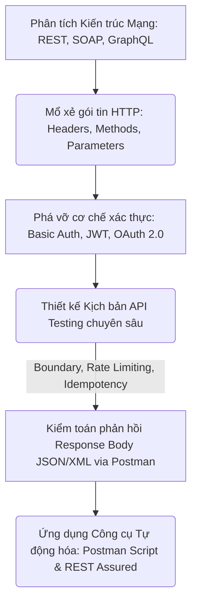

# 📁 07. API Testing

*Mục tiêu: Làm chủ quy trình kiểm thử tầng tích hợp hệ thống, xử lý thuần thục các giao thức truyền thông HTTP, giải mã cấu trúc Request/Response, bẻ gãy các cơ chế xác thực bảo mật và thiết kế kịch bản kiểm toán API chuyên sâu.*

## 📌 Mục lục nội bộ (Chặng 07)

- [ ] [**7.1. API Fundamentals**](./1_APIFundamentals.md)
  - [ ] [7.1.1. What is an API? Architectural Styles: REST, SOAP, GraphQL](./1_APIFundamentals.md#711-what-is-an-api-architectural-styles-rest-soap-graphql)
  - [ ] [7.1.2. RESTful Architecture Principles, Endpoints & Resources](./1_APIFundamentals.md#712-restful-architecture-principles-endpoints--resources)
- [ ] [**7.2. HTTP Protocol in API**](./2_HTTPProtocol.md)
  - [ ] [7.2.1. HTTP Methods: GET, POST, PUT, PATCH, DELETE, OPTIONS](./2_HTTPProtocol.md#721-http-methods-get-post-put-patch-delete-options)
  - [ ] [7.2.2. HTTP Status Codes Classification (2xx, 3xx, 4xx, 5xx)](./2_HTTPProtocol.md#722-http-status-codes-classification-2xx-3xx-4xx-5xx)
- [ ] [**7.3. Request & Response Anatomy**](./3_RequestResponse.md)
  - [ ] [7.3.1. Headers, Query Parameters, Path Parameters](./3_RequestResponse.md#731-headers-query-parameters-path-parameters)
  - [ ] [7.3.2. Request Body & Response Body parsing (JSON / XML)](./3_RequestResponse.md#732-request-body--response-body-parsing-json--xml)
  - [ ] [7.3.3. Advanced Data Extraction: JSONPath Syntax](./3_RequestResponse.md#733-advanced-data-extraction-jsonpath-syntax)
- [ ] [**7.4. API Authentication Mechanisms**](./4_Authentication.md)
  - [ ] [7.4.1. Basic Auth vs API Key](./4_Authentication.md#741-basic-auth-vs-api-key)
  - [ ] [7.4.2. Bearer Token & JWT (JSON Web Token)](./4_Authentication.md#742-bearer-token--jwt-json-web-token)
  - [ ] [7.4.3. OAuth 2.0 Flow & Session/Cookie Auth](./4_Authentication.md#743-oauth-20-flow--sessioncookie-auth)
- [ ] [**7.5. API Test Scenarios Designing**](./5_APITestingStrategy.md)
  - [ ] [7.5.1. Positive & Negative Testing, Boundary Testing](./5_APITestingStrategy.md#751-positive--negative-testing-boundary-testing)
  - [ ] [7.5.2. Pagination, Rate Limiting & Idempotency Testing](./5_APITestingStrategy.md#752-pagination-rate-limiting--idempotency-testing)
  - [ ] [7.5.3. Webhooks & Mocking APIs](./5_APITestingStrategy.md#753-webhooks--mocking-apis)
- [ ] [**7.6. API Testing Tooling**](./6_Tools.md)
  - [ ] [7.6.1. Postman: Collections, Environments, Test Scripts](./6_Tools.md#761-postman-collections-environments-test-scripts)
  - [ ] [7.6.2. Swagger / OpenAPI Documentation & Curl Command line](./6_Tools.md#762-swagger--openapi-documentation--curl-command-line)
  - [ ] [7.6.3. REST Assured Framework Overview](./6_Tools.md#763-rest-assured-framework-overview)

---

## 🗺️ Bản đồ Tiến trình Từ Nền tảng Giao tiếp đến Kiểm toán Tích hợp API

Sơ đồ đơn sắc dưới đây mô tả cách thức Tester bóc tách các trường phái kiến trúc mạng, mổ xẻ cấu trúc gói tin HTTP và áp dụng các kịch bản kiểm thử biên để bẻ gãy lớp bảo mật/logic của tầng trung gian:

---

## 📚 References
* [ISTQB® Certified Tester Foundation Level (CTFL) Syllabus v4.0](https://istqb.org) - Section 2.2.1: Component Integration Testing and Interface Communication.
* [ISO/IEC/IEEE 29119-4:2021 Standard](https://iso.org) - Part 4: Test Techniques for API Payload validation, Protocol Semantics and Web Services.
