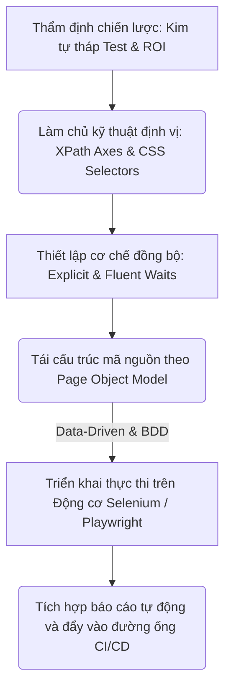
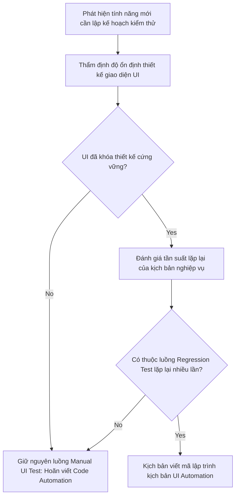
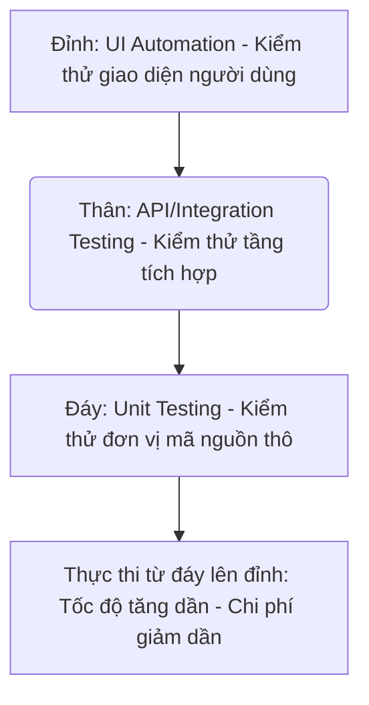

# 📁 08. UI Automation Testing

*Mục tiêu: Chuyển dịch tư duy từ kiểm thử thủ công sang tự động hóa lập trình giao diện người dùng, làm chủ các kỹ thuật định vị phần tử nâng cao, tối ưu hóa bộ mã kịch bản theo mô hình Page Object Model (POM) và vận hành các Framework công nghiệp hàng đầu như Selenium, Playwright.*

# **8.1. UI Automation Foundations**

## 📌 Mục lục nội bộ (Chặng 08)

- [ ] [**8.1. UI Automation Foundations**](./1_UIAutomationFoundations.md)
  - [ ] [8.1.1. Introduction to UI Automation: Why and When?](./1_UIAutomationFoundations.md#811-introduction-to-ui-automation-why-and-when)
  - [ ] [8.1.2. Automation Test Pyramid & ROI Analysis](./1_UIAutomationFoundations.md#812-automation-test-pyramid--roi-analysis)
- [ ] [**8.2. Element Locators Strategy**](./2_LocatorsStrategy.md)
- [ ] [**8.3. Core Automation Interactions**](./3_CoreActions.md)
- [ ] [**8.4. Automation Design Patterns**](./4_DesignPatterns.md)
- [ ] [**8.5. Tooling & Frameworks Execution**](./5_Frameworks.md)

---

## 🗺️ Bản đồ Tiến trình Từ Tư duy Chiến lược đến Vận hành Framework UI Automation

Sơ đồ đơn sắc dưới đây mô tả chính xác con đường phát triển năng lực của một kỹ sư Automation: Bắt đầu từ việc thẩm định chiến lược kim tự tháp, làm chủ kỹ thuật định vị phần tử động, thiết lập cơ chế đồng bộ hóa luồng chạy cho đến việc tối ưu cấu trúc mã nguồn qua mô hình kiến trúc POM:

---

# 8.1.1. Introduction to UI Automation: Why and When?

Trong hành trình phát triển của một dự án phần mềm, việc kiểm thử thủ công trên giao diện đồ họa (Manual UI Testing) luôn phải đối mặt với bài toán nghẽn cổ chai khi số lượng tính năng ngày càng phình to. **UI Automation Testing (Kiểm thử tự động hóa giao diện)** ra đời như một giải pháp công nghệ nhằm chuyển dịch hành vi thao tác của con người sang các kịch bản lập trình máy tính độc lập. Tuy nhiên, việc hiểu sai bản chất vận hành và áp dụng tự động hóa sai thời điểm là nguyên nhân hàng đầu dẫn đến việc tàn phá tài nguyên của doanh nghiệp.

> ⚠️ **Nguyên lý cạm bẫy giao diện biến động (UI Flakiness Trap Principle):** Tầng giao diện người dùng (UI Layer) là thành phần có biên độ thay đổi và biến động cao nhất trong toàn bộ cấu trúc hệ thống. Việc vội vã xây dựng kịch bản kiểm thử tự động trên một giao diện chưa ổn định về mặt thiết kế sẽ trực tiếp biến bộ mã test thành đống rác công nghệ, liên tục ném lỗi sai giả lập (Flaky Tests).

---

## 🛠️ Luồng Quyết định và Thẩm định Kích hoạt Kịch bản UI Automation (Decision Lifecycle)

Sơ đồ đơn sắc dưới đây mô tả chính xác cách thức hệ thống đánh giá độ chín muồi của tính năng trước khi quyết định viết mã tự động hóa:

---

## 📊 Ma trận Khai thác Chiến lược Kích hoạt Tự động hóa Giao diện (QA Mindset)

Dưới đây là ma trận phân rã chi tiết bộ quy chuẩn tư duy bóc tách giữa hai thái cực "Tại sao" và "Khi nào" để định hình chiến lược tự động hóa chính xác cho doanh nghiệp:

| Khía cạnh chiến lược | Phân rã cấu trúc vi mô | Trọng tâm kiểm thử (QA Focus) | Kịch bản lỗi điển hình thực chiến (Defect) |
| :--- | :--- | :--- | :--- |
| **1. WHY? (Tại sao cần UI Automation)** | *Khái niệm:* Giải phóng sức lao động của con người khỏi các tác vụ lặp đi lặp lại có tính chất nhàm chán và độ bao phủ rộng.  *Vai trò:* Tăng tốc độ phản hồi chất lượng (*Fast Feedback Loop*), cho phép chạy xuyên đêm không ngừng nghỉ, quét sạch các lỗi hồi quy (*Regression Bugs*) trước mỗi bản build. | **Tối ưu hóa thời gian thực thi.** Thiết kế bộ Test Suite cốt lõi (*Smoke/Sanity*) có khả năng tự động khởi chạy độc lập ngay khi lập trình viên vừa nộp mã nguồn mới. | **Lỗi lọt lưới hồi quy:** Một tính năng cũ (Ví dụ: Đăng nhập) bất ngờ bị hỏng sau khi lập trình viên cập nhật tính năng mới, nhưng không ai phát hiện ra do bộ test manual quá tải. |
| **2. WHEN TO? (Khi nào nên viết Code)** | *Điều kiện cần:* Giao diện người dùng đã trải qua giai đoạn thiết kế sơ khai, cấu trúc định danh phần tử (DOM HTML) đã đạt độ ổn định cao.  *Điều kiện đủ:* Tính năng thuộc luồng nghiệp vụ cốt lõi, mang lại giá trị cao cho người dùng cuối và có tần suất lặp lại lớn. | **Đánh giá độ chín của sản phẩm.** Chỉ can thiệp viết code khi tính năng đã pass luồng Manual Test ít nhất 1-2 lần để đảm bảo không còn lỗi logic thô. | Kịch bản test tự động bị gãy hàng loạt ngay tại bước nhập liệu đầu tiên do lập trình viên Backend đổi tên ID của ô nhập liệu mà không báo cho QA. |
| **3. WHEN NOT TO? (Khi nào cấm tự động hóa)** | *Kịch bản chặn:* Giao diện sản phẩm đang trong giai đoạn thử nghiệm (A/B Testing), thay đổi liên tục theo từng ngày hoặc tính năng chỉ dùng duy nhất 1 lần.  *Tư duy loại trừ:* Tránh xa các tính năng đòi hỏi sự thẩm định trải nghiệm thẩm mỹ của con người (UX/UI Look and Feel). | **Cô lập vùng rủi ro bảo trì.** Chặn đứng hành vi cắm đầu viết code cho các form biểu mẫu đang chờ sửa đổi cấu trúc từ phía bộ phận thiết kế Design. | Doanh nghiệp lãng phí hàng trăm giờ công của kỹ sư Automation để sửa code test cho một giao diện biểu mẫu bị đập đi xây lại sau 3 ngày phát hành. |

---

## 🧠 Chiến lược Thực chiến QA: Vạch rõ ranh giới giữa Manual và Automation

Một Chuyên gia Quản lý Chất lượng (QA Lead) thực chiến luôn sử dụng tư duy định lượng để phân bổ nguồn lực một cách thông minh, né tránh cạm bẫy "Tự động hóa mọi thứ" (Automate Everything Myth):

*   **Kịch bản ưu tiên Manual UI Testing:** Hệ thống đang xây dựng một màn hình Landing Page cho chiến dịch khuyến mãi Tết, thời gian chạy chiến dịch chỉ kéo dài 7 ngày và giao diện được tinh chỉnh màu sắc, banner liên tục theo giờ. QA sắc bén sẽ đưa ra quyết định: **Cấm viết Automation**. Toàn bộ luồng test phải chạy bằng tay (Manual) tập trung vào tính tương thích hiển thị trên nhiều dòng thiết bị di động khác nhau.
*   **Kịch bản ép buộc UI Automation Testing:** Hệ thống lõi của một trang thương mại điện tử chứa luồng thanh toán giỏ hàng qua 5 bước phức tạp: Chọn sản phẩm $\rightarrow$ Thêm vào giỏ $\rightarrow$ Nhập địa chỉ $\rightarrow$ Chọn mã giảm giá $\rightarrow$ Bấm thanh toán. Đây là luồng sống còn (Critical Path) của doanh nghiệp, bắt buộc phải chạy lặp đi lặp lại hàng trăm lần trên 4 trình duyệt khác nhau (Chrome, Firefox, Safari, Edge) trước khi đóng gói sản phẩm. QA Lead lập tức phê duyệt: **Bắt buộc viết UI Automation**, đóng gói thành bộ Regression Suite để kích hoạt tự động chạy trên đường ống CI/CD.

---

## 📚 References
* [ISTQB® Certified Tester Foundation Level (CTFL) Syllabus v4.0](https://istqb.org) - Section 6.1: Test Automation Foundations (Purpose, Benefits and Risks of Automation).
* [ISO/IEC/IEEE 29119-5:2016 Standard](https://iso.org) - Software Testing - Part 5: Test Automation Frameworks and Automation Selection Criteria.

# 8.1.2. Automation Test Pyramid & ROI Analysis

Để thiết lập một chiến lược tự động hóa thành công, kỹ sư QA không thể đầu tư tài nguyên một cách mù quáng vào tầng giao diện. Bạn phải làm chủ mô hình **Automation Test Pyramid (Kim tự tháp kiểm thử)** và công thức toán học tính toán **ROI (Return on Investment - Tỷ suất hoàn vốn đầu tư)**. Thành thạo bộ đôi công cụ chiến lược này giúp Tester định hình chính xác tỷ lệ phân bổ các lớp kiểm thử, chứng minh giá trị kinh tế của bộ mã test với doanh nghiệp và tối ưu hóa chi phí vận hành bảo trì dài hạn.

> ⚠️ **Nguyên lý đảo ngược kim tự tháp (Ice Cream Cone Anti-Pattern):** Việc tập trung quá nhiều tài nguyên để viết code automation ở tầng giao diện (UI) thay vì tầng Unit và API sẽ tạo ra mô hình "Kem ốc quế" lật ngược rủi ro. Bộ test suite dạng này sẽ chạy cực kỳ chậm, tốn kém chi phí hạ tầng máy chủ và sụp đổ hoàn toàn mỗi khi Frontend thay đổi nhỏ về thiết kế.

---

## 🛠️ Phân tầng Kiến trúc Kim tự tháp Kiểm thử Tiêu chuẩn (Test Pyramid Lifecycle)

Sơ đồ đơn sắc dưới đây mô tả chính xác 3 tầng cấu trúc của Kim tự tháp Mike Cohn, thể hiện rõ xu hướng tăng dần về tốc độ thực thi nhưng giảm dần về chi phí vận hành từ đáy lên đỉnh:

---

## 📊 Ma trận Phân rã Kim tự tháp Kiểm thử và Công thức Tính toán ROI (QA Mindset)

Dưới đây là ma trận hệ thống hóa các tầng kiểm thử và mô hình toán học định lượng giá trị kinh tế của dự án Automation, bóc tách theo quy chuẩn vi mô thực chiến:

| Thành phần chiến lược | Bản chất vận hành ngầm | Trọng tâm kiểm thử (QA Focus) | Kịch bản lỗi điển hình thực chiến (Defect) |
| :--- | :--- | :--- | :--- |
| **1. Unit Test Layer (Tầng Đáy thô)** | Chiếm số lượng lớn nhất (60-70%). Kiểm tra trực tiếp các hàm logic nhỏ lẻ của code do Developer tự viết và chạy độc lập trên RAM. | **Quét sạch lỗi cú pháp và thuật toán.** Xác thực các hàm toán học xử lý đúng giá trị biên trước khi đóng gói thành sản phẩm. | Hàm tính tiền thuế trả về kết quả sai lệch do lập trình viên viết sai dấu cộng/trừ trong thuật toán của mã nguồn thô. |
| **2. API Test Layer (Tầng Thân tích hợp)** | Chiếm số lượng vừa phải (20-30%). Kiểm tra logic giao tiếp luân chuyển gói tin dữ liệu không qua màn hình (Đã học ở Chặng 7). | **Xác thực logic nghiệp vụ.** Thử nghiệm độ bền chốt chặn xác thực, phân trang, và tính toán tài chính liên tầng. | Gói tin phản hồi JSON trả về mã `200 OK` nhưng bị khuyết thiếu trường thông tin bắt buộc do Backend map sai biến. |
| **3. UI Test Layer (Tầng Đỉnh giao diện)** | Chiếm số lượng ít nhất (5-10%). Giả lập hành vi cuộn chuột, click, nhập liệu của con người trên môi trường trình duyệt thật. | **Xác thực luồng e2e cốt lõi.** Chỉ tập trung bao phủ các kịch bản sống còn của doanh nghiệp, chấp nhận tốc độ chạy chậm. | Frontend render sai lệch vị trí nút bấm thanh toán trên thiết bị di động khiến người dùng không thể hoàn tất đơn hàng. |
| **4. ROI Formula (Phân tích Hoàn vốn)** | Mô hình toán học chứng minh lợi ích kinh tế: `ROI = (Chi phí Manual - Chi phí Auto) / Chi phí Auto`. | **Định lượng giá trị tài chính.** Đo lường tổng số giờ công tiết kiệm được của QA khi chạy bộ test auto lặp lại qua nhiều tháng. | Dự án đổ vỡ tài chính do QA Lead tính toán sai thời gian bảo trì code test, khiến chi phí viết auto vượt ngưỡng ngân sách manual. |

---

## 🧠 Chiến lược Thực chiến QA: Ứng dụng Công thức Toán học chứng minh giá trị ROI

Hãy tưởng tượng bạn đang quản lý một bộ kịch bản kiểm thử hồi quy (Regression Suite) gồm 100 Test Cases cho luồng thanh toán đơn hàng. Nếu chạy bằng tay (Manual), một Tester mất 4 giờ để hoàn thành trên 1 trình duyệt. Dự án phát hành sản phẩm 20 lần trong một năm, nhân lên trên 4 trình duyệt chính (Chrome, Firefox, Safari, Edge).

Tư duy phản biện của một Chuyên gia QA để bóc tách toán học, tính toán ROI và lập kế hoạch chiến lược:

1.  **Tính toán chi phí kiểm thử thủ công (Manual Cost Calculation):** 
    $$\text{Tổng giờ Manual} = 4 \text{ giờ} \times 20 \text{ lần phát hành} \times 4 \text{ trình duyệt} = 320 \text{ giờ công/năm}.$$
2.  **Tính toán chi phí đầu tư Tự động hóa (Automation Cost Calculation):** Bạn mất 40 giờ công ban đầu để xây dựng Framework Playwright tự động hóa hoàn toàn 100 ca test này. Mỗi lần chạy, bộ test tự động chỉ mất 10 phút để quét qua 4 trình duyệt song song (Không tốn giờ công con người). Tuy nhiên, bạn cần dự phòng 20 giờ công một năm để cập nhật, sửa đổi code test khi giao diện thay đổi (Maintenance Cost).
    $$\text{Tổng giờ Auto năm đầu} = 40 \text{ giờ viết code} + 20 \text{ giờ bảo trì} = 60 \text{ giờ công/năm}.$$
3.  **Phân tích điểm hòa vốn và ra quyết định:** 
    $$\text{ROI} = \frac{320 \text{ giờ} - 60 \text{ giờ}}{60 \text{ giờ}} \approx 4.33 \text{ (Tức là hiệu quả kinh tế tăng 433\%)}.$$
    Kết quả toán học này chứng minh: Dự án sẽ đạt điểm hòa vốn ngay từ tháng thứ 3 và bắt đầu sinh lời sức lao động cực lớn cho doanh nghiệp ở các tháng về sau. QA Lead lập tiếp phê duyệt dự án UI Automation.

---

## 📚 References
* [ISTQB® Certified Tester Foundation Level (CTFL) Syllabus v4.0](https://istqb.org) - Section 6.1.1: Cost-Benefit Analysis and ROI of Test Automation (The Test Pyramid Approach).
* [Mike Cohn (2009) - Succeeding with Agile: Software Development Using Scrum](https://mountaingoatsoftware.com) - The Concept of the Agile Test Automation Pyramid.

