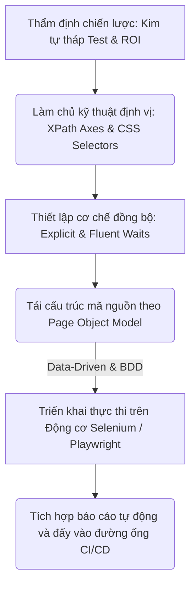
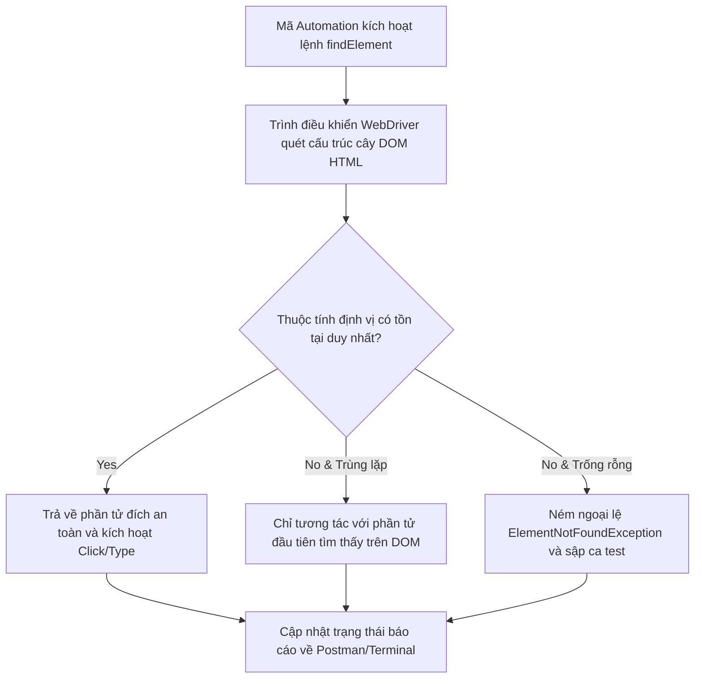
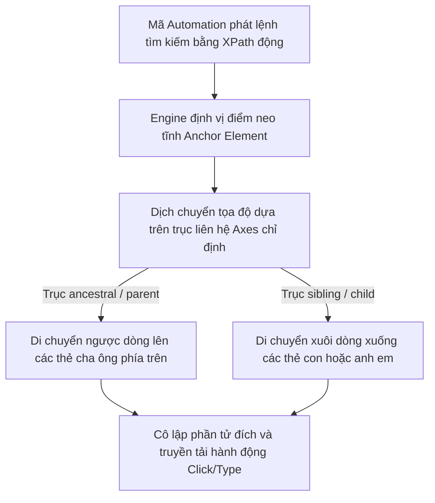
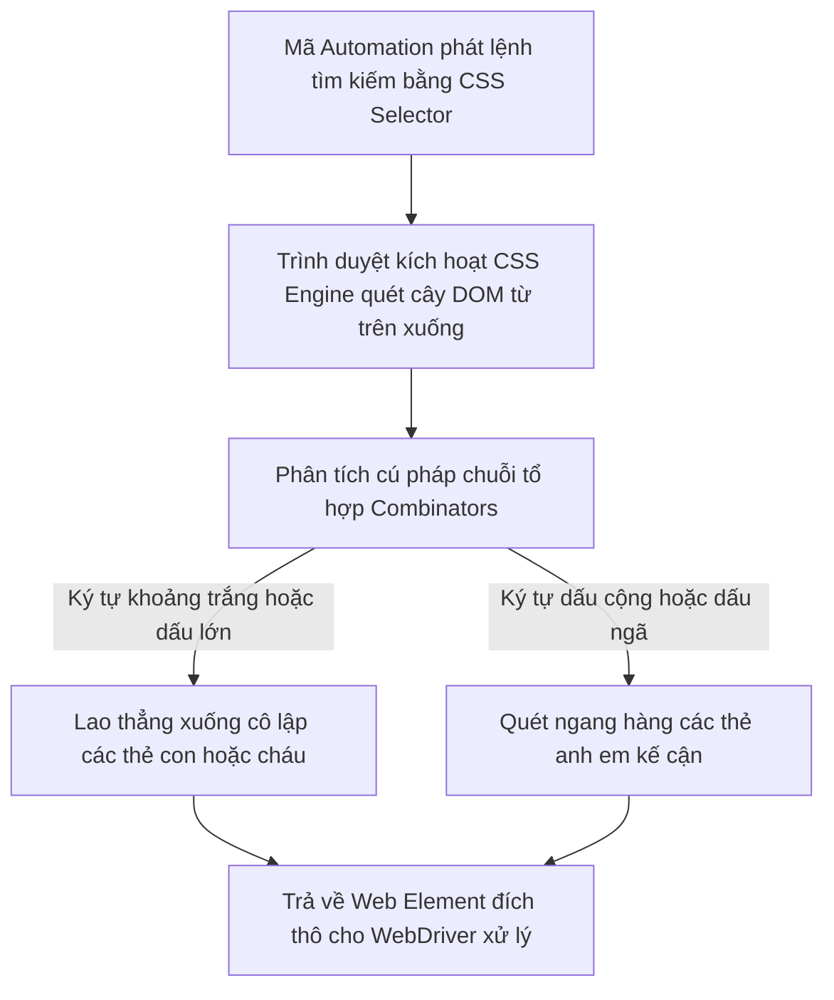

# 📁 08. UI Automation Testing

*Mục tiêu: Chuyển dịch tư duy từ kiểm thử thủ công sang tự động hóa lập trình giao diện người dùng, làm chủ các kỹ thuật định vị phần tử nâng cao, tối ưu hóa bộ mã kịch bản theo mô hình Page Object Model (POM) và vận hành các Framework công nghiệp hàng đầu như Selenium, Playwright.*

# **8.2. Element Locators Strategy**

## 📌 Mục lục nội bộ (Chặng 08)

- [ ] [**8.1. UI Automation Foundations**](./1_UIAutomationFoundations.md)
- [ ] [**8.2. Element Locators Strategy**](./2_LocatorsStrategy.md)
  - [ ] [8.2.1. Standard Locators: ID, Name, ClassName, LinkText](./2_LocatorsStrategy.md#821-standard-locators-id-name-classname-linktext)
  - [ ] [8.2.2. Advanced Locators: XPath Axes & Dynamic Selectors](./2_LocatorsStrategy.md#822-advanced-locators-xpath-axes--dynamic-selectors)
  - [ ] [8.2.3. Advanced Locators: CSS Selectors Combinators](./2_LocatorsStrategy.md#823-advanced-locators-css-selectors-combinators)
- [ ] [**8.3. Core Automation Interactions**](./3_CoreActions.md)
- [ ] [**8.4. Automation Design Patterns**](./4_DesignPatterns.md)
- [ ] [**8.5. Tooling & Frameworks Execution**](./5_Frameworks.md)

---

## 🗺️ Bản đồ Tiến trình Từ Tư duy Chiến lược đến Vận hành Framework UI Automation

Sơ đồ đơn sắc dưới đây mô tả chính xác con đường phát triển năng lực của một kỹ sư Automation: Bắt đầu từ việc thẩm định chiến lược kim tự tháp, làm chủ kỹ thuật định vị phần tử động, thiết lập cơ chế đồng bộ hóa luồng chạy cho đến việc tối ưu cấu trúc mã nguồn qua mô hình kiến trúc POM:



---

# 8.2.1. Standard Locators: ID, Name, ClassName, LinkText

Trong kiểm thử tự động hóa giao diện, việc tương tác với các phần tử Web (Web Elements) bắt buộc phải dựa trên khả năng nhận diện cấu trúc cây mã nguồn DOM (Document Object Model). **Standard Locators (Trình định vị tiêu chuẩn)** bao gồm bốn thuộc tính cơ bản: **ID**, **Name**, **ClassName**, và **LinkText**. Làm chủ kỹ thuật khai thác các thuộc tính tĩnh này là bước đi đầu tiên giúp kịch bản Automation (Selenium / Playwright) định vị chính xác ô nhập liệu, nút bấm, chặn đứng các lỗi gãy kịch bản do mất dấu phần tử (*Element Not Found Exception*).

> ⚠️ **Nguyên lý neo giữ phần tử độc bản (Element Uniqueness Principle):** Một kịch bản Automation bền vững luôn ưu tiên neo giữ vào các thuộc tính có tính chất độc bản (Duy nhất) trên toàn trang Web. Việc sử dụng các locator trùng lặp hoặc tự động thay đổi sau mỗi lần tải trang (Dynamic Attributes) sẽ trực tiếp làm sai lệch hành vi của robot, khiến kịch bản bấm nhầm vào phần tử lạ.

---

## 🛠️ Luồng Quét và Định vị Phần tử Web của Động cơ Automation (Element Lookup Lifecycle)

Sơ đồ đơn sắc dưới đây mô tả chính xác chu trình trình duyệt tiếp nhận câu lệnh tìm kiếm, quét qua cấu trúc cây DOM HTML để cô lập phần tử đích trước khi truyền lực tương tác:



---

## 📊 Ma trận Khai thác 4 Bộ Định vị Tiêu chuẩn trên DOM HTML (QA Mindset)

Dưới đây là ma trận phân rã chi tiết 4 thuộc tính định vị cơ bản, bóc tách theo quy chuẩn vi mô thực chiến giúp Tester định hình kịch bản chọn Locator thông minh:

| Bộ định vị tiêu chuẩn | Bản chất cấu trúc trong mã HTML | Trọng tâm kiểm thử (QA Focus) | Kịch bản lỗi điển hình thực chiến (Defect) |
| :--- | :--- | :--- | :--- |
| **1. ID** | Thuộc tính định danh duy nhất của một thẻ HTML (Ví dụ: `id="username"`). Lõi trình duyệt quét ID với tốc độ mili-giây. | **Lựa chọn ưu tiên số 1.** Kiểm tra tính độc bản của ID trên toàn bộ trang Web. Cấm dùng ID nếu nó tự động sinh chuỗi ngẫu nhiên. | **Lỗi gãy kịch bản:** Lập trình viên Backend dùng framework tự động sinh ID biến đổi liên tục sau mỗi lần F5 (`id="btn-3214"`, `id="btn-9981"`), bẻ gãy mã test. |
| **2. NAME** | Thuộc tính định danh thường dùng cho các ô nhập liệu nằm trong Form để truyền payload (Ví dụ: `name="email"`). | **Giải pháp thay thế an toàn.** Sử dụng khi thẻ HTML không được cấu hình thuộc tính ID nhưng có trường `name` rành mạch. | **Lỗi bấm nhầm đối tượng:** Trong một Form xuất hiện 2 ô nhập liệu có cùng `name="status"` khiến robot điền nhầm dữ liệu vào ô không mong muốn. |
| **3. CLASS NAME** | Thuộc tính định nghĩa phong cách đồ họa CSS của thẻ (Ví dụ: `class="btn btn-primary login-button"`). | **Thận trọng kiểm tra tính trùng lặp.** Một tên Class thường được dùng chung cho hàng loạt nút bấm giống nhau trên giao diện. | Kịch bản Automation bị fail hoặc nhận sai đối tượng do ClassName chứa chuỗi rỗng hoặc ClassName bị thay đổi khi đổi giao diện đồ họa. |
| **4. LINK TEXT** | Định vị các thẻ liên kết điều hướng (`<a>`) dựa trên chuỗi văn bản thô hiển thị hiển thị ra màn hình (Ví dụ: `<a>Đăng ký ngay</a>`). | **Xác thực văn bản hiển thị.** Sử dụng để test các luồng chuyển hướng trang, bắt buộc chuỗi text phải khớp khít 100% từng dấu cách. | Tính năng đổi ngôn ngữ hệ thống sang Tiếng Anh khiến ca test tự động bị sập hàng loạt do robot không tìm thấy chuỗi text `"Đăng ký ngay"`. |

---

## 🧠 Chiến lược Thực chiến QA: Phân tích cấu trúc DOM và Bẫy Locator lỗi

Hãy tưởng tượng bạn đang viết script tự động hóa luồng Đăng nhập dựa trên đoạn mã nguồn HTML thô bóc tách từ trình duyệt như sau:
```html
<form id="login-form">
    <input type="text" id="user_input" name="account" class="input-field field-active" />
    <input type="password" name="account" class="input-field" />
    <a href="/forgot">Quên mật khẩu?</a>
</form>
```

Tư duy phản biện của một kỹ sư Automation sắc bén để rà soát mã nguồn, né bẫy Locator lỗi và thiết kế mã neo giữ an toàn:

1.  **Bóc tách chiến lược định vị ô tài khoản:** Ô nhập tài khoản có thuộc tính `id="user_input"`. Lập tức viết mã khóa chặt mục tiêu: `By.id("user_input")`. Đây là locator hoàn hảo, miễn nhiễm với mọi sự thay đổi vị trí render của Frontend.
2.  **Vạch lá tìm bẫy ô mật khẩu:** Ô nhập mật khẩu **không có thuộc tính ID**, thuộc tính `name="account"` thì lại bị trùng hoàn toàn với ô tài khoản phía trên. Nếu bạn lười biếng viết `By.name("account")`, động cơ WebDriver quét từ trên xuống sẽ luôn chọn trúng ô tài khoản, khiến kịch bản không thể điền mật khẩu. **Giải pháp:** Yêu cầu Developer bổ sung thuộc tính định danh riêng cho QA (`data-testid="password-input"`) hoặc chuyển sang dùng bộ định vị nâng cao XPath/CSS Selector ở bài học tiếp theo.
3.  **Định vị thẻ điều hướng:** Sử dụng `By.linkText("Quên mật khẩu?")` để thực hiện ca test nhấp chuột chuyển hướng sang trang khôi phục tài khoản, xác thực tính đúng đắn của chuỗi văn bản nghiệp vụ.

---

## 📚 References
* [ISTQB® Certified Tester Foundation Level (CTFL) Syllabus v4.0](https://istqb.org) - Section 6.2.1: Test Automation Engineering and Software Component Interface Discovery.
* [W3C Web Recommendation - Document Object Model (DOM) Level 3 Specifications](https://w3.org) - Global Standards for HTML Element Attributes and Identifier Lookups.

# 8.2.2. Advanced Locators: XPath Axes & Dynamic Selectors

Khi đối mặt với các hệ thống Web hiện đại sử dụng framework động (React, Angular, Vue), cấu trúc DOM HTML sẽ liên tục biến đổi và các thuộc tính tiêu chuẩn (ID, Name) thường bị xóa bỏ hoặc tự động sinh ngẫu nhiên sau mỗi lần biên dịch. **XPath (XML Path Language)** kết hợp kỹ thuật điều hướng trục **XPath Axes** và hàm động **Dynamic Selectors** chính là vũ khí tối thượng giúp Tester xây dựng tư duy neo giữ tọa độ logic, bóc tách và định vị chính xác các phần tử phức tạp dựa trên mối quan hệ gia phả (Cha, con, anh em) trên cây cấu trúc DOM.

> ⚠️ **Nguyên lý neo giữ tọa độ logic (Logical Co-ordinate Anchoring Principle):** Tuyệt đối cấm sử dụng cấu trúc XPath tuyệt đối (Absolute XPath - Ví dụ: `/html/body/div[1]/div[2]/form/input`) vì nó sẽ gãy ngay lập tức khi Frontend chèn thêm một thẻ `div` nhỏ. Kỹ sư Automation bắt buộc phải chọn một phần tử gốc có tính chất tĩnh tuyệt đối để làm mốc neo, sau đó dùng các trục quan hệ toán học để bắc cầu sang phần tử động cần tương tác.

---

## 🛠️ Luồng Xử lý Điều hướng Trục Hệ thống cây DOM của Động cơ XPath (XPath Axes Navigation Lifecycle)

Sơ đồ đơn sắc dưới đây mô tả chính xác cách thức trình cơ chế quét của XPath Engine di chuyển ngược dòng hoặc xuôi dòng trên cây DOM để tìm kiếm phần tử mục tiêu dựa trên điểm neo tĩnh:



---

## 📊 Ma trận Khai thác Kỹ thuật XPath Động và Điều hướng Trục (QA Mindset)

Dưới đây là ma trận phân rã chi tiết các hàm động và trục quan hệ nâng cao của XPath, bóc tách theo quy chuẩn vi mô thực chiến giúp Tester thiết kế bộ định vị bất khả chiến bại:

| Phương thức XPath | Cú pháp hàm / Từ khóa trục | Bản chất vận hành ngầm (QA Focus) | Kịch bản lỗi điển hình thực chiến (Defect) |
| :--- | :--- | :--- | :--- |
| **1. Contains()** | `//*[contains(@attr, 'chuỗi')]` | Tìm kiếm phần tử chứa một đoạn ký tự cố định. Vô cùng hữu hiệu để xử lý các ID tự động sinh chuỗi đuôi (Ví dụ: `id="btn-login-9871"`). | Robot báo lỗi không click được nút do lập trình viên thay đổi chuỗi số ngẫu nhiên ở đuôi thuộc tính sau khi deploy bản build mới. |
| **2. Starts-with()** | `//*[starts-with(@attr, 'chuỗi')]` | Tìm kiếm phần tử có thuộc tính bắt đầu bằng một chuỗi văn bản chỉ định, bỏ qua biến động ở phía sau. | Kịch bản bị sập do dùng locator tĩnh quét trúng một thẻ HTML vừa được cập nhật thêm tiền tố động từ thư viện UI Framework. |
| **3. Text()** | `//tag[text()='Văn bản thô']` | Định vị trực tiếp thẻ dựa trên chuỗi văn bản hiển thị tuyệt đối, độc lập với mọi thuộc tính mã hóa ngầm. | Lỗi dịch sai lệch văn bản trên nút bấm khiến bộ lọc tự động dùng hàm `text()` bị mất dấu mục tiêu khi đổi ngôn ngữ. |
| **4. Following-sibling** | `//mốc/following-sibling::tag` | Di chuyển xuôi dòng để tìm kiếm các thẻ anh em nằm cùng cấp nhưng ở phía sau phần tử mốc neo tĩnh. | **Lỗi bảng dữ liệu:** Dữ liệu hàng ngang bị xô lệch vị trí do Backend render thiếu cột, khiến locator thông thường nhận sai dòng. |
| **5. Preceding-sibling** | `//mốc/preceding-sibling::tag` | Di chuyển ngược dòng để định vị các thẻ anh em nằm cùng cấp nhưng ở phía trước phần tử mốc neo tĩnh. | Luồng test tự động tích chọn nhầm vào ô Checkbox của dòng kế cận do cấu trúc bảng biến động không có ID độc bản. |
| **6. Ancestor / Parent** | `//mốc/ancestor::tag` | Di chuyển ngược lên tầng trên để tóm chặt thẻ cha hoặc các thẻ tổ tiên đang bao bọc lấy phần tử mốc neo. | Mã test bị crash khi cố gắng tương tác với một Form ẩn do robot không thể định vị được khung bao đóng Container tối cao. |

---

## 🧠 Chiến lược Thực chiến QA: Chinh phục Bảng Dữ liệu Động (Dynamic Web Table)

Hãy tưởng tượng bạn đang kiểm thử một bảng quản lý người dùng có cấu trúc động biến đổi liên tục (Hàng và cột thay đổi tùy theo dữ liệu DB). Nhiệm vụ của bạn là: *Tìm đúng dòng chứa email `"audit@qa.global"` và bấm nút "Xóa" nằm ở cuối dòng đó*. Mã nguồn HTML bóc tách thô tại dòng đó như sau:

```html
<tr>
    <td>User 01</td>
    <td>audit@qa.global</td>
    <td><span class="badge-active">Hoạt động</span></td>
    <td>
        <button class="btn-edit">Sửa</button>
        <button class="btn-delete">Xóa</button>
    </td>
</tr>
```

Tư duy phản hệ của một kỹ sư Automation chuyên nghiệp để bẻ gãy bẫy giao diện, xây dựng chuỗi XPath Axes bất khả chiến bại:

1.  **Phát hiện bẫy nút bấm:** Nút "Xóa" chỉ có thuộc tính chung chung `class="btn-delete"`. Trên bảng có 100 dòng thì có 100 nút giống hệt nhau. Nếu viết `By.className("btn-delete")`, WebDriver sẽ luôn bấm vào nút Xóa của dòng đầu tiên (Gây xóa nhầm dữ liệu người dùng khác).
2.  **Thiết lập điểm mốc neo tĩnh:** Chuỗi email `"audit@qa.global"` là duy nhất và không bao giờ thay đổi. Ta dùng hàm `text()` để khóa mục tiêu làm điểm neo: `//td[text()='audit@qa.global']`.
3.  **Bắc cầu điều hướng trục liên hệ:** 
    *   Từ ô email, ta nhảy ngược lên thẻ cha bao bọc toàn bộ dòng `<tr>` bằng trục `parent` hoặc `ancestor`: `//td[text()='audit@qa.global']/parent::tr`.
    *   Từ dòng `<tr>` tối cao này, ta lao thẳng xuống tìm nút Xóa nằm ở các thẻ con phía dưới: `//td[text()='audit@qa.global']/parent::tr//button[text()='Xóa']`.
    *   Hoặc tối ưu hơn bằng cách dùng trục anh em cùng cấp trỏ trực tiếp từ ô chứa email sang ô chứa nút bấm: `//td[text()='audit@qa.global']/following-sibling::td/button[text()='Xóa']`.
    Chuỗi XPath động này chính là giải pháp hoàn hảo không tì vết, giúp robot luôn tìm đúng nút Xóa của chính chủ email bất kể dòng dữ liệu đó bị nhảy lên đầu hay tụt xuống cuối bảng.

---

## 📚 References
* [ISTQB® Certified Tester Foundation Level (CTFL) Syllabus v4.0](https://istqb.org) - Section 6.2.1: Test Automation Engineering and Advanced Core Dynamic Interface Discovery.
* [W3C XML Path Language (XPath) 2.0 Formal Specifications](https://w3.org) - Global Technical Standards for Relational Location Paths, Expressions and Structural Axes Looking.

# 8.2.3. Advanced Locators: CSS Selectors Combinators

Trong kiểm thử tự động hóa giao diện, bên cạnh vũ khí điều hướng của XPath, **CSS Selectors (Trình chọn phong cách đồ họa)** phối hợp với bộ ký tự tổ hợp **Combinators** là giải pháp tối ưu được các chuyên gia Automation ưu tiên sử dụng. Động cơ của các trình duyệt Web hiện đại (Chrome, Firefox, Safari) được tối ưu hóa đặc biệt để đọc và phân tích cú pháp CSS với tốc độ vượt trội so với XPath. Làm chủ ma trận tổ hợp CSS giúp Tester viết các chuỗi định vị tinh gọn, tăng tốc độ quét phần tử và bọc lót an toàn cho bộ ca test khi cây DOM phình to.

> ⚠️ **Nguyên lý tối ưu hóa tốc độ và độ tinh gọn (Execution Speed & Syntactic Conciseness Principle):** Chuỗi định vị bằng CSS Selectors luôn mang lại hiệu năng thực thi cao hơn và cú pháp ngắn gọn hơn so với XPath. Tuy nhiên, CSS Selector có một điểm mù chí tử: Không có khả năng đi ngược dòng lên thẻ cha (No Parent Node Navigation) và không thể lọc phần tử dựa trên văn bản hiển thị thô (No Text-based Filtering).

---

## 🛠️ Luồng Quét và Khai thác Thuộc tính Đồ họa của Động cơ CSS (CSS Selector Parsing Lifecycle)

Sơ đồ đơn sắc dưới đây mô tả chính xác con đường duyệt cây DOM cực tốc của CSS Engine, bám sát các thuộc tính thẻ và bộ tổ hợp quan hệ để khóa chặt phần tử:



---

## 📊 Ma trận Phân rã Ma trận Kỹ thuật Bộ Tổ hợp CSS Selectors (QA Mindset)

Dưới đây là ma trận hệ thống hóa 4 ký tự tổ hợp cốt lõi và các lớp giả lập (*Pseudo-classes*) nâng cao của CSS, bóc tách theo quy chuẩn vi mô thực chiến giúp Tester thiết kế mã định vị tối giản:

| Ký tự tổ hợp CSS | Tên gọi kỹ thuật lõi | Bản chất mối quan hệ trên DOM (QA Focus) | Ví dụ cú pháp thực chiến và kịch bản áp dụng |
| :--- | :--- | :--- | :--- |
| **1. ` ` (Khoảng trắng)** | Descendant Selector | Tìm kiếm tất cả các thẻ con, cháu, chắt... nằm ở bất kỳ phân cấp nào phía dưới thẻ cha (Quét sâu toàn diện). | `form#login-form input`<br>Tóm gọn toàn bộ các ô nhập liệu nằm sâu bên trong khung Form đăng nhập. |
| **2. `>`** | Child Selector | Chỉ tìm kiếm các thẻ con trực tiếp (Cấp liền kề duy nhất) nằm ngay dưới thẻ cha, bỏ qua cấp cháu chắt. | `div.container > p`<br>Cô lập chính xác các đoạn văn là con trực tiếp của thẻ div, chặn lỗi nhận sai thẻ bên ngoài. |
| **3. `+`** | Adjacent Sibling Selector | Định vị một thẻ anh em nằm cùng cấp, ở ngay phía sau và sát sườn với phần tử mốc neo tĩnh. | `label[for='email'] + input`<br>Khóa chặt ô nhập liệu nằm ngay kế sau nhãn dán định danh của trường Email. |
| **4. `~`** | General Sibling Selector | Định vị tất cả các thẻ anh em nằm cùng cấp ở phía sau phần tử mốc neo tĩnh, không nhất thiết phải sát sườn. | `h2 ~ div`<br>Quét toàn bộ các khối nội dung được sinh ra sau tiêu đề H2 để phục vụ kiểm toán số lượng thực thể. |
| **5. `:nth-child(n)`** | Pseudo-class Selector | Định vị phần tử dựa trên chỉ số thứ tự chính xác của nó trong danh sách các thẻ con cùng cấp. | `ul#menu > li:nth-child(3)`<br>**Kiểm thử menu điều hướng.** Click chính xác vào phần tử vị trí số 3 trên thanh Menu. |
| **6. `[attr*='value']`** | Substring Wildcard | Tìm kiếm phần tử có thuộc tính chứa một đoạn ký tự cố định (Tương đương hàm `contains` của XPath). | `input[id*='btn-submit']`<br>Xử lý triệt để bẫy ID động có chuỗi ngẫu nhiên biến đổi sau mỗi lần tải trang. |

---

## 🧠 Chiến lược Thực chiến QA: Tối ưu bộ kịch bản từ XPath sang CSS Selector

Một kỹ sư Automation sắc bén luôn biết cách cân nhắc và chuyển đổi linh hoạt giữa XPath và CSS Selector để ép cấu trúc mã nguồn đạt độ tối giản, tăng tính bảo trì và đẩy tốc độ thực thi kịch bản lên mức tối đa.

Hãy đối chiếu kịch bản xử lý biểu mẫu đăng ký thành viên:

*   **Cú pháp XPath lóng ngóng dài dòng:**
    ```xpath
    //form[@id='registration-form']//div[@class='input-group']//input[contains(@class,'error-field')]
    ```
*   **Chuyển đổi sang CSS Selector tinh gọn không tì vết:**
    ```css
    form#registration-form div.input-group input[class*='error-field']
    ```
    Chuỗi CSS Selector loại bỏ hoàn toàn các ký tự xuyệt chéo (`//`) và dấu `@` rườm rà, giúp lõi trình duyệt phân tích cú pháp nhanh hơn gấp 2-3 lần.
*   **Tư duy phản biện chốt chặn ranh giới (QA Watchout):** Khi bạn cần viết kịch bản kiểm tra: *Bấm vào nút "Xác nhận" dựa trên dòng chữ hiển thị*. Bạn sực nhớ ra CSS Selector không hỗ trợ hàm tìm kiếm theo văn bản thô (Không có hàm `text()`). Lập tức quay xe, kích hoạt vũ khí XPath để khóa mục tiêu: `//button[text()='Xác nhận']`. Việc thấu hiểu điểm mạnh và điểm mù của từng loại locator chính là ranh giới phân định giữa một Tester phổ thông và một Chuyên gia Automation thực chiến.

---

## 📚 References
* [ISTQB® Certified Tester Foundation Level (CTFL) Syllabus v4.0](https://istqb.org) - Section 6.2.1: Test Automation Engineering and Software Component Interface Discovery (Efficient Locator Strategy).
* [W3C Cascading Style Sheets (CSS) Level 3 Selectors Specifications](https://w3.org) - Global Core Technical Standards for Pattern Matching, Combinators and Structural Pseudo-classes.
