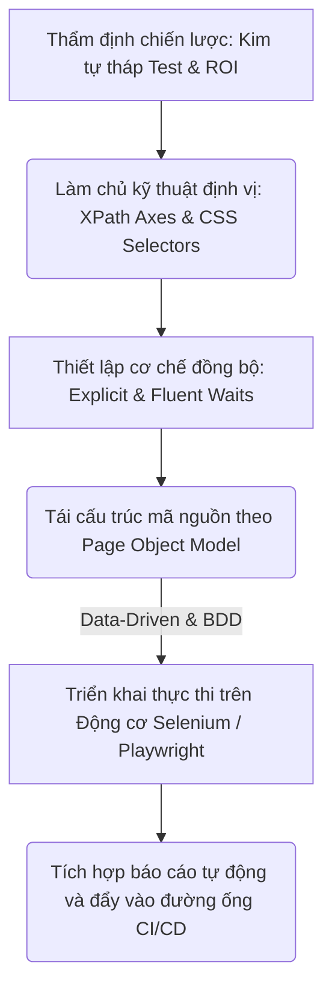
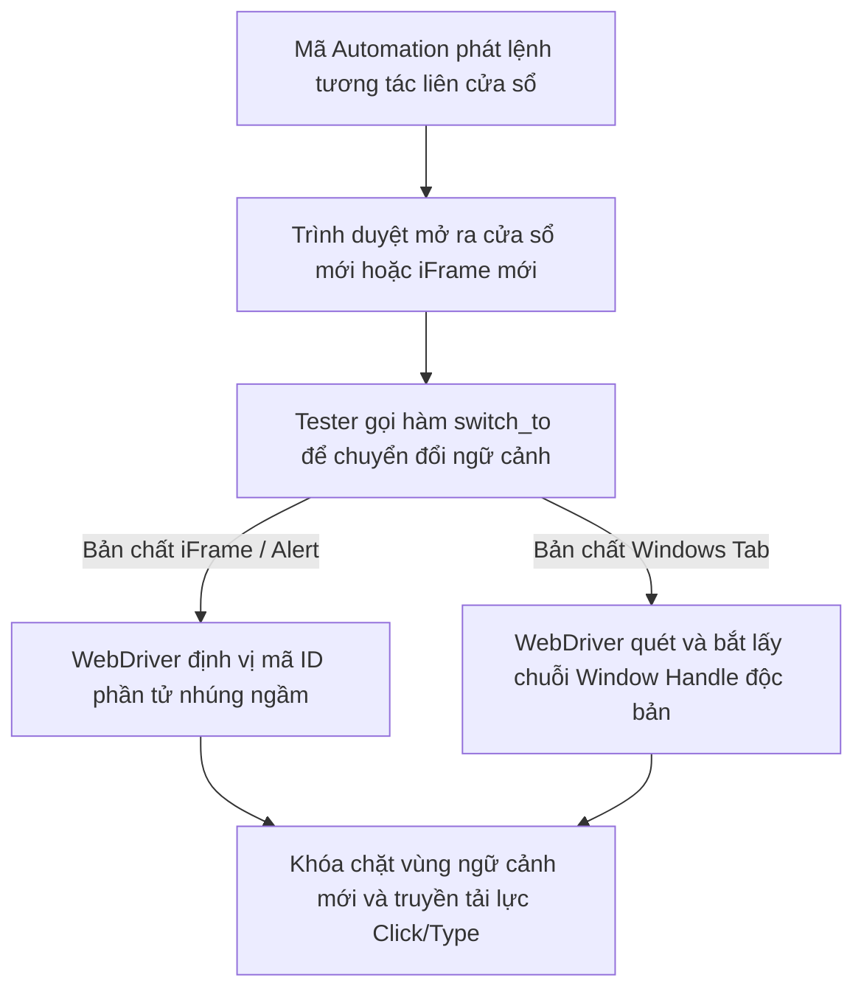
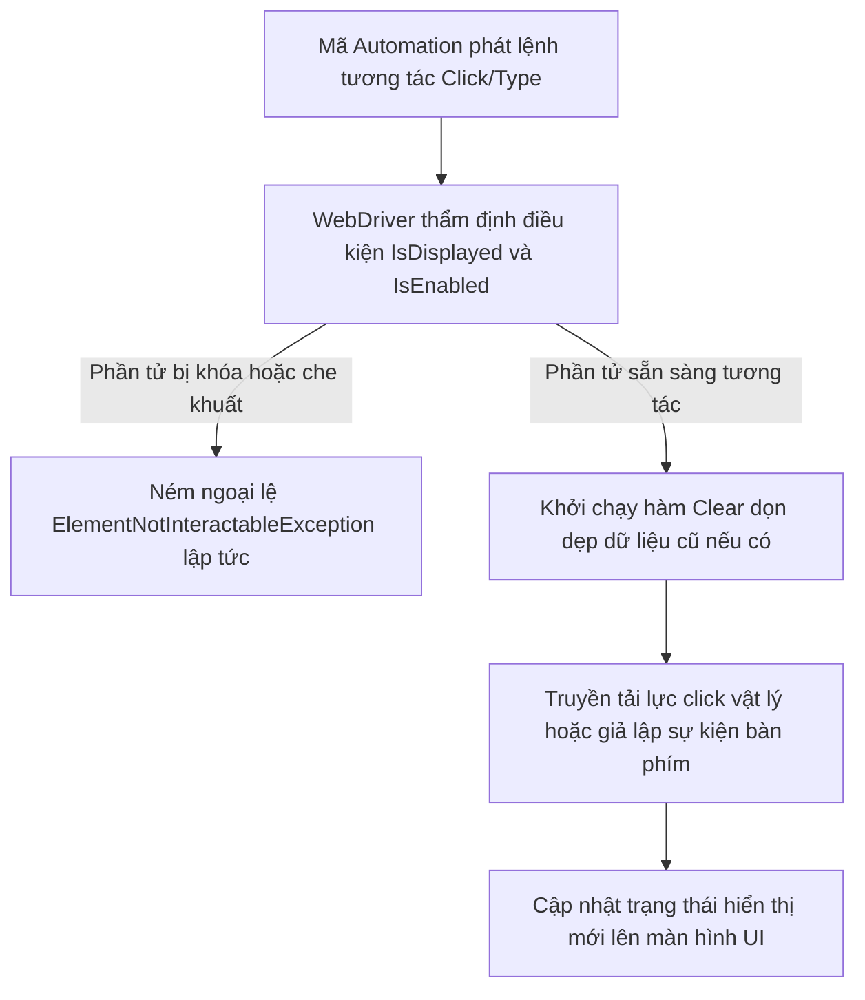
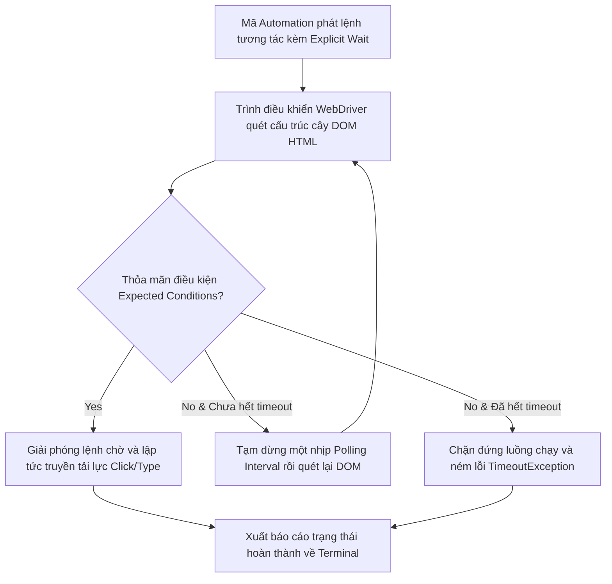

# 📁 08. UI Automation Testing

*Mục tiêu: Chuyển dịch tư duy từ kiểm thử thủ công sang tự động hóa lập trình giao diện người dùng, làm chủ các kỹ thuật định vị phần tử nâng cao, tối ưu hóa bộ mã kịch bản theo mô hình Page Object Model (POM) và vận hành các Framework công nghiệp hàng đầu như Selenium, Playwright.*

# **8.3. Core Automation Interactions**

## 📌 Mục lục nội bộ (Chặng 08)

- [ ] [**8.1. UI Automation Foundations**](./1_UIAutomationFoundations.md)
- [ ] [**8.2. Element Locators Strategy**](./2_LocatorsStrategy.md)
- [ ] [**8.3. Core Automation Interactions**](./3_CoreActions.md)
  - [ ] [8.3.1. Browser Actions: Navigation, Windows, Alerts, Frames](./3_CoreActions.md#831-browser-actions-navigation-windows-alerts-frames)
  - [ ] [8.3.2. Web Element Actions: Click, Type, Clear, Select, Hover](./3_CoreActions.md#832-web-element-actions-click-type-clear-select-hover)
  - [ ] [8.3.3. Synchronization Strategy: Implicit, Explicit & Fluent Waits](./3_CoreActions.md#833-synchronization-strategy-implicit-explicit--fluent-waits)
- [ ] [**8.4. Automation Design Patterns**](./4_DesignPatterns.md)
- [ ] [**8.5. Tooling & Frameworks Execution**](./5_Frameworks.md)

---

## 🗺️ Bản đồ Tiến trình Từ Tư duy Chiến lược đến Vận hành Framework UI Automation

Sơ đồ đơn sắc dưới đây mô tả chính xác con đường phát triển năng lực của một kỹ sư Automation: Bắt đầu từ việc thẩm định chiến lược kim tự tháp, làm chủ kỹ thuật định vị phần tử động, thiết lập cơ chế đồng bộ hóa luồng chạy cho đến việc tối ưu cấu trúc mã nguồn qua mô hình kiến trúc POM:



---

# 8.3.1. Browser Actions: Navigation, Windows, Alerts, Frames

Trong kiểm thử tự động hóa giao diện thực chiến, robot không chỉ làm việc trong một môi trường phẳng đơn giản. Chu trình nghiệp vụ của người dùng thường xuyên nhảy qua nhiều tab cửa sổ, bị chặn lại bởi các hộp thoại thông báo hệ thống hoặc phải chui sâu vào các khung nội dung nhúng ngầm độc lập. Làm chủ bộ bốn hành vi điều khiển **Navigation**, **Windows**, **Alerts**, và **iFrames** giúp kỹ sư Automation làm chủ luồng điều hướng của trình duyệt, kiểm soát ranh giới ngữ cảnh tương tác và bẻ gãy mọi chốt chặn giao diện phức tạp.

> ⚠️ **Nguyên lý cô lập ngữ cảnh trình duyệt (Contextual Isolation Principle):** Mỗi khi có một cửa sổ mới mở ra, một iFrame nhúng ngầm xuất hiện hoặc một Alert hệ thống bật lên, động cơ WebDriver sẽ bị mất hoàn toàn phương hướng nếu không được ra lệnh chuyển đổi ngữ cảnh (`switch_to`). Robot sẽ tiếp tục cố chấp tìm kiếm phần tử ở trang cũ, kích hoạt lỗi mất dấu mục tiêu và đánh sập kịch bản test.

---

## 🛠️ Luồng Chuyển đổi Ngữ cảnh liên tầng của Trình điều khiển (Context Switching Lifecycle)

Sơ đồ đơn sắc dưới đây mô tả chính xác chu trình WebDriver đánh chặn sự kiện thay đổi giao diện, cô lập mã định danh và dịch chuyển vùng tọa độ tương tác sang iFrame/Alert mục tiêu:



---

## 📊 Ma trận Phân rã Kỹ thuật Điều khiển Hành vi Trình duyệt Nâng cao (QA Mindset)

Dưới đây là ma trận phân rã chi tiết 4 nhóm hành vi tương tác hệ thống, bóc tách theo quy chuẩn vi mô thực chiến giúp Tester thiết kế kịch bản xử lý luồng giao diện thông minh:

| Nhóm hành vi | Bản chất vận hành ngầm của Trình duyệt | Trọng tâm kiểm thử (QA Focus) | Kịch bản lỗi điển hình thực chiến (Defect) |
| :--- | :--- | :--- | :--- |
| **1. Navigation** | Điều khiển thanh công cụ điều hướng để thực hiện các lệnh tải lại trang (`refresh`), quay lại lịch sử (`back`, `forward`). | **Kiểm thử bộ nhớ đệm và lưu phiên.** Xác thực xem sau khi back lại trang cũ, dữ liệu đã nhập trong form có bị xóa sạch hoặc Token có bị rớt mất không. | **Lỗi sập trạng thái:** Sau khi bấm nút Back của trình duyệt, ứng dụng bị crash trắng màn hình do Backend ném lỗi không tìm thấy phiên làm việc cũ. |
| **2. Windows Tab** | Mỗi khi tab mới mở ra, trình duyệt tự động cấp phát một mã băm định danh duy nhất gọi là **Window Handle**. | **Luân chuyển cửa sổ.** Lấy danh sách toàn bộ các handle, ra lệnh cho robot nhảy sang handle mới để tiếp tục chạy và quay về handle gốc khi xong việc. | **Lỗi đứng hình kịch bản:** Kịch bản Automation bị đứng im đóng băng, không chịu click tiếp do robot vẫn đang cố tìm nút bấm ở tab cũ. |
| **3. Alerts** | Hộp thoại thông báo cấp cao của hệ thống (JavaScript Native Alert) bật lên đóng băng toàn bộ tương tác trên trang Web. | **Kiểm toán thông điệp an ninh.** Ra lệnh cho robot chấp nhận (`accept`) hoặc từ chối (`dismiss`) hộp thoại, trích xuất chuỗi văn bản để check lỗi biên. | Hệ thống dính lỗ hổng bảo mật, cho phép thực thi hành động xóa dữ liệu nguy hiểm mà không hề bật Alert cảnh báo người dùng. |
| **4. iFrames** | Một trang Web độc lập hoàn toàn được nhúng ngầm bên trong trang Web chính thông qua thẻ `<iframe id="chat-box">`. | **Chui sâu vào ranh giới.** Bắt buộc phải gọi lệnh `switch_to.frame()` để robot thâm nhập vào lõi iFrame. Khi xong việc phải gọi lệnh quay về trang mẹ (`default_content`). | Robot ném ra lỗi `NoSuchElementException` liên tục mặc dù Tester nhìn thấy rõ ràng ô nhập liệu Chat-box hiển thị thình lình trên màn hình UI. |

---

## 🧠 Chiến lược Thực chiến QA: Chinh phục iFrame Ẩn tầng và Hộp thoại Xác nhận

Hãy tưởng tượng bạn đang viết mã tự động hóa luồng "Đặt lịch tư vấn" thông qua một khung Chat-bot của bên thứ ba được nhúng ngầm dưới đáy trang Web. Khung Chat-bot này nằm trọn trong một iFrame. Khi bạn bấm gửi thông tin, trình duyệt sẽ bật lên một JavaScript Alert yêu cầu: *"Bạn có chắc chắn muốn gửi dữ liệu?"*.

Tư duy phản biến của một kỹ sư Automation sắc bén để thiết kế chuỗi lệnh chuyển đổi ngữ cảnh an toàn, không tì vết:

1.  **Vượt qua rào cản iFrame:** Robot khởi chạy và load trang thành công. Nếu bạn lập tức viết lệnh `driver.find_element(By.id("chat-input")).send_keys("Hello")`, mã test sẽ lập tức bị sập. **Hành động đúng:** Phải ra lệnh cho WebDriver nhảy vào vùng cô lập của iFrame trước:
    ```python
    # Thâm nhập vào ngữ cảnh iFrame Chat-box
    driver.switch_to.frame("chat-box-iframe-id")
    driver.find_element(By.id("chat-input")).send_keys("Hello")
    driver.find_element(By.id("btn-send")).click()
    ```
2.  **Đánh chặn Hộp thoại Alert:** Ngay sau cú click gửi, hộp thoại Alert hệ thống bật lên che mờ toàn màn hình. Lúc này, nếu bạn muốn quay về trang chính để kiểm tra dữ liệu, bạn sẽ bị trình duyệt chặn lại lập tức. **Hành động đúng:** Phải giải quyết dứt điểm Alert:
    ```python
    # Di chuyển ngữ cảnh sang hộp thoại Alert hệ thống
    alert = driver.switch_to.alert
    # Thẩm định thông điệp văn bản thô của Alert có đúng đặc tả
    assert alert.text == "Bạn có chắc chắn muốn gửi dữ liệu?"
    # Chấp nhận hành động (Tương đương hành vi click nút OK của con người)
    alert.accept()
    ```
3.  **Rút lui an toàn về Trang mẹ:** Sau khi kết thúc chu trình tương tác ngầm, phải rút con trỏ điều khiển của robot quay trở về cây cấu trúc DOM gốc:
    ```python
    # Thoát khỏi iFrame, trả robot về tầng mặc định tối cao
    driver.switch_to.default_content()
    ```
    Chuỗi kịch bản ba bước chuyển đổi ngữ cảnh liên tục này chính là giải pháp chuẩn mực để bẻ gãy mọi cạm bẫy giao diện phức tạp lồng cấp.

---

## 📚 References
* [ISTQB® Certified Tester Foundation Level (CTFL) Syllabus v4.0](https://istqb.org) - Section 6.2.2: Test Automation Engineering Frameworks and Contextual Interface Interaction Controls.
* [W3C WebDriver Production-Ready Formal Specifications](https://w3.org) - Global Core Technical Standards for Browser Window Handles, Alert Dialogs and Frame Navigation Handlers.

# 8.3.2. Web Element Actions: Click, Type, Clear, Select, Hover

Trong kiểm thử tự động hóa giao diện, việc gửi lực tương tác lên các phần tử HTML bắt buộc phải tuân thủ các quy tắc mô phỏng chính xác hành vi của con người. Bộ năm hành động cốt lõi **Click (Nhấp chuột)**, **Type (Nhập liệu)**, **Clear (Xóa dữ liệu)**, **Select (Chọn Dropdown)**, và **Hover (Rê chuột)** là những viên gạch nền tảng cấu thành nên mọi kịch bản kiểm thử biểu mẫu (Forms). Làm chủ kỹ thuật điều khiển vi mô các hành động này dưới góc nhìn kiểm thử biên giúp QA lật tẩy các lỗi bất đồng bộ hoặc lỗi mất trạng thái dữ liệu (State Loss) ngầm của ứng dụng.

> ⚠️ **Nguyên lý che khuất phần tử vật lý (Element Intercepted Principle):** Một phần tử Web tồn tại trên cây DOM không đồng nghĩa với việc robot có thể tương tác được với nó. Nếu phần tử đang bị che khuất bởi một màn hình chờ (Loading Spinner) hoặc một banner quảng cáo, hành động click của robot sẽ lập tức kích hoạt ngoại lệ `ElementClickInterceptedException` và đánh sập kịch bản test.

---

## 🛠️ Luồng Một phỏng Hành vi và Kiểm toán Tương tác Phần tử Web (Element Action Lifecycle)

Sơ đồ đơn sắc dưới đây mô tả chính xác chu trình WebDriver thẩm định trạng thái hiển thị, dọn dẹp bộ nhớ đệm và truyền tải lực tương tác vật lý xuống thẻ HTML đích:



---

## 📊 Ma trận Phân rã Kỹ thuật Các Hành vi Tương tác Vi mô (QA Mindset)

Dưới đây là ma trận phân rã chi tiết 5 hành động tương tác cốt lõi trên biểu mẫu, bóc tách theo quy chuẩn vi mô thực chiến giúp Tester định hình bộ kịch bản test độ bền giao diện:

| Hành động Vi mô | Cú pháp lệnh tiêu chuẩn (Java) | Bản chất vận hành ngầm (QA Focus) | Kịch bản lỗi điển hình thực chiến (Defect) |
| :--- | :--- | :--- | :--- |
| **1. CLICK** | `element.click();` | Giả lập hành vi nhấp chuột trái. Bắt buộc phần tử phải nằm trong vùng nhìn thấy (*Viewport*) và không bị che khuất. | **Lỗi nuốt sự kiện:** Bấm nút Thanh toán nhưng giao diện không phản hồi do nút bị chặn bởi một thẻ div trong suốt của Frontend. |
| **2. TYPE /<br>SENDKEYS** | `element.sendKeys("text");` | Mô phỏng chuỗi sự kiện bàn phím (*Keydown/Keyup*). Dùng để nhập chuỗi dữ liệu, ký tự đặc biệt và phím tắt hệ thống. | Ô nhập liệu tự động nuốt mất ký tự hoặc nhảy sai định dạng chuỗi do Backend xử lý sai sự kiện lắng nghe bàn phím. |
| **3. CLEAR** | `element.clear();` | Xóa sạch toàn bộ văn bản thô đang tồn tại bên trong ô nhập liệu trước khi điền dữ liệu mới để tránh lỗi dính chữ. | **Lỗi dính chuỗi:** Robot nhập thông tin mới đè lên giá trị mặc định (Ví dụ: `admin123456`), gây lỗi sai thông tin đăng nhập. |
| **4. SELECT** | `new Select(element).<br>selectByValue("VN");` | Lớp đối tượng chuyên biệt để điều khiển thẻ `<select>` (Dropdown thô). Cho phép chọn theo văn bản hiển thị hoặc giá trị ngầm. | Giao diện Dropdown tự chế bằng thẻ div/span khiến bộ lệnh `Select` thông thường bị lỗi bất lực không thể bóc tách dữ liệu. |
| **5. HOVER** | `new Actions(driver).<br>moveToElement(el).perform();` | Lớp chuỗi hành động chuyên sâu (*Actions Class*), điều khiển trỏ chuột di chuyển đến tọa độ phần tử để kích hoạt hiệu ứng menu. | Menu đa cấp biến mất thình lình trước khi robot kịp click vào mục con do Frontend cấu hình sai thời gian trễ của hiệu ứng hover. |

---

## 🧠 Chiến lược Thực chiến QA: Săn lỗi "Nuốt chữ" và Xử lý Dropdown Tự chế

Một kỹ sư Automation sắc bén luôn sử dụng tư duy Gray-box để bẫy các lỗi giao tiếp và render dữ liệu biến động của Frontend tại các biểu mẫu phức tạp:

*   **Săn lỗi nuốt chữ khi dùng lệnh `sendKeys` liên hoàn:** Hãy tưởng tượng bạn đang test một ô nhập mã giảm giá. Khi con người gõ bằng tay, Frontend cần thời gian vài mili-giây để chạy hàm kiểm tra định dạng (Debounce Logic). Nếu robot bắn chuỗi chữ quá nhanh bằng lệnh `sendKeys("PROMO2026")`, bộ lọc Frontend xử lý bất đồng bộ không kịp, dẫn đến việc ô nhập liệu bị rớt mất chữ (Biến thành `"PRO2026"`). **Giải pháp:** Thiết kế hàm viết đè (Custom Action) tự động kích hoạt lệnh `.clear()`, sau đó bắn từng ký tự một kèm thời gian trễ thô 50ms để mô phỏng hoàn hảo hành vi con người.
*   **Bẻ gãy chốt chặn Dropdown Tự chế (Custom Dropdown Components):** Các trang Web hiện đại không sử dụng thẻ `<select>` truyền thống mà tự dựng Dropdown bằng ma trận thẻ `<div>` và `<ul>` lồng nhau để tạo đồ họa đẹp. Lúc này, lệnh `new Select(element)` sẽ ném lỗi sập kịch bản lập tức. **Tư duy phản biện của QA:** Robot bắt buộc phải hành động theo luồng 2 bước mô phỏng thực tế: (1) Click vào thẻ div tổng để kích hoạt menu thả xuống $\rightarrow$ (2) Viết chuỗi XPath/CSS nâng cao để quét tìm và Click trực tiếp vào thẻ `<li>` chứa giá trị văn bản mong muốn, khép lại chu trình tương tác không tì vết.

---

## 📚 References
* [ISTQB® Certified Tester Foundation Level (CTFL) Syllabus v4.0](https://istqb.org) - Section 6.2.1: Test Automation Engineering and Software Component Interface Discovery (UI Interaction Mechanics).
* [W3C Web Recommendation - WebDriver Technical Specifications (Section 14: Element Actions)](https://w3.org) - Global Core Technical Standards for Click, Keyboard Input and Actions Chaining Operations.

# 8.3.3. Synchronization Strategy: Implicit, Explicit & Fluent Waits

Trong kiểm thử tự động hóa giao diện thực chiến, kẻ thù lớn nhất phá hoại độ bền bỉ của bộ kịch bản là **Bất đồng bộ thời gian (Asynchronous Lag)**. Hiện tượng mạng chập chờn, máy chủ phản hồi chậm hoặc hoạt hoạt hiển thị (UI Animations) chưa tải xong khiến robot đưa lực tương tác vào khoảng không. Làm chủ bộ ba chiến lược đồng bộ hóa **Implicit Wait (Chờ ngầm định)**, **Explicit Wait (Chờ hiển thị tường minh)**, và **Fluent Wait (Chờ linh hoạt)** là vũ khí tối thượng giúp kỹ sư Automation triệt tiêu 99% lỗi gãy kịch bản giả lập (*Flaky Tests*), ép bộ mã nguồn đạt độ chín vững vàng.

> ⚠️ **Nguyên lý bẫy thời gian cứng (Hard Coding Thread Sleep Principle):** Tuyệt đối cấm sử dụng hàm dừng thô bạo hệ thống (`Thread.sleep()` trong Java hoặc `time.sleep()` trong Python) để giải quyết bài toán trễ mạng. Việc bắt robot đứng im đóng băng vô điều kiện trong một khoảng thời gian cố định sẽ trực tiếp kéo sụt hiệu năng thực thi của toàn bộ đường ống CI/CD, làm lãng phí hàng nghìn giờ công vô nghĩa của doanh nghiệp.

---

## 🛠️ Luồng Trích xuất và Thẩm định Điều kiện Chờ Đồng bộ của Động cơ WebDriver

Sơ đồ đơn sắc dưới đây mô tả chính xác chu trình vòng lặp ngầm của trình điều khiển khi liên tục quét cây DOM để kiểm tra điều kiện sẵn sàng của phần tử trước khi kích hoạt hành động:



---

## 📊 Ma trận Phân rã Kỹ thuật 3 Chiến lược Chờ Đồng bộ Hóa (QA Mindset)

Dưới đây là ma trận phân rã chi tiết 3 giải pháp xử lý bất đồng bộ thời gian, bóc tách theo quy chuẩn vi mô thực chiến giúp Tester thiết kế bộ khung đồng bộ thông minh:

| Chiến lược Chờ | Cơ chế vận hành ngầm của Động cơ | Trọng tâm kiểm thử (QA Focus) | Kịch bản lỗi điển hình thực chiến (Defect) |
| :--- | :--- | :--- | :--- |
| **1. Implicit Wait<br>(Chờ ngầm định)** | Cấu hình một lần duy nhất tại điểm khởi tạo Driver. Áp dụng toàn cục (*Global*) cho mọi lệnh tìm kiếm phần tử trên toàn bộ vòng đời. | **Cơ chế chờ thô sơ.** Chỉ kiểm tra xem phần tử đã xuất hiện trong cây DOM chưa (`Presence`), không quan tâm tính hiển thị vật lý. | **Lỗi xung đột Driver:** Trộn lẫn lệnh Implicit và Explicit trong cùng một bộ mã gây ra hiện tượng hỗn loạn thời gian chờ của lõi WebDriver. |
| **2. Explicit Wait<br>(Chờ tường minh)** | Áp dụng cô lập cho từng phần tử đặc thù. Quét DOM liên tục theo chu kỳ mặc định 500ms để kiểm tra điều kiện trạng thái. | **Khóa chặt điều kiện sẵn sàng.** Chờ phần tử đạt trạng thái có thể click (`elementToBeClickable`) hoặc hiển thị vật lý (`visibilityOf`). | Robot ném lỗi sập kịch bản do click vào nút bấm đang bị che mờ bởi một hiệu ứng làm mờ đồ họa chưa chạy xong. |
| **3. Fluent Wait<br>(Chờ linh hoạt)** | Bản nâng cấp của Explicit Wait. Cho phép Tester tự định cấu hình tần suất quét lại DOM (*Polling Interval*) và chủ động bỏ quan ngoại lệ. | **Xử lý phần tử biến động cực hạn.** Bỏ qua các ngoại lệ rách cấu trúc (`StaleElementReferenceException`) trong các luồng Ajax tải động. | Kịch bản bị đứng hình hoặc ném lỗi liên tục khi đối mặt với các ô Chat-box tự chế liên tục nạp đè cấu trúc sau vài mili-giây. |

---

## 🧠 Chiến lược Thực chiến QA: Triệt tiêu lỗi Flaky bằng Explicit Wait

Hãy tưởng tượng bạn đang kiểm thử một luồng Đặt hàng. Sau khi bấm nút "Xác nhận", hệ thống sẽ mất khoảng 3 đến 5 giây để Backend xử lý giao dịch, trong thời gian đó một màn hình chờ (Loading Spinner) xuất hiện che khuất toàn bộ giao diện. Ngay khi Spinner biến mất, nút "Xem hóa đơn" mới thình lình hiển thị.

Tư duy phản biện của một kỹ sư Automation sắc bén để thiết kế kịch bản đồng bộ an toàn:

1.  **Chặn đứng hành vi lười biếng dùng Thread.sleep:** Nếu bạn viết `Thread.sleep(5000);`, bộ test sẽ chạy cực kỳ ngu ngốc: Nếu mạng nhanh Server xử lý mất 1 giây, robot vẫn ngồi im cắn RAM thêm 4 giây vô nghĩa. Nếu mạng lag Server xử lý mất 6 giây, robot thức dậy và click vào khoảng trống, gây sập kịch bản (Lỗi Flaky Test).
2.  **Ứng dụng bộ lọc điều kiện Expected Conditions của Explicit Wait:** Thiết lập chốt chặn thời gian động tối đa 10 giây. Robot sẽ quét DOM liên tục mỗi 500ms, nếu điều kiện thỏa mãn ở giây thứ 2, nó sẽ lập tức giải phóng lệnh chờ và click luôn mà không lãng phí một phần tư giây nào:
    ```java
    WebDriverWait wait = new WebDriverWait(driver, Duration.ofSeconds(10));
    
    // Bước 1: Chờ cho màn hình Loading Spinner biến mất hoàn toàn khỏi giao diện
    wait.until(ExpectedConditions.invisibilityOfElementLocated(By.id("loading-spinner")));
    
    // Bước 2: Chờ cho nút Xem hóa đơn hiển thị vật lý và sẵn sàng tiếp nhận lực click
    WebElement btnInvoice = wait.until(ExpectedConditions.elementToBeClickable(By.id("btn-view-invoice")));
    btnInvoice.click();
    ```
    Chuỗi chốt chặn đồng bộ động này giúp bộ test suite đạt độ bền bỉ tuyệt đối, vận hành trơn tru bất kể tốc độ mạng của môi trường Staging hay Production bị trồi sụt biến động.

---

## 📚 References
* [ISTQB® Certified Tester Foundation Level (CTFL) Syllabus v4.0](https://istqb.org) - Section 6.2.2: Test Automation Engineering Frameworks and Test Synchronization Mechanics (Handling Flakiness).
* [W3C Web Recommendation - WebDriver Technical Specifications (Section 14.3: Wait Strategies)](https://w3.org) - Global Core Technical Standards for Explicit Wait Loop and Polling Intervals.
