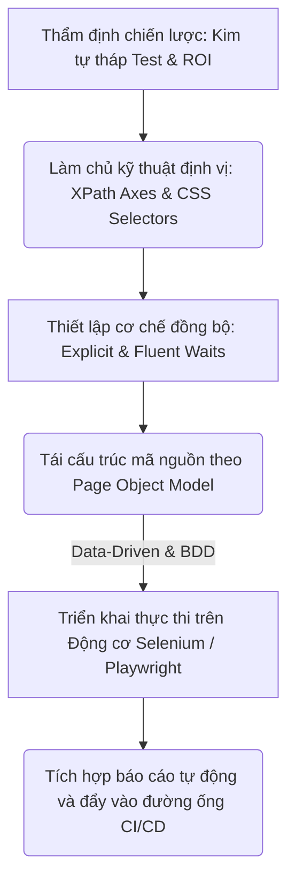
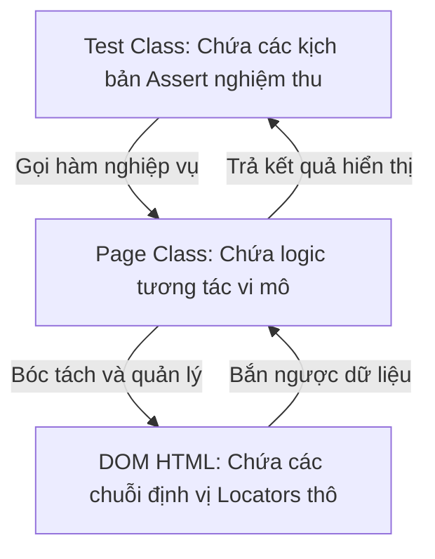
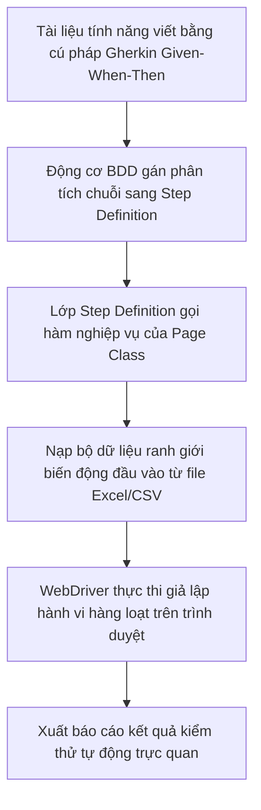

# 📁 08. UI Automation Testing

*Mục tiêu: Chuyển dịch tư duy từ kiểm thử thủ công sang tự động hóa lập trình giao diện người dùng, làm chủ các kỹ thuật định vị phần tử nâng cao, tối ưu hóa bộ mã kịch bản theo mô hình Page Object Model (POM) và vận hành các Framework công nghiệp hàng đầu như Selenium, Playwright.*

# **8.4. Automation Design Patterns**

## 📌 Mục lục nội bộ (Chặng 08)

- [ ] [**8.1. UI Automation Foundations**](./1_UIAutomationFoundations.md)
- [ ] [**8.2. Element Locators Strategy**](./2_LocatorsStrategy.md)
- [ ] [**8.3. Core Automation Interactions**](./3_CoreActions.md)
- [ ] [**8.4. Automation Design Patterns**](./4_DesignPatterns.md)
  - [ ] [8.4.1. Page Object Model (POM) Architectural Design](./4_DesignPatterns.md#841-page-object-model-pom-architectural-design)
  - [ ] [8.4.2. Data-Driven Testing & Behavior-Driven Development (BDD)](./4_DesignPatterns.md#842-data-driven-testing--behavior-driven-development-bdd)
- [ ] [**8.5. Tooling & Frameworks Execution**](./5_Frameworks.md)

---

## 🗺️ Bản đồ Tiến trình Từ Tư duy Chiến lược đến Vận hành Framework UI Automation

Sơ đồ đơn sắc dưới đây mô tả chính xác con đường phát triển năng lực của một kỹ sư Automation: Bắt đầu từ việc thẩm định chiến lược kim tự tháp, làm chủ kỹ thuật định vị phần tử động, thiết lập cơ chế đồng bộ hóa luồng chạy cho đến việc tối ưu cấu trúc mã nguồn qua mô hình kiến trúc POM:



---

# 8.4.1. Page Object Model (POM) Architectural Design

Khi quy mô hệ thống phình to với hàng trăm trang giao diện và hàng nghìn ca kiểm thử, việc viết mã thô tuyến tính (Linear Scripting) sẽ kéo sụt hoàn toàn hiệu năng bảo trì. **Page Object Model (POM)** là một mẫu thiết kế kiến trúc (Design Pattern) kinh điển, đóng vai trò là tiêu chuẩn vàng toàn cầu trong kỹ nghệ tự động hóa. POM ép buộc Tester phải bóc tách lớp giao diện và lớp kiểm thử ra thành các thực thể độc lập, giúp tối ưu hóa khả năng tái sử dụng mã nguồn và chặn đứng tình trạng vỡ trận hệ thống khi Frontend cập nhật thiết kế.

> ⚠️ **Nguyên lý cô lập ranh giới thay đổi (Change Isolation Principle):** Mỗi trang Web vật lý bắt buộc phải được đại diện bằng một lớp đối tượng (Class) duy nhất trong mã nguồn. Toàn bộ các chuỗi định vị Locator và hàm tương tác vi mô phải được giấu kín bên trong Class này. Lớp kịch bản kiểm thử (Test Class) bên ngoài tuyệt đối không được phép sờ trực tiếp vào Locator cây DOM, ngăn ngừa hiện tượng sửa một nút bấm phải sửa lại hàng trăm tệp tin.

---

## 🛠️ Luồng Luân chuyển và Phân tách Ngữ cảnh của Kiến trúc POM (Architecture Design Lifecycle)

Sơ đồ đơn sắc dưới đây mô tả chính xác mô hình kiến trúc phân rã liên tầng của POM, cô lập tuyệt đối luồng chạy của kịch bản test với cấu trúc Locator của cây DOM HTML:



---

## 📊 Ma trận Phân rã Mô hình Kiến trúc Page Object Model (QA Mindset)

Dưới đây là ma trận phân rã chi tiết cấu trúc đa tầng của kiến trúc POM, bóc tách theo quy chuẩn vi mô thực chiến giúp Tester định hình bộ khung Framework vững chắc:

| Phân tầng Kiến trúc | Bản chất vai trò kỹ thuật ngầm | Trọng tâm kiểm thử (QA Focus) | Kịch bản lỗi điển hình thực chiến (Defect) |
| :--- | :--- | :--- | :--- |
| **1. Test Class Layer<br>(Tầng Kịch bản)** | Nơi chứa các thư viện chạy test (`TestNG`, `JUnit`, `PyTest`), thiết lập bộ dữ liệu đầu vào và thực thi các câu lệnh khẳng định (`Assertions`). | **Tuyệt đối cấm chứa Locator.** Chỉ tập trung kiểm toán logic nghiệp vụ và so sánh kết quả mong muốn với thực tế. | Ca test bị lỗi trùng lặp mã nguồn nghiêm trọng, khó bảo trì do Tester nhét cả mã định vị DOM vào tệp kịch bản kiểm thử. |
| **2. Page Class Layer<br>(Tầng Đối tượng)** | Tệp tin Java/Python đại diện cho 1 trang Web. Nơi khai báo tập trung các biến Locator và đóng gói chúng thành các hàm hành vi nghiệp vụ. | **Đóng gói hành vi (Encapsulation).** Khởi tạo các hàm mô phỏng trọn vẹn luồng nghiệp vụ (Ví dụ: Hàm `loginToSystem(user, pass)`). | Hàm nghiệp vụ trả về lỗi rỗng hoặc sai ngữ cảnh do lập trình viên viết code tương tác lấn sân sang các trang giao diện khác. |
| **3. Page Factory /<br>Element Repository** | Cơ chế tối ưu hóa (Có sẵn trong Selenium) giúp trì hoãn việc quét tìm phần tử trên DOM cho đến khi phần tử đó thực sự được gọi hàm. | **Tăng tốc hiệu năng RAM.** Sử dụng các từ khóa `@FindBy` để định danh tập trung bộ thư viện phần tử, giảm thiểu số lần quét DOM thừa. | Hệ thống ném ra ngoại lệ `StaleElementReferenceException` liên tục do bộ nhớ đệm Page Factory lưu giữ con trỏ cũ của thẻ HTML đã bị tải lại. |

---

## 🧠 Chiến lược Thực chiến QA: Phân rã mã nguồn luồng Đăng nhập chuẩn POM

Để hình dung rõ nét sức mạnh bẻ gãy sự lặp lại của POM, hãy đối chiếu cách thức một kỹ sư Automation cấu trúc hóa mã nguồn Java cho trang Đăng nhập (`LoginPage.java`) và tệp kịch bản kiểm thử tương ứng (`LoginTest.java`).

### 1. File Thành phần Đối tượng: LoginPage.java (Lớp Vỏ bọc giấu Locator)
```java
package pages;
import org.openqa.selenium.*;
import org.openqa.selenium.support.ui.ExpectedConditions;
import org.openqa.selenium.support.ui.WebDriverWait;
import java.time.Duration;

public class LoginPage {
    private WebDriver driver;
    private WebDriverWait wait;

    // Chốt chặn 1: Khai báo tập trung toàn bộ Locator thô của trang
    private By txtUsername = By.id("user_input");
    private By txtPassword = By.id("password_input");
    private By btnSubmit = By.cssSelector("button.btn-login");

    public LoginPage(WebDriver driver) {
        this.driver = driver;
        this.wait = new WebDriverWait(driver, Duration.ofSeconds(10));
    }

    // Chốt chặn 2: Đóng gói thành hàm nghiệp vụ cấp cao cho tầng ngoài gọi
    public void loginToSystem(String username, String password) {
        wait.until(ExpectedConditions.visibilityOfElementLocated(txtUsername)).sendKeys(username);
        driver.findElement(txtPassword).sendKeys(password);
        driver.findElement(btnSubmit).click();
    }
}
```

### 2. File Kịch bản Kiểm thử: LoginTest.java (Lớp Khẳng định nghiệp vụ)
```java
package tests;
import org.testng.Assert;
import org.testng.annotations.Test;
import pages.LoginPage;

public class LoginTest extends BaseTest {
    @Test
    public void verifyValidLoginFlow() {
        LoginPage loginPage = new LoginPage(driver);
        
        // Gọi hàm nghiệp vụ trơn tru, fluid, hoàn toàn sạch bóng Locator DOM
        loginPage.loginToSystem("audit@qa.global", "secret123");
        
        // Thực thi chốt chặn khẳng định nghiệm thu số liệu
        Assert.assertTrue(driver.getCurrentUrl().contains("/dashboard"));
    }
}
```

Tư duy phản biến đỉnh cao của một kỹ sư thiết kế hệ thống Automation: Khi Frontend cập nhật mã nguồn, đổi ID của ô nhập liệu từ `id="user_input"` thành `id="account_name"`. Bạn mở tệp `LoginPage.java`, sửa duy nhất đúng 1 dòng khai báo Locator ở đầu trang. Toàn bộ 100 tệp kịch bản kiểm thử nằm ở tầng ngoài **hoàn toàn giữ nguyên vẹn**, không cần đụng chạm sửa sửa đổi bất kỳ ký tự nào. Đây chính là giải pháp tối thượng đưa tính bảo trì của bộ kịch bản lên mức bất bại.

---

## 📚 References
* [ISTQB® Certified Tester Foundation Level (CTFL) Syllabus v4.0](https://istqb.org) - Section 6.2.2: Test Automation Engineering Frameworks and Architecture Design Patterns (POM).
* [Selenium WebDriver Official Documentation - Page Object Models Guidelines](https://selenium.dev) - Industry Standard Best Practices for Encapsulation and Web Element Repository Isolation.

# 8.4.2. Data-Driven Testing & Behavior-Driven Development (BDD)

Khi một Framework Automation đạt độ chín về mặt cấu trúc Page Object Model (POM), bước đột phá tiếp theo là tối ưu hóa cách thức quản trị dữ liệu và thu hẹp khoảng cách giao tiếp giữa các bên liên quan (PO, BA, Dev, QA). **Data-Driven Testing (Kiểm thử hướng dữ liệu)** giúp bóc tách toàn bộ các bộ dữ liệu test ra khỏi mã nguồn thô. Phối hợp với mô hình **Behavior-Driven Development (BDD)** sử dụng ngôn ngữ tự nhiên giúp bộ khung Framework đạt độ phủ kịch bản biên cực đại, biến mã code kiểm thử thành tài liệu nghiệm thu sống động của doanh nghiệp.

> ⚠️ **Nguyên lý ô nhiễm mã nguồn và rách kịch bản (Code Pollution & Fragility Principle):** Việc viết gõ cứng (Hard-coded) hàng loạt cặp dữ liệu tài khoản hoặc tham số đầu vào bên trong các hàm kiểm thử sẽ trực tiếp làm ô nhiễm và phình to mã nguồn một cách vô nghĩa. Đồng thời, việc thiếu ngôn ngữ chung (Mô hình BDD) sẽ khiến kịch bản test bị lệch pha hoàn toàn với tài liệu đặc tả nghiệp vụ thực tế của sản phẩm.

---

## 🛠️ Luồng Luân chuyển Dữ liệu Biên và Biên dịch Ngôn ngữ Tự nhiên của Khung BDD (BDD Lifecycle)

Sơ đồ đơn sắc dưới đây mô tả chính xác chu trình động cơ Cucumber/Gherkin biên dịch ngôn ngữ tự nhiên thành các lớp hàm xử lý, kết hợp nạp tệp dữ liệu ranh giới thô từ bên ngoài:



---

## 📊 Ma trận Phân rã Ma trận Kịch bản Hướng Dữ liệu và Phát triển Hướng Hành vi (QA Mindset)

Dưới đây là ma trận phân rã chi tiết hai trường phái kiến trúc nâng cao, bóc tách theo quy chuẩn vi mô thực chiến giúp Tester định hình bộ khung Framework linh hoạt:

| Thành phần Công nghệ | Bản chất vận hành ngầm của Động cơ | Trọng tâm kiểm thử (QA Focus) | Kịch bản lỗi điển hình thực chiến (Defect) |
| :--- | :--- | :--- | :--- |
| **1. Data-Driven Testing<br>(Kiểm thử hướng dữ liệu)** | Sử dụng bộ nạp dữ liệu (`@DataProvider` trong TestNG, hoặc các tệp JSON/CSV/Excel) để tự động hóa vòng lặp chạy 1 ca test với nhiều bộ dữ liệu khác nhau. | **Tách biệt tuyệt đối tầng dữ liệu.** Thiết kế các bộ dữ liệu biên, dữ liệu rác, tài khoản ranh giới ở file ngoài để ép code chạy liên hoàn. | **Lỗi kẹt luồng:** Bộ test tự động bị crash giữa chừng do tệp Excel đầu vào chứa ký tự lạ hoặc trống ô khiến bộ Parser của code bị lỗi. |
| **2. BDD - Gherkin Syntax<br>(Ngôn ngữ tự nhiên)** | Định nghĩa kịch bản bằng 3 từ khóa tối cao: **Given** (Tiền điều kiện), **When** (Hành động kích hoạt), **Then** (Kết quả khẳng định nghiệm thu). | **Chuẩn hóa ngôn ngữ kinh doanh.** Viết kịch bản dễ hiểu giúp PO, BA trực tiếp đọc và duyệt được bộ Test Cases mà không cần biết code. | Kịch bản BDD viết mơ hồ, chung chung hoặc lồng ghép kỹ thuật locator vào chuỗi text khiến tầng lập trình phía sau không thể map hàm. |
| **3. Step Definitions<br>(Lớp ánh xạ)** | Lớp trung gian sử dụng các biểu thức chính quy (Regex) để biên dịch chuỗi text của file Gherkin thành các khối hàm lập trình Java/Python. | **Ánh xạ chính xác (Mapping Integrity).** Đảm bảo mỗi dòng chữ Gherkin đều có một hàm code bọc lót phía sau, gọi đúng Page Object. | Lỗi mất dấu liên kết (`Undefined Step Exception`) do lập trình viên viết sai chính tả hoặc đổi chữ ở file kịch bản mà quên sửa code. |

---

## 🧠 Chiến lược Thực chiến QA: Phân rã mã nguồn Đăng ký liên hoàn chuẩn BDD Data-Driven

Hãy tưởng tượng bạn đang kiểm thử tính năng "Đăng nhập hệ thống". Bạn cần test liên hoàn 3 kịch bản: (1) Đúng tài khoản $\rightarrow$ Đăng nhập thành công, (2) Sai mật khẩu $\rightarrow$ Báo lỗi, (3) Tài khoản bị khóa $\rightarrow$ Báo chặn.

Tư duy phản biện của một kiến trúc sư Automation để phân rã cấu trúc tệp kịch bản tính năng (`login.feature`) kết hợp bảng dữ liệu băm động chuẩn công nghiệp:

### 1. File kịch bản nghiệp vụ: login.feature (Tài liệu sống của BA/PO)
```gherkin
Feature: Quản lý an ninh - Luồng Đăng nhập hệ thống

  Scenario Outline: Kiểm toán luồng đăng nhập liên hoàn với dữ liệu ranh giới
    Given Người dùng đang đứng tại màn hình Đăng nhập hệ thống
    When Người dùng thực hiện điền tài khoản "<username>" và mật khẩu "<password>"
    And Người dùng nhấn nút Đăng nhập
    Then Hệ thống phải phản hồi đúng thông điệp kỳ vọng là "<expected_message>"

    Examples:

      | username         | password   | expected_message                |
      | audit@qa.global  | secret123  | Điều hướng sang Dashboard       |
      | audit@qa.global  | wrongpass  | Mật khẩu không chính xác        |
      | locked@qa.global | secret123  | Tài khoản đã bị khóa vĩnh viễn  |
```

### 2. Lớp ánh xạ mã nguồn: LoginSteps.java (Cầu nối điều khiển Page Object)
```java
package stepdefinitions;
import io.cucumber.java.en.*;
import org.testng.Assert;
import pages.LoginPage;
import tests.BaseTest;

public class LoginSteps extends BaseTest {
    LoginPage loginPage = new LoginPage(driver);

    @Given("Người dùng đang đứng tại màn hình Đăng nhập hệ thống")
    public void navigateToLogin() {
        driver.get("https://api.test");
    }

    @When("Người dùng thực hiện điền tài khoản {string} và mật khẩu {string}")
    public void fillCredentials(String user, String pass) {
        // Trích xuất chuỗi động biến đổi nạp từ bảng Examples của file Feature
        loginPage.enterUsername(user);
        loginPage.enterPassword(pass);
    }

    @And("Người dùng nhấn nút Đăng nhập")
    public void clickSubmit() {
        loginPage.clickLoginButton();
    }

    @Then("Hệ thống phải phản hồi đúng thông điệp kỳ vọng là {string}")
    public void verifyResponse(String expectedMsg) {
        String actualMsg = loginPage.getSystemNotification();
        // Chốt chặn khẳng định so sánh số liệu đối chứng tự động
        Assert.assertEquals(actualMsg, expectedMsg);
    }
}
```

Tư duy phản biện đỉnh cao: Khi có thêm kịch bản kiểm thử mới (Ví dụ: Bỏ trống tài khoản), QA **không cần viết thêm bất kỳ dòng code lập trình nào**. Bạn chỉ cần chèn thêm 1 dòng dữ liệu thô vào bảng `Examples` của file `.feature`. Động cơ Cucumber sẽ tự động bóc tách, nhân bản luồng chạy vật lý trên trình duyệt và tự động khớp khít dữ liệu biên. Bộ khung này giúp giải phóng hoàn toàn thời gian gỡ lỗi và nâng tầm tốc độ mở rộng kịch bản lên mức tối đa.

---

## 📚 References
* [ISTQB® Certified Tester Foundation Level (CTFL) Syllabus v4.0](https://istqb.org) - Section 6.2.2: Test Automation Engineering Frameworks (Data-Driven and Behavior-Driven Testing Approaches).
* [John Ferguson Smart (2014) - BDD in Action: Behavior-driven development for the whole software lifecycle](https://manning.com) - Core Specifications for Gherkin Language, Cucumber Steps and Test Automation Scaling.
