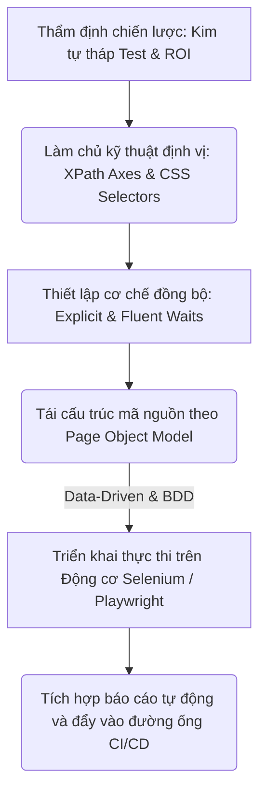
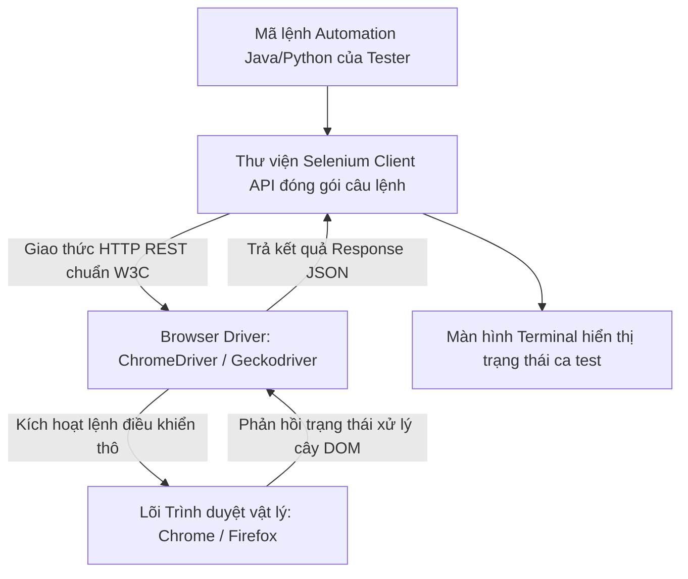
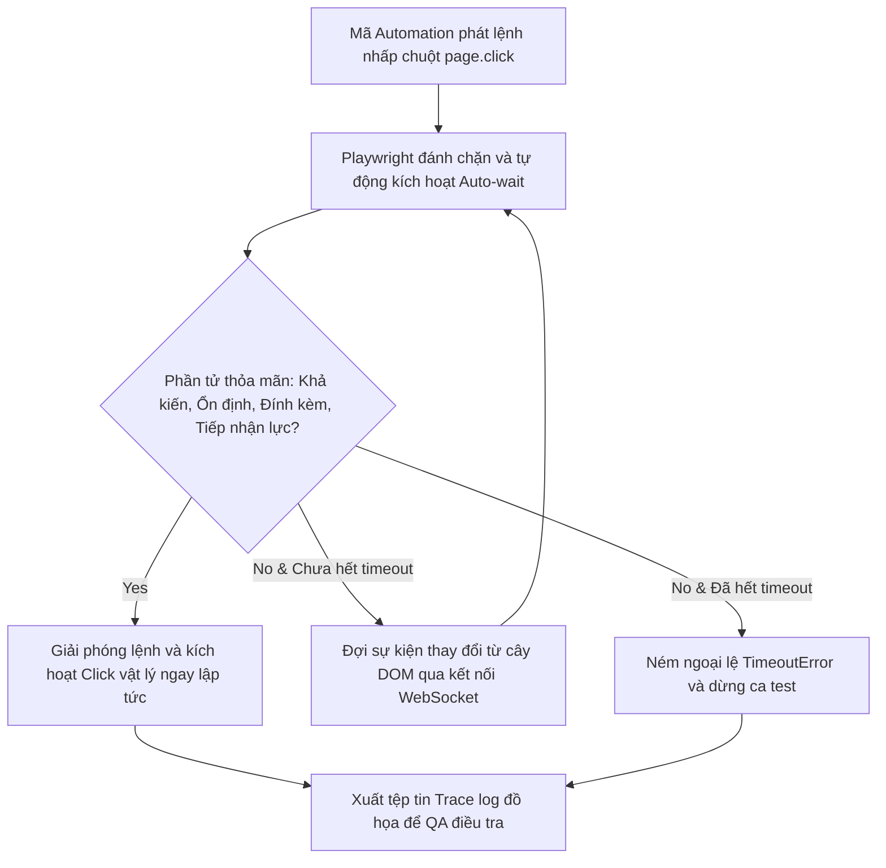
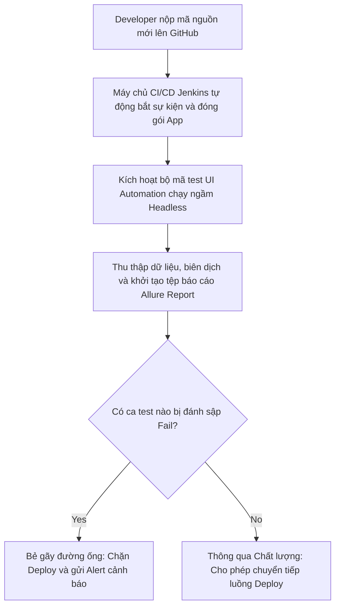

# 📁 08. UI Automation Testing

*Mục tiêu: Chuyển dịch tư duy từ kiểm thử thủ công sang tự động hóa lập trình giao diện người dùng, làm chủ các kỹ thuật định vị phần tử nâng cao, tối ưu hóa bộ mã kịch bản theo mô hình Page Object Model (POM) và vận hành các Framework công nghiệp hàng đầu như Selenium, Playwright.*

# **8.5. Tooling & Frameworks Execution**

## 📌 Mục lục nội bộ (Chặng 08)

- [ ] [**8.1. UI Automation Foundations**](./1_UIAutomationFoundations.md)
- [ ] [**8.2. Element Locators Strategy**](./2_LocatorsStrategy.md)
- [ ] [**8.3. Core Automation Interactions**](./3_CoreActions.md)
- [ ] [**8.4. Automation Design Patterns**](./4_DesignPatterns.md)
- [ ] [**8.5. Tooling & Frameworks Execution**](./5_Frameworks.md)
  - [ ] [8.5.1. Selenium WebDriver Architecture & Setup](./5_Frameworks.md#851-selenium-webdriver-architecture--setup)
  - [ ] [8.5.2. Playwright Core Architecture: Async, Auto-wait & Tracing](./5_Frameworks.md#852-playwright-core-architecture-async-auto-wait--tracing)
  - [ ] [8.5.3. Reporting Systems & CI/CD Pipeline Integration](./5_Frameworks.md#853-reporting-systems--cicd-pipeline-integration)

---

## 🗺️ Bản đồ Tiến trình Từ Tư duy Chiến lược đến Vận hành Framework UI Automation

Sơ đồ đơn sắc dưới đây mô tả chính xác con đường phát triển năng lực của một kỹ sư Automation: Bắt đầu từ việc thẩm định chiến lược kim tự tháp, làm chủ kỹ thuật định vị phần tử động, thiết lập cơ chế đồng bộ hóa luồng chạy cho đến việc tối ưu cấu trúc mã nguồn qua mô hình kiến trúc POM:



---

# 8.5.1. Selenium WebDriver Architecture & Setup

Trong lịch sử kỹ nghệ tự động hóa giao diện, **Selenium WebDriver** là tượng đài công nghiệp đóng vai trò làm nền tảng cốt lõi cho mọi hệ thống kiểm thử tự động. Để vận hành Selenium một cách chuyên nghiệp, Tester không thể chỉ viết code theo bản năng mà phải thấu hiểu bản chất kiến trúc giao tiếp liên tầng ngầm của nó. Làm chủ quy trình khởi tạo, cấu hình hệ thống Driver giúp QA thiết lập một bệ phóng kịch bản vững chắc, chặn đứng các lỗi sập luồng sơ khai tại ranh giới kết nối giữa mã lệnh và lõi trình duyệt vật lý.

> ⚠️ **Nguyên lý giao thức điều khiển đồng bộ (W3C WebDriver Protocol Principle):** Selenium WebDriver điều khiển trình duyệt thông qua giao thức chuẩn hóa W3C dưới dạng các gói tin HTTP REST Request ngầm. Việc không đồng bộ phiên bản (Mismatch) giữa tệp tin chạy nền Browser Driver (như `chromedriver`) và phần mềm trình duyệt vật lý cài trên máy tính sẽ trực tiếp phá hủy luồng giao tiếp, khiến cỗ máy Automation bị sập lập tức ngay khi vừa khởi động.

---

## 🛠️ Luồng Giao tiếp Kiến trúc Liên tầng của Động cơ Selenium (Selenium Architecture Lifecycle)

Sơ đồ đơn sắc dưới đây mô tả chính xác con đường luân chuyển gói tin điều khiển từ mã code của Tester, đi qua cổng dịch trung gian cho đến khi tác động vật lý lên lõi trình duyệt:



---

## 📊 Ma trận Phân rã Kiến trúc Vật lý và Quy trình Thiết lập Selenium (QA Mindset)

Dưới đây là ma trận bóc tách chi tiết 4 thành phần kỹ thuật cấu thành nên kiến trúc Selenium, phân rã theo quy chuẩn vi mô thực chiến giúp Tester làm chủ cấu hình hệ thống:

| Thành phần Kiến trúc | Bản chất vận hành ngầm của Hệ thống | Trọng tâm kiểm thử (QA Focus) | Kịch bản lỗi điển hình thực chiến (Defect) |
| :--- | :--- | :--- | :--- |
| **1. Selenium Client<br>Libraries** | Bộ thư viện mã nguồn (Java, Python, C#) cung cấp cú pháp Fluent API để Tester viết kịch bản tương tác phần tử. | **Đảm bảo tính tương thích ngôn ngữ.** Quản lý và đóng gói các gói phụ thuộc (Dependencies) qua Maven hoặc Pypi tinh gọn. | Mã test bị lỗi biên dịch hàng loạt do thư viện Selenium Client xung đột phiên bản với thư viện chạy test (`TestNG/JUnit`). |
| **2. W3C WebDriver<br>Protocol** | Giao thức truyền thông tiêu chuẩn toàn cầu, chuyển đổi mọi hành vi (Click, Type) thành các gói tin REST API có cấu hình rõ ràng. | **Chuẩn hóa định dạng gói tin.** Đảm bảo mọi câu lệnh truyền qua môi trường mạng đều được mã hóa an toàn, không bị rớt gói. | Kịch bản bị treo vô định hướng do gói tin HTTP điều khiển bị ngắt kết nối giữa chừng giữa Client và Driver. |
| **3. Browser Driver<br>(Cổng dịch nền)** | Tệp tin thực thi độc lập (Ví dụ: `chromedriver.exe`) đóng vai trò làm máy chủ HTTP Server thu nhỏ để dịch lệnh từ API sang mã trình duyệt. | **Đồng bộ phiên bản vật lý.** Sử dụng tính năng tự động quản lý Driver (`Selenium Manager` từ bản v4) để tự động bắt khớp phiên bản. | **Lỗi sập Driver (SessionNotCreated):** Mã test bị đánh sập ngay giây đầu tiên do phiên bản `chromedriver` cũ hơn phiên bản của Chrome trên máy. |
| **4. Browser Capabilities<br>(Cấu hình Khởi tạo)** | Lớp đối tượng `ChromeOptions / FirefoxOptions` cho phép Tester thiết lập các tham số khởi chạy sâu cho trình duyệt. | **Tối ưu hóa môi trường chạy.** Cấu hình các cờ ẩn danh (`--incognito`), bỏ qua check an ninh (`--ignore-certificate-errors`) hoặc chạy ngầm (`--headless`). | Trình duyệt không thể khởi chạy trên máy chủ CI/CD (Jenkins/GitHub Actions) do Tester quên cấu hình chế độ chạy ngầm `--headless`. |

---

## 🧠 Chiến lược Thực chiến QA: Thiết kế Khung khởi tạo Driver chuẩn công nghiệp

Một kỹ sư Automation thực chiến không bao giờ khai báo driver thô bạo theo kiểu gõ cứng đường dẫn tệp tin vật lý (`System.setProperty`). Bạn bắt buộc phải thiết lập một bộ khung cấu hình (Base Setup) thông minh, có khả năng tự dọn dẹp bộ nhớ và tự động thích ứng với cấu hình hạ tầng mạng.

Tư duy phản biện của một Tester sắc bén để thiết kế khối mã nguồn khởi tạo và phá hủy Driver an toàn không tì vết bằng Java:

```java
package tests;
import org.openqa.selenium.WebDriver;
import org.openqa.selenium.chrome.ChromeDriver;
import org.openqa.selenium.chrome.ChromeOptions;
import org.testng.annotations.AfterMethod;
import org.testng.annotations.BeforeMethod;

public class BaseTest {
    protected WebDriver driver;

    @BeforeMethod
    public void setupBrowser() {
        // Bước 1: Khởi tạo lớp cấu hình nâng cao cho Trình duyệt Chrome
        ChromeOptions options = new ChromeOptions();
        options.addArguments("--incognito"); // Mở tab ẩn danh để chống ô nhiễm cache dữ liệu phiên
        options.addArguments("--start-maximized"); // Phóng to màn hình để lộ diện mọi phần tử trên Viewport
        options.addArguments("--disable-popup-blocking"); // Chặn đứng các quảng cáo rác làm che khuất nút bấm

        // Bước 2: Kích hoạt động cơ Selenium Manager tự động tải Driver tương thích và bật Chrome
        driver = new ChromeDriver(options);
    }

    @AfterMethod
    public void tearDownBrowser() {
        // Bước 3: Chốt chặn tối hậu giải phóng tài nguyên hệ thống
        if (driver != null) {
            driver.quit(); // Hủy toàn bộ phiên làm việc, tắt sạch các tiến trình chromedriver chạy ngầm trong Task Manager
        }
    }
}
```

Tư duy phản biện chốt chặn ranh giới: Nếu tại Bước 3 bạn lười biếng dùng lệnh `driver.close()` thay vì `driver.quit()`, hệ thống sẽ dính lỗi **Rò rỉ tài nguyên (Resource Leak)** nghiêm trọng. Lệnh `.close()` chỉ tắt duy nhất cái tab hiện tại chứ không hề giải phóng tệp `chromedriver.exe` chạy ngầm. Khi đường ống CI/CD chạy liên tục 1000 ca test, hệ thống sẽ sinh ra 1000 tiến trình rác chạy ngầm dưới RAM, làm treo cứng hoàn toàn máy chủ của doanh nghiệp. QA Automation bắt buộc phải dùng `.quit()` để dọn dẹp sạch sẽ kho bãi sau khi kết thúc chu trình test.

---

## 📚 References
* [ISTQB® Certified Tester Foundation Level (CTFL) Syllabus v4.0](https://istqb.org) - Section 6.2: Test Automation Engineering Architecture and Tool Setup Environment Specifications.
* [W3C WebDriver Production-Ready Global Standard Architecture Specification](https://w3.org) - The Definitive Technical Standards for Browser Automation Drivers and Endpoints.

# 8.5.2. Playwright Core Architecture: Async, Auto-wait & Tracing

Trong kỷ nguyên của các ứng dụng Web thế hệ mới (Single Page Applications), **Playwright** nổi lên như một thế lực công nghệ làm thay đổi hoàn toàn cục diện UI Automation. Khác với Selenium vốn dựa trên giao thức HTTP cũ, Playwright giao tiếp trực tiếp với lõi trình duyệt thông qua kết nối **WebSocket** tốc độ cao. Làm chủ ba tính năng cốt lõi **Async (Bất đồng bộ)**, **Auto-wait (Tự động chờ)**, và **Tracing (Dò vết lỗi)** giúp kỹ sư Automation tối ưu hóa tốc độ thực thi kịch bản lên mức cực đại và triệt tiêu tận gốc rễ hiện tượng gãy kịch bản do trễ mạng.

> ⚠️ **Nguyên lý giao tiếp hai chiều trực tiếp (Bi-directional Connection Principle):** Playwright điều khiển trình duyệt thông qua giao thức Chrome DevTools Protocol (CDP) trên một kết nối WebSocket duy nhất duy trì liên tục. Cơ chế này cho phép máy chủ và máy khách trao đổi dữ liệu hai chiều theo thời gian thực (Real-time), giúp robot bắt trọn mọi sự kiện thay đổi của cây DOM mà không cần tốn tài nguyên quét vòng lặp từ đầu.

---

## 🛠️ Luồng Vận hành và Đánh chặn Sự kiện Tự động Chờ của Động cơ Playwright (Auto-wait Lifecycle)

Sơ đồ đơn sắc dưới đây mô tả chính xác chu trình Playwright tự động thực hiện bộ 4 chốt chặn kiểm tra an toàn (Actionability Checks) trước khi cho phép truyền lực click:



---

## 📊 Ma trận Phân rã Kiến trúc Lõi của Động cơ Playwright (QA Mindset)

Dưới đây là ma trận bóc tách chi tiết 3 mũi nhọn công nghệ giúp Playwright đạt hiệu năng thực thi vượt trội, cấu trúc theo góc nhìn phân tích lỗi vi mô của một chuyên gia QA:

| Tính năng cốt lõi | Bản chất vận hành ngầm của Hệ thống | Trọng tâm kiểm thử (QA Focus) | Kịch bản lỗi điển hình thực chiến (Defect) |
| :--- | :--- | :--- | :--- |
| **1. Async Execution<br>(Chạy bất đồng bộ)** | Vận hành trên cơ chế phi chặn (*Non-blocking Async*), cho phép khởi chạy hàng loạt kịch bản kiểm thử song song (*Parallel*) trên cùng một máy cấu hình thấp. | **Tối ưu hóa tài nguyên.** Tách biệt các phiên làm việc độc lập qua cơ chế `BrowserContext` (Mô phỏng như 2 trình duyệt ẩn danh độc lập cạnh nhau). | Ca test bị lỗi lẫn lộn dữ liệu phiên giữa các tài khoản do lập trình viên cấu hình sai bộ nhớ dùng chung trong Framework. |
| **2. Auto-wait Engine<br>(Tự động chờ)** | Tự động thực hiện chuỗi kiểm tra (*Actionability Checks*): `Attached`, `Visible`, `Stable` (Hoạt hoạt đã dừng), `Enabled`, `Receiving Events`. | **Loại bỏ hoàn toàn lệnh Wait thủ công.** Tester chỉ cần gõ lệnh Click/Type, Playwright tự động lo phần đồng bộ thời gian thực. | Bộ test vẫn bị sập do phần tử mục tiêu bị che khuất bởi một banner trong suốt nằm ở lớp CSS phân cấp phía trên (`z-index`). |
| **3. Tracing System<br>(Dò vết đồ họa)** | Hệ thống hộp đen ghi lại toàn bộ hành vi: Chụp ảnh từng phần tư giây, quay video luồng chạy, ghi log mạng mạng (Network) và log bảng mã DOM. | **Kiểm toán điều tra nguyên nhân gốc (Post-mortem).** Xuất file `.zip` chứa toàn bộ vết lỗi để QA mở lên xem lại chính xác khoảnh khắc sập code. | Lỗi Flaky Test bí ẩn biến mất khi chạy local nhưng luôn xuất hiện trên CI/CD, không thể debug do thiếu file cấu hình Trace log. |

---

## 🧠 Chiến lược Thực chiến QA: Thiết kế Kịch bản Bất biến kết hợp Ghi vết Tracing

Một kỹ sư Automation chuyên nghiệp khi vận hành Playwright (Sử dụng TypeScript / Node.js) luôn biết cách tậm dụng cơ chế quản lý cấu hình để tự động hóa việc bắt lỗi và ghi vết tự động mà không cần viết các hàm chụp ảnh màn hình (`screenshot`) thủ công lặp đi lặp lại.

Tư duy phản biện của một Tester sắc bén để thiết kế file chạy test và bóc tách tệp Trace log cứu mạng dự án:

1.  **Cấu hình tự động ghi vết khi có lỗi (playwright.config.ts):**
    ```typescript
    import { defineConfig } from '@playwright/test';
    export default defineConfig({
      testDir: './tests',
      fullyParallel: true, // Kích hoạt tối đa công suất chạy song song bất đồng bộ
      use: {
        headless: true, // Chạy ngầm để tối ưu hiệu năng băng thông máy chủ CI/CD
        screenshot: 'only-on-failure', // Tự động chụp ảnh màn hình duy nhất khi ca test bị gãy
        trace: 'retain-on-failure', // Tự động ghi vết và xuất file Trace.zip khi phát hiện lỗi
      },
    });
    ```
2.  **Khai thác tệp Trace để gỡ lỗi tầng sâu (Debugging):** Khi một ca test thanh toán bị sập trên môi trường Jenkins. Hệ thống tự động xuất ra tệp `trace.zip`. QA không cần mò mẫm đoán mò code lỗi. Bạn mở Terminal gõ lệnh: `npx playwright show-trace path/to/trace.zip`.
3.  **Vạch lá tìm Bug:** Màn hình Playwright Trace Viewer hiển thị trực quan:
    *   **Tab Action:** Chỉ rõ robot đang đặt chuột tại tọa độ nào trên màn hình.
    *   **Tab Network:** Phơi bày gói tin API Response bị trả về mã `500 Internal Server Error` đúng vào thời điểm robot bấm nút. 
    *   **Kết luận:** Giao diện UI hoàn toàn không lỗi, hệ thống bị sập kịch bản là do lõi Backend bị crash ngầm dưới Database. Bug lập tức được định vị chính xác nguyên nhân gốc rễ (Root Cause), chặn đứng mọi hành vi tranh cãi lỗi trong dự án.

---

## 📚 References
* [ISTQB® Certified Tester Foundation Level (CTFL) Syllabus v4.0](https://istqb.org) - Section 6.2.2: Test Automation Engineering Frameworks and Tool Implementation (Advanced Async Protocols and Logging).
* [Playwright Official Documentation by Microsoft - Core Concepts & Architecture](https://playwright.dev) - Technical Guide for BrowserContext Isolation, Actionability Checks, and Trace Viewer Tools.

# 8.5.3. Reporting Systems & CI/CD Pipeline Integration

Trong giai đoạn vận hành kiểm thử tự động hóa cấp doanh nghiệp, một Framework Automation không thể gọi là hoàn chỉnh nếu nó chỉ chạy cô lập trên máy tính của cá nhân Tester. Bạn bắt buộc phải làm chủ cấu trúc **Reporting Systems (Hệ thống báo cáo tự động)** và kỹ thuật tích hợp vào **Đường ống CI/CD (Continuous Integration / Continuous Deployment)**. Thành thạo phân hệ tối cao này giúp bộ test suite tự động kích hoạt theo chu kỳ, xuất bản báo cáo giàu đồ họa (Allure / ExtentReports) trực quan, chặn đứng các bản build lỗi trước khi chúng kịp đẩy lên môi trường Production.

> ⚠️ **Nguyên lý chốt chặn chất lượng tự động (Quality Gate Principle):** Bộ kịch bản Automation chính là bộ lọc an ninh tối hậu của đường ống CI/CD. Hệ thống Jenkins hoặc GitHub Actions bắt buộc phải được cấu hình luật nghiêm ngặt: Nếu có bất kỳ ca test cốt lõi nào bị đánh sập (Fail), đường ống phải lập tức bẻ gãy luồng Deploy (Build Failure), phát lệnh cảnh báo và từ chối phát hành phiên bản phần mềm lỗi.

---

## 🛠️ Chu trình Thực thi và Đóng gói Báo cáo tự động trên Đường ống CI/CD (CI/CD Pipeline Lifecycle)

Sơ đồ đơn sắc dưới đây mô tả chính xác 5 bước vận hành của hệ thống khi lập trình viên nộp mã nguồn mới, kích hoạt robot quét lỗi và chiết xuất báo cáo đồ họa cho QA:



---

## 📊 Ma trận Tích hợp Hạ tầng Đường ống và Hệ thống Báo cáo Đồ họa (QA Mindset)

Dưới đây là ma trận phân rã chi tiết các thành phần công nghệ quản trị chất lượng diện rộng, bóc tách theo quy chuẩn vi mô thực chiến giúp Tester làm chủ đường đua DevOps:

| Thành phần Công nghệ | Bản chất vận hành ngầm của Hệ thống | Trọng tâm kiểm thử (QA Focus) | Kịch bản lỗi điển hình thực chiến (Defect) |
| :--- | :--- | :--- | :--- |
| **1. Reporting Framework<br>(Allure / Extent)** | Thư viện thu thập Metadata luồng chạy (`@Step`, `@Attachment`), chuyển đổi dữ liệu thô sang giao diện HTML/JSON giàu đồ họa, có biểu đồ tròn trực quan. | **Tính tường minh của vết lỗi.** Cấu hình tự động đính kèm ảnh chụp màn hình (*Screenshots*) và log mạng đúng vào khoảnh khắc code bị sập. | Báo cáo xuất ra chung chung, chỉ ghi chữ `Fail` mà không có ảnh chụp hay dòng log định vị lỗi, khiến QA mất cả ngày để gỡ lỗi. |
| **2. CI/CD Orchestrator<br>(Jenkins / GitHub Actions)** | Máy chủ trung tâm đóng vai trò làm nhạc trưởng điều phối, sử dụng file cấu hình (`Jenkinsfile` hoặc `YAML`) để lập lịch chạy tự động. | **Xây dựng bộ chốt chặn (Quality Gate).** Thiết lập cờ điều kiện kiểm tra kết quả test để quyết định số phận của bản build phần mềm. | Đường ống vẫn tiếp tục deploy bản build lỗi lên server thật mặc dù bộ test auto đã hét lỗi ầm ĩ (Lỗi cấu hình sai luật bỏ qua mã lỗi). |
| **3. Headless Mode<br>(Chạy ẩn ngầm)** | Cấu hình ép buộc trình duyệt chạy không giao diện đồ họa, triệt tiêu việc render pixel lên màn hình để tối ưu RAM và CPU của máy chủ. | **Kiểm thử tính tương thích hạ tầng.** Đảm bảo kịch bản chạy ổn định trong môi trường Linux thô của Docker Container. | Ca test chạy local rất mượt nhưng đẩy lên Jenkins bị sập lập tức do Tester quên cấu hình chế độ chạy ngầm `--headless`. |

---

## 🧠 Chiến lược Thực chiến QA: Thiết kế File cấu hình đường ống GitHub Actions

Một kỹ sư QA Automation thực chiến bắt buộc phải biết cách tự biên soạn file cấu hình đường ống (Pipeline Script) để tự động hóa hoàn toàn chu trình quét lỗi mỗi khi dự án có thay đổi.

Tư duy phản biện của một Tester sắc bén để thiết kế file cấu hình `.github/workflows/automation.yml` an toàn để điều khiển động cơ Playwright chạy xuyên đêm:

```yaml
name: Hệ thống Chốt chặn Chất lượng Tự động - Chặng 08

on:
  push:
    branches: [ main, staging ] # Kích hoạt đường ống ngay khi có code mới nộp vào nhánh chính

jobs:
  automation_test:
    runs-on: ubuntu-latest # Chạy trên hệ điều hành Linux tối ưu của GitHub Server

    steps:
    - name: Bước 1 - Tải mã nguồn kịch bản test từ Kho chứa
      uses: actions/checkout@v4

    - name: Bước 2 - Thiết lập môi trường thực thi Node.js
      uses: actions/setup-node@v4
      with:
        node-version: 18

    - name: Bước 3 - Cài đặt các thư viện phụ thuộc tinh gọn
      run: npm ci

    - name: Bước 4 - Khởi chạy bộ mã test UI Automation ẩn ngầm (Headless)
      run: npx playwright test

    - name: Bước 5 - Chiết xuất và xuất bản tệp Allure Report khi phát hiện lỗi
      if: always() # Ép buộc luôn luôn xuất bản báo cáo bất kể bộ test PASS hay FAIL
      uses: actions/upload-artifact@v4
      with:
        name: allure-report-artifacts
        path: playwright-report/
        retention-days: 7 # Tự động xóa dọn kho bãi báo cáo sau 7 ngày để tiết kiệm dung lượng
```

Tư duy phản biện chốt chặn ranh giới: Hãy nhìn vào `Bước 5`. Việc sử dụng cờ điều kiện `if: always()` chính là chốt chặn cứu mạng Tester. Nếu bạn bất cẩn dùng cờ mặc định, khi bộ test bị **FAIL** ở `Bước 4`, hệ thống GitHub Actions sẽ lập tức đóng băng và ngắt luôn đường ống, không chịu chạy `Bước 5`. Hậu quả là QA sẽ không nhận được bất kỳ tệp báo cáo hay ảnh chụp màn hình nào để điều tra lỗi. Cấu hình `always()` đảm bảo kho lưu trữ tệp tin Trace.zip và hình ảnh lỗi luôn luôn được chiết xuất an toàn, giúp QA định vị và phòng thủ hệ thống 24/7.

---

## 📚 References
* [ISTQB® Certified Tester Foundation Level (CTFL) Syllabus v4.0](https://istqb.org) - Section 6.2.4: Continuous Integration and Automated Test Execution Frameworks Deployment.
* [ISO/IEC/IEEE 29119-5:2016 Standard](https://iso.org) - Software Testing - Part 5: Test Automation Frameworks, Execution Logs, and CI/CD Quality Gate Specifications.
