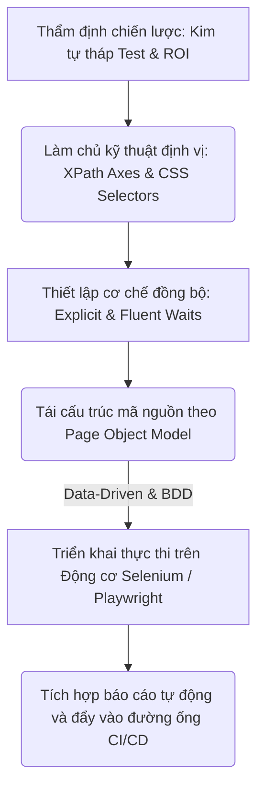

# 📁 08. UI Automation Testing

*Mục tiêu: Chuyển dịch tư duy từ kiểm thử thủ công sang tự động hóa lập trình giao diện người dùng, làm chủ các kỹ thuật định vị phần tử nâng cao, tối ưu hóa bộ mã kịch bản theo mô hình Page Object Model (POM) và vận hành các Framework công nghiệp hàng đầu như Selenium, Playwright.*

## 📌 Mục lục nội bộ (Chặng 08)

- [ ] [**8.1. UI Automation Foundations**](./1_UIAutomationFoundations.md)
  - [ ] [8.1.1. Introduction to UI Automation: Why and When?](./1_UIAutomationFoundations.md#811-introduction-to-ui-automation-why-and-when)
  - [ ] [8.1.2. Automation Test Pyramid & ROI Analysis](./1_UIAutomationFoundations.md#812-automation-test-pyramid--roi-analysis)
- [ ] [**8.2. Element Locators Strategy**](./2_LocatorsStrategy.md)
  - [ ] [8.2.1. Standard Locators: ID, Name, ClassName, LinkText](./2_LocatorsStrategy.md#821-standard-locators-id-name-classname-linktext)
  - [ ] [8.2.2. Advanced Locators: XPath Axes & Dynamic Selectors](./2_LocatorsStrategy.md#822-advanced-locators-xpath-axes--dynamic-selectors)
  - [ ] [8.2.3. Advanced Locators: CSS Selectors Combinators](./2_LocatorsStrategy.md#823-advanced-locators-css-selectors-combinators)
- [ ] [**8.3. Core Automation Interactions**](./3_CoreActions.md)
  - [ ] [8.3.1. Browser Actions: Navigation, Windows, Alerts, Frames](./3_CoreActions.md#831-browser-actions-navigation-windows-alerts-frames)
  - [ ] [8.3.2. Web Element Actions: Click, Type, Clear, Select, Hover](./3_CoreActions.md#832-web-element-actions-click-type-clear-select-hover)
  - [ ] [8.3.3. Synchronization Strategy: Implicit, Explicit & Fluent Waits](./3_CoreActions.md#833-synchronization-strategy-implicit-explicit--fluent-waits)
- [ ] [**8.4. Automation Design Patterns**](./4_DesignPatterns.md)
  - [ ] [8.4.1. Page Object Model (POM) Architectural Design](./4_DesignPatterns.md#841-page-object-model-pom-architectural-design)
  - [ ] [8.4.2. Data-Driven Testing & Behavior-Driven Development (BDD)](./4_DesignPatterns.md#842-data-driven-testing--behavior-driven-development-bdd)
- [ ] [**8.5. Tooling & Frameworks Execution**](./5_Frameworks.md)
  - [ ] [8.5.1. Selenium WebDriver Architecture & Setup](./5_Frameworks.md#851-selenium-webdriver-architecture--setup)
  - [ ] [8.5.2. Playwright Core Architecture: Async, Auto-wait & Tracing](./5_Frameworks.md#852-playwright-core-architecture-async-auto-wait--tracing)
  - [ ] [8.5.3. Reporting Systems & CI/CD Pipeline Integration](./5_Frameworks.md#853-reporting-systems--cicd-pipeline-integration)

---

## 🗺️ Bản đồ Tiến trình Từ Tư duy Chiến lược đến Vận hành Framework UI Automation

Sơ đồ đơn sắc dưới đây mô tả chính xác con đường phát triển năng lực của một kỹ sư Automation: Bắt đầu từ việc thẩm định chiến lược kim tự tháp, làm chủ kỹ thuật định vị phần tử động, thiết lập cơ chế đồng bộ hóa luồng chạy cho đến việc tối ưu cấu trúc mã nguồn qua mô hình kiến trúc POM:

---

## 📚 References
* [ISTQB® Certified Tester Foundation Level (CTFL) Syllabus v4.0](https://istqb.org) - Section 6.1: Test Automation Foundations & Section 6.2: Criteria for Tool Selection.
* [ISO/IEC/IEEE 29119-5:2016 Standard](https://iso.org) - Software Testing - Part 5: Test Automation Frameworks, Execution Metrics and Maintainability.
