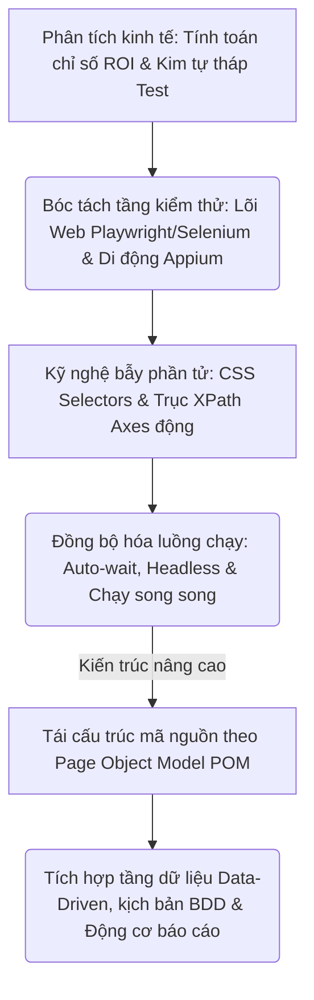
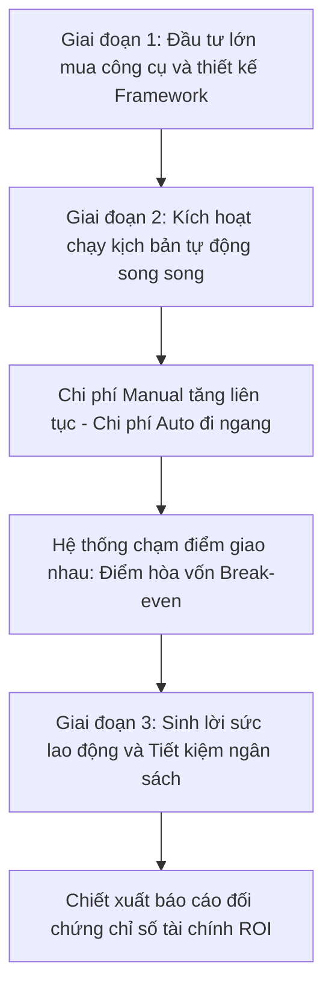
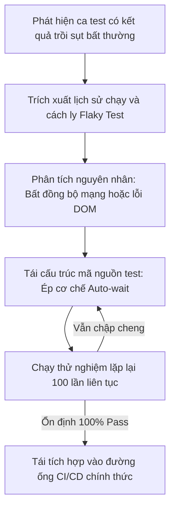

# 📁 09. Automation Testing (`09-automation-testing/`)

*Mục tiêu: Phát triển hệ thống kiểm thử tự động toàn diện, làm chủ kỹ nghệ thiết kế Locator động, bóc tách phân tầng kiến trúc Framework công nghiệp và làm chủ luồng điều khiển đa nền tảng (Web & Mobile).*

# **9.1. Automation Fundamentals**

## 📌 Mục lục nội bộ (Chặng 09)

- [ ] [**9.1. Automation Fundamentals**](./1_AutomationFundamentals.md)
  - [ ] [9.1.1. Why Automation Testing? ROI (Return on Investment) Calculation](#911-why-automation-testing-roi-return-on-investment-calculation)
  - [ ] [9.1.2. Flaky Tests Resolution & The Software Testing Pyramid](#912-flaky-tests-resolution--the-software-testing-pyramid)
- [ ] [**9.2. Automation Testing Levels**](./2_TestingLevels.md)
- [ ] [**9.3. Web Automation Tooling**](./3_WebAutomation.md)
- [ ] [**9.4. Mobile Automation Overview**](./4_MobileAutomation.md)
- [ ] [**9.5. Dynamic Locators Engineering**](./5_Locators.md)
- [ ] [**9.6. Core Automation Concepts**](./6_CoreConcepts.md)
- [ ] [**9.7. Test Automation Architecture / Framework**](./7_Framework.md)
---

## 🗺️ Bản đồ Tiến trình Xây dựng và Vận hành Hệ thống Kiểm thử Tự động hóa

Sơ đồ đơn sắc dưới đây mô tả chính xác lộ trình 5 bước phát triển tư duy kỹ sư Automation: Bắt đầu từ định lượng giá trị kinh tế ROI, bóc tách các tầng kiểm thử Web/Mobile chuyên sâu, làm chủ kỹ nghệ bẫy phần tử DOM động cho đến đóng gói kiến trúc Framework vạn năng:



---

# 9.1.1. Why Automation Testing? ROI (Return on Investment) Calculation

Trong hoạt động quản lý chất lượng dự án phần mềm, kiểm thử thủ công (Manual Testing) luôn gặp phải chốt chặn giới hạn về thời gian và sức lao động của con người khi quy mô sản phẩm mở rộng diện rộng. **Automation Testing (Kiểm thử tự động hóa)** ra đời như một chiến lược công nghệ nhằm tối ưu hóa chu kỳ phát hành sản phẩm. Tuy nhiên, để thuyết phục ban giám đốc phê duyệt ngân sách cho một dự án Automation, Tester không thể nói suông mà bắt buộc phải sử dụng công cụ định lượng tài chính tối cao: Chỉ số **ROI (Return on Investment - Tỷ suất hoàn vốn đầu tư)**.

> ⚠️ **Nguyên lý bẫy chi phí ban đầu (Initial Cost Illusion Principle):** Chi phí đầu tư ban đầu cho dự án Automation (bao gồm tiền bản quyền công cụ, giờ công thiết kế Framework) luôn cao hơn rất nhiều so với chi phí thuê nhân sự kiểm thử thủ công. Doanh nghiệp sẽ chỉ nhìn thấy giá trị kinh tế thực sự và điểm hòa vốn của Automation sau khi bộ kịch bản được kích hoạt lặp đi lặp lại qua nhiều chu kỳ hồi quy (Regression Cycles).

---

## 🛠️ Chu trình Tích lũy Giá trị Tài chính và Điểm Hòa vốn của Dự án Automation

Sơ đồ đơn sắc dưới đây mô tả chính xác con đường luân chuyển của dòng vốn: Chi phí Manual tăng tiến tuyến tính vô hạn theo thời gian, trong khi chi phí Automation đi ngang sau giai đoạn đầu tư ban đầu, tạo ra điểm cắt hòa vốn (Break-even Point):



---

## 📊 Ma trận Phân rã Động lực Tự động hóa và Mô hình Toán học tính toán ROI (QA Mindset)

Dưới đây là ma trận phân rã chi tiết các biến số tài chính cấu thành nên công thức định lượng giá trị kinh tế của dự án Automation, bóc tách theo cấu trúc vi mô thực chiến:

| Khía cạnh chiến lược | Thông số cấu trúc vi mô | Trọng tâm kiểm toán (QA Focus) | Kịch bản rủi ro thực chiến (Defect) |
| :--- | :--- | :--- | :--- |
| **1. WHY AUTOMATION<br>(Động lực cốt lõi)** | *Mục tiêu:* Giảm thiểu sai sót do yếu tố con người (*Human Errors*), tăng tốc độ phản hồi chất lượng và bao phủ toàn diện đa trình duyệt.<br><br>*Vai trò:* Tự động hóa các tác vụ lặp đi lặp lại có tính chất nhàm chán (Ví dụ: Điền biểu mẫu dữ liệu lớn). | **Tối ưu hóa vòng lặp Regression.** Đóng gói bộ test để robot tự động quét xuyên đêm, giải phóng sức lao động ban ngày cho Tester. | Bộ kịch bản bị vứt xó vô nghĩa do QA Lead lựa chọn tự động hóa một tính năng đang bị thay đổi giao diện liên tục theo ngày. |
| **2. MANUAL COST (M)<br>(Chi phí thủ công)** | *Công thức:* `M = (Thời gian chạy bằng tay) x (Số lần lặp lại) x (Giá giờ công của Tester)`. | **Định lượng công sức con người.** Tính toán tổng số giờ thực tế QA phải ngồi click tay qua nhiều phiên bản phát hành. | Dự án bị thất thoát ngân sách ẩn ngầm do không tính toán thời gian Tester ngồi thiết lập lại dữ liệu rác trước khi test. |
| **3. AUTOMATION COST (A)<br>(Chi phí tự động hóa)** | *Công thức:* `A = Chi phí phát triển ban đầu + Chi phí bảo trì code + Chi phí hạ tầng máy chủ chạy test`. | **Kiểm soát chi phí bảo trì (Maintenance).** Chặn đứng hiện tượng code test bị phình to, gây tốn giờ công sửa code khi UI đổi thiết kế. | Dự án Automation bị vỡ trận tài chính do code test viết quá kém, khiến thời gian sửa lỗi code test vượt quá thời gian test manual. |
| **4. ROI CALCULATION<br>(Tỷ suất hoàn vốn)** | *Công thức toán học tối cao:*<br>$\text{ROI} = \frac{\text{Chi phí Manual (M)} - \text{Chi phí Auto (A)}}{\text{Chi phí Auto (A)}} \times 100\%$ | **Chứng minh giá trị kinh tế.** Đưa ra chỉ số phần trăm chính xác để báo cáo ban giám đốc điểm hòa vốn của dự án. | Chỉ số ROI bị âm nặng nề ở năm đầu tiên do QA Lead vẽ ra kịch bản quá viển vông, mua bản quyền công cụ đắt đỏ không cần thiết. |

---

## 🧠 Chiến lược Thực chiến QA: Áp dụng công thức toán học lập bài toán kinh tế ROI

Hãy đóng vai một Chuyên gia Quản lý Chất lượng (QA Lead) thực hiện bài toán định lượng tài chính cho dự án của bạn: *Hệ thống chứa một bộ kịch bản kiểm thử hồi quy gồm **200 Test Cases**. Nếu chạy thủ công (Manual), một Tester mất **10 phút** cho 1 ca test. Dự án phát hành sản phẩm **24 lần/năm** (2 lần/tháng). Giá giờ công trung bình của một kỹ sư QA là **$15/giờ**.*

Tư duy phản biện toán học để bóc tách thông số và chứng minh hiệu quả kinh tế với doanh nghiệp:

1.  **Tính toán chi phí kiểm thử thủ công hàng năm (Manual Cost):**
    *   Tổng thời gian cho 1 lượt chạy: $200 \text{ ca} \times 10 \text{ phút} = 2000 \text{ phút} \approx 33.33 \text{ giờ}$.
    *   Tổng thời gian manual 1 năm: $33.33 \text{ giờ} \times 24 \text{ lần phát hành} = 800 \text{ giờ}$.
    *   $$\text{Chi phí Manual (M)} = 800 \text{ giờ} \times \$15 = \$12,000 \text{ / năm}.$$

2.  **Tính toán chi phí đầu tư Tự động hóa năm đầu tiên (Automation Cost):**
    *   Bạn cử một kỹ sư Automation mất **80 giờ công** để thiết kế Framework Playwright và code hoàn chỉnh 200 ca test này. Chi phí phát triển: $80 \text{ giờ} \times \$25 \text{ (giá giờ công kỹ sư Auto)} = \$2,000$.
    *   Chi phí bảo trì code test khi giao diện thay đổi dự kiến là **20 giờ công/năm**: $20 \text{ giờ} \times \$25 = \$500$.
    *   Chi phí hạ tầng máy chủ cloud chạy ẩn ngầm: $\$500 \text{ / năm}$.
    *   $$\text{Chi phí Auto (A)} = \$2,000 + \$500 + \$500 = \$3,000 \text{ / năm đầu tiên}.$$

3.  **Tính toán chỉ số hoàn vốn đầu tư ROI:**
    *   $$\text{ROI} = \frac{\$12,000 - \$3,000}{\$3,000} \times 100\% = 300\%.$$
    *   *Biện chứng kinh tế:* Chỉ số ROI đạt **300%** khẳng định hiệu quả kinh tế tăng gấp 3 lần. Điểm hòa vốn sẽ rơi vào chu kỳ phát hành thứ 6 (tức là sau 3 tháng vận hành). Kể từ tháng thứ 4 trở đi, doanh nghiệp sẽ tiết kiệm được hoàn toàn sức lao động của con người, giải phóng nhân sự để tập trung test các tính năng logic cao cấp hơn. Ban giám đốc lập tức ký lệnh phê duyệt dự án UI Automation.

---

## 📚 References
* [ISTQB® Certified Tester Foundation Level (CTFL) Syllabus v4.0](#references) - Section 6.1.1: Cost-Benefit Analysis and ROI of Test Automation Frameworks.
* [ISO/IEC/IEEE 29119-5:2016 Standard](#references) - Software Testing - Part 5: Test Automation Frameworks, Execution Metrics and Return on Investment Criteria.

# 9.1.2. Flaky Tests Resolution & The Software Testing Pyramid

Trong kỹ nghệ kiểm thử tự động hóa, việc sở hữu một bộ ca test chạy thiếu ổn định là một thảm họa tàn phá niềm tin của toàn bộ đội ngũ phát triển. **Flaky Tests (Ca kiểm thử chập chập cheng cheng)** là hiện tượng một ca test cho ra các kết quả khác nhau (lúc Pass, lúc Fail) trên cùng một phiên bản mã nguồn mà không có bất kỳ sự thay đổi logic nào. Để triệt tiêu tận gốc rễ vấn đề này, kỹ sư Automation bắt buộc phải làm chủ chiến lược giải quyết Flaky kết hợp cấu trúc phân tầng nghiêm ngặt của mô hình **The Software Testing Pyramid (Kim tự tháp kiểm thử)**.

> ⚠️ **Nguyên lý ô nhiễm bộ lọc an ninh (Automation Trust Erosion Principle):** Bản chất của Automation là bộ lọc an ninh tự động để phát hiện lỗi hồi quy nhanh chóng. Nếu bộ test suite dính lỗi Flaky bừa bãi, lập trình viên sẽ hình thành thói quen phớt lờ mọi cảnh báo báo đỏ (Fail), trực tiếp làm vô hiệu hóa hoàn toàn lá chắn bảo vệ chất lượng của doanh nghiệp.

---

## 🛠️ Chu trình Vòng lặp Kiểm toán và Cô lập Ca test Flaky (Flaky Test Mitigation Flow)

Sơ đồ đơn sắc dưới đây mô tả chính xác quy trình hành động của một QA Automation nhằm phát hiện, cách ly và xử lý triệt để một ca test dính lỗi chập cheng chập cheng trước khi đưa trở lại đường ống CI/CD:



---

## 📊 Ma trận Phân rã Chiến lược Kim tự tháp và Phương pháp xử lý Flaky (QA Mindset)

Dưới đây là ma trận phân rã chi tiết cấu trúc kim tự tháp Mike Cohn tiêu chuẩn và bộ giải pháp triệt tiêu lỗi Flaky, bóc tách theo quy chuẩn vi mô thực chiến:

| Khía cạnh kiến trúc | Định nghĩa phân rã vi mô | Trọng tâm kiểm toán (QA Focus) | Kịch bản lỗi điển hình thực chiến (Defect) |
| :--- | :--- | :--- | :--- |
| **1. UI / E2E Test Layer<br>(Đỉnh Kim tự tháp)** | Chiếm số lượng ít nhất (5% - 10%). Giả lập toàn bộ hành trình người dùng xuyên suốt qua giao diện đồ họa trình duyệt thật. | **Tập trung vào luồng sống còn.** Chỉ bao phủ các kịch bản cốt lõi (Happy Path) vì tầng này chạy chậm và dễ dính lỗi Flaky nhất. | Kịch bản mua hàng bị sập liên tục trên Jenkins do mạng lag làm nút bấm Thanh toán chưa kịp render xong vật lý trên UI. |
| **2. API / Integration<br>(Thân Kim tự tháp)** | Chiếm số lượng vừa phải (20% - 30%). Kiểm toán logic xử lý giao tiếp, ánh xạ dữ liệu và chốt chặn an ninh không qua giao diện. | **Xác thực logic nghiệp vụ siêu tốc.** Tốc độ chạy tính bằng mili-giây, độ ổn định cực cao, là bộ lọc hồi quy lý tưởng cho QA. | API trả về mã trạng thái sai lệch quy chuẩn (Ví dụ: Lỗi sập luồng tính tiền nhưng Header vẫn trả về mã `200 OK`). |
| **3. Unit Test Layer<br>(Đáy Kim tự tháp)** | Chiếm số lượng khổng lồ nhất (60% - 70%). Kiểm tra cô lập từng hàm logic, điều kiện ranh giới trong mã nguồn do Dev viết. | **Độ bền bỉ tuyệt đối.** Chạy trực tiếp trên RAM, cách ly hoàn toàn với mạng và DB, triệt tiêu 100% nguy cơ dính lỗi Flaky. | Hàm bóc tách chuỗi ngày tháng bị crash khi người dùng nhập năm nhuận do lập trình viên viết thiếu thuật toán bẫy lỗi. |
| **4. Flaky Resolution<br>(Giải pháp xử lý)** | Bộ quy tắc loại bỏ mã rác: (1) Cấm dùng Hard-wait (`sleep`), (2) Cô lập dữ liệu test sạch, (3) Định vị locator tĩnh tuyệt đối. | **Động hóa cơ chế đồng bộ.** Sử dụng các hàm chờ động thông minh (*Explicit / Auto-wait*) dựa vào trạng thái thực tế của cây DOM. | Kịch bản test liên tục bị sập ngầm do Tester lười biếng sử dụng chỉ số mảng cố định (`li:nth-child(1)`) để neo giữ phần tử động. |

---

## 🧠 Chiến lược Thực chiến QA: Phẫu thuật một ca Flaky Test kinh điển trên UI

Hãy tưởng tượng đường ống CI/CD của bạn báo lỗi Fail ở ca test Đăng nhập một cách ngẫu nhiên (chạy 5 lần thì 3 lần Pass, 2 lần Fail). Mã nguồn test thô ban đầu viết như sau:
```javascript
// Mã nguồn thô dính bẫy Flaky nghiêm trọng
await page.goto('https://qa.global');
await page.fill('#username', 'tester@qa.com');
await page.fill('#password', 'secret123');
await page.click('#submit-btn');
// Bẫy chí tử: Dừng cứng hệ thống 3 giây chờ tải trang Dashboard
await page.waitForTimeout(3000); 
expect(page.url()).toContain('/dashboard');
```

Tư duy phản biện của một kỹ sư Automation sắc bén để mổ xẻ điểm mù, bẻ gãy bẫy thời gian kết nối và tái cấu trúc mã nguồn đạt độ bất bại:

1.  **Vạch trần nguyên nhân gốc rễ (Root Cause):** Câu lệnh `await page.waitForTimeout(3000)` là thủ phạm gây ra Flaky. Nếu một ngày mạng của máy chủ CI/CD bị nghẽn nhẹ, trang Dashboard mất 3.1 giây để tải xong. Robot thức dậy ở giây thứ 3, thấy URL vẫn là trang login, lập tức ném lỗi Fail (Fail giả lập). Nếu mạng siêu nhanh mất 0.5 giây, robot vẫn ngồi im cắn RAM phí phạm 2.5 giây.
2.  **Tái cấu trúc mã nguồn theo chuẩn tuyệt đối an toàn:** Thay thế hàm chờ cứng bằng cơ chế chờ động thông minh dựa trên trạng thái hiển thị của phần tử đích đại diện cho trang mới:
    ```javascript
    // Phiên bản tối ưu hóa - Triệt tiêu 100% lỗi Flaky
    await page.goto('https://qa.global');
    await page.fill('#username', 'tester@qa.com');
    await page.fill('#password', 'secret123');
    
    // Kịch bản kích hoạt click vật lý song song chờ sự kiện điều hướng mạng hoàn tất
    await Promise.all([
      page.waitForURL('**/dashboard'), // Chờ động cho đến khi URL khớp cấu trúc mạng
      page.click('#submit-btn')
    ]);
    
    // Chốt chặn tối cao: Chờ cho một phần tử độc bản của trang Dashboard hiển thị hoàn toàn
    const welcomeHeader = page.locator('#welcome-message');
    await expect(welcomeHeader).toBeVisible({ timeout: 5000 });
    ```
    Bằng cách dịch chuyển trọng tâm kiểm thử xuống đáy kim tự tháp (Unit/API) và ép cơ chế đồng bộ động ở đỉnh UI, bộ test suite của bạn sẽ đạt độ bền vững tuyệt đối, khôi phục niềm tin chất lượng cho toàn bộ dự án.

---

## 📚 References
* [ISTQB® Certified Tester Foundation Level (CTFL) Syllabus v4.0](./1_AutomationFundamentals.md#references) - Section 6.1.2: Automation Test Pyramids, Flakiness Analysis and Maintenance Execution Risks.
* [Martin Fowler (2018) - Eradicating Non-Determinism in Tests / The Practical Test Pyramid](./1_AutomationFundamentals.md#references) - Engineering Framework Specifications for Deterministic Automation and Defect Isolation.

