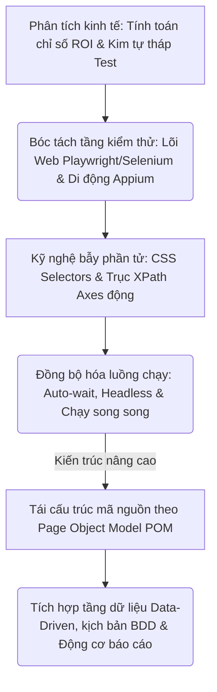
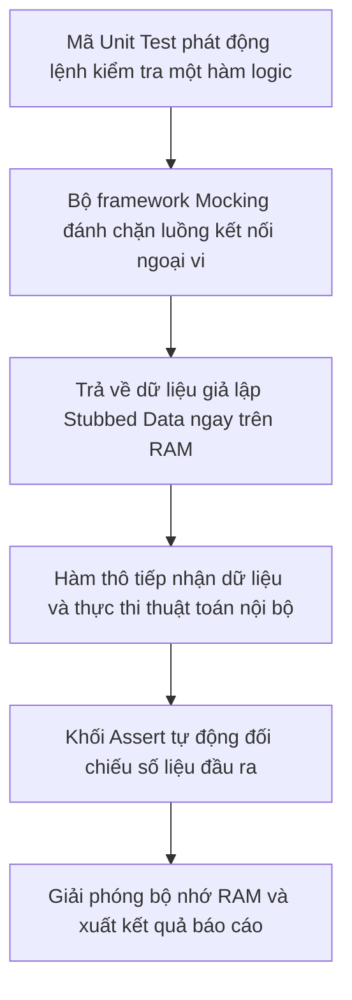
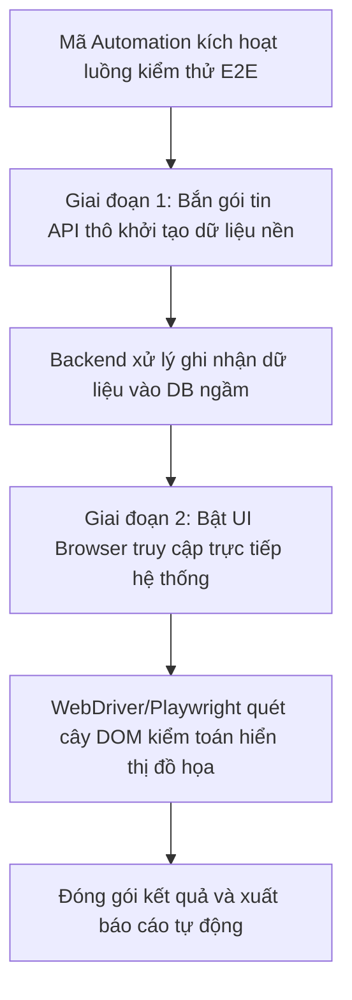

# 📁 09. Automation Testing (`09-automation-testing/`)

*Mục tiêu: Phát triển hệ thống kiểm thử tự động toàn diện, làm chủ kỹ nghệ thiết kế Locator động, bóc tách phân tầng kiến trúc Framework công nghiệp và làm chủ luồng điều khiển đa nền tảng (Web & Mobile).*

# **9.2. Automation Testing Levels**

## 📌 Mục lục nội bộ (Chặng 09)

- [ ] [**9.1. Automation Fundamentals**](./1_AutomationFundamentals.md)
- [ ] [**9.2. Automation Testing Levels**](./2_TestingLevels.md)
  - [ ] [9.2.1. Unit & Integration Testing Automation](#921-unit--integration-testing-automation)
  - [ ] [9.2.2. API & UI / E2E Automation Testing](#922-api--ui--e2e-automation-testing)
- [ ] [**9.3. Web Automation Tooling**](./3_WebAutomation.md)
- [ ] [**9.4. Mobile Automation Overview**](./4_MobileAutomation.md)
- [ ] [**9.5. Dynamic Locators Engineering**](./5_Locators.md)
- [ ] [**9.6. Core Automation Concepts**](./6_CoreConcepts.md)
- [ ] [**9.7. Test Automation Architecture / Framework**](./7_Framework.md)
---

## 🗺️ Bản đồ Tiến trình Xây dựng và Vận hành Hệ thống Kiểm thử Tự động hóa

Sơ đồ đơn sắc dưới đây mô tả chính xác lộ trình 5 bước phát triển tư duy kỹ sư Automation: Bắt đầu từ định lượng giá trị kinh tế ROI, bóc tách các tầng kiểm thử Web/Mobile chuyên sâu, làm chủ kỹ nghệ bẫy phần tử DOM động cho đến đóng gói kiến trúc Framework vạn năng:



---
# 9.2.1. Unit & Integration Testing Automation

Trong kiến trúc phân tầng của Kim tự tháp kiểm thử, việc đảm bảo chất lượng ngay từ lớp mã nguồn thô là chốt chặn quan trọng nhất để ngăn ngừa lỗi phát tán ra diện rộng. **Unit Testing Automation (Tự động hóa kiểm thử đơn vị)** và **Integration Testing Automation (Tự động hóa kiểm thử tích hợp)** là hai lớp phòng thủ đầu tiên, vận hành sát sườn với logic mã nguồn của lập trình viên. Làm chủ hai cấp độ kiểm thử này giúp Tester hộp xám bóc tách, cô lập và bẻ gãy các lỗi thuật toán hoặc lỗi giao tiếp giữa các module nội bộ trước khi hệ thống được đóng gói thành phẩm.

> ⚠️ **Nguyên lý cô lập phụ thuộc ngoại vi (Dependency Isolation Principle):** Bản chất của Unit Test là kiểm tra logic cô lập tuyệt đối của một hàm thô trên RAM. Mọi hành vi kết nối trực tiếp xuống Database vật lý hoặc gọi API bên ngoài (Third-party) trong quá trình chạy Unit Test đều vi phạm quy chuẩn kiến trúc nghiêm ngặt. QA bắt buộc phải sử dụng kỹ thuật giả lập phản hồi (Mocking/Stubbing) để bẻ gãy và cô lập hoàn toàn các thành phần phụ thuộc này.

---

## 🛠️ Luồng Khởi tạo, Giả lập và Thực thi Kiểm thử Đơn vị Tự động (Mocking Lifecycle)

Sơ đồ đơn sắc dưới đây mô tả chính xác cách thức một ca Unit Test tự động can thiệp, sử dụng công cụ Mock để đánh chặn luồng phụ thuộc ngoại vi và ép hàm thực thi logic cô lập:



---

## 📊 Ma trận Phân rã Kỹ thuật Tự động hóa Kiểm thử Đơn vị và Tích hợp (QA Mindset)

Dưới đây là ma trận phân rã chi tiết hai cấp độ kiểm thử hộp xám đầu đáy kim tự tháp, bóc tách theo quy chuẩn vi mô thực chiến:

| Cấp độ Kiểm thử | Thành phần cô lập ngầm | Trọng tâm tự động hóa (QA Focus) | Kịch bản lỗi điển hình thực chiến (Defect) |
| :--- | :--- | :--- | :--- |
| **1. Unit Automation<br>(Kiểm thử Đơn vị)** | Cô lập ở cấp độ Hàm (*Functions*), Phương thức (*Methods*) hoặc Lớp (*Classes*). Chạy trực tiếp trên RAM máy tính với tốc độ mili-giây. | **Độ bao phủ mã nguồn (Code Coverage).** Sử dụng các công cụ như `JaCoCo`, `Coverage.py` để quét mọi nhánh logic điều kiện (`if/else`). | Hàm xử lý tính toán lãi suất ngân hàng ném ra ngoại lệ số học do lập trình viên viết thiếu điều kiện bẫy lỗi chia cho số 0. |
| **2. Integration Auto<br>(Kiểm thử Tích hợp)** | Tập trung vào ranh giới giao tiếp giao thức giữa 2 hoặc nhiều module nội bộ (Ví dụ: Module Giỏ hàng kết nối sang Module Kho hàng). | **Thẩm định khế ước giao tiếp (Contracts).** Kiểm tra tính đồng bộ của kiểu dữ liệu, tham số truyền tải luân chuyển giữa các lớp phần mềm. | Hệ thống bị đóng băng hoàn toàn do Module A truyền tham số dạng chuỗi `STRING` nhưng Module B lại cấu hình bắt buộc nhận số `INT`. |
| **3. Mocking & Stubbing<br>(Kỹ thuật giả lập)** | Sử dụng các Framework chuyên dụng (`Mockito` trong Java, `unittest.mock` trong Python) để tạo ra các thực thể giả thế chỗ cho DB/API thật. | **Giả lập ca biên độc hại.** Ép thành phần ngoại vi giả lập ném ra các lỗi Timeout, sập mạng để test khả năng bẫy ngoại lệ của hàm. | Khối hàm Backend bị crash sập nguồn tiến trình do lập trình viên quên viết khối lệnh `try-catch` khi kết nối API đối tác bị Timeout. |

---

## 🧠 Chiến lược Thực chiến QA: Thiết kế kịch bản Unit Test cô lập dùng Mockito

Hãy tưởng tượng bạn đang viết mã tự động hóa kiểm thử đơn vị cho một hàm tính tổng tiền hóa đơn `OrderService.calculateTotal(orderId)`. Hàm này có một điểm mù: Nó bắt buộc phải gọi sang một dịch vụ ngoại vi khác là `PaymentGateway.getTaxRate(country)` để lấy tỷ lệ thuế từ internet.

Tư duy phản biện của một kỹ sư Automation sắc bén để thiết kế khối mã nguồn Java sử dụng framework Mockito nhằm cô lập tài nguyên, bẻ gãy phụ thuộc và thực thi ca test biên an toàn:

```java
import static org.mockito.Mockito.*;
import static org.testng.Assert.*;
import org.testng.annotations.Test;

public class OrderServiceUnitTest {

    @Test
    public void verifyInvoiceCalculationWithMockedTax() {
        // Bước 1: Khởi tạo thực thể giả lập hoàn toàn cho dịch vụ ngoại vi
        PaymentGateway mockGateway = mock(PaymentGateway.class);
        
        // Kỹ thuật Stubbing: Ép thực thể giả phải trả về tỷ lệ thuế 10% cố định khi được gọi
        when(mockGateway.getTaxRate("VN")).thenReturn(0.10);
        
        // Bước 2: Nạp thực thể giả lập vào hàm Service cần kiểm thử thô
        OrderService orderService = new OrderService(mockGateway);
        
        // Bước 3: Thực thi luồng chạy thô với dữ liệu biên đầu vào
        double actualTotal = orderService.calculateTotal(100.0, "VN"); // Giá gốc 100\$, thuế 10%
        
        // Chốt chặn khẳng định toán học đối chứng tự động
        assertEquals(actualTotal, 110.0, "Sai lệch toán học trong logic tính tổng hóa đơn!");
        
        // Kiểm toán hậu kỳ: Xác thực hàm getTaxRate thực sự được gọi đúng 1 lần duy nhất
        verify(mockGateway, times(1)).getTaxRate("VN");
    }
}
```

Tư duy phản biện đỉnh cao: Nếu bạn không sử dụng kỹ thuật Mock ở đoạn code trên mà cố chấp gọi sang `PaymentGateway` thật của đối tác. Vào một ngày máy chủ đối tác bảo trì, ca test của bạn sẽ bị báo đỏ **FAIL** lập tức. Hậu quả là đường ống CI/CD bị chặn đứng mặc dù mã nguồn tính tổng tiền của bạn hoàn toàn viết đúng đặc tả (Lỗi Flaky Test). Sử dụng Mockito giúp bộ ca test đạt độ bền bỉ 100%, chạy độc lập, cô lập tuyệt đối với biến động của môi trường mạng bên ngoài.

---

## 📚 References
* [ISTQB® Certified Tester Foundation Level (CTFL) Syllabus v4.0](./1_AutomationFundamentals.md#references) - Section 2.2.1: Component Testing & Section 2.2.2: Component Integration Testing Automation Frameworks.
* [Mockito Architecture Project Guidelines](./1_AutomationFundamentals.md#references) - Core Specifications for Test Stubs, Mocks Creation and Behavioral Verification.

# 9.2.2. API & UI / E2E Automation Testing

Trong kỹ nghệ thiết kế Framework tự động hóa, việc phân định rạch ròi bản chất vận hành giữa **API Automation Testing (Tự động hóa tầng cổng dịch)** và **UI / E2E Automation Testing (Tự động hóa giao diện đầu cuối)** là mắt xích quyết định hiệu năng của toàn bộ hệ thống. Hiểu sâu ma trận khác biệt kỹ thuật này giúp kỹ sư Automation phân bổ chính xác kịch bản bao phủ luồng nghiệp vụ, chặn đứng bẫy lãng phí tài nguyên máy chủ và tối ưu hóa thời gian phản hồi chất lượng.

> ⚠️ **Nguyên lý ranh giới kiểm toán luồng dữ liệu (Data vs Visual Boundary Principle):** Tầng API xử lý logic nghiệp vụ lõi qua các gói dữ liệu thuần túy, trong khi tầng UI render đồ họa giao diện trực quan cho người dùng. Việc cố chấp dùng mã tự động hóa UI để kiểm thử toàn bộ các ca test biên logic (Validation Rules) thay vì đẩy xuống tầng API là nguyên nhân hàng đầu gây lãng phí hàng nghìn giờ chạy CI/CD vô ích.

---

## 🛠️ Luồng Thực thi Tích hợp liên tầng từ Giao tiếp API đến Trực quan hóa UI (E2E Integration Flow)

Sơ đồ đơn sắc dưới đây mô tả chính xác con đường luân chuyển gói tin: Client gọi API tạo trạng thái ngầm dưới DB, sau đó động cơ UI Driver kích hoạt trình duyệt kiểm toán hiển thị trực quan:



---

## 📊 Ma trận Đối chứng Kỹ thuật Tự động hóa API và UI/E2E (QA Mindset)

Dưới đây là ma trận phân rã chi tiết các tiêu chí kỹ thuật phân cấp giữa hai tầng kiểm thử tự động, bóc tách theo quy chuẩn vi mô thực chiến:

| Tiêu chí kỹ thuật | API Automation Testing (Tự động hóa tầng dịch) | UI / E2E Automation Testing (Tự động hóa giao diện) |
| :--- | :--- | :--- |
| **Giao thức truyền thông** | Giao tiếp trực tiếp bằng HTTP REST, gRPC, SOAP, GraphQL qua Payload JSON/XML thô. | Giả lập hành vi thông qua trình điều khiển mạng, thao tác trực tiếp lên cây cấu trúc DOM HTML. |
| **Tốc độ thực thi** | Cực tốc: Tính bằng mili-giây cho một request thô, không tốn RAM khởi chạy giao diện đồ họa. | Chậm chạp: Tính bằng giây cho một hành động, tiêu tốn tài nguyên phần cứng để render điểm ảnh. |
| **Độ bền bỉ kịch bản** | Bất biến: Kháng 100% lỗi Flaky do biến động màu sắc, banner hay sự đổi ngôi của CSS Style. | Nhạy cảm: Dễ bị gãy kịch bản khi Frontend thay đổi cấu trúc định danh hoặc cập nhật thư viện UI. |
| **Trọng tâm kiểm thử<br>(QA Focus)** | Kiểm toán tính toàn vẹn dữ liệu, các kịch bản bẫy lỗi biên nghiệp vụ, mã trạng thái và an ninh xác thực. | Kiểm toán hành trình người dùng xuyên suốt (*User Journeys*), tính tương thích đồ họa và luồng logic e2e sống còn. |
| **Kịch bản lỗi điển hình<br>(Defect)** | Lập trình viên Backend map sai biến khiến payload JSON trả về khuyết thuộc tính bắt buộc. | Frontend render che khuất nút bấm vật lý trên màn hình, chặn đứng luồng thanh toán của khách. |

---

## 🧠 Chiến lược Thực chiến QA: Phối hợp API và UI bẻ gãy bẫy thời gian chạy (Setup Data Optimization)

Một kỹ sư Automation thực chiến cấp cao không bao giờ tạo dữ liệu kiểm thử bằng cách lười biếng bắt robot UI ngồi click chuột điền từng form đăng ký đại lý, form cấu hình sản phẩm trước khi vào luồng test chính. Hành vi này làm tăng nguy cơ Flaky và tàn phá thời gian thực thi của dự án.

Tư duy phản biện của một Tester sắc bén để thiết kế kịch bản phối hợp liên tầng không tì vết (Sử dụng Framework lai):

*   **Bước 1 - Khởi tạo siêu tốc bằng API (Tầng Thân kim tự tháp):** Bạn cần test kịch bản: *Mua sản phẩm X bằng tài khoản thành viên VIP*. Thay vì dùng UI để đăng ký user, đăng nhập, nạp tiền, tạo sản phẩm (Mất 2 phút), bạn viết script bắn liên hoàn 3 request API thô gửi thẳng lên Server:
    1. `POST /api/v1/users` -> Tạo nhanh user VIP.
    2. `POST /api/v1/wallets/deposit` -> Nạp sẵn 10,000\$ vào tài khoản ngầm.
    3. `POST /api/v1/products` -> Khởi tạo nhanh sản phẩm X trong kho.
    *Toàn bộ chu trình khởi tạo dữ liệu sạch này được Server thực thi trực tiếp dưới DB trong vòng đúng **300 mili-giây**.*
*   **Bước 2 - Đột kích bằng UI Automation (Tầng Đỉnh kim tự tháp):** Lấy chuỗi Token bảo mật vừa sinh ra ở Bước 1 nạp thẳng vào Cookie của trình duyệt (Bypass qua trang đăng nhập). Ra lệnh cho robot lao thẳng vào màn hình thanh toán chi tiết:
    ```javascript
    // Luồng UI tinh gọn - Không chứa thao tác thừa rác
    await page.context().addCookies([{ name: 'auth_token', value: tokenFromApi, domain: 'test.global' }]);
    await page.goto('https://test.global' + productIdFromApi);
    await page.click('#btn-place-order');
    await expect(page.locator('.success-alert')).toBeVisible();
    ```
    Chiến lược phối hợp "Đấm ngầm bằng API - Dứt điểm bằng UI" giúp rút ngắn thời gian chạy bộ kịch bản từ 3 giờ xuống còn 5 phút, triệt tiêu hoàn toàn lỗi Flaky và đưa độ bền vững của Framework lên mức tối đa.

---

## 📚 References
* [ISTQB® Certified Tester Foundation Level (CTFL) Syllabus v4.0](./1_AutomationFundamentals.md#references) - Section 2.2.3: Integration Testing vs End-to-End System Integration Automation Frameworks.
* [W3C Architecture Web Recommendation - System Integration Testing Principles](./1_AutomationFundamentals.md#references) - Technical Specifications for Cross-layer Message Intercom and E2E Test Strategy.
