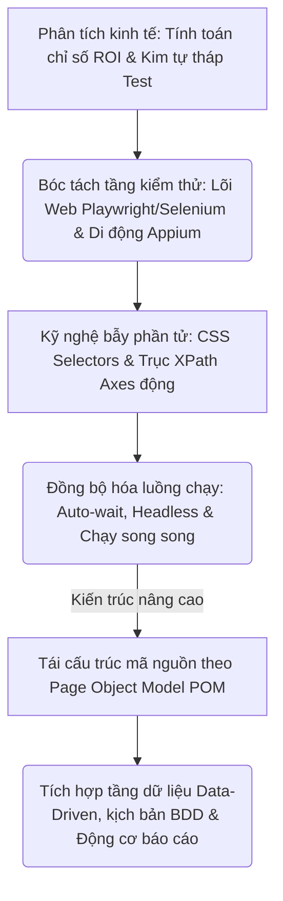
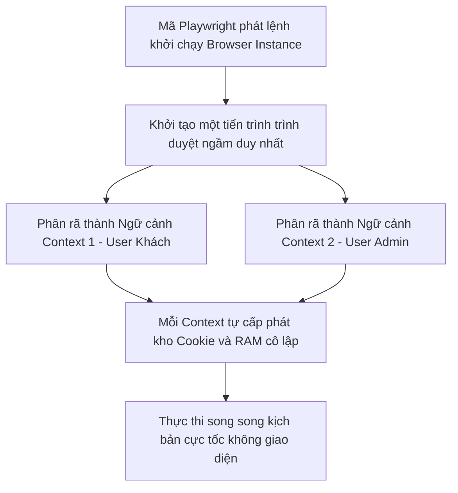
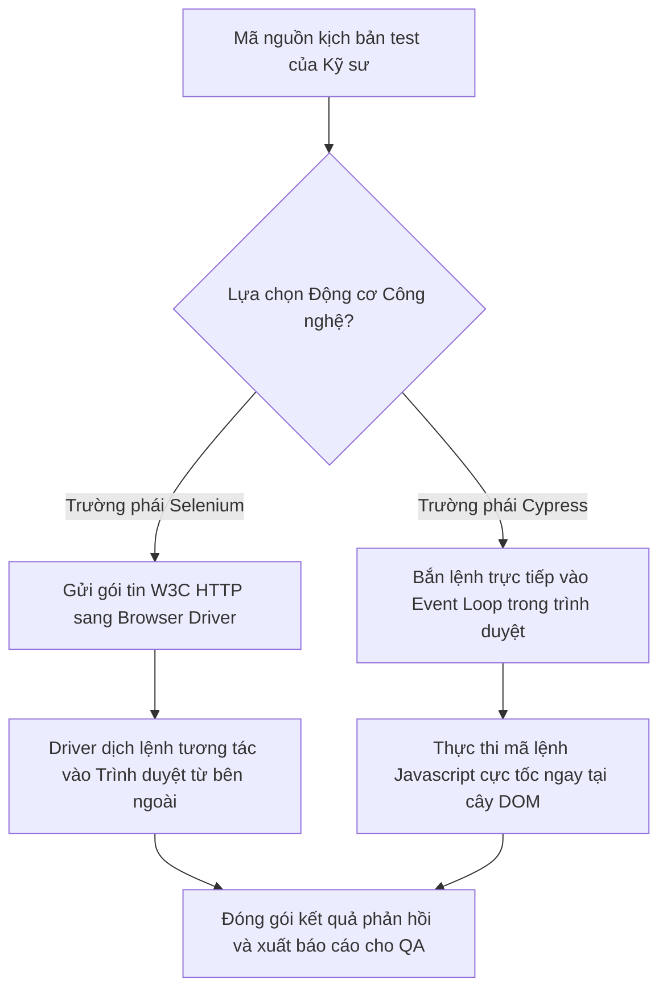

# 📁 09. Automation Testing (`09-automation-testing/`)

*Mục tiêu: Phát triển hệ thống kiểm thử tự động toàn diện, làm chủ kỹ nghệ thiết kế Locator động, bóc tách phân tầng kiến trúc Framework công nghiệp và làm chủ luồng điều khiển đa nền tảng (Web & Mobile).*

# **9.3. Web Automation Tooling**

## 📌 Mục lục nội bộ (Chặng 09)

- [ ] [**9.1. Automation Fundamentals**](./1_AutomationFundamentals.md)
- [ ] [**9.2. Automation Testing Levels**](./2_TestingLevels.md)
- [ ] [**9.3. Web Automation Tooling**](./3_WebAutomation.md)
  - [ ] [9.3.1. Playwright Framework In-Depth](./3_WebAutomation.md#931-playwright-framework-in-depth)
  - [ ] [9.3.2. Selenium WebDriver & Cypress Architecture](./3_WebAutomation.md#932-selenium-webdriver--cypress-architecture)
- [ ] [**9.4. Mobile Automation Overview**](./4_MobileAutomation.md)
- [ ] [**9.5. Dynamic Locators Engineering**](./5_Locators.md)
- [ ] [**9.6. Core Automation Concepts**](./6_CoreConcepts.md)
- [ ] [**9.7. Test Automation Architecture / Framework**](./7_Framework.md)

---

## 🗺️ Bản đồ Tiến trình Xây dựng và Vận hành Hệ thống Kiểm thử Tự động hóa

Sơ đồ đơn sắc dưới đây mô tả chính xác lộ trình 5 bước phát triển tư duy kỹ sư Automation: Bắt đầu từ định lượng giá trị kinh tế ROI, bóc tách các tầng kiểm thử Web/Mobile chuyên sâu, làm chủ kỹ nghệ bẫy phần tử DOM động cho đến đóng gói kiến trúc Framework vạn năng:



---

# 9.3.1. Playwright Framework In-Depth

Trong kỷ nguyên của các ứng dụng Single Page Applications (SPA) phức tạp, **Playwright** (phát triển bởi Microsoft) đã bứt phá trở thành thế lực công nghiệp dẫn đầu xu hướng thiết kế Framework tự động hóa. Khác biệt hoàn toàn với các công nghệ cũ phụ thuộc vào giao thức HTTP trung gian, Playwright thiết lập một kết nối giao tiếp trực tiếp, hai chiều đến nhân trình duyệt. Làm chủ cấu trúc kiến trúc và các tính năng tối tân của Playwright giúp kỹ sư Automation bẻ gãy mọi rào cản bất đồng bộ, đưa hiệu năng thực thi kịch bản lên mức cực đại.

> ⚠️ **Nguyên lý kết nối hai chiều thời gian thực (WebSocket & CDP Principle):** Playwright vận hành ngầm dựa trên một kết nối **WebSocket** duy nhất, truyền tải trực tiếp các câu lệnh thông qua giao thức nội bộ của trình duyệt (như Chrome DevTools Protocol - CDP). Cơ chế phi trạng thái, không chặn (*Non-blocking Async*) này cho phép robot nghe và bắt trọn mọi sự kiện thay đổi của cây DOM một cách tức thời mà không cần tốn tài nguyên quét vòng lặp dò tìm từ đầu.

---

## 🛠️ Luồng Khởi tạo và Cô lập Phiên làm việc Đa nhiệm của Động cơ Playwright

Sơ đồ đơn sắc dưới đây mô tả chính xác cách thức Playwright tối ưu hóa bộ nhớ RAM bằng cách khởi tạo một Instance Browser duy nhất nhưng phân rã thành nhiều ngữ cảnh cô lập (*BrowserContext*) độc lập tuyệt đối để chạy song song kịch bản:



---

## 📊 Ma trận Phân rã Kỹ thuật Đặc tính Lõi của Hệ sinh thái Playwright (QA Mindset)

Dưới đây là ma trận bóc tách chi tiết 4 mũi nhọn công nghệ độc bản giúp Playwright triệt tiêu tặn gốc các điểm mù kiểm thử giao diện, bóc tách theo quy chuẩn vi mô thực chiến:

| Tính năng lõi Playwright | Bản chất vận hành ngầm của Hệ thống | Trọng tâm kiểm toán (QA Focus) | Kịch bản lỗi điển hình thực chiến (Defect) |
| :--- | :--- | :--- | :--- |
| **1. BrowserContext<br>Isolation** | Tạo ra một phân vùng bộ nhớ siêu nhẹ mô phỏng một trình duyệt ẩn danh hoàn toàn mới ngay trong tiến trình gốc, không tốn tài nguyên mở thêm cửa sổ hệ điều hành. | **Kiểm thử đa vai trò đồng thời.** Chạy kịch bản đăng nhập tài khoản Khách hàng và tài khoản Người duyệt đơn song song trên cùng 1 máy để test luồng real-time. | Bộ ca test tự động bị lỗi nhiễm độc dữ liệu phiên (*Session Pollution*) do Framework cấu hình dùng chung bộ nhớ Cookie rác giữa các luồng chạy. |
| **2. Auto-wait Engine** | Động cơ tự động thực hiện chuỗi 5 chốt chặn an ninh (*Actionability Checks*): `Attached`, `Visible`, `Stable` (Hoạt họa CSS đã dừng), `Enabled`, `Receive Events`. | **Loại bỏ hoàn toàn lệnh Wait thủ công.** Tester chỉ cần gõ lệnh Click/Type, Playwright tự động lo phần đồng bộ thời gian thực. | Ca test bị đánh sập do robot cố tình tương tác với một nút bấm đang bị che khuất bởi một màn hình chờ (Loading Spinner) chưa mờ hết. |
| **3. Codegen & Inspector** | Bộ sinh mã nguồn tự động thông minh bằng cách theo dõi tọa độ click chuột vật lý của Tester và dịch chuyển thành chuỗi định vị Locator tối ưu. | **Tăng tốc độ dựng kịch bản.** Sử dụng Codegen để trích xuất nhanh cấu trúc Selectors chuẩn, tinh gọn, loại bỏ hành vi viết XPath thủ công dài dòng. | Cú pháp sinh tự động bị rườm rã, bám vào các Class đồ họa động biến đổi liên tục, gây gãy xích kịch bản khi đổi giao diện. |
| **4. Trace Viewer** | Hệ thống "hộp đen" ghi lại toàn bộ hành vi: Chụp ảnh dòng thời gian, quay video, trích xuất log mạng (Network) và trạng thái cây DOM tại mỗi tích tắc. | **Cô lập nguyên nhân gốc (Post-mortem).** Khi ca test sập trên CI/CD, xuất file `trace.zip` để QA mở lên tua lại chính xác khoảnh khắc ném lỗi. | Lỗi sập kịch bản bí ẩn xuất hiện trên môi trường Linux ngầm của Jenkins nhưng không thể debug do Tester quên bật cờ lưu trữ Trace log. |

---

## 🧠 Chiến lược Thực chiến QA: Vận hành Tracing giải mã lỗi câm trên CI/CD Pipeline

Một kỹ sư Automation sắc bén tuyệt đối không bao giờ ngồi đoán mò nguyên nhân khi một ca test chạy mượt mà ở máy cá nhân (Local) nhưng lại lăn đùng ra báo đỏ **FAIL** khi đẩy lên đường ống CI/CD. Bạn bắt buộc phải cấu hình tính năng **Tracing** để bốc tách chính xác điểm chết của mã nguồn Backend.

Tư duy phản biện của một Tester thực chiến để cấu hình và phân tích file Trace cứu nguy cho dự án (Viết bằng TypeScript):

1.  **Cấu hình tự động lưu vết khi lỗi (playwright.config.ts):**
    ```typescript
    import { defineConfig } from '@playwright/test';
    export default defineConfig({
      testDir: './tests',
      fullyParallel: true, // Ép động cơ chạy song song bất đồng bộ tối đa công suất
      use: {
        headless: true, // Chạy ẩn danh không giao diện để tối ưu RAM máy chủ cloud
        trace: 'retain-on-failure', // Chỉ xuất file trace.zip duy nhất khi ca test bị đánh sập
        screenshot: 'only-on-failure',
      },
    });
    ```
2.  **Khai thác tệp điều tra lỗi (Post-mortem Investigation):** Ca test tạo đơn hàng bị sập trên GitHub Actions. Hệ thống chiết xuất ra file tệp tin rác lỗi `trace.zip`. Bạn tải về máy, mở Terminal lên gõ câu lệnh tối cao:
    ```bash
    npx playwright show-trace path/to/trace.zip
    ```
3.  **Vạch lá tìm siêu Bug:** Giao diện đồ họa Trace Viewer của Playwright mở ra hiển thị 3 vùng thông tin độc lập:
    *   *Trục thời gian (Timeline View):* Chỉ rõ ở giây thứ 4.2, robot thực hiện hành động Click vào nút "Xác nhận đơn hàng". Giao diện bị đứng hình.
    *   *Tab Network:* Phơi bày gói tin API thô `POST /api/v1/orders` đổ đỏ lòm với mã lỗi `500 Internal Server Error`.
    *   *Kết luận Bug đanh thép:* Tầng hiển thị đồ họa UI hoàn toàn viết đúng locator, kịch bản gãy là do mã nguồn Backend dính ngoại lệ con trỏ rỗng (`NullPointerException`) dưới Database đúng vào thời khắc robot truyền lực bấm nút. Lỗi được định vị nguyên nhân gốc rễ lập tức, chặn đứng mọi hành vi đùn đẩy trách nhiệm giữa đội ngũ Frontend và Backend.

---

## 📚 References
* [ISTQB® Certified Tester Foundation Level (CTFL) Syllabus v4.0](./1_AutomationFundamentals.md#references) - Section 6.2.2: Test Automation Engineering Frameworks and Modern Execution Infrastructure (Async & Tooling Setup).
* [Playwright Official Documentation by Microsoft - Core Concepts & Architecture](./1_AutomationFundamentals.md#references) - Global Specifications for BrowserContext Isolation, Actionability Checks, and Tracing Engines.

# 9.3.2. Selenium WebDriver & Cypress Architecture

Để xây dựng một hệ thống kiểm thử tự động hóa bền vững, kỹ sư Automation không thể lựa chọn công cụ chỉ dựa trên xu hướng bề nổi. Bạn bắt buộc phải thấu hiểu bản chất kiến trúc vật lý ngầm của hai tượng đài **Selenium WebDriver** và **Cypress**. Việc phân rã mô hình giao tiếp liên tầng (chuẩn W3C của Selenium so với cơ chế chạy trực tiếp trong nhân trình duyệt của Cypress) giúp QA nhận diện rõ ràng điểm mạnh, điểm mù và giới hạn vận hành của từng công cụ trong môi trường thực chiến.

> ⚠️ **Nguyên lý ranh giới vận hành và bất đồng bộ mạng (Execution Context & Network Principle):** Selenium vận hành như một thực thể độc lập bên ngoài trình duyệt, gửi lệnh điều khiển từ xa qua giao thức HTTP REST. Ngược lại, Cypress cư trú trực tiếp bên trong vòng lặp sự kiện (Event Loop) của trình duyệt. Sự khác biệt cốt lõi này định hình toàn bộ khả năng kiểm soát mạng kết nối, tốc độ xử lý và độ bền bỉ chống Flaky của bộ kịch bản.

---

## 🛠️ Luồng Giao tiếp Kiến trúc của Động cơ Selenium so với Cypress (Architecture Intercom)

Sơ đồ đơn sắc dưới đây mô tả chính xác ranh giới giao tiếp: Luồng chạy của Selenium phải bắc cầu qua lớp Driver trung gian, trong khi Cypress hòa mạng trực tiếp vào tiến trình thực thi của trình duyệt:



---

## 📊 Ma trận Phân rã Kiến trúc Vật lý Selenium WebDriver và Cypress (QA Mindset)

Dưới đây là ma trận đối chứng chi tiết các tiêu chí cấu trúc hạ tầng ngầm của hai công cụ, phân rã theo góc nhìn bóc tách lỗi hệ thống của chuyên gia:

| Tiêu chí kiến trúc | Selenium WebDriver (Tượng đài W3C) | Cypress Architecture (Trường phái In-Browser) |
| :--- | :--- | :--- |
| **Vị trí cư trú vật lý** | **Bên ngoài trình duyệt (Out-of-Process).** Giao tiếp liên mạng thông qua các tệp nền trung gian (`chromedriver`, `geckodriver`). | **Bên trong trình duyệt (In-Process).** Chạy chung một tiến trình Node.js và một vòng lặp sự kiện với ứng dụng Web. |
| **Giao thức truyền thông** | Tuân thủ nghiêm ngặt chuẩn quốc tế **W3C WebDriver Protocol** qua các gói tin HTTP REST Request thô. | Giao tiếp trực tiếp bằng mã JavaScript cấp thấp, kết hợp can thiệp sâu vào tầng mạng Proxy nội bộ của Node.js. |
| **Độ phủ đa trình duyệt** | Tuyệt đối: Hỗ trợ 100% các trình duyệt (Chrome, Firefox, Safari, Edge, IE) và mọi ngôn ngữ (Java, Python, C#, JS). | Giới hạn: Chỉ hỗ trợ các trình duyệt nhân Chromium (Chrome, Edge) và Firefox. Ép buộc viết code bằng duy nhất **JavaScript/TypeScript**. |
| **Khả năng đánh chặn mạng** | Kém: Phải cấu hình phức tạp qua thư viện bên thứ ba (như BrowserMob Proxy) để đọc log gói tin API ngầm. | Hoàn hảo: Cung cấp sẵn cơ chế `cy.intercept()` để nghe, bắt, chỉnh sửa và giả lập dữ liệu API Response theo thời gian thực. |
| **Trọng tâm kiểm thử<br>(QA Focus)** | **Lỗi rò rỉ Driver.** Kiểm toán việc giải phóng tài nguyên hệ thống vật lý. Tránh lỗi treo tiến trình rác dưới RAM khi chạy CI/CD. | **Lỗi rách ranh giới iframe.** Thận trọng bẫy lỗi khi kịch bản test nhảy qua các trang web thuộc Domain khác nhau (Multi-domain). |
| **Ngoại lệ điển hình<br>(Defect)** | `SessionNotCreatedException` do lệch phiên bản giữa file `chromedriver` và phần mềm Chrome vật lý của máy. | `CypressError` gãy kịch bản do robot cố tình truy cập sang một liên kết thuộc tên miền của bên thứ ba không cùng nguồn gốc. |

---

## 🧠 Chiến lược Thực chiến QA: Lựa chọn công cụ bẻ gãy điểm mù dự án

Một kiến trúc sư Automation thực chiến luôn tỉnh táo bóc tách bài toán nghiệp vụ của doanh nghiệp để chọn đúng vũ khí, tránh cạm bẫy "thấy công cụ mới là đập đi xây lại" gây lãng phí hàng nghìn giờ công:

*   **Kịch bản ép buộc sử dụng Selenium WebDriver:** Hệ thống của bạn là một nền tảng ERP nội bộ của ngân hàng lớn, người dùng bắt buộc phải sử dụng trình duyệt Safari trên macOS và các máy tính bảng chuyên dụng. Đồng thời, toàn bộ Framework tự động hóa cũ của tập đoàn đang viết bằng ngôn ngữ Java để đồng bộ với mã nguồn của Dev. QA Lead lập tức đưa ra quyết định: **Khai báo Selenium WebDriver làm cốt lõi**. Khả năng bao phủ đa ngôn ngữ và đa trình duyệt của Selenium là bất bại trong môi trường doanh nghiệp lớn (Enterprise).
*   **Kịch bản ưu tiên sử dụng Cypress:** Dự án đang phát triển một ứng dụng thương mại điện tử bằng React tốc độ cao. Luồng test yêu cầu QA phải giả lập liên tục các kịch bản biên độc hại của API phản hồi (Ví dụ: Giả lập API trả về lỗi `502 Bad Gateway` hoặc trễ mạng 10 giây xem giao diện hiển thị thế nào). QA Automation thực chiến lập tức chọn **Cypress**:
    ```javascript
    // Kịch bản Cypress đánh chặn và bẻ gãy ranh giới mạng mạng cực tốc
    cy.intercept('GET', '/api/v1/products', {
      statusCode: 502,
      body: { error: 'Hạ tầng hệ thống đang bảo trì định kỳ' }
    }).as('getProductsStub');
    
    cy.visit('/shop');
    cy.get('.error-banner').should('contain', 'Hạ tầng hệ thống đang bảo trì định kỳ');
    ```
    Khả năng tiêm nhiễm dữ liệu và chạy trực tiếp trong DOM của Cypress giúp bẫy gọn các lỗi hiển thị của Frontend trong vòng vài mili-giây, điều mà Selenium phải mất rất nhiều công sức cấu hình hạ tầng mới làm được.

---

## 📚 References
* [ISTQB® Certified Tester Foundation Level (CTFL) Syllabus v4.0](./1_AutomationFundamentals.md#references) - Section 6.2.1: Test Automation Engineering Frameworks and Core Multi-driver Implementation Criteria.
* [W3C WebDriver Architecture Formal Specifications](./1_AutomationFundamentals.md#references) & [Cypress Core Architectural Blueprints Documentation](./1_AutomationFundamentals.md#references) - Technical Standards for In-Process and Out-of-Process Automation Engines.
