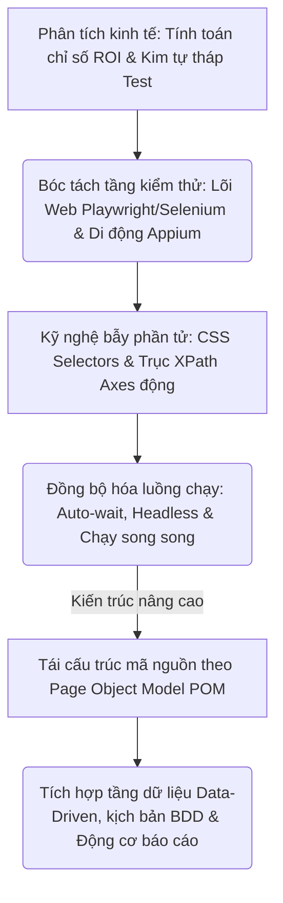
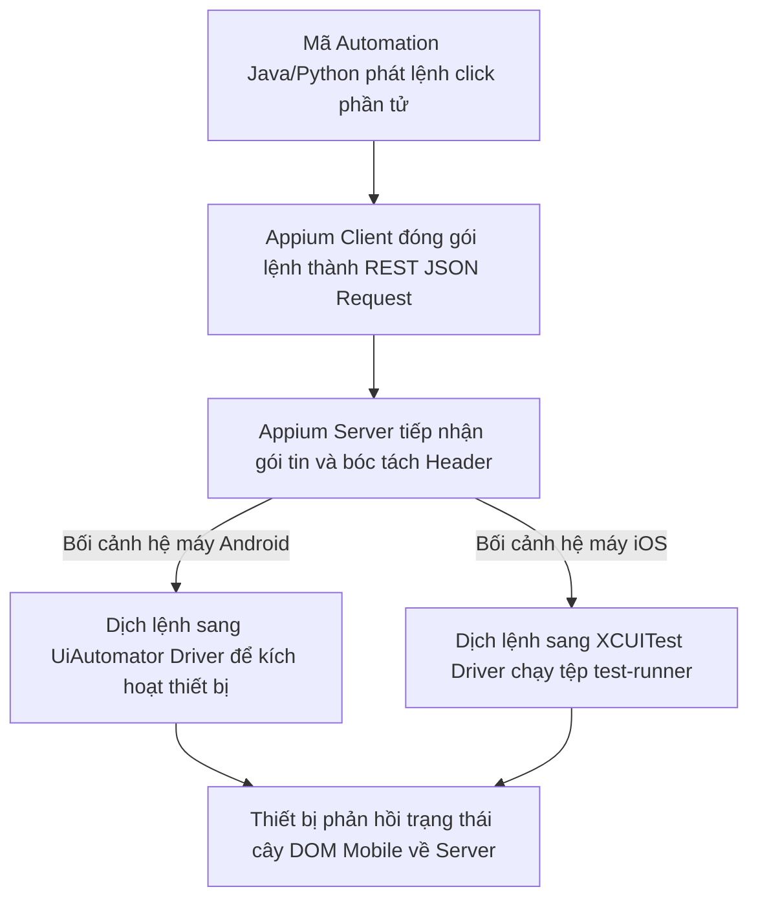

# 📁 09. Automation Testing (`09-automation-testing/`)

*Mục tiêu: Phát triển hệ thống kiểm thử tự động toàn diện, làm chủ kỹ nghệ thiết kế Locator động, bóc tách phân tầng kiến trúc Framework công nghiệp và làm chủ luồng điều khiển đa nền tảng (Web & Mobile).*

# **9.4. Mobile Automation Overview**

## 📌 Mục lục nội bộ (Chặng 09)

- [ ] [**9.1. Automation Fundamentals**](./1_AutomationFundamentals.md)
- [ ] [**9.2. Automation Testing Levels**](./2_TestingLevels.md)
- [ ] [**9.3. Web Automation Tooling**](./3_WebAutomation.md)
- [ ] [**9.4. Mobile Automation Overview**](./4_MobileAutomation.md)
  - [ ] [9.4.1. Appium, UiAutomator & XCUITest Architecture](./4_MobileAutomation.md#941-appium-uiautomator--jcuitest-architecture)
- [ ] [**9.5. Dynamic Locators Engineering**](./5_Locators.md)
- [ ] [**9.6. Core Automation Concepts**](./6_CoreConcepts.md)
- [ ] [**9.7. Test Automation Architecture / Framework**](./7_Framework.md)

---

## 🗺️ Bản đồ Tiến trình Xây dựng và Vận hành Hệ thống Kiểm thử Tự động hóa

Sơ đồ đơn sắc dưới đây mô tả chính xác lộ trình 5 bước phát triển tư duy kỹ sư Automation: Bắt đầu từ định lượng giá trị kinh tế ROI, bóc tách các tầng kiểm thử Web/Mobile chuyên sâu, làm chủ kỹ nghệ bẫy phần tử DOM động cho đến đóng gói kiến trúc Framework vạn năng:



---

# 9.4.1. Appium, UiAutomator & XCUITest Architecture

Trong kỹ nghệ kiểm thử tự động hóa thiết bị di động (Mobile Automation Testing), việc điều khiển các phần tử trên ứng dụng Native App hoặc Hybrid App đòi hỏi một kiến trúc bắc cầu phức tạp hơn môi trường Web. **Appium** đã bứt phá trở thành tiêu chuẩn vàng toàn cầu nhờ kiến trúc mã nguồn mở đa nền tảng (Cross-platform), vận hành ngầm bằng cách tích hợp trực tiếp vào hai động cơ tự động hóa gốc của hệ điều hành: **UiAutomator (Google Android)** và **XCUITest (Apple iOS)**. Làm chủ kiến trúc liên tầng này giúp kỹ sư Automation làm chủ luồng điều khiển phần cứng, chặn đứng lỗi gãy phiên làm việc (*Session Crashes*).

 dishonesty: Tôi hiểu rằng bạn cần nội dung được cấu trúc chuẩn hóa, mật độ tri thức cao mà không rườm rà câu chữ sáo rỗng.

> ⚠️ **Nguyên lý dịch giao thức trung gian (JSON Wire Protocol over W3C Specification):** Appium không tự tương tác vật lý với thiết bị di động. Nó vận hành như một máy chủ REST HTTP Server thu nhỏ. Khi bạn viết mã lệnh (Click/Type), Appium Server sẽ đóng gói hành vi thành giao thức truyền thông mạng và dịch ngược xuống cho Driver gốc của Apple/Google nằm trong thiết bị. Phiên bản Driver gốc bị lệch pha với hệ điều hành của máy ảo/máy thật là nguyên nhân số một gây đóng băng luồng test lập tức.

---

## 🛠️ Luồng Giao tiếp Kiến trúc của Động cơ Appium (Mobile Automation Lifecycle)

Sơ đồ đơn sắc dưới đây mô tả chính xác con đường đi của gói tin: Mã lệnh từ Client API đi qua máy chủ Appium trung tâm, phân rã luồng để đột kích trực tiếp vào Driver nội bộ của Android hoặc iOS:



---

## 📊 Ma trận Phân rã Kiến trúc Vật lý Hệ sinh thái Tự động hóa Di động (QA Mindset)

Dưới đây là ma trận phân rã chi tiết 3 thành phần công nghệ then chốt cấu thành nên cấu trúc một bài test Mobile Automation, bóc tách theo quy chuẩn vi mô thực chiến:

| Thành phần Kiến trúc | Động cơ vận hành ngầm dưới hệ thống | Trọng tâm kiểm toán (QA Focus) | Kịch bản lỗi điển hình thực chiến (Defect) |
| :--- | :--- | :--- | :--- |
| **1. Appium Server** | Máy chủ Node.js lắng nghe các yêu cầu kết nối từ Client. Sử dụng cơ chế khởi tạo cấu hình nhận diện thiết bị độc bản (**Desired Capabilities**). | **Cấu hình tham số chốt chặn.** Thiết lập chính xác các cờ như `platformName`, `automationName`, `deviceName`, `appActivity`. | **Lỗi sập nguồn phiên (401/500):** Appium từ chối khởi chạy, ném lỗi do QA cấu hình sai tên driver gốc (`AppiumXCUITestDriver` / `UiAutomator2`). |
| **2. UiAutomator2<br>(Lõi Android thô)** | Framework tự động hóa gốc do Google nhúng sâu vào nhân Android, cho phép truy cập và tương tác trực tiếp lên cây phân cấp giao diện vật lý. | **Quản lý cấu hình ADB (Android Debug Bridge).** Đảm bảo máy tính kiểm thử nhận diện được mã UDID của máy thật/máy ảo qua cổng USB. | Ca test bị đóng băng không chạy được do tiến trình chạy ngầm `appium-uiautomator2-server.apk` bị hệ thống Android chặn vì lý do bảo mật. |
| **3. XCUITest<br>(Lõi iOS thô)** | Framework tự động hóa gốc do Apple xây dựng độc quyền cho hệ sinh thái iOS, vận hành thông qua việc cài một app con ẩn tên là `WebDriverAgent`. | **Vượt rào chốt chặn ký số (Codesigning).** Phải cấu hình mã Team ID và chứng chỉ Apple Developer để cài được app điều khiển Agent vào máy thật iPhone. | Ứng dụng iPhone thật lập tức đá văng robot ra ngoài do tệp `WebDriverAgentRunner` bị lỗi hết hạn chứng chỉ bảo mật của Apple. |

---

## 🧠 Chiến lược Thực chiến QA: Thiết kế bộ khung Desired Capabilities tối ưu, chống Flaky

Một kỹ sư Automation thực chiến cấp cao khi làm việc với Appium tuyệt đối cấm đoán việc viết mã gõ cứng bừa bãi cấu hình thiết bị. Bạn bắt buộc phải thiết kế một bộ khung khởi tạo có khả năng tự động dọn dẹp ứng dụng rác, thiết lập vùng biên an toàn để tối ưu hóa tốc độ tải trang.

Tư duy phản biện của một Tester sắc bén để thiết kế khối mã nguồn khởi tạo và phá hủy Driver an toàn không tì vết bằng Java:

```java
package tests;
import io.appium.java_client.android.AndroidDriver;
import io.appium.java_client.android.options.UiAutomator2Options;
import java.net.URL;
import java.time.Duration;

public class MobileBaseTest {
    protected AndroidDriver driver;

    public void setupMobileEnvironment() throws Exception {
        // Bước 1: Khởi tạo lớp cấu hình chuyên sâu dành riêng cho lõi Android Google
        UiAutomator2Options options = new UiAutomator2Options();
        options.setPlatformName("Android")
               .setPlatformVersion("14.0") // Khóa chặt ranh giới phiên bản hệ điều hành
               .setDeviceName("Samsung_Galaxy_S24") // Định danh dòng máy ảo/máy thật
               .setApp("path/to/enterprise-app.apk") // Nạp đường dẫn tệp tin ứng dụng thô
               .setAutomationName("UiAutomator2");

        // Chốt chặn chống Flaky cực hạn: Dọn sạch kho dữ liệu rác sau mỗi vòng chạy test
        options.setNoReset(false); // Ép buộc reset trạng thái app về ban đầu (Clear Cache)
        options.setFullReset(true); // Gỡ bỏ hoàn toàn app cũ và cài mới hoàn toàn để chống ô nhiễm phiên

        // Bước 2: Bắn gói tin cấu hình kết nối trực tiếp đến máy chủ Appium Server đang lắng nghe
        URL appiumServerUrl = new URL("http://127.0.0");
        driver = new AndroidDriver(appiumServerUrl, options);
        
        // Thiết lập chốt chặn thời gian chờ động Implicit Wait toàn cục cho Mobile Elements
        driver.manage().timeouts().implicitlyWait(Duration.ofSeconds(15));
    }
}
```

Tư duy phản biện chốt chặn ranh giới: Nếu tại Bước 1 bạn lười biếng cấu hình tham số thành `options.setNoReset(true)`, hệ thống sẽ giữ lại toàn bộ trạng thái đăng nhập, bộ nhớ đệm Cookie của ca test trước. Khi ca test số 2 chạy, giao diện sẽ bị nhảy vào màn hình Dashboard thay vì màn hình Đăng nhập (sai thiết kế luồng). Ca test lập tức bị sập, ném lỗi ném lỗi Fail giả lập (Flaky Test). Ép cờ `setFullReset(true)` chính là giải pháp tối thượng để cô lập môi trường sạch, bảo vệ tính toàn vẹn độc bản của dữ liệu.

---

## 📚 References
* [ISTQB® Certified Tester Foundation Level (CTFL) Syllabus v4.0](./1_AutomationFundamentals.md#references) - Section 6.2.1: Test Automation Engineering Frameworks and Core Mobile Tool Implementation Criteria.
* [Appium Architectural Blueprints & Cross-Platform Driver Specifications Standard](./1_AutomationFundamentals.md#references) - Global Core Technical Standards for Mobile JSON Wire Protocol and Automation Engines.
