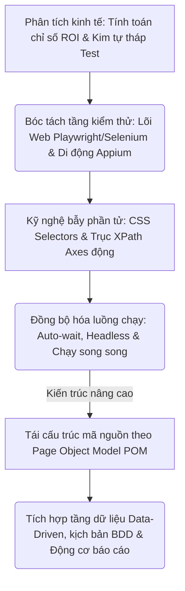
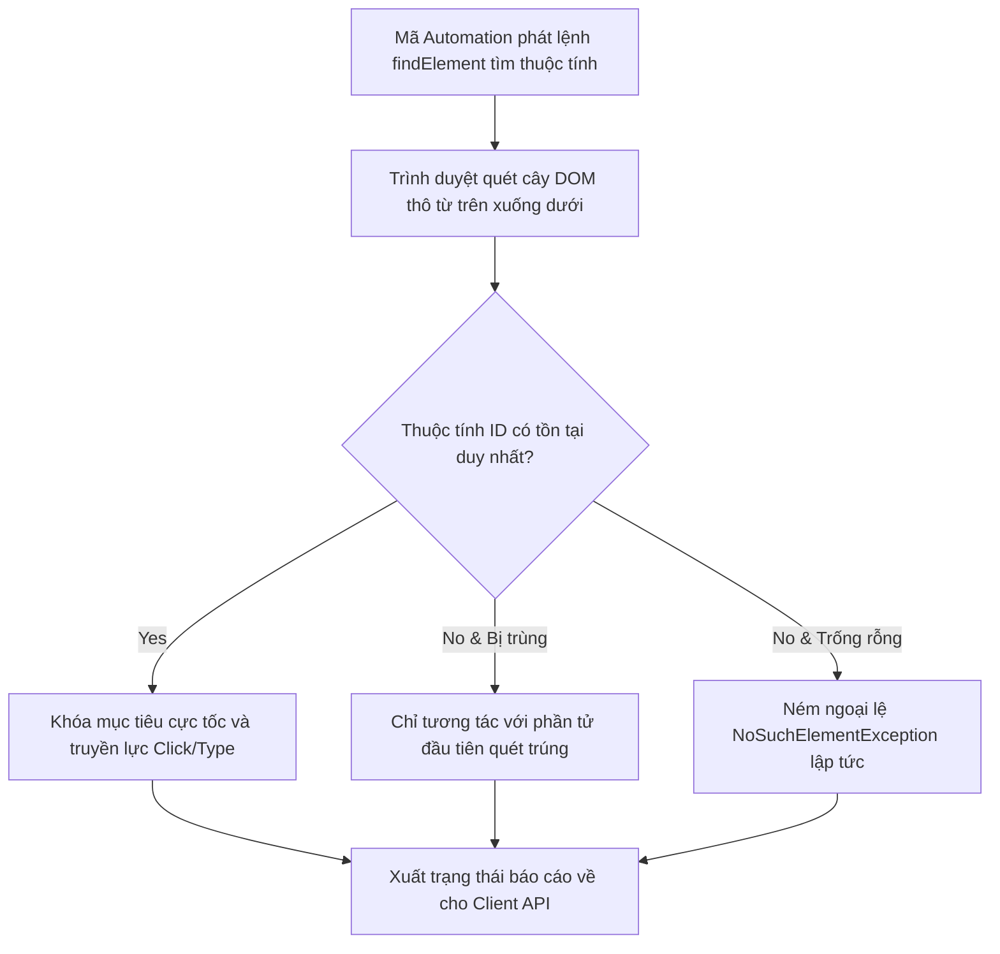
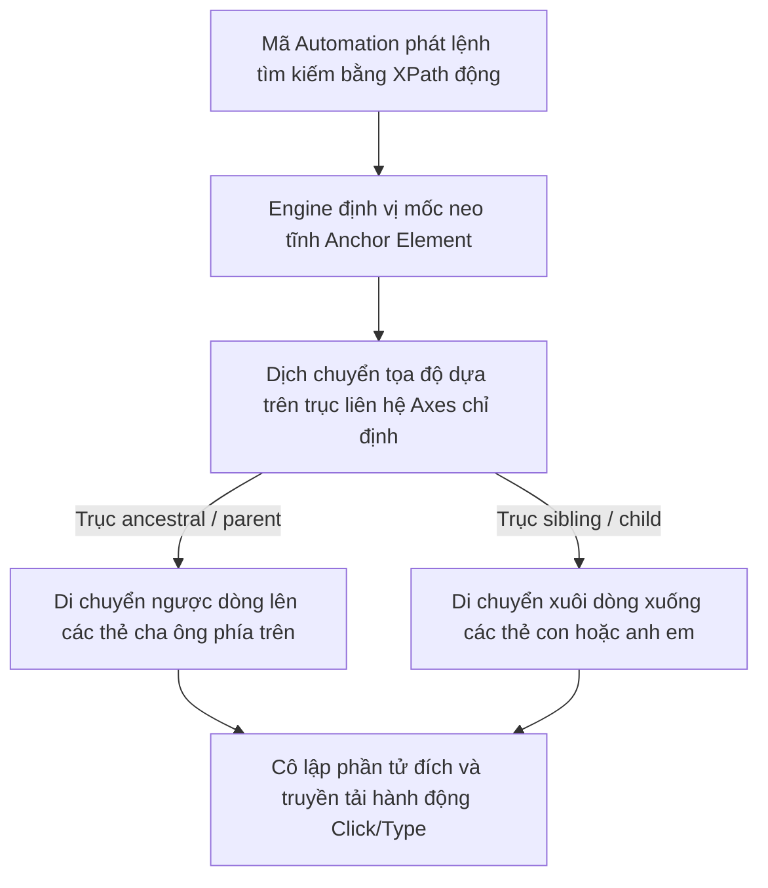

# 📁 09. Automation Testing (`09-automation-testing/`)

*Mục tiêu: Phát triển hệ thống kiểm thử tự động toàn diện, làm chủ kỹ nghệ thiết kế Locator động, bóc tách phân tầng kiến trúc Framework công nghiệp và làm chủ luồng điều khiển đa nền tảng (Web & Mobile).*

# **9.5. Dynamic Locators Engineering**

## 📌 Mục lục nội bộ (Chặng 09)

- [ ] [**9.1. Automation Fundamentals**](./1_AutomationFundamentals.md)
- [ ] [**9.2. Automation Testing Levels**](./2_TestingLevels.md)
- [ ] [**9.3. Web Automation Tooling**](./3_WebAutomation.md)
- [ ] [**9.4. Mobile Automation Overview**](./4_MobileAutomation.md)
- [ ] [**9.5. Dynamic Locators Engineering**](./5_Locators.md)
  - [ ] [9.5.1. ID, Name & Text Locators Strategy](./5_Locators.md#951-id-name--text-locators-strategy)
  - [ ] [9.5.2. CSS Selectors Mechanics & Advanced XPath Axes](./5_Locators.md#952-css-selectors-mechanics--advanced-xpath-axes)
- [ ] [**9.6. Core Automation Concepts**](./6_CoreConcepts.md)
- [ ] [**9.7. Test Automation Architecture / Framework**](./7_Framework.md)


---

## 🗺️ Bản đồ Tiến trình Xây dựng và Vận hành Hệ thống Kiểm thử Tự động hóa

Sơ đồ đơn sắc dưới đây mô tả chính xác lộ trình 5 bước phát triển tư duy kỹ sư Automation: Bắt đầu từ định lượng giá trị kinh tế ROI, bóc tách các tầng kiểm thử Web/Mobile chuyên sâu, làm chủ kỹ nghệ bẫy phần tử DOM động cho đến đóng gói kiến trúc Framework vạn năng:



---

## 📚 References
* [ISTQB® Certified Tester Foundation Level (CTFL) Syllabus v4.0](./1_AutomationFundamentals.md#references) - Section 6.1: Test Automation Foundations & Section 6.2: Criteria for Tool Selection.
* [ISO/IEC/IEEE 29119-5:2016 Standard](./1_AutomationFundamentals.md#references) - Software Testing - Part 5: Test Automation Frameworks, Scalability, Execution Metrics and Maintainability.

# 9.5.1. ID, Name & Text Locators Strategy

Trong kiểm thử tự động hóa giao diện, năng lực neo giữ và nhận diện chính xác cấu trúc phần tử Web (Web Elements) trên cây mã nguồn DOM (Document Object Model) là điều kiện tiên quyết để kịch bản vận hành ổn định. Chiến lược sử dụng bộ ba trình định vị **ID**, **Name**, và **Text Locators** đại diện cho phương pháp tiếp cận phần tử dựa trên các thuộc tính tĩnh hoặc văn bản thô hiển thị trực quan. Làm chủ kỹ thuật bóc tách và phân cấp mức độ ưu tiên của bộ ba này giúp QA xây dựng một bộ mã test vững chắc, triệt tiêu lỗi mất dấu phần tử (*NoSuchElementException*).

> ⚠️ **Nguyên lý phân cấp độ ưu tiên trình định vị (Locator Priority Principle):** Kỹ sư Automation bắt buộc phải tuân thủ nghiêm ngặt thứ tự ưu tiên khi chọn mốc định vị: Thấp nhất là văn bản hiển thị (Text), trung bình là thuộc tính chức năng (Name) và tối cao là định danh độc bản (ID). Việc đảo lộn thứ tự này, cố chấp bám vào thuộc tính đồ họa không ổn định sẽ trực tiếp làm rách kịch bản khi hệ thống thay đổi giao diện.

---

## 🛠️ Luồng Quét và Khóa Mục tiêu Phần tử trên Cây cấu trúc DOM của Động cơ WebDriver

Sơ đồ đơn sắc dưới đây mô tả chính xác chu trình lõi của các trình duyệt (Chrome, Safari, Edge) bóc tách các thuộc tính thẻ và khóa chặt vùng tọa độ tương tác vật lý cho robot:



---

## 📊 Ma trận Khai thác Kỹ thuật Bộ ba Trình định vị Tiêu chuẩn (QA Mindset)

Dưới đây là ma trận phân rã chi tiết 3 giải pháp định vị cốt lõi, bóc tách theo quy chuẩn vi mô thực chiến giúp Tester thiết kế kịch bản chọn Locator thông minh:

| Chiến lược định vị | Cú pháp Playwright / Selenium | Bản chất cấu trúc mã HTML ngầm | Trọng tâm kiểm thử (QA Focus) | Kịch bản lỗi điển hình thực chiến (Defect) |
| :--- | :--- | :--- | :--- | :--- |
| **1. ID Locator** | `page.locator('#user_id')`<br>`By.id("user_id")` | Thuộc tính định danh duy nhất của một thẻ (Ví dụ: `id="btn-submit"`). Nhân trình duyệt quét với tốc độ mili-giây. | **Lựa chọn ưu tiên số 1.** Xác thực tính độc bản trên toàn trang. Cấm dùng ID nếu nó tự động sinh chuỗi đuôi ngẫu nhiên. | **Lỗi gãy kịch bản:** Lập trình viên Backend dùng framework tự động sinh ID biến đổi liên tục sau mỗi lần F5 (`id="btn-3214"`, `id="btn-9981"`). |
| **2. Name Locator** | `page.locator("[name='email']")`<br>`By.name("email")` | Thuộc tính định danh của ô nhập liệu nằm trong Form để truyền payload lên Server (Ví dụ: `name="account"`). | **Giải pháp thay thế an toàn.** Sử dụng khi thẻ HTML không được cấu hình thuộc tính ID nhưng có trường `name` rành mạch. | **Lỗi điền nhầm dữ liệu:** Trong một Form xuất hiện 2 ô nhập liệu có cùng thuộc tính `name="status"`, robot điền nhầm vào ô rác. |
| **3. Text Locator** | `page.getByText('Đăng ký ngay')`<br>`By.linkText("Quên mật khẩu?")` | Định vị phần tử dựa trên chuỗi văn bản thô hiển thị trực quan ra màn hình (Ví dụ: `<a>Đăng ký ngay</a>`). | **Xác thực chữ nghĩa hiển thị.** Bắt buộc chuỗi văn bản phải khớp khít 100% từng dấu cách. Phùi hợp để test luồng chuyển trang. | **Lỗi gãy hàng loạt:** Tính năng dịch đa ngôn ngữ hệ thống được bật khiến robot bị mất hoàn toàn dấu vết do không tìm thấy chữ Tiếng Việt. |

---

## 🧠 Chiến lược Thực chiến QA: Phân tích cây DOM bóc tách bẫy Locator rác

Hãy tưởng tượng bạn đang viết kịch bản tự động hóa luồng Đăng nhập dựa trên đoạn mã nguồn HTML thô bóc tách từ trình duyệt như sau:
```html
<form id="auth-container">
    <input type="text" id="username_102" name="login_acc" class="input-fld" />
    <input type="password" name="login_acc" class="input-fld" />
    <button type="submit">Xác nhận</button>
</form>
```

Tư duy phản biện của một kỹ sư Automation sắc bén để rà soát mã nguồn, né bẫy Locator lỗi và thiết kế mã neo giữ an toàn:

1.  **Vạch trần bẫy ID động của ô tài khoản:** Ô nhập tài khoản có thuộc tính `id="username_102"`. Tư duy phản biện của QA: Chuỗi số `_102` ở đuôi có dấu hiệu là ID tự động sinh động sau mỗi lần tải trang (Dynamic ID). Nếu lười biếng viết `By.id("username_102")`, kịch bản sẽ bị gãy ở lần chạy tiếp theo. **Hành động đúng:** Bỏ qua ID, chuyển sang dùng thuộc tính `name` để khóa mục tiêu an toàn: `page.locator("[name='login_acc']")`.
2.  **Hóa giải trùng lập ô mật khẩu:** Ô nhập mật khẩu **không có thuộc tính ID**, thuộc tính `name="login_acc"` thì lại bị trùng hoàn toàn với ô tài khoản phía trên. Nếu bạn viết `By.name("login_acc")`, WebDriver sẽ luôn điền nhầm vào ô số 1. **Hành động đúng:** Phối hợp thuộc tính để cô lập ô mật khẩu: `page.locator("input[type='password'][name='login_acc']")`.
3.  **Định vị nút bấm theo văn bản thô:** Nút bấm không có bất kỳ thuộc tính định danh nào ngoài chuỗi văn bản `"Xác nhận"`. Viết lệnh chốt chặn: `page.getByText("Xác nhận")`. Đồng thời, lưu ý chốt chặn ranh giới: Yêu cầu đội ngũ Frontend bổ sung thuộc tính ẩn dành riêng cho QA (`data-testid="submit-button"`) để bảo vệ bộ kịch bản test suite không bị ảnh hưởng khi phòng dịch thuật thay đổi nội dung chữ hiển thị.

---

## 📚 References
* [ISTQB® Certified Tester Foundation Level (CTFL) Syllabus v4.0](./1_AutomationFundamentals.md#references) - Section 6.2.1: Test Automation Engineering and Software Component Interface Discovery (Locator Strategy).
* [W3C Web Recommendation - Document Object Model (DOM) Level 3 Specifications](./1_AutomationFundamentals.md#references) - Global Standards for HTML Element Attributes and Identifier Lookups.


# 9.5.2. Advanced Locators: CSS Selectors Mechanics & Advanced XPath Axes

Khi đối mặt với các hệ thống Web hiện đại sử dụng các framework tạo mã nguồn động (React, Angular, Vue), cấu trúc DOM HTML sẽ liên tục biến đổi khiến các thuộc tính định vị tĩnh trở nên bất lực. Kỹ sư Automation bắt buộc phải làm chủ hai vũ khí định vị nâng cao: **CSS Selectors (Tổ hợp phong cách đồ họa cực tốc)** và **XPath Axes (Điều hướng trục quan hệ gia phả)**. Khai thác sự bổ trợ lẫn nhau của bộ đôi này giúp Tester định vị chính xác mọi phần tử phức tạp dựa trên mối quan hệ logic, cấu trúc phân cấp và tọa độ gia phả bất biến trên cây cấu trúc DOM.

> ⚠️ **Nguyên lý bẫy ranh giới và tính chất bù trừ (Locator Symmetry Principle):** CSS Selector luôn mang lại tốc độ quét và phân tích cú pháp vượt trội trên lõi trình duyệt, nhưng dính điểm mù chí tử là không thể đi ngược dòng lên thẻ cha (No Parent Navigation). Ngược lại, XPath tuy tốn tài nguyên xử lý hơn nhưng sở hữu năng lực điều hướng hai chiều tuyệt đối (Xuôi dòng/Ngược dòng) và lọc phần tử theo văn bản thô.

---

## 🛠️ Luồng Xử lý Điều hướng Trục Hệ thống cây DOM của Động cơ XPath (XPath Axes Lifecycle)

Sơ đồ đơn sắc dưới đây mô tả chính xác cách thức công cụ quét của XPath Engine dịch chuyển tọa độ logic ngược dòng hoặc xuôi dòng trên cây DOM để tìm kiếm phần tử mục tiêu dựa trên một mốc mốc neo tĩnh:



---

## 📊 Ma trận Phân rã Kỹ thuật CSS Selectors Tổ hợp và Trục XPath Axes Nâng cao (QA Mindset)

Dưới đây là ma trận hệ thống hóa các bộ tổ hợp CSS tinh gọn kết hợp với biểu thức điều hướng trục nâng cao của XPath, bóc tách theo quy chuẩn vi mô thực chiến:

| Ký tự cú pháp / Từ khóa trục | Bản chất mối quan hệ ngầm trên DOM (QA Focus) | Ví dụ cú pháp mẫu thực chiến | Ý nghĩa nghiệp vụ QA & Mục tiêu bắt lỗi |
| :--- | :--- | :--- | :--- |
| **1. ` ` (Khoảng trắng) / `>`** | *CSS:* Bộ chọn con cháu (Descendant) / Con trực tiếp (Child). Hỗ trợ quét sâu toàn diện hoặc khóa chặt cấp liền kề. | `div.cart-item > button`<br>`form#login input` | Cô lập chính xác nút bấm nằm trong cụm div, chặn lỗi click nhầm phần tử rác bên ngoài Viewport. |
| **2. `+` / `~`** | *CSS:* Bộ chọn anh em sát sườn (Adjacent Sibling) / Anh em tổng quát (General Sibling) nằm phía sau. | `label[for='email'] + input`<br>`h2 ~ div` | Khóa chặt ô nhập liệu nằm ngay kế sau nhãn dán Email, xử lý triệt để bẫy ID động. |
| **3. `[attr*='value']`** | *CSS:* Substring Wildcard. Tìm kiếm phần tử chứa một đoạn ký tự cố định (Tương đương hàm `contains` của XPath). | `input[id*='btn-submit']` | Xử lý triệt để bẫy ID động tự động sinh chuỗi đuôi số ngẫu nhiên sau mỗi lần biên dịch mã nguồn. |
| **4. `following-sibling`** | *XPath:* Di chuyển xuôi dòng để tìm kiếm các thẻ anh em nằm cùng cấp nhưng ở phía sau phần tử mốc neo tĩnh. | `//td[text()='QA']/following-sibling::td` | **Kiểm thử bảng dữ liệu động.** Quét ngang hàng để tìm đúng nút bấm hành động của một dòng bản ghi cố định. |
| **5. `preceding-sibling`** | *XPath:* Di chuyển ngược dòng để định vị các thẻ anh em nằm cùng cấp nhưng ở phía trước phần tử mốc neo tĩnh. | `//td[text()='QA']/preceding-sibling::td/input` | Tự động tích chọn vào ô Checkbox nằm ở đầu dòng của một thực thể được chỉ định danh tính theo chuỗi text thô. |
| **6. `ancestor` / `parent`** | *XPath:* Di chuyển ngược dòng lên các tầng trên để tóm chặt thẻ cha hoặc các thẻ tổ tiên đang bao bọc lấy điểm neo. | `//span[text()='Lỗi']/ancestor::div` | Định vị toàn bộ khung bao đóng Container chứa thông báo lỗi để kiểm toán tính hiển thị đồ họa của Frontend. |

---

## 🧠 Chiến lược Thực chiến QA: Chinh phục Bảng Dữ liệu Động (Dynamic Web Table)

Hãy tưởng tượng bạn đang viết kịch bản tự động hóa kiểm thử một bảng quản lý người dùng có cấu trúc động biến đổi liên tục (Hàng và cột thay đổi tùy theo dữ liệu DB). Nhiệm vụ của bạn là: *Tìm đúng dòng chứa email `"audit@qa.global"` và bấm nút "Xóa" nằm ở cuối dòng đó*. Mã nguồn HTML bóc tách thô tại dòng đó như sau:

```html
<tr>
    <td>User 01</td>
    <td>audit@qa.global</td>
    <td><span class="badge-active">Hoạt động</span></td>
    <td>
        <button class="btn-edit">Sửa</button>
        <button class="btn-delete">Xóa</button>
    </td>
</tr>
```

Tư duy phản biện của một kỹ sư Automation chuyên nghiệp để bẻ gãy bẫy giao diện, xây dựng chuỗi XPath Axes bất khả chiến bại:

1.  **Phát hiện bẫy nút bấm trùng lặp:** Nút "Xóa" chỉ có thuộc tính chung chung `class="btn-delete"`. Trên bảng có 100 dòng thì có 100 nút giống hệt nhau. Nếu viết `By.className("btn-delete")` hoặc dùng bộ chọn CSS `button.btn-delete`, WebDriver sẽ luôn bấm vào nút Xóa của dòng đầu tiên (Gây xóa nhầm dữ liệu người dùng khác).
2.  **Thiết lập điểm mốc neo tĩnh:** Chuỗi email `"audit@qa.global"` là duy nhất và không bao giờ thay đổi. Ta dùng hàm `text()` của XPath để khóa mục tiêu làm điểm neo: `//td[text()='audit@qa.global']`.
3.  **Bắc cầu điều hướng trục liên hệ:** 
    *   Từ ô email, ta nhảy ngược lên thẻ cha bao bọc toàn bộ dòng `<tr>` bằng trục `parent` hoặc `ancestor`: `//td[text()='audit@qa.global']/parent::tr`.
    *   Từ dòng `<tr>` tối cao này, ta lao thẳng xuống tìm nút Xóa nằm ở các thẻ con phía dưới: `//td[text()='audit@qa.global']/parent::tr//button[text()='Xóa']`.
    *   Hoặc tối ưu hiệu năng hơn bằng cách dùng trục anh em cùng cấp `following-sibling` trỏ trực tiếp từ ô chứa email sang ô chứa nút bấm: `//td[text()='audit@qa.global']/following-sibling::td/button[text()='Xóa']`.
    Chuỗi XPath động điều hướng trục này chính là giải pháp hoàn hảo không tì vết, giúp robot luôn tìm đúng nút Xóa của chính chủ email bất kể dòng dữ liệu đó bị nhảy lên đầu hay tụt xuống cuối bảng.

---

## 📚 References
* [ISTQB® Certified Tester Foundation Level (CTFL) Syllabus v4.0](./1_AutomationFundamentals.md#references) - Section 6.2.1: Test Automation Engineering and Advanced Core Dynamic Interface Discovery.
* [W3C XML Path Language (XPath) 2.0 Formal Specifications](./1_AutomationFundamentals.md#references) & [W3C Selectors Level 3 Standards](./1_AutomationFundamentals.md#references) - Technical Criteria for Relational Location Paths, Expressions and Pattern Matching Selectors.
