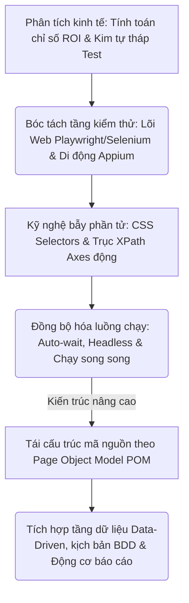
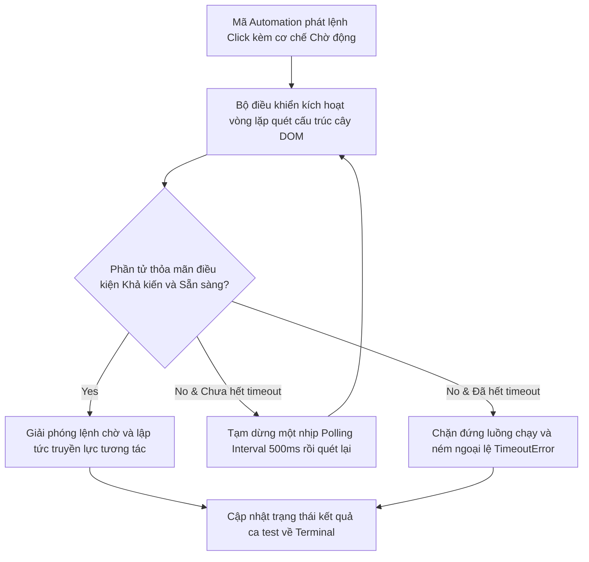
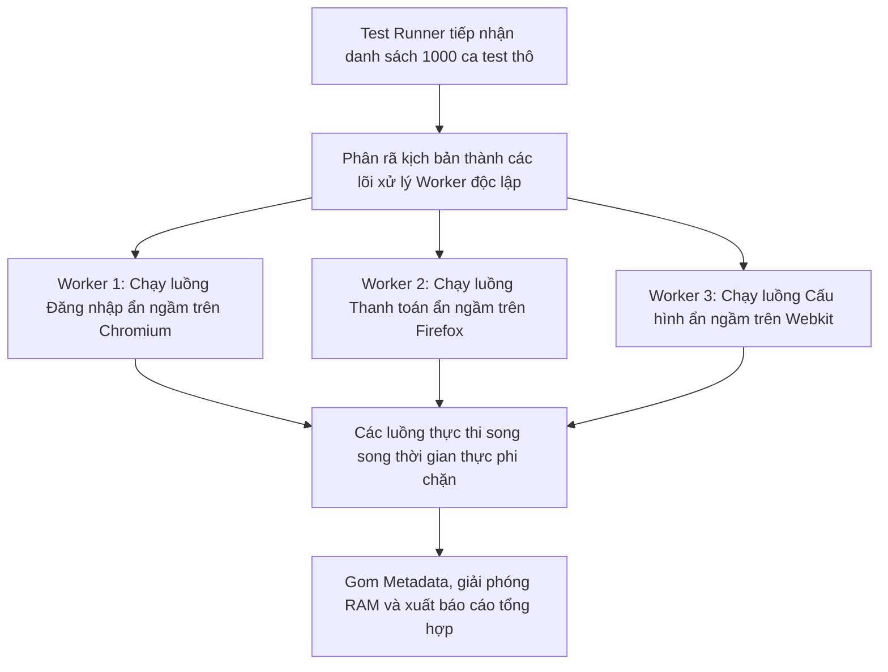

# 📁 09. Automation Testing (`09-automation-testing/`)

*Mục tiêu: Phát triển hệ thống kiểm thử tự động toàn diện, làm chủ kỹ nghệ thiết kế Locator động, bóc tách phân tầng kiến trúc Framework công nghiệp và làm chủ luồng điều khiển đa nền tảng (Web & Mobile).*

# **9.6. Core Automation Concepts**

## 📌 Mục lục nội bộ (Chặng 09)

- [ ] [**9.1. Automation Fundamentals**](./1_AutomationFundamentals.md)
- [ ] [**9.2. Automation Testing Levels**](./2_TestingLevels.md)
- [ ] [**9.3. Web Automation Tooling**](./3_WebAutomation.md)
- [ ] [**9.4. Mobile Automation Overview**](./4_MobileAutomation.md)
- [ ] [**9.5. Dynamic Locators Engineering**](./5_Locators.md)
- [ ] [**9.6. Core Automation Concepts**](./6_CoreConcepts.md)
  - [ ] [9.6.1. Smart Assertions & Dynamic Waits (Auto-wait vs Hard-wait)](./6_CoreConcepts.md#961-smart-assertions--dynamic-waits-auto-wait-vs-hard-wait)
  - [ ] [9.6.2. Headless Execution, Cross-browser Testing & Parallel Execution](./6_CoreConcepts.md#962-headless-execution-cross-browser-testing--parallel-execution)
- [ ] [**9.7. Test Automation Architecture / Framework**](./7_Framework.md)
---

## 🗺️ Bản đồ Tiến trình Xây dựng và Vận hành Hệ thống Kiểm thử Tự động hóa

Sơ đồ đơn sắc dưới đây mô tả chính xác lộ trình 5 bước phát triển tư duy kỹ sư Automation: Bắt đầu từ định lượng giá trị kinh tế ROI, bóc tách các tầng kiểm thử Web/Mobile chuyên sâu, làm chủ kỹ nghệ bẫy phần tử DOM động cho đến đóng gói kiến trúc Framework vạn năng:



---

# 9.6.1. Smart Assertions & Dynamic Waits (Auto-wait vs Hard-wait)

Trong kiểm thử tự động hóa giao diện nâng cao, độ bền bỉ của bộ kịch bản phụ thuộc hoàn toàn vào cách thức bộ khung Framework xử lý hai vấn đề chốt chặn: **Đồng bộ hóa thời gian (Synchronization)** và **Khẳng định nghiệm thu kết quả (Assertions)**. Việc làm chủ sự khác biệt bản chất giữa **Hard-wait (Chờ cứng)**, **Dynamic Waits (Chờ động tường minh)**, kết hợp cơ chế **Auto-wait (Tự động chờ)** của các công cụ hiện đại là vũ khí tối thượng giúp kỹ sư Automation triệt tiêu 99% lỗi gãy kịch bản giả lập (*Flaky Tests*), đồng thời nâng cao độ chính xác của các điểm kiểm toán thông qua hệ thống **Smart Assertions**.

> ⚠️ **Nguyên lý bẫy đồng bộ tĩnh và khẳng định nông cạn (Static Wait & Shallow Assertion Principle):** Việc sử dụng hàm tạm dừng cứng hệ thống (`Thread.sleep()` hoặc `page.waitForTimeout()`) là nguyên nhân hàng đầu kéo tuột hiệu năng đường ống CI/CD. Phối hợp với việc viết mã khẳng định quá nông cạn (chỉ check mã trạng thái mạng hoặc tiêu đề trang mà bỏ quên kiểm toán thuộc tính trạng thái phần tử) sẽ trực tiếp tạo ra hiện tượng báo xanh giả lập (False Positive).

---

## 🛠️ Luồng Thẩm định và Vòng lặp Chờ động của Động cơ Trình duyệt (Dynamic Waiting Lifecycle)

Sơ đồ đơn sắc dưới đây mô tả chính xác cách thức các bộ khung tự động hóa hiện đại liên tục quét cây DOM theo chu kỳ nhằm xác thực trạng thái sẵn sàng của Web Element trước khi kích hoạt hành động:



---

## 📊 Ma trận Phân rã Chiến lược Chờ Đồng bộ và Khẳng định thông minh (QA Mindset)

Dưới đây là ma trận phân rã chi tiết các cơ chế kiểm soát thời gian trễ và các lớp khẳng định nâng cao, bóc tách theo quy chuẩn vi mô thực chiến:

| Thành phần kỹ thuật | Bản chất vận hành ngầm của Động cơ | Trọng tâm cấu hình (QA Focus) | Kịch bản lỗi điển hình thực chiến (Defect) |
| :--- | :--- | :--- | :--- |
| **1. Hard-wait<br>(Chờ tĩnh cố định)** | Ép buộc tiến trình của robot phải đóng băng, đứng im vô điều kiện trên RAM trong một khoảng thời gian cố định bất biến. | **Tuyệt đối cấm sử dụng.** Chỉ chấp nhận sử dụng thô để debug nhanh lỗi cục bộ trong môi trường phát triển ban đầu. | Bộ test suite chạy chậm như rùa, kéo dài thời gian build trên Jenkins lên hàng tiếng học phần do dính hàng trăm lệnh sleep rác. |
| **2. Dynamic Waits<br>(Chờ tường minh)** | Vòng lặp thông minh quét DOM liên tục mỗi 500ms (*Polling Interval*). Nếu điều kiện thỏa mãn sớm, giải phóng lệnh chờ lập tức. | **Khóa chặt trạng thái phần tử.** Chờ cho đến khi phần tử hiển thị vật lý (`visibilityOf`) hoặc sẵn sàng nhận lực click (`elementToBeClickable`). | Robot ném lỗi sập kịch bản do click vào nút bấm đang bị che khuất bởi một hiệu ứng làm mờ đồ họa chưa chạy xong. |
| **3. Auto-wait Engine<br>(Tự động chờ)** | *Đặc tính Playwright:* Tự động thực hiện bộ 5 chốt chặn an toàn (`Attached`, `Visible`, `Stable`, `Enabled`, `Receive Events`) trước khi tương tác. | **Tối ưu hóa tốc độ viết code.** Giải phóng Tester khỏi việc phải gõ lệnh chờ thủ công. Hệ thống tự động đồng bộ thời gian thực theo cấu trúc DOM. | Bộ test bị gãy do phần tử mục tiêu bị che khuất bởi một banner thông báo ẩn danh có lớp CSS nằm đè ở phân cấp phía trên. |
| **4. Smart Assertions<br>(Khẳng định thông minh)** | Sử dụng cơ chế khẳng định động có khả năng tự động chờ trạng thái dữ liệu khớp khít (*Web Assertions* như `expect(el).toBeVisible()`). | **Kiểm toán trạng thái vật lý sâu.** Khẳng định cả thuộc tính (`Attribute`), giá trị ranh giới, trạng thái ẩn/hiện thay vì chỉ check chữ thô. | Bộ test báo xanh giả lập thành công nhưng thực tế dữ liệu trên UI hiển thị trống rỗng do code chỉ assert tiêu đề trang Web. |

---

## 🧠 Chiến lược Thực chiến QA: Triệt tiêu lỗi Flaky bằng Smart Assertions

Hãy tưởng tượng bạn đang kiểm thử một luồng "Xác nhận thanh toán đơn hàng". Sau khi bấm nút "Thanh toán", một màn hình chờ (Loading Spinner) xuất hiện che khuất toàn bộ giao diện trong vòng 3 đến 5 giây tùy tốc độ mạng. Ngay khi Spinner biến mất, thông điệp `"Giao dịch thành công"` mới thình lình hiển thị.

Tư duy phản biện của một kỹ sư Automation sắc bén để thiết kế kịch bản đồng bộ và khẳng định động an toàn không tì vết (Viết bằng Playwright TypeScript):

```typescript
import { test, expect } from '@playwright/test';

test('Kiểm toán luồng thanh toán liên hoàn chống lỗi Flaky mạng', async ({ page }) => {
  await page.goto('https://qa.global');
  
  // Thực thi lực click đặt hàng
  await page.locator('#btn-submit-payment').click();

  // Chốt chặn 1: Khai báo Locator đại diện cho các phần tử biến động trạng thái
  const loadingSpinner = page.locator('#loading-spinner');
  const successMessage = page.locator('.success-alert-text');

  // Chốt chặn 2: Ép hệ thống chờ động cho đến khi màn hình Spinner biến mất hoàn toàn
  // Không dùng sleep tĩnh! Playwright tự động quét DOM liên tục
  await expect(loadingSpinner).toBeHidden({ timeout: 10000 });

  // Chốt chặn 3: Smart Assertion - Khẳng định động tự động chờ phần tử hiển thị vật lý
  // Hàm này sẽ tự động lặp lại lệnh kiểm tra cho đến khi text hiển thị khớp khít đặc tả
  await expect(successMessage).toBeVisible({ timeout: 5000 });
  await expect(successMessage).toHaveText('Giao dịch thành công', { useInnerText: true });

  // Kiểm toán sâu thuộc tính tầng hạ tầng: Mã đơn hàng trả về bắt buộc phải có định dạng chuẩn UUID
  const orderIdAttr = await successMessage.getAttribute('data-order-id');
  expect(orderIdAttr).toMatch(/^[0-9a-f]{8}-[0-9a-f]{4}-4[0-9a-f]{3}-[89ab][0-9a-f]{3}-[0-9a-f]{12}\$/i);
});
```

Tư duy phản biện đỉnh cao: Chuỗi lệnh `await expect(successMessage).toBeVisible()` ở trên hoàn toàn khác biệt với các hàm khẳng định thô sơ cũ. Nếu mạng Staging bị lag nhẹ mất 4.2 giây để tải xong trang, hàm khẳng định thông minh này sẽ tự động duy trì nhịp quét ngầm và lập tức báo **PASS** ở giây thứ 4.3 mà không làm sập kịch bản. Nếu mạng siêu tốc mất 0.5 giây, nó giải phóng luồng chạy ngay lập tức. Đây chính là giải pháp cốt lõi biến bộ kịch bản test suite của bạn thành một pháo đài bất khả xâm phạm trước mọi biến động trồi sụt của hạ tầng mạng.

---

## 📚 References
* [ISTQB® Certified Tester Foundation Level (CTFL) Syllabus v4.0](./1_AutomationFundamentals.md#references) - Section 6.2.2: Test Automation Engineering Frameworks and Test Synchronization Mechanics (Handling Flakiness and Automated Assertions).
* [Playwright Official Documentation by Microsoft - Web Assertions & Actionability Guide](./1_AutomationFundamentals.md#references) - Technical Specifications for Auto-waiting Checklists and Retrying Assertions Matchers.

# 9.6.2. Headless Execution, Cross-browser Testing & Parallel Execution

Khi quy mô của bộ kịch bản tự động hóa đạt ngưỡng hàng trăm hoặc hàng nghìn ca test, việc chạy dây chuyền tuần tự trên một trình duyệt đơn lẻ sẽ bóp nghẹt hoàn toàn tốc độ phản hồi chất lượng. Bộ ba kỹ thuật **Headless Execution (Chạy ẩn ngầm)**, **Cross-browser Testing (Kiểm thử đa trình duyệt)**, và **Parallel Execution (Chạy song song đa luồng)** là giải pháp công nghệ tối cao để bẻ gãy nút thắt hiệu năng. Làm chủ bộ ba này giúp kỹ sư Automation rút ngắn thời gian thực thi từ hàng tiếng xuống còn vài phút, tối ưu hóa băng thông máy chủ và xây dựng một đường ống CI/CD chuẩn công nghiệp.

> ⚠️ **Nguyên lý tranh chấp tài nguyên và rách dữ liệu phiên (Resource Contention & State Contamination Principle):** Việc kích hoạt chạy song song đa luồng sẽ ép phần cứng (CPU/RAM) hoạt động ở công suất tối đa và đẩy Database vào trạng thái tiếp nhận hàng loạt yêu cầu đồng thời. Nếu kịch bản test không được thiết kế cô lập dữ liệu đầu vào (Ví dụ: Nhiều luồng test dùng chung 1 tài khoản đăng nhập), hệ thống sẽ dính lỗi xung đột trạng thái, làm sập dây chuyền toàn bộ kết quả test.

---

## 🛠️ Luồng Phân rã và Điều phối Đa luồng Song song của Động cơ Test Runner (Parallel Lifecycle)

Sơ đồ đơn sắc dưới đây mô tả chính xác cách thức bộ chạy test (Test Runner) tiếp nhận Collection, phân rã kịch bản thành các Worker độc lập và bắn phá song song các lõi trình duyệt ẩn ngầm:



---

## 📊 Ma trận Phân rã Kỹ thuật Tối ưu hóa Hiệu năng Thực thi Mã nguồn (QA Mindset)

Dưới đây là ma trận bóc tách chi tiết 3 mũi nhọn công nghệ giải phóng tốc độ chạy kịch bản, phân rã theo quy chuẩn vi mô thực chiến của một chuyên gia QA:

| Thành phần kỹ thuật | Bản chất vận hành ngầm của Động cơ | Trọng tâm cấu hình (QA Focus) | Kịch bản lỗi điển hình thực chiến (Defect) |
| :--- | :--- | :--- | :--- |
| **1. Headless Execution<br>(Chạy ẩn ngầm)** | Trình duyệt chạy thô dưới dạng một tiến trình nền (*Background Process*), triệt tiêu hoàn toàn việc render điểm ảnh đồ họa hiển thị ra màn hình. | **Tối ưu hóa tài nguyên phần cứng.** Ép trình duyệt chạy nhẹ nhất có thể, tiết kiệm 60% dung lượng RAM và CPU cho máy chủ. | **Lỗi lệch pha Viewport:** Ca test chạy local rất mượt nhưng đẩy lên Jenkins bị sập do trình duyệt chạy ngầm bị co màn hình, che khuất nút bấm. |
| **2. Cross-browser<br>Testing** | Khởi chạy cùng một kịch bản test suite trên nhiều nhân trình duyệt vật lý độc lập khác nhau: `Chromium`, `Firefox`, `Webkit` (Safari). | **Kiểm toán tính tương thích.** Xác thực mã nguồn Frontend (HTML5/CSS3) chạy đồng bộ, không bị xô lệch layout trên các nhân đồ họa. | Tính năng kéo thả phần tử bị đóng băng hoàn toàn trên trình duyệt Safari do lập trình viên viết code Javascript không tương thích nhân Webkit. |
| **3. Parallel Execution<br>(Chạy song song)** | Bộ chạy test chia nhỏ các tệp tệp tin kịch bản và phân phối đều cho các tiến trình con (*Worker Processes*) hoạt động cùng một tích tắc. | **Cô lập tuyệt đối dữ liệu test.** Thiết lập cơ chế sinh dữ liệu băm độc bản cho mỗi luồng chạy. Cấm tuyệt đối hiện tượng dùng chung tài khoản. | **Lỗi kẹt giao dịch:** Ca test 1 và ca test 2 cùng lao vào xóa chung một dòng dữ liệu, khiến DB bị khóa chết tranh chấp dòng (*Deadlock*). |

---

## 🧠 Chiến lược Thực chiến QA: Cấu hình Khung chạy đa luồng bất biến trên Playwright

Một kỹ sư hiệu năng thực chiến luôn biết cách tận dụng tệp cấu hình trung tâm để điều phối sức mạnh của robot, thiết lập các chốt chặn an toàn cho hệ thống hạ tầng.

Tư duy phản biện của một Tester sắc bén để biên soạn file cấu hình tối ưu hóa đường ống CI/CD (Viết bằng Playwright TypeScript):

```typescript
import { defineConfig, devices } from '@playwright/test';

export default defineConfig({
  testDir: './tests',
  
  // Chốt chặn 1: Kích hoạt tối đa công suất chạy song song phi chặn giữa các file test
  fullyParallel: true,
  
  // Giới hạn số lượng Worker chạy song song tùy theo cấu hình phần cứng vật lý của máy chủ
  // Trên CI/CD Jenkins (máy yếu), ép cứng chạy 2 luồng để tránh nghẽn RAM sập máy
  workers: process.env.CI ? 2 : undefined,

  retries: process.env.CI ? 2 : 0, // Tự động chạy lại 2 lần nếu dính lỗi Flaky trên đường ống

  use: {
    // Chốt chặn 2: Ép buộc chạy ẩn ngầm không giao diện khi đẩy lên môi trường CI/CD
    headless: true,
    
    // Khóa chặt kích thước màn hình mặc định cho trình duyệt ẩn ngầm để chống lỗi khuất Viewport
    viewport: { width: 1920, height: 1080 },
    
    actionTimeout: 10000,
  },

  // Chốt chặn 3: Ma trận cấu hình đa trình duyệt quét lỗi tương thích đồ họa liên tầng
  projects: [
    {
      name: 'chromium',
      use: { ...devices['Desktop Chrome'] }, // Nhân Chromium điều khiển Chrome, Edge
    },
    {
      name: 'firefox',
      use: { ...devices['Desktop Firefox'] }, // Nhân Gecko điều khiển Firefox
    },
    {
      name: 'webkit',
      use: { ...devices['Desktop Safari'] }, // Nhân Webkit điều khiển Safari ứng dụng Apple
    },
  ],
});
```

Tư duy phản biện chốt chặn ranh giới: Hãy phân tích dòng lệnh `viewport: { width: 1920, height: 1080 }`. Khi trình duyệt chạy ở chế độ **Headless**, kích thước màn hình mặc định của Linux Server thô có thể bị bóp nhỏ về mốc rác `800x600`. Nếu giao diện Web của bạn thuộc dạng đáp ứng (*Responsive UI*), màn hình nhỏ sẽ lập tức kích hoạt mã nguồn ẩn thanh Menu điều hướng và chuyển sang giao diện Mobile Hamburger. Robot quét tìm nút bấm theo tọa độ cũ sẽ ném lỗi `ElementNotVisibleException` lập tức. Việc ghim cứng độ phân giải Viewport trong tệp cấu hình chính là giải pháp tối thượng để đồng bộ hóa môi trường chạy, bảo vệ tính bất biến của bộ kịch bản test suite.

---

## 📚 References
* [ISTQB® Certified Tester Foundation Level (CTFL) Syllabus v4.0](./1_AutomationFundamentals.md#references) - Section 6.2.4: Test Automation Engineering Implementation Frameworks (Parallel Test Execution & Environment Compatibility).
* [Playwright Official Documentation by Microsoft - Configuration, Parallelism & Browsers Ma trận](./1_AutomationFundamentals.md#references) - Technical Criteria for Workers Tuning, Headless Viewports, and Multi-project Projects Orchestration.
