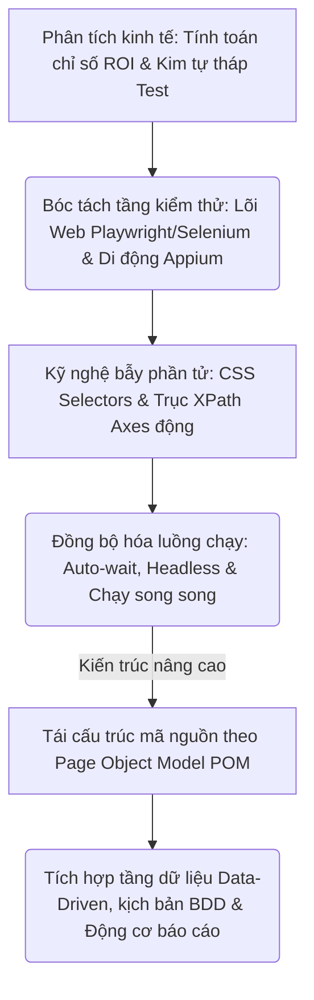
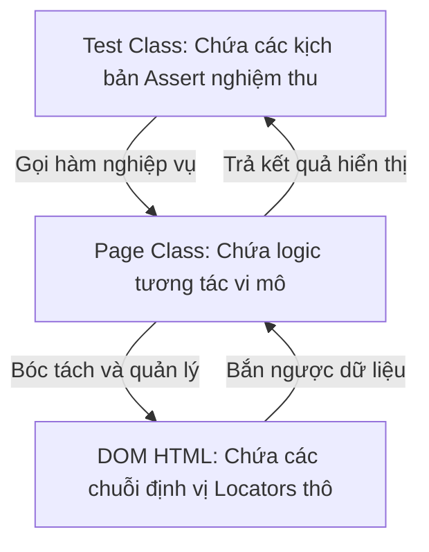
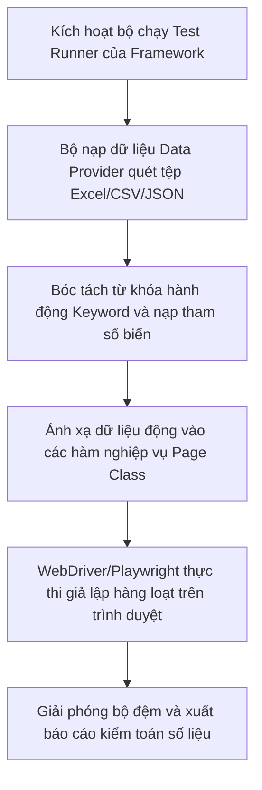
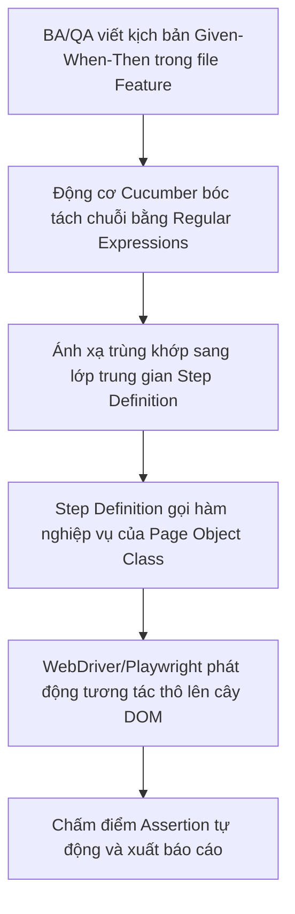
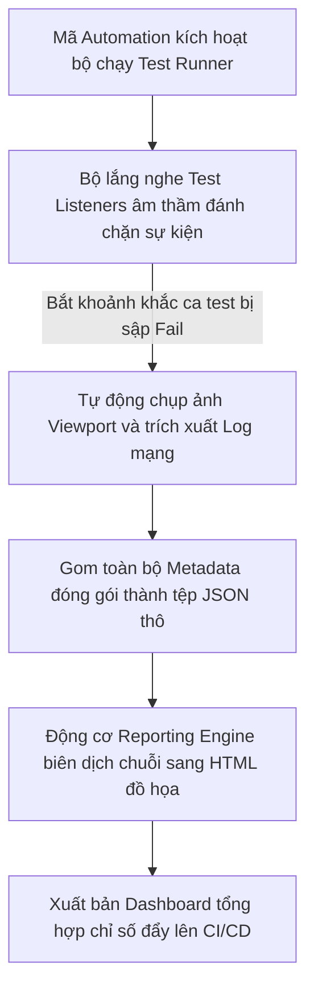

# 📁 09. Automation Testing (`09-automation-testing/`)

*Mục tiêu: Phát triển hệ thống kiểm thử tự động toàn diện, làm chủ kỹ nghệ thiết kế Locator động, bóc tách phân tầng kiến trúc Framework công nghiệp và làm chủ luồng điều khiển đa nền tảng (Web & Mobile).*

# **9.7. Test Automation Architecture / Framework**

## 📌 Mục lục nội bộ (Chặng 09)

- [ ] [**9.1. Automation Fundamentals**](./1_AutomationFundamentals.md)
- [ ] [**9.2. Automation Testing Levels**](./2_TestingLevels.md)
- [ ] [**9.3. Web Automation Tooling**](./3_WebAutomation.md)
- [ ] [**9.4. Mobile Automation Overview**](./4_MobileAutomation.md)
- [ ] [**9.5. Dynamic Locators Engineering**](./5_Locators.md)
- [ ] [**9.6. Core Automation Concepts**](./6_CoreConcepts.md)
- [ ] [**9.7. Test Automation Architecture / Framework**](./7_Framework.md)
  - [ ] [9.7.1. POM (Page Object Model) Design Pattern](./7_Framework.md#971-pom-page-object-model-design-pattern)
  - [ ] [9.7.2. Data-Driven & Keyword-Driven Testing Frameworks](./7_Framework.md#972-data-driven--keyword-driven-testing-frameworks)
  - [ ] [9.7.3. BDD (Behavior-Driven Development) & Gherkin Language](./7_Framework.md#973-bdd-behavior-driven-development--gherkin-language)
  - [ ] [9.7.4. Automation Reporting Engines](./7_Framework.md#974-automation-reporting-engines)

---

## 🗺️ Bản đồ Tiến trình Xây dựng và Vận hành Hệ thống Kiểm thử Tự động hóa

Sơ đồ đơn sắc dưới đây mô tả chính xác lộ trình 5 bước phát triển tư duy kỹ sư Automation: Bắt đầu từ định lượng giá trị kinh tế ROI, bóc tách các tầng kiểm thử Web/Mobile chuyên sâu, làm chủ kỹ nghệ bẫy phần tử DOM động cho đến đóng gói kiến trúc Framework vạn năng:



---

# 9.7.1. POM (Page Object Model) Design Pattern

Khi quy mô hệ thống phình to với hàng trăm trang giao diện và hàng nghìn ca kiểm thử, việc viết mã thô tuyến tính (Linear Scripting) sẽ kéo sụt hoàn toàn hiệu năng bảo trì. **Page Object Model (POM)** là một mẫu thiết kế kiến trúc (Design Pattern) kinh điển, đóng vai trò là tiêu chuẩn vàng toàn cầu trong kỹ nghệ tự động hóa. POM ép buộc Tester phải bóc tách lớp giao diện và lớp kiểm thử ra thành các thực thể độc lập, giúp tối ưu hóa khả năng tái sử dụng mã nguồn và chặn đứng tình trạng vỡ trận hệ thống khi Frontend cập nhật thiết kế.

> ⚠️ **Nguyên lý cô lập ranh giới thay đổi (Change Isolation Principle):** Mỗi trang Web vật lý bắt buộc phải được đại diện bằng một lớp đối tượng (Class) duy nhất trong mã nguồn. Toàn bộ các chuỗi định vị Locator và hàm tương tác vi mô phải được giấu kín bên trong Class này. Lớp kịch bản kiểm thử (Test Class) bên ngoài tuyệt đối không được phép sờ trực tiếp vào Locator cây DOM, ngăn ngừa hiện tượng sửa một nút bấm phải sửa lại hàng trăm tệp tin.

---

## 🛠️ Luồng Luân chuyển và Phân tách Ngữ cảnh của Kiến trúc POM (Architecture Design Lifecycle)

Sơ đồ đơn sắc dưới đây mô tả chính xác mô hình kiến trúc phân rã liên tầng của POM, cô lập tuyệt đối luồng chạy của kịch bản test với cấu trúc Locator của cây DOM HTML:



---

## 📊 Ma trận Phân rã Mô hình Kiến trúc Page Object Model (QA Mindset)

Dưới đây là ma trận phân rã chi tiết cấu trúc đa tầng của kiến trúc POM, bóc tách theo quy chuẩn vi mô thực chiến giúp Tester định hình bộ khung Framework vững chắc:

| Phân tầng Kiến trúc | Bản chất vai trò kỹ thuật ngầm | Trọng tâm kiểm thử (QA Focus) | Kịch bản lỗi điển hình thực chiến (Defect) |
| :--- | :--- | :--- | :--- |
| **1. Test Class Layer<br>(Tầng Kịch bản)** | Nơi chứa các thư viện chạy test (`TestNG`, `JUnit`, `PyTest`), thiết lập bộ dữ liệu đầu vào và thực thi các câu lệnh khẳng định (`Assertions`). | **Tuyệt đối cấm chứa Locator.** Chỉ tập trung kiểm toán logic nghiệp vụ và so sánh kết quả mong muốn với thực tế. | Ca test bị lỗi trùng lặp mã nguồn nghiêm trọng, khó bảo trì do Tester nhét cả mã định vị DOM vào tệp kịch bản kiểm thử. |
| **2. Page Class Layer<br>(Tầng Đối tượng)** | Tệp tin Java/Python đại diện cho 1 trang Web. Nơi khai báo tập trung các biến Locator và đóng gói chúng thành các hàm hành vi nghiệp vụ. | **Đóng gói hành vi (Encapsulation).** Khởi tạo các hàm mô phỏng trọn vẹn luồng nghiệp vụ (Ví dụ: Hàm `loginToSystem(user, pass)`). | Hàm nghiệp vụ trả về lỗi rỗng hoặc sai ngữ cảnh do lập trình viên viết code tương tác lấn sân sang các trang giao diện khác. |
| **3. Page Factory /<br>Element Repository** | Cơ chế tối ưu hóa (Có sẵn trong Selenium) giúp trì hoãn việc quét tìm phần tử trên DOM cho đến khi phần tử đó thực sự được gọi hàm. | **Tăng tốc hiệu năng RAM.** Sử dụng các từ khóa `@FindBy` hoặc kỹ thuật `page.locator()` động để định danh tập trung bộ thư viện phần tử, giảm thiểu số lần quét DOM thừa. | Hệ thống ném ra ngoại lệ `StaleElementReferenceException` liên tục do bộ nhớ đệm lưu giữ con trỏ cũ của thẻ HTML đã bị tải lại. |

---

## 🧠 Chiến lược Thực chiến QA: Phân rã mã nguồn luồng Đăng nhập chuẩn POM

Để hình dung rõ nét sức mạnh bẻ gãy sự lặp lại của POM, hãy đối chiếu cách thức một kỹ sư Automation cấu trúc hóa mã nguồn Java cho trang Đăng nhập (`LoginPage.java`) và tệp kịch bản kiểm thử tương ứng (`LoginTest.java`).

### 1. File Thành phần Đối tượng: LoginPage.java (Lớp Vỏ bọc giấu Locator)
```java
package pages;
import org.openqa.selenium.*;
import org.openqa.selenium.support.ui.ExpectedConditions;
import org.openqa.selenium.support.ui.WebDriverWait;
import java.time.Duration;

public class LoginPage {
    private WebDriver driver;
    private WebDriverWait wait;

    // Chốt chặn 1: Khai báo tập trung toàn bộ Locator thô của trang
    private By txtUsername = By.id("user_input");
    private By txtPassword = By.id("password_input");
    private By btnSubmit = By.cssSelector("button.btn-login");

    public LoginPage(WebDriver driver) {
        this.driver = driver;
        this.wait = new WebDriverWait(driver, Duration.ofSeconds(10));
    }

    // Chốt chặn 2: Đóng gói thành hàm nghiệp vụ cấp cao cho tầng ngoài gọi
    public void loginToSystem(String username, String password) {
        wait.until(ExpectedConditions.visibilityOfElementLocated(txtUsername)).sendKeys(username);
        driver.findElement(txtPassword).sendKeys(password);
        driver.findElement(btnSubmit).click();
    }
}
```

### 2. File Kịch bản Kiểm thử: LoginTest.java (Lớp Khẳng định nghiệp vụ)
```java
package tests;
import org.testng.Assert;
import org.testng.annotations.Test;
import pages.LoginPage;

public class LoginTest extends BaseTest {
    @Test
    public void verifyValidLoginFlow() {
        LoginPage loginPage = new LoginPage(driver);
        
        // Gọi hàm nghiệp vụ trơn tru, fluid, hoàn toàn sạch bóng Locator DOM
        loginPage.loginToSystem("audit@qa.global", "secret123");
        
        // Thực thi chốt chặn khẳng định nghiệm thu số liệu
        Assert.assertTrue(driver.getCurrentUrl().contains("/dashboard"));
    }
}
```

Tư duy phản biến đỉnh cao của một kỹ sư thiết kế hệ thống Automation: Khi Frontend cập nhật mã nguồn, đổi ID của ô nhập liệu từ `id="user_input"` thành `id="account_name"`. Bạn mở tệp `LoginPage.java`, sửa duy nhất đúng 1 dòng khai báo Locator ở đầu trang. Toàn bộ 100 tệp kịch bản kiểm thử nằm ở tầng ngoài **hoàn toàn giữ nguyên vẹn**, không cần đụng chạm sửa đổi bất kỳ ký tự nào. Đây chính là giải pháp tối thượng đưa tính bảo trì của bộ kịch bản test suite lên mức bất bại.

---

## 📚 References
* [ISTQB® Certified Tester Advanced Level (CTFL) - Test Automation Engineer Syllabus](./1_AutomationFundamentals.md#references) - Section 3.2: Architecture and Design patterns of Test Automation Frameworks (POM).
* [Selenium WebDriver Official Documentation - Page Object Models Guidelines](./1_AutomationFundamentals.md#references) - Industry Standard Best Practices for Encapsulation and Web Element Repository Isolation.

# 9.7.2. Data-Driven & Keyword-Driven Testing Frameworks

Khi cấu trúc Framework kiểm thử đã đạt độ chín về mặt bóc tách Locator nhờ kiến trúc Page Object Model (POM), nấc thang nâng cấp tiếp theo để tối ưu hóa sức mạnh của bộ test suite là quản trị dữ liệu và trừu tượng hóa hành vi. **Data-Driven Testing (Kiểm thử hướng dữ liệu)** và **Keyword-Driven Testing (Kiểm thử hướng từ khóa)** là hai mô hình kiến trúc cao cấp giúp bóc tách tuyệt đối tầng logic nghiệp vụ khỏi tầng dữ liệu biến động. Làm chủ hai giải pháp này giúp kỹ sư Automation nhân bản hàng vạn ca test biên liên hoàn mà không làm phình to mã nguồn.

> ⚠️ **Nguyên lý ô nhiễm mã nguồn và đóng cứng dữ liệu (Hard-coded Contamination Principle):** Việc viết gõ cứng (Hard-coded) hàng loạt tập hợp dữ liệu tài khoản, tham số đầu vào bên trong các lớp kịch bản test sẽ trực tiếp tàn phá khả năng bảo trì của Framework. Khi dữ liệu nghiệp vụ thay đổi, bộ test suite sẽ bị gãy hàng loạt, buộc kỹ sư phải mở từng tệp tin code để sửa đổi thủ công, gây lãng phí tài nguyên doanh nghiệp.

---

## 🛠️ Luồng Luân chuyển Dữ liệu và Biên dịch Hành vi của Khung Framework Nâng cao

Sơ đồ đơn sắc dưới đây mô tả chính xác cách thức lõi Framework đánh chặn kịch bản, nạp tệp dữ liệu ranh giới thô bên ngoài kết hợp bóc tách từ khóa chức năng để điều khiển robot:



---

## 📊 Ma trận Phân rã Kỹ thuật Kiến trúc Framework Hướng Dữ liệu và Từ khóa (QA Mindset)

Dưới đây là ma trận phân rã chi tiết cấu trúc đa tầng của hai trường phái thiết kế Framework nâng cao, bóc tách theo quy chuẩn vi mô thực chiến:

| Thành phần Công nghệ | Cơ chế vận hành ngầm của Động cơ | Trọng tâm thiết kế (QA Focus) | Kịch bản lỗi điển hình thực chiến (Defect) |
| :--- | :--- | :--- | :--- |
| **1. Data-Driven Testing<br>(Kiểm thử hướng dữ liệu)** | Sử dụng bộ nạp dữ liệu trung gian (`@DataProvider` trong TestNG, hoặc các tệp JSON/CSV/Excel) để tự động hóa vòng lặp chạy 1 kịch bản duy nhất với hàng loạt bộ dữ liệu đầu vào độc lập. | **Tách biệt tuyệt đối dữ liệu.** Thiết kế các bộ dữ liệu ranh giới biên, dữ liệu rác ở file ngoài. Ép code chạy liên hoàn, nhân bản số lượng ca test tự động mà không cần viết thêm dòng code nào. | **Lỗi đóng băng luồng:** Bộ test suite bị treo cứng hoặc crash giữa chừng do tệp Excel đầu vào chứa ký tự lạ, ô rỗng khiến bộ Parser của code bị lỗi. |
| **2. Keyword-Driven<br>Testing (Hướng từ khóa)** | Trừu tượng hóa dòng lệnh thành các từ khóa hành động thô rành mạch (Ví dụ: `OpenBrowser`, `EnterText`, `ClickButton`). Kịch bản test được viết bằng cách ghép nối từ khóa trong file Excel. | **Trừu tượng hóa kịch bản.** Xây dựng một động cơ biên dịch từ khóa (*Keyword Interpreter*) để ánh xạ từ khóa sang code thô. Cho phép Tester thủ công (Manual QA) tự thiết kế ca test tự động. | Bộ Framework đạt độ phức tạp quá cao, khó bảo trì do kỹ sư viết bộ thư viện từ khóa quá vụn vặt, không bao phủ hết các hiệu ứng UI động. |

---

## 🧠 Chiến lược Thực chiến QA: Phân rã mã nguồn Đăng ký liên hoàn chuẩn BDD Data-Driven

Hãy tưởng tượng bạn đang kiểm thử một biểu mẫu Đăng nhập/Đăng ký. Bạn cần test liên hoàn 3 kịch bản ranh giới: (1) Đúng định dạng dữ liệu $\rightarrow$ Đăng ký thành công, (2) Bỏ trống trường bắt buộc $\rightarrow$ Báo lỗi hệ thống, (3) Nhập sai định dạng Email $\rightarrow$ Báo chặn đầu vào.

Tư duy phản biện của một kiến trúc sư Automation để phân rã cấu trúc tệp dữ liệu CSV bên ngoài kết hợp bộ nạp động `@DataProvider` của TestNG bằng Java:

### 1. File chứa dữ liệu ranh giới cô lập: register_data.csv (Nằm ngoài thư mục code)
```csv
username,password,email,expected_err
audit_qa,secret123,audit@qa.global,SUCCESS
,secret123,audit@qa.global,Tài khoản không được bỏ trống
audit_qa,secret123,invalid_email,Email sai định dạng quy chuẩn
```

### 2. Lớp kịch bản kiểm thử: RegisterTest.java (Tầng thực thi lặp dữ liệu động)
```java
package tests;
import org.testng.Assert;
import org.testng.annotations.DataProvider;
import org.testng.annotations.Test;
import pages.RegisterPage;
import utils.CsvReader;
import java.util.Iterator;

public class RegisterTest extends BaseTest {

    // Chốt chặn 1: Thiết lập bộ nạp dữ liệu động quét tệp tin CSV bên ngoài
    @DataProvider(name = "getRegisterBoundaryData")
    public Iterator<Object[]> getTestData() {
        return CsvReader.readCsvData("src/test/resources/register_data.csv");
    }

    // Chốt chặn 2: Ép ca test chạy lặp đi lặp lại tự động theo số dòng của file dữ liệu
    @Test(dataProvider = "getRegisterBoundaryData")
    public void verifyRegisterFormBoundaries(String user, String pass, String email, String expectedResult) {
        RegisterPage registerPage = new RegisterPage(driver);
        driver.get("https://qa.global");
        
        // Nạp tham số biến động động theo từng vòng lặp vật lý
        registerPage.fillRegisterForm(user, pass, email);
        
        if (expectedResult.equals("SUCCESS")) {
            Assert.assertTrue(driver.getCurrentUrl().contains("/welcome"));
        } else {
            String actualAlert = registerPage.getErrorMessage();
            // Khẳng định đối chứng tự động lỗi biên
            Assert.assertEquals(actualAlert, expectedResult, "Thông điệp chặn lỗi hiển thị sai lệch đặc tả!");
        }
    }
}
```

Tư duy phản biện đỉnh cao của một kỹ sư thiết kế hệ thống Automation: Khi phòng nghiệp vụ yêu cầu bổ sung thêm 5 ca test biên mới (Ví dụ: Mật khẩu quá ngắn, tài khoản chứa ký tự đặc biệt), kỹ sư QA **không cần chỉnh sửa hay viết thêm bất kỳ dòng code lập trình nào**. Bạn chỉ cần mở tệp `register_data.csv` thô ra, chèn thêm 5 dòng dữ liệu mới vào cuối file. Động cơ Framework sẽ tự động nhận diện, bóc tách, nhân bản số lượng vòng lặp vật lý trên trình duyệt Chrome và tự động thẩm định kết quả. Bộ khung kiến trúc này giúp giải phóng hoàn toàn sức lao động và đưa tốc độ mở rộng kịch bản test suite lên mức tối đa.

---

## 📚 References
* [ISTQB® Certified Tester Advanced Level (CTFL) - Test Automation Engineer Syllabus](./1_AutomationFundamentals.md#references) - Section 3.2.2: Data-Driven and Keyword-Driven Test Automation Architectures.
* [Software Component Architecture Standard - Engineering Principles of Test Data Isolation](./1_AutomationFundamentals.md#references) - Technical Specifications for Data Providers, Serialization and Metadata Interpretations.

# 9.7.3. BDD (Behavior-Driven Development) & Gherkin Language

Khi một dự án phần mềm mở rộng quy mô, hố sâu khoảng cách giao tiếp giữa bộ phận kinh doanh (PO, BA) và bộ phận kỹ thuật (Dev, QA) là nguyên nhân hàng đầu dẫn đến việc hiểu sai đặc tả thiết kế. **Behavior-Driven Development (BDD - Phát triển hướng hành vi)** phối hợp với ngôn ngữ tự nhiên **Gherkin** ra đời như một giải pháp kiến trúc tối cao nhằm chuẩn hóa tài liệu yêu cầu. Làm chủ bộ khung BDD giúp kỹ sư Automation chuyển dịch trực tiếp các văn bản mô tả kịch bản của BA thành bộ mã code thực thi tự động, biến bộ test suite thành tài liệu nghiệm thu sống động của toàn doanh nghiệp.

> ⚠️ **Nguyên lý ô nhiễm mã nguồn và mơ hồ kịch bản (Syntactic Ambiguity & Pollution Principle):** Việc viết kịch bản Gherkin quá chung chung, mơ hồ hoặc cố tình lồng ghép các yếu tố kỹ thuật sâu (như ID, XPath, ClassName) vào tệp tin tính năng (`.feature`) là một sai lầm chí tử. Gherkin bắt buộc phải tuân thủ cấu trúc ngôn ngữ nghiệp vụ thuần túy, mọi logic định vị và tương tác phần tử DOM phải được giấu kín hoàn toàn ở tầng mã nguồn ánh xạ phía sau.

---

## 🛠️ Luồng Biên dịch Ngôn ngữ Tự nhiên sang Mã nguồn Thực thi của Động cơ BDD (Cucumber Lifecycle)

Sơ đồ đơn sắc dưới đây mô tả chính xác chu trình động cơ Cucumber/SpecFlow đánh chặn chuỗi text thô Gherkin, bóc tách Regex và ánh xạ sang hàm hành vi của Page Object Model:



---

## 📊 Ma trận Phân rã Kỹ thuật Bộ cấu trúc Phát triển Hướng Hành vi BDD (QA Mindset)

Dưới đây là ma trận phân rã chi tiết 3 thành phần cốt lõi cấu thành nên một hệ thống tự động hóa chuẩn BDD, bóc tách theo quy chuẩn vi mô thực chiến:

| Thành phần Kiến trúc | Bản chất kỹ thuật vận hành ngầm | Trọng tâm thiết kế (QA Focus) | Kịch bản lỗi điển hình thực chiến (Defect) |
| :--- | :--- | :--- | :--- |
| **1. Feature File<br>(Tệp tính năng `.feature`)** | Nơi chứa các kịch bản kiểm thử viết bằng ngôn ngữ **Gherkin** qua bộ 3 từ khóa tối cao: `Given` (Tiền điều kiện), `When` (Hành động), `Then` (Kết quả khẳng định). | **Chuẩn hóa ngôn ngữ kinh doanh.** Sử dụng cấu trúc `Scenario Outline` kết hợp bảng `Examples` để nạp dữ liệu liên hoàn (Tích hợp Data-Driven). | Kịch bản Gherkin viết sai cấu trúc ngữ pháp thô khiến động cơ Parser của Framework bị treo và từ chối biên dịch tệp tin. |
| **2. Step Definitions<br>(Lớp mã ánh xạ)** | Lớp mã nguồn trung gian (Java/Python) sử dụng các thẻ Annotation `@Given`, `@When`, `@Then` để hứng các tham số truyền từ file Feature. | **Bảo toàn tính nhất quán (Mapping).** Đóng vai trò làm cầu điều hướng, tuyệt đối không chứa locator thô, chỉ gọi hàm của Page Object. | **Lỗi rách xích liên kết (`UndefinedStepException`):** Bộ test bị gãy do QA đổi chữ hiển thị ở file Feature nhưng quên cập nhật mã Regex ở file code. |
| **3. Test Runner<br>(Bộ kích hoạt)** | Lớp cấu hình cấu hình đầu não, chỉ định đường dẫn tệp tin tính năng (`features`), tệp chứa code (`glue`) và định dạng báo cáo đầu ra. | **Điều phối bộ ca test.** Sử dụng thẻ định danh `Tags` (Ví dụ: `@Smoke`, `@Regression`) để cô lập và kích hoạt nhanh nhóm ca test mong muốn. | Luồng chạy tự động bị gãy do Tester cấu hình sai đường dẫn `glue`, khiến robot chạy mà không tìm thấy logic mã nguồn thực thi ngầm. |

---

## 🧠 Chiến lược Thực chiến QA: Thiết kế bộ kịch bản luồng Chuyển tiền liên hoàn chuẩn BDD

Hãy tưởng tượng bạn đang kiểm thử tính năng "Chuyển tiền ví điện tử". Bạn cần thiết kế một bộ ca test tự động bao phủ cả luồng thành công lẫn luồng thất bại do biên dữ liệu số dư không đủ.

Tư duy phản biện của một kiến trúc sư Automation để phân rã cấu trúc tệp tính năng và tệp code ánh xạ trung gian không tì vết (Viết bằng Java Cucumber):

### 1. File kịch bản nghiệp vụ: transfer.feature (Tài liệu sống của dự án)
```gherkin
Feature: Quản lý giao dịch - Luồng Chuyển tiền giữa các ví điện tử

  @Regression
  Scenario Outline: Kiểm toán luồng chuyển tiền liên hoàn với các hạn mức ranh giới
    Given Khách hàng đã đăng nhập hệ thống và có số dư ban đầu là <init_balance> VND
    When Khách hàng thực hiện chuyển số tiền <transfer_amount> VND sang số ví "0987654321"
    And Khách hàng xác nhận mã OTP bảo mật
    Then Hệ thống phải hiển thị thông điệp phản hồi là "<expected_response>"

    Examples:

      | init_balance | transfer_amount | expected_response               |
      | 500000       | 200000          | Giao dịch thành công            |
      | 100000       | 600000          | Số dư tài khoản không đủ       |
      | 500000       | 0               | Số tiền chuyển không hợp lệ     |
```

### 2. Lớp ánh xạ mã nguồn: TransferSteps.java (Cầu nối trung gian gọi POM)
```java
package stepdefinitions;

import io.cucumber.java.en.*;
import org.testng.Assert;
import pages.TransferPage;
import tests.BaseTest;

public class TransferSteps extends BaseTest {
    // Khởi tạo đối tượng Page Object bọc Locator cây DOM
    private TransferPage transferPage = new TransferPage(driver);

    @Given("^Khách hàng đã đăng nhập hệ thống và có số dư ban đầu là (\\d+) VND\$")
    public void setupInitialBalance(int initBalance) {
        // Gọi hàm thiết lập dữ liệu ngầm ngầm, sạch bóng locator UI
        transferPage.injectUserBalanceViaApi(initBalance);
        driver.get("https://qa.global");
    }

    @When("^Khách hàng thực hiện chuyển số tiền (\\d+) VND sang số ví \"([^\"]*)\"\$")
    public void executeTransfer(int amount, String phone) {
        // Bóc tách biến động nạp từ bảng Examples của tệp Feature
        transferPage.performTransferFlow(amount, phone);
    }

    @And("Khách hàng xác nhận mã OTP bảo mật")
    public void confirmOtp() {
        transferPage.enterDefaultOtp("123456");
    }

    @Then("^Hệ thống phải hiển thị thông điệp phản hồi là \"([^\"]*)\"\$")
    public void verifyTransactionResult(String expectedResponse) {
        String actualAlert = transferPage.getSystemNotificationMessage();
        // Chốt chặn khẳng định so sánh đối chứng số liệu tự động
        Assert.assertEquals(actualAlert, expectedResponse, "Thông điệp phản hồi lỗi biên bị sai lệch!");
    }
}
```

Tư duy phản biện chốt chặn ranh giới: Hãy quan sát chuỗi ký tự Regex `^Khách hàng đã đăng nhập hệ thống và có số dư ban đầu là (\\d+) VND$`. Việc sử dụng ký tự bắt mốc đầu `^` và mốc cuối `$` kết hợp toán tử tìm số nguyên `(\\d+)` giúp Framework khóa chặt ranh giới nhận diện chuỗi chữ text. Nếu BA thay đổi số tiền trong tệp `.feature`, động cơ Cucumber sẽ tự động bóc tách số đó, ép kiểu thành biến `int` và truyền thẳng vào hàm Java thô để xử lý. Bộ khung này giúp giải phóng hoàn toàn sự lệ thuộc vào code lập trình, biến kịch bản test thành một hệ thống tự động hóa vô song có tính kế thừa cao.

---

## 📚 References
* [ISTQB® Certified Tester Advanced Level (CTFL) - Test Automation Engineer Syllabus](./1_AutomationFundamentals.md#references) - Section 3.2.3: Behavior-Driven Development and Test-Driven Framework Specification Principles.
* [Cucumber Open Source Community Standard Blueprints](./1_AutomationFundamentals.md#references) - Technical Specifications for Gherkin Language, Regular Expressions Parsing, and Steps Matching.

# 9.7.4. Automation Reporting Engines

Trong giai đoạn vận hành và chuyển giao hệ thống tự động hóa ở quy mô doanh nghiệp, bộ kịch bản test suite không thể gọi là hoàn chỉnh nếu kết quả chạy code chỉ hiển thị thô sơ trên màn hình Terminal của cá nhân Tester. **Automation Reporting Engines (Hệ thống báo cáo tự động)** đóng vai trò là tầng trực quan hóa dữ liệu, chuyển dịch toàn bộ siêu dữ liệu thực thi thô (Metadata) thành các trang báo cáo đồ họa cao cấp (`Allure Report`, `ExtentReports`). Làm chủ kỹ thuật đóng gói báo cáo giúp kỹ sư Automation thiết lập chốt chặn an toàn cuối cùng, cung cấp bằng chứng nghiệm thu chất lượng trực quan cho toàn bộ dự án.

> ⚠️ **Nguyên lý tường minh vết tích phá hủy (Defect Traceability Principle):** Báo cáo kiểm thử tự động tuyệt đối cấm đoán việc chỉ hiển thị chữ "PASS" hoặc "FAIL" chung chung. Một hệ thống báo cáo đạt chuẩn công nghiệp bắt buộc phải tự động đính kèm ảnh chụp màn hình thô (Screenshots), tệp quay video luồng chạy và toàn bộ log mạng (Network Logs) tại đúng tích tắc kịch bản bị đánh sập, triệt tiêu hoàn toàn thời gian gỡ lỗi thủ công.

---

## 🛠️ Chu trình Thu thập Siêu dữ liệu và Xuất bản Báo cáo Đồ họa Tự động

Sơ đồ đơn sắc dưới đây mô tả chính xác con đường luân chuyển dữ liệu: Động cơ lắng nghe (Listeners) bắt các sự kiện chạy của kịch bản, thu thập dữ liệu biên lỗi và biên dịch thành trang HTML tổng hợp:



---

## 📊 Ma trận Phân rã Kỹ thuật Hệ thống Báo cáo Tự động hóa Công nghiệp (QA Mindset)

Dưới đây là ma trận phân rã chi tiết các thành phần công nghệ quản trị tầng trực quan hóa kết quả test, phân rã theo quy chuẩn vi mô thực chiến của một chuyên gia QA:

| Động cơ Báo cáo | Cơ chế vận hành ngầm dưới hệ thống | Trọng tâm tích hợp (QA Focus) | Kịch bản lỗi điển hình thực chiến (Defect) |
| :--- | :--- | :--- | :--- |
| **1. Metadata Collector<br>(Bộ lắng nghe Sự kiện)** | Sử dụng các lớp Listener nội bộ (`ITestListener` trong TestNG, `Fixture Hooks` trong Playwright) để đánh chặn trạng thái `onTestSuccess`, `onTestFailure`. | **Đính kèm tài liệu vết lỗi.** Cấu hình mã nguồn tự động bóc tách chuỗi URL hiện tại và chụp ảnh nhúng trực tiếp vào tệp báo cáo khi dính lỗi. | Báo cáo xuất ra bị trắng trơn, khuyết thiếu hoàn toàn hình ảnh lỗi do Tester viết sai hàm bất đồng bộ khi lưu tệp tin ảnh. |
| **2. HTML/JSON Engines<br>(Allure / ExtentReports)** | Động cơ biên dịch tiếp nhận kho tệp tin JSON thô chứa Metadata luồng chạy để dựng thành trang Dashboard đồ họa, biểu đồ tròn trực quan. | **Phân loại cấu trúc kịch bản.** Sử dụng các thẻ Annotation cấp cao (`@Feature`, `@Story`, `@Severity`) để gom nhóm ca test theo tính năng. | Lãnh đạo dự án (PO/BA) từ chối đọc báo cáo do giao diện hiển thị quá lộn xộn, không phân loại được đâu là lỗi chức năng trọng yếu. |
| **3. CI/CD Integration<br>(Chốt chặn Quality Gate)** | Hệ thống máy chủ điều phối (`Jenkins`, `GitHub Actions`) đọc trạng thái kết quả của tệp báo cáo để quyết định số phận của bản build. | **Bẻ gãy luồng Deploy lỗi.** Thiết lập luật nghiêm ngặt: Nếu tỷ lệ lỗi (*Error Rate*) vượt quá 0%, lập tức báo hủy bản build (`Build Failure`). | Hệ thống tự động đẩy mã nguồn lỗi lên môi trường thật (Production) do Tester cấu hình sai lệnh bỏ qua trạng thái lỗi của bộ chạy test. |

---

## 🧠 Chiến lược Thực chiến QA: Lập trình hàm Tự động Chụp ảnh đính vết lỗi chuẩn POM

Một kỹ sư Automation thực chiến cấp cao khi làm việc với Selenium / TestNG luôn thiết lập một bộ lắng nghe tự động (Custom Listener) bọc lót ở tầng nền, triệt tiêu hành vi gõ mã chụp ảnh thủ công lặp đi lặp lại trong từng tệp kịch bản.

Tư duy phản biện của một Tester sắc bén để viết mã Java cấu trúc hóa hàm tự động đánh chặn và đính kèm ảnh chụp màn hình thô vật lý vào ExtentReports khi có lỗi:

```java
package utils;

import com.aventstack.extentreports.MediaEntityBuilder;
import org.openqa.selenium.OutputType;
import org.openqa.selenium.TakesScreenshot;
import org.openqa.selenium.WebDriver;
import org.testng.ITestListener;
import org.testng.ITestResult;
import tests.BaseTest;

public class TestListener implements ITestListener {

    @Override
    public void onTestFailure(ITestResult result) {
        Object currentClass = result.getInstance();
        // Bước 1: Trích xuất chính xác thực thể Driver đang chạy ngầm của ca test bị sập
        WebDriver driver = ((BaseTest) currentClass).getDriver();

        if (driver != null) {
            // Bước 2: Kích hoạt lực ép phần cứng chụp ảnh thô dưới dạng chuỗi mã hóa Base64
            String screenshotBase64 = ((TakesScreenshot) driver).getScreenshotAs(OutputType.BASE64);
            
            // Bước 3: Đóng gói và đính kèm trực tiếp ảnh lỗi vào tệp báo cáo ExtentReports
            ExtentTestManager.getTest().fail("Kịch bản bị đánh sập! Ảnh chụp khoảnh khắc lỗi biên vật lý:",
                MediaEntityBuilder.createScreenShotFromBase64String(screenshotBase64).build());
            
            // In vết lỗi hệ thống (Stack Trace) thô xuống báo cáo để phục vụ gỡ lỗi
            ExtentTestManager.getTest().fail(result.getThrowable());
        }
    }
}
```

Tư duy phản biện chốt chặn ranh giới: Hãy phân tích kỹ thuật sử dụng chuỗi mã hóa `OutputType.BASE64` thay vì lưu thành tệp tin tệp tin vật lý (`.png`). Khi bộ test suite được kích hoạt chạy song song đa luồng (*Parallel*) với hàng nghìn ca test trên máy chủ CI/CD Docker ngầm, việc lưu tệp tin ảnh thô vật lý ra ổ đĩa sẽ dễ dẫn đến hiện tượng tranh chấp ghi file, làm ghi đè hoặc mất dấu đường dẫn ảnh. Lưu ảnh dưới dạng chuỗi Base64 giúp nhúng thẳng mã độc bản của ảnh vào ruột file báo cáo HTML. File báo cáo lúc này đạt độ an toàn tuyệt đối, gọn nhẹ, dễ dàng gửi qua Slack/Email và không bao giờ bị dính lỗi mất liên kết hình ảnh hiển thị.

---

## 📚 References
* [ISTQB® Certified Tester Advanced Level (CTFL) - Test Automation Engineer Syllabus](./1_AutomationFundamentals.md#references) - Section 4.3: Test Logging and Test Reporting Framework Standards.
* [ISO/IEC/IEEE 29119-5:2016 Standard](./1_AutomationFundamentals.md#references) - Software Testing - Part 5: Test Automation Frameworks, Execution Logs and Visual Reporting Metrics.
