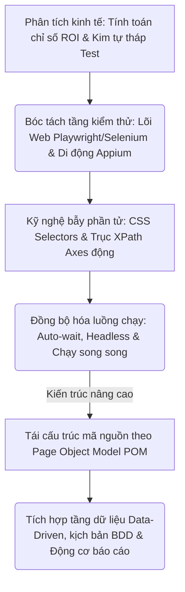

# 📁 09. Automation Testing (`09-automation-testing/`)

*Mục tiêu: Phát triển hệ thống kiểm thử tự động toàn diện, làm chủ kỹ nghệ thiết kế Locator động, bóc tách phân tầng kiến trúc Framework công nghiệp và làm chủ luồng điều khiển đa nền tảng (Web & Mobile).*

## 📌 Mục lục nội bộ (Chặng 09)

- [ ] [**9.1. Automation Fundamentals**](./1_AutomationFundamentals.md)
  - [ ] [9.1.1. Why Automation Testing? ROI (Return on Investment) Calculation](./1_AutomationFundamentals.md#911-why-automation-testing-roi-return-on-investment-calculation)
  - [ ] [9.1.2. Flaky Tests Resolution & The Software Testing Pyramid](./1_AutomationFundamentals.md#912-flaky-tests-resolution--the-software-testing-pyramid)
- [ ] [**9.2. Automation Testing Levels**](./2_TestingLevels.md)
  - [ ] [9.2.1. Unit & Integration Testing Automation](./2_TestingLevels.md#921-unit--integration-testing-automation)
  - [ ] [9.2.2. API & UI / E2E Automation Testing](./2_TestingLevels.md#922-api--ui--e2e-automation-testing)
- [ ] [**9.3. Web Automation Tooling**](./3_WebAutomation.md)
  - [ ] [9.3.1. Playwright Framework In-Depth](./3_WebAutomation.md#931-playwright-framework-in-depth)
  - [ ] [9.3.2. Selenium WebDriver & Cypress Architecture](./3_WebAutomation.md#932-selenium-webdriver--cypress-architecture)
- [ ] [**9.4. Mobile Automation Overview**](./4_MobileAutomation.md)
  - [ ] [9.4.1. Appium, UiAutomator & XCUITest Architecture](./4_MobileAutomation.md#941-appium-uiautomator--jcuitest-architecture)
- [ ] [**9.5. Dynamic Locators Engineering**](./5_Locators.md)
  - [ ] [9.5.1. ID, Name & Text Locators Strategy](./5_Locators.md#951-id-name--text-locators-strategy)
  - [ ] [9.5.2. CSS Selectors Mechanics & Advanced XPath Axes](./5_Locators.md#952-css-selectors-mechanics--advanced-xpath-axes)
- [ ] [**9.6. Core Automation Concepts**](./6_CoreConcepts.md)
  - [ ] [9.6.1. Smart Assertions & Dynamic Waits (Auto-wait vs Hard-wait)](./6_CoreConcepts.md#961-smart-assertions--dynamic-waits-auto-wait-vs-hard-wait)
  - [ ] [9.6.2. Headless Execution, Cross-browser Testing & Parallel Execution](./6_CoreConcepts.md#962-headless-execution-cross-browser-testing--parallel-execution)
- [ ] [**9.7. Test Automation Architecture / Framework**](./7_Framework.md)
  - [ ] [9.7.1. POM (Page Object Model) Design Pattern](./7_Framework.md#971-pom-page-object-model-design-pattern)
  - [ ] [9.7.2. Data-Driven & Keyword-Driven Testing Frameworks](./7_Framework.md#972-data-driven--keyword-driven-testing-frameworks)
  - [ ] [9.7.3. BDD (Behavior-Driven Development) & Gherkin Language](./7_Framework.md#973-bdd-behavior-driven-development--gherkin-language)
  - [ ] [9.7.4. Automation Reporting Engines](./7_Framework.md#974-automation-reporting-engines)

---

## 🗺️ Bản đồ Tiến trình Xây dựng và Vận hành Hệ thống Kiểm thử Tự động hóa

Sơ đồ đơn sắc dưới đây mô tả chính xác lộ trình 5 bước phát triển tư duy kỹ sư Automation: Bắt đầu từ định lượng giá trị kinh tế ROI, bóc tách các tầng kiểm thử Web/Mobile chuyên sâu, làm chủ kỹ nghệ bẫy phần tử DOM động cho đến đóng gói kiến trúc Framework vạn năng:

---

## 📚 References
* [ISTQB® Certified Tester Foundation Level (CTFL) Syllabus v4.0](./1_AutomationFundamentals.md#references) - Section 6.1: Test Automation Foundations & Section 6.2: Criteria for Tool Selection.
* [ISO/IEC/IEEE 29119-5:2016 Standard](./1_AutomationFundamentals.md#references) - Software Testing - Part 5: Test Automation Frameworks, Scalability, Execution Metrics and Maintainability.
