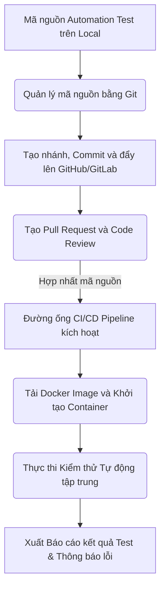
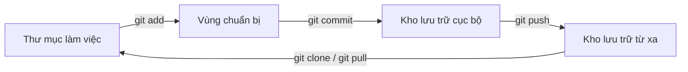
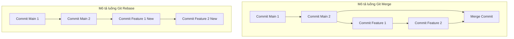
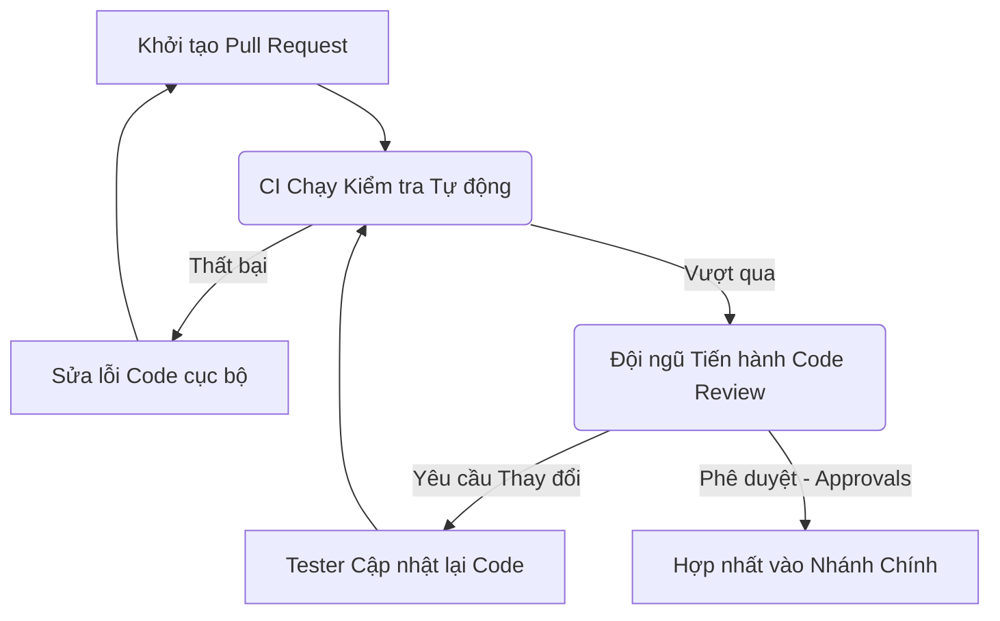

# 📁 10. Git, CI/CD Pipeline & Docker

*Mục tiêu: Đưa bộ mã nguồn kiểm thử tự động (Automation Test Framework) vào quy trình phân phối sản phẩm tự động, làm chủ hệ thống quản lý phiên bản Git, thiết lập đường ống CI/CD liên tục và đóng gói môi trường thực thi bằng Docker dưới góc nhìn của một Kỹ sư QA/SDET chuyên nghiệp.*

# **10.1. Git Version Control for Testers**

## 📌 Mục lục nội bộ (Chặng 10)

- [ ] [**10.1. Git Version Control for Testers**](./1_Git.md)
  - [ ] [10.1.1. Basic Git Workflow: Clone, Add, Commit, Push, Pull, Fetch](#1011-basic-git-workflow-clone-add-commit-push-pull-fetch)
  - [ ] [10.1.2. Branching Strategies, Merging vs Rebase](#1012-branching-strategies-merging-vs-rebase)
  - [ ] [10.1.3. Pull Request (PR) Lifecycle & Code Review for Automation Test](#1013-pull-request-pr-lifecycle--code-review-for-automation-test)
- [ ] [**10.2. CI/CD Pipelines Integration**](./2_CICD.md)
- [ ] [**10.3. Containerization via Docker**](./3_Docker.md)
- [ ] [**10.4. Linux & CLI Essentials**](./4_LinuxCLI.md)
---

## 🗺️ Bản đồ Tiến trình Tích hợp Tự động hóa Luồng DevOps cho QA

Sơ đồ đơn sắc dưới đây mô tả cách một Kỹ sư QA vận hành mã nguồn kiểm thử từ máy cục bộ, quản lý phiên bản qua Git, đóng gói bằng Docker và kích hoạt chạy tự động trên đường ống CI/CD:



---
# 10.1.1. Basic Git Workflow: Clone, Add, Commit, Push, Pull, Fetch

Hệ thống quản lý phiên bản phân tán (Git) là công cụ bắt buộc để Kỹ sư kiểm thử tự động quản lý mã nguồn của Test Framework, đồng bộ kịch bản kiểm thử giữa các thành viên trong đội ngũ và tích hợp luồng chạy tự động vào đường ống CI/CD.

## ⚙️ Bản chất chuyên sâu về cấu trúc lưu trữ của Git

Git không chỉ ghi lại các thay đổi của file mà chụp lại ảnh hệ thống (Snapshot) tại từng thời điểm. Mã nguồn của một QA Automation Engineer được quản lý qua 3 vùng kiến trúc cục bộ (Local) độc lập trước khi đẩy lên máy chủ lưu trữ từ xa (Remote Repository):

1. **Working Directory (Thư mục làm việc):** Nơi trực tiếp chỉnh sửa, viết mới các tệp kịch bản kiểm thử (`.spec.js`, `.py`, `.java`).
2. **Staging Area / Index (Vùng chuẩn bị):** Nơi đánh dấu các tệp thay đổi sẽ được đưa vào ảnh chụp lịch sử tiếp theo.
3. **Local Repository (Kho lưu trữ cục bộ):** Nơi lưu trữ chính thức các Snapshot đã được xác nhận (Commit) trên máy cá nhân.



---

## 📊 Ma trận vận hành Git & Mô hình cô lập lỗi kỹ thuật cho QA

Dưới đây là bảng phân rã chi tiết hành vi lệnh, vùng tác động kỹ thuật trực tiếp, trọng tâm QA thực chiến và các kịch bản lỗi phát sinh trong quá trình cộng tác mã nguồn:

| Câu lệnh Git | Vùng tác động trực tiếp | QA Focus (Trọng tâm kỹ thuật) | Defect thực tế (Lỗi phát sinh & Cách xử lý) |
| :--- | :--- | :--- | :--- |
| **`git clone <url>`** | Remote Repos $\rightarrow$ Working Directory | Tạo bản sao toàn bộ lịch sử và mã nguồn Test Framework từ máy chủ về máy cục bộ của Tester mới gia nhập dự án. | **Lỗi phân quyền SSH/HTTPS Token:** Tester không có quyền Read vào dự án. <br>*Cách sửa:* Cấu hình lại SSH Key hoặc sinh personal access token mới. |
| **`git add <file>`** | Working Directory $\rightarrow$ Staging Area | Đóng gói các thay đổi. Cho phép cô lập chỉ những file test code đã hoàn thiện logic, loại trừ các file log rác ra khỏi danh sách chuẩn bị commit. | **Commit nhầm file rác:** QA add nhầm thư mục chứa báo cáo chạy test (`/allure-results`) hoặc thư mục thư viện (`node_modules`). <br>*Cách sửa:* Dùng `git reset <file>` để rút file ra và cấu hình `.gitignore`. |
| **`git commit -m`** | Staging Area $\rightarrow$ Local Repository | Đóng băng trạng thái mã nguồn cục bộ kèm thông điệp giải trình rõ ràng theo mã định danh của Bug hoặc User Story đang kiểm thử. | **Thông điệp Commit vô nghĩa:** Đặt tên `-m "fix"` hoặc `-m "update test"`. <br>*Cách sửa:* Áp dụng chuẩn Conventional Commits, ví dụ: `test(auth): viết thêm kịch bản kiểm thử biên cho form login`. |
| **`git push`** | Local Repository $\rightarrow$ Remote Repos | Xuất bản mã nguồn kịch bản kiểm thử từ máy cá nhân lên GitHub/GitLab để sẵn sàng kích hoạt luồng chạy Automation tập trung. | **Lỗi từ chối đẩy mã nguồn (Rejected/Non-fast-forward):** Remote có commit mới hơn do một Tester khác vừa đẩy lên. <br>*Cách sửa:* Phải chạy lệnh `git pull` để đồng bộ và giải quyết xung đột trước. |
| **`git fetch`** | Remote Repos $\rightarrow$ Local Repository | Cập nhật toàn bộ danh sách nhánh và lịch sử thay đổi từ máy chủ từ xa về nhưng không tự động hòa trộn code vào thư mục làm việc. | **Thiếu thông tin nhánh mới:** Tester không thấy nhánh kiểm thử tính năng mới mà Developer vừa tạo trên GitHub. <br>*Cách sửa:* Chạy `git fetch --all` để cập nhật chỉ mục nhánh. |
| **`git pull`** | Remote Repos $\rightarrow$ Working Directory | Tải các thay đổi mới nhất về và tự động thực thi quá trình hòa trộn (`git fetch` + `git merge`) vào nhánh hiện hành. | **Xung đột mã nguồn (Merge Conflict):** Hai Tester cùng sửa đổi chung một dòng định vị (Locator) trong một file Page Object. <br>*Cách sửa:* Mở IDE, đối chiếu `HEAD` với mã nguồn tải về để chọn giữ dòng đúng. |

---

## 💡 Ví dụ thực tế liên hoàn: Luồng làm việc hằng ngày của một Kỹ sư QA

Hãy tưởng tượng bạn đang là một Kỹ sư QA Automation làm việc trong một dự án thương mại điện tử lớn:

1. **Đầu ngày làm việc (Đồng bộ hệ thống):**
   Trước khi viết thêm kịch bản mới, bạn di chuyển vào thư mục dự án và thực hiện đồng bộ mã nguồn để tránh xung đột với mã của các đồng nghiệp đã đẩy lên tối qua:
   ```bash
   git checkout main
   git pull origin main
   ```

2. **Giai đoạn tạo mới kịch bản (Viết Test Code):**
   Bạn chỉnh sửa tệp `tests/payment.spec.js` để thêm kịch bản kiểm thử biên cho cổng thanh toán QR Code. Sau khi chạy thử nghiệm trên máy cục bộ thấy kết quả đã **PASS**, bạn kiểm tra trạng thái tệp thay đổi:
   ```bash
   git status
   # Trình duyệt báo file tests/payment.spec.js đang ở trạng thái Untracked/Modified
   ```

3. **Giai đoạn đóng gói và xuất bản (Đẩy lên Hệ thống):**
   Bạn chuyển tệp này vào vùng chuẩn bị, đóng gói bằng mã định danh công việc (ví dụ JIRA ticket `QA-402`) và đẩy lên máy chủ tập trung để kích hoạt GitHub Actions:
   ```bash
   git add tests/payment.spec.js
   git commit -m "test(payment): add edge-case validation for banking qr code payload QA-402"
   git push origin feature/payment-test
   ```

---

> ⚠️ **NGUYÊN LÝ BẤT BIẾN:** Tuyệt đối không bao giờ được phép đưa các thông tin nhạy cảm (Credentials) như Mật khẩu quản trị, API Secret Key, hay Access Token của hệ thống vào trong các tệp mã nguồn kiểm thử để thực hiện Commit lên Git Repository. Bạn bắt buộc phải sử dụng tệp cấu hình môi trường ẩn (`.env`) và đăng ký tệp này vào tệp `.gitignore` để cô lập hoàn toàn rủi ro rò rỉ an ninh bảo mật.

---

📚 **References**
* *ISTQB® Certified Tester Foundation Level (CTFL) Syllabus v4.0* - Section 5.1.3: *Configuration Management (Version Control in Testing)*.
* *Chacon, S., & Straub, B. (2014). Pro Git.* Apress - Chapter 2: *Git Basics (Getting a Git Repository, Recording Changes to the Repository)*.

# 10.1.2. Branching Strategies, Merging vs Rebase

Chiến lược quản lý nhánh (Branching Strategy) và kỹ thuật hợp nhất mã nguồn là xương sống giúp đội ngũ QA Engineering kiểm soát tiến trình tích hợp kịch bản kiểm thử, đảm bảo mã nguồn của Test Framework luôn ổn định và không phá vỡ đường ống CI/CD khi nhiều Tester cùng làm việc trên một kho lưu trữ.

## ⚙️ Bản chất chuyên sâu về cơ chế nhánh và tích hợp mã nguồn

Trong Git, một nhánh thực chất chỉ là một con trỏ di động trỏ đến một Commit cụ thể. Khi tích hợp mã nguồn của nhánh kiểm thử tính năng (`Feature Branch`) vào nhánh chính (`Main/Develop Branch`), hai trường hợp xử lý thuật toán cốt lõi sẽ xảy ra:

1. **Git Merge (Hợp nhất bảo toàn lịch sử):** Kết hợp hai nhánh bằng cách tạo ra một Commit hợp nhất mới (`Merge Commit`). Phương pháp này bảo toàn nguyên vẹn lịch sử, thứ tự tuyến tính và cấu trúc rẽ nhánh của toàn bộ các thành viên.
2. **Git Rebase (Tái định vị gốc nhánh):** Nhổ toàn bộ các Commit mới của nhánh Feature, đem đặt nối tiếp vào sau Commit mới nhất của nhánh Main. Phương pháp này viết lại lịch sử Commit, tạo ra một đường thẳng tuyến tính sạch sẽ nhưng làm thay đổi mã băm (SHA-1) của các Commit cũ.



---

## 📊 Ma trận chiến lược nhánh & Mô hình xử lý xung đột cho QA

Dưới đây là bảng phân rã các chiến lược quản lý nhánh phổ biến, kỹ thuật tích hợp hệ thống, trọng tâm QA thực chiến và các defect thực tế phát sinh:

| Mô hình / Kỹ thuật | Cơ chế hoạt động kỹ thuật | QA Focus (Trọng tâm thực chiến) | Defect thực tế (Lỗi phát sinh & Cách xử lý) |
| :--- | :--- | :--- | :--- |
| **GitFlow Strategy** | Phân chia hệ thống thành các nhánh cố định lâu dài (`main`, `develop`) và các nhánh ngắn hạn (`feature/`, `release/`, `hotfix/`). | Cô lập môi trường test nghiêm ngặt. QA thực hiện Automation Test hồi quy trên nhánh `release/` độc lập để bảo vệ tính ổn định cho nhánh phát hành sản phẩm (`main`). | **Sai lệch phiên bản kịch bản:** Nhánh `release/` bị sửa đổi nhưng quên không hợp nhất ngược lại về nhánh `develop`. <br>*Cách sửa:* Thực hiện nghiêm túc quy trình song hợp (Double-merge) về cả hai nhánh đích sau khi kết thúc chu kỳ test. |
| **Trunk-Based Development** | Mọi thành viên (bao gồm cả QA và Dev) đều đẩy mã nguồn trực tiếp hoặc thông qua các nhánh cực ngắn hạn vào duy nhất một nhánh chính (`Trunk/Main`). | Đòi hỏi tốc độ chạy kiểm thử tự động cực nhanh. QA phải tích hợp bộ test Smoke tự động vào cổng kiểm soát (Guardrails) để chặn code lỗi tích hợp vào Trunk. | **Gây sập đường ống kiểm thử (Broken Build):** Một Tester đẩy code lỗi lên Main làm sập toàn bộ luồng chạy của cả đội ngũ. <br>*Cách sửa:* Bắt buộc cấu hình quy tắc bảo vệ nhánh (Branch Protection Rule), yêu cầu vượt qua bộ kịch bản kiểm thử tĩnh trước khi cho phép hợp nhất. |
| **Git Merge Action** | Chạy lệnh `git merge origin/main`. Tạo ra một điểm nút giao nhau trong sơ đồ lịch sử Git. | Đảm bảo tính minh bạch về thời gian thực. QA có thể tra cứu chính xác thời điểm kịch bản kiểm thử được đưa vào hệ thống cốt lõi để đối chiếu dữ liệu. | **Sơ đồ lịch sử mạng nhện (Merge Bloat):** Quá nhiều Merge Commit rác xuất hiện do lạm dụng việc đồng bộ hằng ngày. <br>*Cách sửa:* Sử dụng tùy chọn `git merge --ff-only` nếu muốn giữ lịch sử sạch hoặc chuyển hướng sang Rebase cục bộ. |
| **Git Rebase Action** | Chạy lệnh `git rebase origin/main`. Di chuyển gốc của nhánh hiện tại lên đầu của nhánh đích. | Giữ cho lịch sử commit của Test Framework luôn là một đường thẳng duy nhất, cực kỳ dễ đọc, dễ quản lý và thuận tiện khi cần tra cứu lỗi. | **Xung đột lặp lại (Conflict Loop):** Đối mặt với xung đột trên từng Commit đơn lẻ trong chuỗi Rebase khiến Tester phải giải quyết một lỗi nhiều lần. <br>*Cách sửa:* Gộp các commit nhỏ lại bằng lệnh `git rebase -i` (Squash) trước khi tiến hành Rebase chính thức. |

---

## 💡 Ví dụ thực tế liên hoàn: Luồng giải quyết xung đột mã nguồn của Tester

Hãy tưởng tượng bạn và một Tester khác cùng chỉnh sửa tệp quản lý phần tử giao diện `pages/login.page.js` trên hai nhánh độc lập:

1. **Phát hiện xung đột hệ thống (Conflict Detection):**
   Khi bạn thực hiện hợp nhất nhánh chính vào nhánh làm việc của mình để chuẩn bị nộp code:
   ```bash
   git checkout feature/qa-login-test
   git merge main
   # Hệ thống báo lỗi: CONFLICT (content): Merge conflict in pages/login.page.js
   # Automatic merge failed; fix conflicts and then commit the result.
   ```

2. **Cách cô lập và xử lý mã nguồn xung đột (Conflict Resolution):**
   Bạn mở tệp `pages/login.page.js` bằng IDE (như VS Code). Trình duyệt mã nguồn sẽ hiển thị vùng xung đột được Git đánh dấu như sau:
   ```javascript
   <<<<<<< HEAD
   this.usernameInput = page.locator('#user-name-field-qa');
   =======
   this.usernameInput = page.locator('#txt-username-prod');
   >>>>>>> main
   ```
   *Phân tích của QA:* Đoạn nằm giữa `<<<<<<< HEAD` và `=======` là mã nguồn do bạn viết trên máy local. Đoạn nằm giữa `=======` và `>>>>>>> main` là mã nguồn mới nhất của hệ thống đã được đồng bộ từ server. 
   
   Bạn liên hệ với đội ngũ để xác nhận Locator trên môi trường vừa cập nhật, sau đó xóa bỏ các ký tự đánh dấu của Git và chọn giữ lại dòng mã chính xác:
   ```javascript
   this.usernameInput = page.locator('#txt-username-prod');
   ```

3. **Hoàn tất chu trình tích hợp (Commit Result):**
   Sau khi dọn dẹp sạch mã nguồn, bạn đóng gói và hoàn thành luồng hợp nhất an toàn:
   ```bash
   git add pages/login.page.js
   git commit -m "build(conflict): resolve merge conflict in login page locator"
   git push origin feature/qa-login-test
   ```

---

> ⚠️ **NGUYÊN LÝ BẤT BIẾN:** Tuyệt đối không bao giờ được phép sử dụng lệnh đẩy ép buộc `git push --force` (hoặc `-f`) lên các nhánh dùng chung mang tính chất cốt lõi của toàn hệ thống (như `main`, `master`, `develop`). Hành vi này sẽ ghi đè và xóa sạch toàn bộ lịch sử Commit của các thành viên khác trên máy chủ từ xa, gây phá hủy cấu trúc mã nguồn nghiêm trọng. Lệnh force push chỉ được chấp nhận trên nhánh Feature cá nhân sau khi đã thực hiện Rebase nội bộ.

---

📚 **References**
* *ISTQB® Certified Tester Foundation Level (CTFL) Syllabus v4.0* - Section 5.1.3: *Configuration Management & Tool Support*.
* *Fowler, M. (2020). Trunk-based Development.* martinfowler.com.
* *Atlassian Git Tutorials* - *Advanced Git Tutorials: Merging vs. Rebasing & Gitflow Workflow*.

# 10.1.3. Pull Request (PR) Lifecycle & Code Review for Automation Test

Quy trình vận hành vòng đời của một Yêu cầu Hợp nhất (Pull Request - PR / Merge Request - MR) và Đánh giá mã nguồn (Code Review) là chốt chặn kiểm soát chất lượng cuối cùng. Quy trình này đảm bảo mã nguồn kiểm thử tự động luôn tuân thủ các tiêu chuẩn thiết kế tối ưu, không chứa mã độc, và ngăn chặn các kịch bản kiểm thử không ổn định (Flaky Tests) lọt vào nhánh chính.

## ⚙️ Bản chất chuyên sâu về vòng đời Pull Request và Cơ chế Đánh giá

Pull Request không phải là một câu lệnh của Git, mà là một tính năng của nền tảng lưu trữ (GitHub, GitLab, Bitbucket) nhằm cung cấp không gian cộng tác. Vòng đời của một PR trải qua các trạng thái nghiêm ngặt từ lúc khởi tạo cho đến khi mã nguồn được hòa trộn vào nhánh chính:

1. **Khởi tạo (Open PR):** Tester so sánh sự khác biệt (Diff) giữa nhánh Feature cá nhân và nhánh đích hệ thống (`main`/`develop`) để đề xuất hợp nhất.
2. **Kích hoạt Kiểm tra tự động (CI Guardrails):** Đường ống CI tự động khởi chạy luồng kiểm thử tĩnh (Linter) và chạy thử bộ test cơ bản để xác thực mã nguồn PR không làm hỏng Framework.
3. **Đánh giá mã nguồn (Peer Review):** Các kỹ sư khác trong đội ngũ tiến hành phân tích logic code, cấu trúc định vị phần tử (Locator), và kiểm tra các cạm bẫy thiết kế.
4. **Hợp nhất (Merged):** Sau khi đạt đủ số lượng phê duyệt (Approvals) và vượt qua toàn bộ điều kiện chặn, PR chính thức được đóng và hòa trộn.



---

## 📊 Ma trận Tiêu chuẩn Code Review dành riêng cho QA Automation

Dưới đây là bảng phân rã các khía cạnh kỹ thuật tối quan trọng cần soi xét khi duyệt PR cho một dự án tự động hóa kiểm thử, đi kèm các defect thực tế:

| Khía cạnh Kiểm tra | Trọng tâm QA Thực chiến (Tiêu chuẩn duyệt) | Lý do Kỹ thuật chuyên sâu | Defect thực tế (Lỗi phát sinh trong PR & Cách xử lý) |
| :--- | :--- | :--- | :--- |
| **Chiến lược Định vị (Locator Strategy)** | Ưu tiên các thuộc tính định danh chống biến động lớn (như `data-testid`, `id`). Tuyệt đối không duyệt các chuỗi định vị phụ thuộc cấu trúc tuyệt đối (Absolute XPath). | Cấu trúc UI thay đổi liên tục. Sử dụng XPath tuyệt đối sẽ làm vỡ hàng loạt kịch bản kiểm thử một cách không cần thiết khi FE cập nhật giao diện. | **Lỗi Locator cứng (Fragile Locator):** `page.locator('div > div > ul > li:nth-child(3) > a')`. <br>*Cách sửa:* Từ chối PR, yêu cầu FE bổ sung attribute hoặc đổi sang định vị text tương đối: `page.getByRole('link', { name: 'Đăng xuất' })`. |
| **Cơ chế Chờ đợi (Wait Mechanism)** | Bắt buộc sử dụng cơ chế Chờ động (Dynamic/Smart Waits). Tuyệt đối cấm sử dụng cơ chế Chờ cứng (Hard-coded Wait / `sleep`). | Chờ cứng làm tăng thời gian thực thi của cả hệ thống một cách lãng phí và gây ra hiện tượng Flaky Test khi mạng lag đột xuất. | **Lỗi Chờ mù quáng (Hard Sleep):** Sử dụng `page.waitForTimeout(5000)` hoặc `Thread.sleep(5000)`. <br>*Cách sửa:* Yêu cầu chuyển sang chờ trạng thái phần tử: `page.locator('#submit-btn').waitFor({ state: 'visible' })`. |
| **Quản lý Dữ liệu (Test Data Isolation)** | Mỗi kịch bản phải tự khởi tạo và dọn dẹp dữ liệu kiểm thử riêng biệt. Không chia sẻ trạng thái hoặc phụ thuộc dữ liệu của nhau. | Đảm bảo tính độc lập tuyệt đối, cho phép các kịch bản kiểm thử có thể chạy song song (Parallel Execution) nhằm tối ưu tốc độ đường ống CI. | **Lỗi Gối đầu kịch bản (Test Dependency):** Bài test B dùng tài khoản vừa được tạo và thay đổi mật khẩu từ bài test A. <br>*Cách sửa:* Sử dụng các hook `beforeEach` để sinh dữ liệu ngẫu nhiên ngắt kết nối. |
| **Khử Trùng mã nguồn (Clean Code - POM)** | Kiểm tra xem các hàm thao tác giao diện có bị viết lặp lại không. Các hàm tương tác bắt buộc phải được đóng gói vào Page Object Model. | Giúp giảm chi phí bảo trì mã nguồn khi luồng nghiệp vụ của sản phẩm thay đổi. | **Lỗi Trùng lặp Logic (Code Duplication):** Viết đi viết lại 5 dòng mã điền form đăng nhập ở 3 file test khác nhau. <br>*Cách sửa:* Yêu cầu chuyển các dòng code đó vào một hàm chung thuộc lớp `LoginPage`. |

---

## 💡 Ví dụ thực tế liên hoàn: Luồng tương tác trên một Pull Request bị từ chối

Hãy tưởng tượng bạn vừa viết xong một bộ kịch bản kiểm thử tự động cho tính năng "Áp dụng mã giảm giá" và gửi Pull Request:

1. **Khởi tạo và Gắn thẻ Đánh giá:**
   Bạn tạo một PR có tiêu đề `test(cart): add validation for promo code edge cases` trên GitHub và gắn thẻ Senior SDET trong đội để nhờ đánh giá mã nguồn.

2. **Nhận phản hồi phản biện từ Code Review (Review Comments):**
   Đường ống CI thông báo mã nguồn không lỗi cú pháp, nhưng Senior SDET phát hiện ra một đoạn mã xử lý nguy hiểm và để lại bình luận ngay tại dòng code lỗi:
   ```javascript
   // Mã nguồn bạn viết trong PR:
   await page.locator('#coupon-input').fill('SALE50');
   await page.locator('#apply-btn').click();
   await page.waitForTimeout(3000); // Chờ 3 giây để hệ thống áp mã
   const total = await page.locator('#total-price').textContent();
   expect(total).toContain('50.000đ');
   ```
   *Bình luận của Reviewer:* "Vui lòng không sử dụng `page.waitForTimeout` ở đây. Nếu server phản hồi chậm hơn 3 giây do nghẽn mạng, bài test này sẽ bị FAILED oan (Flaky). Hãy dùng cơ chế auto-assert hoặc chờ text hiển thị."

3. **Tester Sửa lỗi và Cập nhật PR (Address Feedback):**
   Bạn tiếp thu ý kiến, sửa lại mã nguồn ngay trên máy cá nhân để loại bỏ chờ cứng, tận dụng cơ chế Smart Assertion tự động chờ của Playwright:
   ```javascript
   // Mã nguồn đã tối ưu của bạn:
   await page.locator('#coupon-input').fill('SALE50');
   await page.locator('#apply-btn').click();
   // Playwright sẽ tự động đợi trong tối đa 5 giây cho đến khi text xuất hiện đúng
   await expect(page.locator('#total-price')).toHaveText('50.000đ');
   ```
   Bạn thực hiện lệnh commit và đẩy trực tiếp lên nhánh feature cũ:
   ```bash
   git add tests/cart.spec.js
   git commit -m "refactor(cart): replace hard sleep with web first smart assertion"
   git push origin feature/cart-promo-test
   ```
   *Kết quả:* Pull Request tự động cập nhật mã mới, Reviewer kiểm tra lại thấy đạt chuẩn và nhấn nút **Approve**. Mã nguồn của bạn được tích hợp an toàn vào nhánh `main`.

---

> ⚠️ **NGUYÊN LÝ BẤT BIẾN:** Tuyệt đối không bao giờ được phép tự nhấn nút hợp nhất (Self-Merge) các Pull Request do chính bản thân mình tạo ra trực tiếp vào các nhánh cốt lõi hệ thống mà bỏ qua bước Code Review của đồng nghiệp, kể cả khi bạn đang cần gấp để chạy CI. Việc tự ý bỏ qua quy trình kiểm soát này sẽ phá hủy tính toàn vẹn của mã nguồn chung và tạo tiền lệ xấu cho việc lọt các đoạn test code kém chất lượng làm sập hệ thống tự động hóa.

---

📚 **References**
* *ISTQB® Certified Tester Foundation Level (CTFL) Syllabus v4.0* - Section 3.2: *The Code Review Process & Static Analysis*.
* *Smart, J. F. (2014). BDD in Action: Behavior-driven development for the whole software lifecycle.* Manning Publications.
