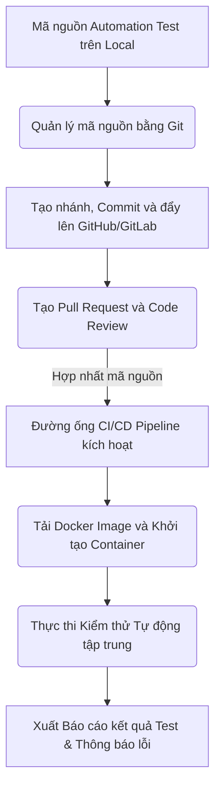
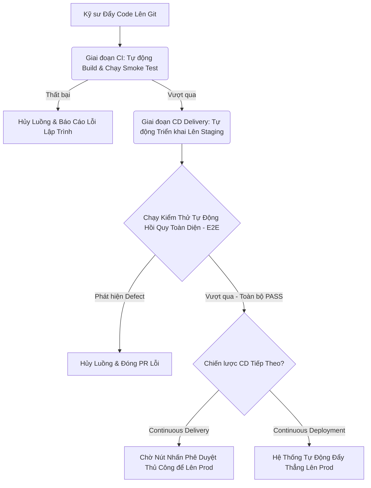
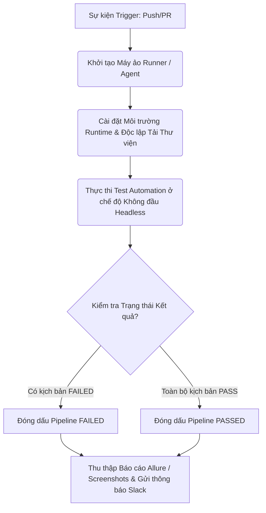
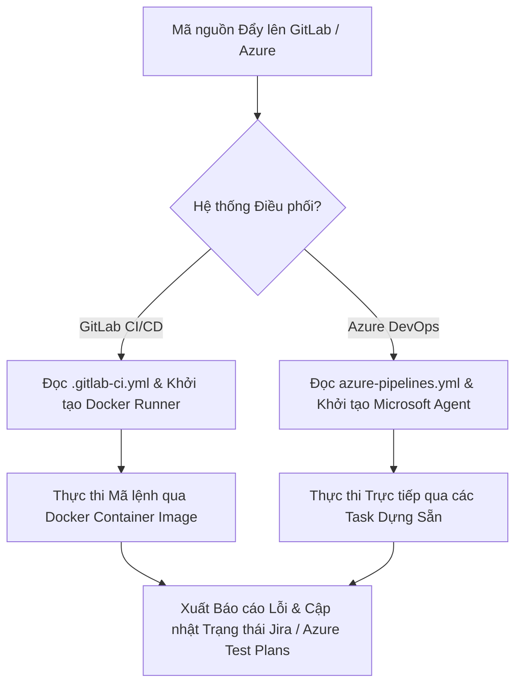

# 📁 10. Git, CI/CD Pipeline & Docker

*Mục tiêu: Đưa bộ mã nguồn kiểm thử tự động (Automation Test Framework) vào quy trình phân phối sản phẩm tự động, làm chủ hệ thống quản lý phiên bản Git, thiết lập đường ống CI/CD liên tục và đóng gói môi trường thực thi bằng Docker dưới góc nhìn của một Kỹ sư QA/SDET chuyên nghiệp.*

# **10.2. CI/CD Pipelines Integration**

## 📌 Mục lục nội bộ (Chặng 10)

- [ ] [**10.1. Git Version Control for Testers**](./1_Git.md)
- [ ] [**10.2. CI/CD Pipelines Integration**](./2_CICD.md)
  - [ ] [10.2.1. CI/CD Principles (Continuous Integration / Delivery / Deployment)](#1021-cicd-principles-continuous-integration-delivery-deployment)
  - [ ] [10.2.2. Building Test Pipelines with GitHub Actions & Jenkins](#1022-building-test-pipelines-with-github-actions-jenkins)
  - [ ] [10.2.3. GitLab CI/CD & Azure DevOps Test Automation Engines](#1023-gitlab-cicd-azure-devops-test-automation-engines)
- [ ] [**10.3. Containerization via Docker**](./3_Docker.md)
- [ ] [**10.4. Linux & CLI Essentials**](./4_LinuxCLI.md)

---

## 🗺️ Bản đồ Tiến trình Tích hợp Tự động hóa Luồng DevOps cho QA

Sơ đồ đơn sắc dưới đây mô tả cách một Kỹ sư QA vận hành mã nguồn kiểm thử từ máy cục bộ, quản lý phiên bản qua Git, đóng gói bằng Docker và kích hoạt chạy tự động trên đường ống CI/CD:



---

# 10.2.1. Continuous Integration / Delivery / Deployment Principles

Đường ống tích hợp và phân phối liên tục (CI/CD Pipeline) là hạ tầng cốt lõi giúp tự động hóa toàn bộ quy trình từ khâu kiểm tra mã nguồn, đóng gói sản phẩm đến khâu triển khai hệ thống. Đối với một Kỹ sư QA/SDET, việc hiểu rõ các nguyên lý CI/CD giúp tích hợp các bộ kịch bản kiểm thử tự động một cách tối ưu, biến Automation Test thành một chốt chặn chất lượng (Quality Gate) đáng tin cậy trong chuỗi cung ứng phần mềm.

## ⚙️ Bản chất chuyên sâu về chu trình vận hành CI/CD

Chu trình CI/CD là một hệ thống tự động hóa phản hồi nhanh (Fast Feedback Loop) được chia thành 3 giai đoạn kiến trúc có tính chất gối đầu và phụ thuộc tuyến tính:

1. **Continuous Integration (CI - Tích hợp liên tục):** Tập trung vào việc tự động hóa khâu gom mã nguồn từ nhiều kỹ sư về một nhánh chính. Mỗi khi có commit mới, hệ thống tự động chạy Build và thực thi các bộ kịch bản Unit Test/Smoke Test nhằm phát hiện sớm lỗi tích hợp.
2. **Continuous Delivery (CD - Phân phối liên tục):** Đảm bảo mã nguồn sau khi vượt qua giai đoạn CI sẽ tự động được đóng gói thành các Artifact (như Docker Image, tệp Zip) và triển khai tự động lên các môi trường thử nghiệm (Staging/Pre-production). Giai đoạn này đòi hỏi sự phê duyệt bằng tay (Manual Approval) trước khi bấm nút phát hành ra thị trường.
3. **Continuous Deployment (CD - Triển khai liên tục):** Cấp độ tự động hóa tối cao. Mọi thay đổi vượt qua chuỗi kiểm thử tự động ở môi trường Staging sẽ lập tức được hệ thống đẩy thẳng lên môi trường vận hành thực tế (Production) mà không cần bất kỳ sự can thiệp thủ công nào từ con người.



---

## 📊 Ma trận Giai đoạn CI/CD & Mô hình Cổng Chất lượng của QA

Dưới đây là bảng phân rã chi tiết hành vi vận hành kỹ thuật tại từng giai đoạn của đường ống, vai trò chiến lược của QA thực chiến và các lỗi hệ thống phát sinh:

| Giai đoạn Đường ống | Hành vi Vận hành Kỹ thuật | QA Quality Gate (Cổng chất lượng thực chiến) | Defect thực tế (Lỗi phát sinh hệ thống & Cách sửa) |
| :--- | :--- | :--- | :--- |
| **Code Commit & Static Analysis (CI)** | Linter quét mã nguồn, SonarQube phân tích độ bao phủ và các lỗ hổng bảo mật tĩnh (Code Smells). | Đảm bảo code test và code dev sạch sẽ. QA cấu hình chặn không cho hợp nhất PR nếu độ bao phủ kiểm thử (Test Coverage) thấp hơn 80%. | **Lọt lỗ hổng bảo mật tĩnh:** Nhà phát triển sử dụng hàm băm yếu hoặc để lộ chuỗi kết nối DB. <br>*Cách sửa:* Đường ống CI tự động đánh dấu Failed và từ chối kích hoạt luồng tiếp theo. |
| **Automated Build & Unit Test (CI)** | Biên dịch mã nguồn, khởi tạo môi trường cô lập để thực thi hàng ngàn kịch bản Unit Test trong vài phút. | Đảm bảo logic hàm cốt lõi chính xác. QA phân tích tỷ lệ lỗi của các hàm dùng chung để cảnh báo vùng rủi ro cao cho Dev. | **Lỗi logic cục bộ (Broken Unit):** Sửa code tính năng A làm hỏng logic tính năng B do phụ thuộc hàm. <br>*Cách sửa:* Developer phải cập nhật lại Unit Test và sửa code trước khi PR được duyệt. |
| **Deployment to Staging (CD Delivery)** | Đóng gói mã nguồn thành Docker Image, đẩy lên Registry và kích hoạt kịch bản tự động cập nhật máy chủ Staging. | Kiểm tra tính ổn định của hạ tầng. QA chuẩn bị sẵn sàng dữ liệu môi trường để phục vụ cho các kịch bản kiểm thử tích hợp lớn phía sau. | **Lỗi cấu hình môi trường (Config Mismatch):** Thiếu biến môi trường hoặc sai thông tin kết nối giữa Staging và DB. <br>*Cách sửa:* Áp dụng cơ chế Infrastructure as Code (IaC) để đồng bộ cấu hình tự động. |
| **E2E Automation Testing (CD Gate)** | Đường ống kích hoạt bộ mã nguồn Automation Test (Playwright/Selenium) chạy song song trên môi trường Staging. | Trọng tâm tối cao của SDET. Đánh giá toàn bộ luồng nghiệp vụ người dùng (End-to-End). Nếu có 1 lỗi nghiêm trọng, luồng phát hành lập tức bị đóng băng. | **Lỗi rò rỉ chức năng (Regression Defect):** Tính năng cũ bị lỗi sau khi thêm tính năng mới vào hệ thống. <br>*Cách sửa:* Hệ thống CI/CD gửi thông báo Allure Report qua Slack/Teams để QA cô lập lỗi và Log Bug. |
| **Production Rollout (CD Deployment)** | Sử dụng chiến lược triển khai an toàn (Blue-Green hoặc Canary Deployment) để đưa mã nguồn mới tiếp cận người dùng. | Kiểm thử thực tế sau phát hành (Testing in Production). QA thực thi bộ test Sanity cực nhanh trên môi trường thật để xác nhận hệ thống chạy mượt mà. | **Lỗi nghiêm trọng diện rộng (Production Crash):** Lỗi phát sinh do tải trọng người dùng thật vượt quá sức chịu đựng của DB. <br>*Cách sửa:* Đường ống CD kích hoạt cơ chế Rollback tự động về phiên bản ổn định trước đó trong vòng vài giây. |

---

## 💡 Ví dụ thực tế liên hoàn: Hành trình của một dòng Code qua Đường ống Tự động

Hãy tưởng tượng bạn đang vận hành đường ống CI/CD cho một ứng dụng Ví điện tử:

1. **Giai đoạn kích hoạt (Trigger):**
   Developer vừa hoàn thiện tính năng "Rút tiền về ngân hàng" và thực hiện push code lên nhánh chính. Sự kiện này lập tức kích hoạt đường ống CI chạy tự động.
2. **Vượt qua cổng kiểm tra tĩnh (CI Gate):**
   Hệ thống chạy 200 bài Unit Test trong 1.5 phút $\rightarrow$ **PASS**. Tiếp tục đóng gói sản phẩm thành Docker Image và đẩy lên môi trường Staging hoàn toàn tự động.
3. **Chốt chặn của QA thực chiến (Automation Gate):**
   Ngay sau khi môi trường Staging sẵn sàng, đường ống CD tự động kích hoạt bộ mã nguồn Playwright của bạn. Bộ test thực hiện giả lập 50 kịch bản rút tiền khác nhau (Rút quá số dư, rút số tiền âm, ngân hàng bảo trì).
   *Tình huống phát sinh:* Hệ thống phát hiện lỗi khi người dùng rút đúng số tiền bằng 0 đồng thì server bị crash (mã lỗi HTTP 500). Bộ Automation Test lập tức đánh dấu kịch bản này là **FAILED**, đường ống CD phát hành lập tức bị **HỦY BỎ**, hệ thống gửi tin nhắn cảnh báo khẩn cấp tới nhóm chat của dự án kèm Log lỗi chi tiết. Tính năng lỗi bị chặn đứng hoàn toàn, không có cơ hội tiếp cận môi trường thực tế của khách hàng.

---

> ⚠️ **NGUYÊN LÝ BẤT BIẾN:** Tuyệt đối không bao giờ được phép cấu hình đường ống CI/CD bỏ qua bước Thực thi Kiểm thử Tự động (Skip Tests) hoặc cho phép luồng triển khai tiếp tục chạy (`allow_failure: true` đối với các bài test cốt lõi) chỉ để chạy theo tiến độ phát hành sản phẩm. Hành vi này hoàn toàn vô hiệu hóa vai trò của phòng quản lý chất lượng, biến đường ống tự động thành một công cụ rủi ro cao giúp đẩy nhanh các lỗi nghiêm trọng (Defect) thẳng tới tay người dùng cuối.

---

📚 **References**
* *ISTQB® Certified Tester Foundation Level (CTFL) Syllabus v4.0* - Section 2.1.4: *DevOps and Testing* & Section 5.4.1: *Tool Support for Testing (CI/CD Tools)*.
* *Humble, J., & Farley, D. (2010). Continuous Delivery: Reliable Software Releases through Build, Test, and Deployment Automation.* Addison-Wesley Professional.

# 10.2.2. Building Test Pipelines with GitHub Actions & Jenkins

Việc chuyển đổi các kịch bản kiểm thử tự động từ việc chạy thủ công bằng câu lệnh cục bộ (Local) sang thực thi tự động tập trung trên đám mây đòi hỏi Kỹ sư QA/SDET phải làm chủ kỹ thuật xây dựng và cấu hình tệp định nghĩa đường ống (Pipeline Script). Hai công cụ phổ biến nhất hiện nay là GitHub Actions (dựa trên cấu trúc khai báo YAML) và Jenkins (dựa trên tư duy lập trình Groovy Script).

## ⚙️ Bản chất chuyên sâu về cơ chế vận hành Test Pipeline

Đường ống kiểm thử tự động trên máy chủ tập trung không có sẵn môi trường giao diện đồ họa (UI). Do đó, hệ thống vận hành dựa trên cơ chế khởi tạo các máy ảo cô lập (Runner/Agent) chạy ở chế độ không đầu (Headless Mode). Quá trình này bắt buộc phải tuân thủ tuần tự 4 bước kiến trúc hạ tầng:

1. **Provisioning (Khởi tạo môi trường):** Kéo và cấu hình hệ điều hành chạy máy ảo (Ubuntu/Windows) hoặc vùng chứa (Docker Container).
2. **Environment Setup (Cài đặt SDK):** Thiết lập môi trường chạy mã nguồn (Node.js, Python, Java) và tải các gói thư viện phụ thuộc (`Thư viện Test Framework`).
3. **Execution (Thực thi kiểm thử):** Kích hoạt các trình duyệt ảo ngầm (Chromium, WebKit, Firefox) ở chế độ `headless` để chạy song song các kịch bản test.
4. **Artifact Archiving (Lưu trữ kết quả):** Thu thập toàn bộ tệp Log, ảnh chụp màn hình khi lỗi (Screenshots), video quay luồng chạy, và xuất bản báo cáo (Allure Report/HTML Report) lên máy chủ lưu trữ cố định trước khi máy ảo bị hủy bỏ hoàn toàn.



---

## 📊 Ma trận Cấu hình Kỹ thuật: GitHub Actions vs Jenkins dành cho QA

Dưới đây là bảng phân rã chi tiết về cú pháp khai báo, cơ chế kiểm soát lỗi, trọng tâm QA thực chiến và các defect hạ tầng phát sinh khi xây dựng đường ống:

| Đặc tính Kỹ thuật | GitHub Actions (Cloud-Native) | Jenkins Automation Server (Self-Hosted) | QA Focus (Trọng tâm thực chiến) | Defect thực tế (Lỗi phát sinh & Cách sửa) |
| :--- | :--- | :--- | :--- | :--- |
| **Tệp Cấu hình & Ngôn ngữ** | `.github/workflows/test.yml` <br>Cú pháp Khai báo (Declarative YAML). | `Jenkinsfile` <br>Ngôn ngữ lập trình Groovy (Scripted/Declarative Pipeline). | QA phải làm chủ cú pháp thụt lề của YAML hoặc cấu hình các khối hàm (Stages) phức tạp của Groovy để phân rã chuỗi chạy kiểm thử. | **Lỗi cú pháp tệp (Linter Error):** Viết sai thụt lề YAML hoặc thiếu dấu đóng ngoặc Groovy làm sập đường ống ngay khi kích hoạt. <br>*Cách sửa:* Sử dụng các công cụ quét lỗi tĩnh (YAML Lint) trước khi commit. |
| **Cơ chế Kích hoạt (Trigger Mechanism)** | Dựa trên Webhook tự động bắt sự kiện từ GitHub: `on: [push, pull_request]`. | Dựa trên cơ chế quét định kỳ (Poll SCM), Webhook, hoặc kích hoạt theo chuỗi (Upstream/Downstream projects). | QA cấu hình luồng chạy test Smoke nhẹ nhàng cho mỗi Pull Request và bộ test Regression nặng nề chạy định kỳ lúc nửa đêm (Cron Job). | **Nghẽn mạng kích hoạt (Webhook Timeout):** Jenkins Server nằm trong mạng nội bộ không bắt được sự kiện từ GitHub bên ngoài. <br>*Cách sửa:* Cấu hình Reverse Proxy hoặc sử dụng plugin Jenkins GitHub Integration an toàn. |
| **Kiểm soát Trình duyệt (Browser Setup)** | Tận dụng lệnh dựng sẵn của Framework: `npx playwright install --with-deps`. | Bắt buộc phải cài đặt các thư viện hệ thống (Xvfb) hoặc kéo Docker Image chứa sẵn trình duyệt của Playwright/Selenium. | Đảm bảo máy ảo có đầy đủ font chữ và nhân trình duyệt để chạy kiểm thử UI, tránh lỗi không tìm thấy trình duyệt thực thi. | **Lỗi sập nhân trình duyệt (Browser Crash):** Trình duyệt ảo ngầm bị crash do thiếu RAM trên máy chủ Jenkins của công ty. <br>*Cách sửa:* Cấu hình tăng tài nguyên cho Agent hoặc kích hoạt cờ `--disable-dev-shm-usage` trong mã nguồn. |
| **Quản lý Kết quả (Artifacts Management)** | Sử dụng Action chính chủ: <br>`actions/upload-artifact@v4`. | Sử dụng chỉ thị Groovy: <br>`archiveArtifacts artifacts: '**/playwright-report/**/*'`. | Trọng tâm cốt lõi để QA điều tra lỗi. Bộ lưu trữ bắt buộc phải lưu lại video và ảnh chụp giao diện chính xác tại thời điểm kịch bản bị Failed. | **Mất dấu vết lỗi (Artifact Loss):** Đường ống chạy xong nhưng không tìm thấy tệp báo cáo Allure đâu do cấu hình sai đường dẫn lưu trữ. <br>*Cách sửa:* Đối chiếu chính xác thư mục xuất file của Framework với cấu hình quét của CI. |

---

## 💡 Ví dụ thực tế liên hoàn: Triển khai Tệp Cấu hình Đường ống Thực chiến

Dưới đây là tệp cấu hình thực tế chuẩn hóa cao giúp chạy bộ kịch bản kiểm thử Playwright tự động trên nền tảng GitHub Actions mỗi khi có Pull Request:

### 📁 Mã nguồn Tệp `.github/workflows/playwright-ci.yml`
```yaml
name: Playwright E2E Automation Test Port
on:
  pull_request:
    branches: [ main, develop ]

jobs:
  automation-execution:
    timeout-minutes: 15
    runs-on: ubuntu-latest
    
    steps:
    - name: Tải mã nguồn từ kho lưu trữ về máy ảo
      uses: actions/checkout@v4

    - name: Khởi tạo môi trường Node.js runtime
      uses: actions/setup-node@v4
      with:
        node-version: 18
        cache: 'npm'

    - name: Cài đặt các thư viện phụ thuộc của dự án
      run: npm ci

    - name: Cài đặt trình duyệt ảo ngầm Playwright và Thư viện hệ thống
      run: npx playwright install --with-deps

    - name: Thực thi bộ kịch bản kiểm thử tự động hồi quy
      run: npx playwright test

    - name: Thu thập và Đóng gói Báo cáo kết quả khi có lỗi xảy ra
      if: always()
      uses: actions/upload-artifact@v4
      with:
        name: e2e-test-report-artifact
        path: playwright-report/
        retention-days: 30
```

---

> ⚠️ **NGUYÊN LÝ BẤT BIẾN:** Tuyệt đối không bao giờ được cấu hình cứng các thông tin tài khoản bí mật (như Password của hệ thống test, DB Connection String) trực tiếp dưới dạng văn bản thuần (Plain Text) vào bên trong tệp YAML hoặc Jenkinsfile. Bạn bắt buộc phải đăng ký các chuỗi ký tự này vào trình quản lý bảo mật của hệ thống (`GitHub Secrets` hoặc `Jenkins Credentials`), sau đó gọi chúng thông qua các biến môi trường an toàn (Ví dụ: `${{ secrets.TEST_ACCOUNT_PASSWORD }}`).

---

📚 **References**
* *ISTQB® Certified Tester Foundation Level (CTFL) Syllabus v4.0* - Section 5.4.1: *Tool Support for Testing (CI/CD and Build Tools)*.
* *GitHub Actions Official Technical Documentation.* - Section: *Building and testing Node.js applications*.
* *Smart, J. F. (2016). Jenkins: The Definitive Guide.* O'Reilly Media.

# 10.2.3. GitLab CI/CD & Azure DevOps Test Automation Engines

Việc làm chủ các công cụ điều phối kiểm thử tự động của doanh nghiệp lớn như GitLab CI/CD và Azure DevOps giúp Kỹ sư QA/SDET tích hợp sâu bộ mã nguồn kiểm thử vào quy trình quản lý dự án, cấu hình chạy song song đa luồng tối ưu và quản lý báo cáo tập trung theo thời gian thực (Real-time Test Reporting).

## ⚙️ Bản chất chuyên sâu về cơ chế quản lý của GitLab và Azure DevOps

Cả GitLab CI/CD và Azure DevOps đều hoạt động dựa trên mô hình **Kiến trúc hướng Container** hoặc máy ảo Agent chuyên dụng để phân tách môi trường, tuân thủ nghiêm ngặt hai cơ chế quản lý hạ tầng:

1. **GitLab CI/CD Runner:** Vận hành thông qua tệp cấu hình `.gitlab-ci.yml`. Hệ thống sử dụng từ khóa `image` để khởi tạo Docker Vùng chứa chuyên dụng (như Playwright Docker Image) cho từng công việc (`Job`), cho phép cô lập hoàn toàn và tối ưu tài nguyên phần cứng.
2. **Azure DevOps Pipelines:** Vận hành thông qua tệp cấu hình `azure-pipelines.yml`. Điểm mạnh của Azure là tích hợp sâu với hệ sinh thái Microsoft, sử dụng các thẻ `task` dựng sẵn để xuất bản trực tiếp kết quả kiểm thử lên bảng tiến độ dự án (`Azure Test Plans`).



---

## 📊 Ma trận Cấu hình Hạ tầng & Cơ chế Chặn lỗi cho QA Doanh nghiệp

Dưới đây là bảng so sánh phân rã cấu pháp kỹ thuật, cơ chế tối ưu luồng chạy và mô hình quản lý báo cáo lỗi thực chiến trên GitLab và Azure DevOps:

| Tiêu chuẩn Hạ tầng | GitLab CI/CD Engine | Azure DevOps Pipeline Engine | QA Focus (Trọng tâm thực chiến) | Defect thực tế (Lỗi phát sinh & Cách sửa) |
| :--- | :--- | :--- | :--- | :--- |
| **Cấu trúc & Cú pháp Tệp** | `.gitlab-ci.yml` <br>Quản lý theo `stages`, `image`, và mã lệnh script thuần. | `azure-pipelines.yml` <br>Quản lý theo phân cấp: `stages` $\rightarrow$ `jobs` $\rightarrow$ `steps` $\rightarrow$ `task`. | QA phải nắm rõ cơ chế kế thừa biến môi trường giữa các tầng cấu trúc để truyền dữ liệu tài khoản test an toàn. | **Lỗi không tìm thấy file cấu hình:** Tester đặt sai vị trí tệp hoặc sai tên định dạng chữ hoa/chữ thường. <br>*Cách sửa:* Đặt tệp nằm ngay tại thư mục gốc (Root) của dự án. |
| **Tối ưu Chạy Song song (Parallelism)** | Sử dụng từ khóa: <br>`parallel: <number>` để nhân bản Runner tự động. | Sử dụng chỉ thị: <br>`strategy: parallel: <number>` phối hợp chia ma trận chạy. | Giúp cắt giảm thời gian thực thi của chuỗi test hồi quy từ 2 tiếng xuống còn 15 phút bằng cách chia đều kịch bản ra 4 máy ảo độc lập. | **Xung đột ghi đè dữ liệu (Data Race Condition):** Các máy ảo chạy song song cùng sửa đổi một bản ghi trong Database. <br>*Cách sửa:* Sử dụng cơ chế tạo dữ liệu động với ID ngẫu nhiên cho từng bài test. |
| **Quản lý Báo cáo Tập trung** | Sử dụng từ khóa `artifacts: reports: junit` để tích hợp kết quả test thẳng vào giao diện Merge Request. | Sử dụng Task: <br>`PublishTestResults@2` để dựng biểu đồ tỷ lệ PASS/FAIL trực quan. | Giúp các bên liên quan (PM, BA) theo dõi trực tiếp độ ổn định của hệ thống mà không cần tải file báo cáo về máy cục bộ. | **Lỗi sai định dạng báo cáo (Report Format Error):** Thư viện Test Framework xuất file JSON trong khi CI yêu cầu tệp XML chuẩn JUnit. <br>*Cách sửa:* Cấu hình lại Framework để xuất song song cả hai định dạng. |
| **Cơ chế Lưu Bộ nhớ đệm (Caching)** | Sử dụng từ khóa: <br>`cache: paths:` cô lập giữa các lần chạy. | Sử dụng Task: <br>`Cache@2` để khóa thư mục thư viện. | QA cấu hình lưu lại thư mục `node_modules` hoặc `pip-cache` để tăng tốc độ cài đặt môi trường lên gấp 3 lần. | **Lỗi đồng bộ cache rác (Stale Cache Bug):** Framework không cập nhật thư viện mới do CI sử dụng file cache cũ. <br>*Cách sửa:* Cấu hình khóa cache đi kèm mã băm của tệp quản lý thư viện (`package-lock.json`). |

---

## 💡 Ví dụ thực tế liên hoàn: Triển khai Cấu hình GitLab CI/CD cho Playwright

Dưới đây là mẫu tệp cấu hình thực tế chuẩn doanh nghiệp chạy bộ kịch bản kiểm thử Playwright tự động trên hệ thống GitLab CI/CD, sử dụng Docker Image chính chủ:

### 📁 Mã nguồn Tệp `.gitlab-ci.yml`
```yaml
stages:
  - testing-phase

execute-e2e-automation:
  stage: testing-phase
  # Sử dụng Docker Image chính thức chứa sẵn nhân trình duyệt của Playwright
  image: ://microsoft.com
  
  # Cấu hình lưu trữ bộ nhớ đệm để tăng tốc đường ống
  cache:
    key:
      files:
        - package-lock.json
    paths:
      - .npm/

  before_script:
    - npm ci --cache .npm --prefer-offline

  script:
    # Thực thi bộ kịch bản kiểm thử tự động (Playwright tự hiểu môi trường không đầu)
    - npx playwright test

  # Cấu hình thu thập kết quả và tích hợp báo cáo
  artifacts:
    always: true
    when: always
    paths:
      - playwright-report/
    reports:
      junit: results.xml
    expire_in: 4 weeks
```

---

> ⚠️ **NGUYÊN LÝ BẤT BIẾN:** Tuyệt đối không bao giờ được phép chia sẻ chung một tài khoản kiểm thử (Test Account) có trạng thái duy nhất (như tài khoản Admin hệ thống) cho tất cả các luồng chạy song song trên GitLab Runner hoặc Azure Agents. Hành vi này sẽ gây ra lỗi đăng xuất chéo giữa các máy ảo, làm sai lệch kết quả Assertion và biến bộ Automation Test thành một hệ thống cực kỳ không ổn định (Flaky Tests).

---

📚 **References**
* *ISTQB® Certified Tester Foundation Level (CTFL) Syllabus v4.0* - Section 5.1.3: *Configuration Management & Continuous Integration*.
* *GitLab CI/CD Official Documentation.* - Section: *CI/CD YAML syntax reference*.
* *Microsoft Azure Pipelines Documentation.* - Section: *Integrate automated testing into your pipeline*.
