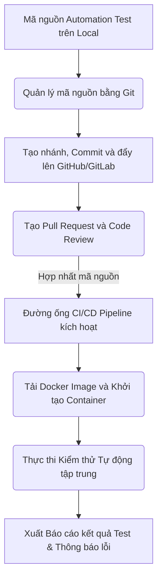
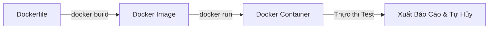
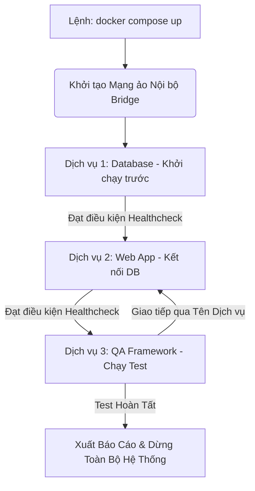

# 📁 10. Git, CI/CD Pipeline & Docker

*Mục tiêu: Đưa bộ mã nguồn kiểm thử tự động (Automation Test Framework) vào quy trình phân phối sản phẩm tự động, làm chủ hệ thống quản lý phiên bản Git, thiết lập đường ống CI/CD liên tục và đóng gói môi trường thực thi bằng Docker dưới góc nhìn của một Kỹ sư QA/SDET chuyên nghiệp.*

# **10.3. Containerization via Docker**

## 📌 Mục lục nội bộ (Chặng 10)

- [ ] [**10.1. Git Version Control for Testers**](./1_Git.md)
- [ ] [**10.2. CI/CD Pipelines Integration**](./2_CICD.md)
- [ ] [**10.3. Containerization via Docker**](./3_Docker.md)
  - [ ] [10.3.1. Docker Architecture: Image, Container, Dockerfile](#1031-docker-architecture-image-container-dockerfile)
  - [ ] [10.3.2. Multi-container Setup using Docker Compose for Automation Framework](#1032-multi-container-setup-using-docker-compose-for-automation-framework)
- [ ] [**10.4. Linux & CLI Essentials**](./4_LinuxCLI.md)
---

## 🗺️ Bản đồ Tiến trình Tích hợp Tự động hóa Luồng DevOps cho QA

Sơ đồ đơn sắc dưới đây mô tả cách một Kỹ sư QA vận hành mã nguồn kiểm thử từ máy cục bộ, quản lý phiên bản qua Git, đóng gói bằng Docker và kích hoạt chạy tự động trên đường ống CI/CD:



---

# 10.3.1. Docker Architecture: Image, Container, Dockerfile

Công nghệ đóng gói mã nguồn dưới dạng vùng chứa (Containerization) là kỹ năng cốt lõi giúp Kỹ sư QA/SDET giải quyết triệt để bài toán đồng bộ môi trường thực thi. Docker cho phép đóng gói toàn bộ mã nguồn Test Framework, cấu hình hệ điều hành, SDK, thư viện phụ thuộc và nhân trình duyệt vào một thực thể duy nhất, đảm bảo bộ kịch bản kiểm thử tự động luôn chạy ổn định trên mọi môi trường từ máy Local cá nhân đến các Runner đám mây xa xôi.

## ⚙️ Bản chất chuyên sâu về cấu trúc kiến trúc của Docker

Docker không phải là máy ảo (Virtual Machine). Trong khi máy ảo bắt buộc phải bao gồm cả một hệ điều hành khách (Guest OS) hoàn chỉnh và chạy trên bộ điều phối phần cứng (Hypervisor) gây tốn tài nguyên, thì Docker Container chia sẻ chung nhân hệ điều hành của máy chủ (Host OS Kernel). Docker cô lập các luồng tài nguyên phần cứng thông qua các cơ chế `Namespaces` và `Cgroups` của Linux, giúp khởi động môi trường test chỉ trong vài giây.

Quy trình vận hành Docker cho một QA Automation Framework dựa trên 3 thành phần kiến trúc có mối quan hệ nhân quả:
1. **Dockerfile:** Tệp cấu hình dạng văn bản thuần chứa chuỗi các dòng lệnh tuần tự để hướng dẫn Docker cách xây dựng môi trường kiểm thử.
2. **Docker Image (Ảnh chụp hệ thống):** Một tệp tin đóng băng, chỉ đọc (Read-only Template) được sinh ra sau khi biên dịch Dockerfile. Image đóng vai trò như một blueprint chứa đầy đủ mã nguồn test và nhân trình duyệt cấu hình sẵn.
3. **Docker Container (Vùng chứa thực thi):** Một thực thể sống (Runtime Instance) được khởi tạo từ Docker Image. Đây chính là không gian cô lập hoàn toàn, nơi bộ kịch bản kiểm thử tự động được thực thi trong thực tế.



---

## 📊 Ma trận Thành phần Kỹ thuật Docker & Luồng cô lập môi trường cho QA

Dưới đây là bảng phân rã chi tiết về cơ chế vận hành lệnh Docker, vai trò tối ưu hạ tầng của một QA thực chiến và các lỗi hệ thống phát sinh:

| Câu lệnh / Thành phần | Cơ chế hoạt động kỹ thuật | QA Automation Focus (Trọng tâm thực chiến) | Defect thực tế (Lỗi phát sinh hệ thống & Cách sửa) |
| :--- | :--- | :--- | :--- |
| **`FROM` (Dockerfile)** | Định nghĩa lớp nền tảng (Base Image) cho vùng chứa. Thường dùng nhân Node.js, Python hoặc Image chính chủ của Playwright. | QA chọn Base Image có kích thước gọn nhẹ (như bản Alpine Linux hoặc Slim) và chứa đúng phiên bản SDK để giảm thời gian tải của đường ống CI. | **Lỗi không tương thích phiên bản (Version Drift):** Bản Node ở Base Image quá cũ khiến Test Framework sử dụng tính năng mới bị crash. <br>*Cách sửa:* Khóa cứng phiên bản cụ thể, ví dụ: `FROM node:20-bookworm`. |
| **`RUN` (Dockerfile)** | Thực thi câu lệnh terminal bên trong môi trường ảo trong quá trình xây dựng Image để cài đặt thư viện hoặc nhân trình duyệt. | QA gom các lệnh cài đặt hệ thống vào một dòng duy nhất bằng toán tử `&&` nhằm tối ưu cấu trúc phân tầng (Layers) và giảm dung lượng Image. | **Thiếu thư viện hệ thống (Missing Shared Libraries):** Trình duyệt Chromium không thể khởi động vì thiếu thư viện đồ họa của Linux. <br>*Cách sửa:* Thêm lệnh cài đặt dependencies hệ thống hoặc dùng image dựng sẵn của Playwright. |
| **`docker build`** | Đọc các chỉ thị từ Dockerfile để tạo ra một bản đóng gói Image hoàn chỉnh và lưu vào kho lưu trữ nội bộ. | QA thực hiện đặt tên thẻ tag rõ ràng (`-t`) đi kèm mã phiên bản để dễ dàng đồng bộ và quản lý lịch sử phát hành của Framework. | **Lỗi sưng to dung lượng Image (Bloated Image):** Image nặng hơn 3GB do dính cả file log rác và tệp report cũ từ máy local. <br>*Cách sửa:* Sử dụng tệp cấu hình `.dockerignore` để loại trừ các thư mục rác ra khỏi luồng build. |
| **`docker run`** | Khởi tạo một Container hoàn toàn mới từ Image và kích hoạt mã lệnh chạy bài test được cấu hình sẵn. | QA sử dụng tham số truyền biến môi trường (`-e`) để thay đổi linh hoạt URL môi trường cần test (Test Staging hoặc Test UAT) mà không cần build lại Image. | **Mất dữ liệu báo cáo (Ephemeral Data Loss):** Bài test chạy xong, container bị xóa làm mất sạch file báo cáo kết quả. <br>*Cách sửa:* Sử dụng kỹ thuật gắn ổ đĩa chia sẻ (`-v` hoặc Volume Mounting) để kéo file report từ container ra máy thật. |

---

## 💡 Ví dụ thực tế liên hoàn: Viết Dockerfile và Vận hành Kiểm thử Vùng chứa

Dưới đây là kịch bản thực tế đóng gói một bộ Test Framework chạy bằng Node.js và Playwright để thực thi kiểm thử an toàn trong Docker:

### 1. Viết tệp cấu hình xây dựng môi trường (`Dockerfile`)
Tester tạo một tệp có tên chính xác là `Dockerfile` tại thư mục gốc của dự án:
```dockerfile
# Bước 1: Chọn Base Image chứa sẵn Node.js và các nhân trình duyệt của Playwright
FROM ://microsoft.com

# Bước 2: Thiết lập thư mục làm việc mặc định bên trong Container
WORKDIR /automation-workspace

# Bước 3: Sao chép tệp quản lý thư viện vào trước để tận dụng cơ chế cache layer
COPY package*.json ./

# Bước 4: Cài đặt sạch toàn bộ các thư viện phụ thuộc của dự án
RUN npm ci

# Bước 5: Sao chép toàn bộ mã nguồn kiểm thử từ máy thật vào trong Container
COPY . .

# Bước 6: Định nghĩa lệnh mặc định sẽ kích hoạt khi Container được khởi chạy
CMD ["npx", "playwright", "test"]
```

### 2. Chuẩn bị tệp loại trừ rác (`.dockerignore`)
Để tránh copy tệp rác làm nặng vùng chứa, Tester tạo file `.dockerignore`:
```text
node_modules
playwright-report
test-results
.git
.env
```

### 3. Chu kỳ thực thi lệnh của QA tại Terminal máy cục bộ
Để chạy thử nghiệm kịch bản trong môi trường cô lập, QA thực hiện chuỗi lệnh sau:
```bash
# Tiến hành đóng gói Test Framework thành Image có tên "qa-playwright-framework"
docker build -t qa-playwright-framework:1.0 .

# Khởi chạy Container, gắn volume để đưa tệp report ra máy thật và truyền biến URL môi trường
docker run --rm \
  -v \$(pwd)/playwright-report:/automation-workspace/playwright-report \
  -e BASE_URL="https://example.com" \
  qa-playwright-framework:1.0
```
*Kết quả:* Bộ test chạy hoàn toàn trong container, không phụ thuộc vào việc máy thật có cài trình duyệt hay không. Sau khi chạy xong, container tự động hủy (`--rm`) nhưng file báo cáo vẫn xuất hiện đầy đủ tại thư mục `playwright-report` của máy thật.

---

> ⚠️ **NGUYÊN LÝ BẤT BIẾN:** Tuyệt đối không bao giờ được cấu hình cứng quyền quản trị tối cao `USER root` chạy ngầm cố định bên trong các Dockerfile dùng cho môi trường Enterprise CI/CD. Hành vi này vi phạm nghiêm trọng quy chuẩn an ninh bảo mật hạ tầng Container, tạo điều kiện cho các đoạn mã độc hoặc mã khai thác lỗi lọt vào vùng chứa có quyền can thiệp thẳng vào hệ thống Host OS của doanh nghiệp. Bạn bắt buộc phải chuyển sang sử dụng tài khoản có đặc quyền hạn chế (Ví dụ: `USER pwuser` của image Playwright dựng sẵn).

---

📚 **References**
* *ISTQB® Certified Tester Advanced Level (CTAL) Technical Test Analyst Syllabus* - Section 4.3: *Test Environment and Tooling (Virtualization and Containerization)*.
* *Docker Official Reference Documentation.* - *Best practices for writing Dockerfiles*.
* *Microsoft Playwright Tooling Docs.* - *Running Playwright tests in Docker containers*.


# 10.3.2. Multi-container Setup using Docker Compose for Automation Framework

Kỹ thuật thiết lập đa vùng chứa (Multi-container Setup) bằng Docker Compose là giải pháp giúp Kỹ sư QA/SDET giả lập một hệ thống mạng nội bộ cô lập hoàn chỉnh. Thay vì chỉ chạy kịch bản kiểm thử độc lập, Docker Compose cho phép khởi tạo đồng thời Test Framework, ứng dụng (App SUT), hệ quản trị cơ sở dữ liệu (Database), và các dịch vụ giả lập bên thứ ba (Mock Server) chỉ bằng một câu lệnh duy nhất, giúp kiểm soát toàn diện môi trường kiểm thử hộp đen ở tầng tích hợp hệ thống.

## ⚙️ Bản chất chuyên sâu về cơ chế điều phối của Docker Compose

Docker Compose là một công cụ điều phối (Orchestration Tool) hoạt động dựa trên tệp cấu hình duy nhất `docker-compose.yml`. Thay vì Tester phải tự gõ hàng loạt lệnh `docker run` thủ công với các tham số mạng phức tạp, Docker Compose tự động hóa chu trình thiết lập hạ tầng thông qua 3 cơ chế kiến trúc:

1. **Service Definition (Định nghĩa dịch vụ):** Biến mỗi thành phần của hệ thống thành một dịch vụ (`service`) độc lập chạy từ một Docker Image riêng biệt.
2. **Isolated Network Bridge (Mạng cầu nội bộ):** Tự động khởi tạo một mạng ảo dùng chung cho tất cả các service. Các vùng chứa có thể giao tiếp, gọi API, hoặc truy vấn dữ liệu chéo của nhau thông qua tên dịch vụ (Service Name) như một DNS nội bộ, thay vì dùng địa chỉ IP tĩnh.
3. **Dependency Mapping (Bản đồ phụ thuộc luồng):** Sử dụng các chỉ thị kiểm tra điều kiện sức khỏe hệ thống để đảm bảo thứ tự khởi động tuyến tính: Cơ sở dữ liệu phải sẵn sàng trước $\rightarrow$ Ứng dụng khởi chạy xong $\rightarrow$ Cuối cùng Test Framework mới kích hoạt chạy kịch bản kiểm thử.



---

## 📊 Ma trận Khai báo Chỉ thị Docker Compose & Mô hình Kiểm soát Hạ tầng cho QA

Dưới đây là bảng phân rã chi tiết về các từ khóa cấu hình tối quan trọng trong tệp Compose, vai trò điều phối môi trường thực chiến của QA và các lỗi hệ thống phát sinh:

| Từ khóa Cấu hình | Cơ chế hoạt động kỹ thuật | QA Automation Focus (Trọng tâm thực chiến) | Defect thực tế (Lỗi phát sinh hệ thống & Cách sửa) |
| :--- | :--- | :--- | :--- |
| **`services:`** | Nhóm đầu não chứa danh sách toàn bộ các vùng chứa cần khởi tạo trong mạng lưới kiểm thử. | QA phân tách rõ cấu trúc tài nguyên, gán các cổng (`ports`) giao tiếp và thiết lập thư mục build mã nguồn cho từng vùng chứa. | **Lỗi xung đột cổng (Port Collision):** Cổng `8080` của Web App trùng với cổng một ứng dụng khác đang chạy trên máy thật. <br>*Cách sửa:* Thay đổi ánh xạ cổng ngoài máy thật, ví dụ: `8082:8080`. |
| **`depends_on:`** | Thiết lập mối quan hệ phụ thuộc giữa các service. Có thể mở rộng bằng điều kiện `condition: service_healthy`. | Trọng tâm cốt lõi để chặn lỗi Flaky Test. Đảm bảo bộ kịch bản kiểm thử không bị kích hoạt quá sớm khi Web App còn đang tải cấu hình. | **Lỗi chạy trước hệ thống (Race Condition Bug):** Test Framework khởi chạy khi Web App chưa bật xong dẫn đến lỗi kết nối `ECONNREFUSED`. <br>*Cách sửa:* Sử dụng cấu hình kiểm tra sức khỏe `healthcheck` cho dịch vụ gốc. |
| **`networks:`** | Khai báo mạng ảo dùng chung để cô lập luồng dữ liệu của môi trường test với thế giới bên ngoài. | QA đặt tên mạng đồng bộ để cho phép Test Framework gọi trực tiếp tên dịch vụ của Web App (Ví dụ: `http://web-app:3000/api`) một cách sạch sẽ. | **Lỗi mất kết nối nội bộ (Network Isolation Defect):** Test Framework không thể gửi gói tin API tới App do khai báo sai nhánh mạng. <br>*Cách sửa:* Đăng ký chung một tên mạng nội bộ cho tất cả các service. |
| **`volumes:`** | Khởi tạo phân vùng lưu trữ cố định hoặc liên kết thư mục giữa máy thật và các container bên trong mạng. | QA sử dụng để kéo tệp kết quả báo cáo (`playwright-report`) hoặc file log lỗi từ container ra máy thật trước khi toàn bộ hệ thống bị dọn dẹp. | **Lỗi ghi đè phân quyền (Permission Denied):** Container không có quyền ghi file báo cáo vào thư mục dùng chung của máy thật. <br>*Cách sửa:* Cấu hình phân quyền người dùng tương thích hoặc chạy container dưới quyền user hạn chế. |

---

## 💡 Ví dụ thực tế liên hoàn: Thiết lập Môi trường Kiểm thử Tích hợp Đa vùng chứa

Dưới đây là kịch bản thực tế thiết lập một môi trường kiểm thử tự động toàn diện bao gồm: Một dịch vụ Mock API Server (giả lập cổng thanh toán) và một vùng chứa chạy bộ kịch bản kiểm thử Playwright Automation Test:

### 📁 Mã nguồn Tệp `docker-compose.yml`
```yaml
version: '3.8'

networks:
  qa-isolated-network:
    driver: bridge

services:
  # Dịch vụ 1: Giả lập API bên thứ ba sử dụng WireMock
  mock-payment-gateway:
    image: wiremock/wiremock:3.3.1
    container_name: integration-mock-server
    ports:
      - "8080:8080"
    networks:
      - qa-isolated-network
    volumes:
      - ./stubs:/home/wiremock
    healthcheck:
      test: ["CMD", "curl", "-f", "http://localhost:8080/__admin/mappings"]
      interval: 5s
      timeout: 3s
      retries: 3

  # Dịch vụ 2: Vùng chứa thực thi kịch bản kiểm thử tự động QA
  qa-automation-framework:
    build:
      context: .
      dockerfile: Dockerfile
    container_name: e2e-test-runner
    networks:
      - qa-isolated-network
    environment:
      # Truyền địa chỉ endpoint của Mock Server thông qua tên dịch vụ trong mạng nội bộ
      - TARGET_API_URL=http://mock-payment-gateway:8080
      - ENVIRONMENT=Integration-Test
    volumes:
      - ./playwright-report:/automation-workspace/playwright-report
      - ./test-results:/automation-workspace/test-results
    depends_on:
      mock-payment-gateway:
        condition: service_healthy
```

### 🎯 Chu trình vận hành Terminal của Kỹ sư QA thực chiến:
Để khởi động toàn bộ ma trận kiểm thử này, QA chỉ cần thực thi chuỗi lệnh điều phối sau tại terminal:
```bash
# Bước 1: Kích hoạt toàn bộ hệ thống, tự động dựng hình và chạy ngầm Mock Server
docker compose up --build --exit-code-from qa-automation-framework

# Bước 2: Sau khi quá trình test kết thúc, dọn dẹp sạch toàn bộ hạ tầng ảo để giải phóng tài nguyên
docker compose down -v
```
*Phân tích hành vi kỹ thuật:* Tham số `--exit-code-from qa-automation-framework` là chỉ thị tối quan trọng cho đường ống CI. Nó bắt ép Docker Compose phải lấy mã trạng thái trả về (Exit Code) của chính vùng chứa chạy test để làm kết quả cho toàn bộ đường ống. Nếu bộ test có lỗi FAILED (Exit Code = 1), đường ống CI của doanh nghiệp sẽ lập tức chuyển đỏ và chặn đứng luồng phát hành.

---

> ⚠️ **NGUYÊN LÝ BẤT BIẾN:** Tuyệt đối không bao giờ được phép sử dụng chỉ thị gắn phân vùng volume một chiều để đồng bộ ngược thư mục mã nguồn thư viện hệ thống (`node_modules`, `venv`, `target`) từ máy cục bộ local đè vào bên trong vùng chứa của dịch vụ lúc chạy test trên CI. Hành vi này sẽ phá hủy hoàn toàn tính cô lập của Docker, làm lẫn lộn các thư viện biên dịch chéo giữa hệ điều hành máy thật (Host OS) và hệ điều hành của Container (Guest OS), gây ra các lỗi sập hệ thống không thể dự đoán.

---

📚 **References**
* *ISTQB® Certified Tester Advanced Level (CTAL) Technical Test Analyst Syllabus* - Section 4.3: *Test Environment Deployment and Service Virtualization*.
* *Docker Compose Official Specification Standard.* - *Compose file reference guide*.
* *WireMock Cloud & Containerization Architecture Manual.* - *Running WireMock with Docker Compose for Integration Testing*.
