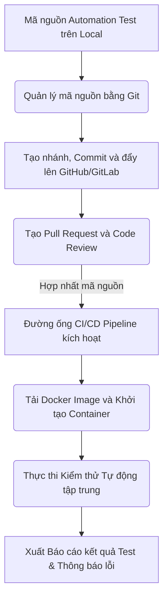
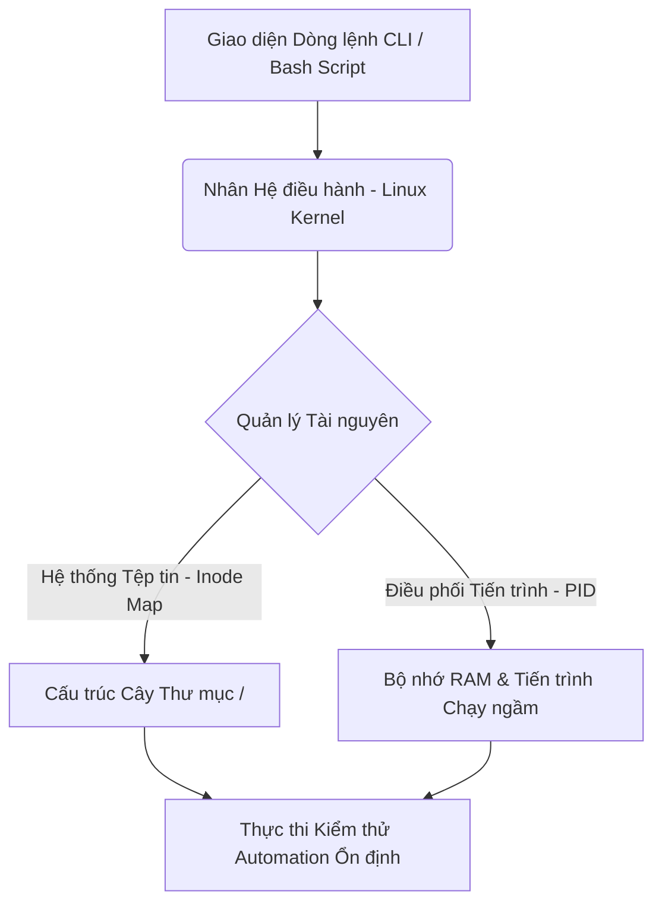

# 📁 10. Git, CI/CD Pipeline & Docker

*Mục tiêu: Đưa bộ mã nguồn kiểm thử tự động (Automation Test Framework) vào quy trình phân phối sản phẩm tự động, làm chủ hệ thống quản lý phiên bản Git, thiết lập đường ống CI/CD liên tục và đóng gói môi trường thực thi bằng Docker dưới góc nhìn của một Kỹ sư QA/SDET chuyên nghiệp.*

# **10.4. Linux & CLI Essentials**

## 📌 Mục lục nội bộ (Chặng 10)

- [ ] [**10.1. Git Version Control for Testers**](./1_Git.md)
- [ ] [**10.2. CI/CD Pipelines Integration**](./2_CICD.md)
- [ ] [**10.3. Containerization via Docker**](./3_Docker.md)
- [ ] [**10.4. Linux & CLI Essentials**](./4_LinuxCLI.md)
  - [ ] [10.4.1. File System Navigation, Process Management & Basic Bash Scripting](#1041-file-system-navigation-process-management-basic-bash-scripting)

---

## 🗺️ Bản đồ Tiến trình Tích hợp Tự động hóa Luồng DevOps cho QA

Sơ đồ đơn sắc dưới đây mô tả cách một Kỹ sư QA vận hành mã nguồn kiểm thử từ máy cục bộ, quản lý phiên bản qua Git, đóng gói bằng Docker và kích hoạt chạy tự động trên đường ống CI/CD:



---

# 10.4.1. File System Navigation, Process Management & Basic Bash Scripting

Làm chủ giao diện dòng lệnh (CLI) và hệ điều hành Linux là kỹ năng nền tảng bắt buộc để Kỹ sư QA/SDET tương tác trực tiếp với máy chủ chứa mã nguồn, điều phối môi trường ảo hóa Docker Container và xây dựng các tệp kịch bản tự động hóa (Bash Script) nhằm tối ưu hóa chuỗi quy trình chạy thử nghiệm trên các hệ thống CI/CD tập trung.

## ⚙️ Bản chất chuyên sâu về cơ chế quản lý hệ thống của Linux

Hệ điều hành Linux tổ chức dữ liệu theo một cấu trúc hình cây duy nhất (Single-tree Hierarchy) bắt đầu từ thư mục gốc (`/`). Khác với Windows phân tách thành các ổ đĩa độc lập (C:, D:), mọi phân vùng ổ cứng, thiết bị phần cứng, hay thư mục chia sẻ trong Linux đều được ánh xạ thành các tệp tin dưới nguyên lý cốt lõi: *"Everything is a file"*.

Cơ chế quản lý hệ thống của Linux chia làm hai thành phần xử lý song song:
1. **File System Table (Bản đồ chỉ mục):** Sử dụng các số định danh `Inode` để lưu trữ siêu dữ liệu (Metadata) của tệp tin (quyền truy cập, dung lượng, thời gian sửa đổi) tách biệt hoàn toàn với tên tệp thực tế.
2. **Process Control Block (Khối điều khiển tiến trình):** Mỗi khi một câu lệnh hoặc kịch bản kiểm thử (như Playwright Runner) được kích hoạt, Linux cấp phát một mã định danh tiến trình duy nhất (`PID`). Tiến trình này vận hành cô lập trong không gian bộ nhớ được giám sát chặt chẽ bởi nhân hệ điều hành (Kernel).



---

## 📊 Ma trận Câu lệnh CLI Cốt lõi & Luồng xử lý Sự cố Hạ tầng cho QA

Dưới đây là bảng phân rã chi tiết các nhóm lệnh Linux thực chiến, vùng tác động kỹ thuật, trọng tâm xử lý lỗi của Tester và các defect hệ thống phát sinh:

| Câu lệnh Linux | Phân nhóm Chức năng | QA Focus (Trọng tâm thực chiến) | Defect thực tế (Lỗi phát sinh & Cách xử lý) |
| :--- | :--- | :--- | :--- |
| **`pwd` / `cd` / `ls -la`** | Thư mục & Chỉ mục (Navigation) | QA dùng để di chuyển chính xác vào thư mục chứa mã nguồn Test Framework, hiển thị tất cả các tệp ẩn (như `.env`, `.gitignore`) để kiểm tra cấu hình. | **Lỗi sai đường dẫn (No such file):** Viết sai cấu trúc đường dẫn tuyệt đối/tương đối khi gọi file config. <br>*Cách sửa:* Dùng `pwd` để định vị vị trí hiện tại và dùng `ls` kiểm tra tên file. |
| **`mkdir -p` / `rm -rf`** | Quản lý Tệp tin (File Manipulation) | Tạo tự động các phân cấp thư mục chứa báo cáo kết quả và dọn dẹp sạch toàn bộ dữ liệu chạy thử nghiệm cũ trước khi kích hoạt bộ test mới. | **Lỗi xóa sổ hệ thống (Calamitous Deletion):** Chạy lệnh nguy hiểm `rm -rf /` hoặc cách khoảng trắng nhầm `rm -rf / path/to/report`. <br>*Cách sửa:* Tuyệt đối không dùng quyền root bừa bãi; sử dụng biến môi trường rõ ràng. |
| **`grep -r` / `tail -f`** | Phân tích Log hệ thống (Log Inspection) | Truy vết thời gian thực tệp tin log của Server (`error.log`) để bắt các mã lỗi ngầm (như Crash 500, NullPointerException) khi kịch bản UI chạy qua. | **Tràn màn hình terminal:** File log quá lớn khiến Tester không thể đọc được lỗi. <br>*Cách sửa:* Phối hợp lệnh lọc, ví dụ: `tail -n 100 app.log \| grep "Exception"`. |
| **`ps aux` / `top`** | Giám sát Tài nguyên (Resource Monitor) | Theo dõi dung lượng RAM và CPU bị chiếm dụng bởi các trình duyệt ảo ngầm (Chromium, Firefox) để phát hiện lỗi rò rỉ bộ nhớ của mã nguồn. | **Nghẽn tài nguyên máy chủ (OOM Killer):** Máy chủ CI bị đơ do các trình duyệt ảo chạy song song ngốn sạch RAM. <br>*Cách sửa:* Theo dõi cột `%MEM` qua lệnh `top` để cấu hình giới hạn luồng chạy. |
| **`kill -9 <PID>`** | Điều khiển Tiến trình (Process Control) | Ép buộc dừng ngay lập tức các tiến trình chạy ngầm của trình duyệt ảo bị treo (Zombie Processes) từ các lượt chạy CI trước đó để giải phóng tài nguyên. | **Treo cổng kết nối (Port Already in Use):** Không thể bật Server Test do tiến trình cũ vẫn đang chiếm giữ cổng. <br>*Cách sửa:* Dùng `lsof -i :8080` để tìm ra `PID` đang chiếm cổng, sau đó chạy lệnh `kill -9`. |
| **`chmod +x`** | Phân quyền Hệ thống (Permission Rule) | Cấp đặc quyền thực thi cho tệp kịch bản Bash Script trước khi đẩy lên đường ống CI/CD. | **Lỗi từ chối thực thi (Permission Denied):** Đường ống CI bị sập vì không có quyền chạy file script `.sh`. <br>*Cách sửa:* Chạy lệnh `chmod +x run-tests.sh` và commit lại lên Git. |

---

## 💡 Ví dụ thực tế liên hoàn: Khởi tạo Kịch bản Bash Script Chạy Test Toàn diện

Dưới đây là kịch bản thực tế một Kỹ sư QA viết tệp script tự động hóa tuần tự các bước: Dọn dẹp báo cáo cũ $\rightarrow$ Kích hoạt chạy kịch bản kiểm thử Playwright $\rightarrow$ Kiểm tra kết quả để tự động gửi cảnh báo khẩn cấp nếu có lỗi xảy ra.

### 📁 Mã nguồn Tệp `run-tests.sh`
```bash
#!/bin/bash

# Bắt ép script phải dừng lại lập tức nếu có bất kỳ câu lệnh con nào bị lỗi
set -e

echo "============================================="
echo "🚀 KHỞI ĐỘNG CHU TRÌNH KIỂM THỬ TỰ ĐỘNG"
echo "============================================="

REPORT_DIR="./playwright-report"

# Bước 1: Kiểm tra và dọn dẹp thư mục báo cáo cũ nếu tồn tại
if [ -d "\$REPORT_DIR" ]; then
    echo "🧹 Phát hiện báo cáo cũ. Tiến hành dọn dẹp thư mục: \$REPORT_DIR"
    rm -rf "\$REPORT_DIR"
fi

echo "📦 Đang kiểm tra trạng thái các tiến trình trình duyệt bị treo..."
# Tìm và tự động giải phóng các nhân trình duyệt cũ tránh nghẽn RAM (không bắt lỗi nếu không tìm thấy)
killall chrome chromium node 2>/dev/null || true

echo "🎯 Thực thi bộ kịch bản kiểm thử tự động hồi quy..."
# Tạm thời tắt cơ chế dừng lập tức để lấy được mã lỗi trả về của Framework
set +e
npx playwright test
TEST_EXIT_CODE=\$?
set -e

# Bước 2: Phân tích mã trạng thái trả về để điều phối luồng
if [ \$TEST_EXIT_CODE -eq 0 ]; then
    echo "✅ TOÀN BỘ KỊCH BẢN KIỂM THỬ ĐÃ PASSED THÀNH CÔNG!"
    exit 0
else
    echo "⚠️ CẢNH BÁO: PHÁT HIỆN KỊCH BẢN BỊ FAILED (Mã lỗi: \$TEST_EXIT_CODE)"
    echo "🔎 Đang trích xuất log lỗi nghiêm trọng nhất từ hệ thống..."
    
    # Quét nhanh qua file log để tìm dòng chứa lỗi Exception hiển thị ra màn hình
    if [ -f "error.log" ]; then
        grep -i "exception" error.log | tail -n 5 || echo "Không tìm thấy chuỗi Exception trong file log."
    fi
    
    echo "🚨 Đang kích hoạt luồng đóng băng phát hành sản phẩm..."
    exit \$TEST_EXIT_CODE
fi
```

---

> ⚠️ **NGUYÊN LÝ BẤT BIẾN:** Tuyệt đối không bao giờ được phép lạm dụng tiền tố quyền tối cao `sudo` đặt cố định bên trong các tệp kịch bản Bash Script sử dụng cho luồng chạy tự động hóa trên máy chủ CI/CD của doanh nghiệp. Hành vi này đòi hỏi hệ thống phải cấp phát đặc quyền can thiệp sâu vào nhân cấu trúc máy chủ mà không cần xác thực, tạo ra lỗ hổng an ninh nghiêm trọng (Privilege Escalation), có nguy cơ khiến toàn bộ hệ thống hạ tầng bị phá hủy nếu tệp script bị chèn mã độc.

---

📚 **References**
* *ISTQB® Certified Tester Foundation Level (CTFL) Syllabus v4.0* - Section 5.4.1: *Tool Support for Testing (Test Execution and Environment Tools)*.
* *Shotts, W. (2019). The Linux Command Line: A Complete Introduction.* No Starch Press - Chapter 4: *An Manipulating Files* & Chapter 24: *Writing Your First Script*.
* *IEEE Std 1003.1™-2017* - *The Open Group Base Specifications Issue 7 (POSIX Standard for Shell and Utilities)*.
