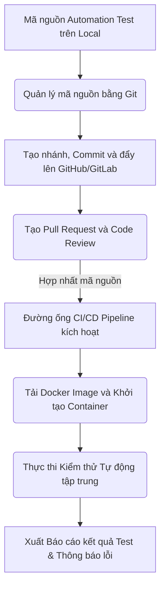

# 📁 10. Git, CI/CD Pipeline & Docker

*Mục tiêu: Đưa bộ mã nguồn kiểm thử tự động (Automation Test Framework) vào quy trình phân phối sản phẩm tự động, làm chủ hệ thống quản lý phiên bản Git, thiết lập đường ống CI/CD liên tục và đóng gói môi trường thực thi bằng Docker dưới góc nhìn của một Kỹ sư QA/SDET chuyên nghiệp.*

## 📌 Mục lục nội bộ (Chặng 10)

- [ ] [**10.1. Git Version Control for Testers**](./1_Git.md)
  - [ ] [10.1.1. Basic Git Workflow: Clone, Add, Commit, Push, Pull, Fetch](./1_Git.md#1011-basic-git-workflow-clone-add-commit-push-pull-fetch)
  - [ ] [10.1.2. Branching Strategies, Merging vs Rebase](./1_Git.md#1012-branching-strategies-merging-vs-rebase)
  - [ ] [10.1.3. Pull Request (PR) Lifecycle & Code Review for Automation Test](./1_Git.md#1013-pull-request-pr-lifecycle--code-review-for-automation-test)
- [ ] [**10.2. CI/CD Pipelines Integration**](./2_CICD.md)
  - [ ] [10.2.1. CI/CD Principles (Continuous Integration / Delivery / Deployment)](./2_CICD.md#1021-cicd-principles-continuous-integration-delivery-deployment)
  - [ ] [10.2.2. Building Test Pipelines with GitHub Actions & Jenkins](./2_CICD.md#1022-building-test-pipelines-with-github-actions-jenkins)
  - [ ] [10.2.3. GitLab CI/CD & Azure DevOps Test Automation Engines](./2_CICD.md#1023-gitlab-cicd-azure-devops-test-automation-engines)
- [ ] [**10.3. Containerization via Docker**](./3_Docker.md)
  - [ ] [10.3.1. Docker Architecture: Image, Container, Dockerfile](./3_Docker.md#1031-docker-architecture-image-container-dockerfile)
  - [ ] [10.3.2. Multi-container Setup using Docker Compose for Automation Framework](./3_Docker.md#1032-multi-container-setup-using-docker-compose-for-automation-framework)
- [ ] [**10.4. Linux & CLI Essentials**](./4_LinuxCLI.md)
  - [ ] [10.4.1. File System Navigation, Process Management & Basic Bash Scripting](./4_LinuxCLI.md#1041-file-system-navigation-process-management-basic-bash-scripting)

---

## 🗺️ Bản đồ Tiến trình Tích hợp Tự động hóa Luồng DevOps cho QA

Sơ đồ đơn sắc dưới đây mô tả cách một Kỹ sư QA vận hành mã nguồn kiểm thử từ máy cục bộ, quản lý phiên bản qua Git, đóng gói bằng Docker và kích hoạt chạy tự động trên đường ống CI/CD:

---

📚 **References**
* *ISTQB® Certified Tester Foundation Level (CTFL) Syllabus v4.0* - Section 2.1.4: *DevOps and Testing*.
* *Git Version Control Documentation* - Chuẩn quy trình cộng tác mã nguồn và quản lý nhánh phân phối.
* *Docker Official Architecture Reference* - Nguyên lý cô lập môi trường và tối ưu hóa hạ tầng thực thi kiểm thử.
